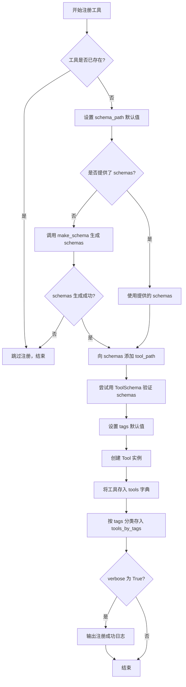
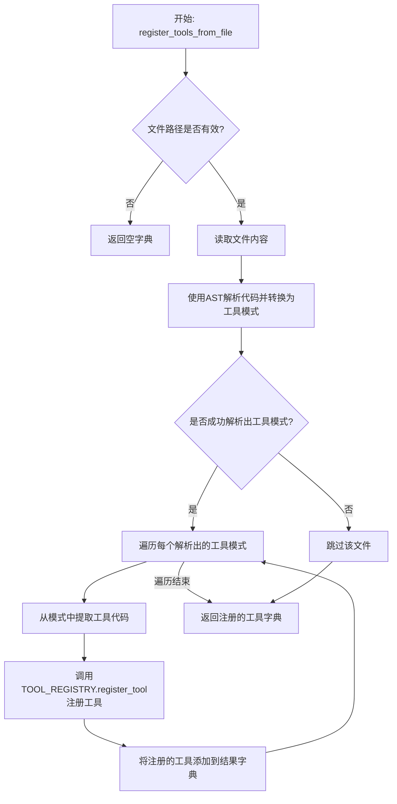
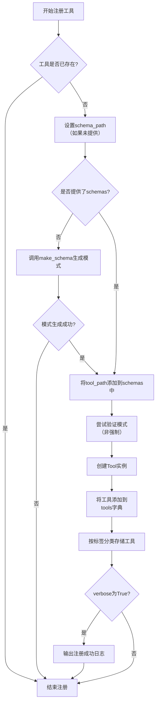
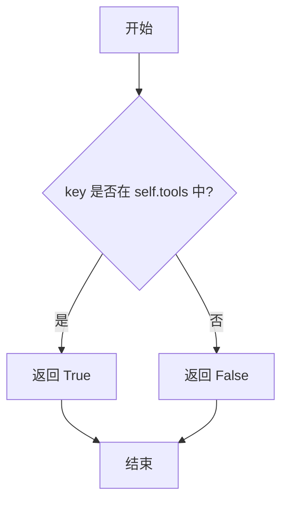
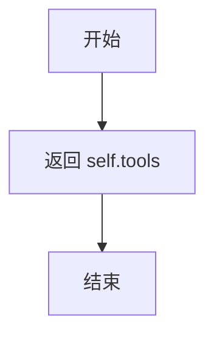
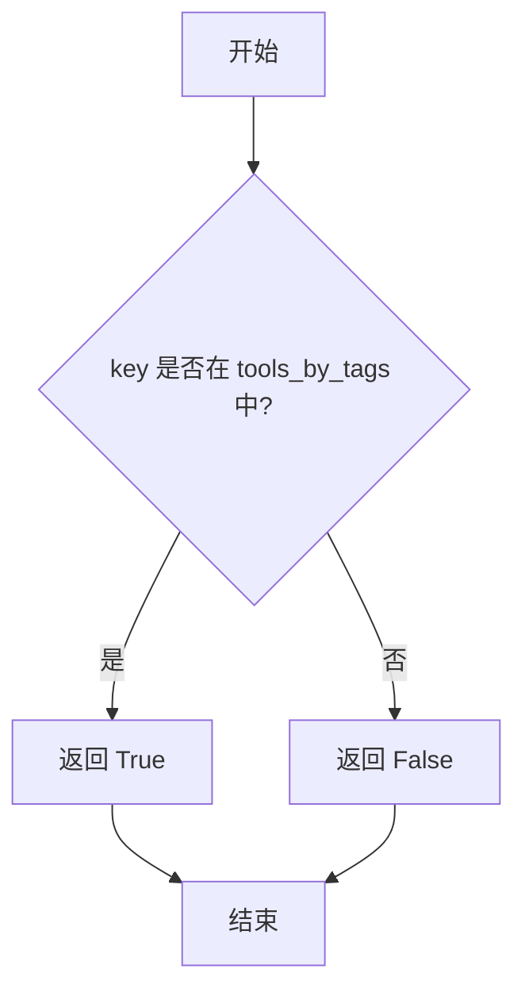
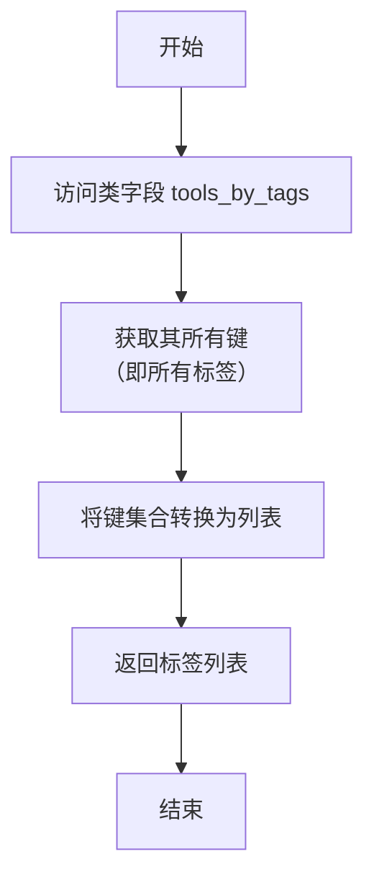

# `.\MetaGPT\metagpt\tools\tool_registry.py` 详细设计文档

该代码实现了一个工具注册中心（Tool Registry），用于动态发现、注册、验证和管理可调用的工具（Tool）。核心功能包括：通过装饰器或文件扫描自动注册工具类/函数，将工具代码转换为标准化的模式（Schema），支持按名称或标签（Tag）检索工具，并提供工具验证机制，为上层系统（如智能体）提供统一、可扩展的工具调用接口。

## 整体流程

```mermaid
graph TD
    A[开始] --> B{注册方式?}
    B -- 装饰器注册 --> C[使用@register_tool装饰类]
    B -- 文件/路径注册 --> D[调用register_tools_from_path]
    C --> E[获取类定义文件路径和源码]
    D --> F{路径类型?}
    F -- 文件 --> G[调用register_tools_from_file]
    F -- 目录 --> H[遍历目录下所有.py文件]
    H --> G
    G --> I[读取文件内容，使用AST解析]
    I --> J[调用convert_code_to_tool_schema_ast生成模式]
    E --> K[调用make_schema生成模式]
    J --> L[调用ToolRegistry.register_tool]
    K --> L
    L --> M{模式验证?}
    M -- 是 --> N[创建Tool对象并存入注册表]
    M -- 否/警告 --> N
    N --> O[工具注册完成]
    P[外部调用validate_tool_names] --> Q{输入类型?}
    Q -- 工具名 --> R[从注册表直接获取]
    Q -- 标签名 --> S[获取该标签下所有工具]
    Q -- 文件/目录路径 --> T[动态注册并获取工具]
    Q -- 带方法名的类工具 --> U[解析类名和方法名，过滤方法]
    R --> V[返回有效工具字典]
    S --> V
    T --> V
    U --> V
```

## 类结构

```
BaseModel (Pydantic基类)
└── ToolRegistry (工具注册中心主类)

全局函数:
├── register_tool (装饰器函数)
├── make_schema (模式生成函数)
├── validate_tool_names (工具验证函数)
├── register_tools_from_file (文件注册函数)
└── register_tools_from_path (路径注册函数)

全局变量:
└── TOOL_REGISTRY (全局注册中心实例)
```

## 全局变量及字段


### `TOOL_REGISTRY`
    
全局工具注册表实例，用于在整个应用中统一管理和访问所有已注册的工具。

类型：`ToolRegistry`
    


### `ToolRegistry.tools`
    
存储所有已注册工具的字典，键为工具名称，值为对应的Tool对象。

类型：`dict[str, Tool]`
    


### `ToolRegistry.tools_by_tags`
    
按标签分类组织的双层字典，第一层键为标签名，第二层为工具名称到Tool对象的映射。

类型：`dict[str, dict[str, Tool]]`
    
    

## 全局函数及方法

### `ToolRegistry.register_tool`

该方法用于向工具注册表（`ToolRegistry`）中注册一个新的工具。它会根据提供的参数（如工具名称、路径、源代码、标签等）创建或验证工具的模式（schema），并将工具实例存储到注册表的内部字典中，同时按标签进行分类存储。如果工具已存在，则跳过注册。

参数：

- `tool_name`：`str`，要注册的工具的名称。
- `tool_path`：`str`，工具对应代码文件的路径。
- `schemas`：`dict`，可选，工具的模式（schema）字典。如果未提供，将通过 `make_schema` 函数生成。
- `schema_path`：`str`，可选，工具模式文件的保存路径。默认为 `TOOL_SCHEMA_PATH` 目录下的 `{tool_name}.yml`。
- `tool_code`：`str`，可选，工具的源代码字符串。
- `tags`：`list[str]`，可选，工具的标签列表，用于分类。
- `tool_source_object`：`Any`，可选，工具的源对象（如类或函数），用于生成模式。
- `include_functions`：`list[str]`，可选，指定要包含在模式中的函数名列表。
- `verbose`：`bool`，可选，是否在注册时输出日志信息。

返回值：`None`，无返回值。

#### 流程图



#### 带注释源码

```python
def register_tool(
    self,
    tool_name: str,
    tool_path: str,
    schemas: dict = None,
    schema_path: str = "",
    tool_code: str = "",
    tags: list[str] = None,
    tool_source_object=None,  # can be any classes or functions
    include_functions: list[str] = None,
    verbose: bool = False,
):
    # 检查工具是否已存在，若存在则直接返回，避免重复注册
    if self.has_tool(tool_name):
        return

    # 如果未提供 schema_path，则使用默认路径：TOOL_SCHEMA_PATH/{tool_name}.yml
    schema_path = schema_path or TOOL_SCHEMA_PATH / f"{tool_name}.yml"

    # 如果未提供 schemas，则调用 make_schema 函数根据源对象生成
    if not schemas:
        schemas = make_schema(tool_source_object, include_functions, schema_path)

    # 如果 schemas 生成失败（为空），则直接返回，不注册
    if not schemas:
        return

    # 将工具的代码文件路径添加到 schemas 字典中
    schemas["tool_path"] = tool_path  # corresponding code file path of the tool
    try:
        # 尝试使用 ToolSchema 模型验证生成的 schemas 是否符合格式要求
        ToolSchema(**schemas)  # validation
    except Exception:
        # 即使验证失败也继续注册，但可以选择记录警告日志（此处被注释）
        pass
        # logger.warning(
        #     f"{tool_name} schema not conforms to required format, but will be used anyway. Mismatch: {e}"
        # )
    # 如果未提供 tags，则初始化为空列表
    tags = tags or []
    # 创建 Tool 实例，封装工具的所有信息
    tool = Tool(name=tool_name, path=tool_path, schemas=schemas, code=tool_code, tags=tags)
    # 将工具按名称存储到主字典中
    self.tools[tool_name] = tool
    # 将工具按标签分类存储到嵌套字典中
    for tag in tags:
        self.tools_by_tags[tag].update({tool_name: tool})
    # 如果 verbose 为 True，则输出注册成功的日志信息
    if verbose:
        logger.info(f"{tool_name} registered")
        logger.info(f"schema made at {str(schema_path)}, can be used for checking")
```

### `make_schema`

该函数是工具注册流程中的一个辅助函数，其核心职责是尝试将给定的源代码对象（如类或函数）转换为其对应的工具模式（Schema）。它首先尝试使用主转换函数 `convert_code_to_tool_schema` 进行转换，如果转换失败，则捕获异常并返回一个空字典，同时记录错误日志。

参数：

- `tool_source_object`：`Any`，需要被转换为工具模式的源代码对象，通常是一个类或函数。
- `include`：`list[str]`，一个可选的字符串列表，指定了在生成的模式中需要包含的函数或方法名称。
- `path`：`str`，一个可选的路径参数，在当前的函数实现中并未被使用，可能是为未来扩展预留的接口。

返回值：`dict`，返回一个字典，代表成功转换后的工具模式。如果转换过程中发生任何异常，则返回一个空字典 `{}`。

#### 流程图

```mermaid
graph TD
    A[开始: make_schema] --> B{尝试调用 convert_code_to_tool_schema};
    B -->|成功| C[返回生成的 schema 字典];
    B -->|失败，捕获异常 e| D[记录错误日志];
    D --> E[将 schema 置为空字典 {}];
    E --> C;
    C --> F[结束: 返回 schema];
```

#### 带注释源码

```python
def make_schema(tool_source_object, include, path):
    """
    尝试将源代码对象转换为工具模式。
    
    参数:
        tool_source_object: 需要转换的源代码对象（如类或函数）。
        include: 一个列表，指定需要包含在模式中的函数/方法名。
        path: 路径参数（当前未使用）。
    
    返回值:
        成功时返回工具模式字典，失败时返回空字典。
    """
    try:
        # 主要转换逻辑：调用外部函数将代码对象转换为模式字典
        schema = convert_code_to_tool_schema(tool_source_object, include=include)
    except Exception as e:
        # 转换失败时的异常处理：记录错误并将结果置为空
        schema = {}
        logger.error(f"Fail to make schema: {e}")

    # 返回转换结果（成功时为模式字典，失败时为空字典）
    return schema
```

### `validate_tool_names`

该函数用于验证并获取有效的工具列表。它接受一个工具标识符列表（可以是工具名、工具标签或工具文件/目录路径），并返回一个字典，其中键是有效的工具名，值是对应的 `Tool` 对象。函数会处理多种输入格式，包括带方法指定的类工具（如 `Editor:read,write`），并自动注册通过路径提供的工具。

参数：

- `tools`：`list[str]`，一个字符串列表，每个字符串可以是工具名、工具标签或工具文件/目录路径。

返回值：`dict[str, Tool]`，一个字典，键是有效的工具名，值是对应的 `Tool` 对象。

#### 流程图

```mermaid
graph TD
    A[开始: validate_tool_names(tools)] --> B{检查tools是否为list};
    B -- 否 --> C[抛出断言错误];
    B -- 是 --> D[初始化valid_tools = {}];
    D --> E[遍历tools中的每个key];
    E --> F{判断key类型};
    F -- 是文件或目录路径 --> G[调用register_tools_from_path(key)注册工具];
    G --> H[将注册的工具更新到valid_tools];
    F -- 是已注册的工具名 --> I{检查key是否包含':'};
    I -- 是 --> J[解析类工具名和方法名];
    J --> K[获取类工具对象];
    K --> L[过滤出指定的方法];
    L --> M[创建过滤后的工具副本];
    M --> N[将过滤后的工具添加到valid_tools];
    I -- 否 --> O[直接获取工具对象并添加到valid_tools];
    F -- 是已注册的工具标签 --> P[通过标签获取工具字典];
    P --> Q[将工具字典更新到valid_tools];
    F -- 其他 --> R[记录警告: 无效的工具名或标签];
    H --> S[继续遍历];
    N --> S;
    O --> S;
    Q --> S;
    R --> S;
    S --> T{是否遍历完所有key?};
    T -- 否 --> E;
    T -- 是 --> U[返回valid_tools];
    C --> V[结束];
    U --> V;
```

#### 带注释源码

```python
def validate_tool_names(tools: list[str]) -> dict[str, Tool]:
    # 确保输入是一个字符串列表
    assert isinstance(tools, list), "tools must be a list of str"
    # 初始化一个空字典来存储有效的工具
    valid_tools = {}
    # 遍历输入列表中的每个工具标识符
    for key in tools:
        # 判断标识符类型：可以是工具名、工具标签或工具文件/目录路径
        # 如果是文件或目录路径，则自动注册该路径下的所有工具
        if os.path.isdir(key) or os.path.isfile(key):
            # 调用register_tools_from_path注册工具，并更新到有效工具字典
            valid_tools.update(register_tools_from_path(key))
        # 如果标识符是已注册的工具名（可能包含方法指定，如"Editor:read,write"）
        elif TOOL_REGISTRY.has_tool(key.split(":")[0]):
            # 检查是否包含冒号（表示指定了类工具的方法）
            if ":" in key:
                # 解析类工具名和方法名列表
                class_tool_name = key.split(":")[0]
                method_names = key.split(":")[1].split(",")
                # 从注册表中获取类工具对象
                class_tool = TOOL_REGISTRY.get_tool(class_tool_name)

                # 初始化一个空字典来存储过滤后的方法
                methods_filtered = {}
                # 遍历指定的方法名
                for method_name in method_names:
                    # 如果方法存在于类工具的方法列表中，则添加到过滤字典
                    if method_name in class_tool.schemas["methods"]:
                        methods_filtered[method_name] = class_tool.schemas["methods"][method_name]
                    else:
                        # 如果方法不存在，记录警告并跳过
                        logger.warning(f"invalid method {method_name} under tool {class_tool_name}, skipped")
                # 创建类工具的深拷贝，以便修改方法列表而不影响原始对象
                class_tool_filtered = class_tool.model_copy(deep=True)
                # 更新拷贝对象的方法列表为过滤后的方法
                class_tool_filtered.schemas["methods"] = methods_filtered

                # 将过滤后的工具添加到有效工具字典
                valid_tools.update({class_tool_name: class_tool_filtered})
            else:
                # 如果不包含冒号，直接获取工具对象并添加到有效工具字典
                valid_tools.update({key: TOOL_REGISTRY.get_tool(key)})
        # 如果标识符是已注册的工具标签
        elif TOOL_REGISTRY.has_tool_tag(key):
            # 通过标签获取工具字典，并更新到有效工具字典
            valid_tools.update(TOOL_REGISTRY.get_tools_by_tag(key))
        else:
            # 如果标识符既不是路径、工具名也不是标签，记录警告并跳过
            logger.warning(f"invalid tool name or tool type name: {key}, skipped")
    # 返回包含所有有效工具的字典
    return valid_tools
```

### `register_tools_from_file`

从指定的Python文件中提取工具定义，将其转换为工具模式（schema），并注册到全局工具注册表（`TOOL_REGISTRY`）中。该函数主要用于批量注册工具，支持从单个文件或目录路径中自动发现和注册工具。

参数：

- `file_path`：`str`，需要注册工具的Python源文件的路径。

返回值：`dict[str, Tool]`，返回一个字典，其中键是注册成功的工具名称，值是对应的`Tool`对象。

#### 流程图



#### 带注释源码

```python
def register_tools_from_file(file_path) -> dict[str, Tool]:
    # 获取文件名，用于后续过滤
    file_name = Path(file_path).name
    # 过滤非Python文件、setup.py文件以及测试文件（以'test'开头）
    if not file_name.endswith(".py") or file_name == "setup.py" or file_name.startswith("test"):
        return {}
    # 用于存储本次调用成功注册的工具
    registered_tools = {}
    # 读取指定文件的全部文本内容
    code = Path(file_path).read_text(encoding="utf-8")
    # 使用AST（抽象语法树）解析代码，并将其转换为工具模式字典
    # 返回的tool_schemas是一个字典，键为工具名，值为对应的模式信息
    tool_schemas = convert_code_to_tool_schema_ast(code)
    # 遍历从文件中解析出的每一个工具模式
    for name, schemas in tool_schemas.items():
        # 从模式字典中弹出（移除并获取）工具的源代码，如果不存在则返回空字符串
        tool_code = schemas.pop("code", "")
        # 调用全局工具注册表的register_tool方法进行注册
        # 传入工具名、文件路径、模式信息、工具代码等参数
        TOOL_REGISTRY.register_tool(
            tool_name=name,
            tool_path=file_path,
            schemas=schemas,
            tool_code=tool_code,
        )
        # 从注册表中获取刚刚注册的工具对象，并添加到本次调用的结果字典中
        registered_tools.update({name: TOOL_REGISTRY.get_tool(name)})
    # 返回本次从该文件注册的所有工具
    return registered_tools
```

### `register_tools_from_path`

该函数用于从指定的文件路径或目录路径中自动发现并注册工具。如果路径指向一个文件，则直接处理该文件；如果路径指向一个目录，则递归遍历目录下的所有Python文件（排除测试文件和`setup.py`），并逐一注册其中定义的函数或类作为工具。

参数：

- `path`：`str`，文件或目录的路径。如果是文件，则直接注册该文件中的工具；如果是目录，则递归遍历目录下的所有Python文件进行注册。

返回值：`dict[str, Tool]`，返回一个字典，其中键为已注册的工具名称，值为对应的`Tool`对象。

#### 流程图

```mermaid
flowchart TD
    A[开始: register_tools_from_path(path)] --> B{path是文件?};
    B -- 是 --> C[调用 register_tools_from_file(path)];
    B -- 否 --> D{path是目录?};
    D -- 是 --> E[遍历目录下所有文件];
    E --> F[对每个文件调用 register_tools_from_file];
    F --> G[合并注册结果];
    D -- 否 --> H[返回空字典];
    C --> I[返回文件注册结果];
    G --> I;
    H --> I;
    I --> J[结束: 返回 tools_registered];
```

#### 带注释源码

```python
def register_tools_from_path(path) -> dict[str, Tool]:
    # 初始化一个空字典，用于存储所有注册成功的工具
    tools_registered = {}
    # 判断给定的路径是否是一个文件
    if os.path.isfile(path):
        # 如果是文件，直接调用 register_tools_from_file 函数处理该文件
        # 并将返回的注册工具字典合并到 tools_registered 中
        tools_registered.update(register_tools_from_file(path))
    # 判断给定的路径是否是一个目录
    elif os.path.isdir(path):
        # 如果是目录，使用 os.walk 递归遍历目录下的所有文件和子目录
        # root: 当前目录路径
        # _: 当前目录下的子目录列表（此处用下划线忽略，因为不需要）
        # files: 当前目录下的文件列表
        for root, _, files in os.walk(path):
            for file in files:
                # 构建每个文件的完整路径
                file_path = os.path.join(root, file)
                # 对每个文件调用 register_tools_from_file 函数
                # 并将返回的注册工具字典合并到 tools_registered 中
                tools_registered.update(register_tools_from_file(file_path))
    # 返回最终合并了所有注册工具的字典
    return tools_registered
```

### `ToolRegistry.register_tool`

该方法用于向工具注册表（`ToolRegistry`）中注册一个新的工具。它会根据提供的参数（如工具名称、路径、源代码、标签等）创建或验证工具的模式（schema），并将工具实例存储到注册表中。如果工具已存在，则跳过注册。注册成功后，工具会根据其标签被分类存储，便于后续按标签查询。

参数：

- `tool_name`：`str`，要注册的工具的名称，作为工具的唯一标识符。
- `tool_path`：`str`，工具对应代码文件的路径。
- `schemas`：`dict`，可选，工具的模式信息（如函数签名、参数描述等）。如果未提供，将根据`tool_source_object`自动生成。
- `schema_path`：`str`，可选，工具模式文件的保存路径。如果未提供，使用默认路径`TOOL_SCHEMA_PATH/{tool_name}.yml`。
- `tool_code`：`str`，可选，工具的源代码字符串。
- `tags`：`list[str]`，可选，工具的标签列表，用于对工具进行分类。
- `tool_source_object`：`Any`，可选，工具的源对象（如类或函数），用于自动生成模式。
- `include_functions`：`list[str]`，可选，指定需要包含在模式中的函数名列表（仅当`tool_source_object`为类时有效）。
- `verbose`：`bool`，可选，是否在注册时输出详细信息（如日志）。

返回值：`None`，该方法没有返回值，其作用是将工具注册到`ToolRegistry`实例中。

#### 流程图



#### 带注释源码

```python
def register_tool(
    self,
    tool_name: str,
    tool_path: str,
    schemas: dict = None,
    schema_path: str = "",
    tool_code: str = "",
    tags: list[str] = None,
    tool_source_object=None,  # can be any classes or functions
    include_functions: list[str] = None,
    verbose: bool = False,
):
    # 检查工具是否已存在，避免重复注册
    if self.has_tool(tool_name):
        return

    # 如果未提供schema_path，则使用默认路径
    schema_path = schema_path or TOOL_SCHEMA_PATH / f"{tool_name}.yml"

    # 如果未提供schemas，则根据源对象自动生成
    if not schemas:
        schemas = make_schema(tool_source_object, include_functions, schema_path)

    # 如果模式生成失败，则退出注册
    if not schemas:
        return

    # 将工具路径添加到模式信息中
    schemas["tool_path"] = tool_path  # corresponding code file path of the tool
    try:
        # 尝试验证模式是否符合ToolSchema格式（非强制，失败仅记录警告）
        ToolSchema(**schemas)  # validation
    except Exception:
        pass
        # logger.warning(
        #     f"{tool_name} schema not conforms to required format, but will be used anyway. Mismatch: {e}"
        # )
    # 处理标签，默认为空列表
    tags = tags or []
    # 创建Tool实例
    tool = Tool(name=tool_name, path=tool_path, schemas=schemas, code=tool_code, tags=tags)
    # 将工具存储到主字典中
    self.tools[tool_name] = tool
    # 按标签分类存储工具
    for tag in tags:
        self.tools_by_tags[tag].update({tool_name: tool})
    # 如果verbose为True，则输出注册成功的日志信息
    if verbose:
        logger.info(f"{tool_name} registered")
        logger.info(f"schema made at {str(schema_path)}, can be used for checking")
```

### `ToolRegistry.has_tool`

检查指定的工具名称是否已存在于工具注册表中。

参数：
- `key`：`str`，要检查的工具名称。

返回值：`bool`，如果工具名称存在于注册表中则返回 `True`，否则返回 `False`。

#### 流程图



#### 带注释源码

```python
def has_tool(self, key: str) -> bool:
    """
    检查工具注册表中是否存在指定名称的工具。

    参数:
        key (str): 要检查的工具名称。

    返回:
        bool: 如果工具存在则返回 True，否则返回 False。
    """
    return key in self.tools  # 直接检查工具名称是否在 self.tools 字典的键中
```

### `ToolRegistry.get_tool`

根据给定的工具名称（键）从工具注册表中检索并返回对应的 `Tool` 对象。如果键不存在，则返回 `None`。

参数：
-  `key`：`Any`，要检索的工具的名称或标识符。

返回值：`Tool | None`，如果找到则返回对应的 `Tool` 对象，否则返回 `None`。

#### 流程图

```mermaid
flowchart TD
    A[开始: get_tool(key)] --> B{检查 key 是否在<br>self.tools 字典中?}
    B -- 是 --> C[返回 self.tools.get(key)]
    B -- 否 --> D[返回 None]
    C --> E[结束]
    D --> E
```

#### 带注释源码

```python
def get_tool(self, key) -> Tool:
    # 使用字典的 get 方法，根据 key 查找对应的 Tool 对象。
    # 如果 key 不存在，则返回 None。
    return self.tools.get(key)
```

### `ToolRegistry.get_tools_by_tag`

根据给定的标签（tag）键，从工具注册表中检索并返回所有标记为该标签的工具。如果标签不存在，则返回一个空字典。

参数：

- `key`：`str`，要查询的工具标签名称。

返回值：`dict[str, Tool]`，一个字典，其中键是工具名称，值是对应的`Tool`对象。如果标签不存在，则返回空字典`{}`。

#### 流程图

```mermaid
flowchart TD
    A[开始] --> B{标签 key 是否存在于<br>tools_by_tags 字典中?}
    B -- 是 --> C[返回 tools_by_tags[key] 对应的字典]
    B -- 否 --> D[返回空字典 {}]
    C --> E[结束]
    D --> E
```

#### 带注释源码

```python
def get_tools_by_tag(self, key) -> dict[str, Tool]:
    # 从 self.tools_by_tags 字典中获取与给定标签 key 对应的内部字典。
    # 如果 key 不存在，则使用 dict.get 方法的默认值参数返回一个空字典 {}。
    return self.tools_by_tags.get(key, {})
```

### `ToolRegistry.get_all_tools`

该方法用于获取工具注册表中所有已注册的工具。

参数：
- 无

返回值：`dict[str, Tool]`，返回一个字典，其中键为工具名称，值为对应的`Tool`对象。

#### 流程图



#### 带注释源码

```python
def get_all_tools(self) -> dict[str, Tool]:
    # 直接返回存储所有工具的字典 self.tools
    return self.tools
```

### `ToolRegistry.has_tool_tag`

该方法用于检查工具注册表中是否存在指定标签的工具集合。

参数：

- `key`：`str`，需要检查的标签名称。

返回值：`bool`，如果注册表中存在该标签对应的工具集合，则返回 `True`；否则返回 `False`。

#### 流程图



#### 带注释源码

```python
def has_tool_tag(self, key) -> bool:
    # 检查传入的标签 key 是否存在于 tools_by_tags 字典的键中
    # tools_by_tags 是一个两层字典，结构为 {tag: {tool_name: Tool, ...}, ...}
    # 如果 key 存在，则返回 True，表示有工具被标记为该标签
    # 如果 key 不存在，则返回 False
    return key in self.tools_by_tags
```

### `ToolRegistry.get_tool_tags`

该方法用于获取工具注册表中所有已定义的标签（Tag）列表。它通过访问内部字典 `tools_by_tags` 的键来收集所有标签，并以列表形式返回。

参数：
- 无

返回值：`list[str]`，一个包含所有已注册工具标签的字符串列表。

#### 流程图



#### 带注释源码

```python
def get_tool_tags(self) -> list[str]:
    # 返回 self.tools_by_tags 字典的所有键（即所有标签）组成的列表
    return list(self.tools_by_tags.keys())
```

## 关键组件


### 工具注册表 (ToolRegistry)

一个基于Pydantic的模型，作为工具注册中心，用于管理（注册、存储、按名称或标签检索）各类工具（Tool）及其元数据（模式、代码、路径、标签等）。它维护了两个核心字典：`tools` 用于按名称索引，`tools_by_tags` 用于按标签进行二级索引。

### 工具模式与转换器 (ToolSchema & Tool Converters)

定义了工具元数据的结构（`ToolSchema`）以及从源代码（类或函数）到该结构的转换逻辑（`convert_code_to_tool_schema` 和 `convert_code_to_tool_schema_ast`）。这是实现工具“自动发现”和“惰性加载”的核心，通过解析代码（包括使用AST）来提取函数签名、文档字符串等信息，生成标准化的工具描述。

### 全局注册器实例与装饰器 (TOOL_REGISTRY & register_tool decorator)

一个全局单例 `TOOL_REGISTRY` 实例，作为整个系统的中央工具注册表。`register_tool` 是一个装饰器，允许开发者通过注解（如 `@register_tool(tags=["tag1"])`）的方式，便捷地将一个类或函数注册到全局注册表中，实现了声明式的工具注册。

### 工具验证与动态注册 (validate_tool_names & register_tools_from_path/file)

提供工具名称（或标签、路径）的验证与解析功能。`validate_tool_names` 函数接受一个字符串列表，能智能识别其中的工具名、工具标签或文件/目录路径，并返回对应的有效工具集合。对于路径，它会通过 `register_tools_from_path` 和 `register_tools_from_file` 函数动态地扫描Python文件，利用转换器解析代码并自动注册其中定义的工具，支持从文件系统“按需”或“批量”加载工具。


## 问题及建议

### 已知问题

-   **异常处理不完整且静默**：`register_tool` 方法中，对 `ToolSchema` 的验证被包裹在 `try...except` 块中，但 `except` 块为空（仅有一个被注释掉的 `logger.warning`）。这会导致验证失败时，错误被完全忽略，工具仍被注册，可能引入格式错误或无效的工具定义，增加运行时风险。
-   **工具名称冲突处理被动**：`register_tool` 方法在检测到工具已存在（`has_tool` 返回 `True`）时，直接 `return`，不进行任何提示或覆盖。这可能导致同名工具（可能来自不同路径或版本）的注册意图被静默忽略，开发者难以察觉。
-   **路径处理逻辑脆弱**：`register_tool` 装饰器中，通过检查 `if "metagpt" in file_path:` 来重写路径的逻辑过于简单。如果文件路径中包含多个“metagpt”子串（例如，`/home/user/projects/metagpt_test/metagpt/tools/...`），此逻辑会错误地截断路径，导致生成的 `tool_path` 不正确。
-   **`make_schema` 函数错误处理不充分**：`make_schema` 函数在 `convert_code_to_tool_schema` 调用失败时仅记录错误并返回空字典 `{}`。这会导致上层调用者（`register_tool`）因 `schemas` 为空而提前返回，工具注册失败，但错误信息可能不够具体，不利于调试。
-   **`validate_tool_names` 函数职责过重且逻辑复杂**：该函数同时处理工具名、标签、路径的验证与注册，并支持类方法过滤（`:` 语法）。逻辑分支众多，代码可读性差，且将验证与动态注册（`register_tools_from_path`）耦合，违反了单一职责原则，增加了维护和测试的复杂度。

### 优化建议

-   **完善异常处理与日志记录**：在 `register_tool` 方法的 `ToolSchema` 验证处，应至少记录警告或错误日志，并考虑根据配置决定是跳过无效工具还是抛出异常。同时，`make_schema` 函数应尝试提供更具体的错误上下文。
-   **明确工具冲突解决策略**：修改 `register_tool` 方法，当工具已存在时，可提供选项：a) 抛出异常；b) 记录警告并跳过；c) 记录信息并覆盖。最佳实践是默认抛出异常，并通过参数允许调用者选择其他行为。
-   **重构路径处理逻辑**：使用更健壮的方法来提取相对于项目根目录的路径。例如，可以基于已知的包根目录（如 `metagpt`）使用 `os.path.relpath` 或 `Path.relative_to` 来计算相对路径，或引入一个配置项来指定基目录。
-   **拆分 `validate_tool_names` 函数**：将该函数拆分为多个职责单一的函数，例如：一个专门解析输入字符串（处理 `:` 语法），一个专门根据类型（名称、标签、路径）查找工具，一个专门协调调用。这能显著提升代码的可读性、可测试性和可维护性。
-   **增强代码与Schema生成的健壮性**：考虑在 `convert_code_to_tool_schema` 调用失败时，`make_schema` 函数可以尝试回退到 `convert_code_to_tool_schema_ast` 或其他方法。同时，为 `register_tools_from_file` 添加更详细的错误处理，避免因单个文件解析失败而中断整个目录的注册流程。
-   **引入类型提示与数据验证**：部分函数（如 `make_schema`）的返回类型和参数类型可以更精确。`tool_source_object` 参数的类型提示可以更具体（如 `Union[Type, Callable]`）。利用 Pydantic 模型对内部传递的数据结构进行验证。
-   **考虑性能优化**：`register_tools_from_path` 在遍历目录时，对于每个 `.py` 文件都会读取全部内容并尝试解析。对于大型代码库，这可能较慢。可以考虑缓存已解析的 Schema 文件（如果存在），或提供异步注册接口。

## 其它


### 设计目标与约束

本模块的核心设计目标是构建一个轻量级、可扩展的工具注册与管理中心，用于在元编程框架中动态发现、注册、验证和检索各类工具（如函数、类方法）。主要约束包括：1) 支持通过代码分析自动生成工具模式（Schema），减少手动配置；2) 支持通过装饰器、文件路径、目录扫描等多种方式注册工具；3) 提供基于工具名称和标签的多维度检索能力；4) 保持与项目内其他模块（如`metagpt.tools.tool_convert`）的松耦合，通过定义清晰的`Tool`和`ToolSchema`数据模型进行交互。

### 错误处理与异常设计

模块的错误处理策略以“尽力而为”和“优雅降级”为主。关键操作如`make_schema`和`register_tool`中的模式验证被包裹在`try-except`块中。当模式生成失败时，记录错误日志并返回空字典，允许注册流程继续（可能注册一个模式不完整的工具）。在`validate_tool_names`中，对于无效的工具名、标签或路径，记录警告日志并跳过，而不是抛出异常中断流程。这种设计确保了系统的鲁棒性，但可能掩盖底层问题，需依赖日志进行监控。

### 数据流与状态机

核心数据流始于工具的注册。注册来源包括：1) 装饰器`@register_tool`装饰的类；2) 通过`register_tools_from_file/path`从文件系统扫描的Python文件。注册时，通过`convert_code_to_tool_schema`或`convert_code_to_tool_schema_ast`将源代码解析为`ToolSchema`。`Tool`对象被创建并存入两个核心数据结构：按名称索引的`ToolRegistry.tools`字典和按标签分类的嵌套字典`ToolRegistry.tools_by_tags`。查询时，用户可通过名称(`get_tool`)或标签(`get_tools_by_tag`)检索。`validate_tool_names`函数是主要的状态查询和聚合入口，它接受一个混合列表（可包含工具名、标签、文件/目录路径），解析并返回一个合并后的有效工具字典。

### 外部依赖与接口契约

1.  **内部依赖**:
    *   `metagpt.tools.tool_convert`: 提供`convert_code_to_tool_schema`和`convert_code_to_tool_schema_ast`函数，是本模块实现自动化模式生成的核心依赖。契约是传入代码对象或字符串，返回符合`ToolSchema`格式的字典。
    *   `metagpt.tools.tool_data_type`: 提供`Tool`和`ToolSchema`数据模型（Pydantic `BaseModel`），定义了工具数据的结构和验证规则。
    *   `metagpt.const`: 提供`TOOL_SCHEMA_PATH`常量，定义默认模式文件存储路径。
2.  **外部依赖**:
    *   `pydantic.BaseModel`: 用于构建数据模型，提供数据验证和序列化能力。
    *   Python标准库: `inspect`（代码对象内省）、`os`/`pathlib`（文件系统操作）、`contextlib`（上下文管理）等。
3.  **对外接口契约**:
    *   **装饰器接口**: `@register_tool(tags=...)`。契约：装饰一个类，自动将其注册到全局`TOOL_REGISTRY`。
    *   **函数接口**: `validate_tool_names(tools: list[str]) -> dict[str, Tool]`。契约：输入工具标识列表，返回已验证的工具字典。这是供框架其他部分（如智能体）调用的主要API。
    *   **全局注册表**: `TOOL_REGISTRY` (单例实例)。契约：提供`register_tool`, `get_tool`, `get_tools_by_tag`等方法供模块内函数或高级API使用。

### 并发与线程安全

当前设计未考虑并发访问。`ToolRegistry`实例`TOOL_REGISTRY`及其内部字典`tools`和`tools_by_tags`作为全局可变状态，在多线程环境下同时进行注册（写）和查询（读）操作可能导致数据竞争或不一致。这是一个已知的技术债务。在需要并发使用的场景中，必须引入同步机制，例如使用`threading.Lock`来保护对注册表状态的访问。

### 配置与可扩展性

配置主要通过以下方式：1) 装饰器参数（如`tags`, `schema_path`）；2) 环境变量或常量（如`TOOL_SCHEMA_PATH`）影响模式文件存储位置；3) `register_tool`函数的`include_functions`参数可用于过滤类中的方法。模块本身具有良好的可扩展性：新的工具注册来源（如从网络加载）可以通过实现新的注册函数并调用`TOOL_REGISTRY.register_tool`来添加；新的工具筛选维度（除名称、标签外）可以通过扩展`ToolRegistry`的数据结构和查询方法来实现。

### 测试策略建议

1.  **单元测试**:
    *   `ToolRegistry`类：测试`register_tool`、`get_tool`、`get_tools_by_tag`、`has_tool`等方法在正常和边界情况下的行为。
    *   `validate_tool_names`函数：测试其处理工具名、标签、文件路径、类方法限定符（如`Editor:read,write`）等混合输入的能力。
    *   `register_tools_from_file/path`函数：测试其对有效/无效Python文件的处理。
2.  **集成测试**:
    *   测试装饰器`@register_tool`是否能正确装饰类并完成注册。
    *   测试与`tool_convert`模块的集成，确保代码能正确转换为模式。
    *   测试整个工具发现、注册、验证、检索的端到端流程。
3.  **模拟（Mock）**:
    *   在测试`register_tools_from_file`时，应模拟文件系统操作和`convert_code_to_tool_schema_ast`，避免依赖外部文件。
    *   模拟`inspect.getfile`和`inspect.getsource`以测试装饰器逻辑。

    