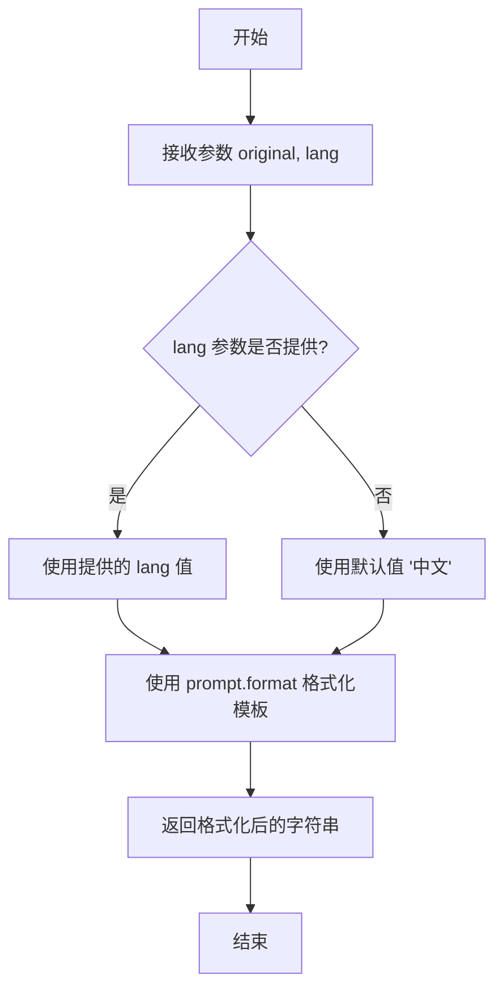

# `.\MetaGPT\metagpt\tools\translator.py` 详细设计文档

该代码定义了一个简单的翻译提示词生成器。它包含一个全局的提示词模板字符串和一个`Translator`类。`Translator`类提供了一个类方法，用于将用户提供的原文和目标语言填充到预定义的提示词模板中，生成一个格式化的字符串，该字符串旨在指导AI模型（如大型语言模型）执行翻译任务。

## 整体流程

```mermaid
graph TD
    A[开始: 调用translate_prompt方法] --> B[输入参数: original, lang]
    B --> C[使用prompt.format进行字符串格式化]
    C --> D[替换模板中的{LANG}和{ORIGINAL}占位符]
    D --> E[返回格式化后的完整提示词字符串]
    E --> F[结束]
```

## 类结构

```
Translator
└── translate_prompt (类方法)
```

## 全局变量及字段


### `prompt`
    
一个用于生成翻译指令的字符串模板，包含占位符 {LANG} 和 {ORIGINAL}。

类型：`str`
    


    

## 全局函数及方法


### `Translator.translate_prompt`

这是一个类方法，用于根据给定的原文和目标语言，格式化并返回一个预设的翻译提示模板。

参数：

-  `original`：`str`，需要被翻译的原始文本。
-  `lang`：`str`，可选参数，指定目标语言，默认为“中文”。

返回值：`str`，返回一个格式化后的字符串，该字符串是一个结构化的提示，包含了翻译指令、原文和等待填充译文的区域。

#### 流程图



#### 带注释源码

```python
    @classmethod  # 装饰器，表明这是一个类方法，可以通过类名直接调用，无需实例化。
    def translate_prompt(cls, original, lang="中文"):  # 定义类方法，接收原文和可选的目标语言参数。
        return prompt.format(LANG=lang, ORIGINAL=original)  # 使用字符串的format方法，将变量lang和original的值填充到全局变量prompt模板的对应位置（{LANG}和{ORIGINAL}），并返回结果字符串。
```


## 关键组件


### 提示词模板

一个预定义的、参数化的字符串模板，用于构建翻译任务的指令。它定义了翻译专家的角色、翻译要求，并预留了目标语言和原文的占位符，是驱动整个翻译流程的核心配置。

### Translator类

一个工具类，提供静态方法来处理与翻译提示词相关的逻辑。它封装了提示词模板的格式化操作，将原始文本和目标语言参数填充到模板中，生成可直接用于大语言模型的完整提示词。


## 问题及建议


### 已知问题

-   **硬编码的提示词模板**：提示词模板 `prompt` 以全局字符串变量的形式硬编码在模块中。这使得修改、测试或根据不同场景（如不同风格、不同系统角色）动态调整提示词变得困难，降低了代码的灵活性和可维护性。
-   **缺乏输入验证**：`translate_prompt` 方法直接使用传入的 `original` 和 `lang` 参数进行字符串格式化，没有对输入进行任何验证（例如，检查 `original` 是否为空，`lang` 是否为有效语言代码）。这可能导致生成格式错误的提示词或引发未处理的异常。
-   **类设计过于简单**：`Translator` 类目前仅包含一个类方法 `translate_prompt`，其功能仅仅是字符串格式化。这种设计未能体现“翻译专家”这一角色的封装性，例如，无法维护翻译状态、记忆术语库或与不同的翻译引擎/API交互。它更像一个工具函数而非一个具有明确职责的类。
-   **可测试性差**：由于提示词模板是硬编码的全局变量，并且类方法直接依赖它，这使得对该方法进行单元测试（例如，模拟不同的模板或验证输出格式）变得复杂。
-   **潜在的安全风险**：直接使用 `format` 方法将用户提供的 `original` 文本插入到模板中，如果 `original` 字符串包含与 `format` 语法冲突的字符（如花括号 `{}`），可能导致 `KeyError` 或非预期的字符串替换，破坏提示词结构。

### 优化建议

-   **将提示词模板配置化**：将 `prompt` 模板移出代码，放入配置文件（如 JSON、YAML）、环境变量或专门的模板管理模块中。这样可以在不修改代码的情况下调整提示词，也便于进行 A/B 测试或为不同环境配置不同的模板。
-   **增加输入验证与清理**：在 `translate_prompt` 方法开始时，验证 `original` 参数是否为非空字符串，并对 `lang` 参数进行基本的有效性检查（例如，检查是否在支持的语言列表中）。同时，考虑对 `original` 中的特殊字符进行转义，以防止其破坏 `format` 方法的预期行为。可以使用 `str.format_map` 或更安全的模板引擎（如 `string.Template`）来避免 `original` 内容被误解析为格式化字段。
-   **重构类设计以增强职责**：重新设计 `Translator` 类，使其能够更好地封装翻译逻辑。例如：
    -   将提示词模板作为构造函数的参数或通过配置加载，使类实例可以拥有不同的模板。
    -   添加方法来处理与外部翻译服务（如 GPT API）的交互，而不仅仅是构建提示词。
    -   考虑引入术语库管理、翻译历史或质量评估等高级功能作为类的方法或属性。
-   **改进可测试性**：通过依赖注入（例如，将模板字符串作为参数传递给方法或类的构造函数）来解耦代码，使得在测试中能够轻松替换模板内容，从而编写更纯粹、更聚焦的单元测试。
-   **增强错误处理**：在 `translate_prompt` 方法中添加异常处理逻辑，以优雅地处理格式化失败等错误，并返回有意义的错误信息或默认值，而不是让异常直接抛出。
-   **考虑使用更结构化的模板**：对于复杂的提示词，可以考虑使用 `Jinja2` 等模板引擎，它们提供更强大的功能（如条件语句、循环）和更好的安全性（自动转义），使得提示词的构建更加灵活和安全。


## 其它


### 设计目标与约束

本模块的核心设计目标是提供一个简单、可配置的翻译提示词生成器。它旨在将用户提供的原文和目标语言参数，格式化为一个结构化的提示字符串，以供后续的大语言模型（LLM）调用。主要约束包括：
1.  **轻量级**：代码结构简单，不依赖外部库，易于集成。
2.  **可配置性**：支持指定目标语言（`lang` 参数）。
3.  **职责单一**：仅负责生成提示词，不涉及实际的网络请求、模型调用或翻译逻辑。
4.  **静态化**：核心提示词模板定义为全局常量，`Translator` 类仅提供静态方法用于格式化，无内部状态。

### 错误处理与异常设计

当前代码的错误处理机制较为基础：
1.  **输入验证缺失**：`translate_prompt` 方法未对 `original` 和 `lang` 参数进行有效性检查（如空值、类型）。
2.  **模板格式化风险**：使用 `str.format()` 方法。如果 `original` 或 `lang` 字符串中包含与格式说明符冲突的字符（如花括号 `{}`），可能导致 `KeyError` 或格式化错误，破坏提示词结构。
3.  **异常传播**：任何在 `prompt.format()` 调用中引发的异常（如上述的 `KeyError`）将直接向上层调用者抛出，由调用方负责处理。

### 数据流与状态机

本模块无复杂状态机，数据流是线性的：
1.  **输入**：调用者提供 `original`（原文字符串）和 `lang`（目标语言字符串，默认为“中文”）作为输入。
2.  **处理**：`Translator.translate_prompt` 静态方法接收输入，将其插入到预定义的全局 `prompt` 模板字符串的相应占位符 `{ORIGINAL}` 和 `{LANG}` 中。
3.  **输出**：方法返回一个完整的、格式化后的提示词字符串。该字符串即为模块的最终输出，后续可能被传递给LLM接口。

### 外部依赖与接口契约

1.  **外部依赖**：无第三方库依赖。仅使用Python标准库。
2.  **接口契约**：
    *   **提供者契约**：`Translator` 类承诺提供一个类方法 `translate_prompt`，该方法接受特定参数并返回一个格式化后的字符串。
    *   **消费者契约**：调用者（客户端代码）需要确保传入的 `original` 参数为字符串类型，并且了解返回的字符串是一个用于LLM的提示词模板，需自行将其发送至LLM服务以获取实际翻译结果。模块不保证翻译质量，只保证提示词格式的正确性（在输入合法的情况下）。

    