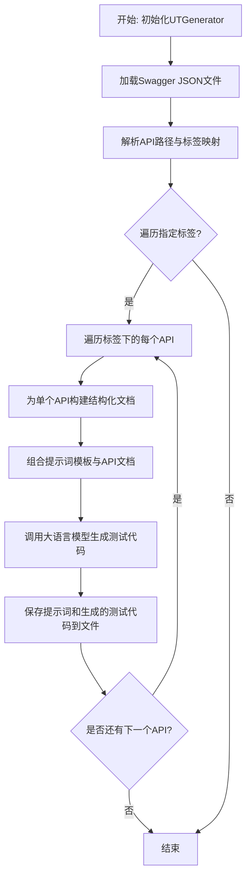
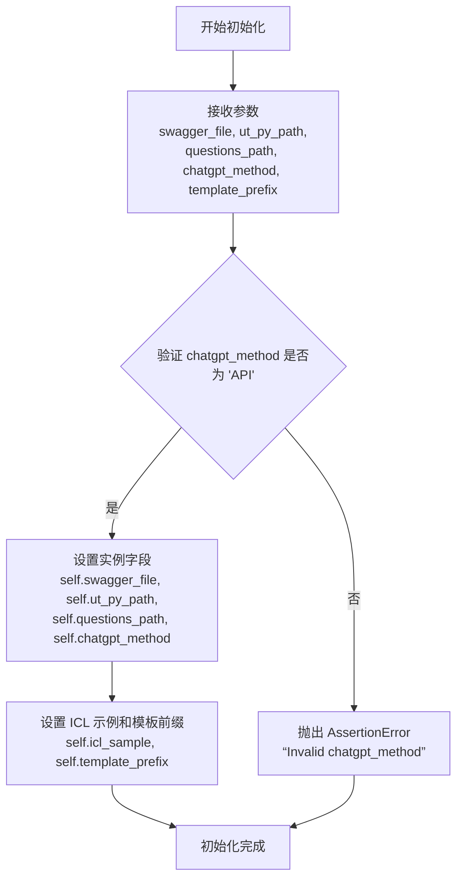
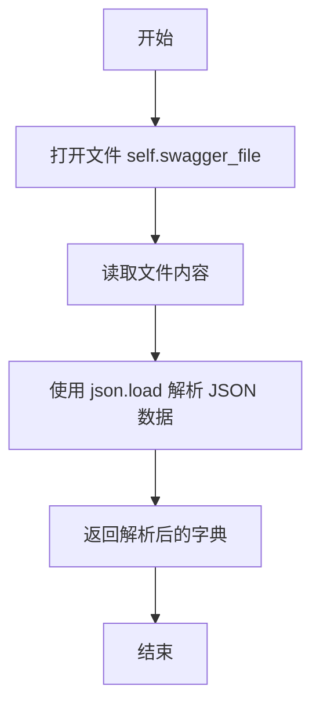
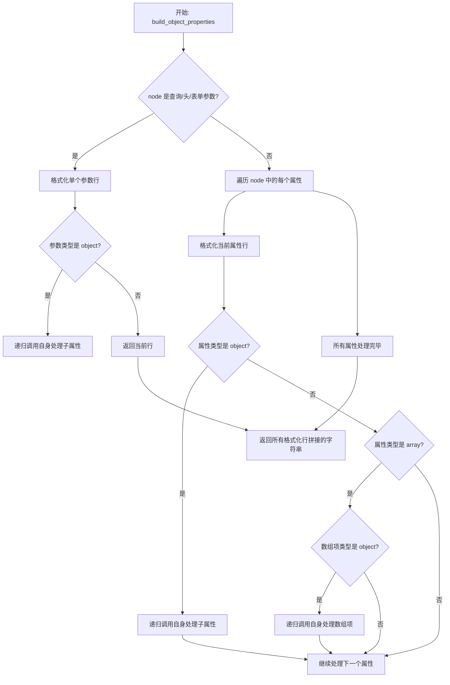
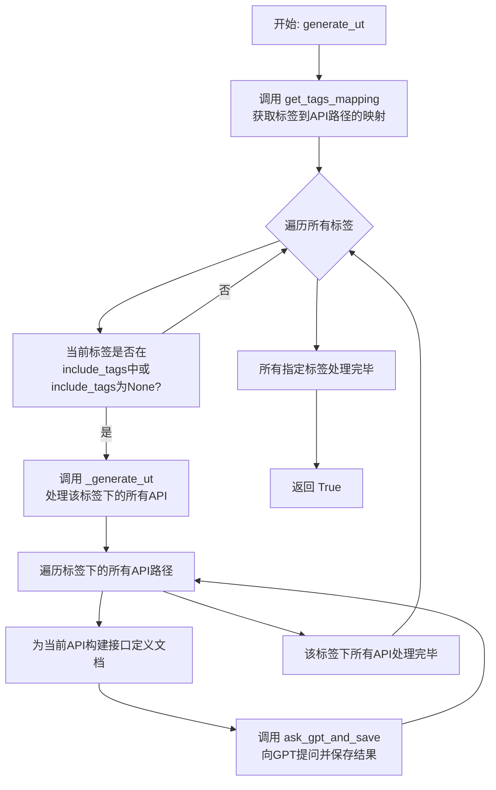
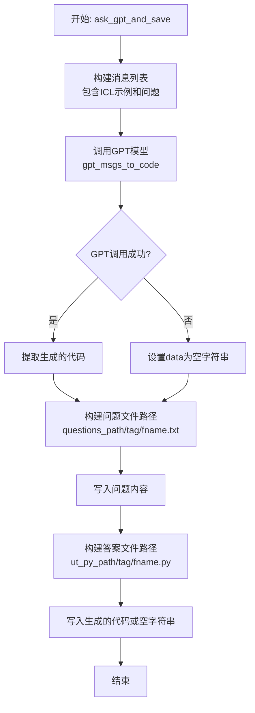
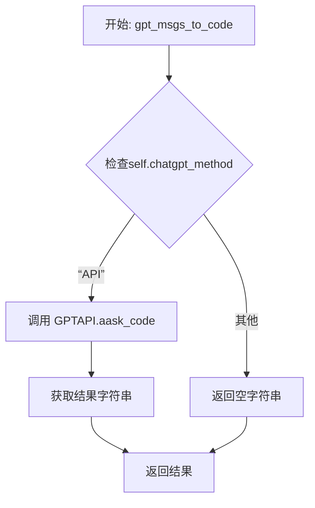

# `.\MetaGPT\metagpt\tools\ut_writer.py` 详细设计文档

该代码实现了一个基于Swagger/OpenAPI规范的单元测试生成器。它通过解析API文档，构建结构化的接口描述，然后利用大语言模型（如OpenAI GPT）生成符合特定测试策略（如功能测试、安全测试）的pytest参数化测试用例。

## 整体流程



## 类结构

```
UTGenerator (单元测试生成器主类)
├── __init__ (构造函数)
├── get_swagger_json (加载Swagger文件)
├── __para_to_str (内部参数格式化)
├── _para_to_str (参数格式化包装)
├── para_to_str (带必填检查的参数格式化)
├── build_object_properties (递归构建对象属性文档)
├── get_tags_mapping (构建标签-路径映射)
├── generate_ut (生成测试用例入口)
├── build_api_doc (构建单个API的完整文档)
├── ask_gpt_and_save (调用GPT并保存结果)
├── _generate_ut (处理单个标签下的所有API)
└── gpt_msgs_to_code (调用大语言模型)
```

## 全局变量及字段


### `ICL_SAMPLE`
    
一个包含接口定义和单元测试示例的字符串，用作上下文学习（ICL）的样本，指导GPT模型生成符合特定格式的单元测试。

类型：`str`
    


### `ACT_PROMPT_PREFIX`
    
用于生成功能测试用例的提示词前缀，指导GPT生成包含缺失参数、边界检查、类型错误等测试类型的用例。

类型：`str`
    


### `YFT_PROMPT_PREFIX`
    
用于生成安全测试用例的提示词前缀，指导GPT生成包含SQL注入、XSS、权限提升、认证授权等安全测试类型的用例。

类型：`str`
    


### `OCR_API_DOC`
    
一个OCR识别接口的API文档示例字符串，用于演示接口文档的格式。

类型：`str`
    


### `UTGenerator.swagger_file`
    
Swagger/OpenAPI规范文件的本地路径，用于读取API定义以生成测试用例。

类型：`str`
    


### `UTGenerator.ut_py_path`
    
存储生成的单元测试Python文件(.py)的目录路径。

类型：`str`
    


### `UTGenerator.questions_path`
    
存储发送给GPT的提示词问题模板的目录路径，便于后续检查和审计。

类型：`str`
    


### `UTGenerator.chatgpt_method`
    
调用GPT模型的方法，当前仅支持'API'模式，用于生成测试代码。

类型：`str`
    


### `UTGenerator.icl_sample`
    
上下文学习样本，在初始化时从全局变量ICL_SAMPLE赋值，用于指导GPT生成特定格式的测试用例。

类型：`str`
    


### `UTGenerator.template_prefix`
    
生成提示词时使用的前缀模板，默认为YFT_PROMPT_PREFIX，用于定义测试用例的生成范围和类型。

类型：`str`
    
    

## 全局函数及方法

### `UTGenerator.__init__`

该方法用于初始化 `UTGenerator` 类的实例，设置生成单元测试所需的核心配置和路径，并验证输入参数的有效性。

参数：

- `swagger_file`：`str`，Swagger API 文档文件的路径。
- `ut_py_path`：`str`，生成的单元测试文件存储路径。
- `questions_path`：`str`，存储生成测试用例时所用模板（便于后续检查）的路径。
- `chatgpt_method`：`str`，调用 ChatGPT 的方法，目前仅支持 "API"。
- `template_prefix`：`str`，生成测试用例时使用的提示词模板前缀，默认为 `YFT_PROMPT_PREFIX`。

返回值：`None`，构造函数不返回任何值。

#### 流程图



#### 带注释源码

```python
def __init__(
    self,
    swagger_file: str,          # Swagger API 文档文件的路径
    ut_py_path: str,            # 生成的单元测试文件存储路径
    questions_path: str,        # 存储生成测试用例时所用模板的路径
    chatgpt_method: str = "API", # 调用 ChatGPT 的方法，目前仅支持 "API"
    template_prefix=YFT_PROMPT_PREFIX, # 生成测试用例时使用的提示词模板前缀
) -> None:
    """Initialize UT Generator

    Args:
        swagger_file: path to the swagger file
        ut_py_path: path to store test cases
        questions_path: path to store the template, facilitating subsequent checks
        chatgpt_method: API method
        template_prefix: use the template, default is YFT_UT_PROMPT
    """
    # 将传入的路径参数保存为实例字段
    self.swagger_file = swagger_file
    self.ut_py_path = ut_py_path
    self.questions_path = questions_path

    # 验证 chatgpt_method 参数是否有效，目前只允许 "API"
    assert chatgpt_method in ["API"], "Invalid chatgpt_method"
    self.chatgpt_method = chatgpt_method

    # ICL: In-Context Learning，为后续调用 GPT 提供示例以供模仿
    self.icl_sample = ICL_SAMPLE
    # 设置生成测试用例时使用的提示词模板前缀
    self.template_prefix = template_prefix
```

### `UTGenerator.get_swagger_json`

该方法用于从本地文件中加载并解析 Swagger/OpenAPI 规范文档，将其内容以 Python 字典的形式返回，为后续的接口分析和测试用例生成提供数据源。

参数：

- `self`：`UTGenerator`，`UTGenerator` 类的实例，用于访问类属性和其他方法。
- 无其他显式参数。

返回值：`dict`，包含从指定 JSON 文件中加载的 Swagger API 文档内容。

#### 流程图



#### 带注释源码

```python
    def get_swagger_json(self) -> dict:
        """Load Swagger JSON from a local file"""
        # 使用 `open` 函数以只读模式打开 `self.swagger_file` 指定的文件，并指定编码为 UTF-8。
        # `self.swagger_file` 是在类初始化时传入的 Swagger 文件路径。
        with open(self.swagger_file, "r", encoding="utf-8") as file:
            # 使用 `json.load` 方法读取文件对象 `file` 的内容，并将其解析为 Python 字典。
            # 这要求文件内容必须是有效的 JSON 格式。
            swagger_json = json.load(file)
        # 将解析得到的字典返回给调用者。
        return swagger_json
```

### `UTGenerator.__para_to_str`

该方法是一个私有辅助方法，用于将Swagger/OpenAPI规范中定义的单个参数属性对象，格式化为一个制表符分隔的字符串行。该字符串行遵循特定的文档模板格式，包含参数名称、类型、是否必需、默认值（标题）和描述信息。

参数：

- `prop`：`dict`，包含参数属性的字典，例如 `{"name": "file_id", "type": "string", "title": "", "description": ""}`
- `required`：`bool`，指示该参数是否为必需项
- `name`：`str`，可选参数，用于覆盖`prop`字典中的`"name"`字段。默认为空字符串，此时会使用`prop["name"]`

返回值：`str`，一个格式化后的字符串，格式为：`{名称}\t{类型}\t{是否必需}\t{标题}\t{描述}`

#### 流程图

```mermaid
flowchart TD
    A[开始: __para_to_str(prop, required, name)] --> B{name 参数是否为空?}
    B -- 是 --> C[final_name = prop['name']]
    B -- 否 --> D[final_name = name]
    C --> E
    D --> E
    E[从prop中提取 ptype, title, desc] --> F[将 required 转换为 'Yes' 或 'No']
    F --> G[拼接 final_name, ptype, required_str, title, desc<br>以制表符分隔]
    G --> H[返回拼接后的字符串]
    H --> I[结束]
```

#### 带注释源码

```python
    def __para_to_str(self, prop, required, name=""):
        # 确定最终使用的参数名称：如果调用者提供了name参数，则使用它；否则使用prop字典中的'name'字段。
        name = name or prop["name"]
        # 从属性字典中获取参数的类型、标题（作为默认值占位符）和描述。
        ptype = prop["type"]
        title = prop.get("title", "")
        desc = prop.get("description", "")
        # 将布尔类型的required转换为字符串"Yes"或"No"。
        # 将所有字段用制表符(\t)连接，生成符合预定模板格式的一行文本。
        return f'{name}\t{ptype}\t{"Yes" if required else "No"}\t{title}\t{desc}'
```

### `UTGenerator._para_to_str`

该方法用于将 Swagger 属性对象转换为格式化的字符串表示，主要用于生成 API 文档中的参数表格行。

参数：

- `prop`：`dict`，Swagger 规范中定义的属性对象，包含如 `name`、`type`、`required` 等字段。

返回值：`str`，格式化后的参数字符串，格式为 `名称\t类型\t是否必填\t标题\t描述`。

#### 流程图

```mermaid
flowchart TD
    A[开始] --> B[从prop中提取required字段<br>默认为False]
    B --> C[调用私有方法<br>__para_to_str(prop, required)]
    C --> D[返回格式化字符串]
    D --> E[结束]
```

#### 带注释源码

```python
def _para_to_str(self, prop):
    # 从属性对象中获取 `required` 字段，如果不存在则默认为 False
    required = prop.get("required", False)
    # 调用内部方法 __para_to_str，传入属性对象和是否必填的标志，返回格式化字符串
    return self.__para_to_str(prop, required)
```

### `UTGenerator.para_to_str`

该方法用于将Swagger API文档中的属性定义转换为格式化的字符串表示，遵循特定的表格格式（名称、类型、是否必需、默认值、备注）。它根据属性名称是否在必需字段列表中来确定其“Required”状态。

参数：

- `name`：`str`，属性的名称。
- `prop`：`dict`，包含属性详细信息的字典，如类型（type）、标题（title）、描述（description）等。
- `prop_object_required`：`list`，包含当前对象所有必需字段名称的列表。

返回值：`str`，格式化后的属性字符串，格式为：`{name}\t{type}\t{required}\t{title}\t{description}`。

#### 流程图

```mermaid
flowchart TD
    A[开始: para_to_str(name, prop, prop_object_required)] --> B{name 是否在<br>prop_object_required 列表中?}
    B -- 是 --> C[required = True]
    B -- 否 --> D[required = False]
    C --> E[调用 __para_to_str(prop, required, name)]
    D --> E
    E --> F[返回格式化字符串]
    F --> G[结束]
```

#### 带注释源码

```python
def para_to_str(self, name, prop, prop_object_required):
    """
    将单个属性对象转换为格式化的字符串行。
    
    参数:
        name (str): 属性的名称。
        prop (dict): 包含属性信息的字典，如类型、标题、描述。
        prop_object_required (list): 当前对象中所有必需字段的名称列表。
    
    返回:
        str: 格式化为制表符分隔的字符串，包含名称、类型、是否必需、标题和描述。
    """
    # 判断当前属性是否为必需字段
    required = name in prop_object_required
    # 调用内部方法进行实际的字符串格式化
    return self.__para_to_str(prop, required, name)
```

### `UTGenerator.build_object_properties`

该方法递归地处理Swagger/OpenAPI规范中`object`或`array[object]`类型的属性，将其格式化为结构化的文本行，用于生成API文档中的请求参数和响应数据部分。

参数：

- `node`：`dict`， 当前需要处理的属性节点，可能是一个完整的`properties`字典，也可能是一个单独的属性定义。
- `prop_object_required`：`list`， 包含当前节点中所有必需字段名称的列表。
- `level`：`int`， 当前递归的深度，用于生成缩进以表示属性的嵌套层级。

返回值：`str`， 返回格式化后的属性描述字符串，每行代表一个属性，包含名称、类型、是否必需、默认值和备注等信息。

#### 流程图



#### 带注释源码

```python
    def build_object_properties(self, node, prop_object_required, level: int = 0) -> str:
        """递归地输出 object 和 array[object] 类型的属性

        Args:
            node (_type_): 子项的值
            prop_object_required (_type_): 是否为必填字段
            level: 当前递归深度
        """

        doc = ""  # 初始化用于累积结果的字符串

        def dive_into_object(node):
            """如果类型是 object，则递归输出其属性"""
            if node.get("type") == "object":
                sub_properties = node.get("properties", {})
                # 递归调用自身，处理嵌套的 object 属性，深度加1
                return self.build_object_properties(sub_properties, prop_object_required, level=level + 1)
            return ""  # 如果不是 object 类型，返回空字符串

        # 处理位于查询参数、请求头或表单数据中的参数（这些参数通常不是嵌套结构）
        if node.get("in", "") in ["query", "header", "formData"]:
            # 根据当前层级添加缩进，然后格式化该参数行
            doc += f'{"	" * level}{self._para_to_str(node)}\n'
            # 检查该参数本身是否是 object 类型（例如，一个复杂的查询参数）
            doc += dive_into_object(node)
            return doc  # 直接返回，因为这类参数不会再有同级属性遍历

        # 遍历 node 字典中的每一个属性（name, prop）
        for name, prop in node.items():
            # 防御性检查：如果 prop 不是字典，则按单个参数处理并跳出循环
            if not isinstance(prop, dict):
                doc += f'{"	" * level}{self._para_to_str(node)}\n'
                break
            # 根据当前层级添加缩进，格式化当前属性行。
            # `para_to_str` 方法会检查 `name` 是否在 `prop_object_required` 列表中来确定“是否必需”
            doc += f'{"	" * level}{self.para_to_str(name, prop, prop_object_required)}\n'
            # 检查当前属性是否是 object 类型，如果是则递归处理其子属性
            doc += dive_into_object(prop)
            # 如果当前属性是 array 类型，需要检查其数组项（items）
            if prop["type"] == "array":
                items = prop.get("items", {})
                # 检查数组项是否是 object 类型，如果是则递归处理
                doc += dive_into_object(items)
        # 返回所有已格式化行的拼接字符串
        return doc
```

### `UTGenerator.get_tags_mapping`

该方法用于处理Swagger/OpenAPI规范文档，提取并构建一个映射字典，该字典将API标签（tags）关联到对应的路径（paths）和HTTP方法（methods）信息。

参数：
- `self`：`UTGenerator`，`UTGenerator`类的实例，提供对类属性和其他方法的访问。

返回值：`dict`，返回一个嵌套字典，其结构为 `{tag: {path: {method: method_obj}}}`。其中，`tag`是API分组的标签名，`path`是API的路径，`method`是HTTP方法（如`get`、`post`），`method_obj`是该路径和方法对应的完整Swagger定义对象。

#### 流程图

```mermaid
flowchart TD
    A[开始] --> B[调用 get_swagger_json<br>加载Swagger数据]
    B --> C[从数据中获取paths字段]
    C --> D[初始化空字典 tags]
    D --> E{遍历 paths 字典？}
    E -- 是 --> F[获取当前 path 和 path_obj]
    F --> G{遍历 path_obj 字典？}
    G -- 是 --> H[获取当前 method 和 method_obj]
    H --> I[获取 method_obj 的 tags 列表]
    I --> J{遍历 tags 列表？}
    J -- 是 --> K[检查当前 tag 是否在 tags 字典中]
    K --> L{tag 不存在？}
    L -- 是 --> M[在 tags 字典中为 tag 创建空字典]
    L -- 否 --> N
    M --> N
    N --> O{path 不在 tag 的字典中？}
    O -- 是 --> P[在 tag 字典中为 path 创建空字典]
    O -- 否 --> Q
    P --> Q
    Q --> R[将 method 和 method_obj 存入<br>tags[tag][path] 字典]
    R --> J
    J -- 否 --> G
    G -- 否 --> E
    E -- 否 --> S[返回构建好的 tags 字典]
    S --> T[结束]
```

#### 带注释源码

```python
    def get_tags_mapping(self) -> dict:
        """Process tag and path mappings

        Returns:
            Dict: mapping of tag to path
        """
        # 1. 加载本地的Swagger JSON文件，获取完整的API规范数据。
        swagger_data = self.get_swagger_json()
        # 2. 从数据中提取所有API路径的定义。
        paths = swagger_data["paths"]
        # 3. 初始化一个空字典，用于存储最终的标签-路径映射关系。
        tags = {}

        # 4. 第一层循环：遍历所有API路径（path）。
        for path, path_obj in paths.items():
            # 5. 第二层循环：遍历该路径下支持的所有HTTP方法（如get, post, put, delete）。
            for method, method_obj in path_obj.items():
                # 6. 获取当前API操作（operation）所关联的标签列表。
                for tag in method_obj["tags"]:
                    # 7. 如果该标签是第一次出现，则在主字典中为其创建一个空字典。
                    if tag not in tags:
                        tags[tag] = {}
                    # 8. 如果当前路径尚未记录在该标签下，则在该标签的字典中为路径创建一个空字典。
                    if path not in tags[tag]:
                        tags[tag][path] = {}
                    # 9. 将HTTP方法（method）作为键，对应的API操作对象（method_obj）作为值，
                    #    存入嵌套字典 tags[tag][path] 中。
                    tags[tag][path][method] = method_obj

        # 10. 返回构建完成的映射字典。
        return tags
```

### `UTGenerator.generate_ut`

该方法用于根据给定的标签列表，生成对应API接口的单元测试文件。它会遍历Swagger文档中所有标记了指定标签的API路径，为每个API构建详细的接口定义文档，然后调用GPT模型生成相应的单元测试用例，并将生成的测试代码和问题模板保存到指定的目录中。

参数：

- `include_tags`：`list` 或 `None`，一个包含需要生成单元测试的API标签的列表。如果为`None`，则处理所有标签。

返回值：`bool`，如果所有指定标签的单元测试生成过程都成功启动，则返回`True`。

#### 流程图



#### 带注释源码

```python
async def generate_ut(self, include_tags) -> bool:
    """生成测试用例文件"""
    # 1. 从Swagger文件中获取所有标签及其对应的API路径映射
    tags = self.get_tags_mapping()
    # 2. 遍历所有标签
    for tag, paths in tags.items():
        # 3. 检查当前标签是否需要处理（如果include_tags为None则处理所有标签）
        if include_tags is None or tag in include_tags:
            # 4. 调用内部方法，为该标签下的所有API生成单元测试
            await self._generate_ut(tag, paths)
    # 5. 所有处理完成后返回True
    return True
```

### `UTGenerator.build_api_doc`

该方法根据给定的API节点信息、路径和HTTP方法，构建一个格式化的API文档字符串。该文档遵循特定的文本模板，包含接口名称、路径、方法、请求参数（路径参数和请求体参数）以及响应数据的详细描述。

参数：

- `node`：`dict`，包含单个API接口详细信息的字典，通常来自Swagger/OpenAPI规范中`paths`下的一个方法节点。
- `path`：`str`，API接口的路径，例如`/projects/{project_key}/node-tags`。
- `method`：`str`，HTTP方法，例如`"post"`。

返回值：`str`，一个格式化的、包含API详细信息的纯文本字符串，用于作为提示词的一部分发送给LLM以生成单元测试。

#### 流程图

```mermaid
flowchart TD
    A[开始: build_api_doc(node, path, method)] --> B[提取API摘要summary]
    B --> C[构建文档头部<br>（名称、路径、方法）]
    C --> D{节点中是否包含<br>“parameters”键？}
    D -- 是 --> E[初始化请求参数部分<br>并遍历parameters列表]
    E --> F{参数“in”类型<br>是否为“path”？}
    F -- 是 --> G[将参数名添加到<br>“Path Parameters”部分]
    F -- 否 --> H[调用build_object_properties<br>处理非路径参数<br>（如body, query等）]
    G --> I[继续遍历下一个参数]
    H --> I
    D -- 否 --> J[跳过请求参数部分]
    I --> K[遍历完所有参数]
    J --> K
    K --> L[初始化响应数据部分]
    L --> M[从节点中获取“200”响应<br>的schema]
    M --> N[调用build_object_properties<br>处理响应体的properties]
    N --> O[拼接文档尾部<br>（闭合代码块标记）]
    O --> P[返回完整的API文档字符串]
```

#### 带注释源码

```python
def build_api_doc(self, node: dict, path: str, method: str) -> str:
    # 从API节点中获取接口的简要描述
    summary = node["summary"]

    # 构建文档的头部：接口名称、路径和HTTP方法
    doc = f"API Name: {summary}\nAPI Path: {path}\nMethod: {method.upper()}\n"
    doc += "\nRequest Parameters:\n"
    
    # 检查该API接口是否定义了请求参数
    if "parameters" in node:
        parameters = node["parameters"]
        # 开始处理路径参数
        doc += "Path Parameters:\n"

        # 遍历所有参数，根据参数位置（`in`字段）进行分类处理
        # param["in"]的可能值: path / formData / body / query / header
        for param in parameters:
            # 如果是路径参数（如 /users/{user_id} 中的 user_id），只记录其名称
            if param["in"] == "path":
                doc += f'{param["name"]} \n'

        # 开始处理请求体和其他类型的参数
        doc += "\nBody Parameters:\n"
        # 添加参数表格的标题行
        doc += "Name\tType\tRequired\tDefault Value\tRemarks\n"
        for param in parameters:
            # 如果参数是请求体（body），其结构定义在`schema`中，需要递归解析
            if param["in"] == "body":
                schema = param.get("schema", {})
                # 获取请求体对象的属性定义
                prop_properties = schema.get("properties", {})
                # 获取请求体中哪些字段是必填的
                prop_required = schema.get("required", [])
                # 调用辅助方法递归构建对象属性的文档字符串
                doc += self.build_object_properties(prop_properties, prop_required)
            else:
                # 对于非body参数（如query, header, formData），直接处理
                doc += self.build_object_properties(param, [])

    # 构建响应数据部分
    doc += "\nResponse Data:\n"
    doc += "Name\tType\tRequired\tDefault Value\tRemarks\n"
    # 获取该接口的所有响应定义
    responses = node["responses"]
    # 通常我们关注成功（200）响应的结构
    response = responses.get("200", {})
    schema = response.get("schema", {})
    # 获取响应体的属性定义
    properties = schema.get("properties", {})
    # 获取响应体中哪些字段是必填的
    required = schema.get("required", {})
    # 调用辅助方法递归构建响应体属性的文档字符串
    doc += self.build_object_properties(properties, required)
    # 用代码块标记闭合整个文档，便于在Markdown或提示词中高亮显示
    doc += "\n"
    doc += "```"

    # 返回最终构建好的API文档字符串
    return doc
```

### `UTGenerator.ask_gpt_and_save`

该方法用于向GPT模型提问以生成单元测试代码，并将问题（API文档）和生成的答案（单元测试代码）分别保存到指定的文件中。

参数：

- `question`：`str`，包含API文档的字符串，将作为提示词发送给GPT模型。
- `tag`：`str`，模块或接口的标签，用于组织生成的文件目录结构。
- `fname`：`str`，文件名（通常基于API的`summary`），用于保存生成的问题和答案文件。

返回值：`None`，该方法不返回任何值。

#### 流程图



#### 带注释源码

```python
async def ask_gpt_and_save(self, question: str, tag: str, fname: str):
    """Generate questions and store both questions and answers"""
    # 1. 构建发送给GPT的消息列表，第一条是ICL示例，第二条是具体的API文档问题
    messages = [self.icl_sample, question]
    # 2. 调用GPT模型，获取生成的单元测试代码
    result = await self.gpt_msgs_to_code(messages=messages)

    # 3. 构建并写入问题文件（即原始的API文档）
    # 文件路径: questions_path/tag/fname.txt
    await awrite(Path(self.questions_path) / tag / f"{fname}.txt", question)
    # 4. 从GPT返回结果中提取代码部分，如果结果为空则使用空字符串
    data = result.get("code", "") if result else ""
    # 5. 构建并写入答案文件（即生成的单元测试代码）
    # 文件路径: ut_py_path/tag/fname.py
    await awrite(Path(self.ut_py_path) / tag / f"{fname}.py", data)
```

### `UTGenerator._generate_ut`

该方法用于处理指定标签（tag）下的所有API路径，为每个API生成单元测试问题，并调用GPT模型生成测试代码后保存到文件。

参数：

- `tag`：`str`，模块名称或标签，用于标识一组相关的API。
- `paths`：`dict`，一个字典，其键为API路径（`path`），值为另一个字典。该内部字典的键为HTTP方法（如`GET`, `POST`），值为该API的详细定义（`node`）。

返回值：`None`，此方法不返回任何值，其主要作用是执行文件生成和保存的副作用。

#### 流程图

```mermaid
flowchart TD
    A[开始: _generate_ut(tag, paths)] --> B[遍历paths字典<br>for path, path_obj in paths.items()]
    B --> C[遍历path_obj字典<br>for method, node in path_obj.items()]
    C --> D[获取API摘要summary]
    D --> E[构建问题字符串question<br>拼接模板前缀和API文档]
    E --> F[调用ask_gpt_and_save<br>传入question, tag, summary]
    F --> G{是否还有下一个method?}
    G -->|是| C
    G -->|否| H{是否还有下一个path?}
    H -->|是| B
    H -->|否| I[结束]
```

#### 带注释源码

```python
async def _generate_ut(self, tag, paths):
    """处理一个数据路径下的结构

    该方法遍历给定标签（tag）下的所有API路径和方法。
    对于每个API，它会：
    1. 构建一个包含API文档的提问字符串。
    2. 调用`ask_gpt_and_save`方法，该方法会：
        a. 将提问发送给GPT模型以生成单元测试代码。
        b. 将原始提问和生成的测试代码分别保存到文件。

    Args:
        tag (_type_): 模块名称，用于组织生成的测试文件。
        paths (_type_): 路径对象，是一个嵌套字典，结构为：
            {
                “/api/v1/users”: {
                    “get”: { ...api定义... },
                    “post”: { ...api定义... }
                },
                “/api/v1/orders”: { ... }
            }
    """
    # 遍历所有API路径，例如 /api/v1/users, /api/v1/orders
    for path, path_obj in paths.items():
        # 遍历该路径下的所有HTTP方法，例如 GET, POST
        for method, node in path_obj.items():
            # 从API定义中获取摘要，用作生成的文件名
            summary = node["summary"]
            # 构建发送给GPT的提问。以预设的模板前缀开头。
            question = self.template_prefix
            # 调用`build_api_doc`方法，根据API定义生成格式化的API文档字符串，并追加到提问中。
            question += self.build_api_doc(node, path, method)
            # 调用`ask_gpt_and_save`方法，传入提问、标签和文件名（基于summary）。
            # 此方法负责与GPT交互并将结果保存到`self.questions_path`和`self.ut_py_path`指定的目录中。
            await self.ask_gpt_and_save(question, tag, summary)
```

### `UTGenerator.gpt_msgs_to_code`

该方法根据配置的聊天GPT调用方式（目前仅支持“API”），将给定的消息列表发送给GPT模型，并请求其生成代码。它作为`UTGenerator`类内部生成单元测试用例的核心调用环节，将构造好的API文档提示词转换为具体的测试代码。

参数：

-  `messages`：`list`，一个包含提示词的消息列表。通常第一个元素是上下文学习示例（ICL_SAMPLE），第二个元素是具体的API文档和生成要求。

返回值：`str`，返回从GPT模型获取到的代码字符串。如果调用失败或未配置有效方法，可能返回空字符串。

#### 流程图



#### 带注释源码

```python
async def gpt_msgs_to_code(self, messages: list) -> str:
    """Choose based on different calling methods"""
    # 初始化结果变量为空字符串
    result = ""
    # 判断配置的GPT调用方法
    if self.chatgpt_method == "API":
        # 通过配置获取OpenAI LLM实例，并调用其异步代码生成方法
        result = await GPTAPI(config.get_openai_llm()).aask_code(messages=messages)
    # 返回获取到的代码结果（如果方法不匹配或调用失败，则返回空字符串）
    return result
```

## 关键组件


### 接口文档解析与构建组件

负责解析输入的Swagger JSON格式的API文档，并将其转换为结构化的、易于GPT理解的文本格式。该组件递归地处理对象和数组类型，构建出包含请求参数、响应数据等完整信息的API描述文档。

### 测试用例生成策略组件

定义了两种不同的测试用例生成策略模板（`ACT_PROMPT_PREFIX` 和 `YFT_PROMPT_PREFIX`），分别侧重于功能测试（如参数验证、边界检查）和安全测试（如SQL注入、XSS攻击）。该组件通过提示词工程引导GPT生成特定类型和数量的测试用例。

### 上下文学习（ICL）示例组件

提供了一个高质量的示例（`ICL_SAMPLE`），包含一个完整的接口定义和对应的单元测试代码。该组件作为Few-Shot Learning的样本，用于引导GPT理解任务目标、输出格式和具体要求，确保生成的测试代码符合规范。

### 标签与路径映射管理组件

通过`get_tags_mapping`方法，将Swagger文档中的`tags`、`paths`和`methods`进行关联和组织，形成以业务模块（tag）为维度的结构。这支持了按模块批量生成测试用例的功能。

### 大语言模型（LLM）交互适配器组件

封装了与底层LLM（当前为OpenAI GPT）的交互逻辑（`gpt_msgs_to_code`方法）。该组件作为生成流程的最终执行器，接收构建好的提示信息，调用AI模型，并返回生成的测试代码，实现了生成逻辑与具体AI模型的解耦。


## 问题及建议


### 已知问题

-   **硬编码的提示词模板**：`ICL_SAMPLE`、`ACT_PROMPT_PREFIX`、`YFT_PROMPT_PREFIX` 等提示词模板直接以字符串形式硬编码在代码中。这使得修改、扩展或根据不同场景切换模板变得困难，降低了代码的可维护性和灵活性。
-   **脆弱的 JSON 结构解析**：`build_object_properties` 和 `para_to_str` 等方法严重依赖于输入 Swagger/OpenAPI 文档遵循特定的结构（例如，存在 `type`、`properties`、`required` 等字段）。如果文档格式不标准或未来版本结构发生变化，这些方法可能无法正确解析或会抛出异常。
-   **错误处理不足**：代码中缺乏足够的错误处理。例如，`get_swagger_json` 在文件不存在或 JSON 格式错误时会直接抛出异常，但没有被上层调用者捕获或进行友好处理。`ask_gpt_and_save` 中 `result` 可能为 `None`，但后续直接调用 `.get(“code”, “”)` 存在风险。
-   **同步与异步混合**：类的方法签名显示主要流程是异步的（如 `generate_ut`, `_generate_ut`, `ask_gpt_and_save`），但 `get_swagger_json`、`get_tags_mapping`、`build_api_doc` 等关键辅助方法却是同步的。在大型文件处理或网络 I/O 场景下，这可能成为性能瓶颈，且破坏了纯粹的异步编程模型。
-   **路径处理与目录创建**：`ask_gpt_and_save` 方法假设 `self.questions_path` / tag 和 `self.ut_py_path` / tag 目录已经存在。如果目录不存在，`awrite` 操作会失败，代码中没有创建目录的逻辑。
-   **配置与依赖注入**：`GPTAPI` 的初始化依赖于全局的 `config.get_openai_llm()`，这使得类与全局配置紧密耦合，难以进行单元测试（需要 mock 全局配置）或切换不同的 LLM 提供商。
-   **代码重复与单一职责**：`__para_to_str`、`_para_to_str` 和 `para_to_str` 三个方法功能高度重叠，存在不必要的重复。`build_object_properties` 方法同时负责遍历参数和格式化字符串，职责不够单一。

### 优化建议

-   **外部化配置提示词模板**：将 `ICL_SAMPLE`、`ACT_PROMPT_PREFIX`、`YFT_PROMPT_PREFIX` 等模板移至外部配置文件（如 YAML、JSON）或模板文件中。通过配置加载，便于不同团队、不同项目进行定制，也支持热更新。
-   **增强 JSON 解析的健壮性**：在解析 Swagger 文档时，增加更多的防御性检查。使用 `.get()` 方法安全地访问字典键，为可能缺失的字段提供默认值。可以考虑使用专门的 OpenAPI 解析库（如 `prance` 或 `openapi-core`）来替代手写解析逻辑，提高准确性和可维护性。
-   **完善错误处理机制**：在文件读取、JSON 解析、GPT API 调用等可能失败的操作周围添加 `try-except` 块。定义明确的异常类型，并在上层进行统一捕获和日志记录，或提供友好的错误信息。对于 `ask_gpt_and_save`，应检查 `result` 的有效性。
-   **重构为纯异步或提供同步接口**：评估将 `get_swagger_json`、`get_tags_mapping` 等同步方法改为异步方法（例如使用 `aiofiles` 读取文件）的可行性，以使整个数据流完全异步。如果改动成本高，可以考虑提供一个明确的同步接口供调用者选择，并文档化其阻塞特性。
-   **确保目录存在**：在 `ask_gpt_and_save` 中或在其调用前，使用 `Path.mkdir(parents=True, exist_ok=True)` 确保目标存储目录存在，避免运行时错误。
-   **采用依赖注入**：修改 `UTGenerator` 的构造函数，将 `GPTAPI` 实例（或其工厂/配置）作为参数传入，而不是在内部通过全局配置创建。这解耦了类与具体配置，大大提高了可测试性，并支持更灵活的 LLM 策略。
-   **重构辅助方法，消除重复**：合并 `__para_to_str`、`_para_to_str` 和 `para_to_str` 的逻辑，提供一个统一的、参数化的方法。考虑将 `build_object_properties` 中的“遍历”和“格式化”职责分离，使代码更清晰，便于单独测试和修改。
-   **增加日志记录**：在关键步骤（如开始生成某个 Tag 的用例、调用 GPT API 前后、保存文件时）添加日志输出，便于监控生成过程、调试问题和进行性能分析。
-   **支持增量生成与缓存**：当前每次运行都会覆盖所有文件。可以增加机制，例如记录已处理接口的哈希值，仅当接口定义发生变化时才重新调用 GPT 生成测试用例，避免不必要的 Token 消耗和等待时间。


## 其它


### 设计目标与约束

本模块（UTGenerator）的核心设计目标是自动化生成基于 Swagger/OpenAPI 规范的 API 接口单元测试用例。其核心约束包括：
1.  **输入约束**：依赖结构化的 Swagger JSON 文件作为唯一输入源，要求该文件格式规范、完整。
2.  **输出约束**：生成的测试用例需符合 `pytest` 框架的 `@pytest.mark.parametrize` 参数化格式，且函数体仅为 `pass`。
3.  **流程约束**：生成过程严格遵循“解析API文档 -> 构建Prompt -> 调用大模型 -> 保存结果”的线性流程，各步骤耦合度较高。
4.  **外部依赖约束**：核心功能重度依赖外部大模型服务（如OpenAI GPT）的质量、稳定性与响应速度，并受其Token长度限制影响Prompt设计。

### 错误处理与异常设计

当前代码的错误处理机制较为薄弱，主要体现在：
1.  **防御性编程不足**：在 `get_swagger_json` 等方法中，直接打开文件或访问字典键，未对文件不存在、JSON解析错误、键缺失等常见异常进行捕获和处理。
2.  **断言使用**：在 `__init__` 中使用 `assert` 验证 `chatgpt_method`，这在生产环境中若触发会导致程序直接崩溃，应改为抛出更明确的异常（如 `ValueError`）。
3.  **大模型调用异常**：`gpt_msgs_to_code` 方法中调用 `GPTAPI().aask_code` 时，未对其可能抛出的网络异常、API限流、响应格式错误等情况进行任何处理，错误将直接向上层传播。
4.  **资源清理**：代码中使用了文件操作，但未在异常发生时确保文件句柄被正确关闭（尽管 `awrite` 可能内部处理了，但依赖其实现）。

### 数据流与状态机

模块的数据流清晰，呈单向管道式：
1.  **初始化数据流**：配置文件 (`config`) 和构造参数 -> `UTGenerator` 实例（初始化内部状态，如文件路径、模板）。
2.  **主处理数据流**：
    *   **输入**：`swagger_file` (JSON) -> `get_swagger_json` -> 原始Swagger数据。
    *   **转换**：原始数据 -> `get_tags_mapping` -> 按Tag组织的API路径字典 -> `build_api_doc` -> 格式化后的API文档字符串。
    *   **合成**：`template_prefix` + API文档字符串 + `ICL_SAMPLE` -> 完整的Prompt消息列表。
    *   **请求**：消息列表 -> `gpt_msgs_to_code` -> 调用外部LLM服务。
    *   **输出**：LLM返回的文本 -> 被解析/处理后 -> 保存为 `.py` (测试用例) 和 `.txt` (Prompt) 文件。
3.  **状态机**：该模块无复杂的运行时状态变迁，其“状态”主要体现在遍历不同Tag和API路径的循环中，属于简单的过程式控制流，而非状态机。

### 外部依赖与接口契约

1.  **外部库依赖**：
    *   `json`, `pathlib.Path`: Python标准库，用于文件与数据操作。
    *   `metagpt.config2.config`: 项目配置中心，用于获取LLM API密钥等设置。
    *   `metagpt.provider.openai_api.OpenAILLM (GPTAPI)`: 大模型客户端封装，是本模块功能实现的核心外部服务。依赖其 `aask_code` 方法的接口契约（输入消息列表，返回包含代码的字典）。
    *   `metagpt.utils.common.awrite`: 项目封装的异步写文件工具。
2.  **接口契约（对上下游）**：
    *   **上游输入契约**：要求调用者提供有效的Swagger JSON文件路径、输出目录路径，并可选指定需要生成的API标签 (`include_tags`)。
    *   **下游输出契约**：在指定目录下，按Tag创建子文件夹，并在其中生成以API摘要命名的 `.py`（测试用例）和 `.txt`（问题）文件。
    *   **异步接口契约**：主要方法（`generate_ut`, `_generate_ut`, `ask_gpt_and_save`, `gpt_msgs_to_code`）均为 `async` 定义，要求运行在异步环境中，并遵循异步调用约定。

### 安全考虑

1.  **Prompt注入风险**：`build_api_doc` 方法将外部输入的Swagger JSON内容直接拼接进Prompt模板。如果Swagger文件内容被恶意篡改（例如包含诱导模型执行恶意操作的指令），可能存在Prompt注入风险，影响模型输出或消耗资源。
2.  **敏感信息泄露**：生成的 `.txt` 文件保存了完整的Prompt，其中可能包含来自Swagger文档的接口细节。需确保 `questions_path` 目录的访问权限得到控制。
3.  **模型输出可信度**：完全信任大模型返回的内容并直接保存为可执行的Python文件（`.py`）。恶意或错误的模型输出可能导致生成存在安全漏洞或破坏性行为的测试代码。在当前“仅 `pass`”的设计下风险较低，但若未来扩展功能则风险增高。
4.  **外部服务依赖**：大模型服务本身可能成为安全瓶颈或攻击面（如API密钥泄露、服务被中间人攻击等）。

### 配置管理

1.  **硬编码配置**：`ICL_SAMPLE`, `ACT_PROMPT_PREFIX`, `YFT_PROMPT_PREFIX`, `OCR_API_DOC` 等提示词模板以全局常量形式硬编码在模块中，变更需要修改源代码，缺乏灵活性。
2.  **运行时配置**：`chatgpt_method` 和 `template_prefix` 通过构造参数传入，提供了基本的可配置性。`config.get_openai_llm()` 用于获取LLM运行时配置（如API Key, Base URL）。
3.  **路径配置**：`swagger_file`, `ut_py_path`, `questions_path` 均通过构造参数传入，决定了输入来源和输出位置，是关键的路径配置项。
4.  **缺失的配置**：缺乏对LLM调用参数（如模型版本、温度、最大Token数）的配置入口，这些目前可能隐藏在 `config` 或 `GPTAPI` 的默认设置中。

### 测试策略

1.  **单元测试**：
    *   **可测试单元**：`get_swagger_json`, `_para_to_str`, `para_to_str`, `build_object_properties`, `get_tags_mapping`, `build_api_doc` 等方法逻辑相对独立，适合进行单元测试。需使用Mock模拟文件读取和字典输入。
    *   **难点**：涉及递归的 `build_object_properties` 和复杂字符串拼接的 `build_api_doc` 是测试重点和难点，需构造多种Swagger结构（基本类型、嵌套对象、数组）的输入来验证输出格式。
    *   **不可测单元**：`gpt_msgs_to_code` 及依赖它的方法（如 `ask_gpt_and_save`, `_generate_ut`）因强依赖外部LLM服务，在单元测试中应被Mock，仅验证调用参数和流程。
2.  **集成测试**：
    *   需要测试从指定Swagger文件开始，到最终生成测试文件的全流程。可以针对一个固定的、小型的Swagger文件快照进行，并使用Mock替代真实的LLM调用，验证生成的文件内容和结构是否符合预期。
3.  **端到端测试**：
    *   在测试环境中，使用真实的LLM服务（或一个稳定的测试专用模型/模拟器），针对一个已知的API文档，运行整个生成流程，检查输出的测试用例文件是否基本合理（例如，参数化装饰器格式正确，包含预期数量的测试用例）。
4.  **当前代码的测试性**：由于类方法间耦合较紧，且大量方法为异步，对测试框架（如 `pytest-asyncio`）和Mock技术（如 `unittest.mock.AsyncMock`）有一定要求。

    