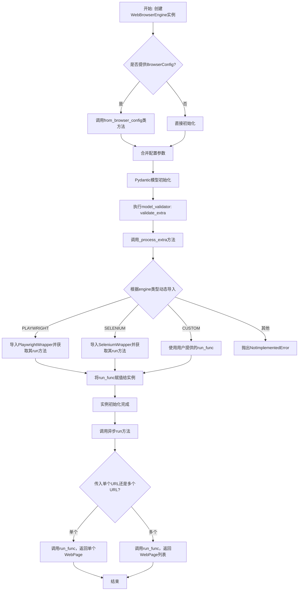
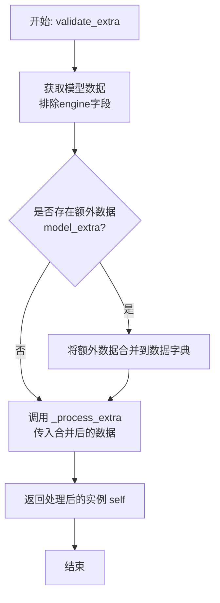
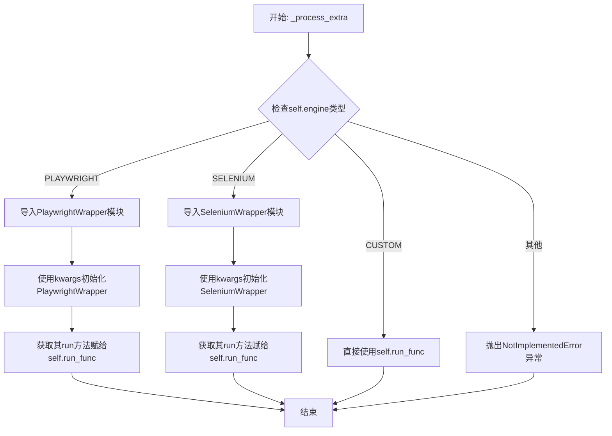
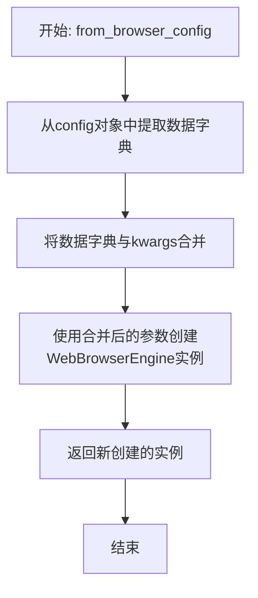
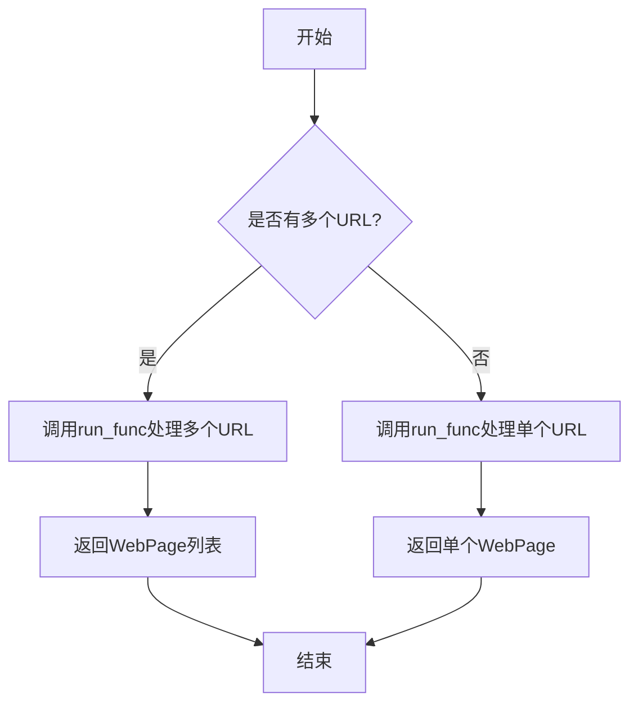

# `.\MetaGPT\metagpt\tools\web_browser_engine.py` 详细设计文档

该代码定义了一个WebBrowserEngine类，用于配置和管理不同的网页浏览器引擎（如Playwright、Selenium或自定义引擎），以提供统一的接口来执行自动化网页浏览和数据提取任务。它封装了引擎选择、代理设置、动态加载引擎实现以及运行网页抓取操作的核心功能。

## 整体流程



## 类结构

```
BaseModel (Pydantic基类)
└── WebBrowserEngine (网页浏览器引擎配置类)
```

## 全局变量及字段


### `WebBrowserEngine.model_config`
    
Pydantic模型配置字典，允许任意类型和额外字段，用于自定义类的验证和序列化行为。

类型：`pydantic.ConfigDict`
    


### `WebBrowserEngine.engine`
    
指定要使用的网页浏览器引擎类型，如PLAYWRIGHT、SELENIUM或CUSTOM。

类型：`WebBrowserEngineType`
    


### `WebBrowserEngine.run_func`
    
可选的协程函数，用于执行浏览器引擎的实际运行逻辑，根据engine类型动态设置。

类型：`Optional[Callable[..., Coroutine[Any, Any, Union[WebPage, list[WebPage]]]]]`
    


### `WebBrowserEngine.proxy`
    
可选的代理服务器URL，用于配置浏览器引擎的网络请求通过代理进行。

类型：`Optional[str]`
    
    

## 全局函数及方法

### `WebBrowserEngine.validate_extra`

该方法是一个Pydantic模型验证器，在模型实例化后自动调用。它的主要职责是处理模型初始化时传入的额外配置数据（`model_extra`），将其与模型已有的数据合并，并调用内部方法 `_process_extra` 来根据配置动态设置浏览器引擎的运行函数。

参数：
-  `self`：`WebBrowserEngine`，当前`WebBrowserEngine`模型实例。

返回值：`WebBrowserEngine`，返回经过验证和处理后的模型实例本身。

#### 流程图



#### 带注释源码

```python
@model_validator(mode="after")
def validate_extra(self):
    """Validates and processes extra configuration data after model initialization.

    This method is automatically called by Pydantic to validate and process any extra configuration
    data provided to the model. It ensures that the extra data is properly integrated into the model's
    configuration and operational logic.

    Returns:
        The instance itself after processing the extra data.
    """
    # 1. 获取当前模型实例的数据字典，排除'engine'字段、None值和默认值。
    data = self.model_dump(exclude={"engine"}, exclude_none=True, exclude_defaults=True)
    # 2. 检查模型初始化时是否传入了额外的配置数据（存储在`model_extra`中）。
    if self.model_extra:
        # 3. 如果存在额外数据，将其更新到上一步获取的数据字典中。
        data.update(self.model_extra)
    # 4. 调用内部方法`_process_extra`，将合并后的数据作为关键字参数传入，以配置运行函数。
    self._process_extra(**data)
    # 5. 返回处理后的模型实例本身，这是Pydantic验证器的标准做法。
    return self
```


### `WebBrowserEngine._process_extra`

该方法用于处理传递给`WebBrowserEngine`模型的额外配置参数（`kwargs`）。根据`engine`字段指定的浏览器引擎类型，动态导入对应的浏览器引擎包装器模块（如Playwright或Selenium），并使用提供的参数初始化该包装器，最后将其`run`方法赋值给实例的`run_func`字段。如果引擎类型为`CUSTOM`，则直接使用已存在的`run_func`。

参数：

-  `**kwargs`：`Any`，任意关键字参数，代表传递给模型的额外配置数据。这些参数将被用于初始化所选浏览器引擎的包装器。

返回值：`None`，此方法不返回任何值，其作用是通过副作用设置实例的`run_func`字段。

#### 流程图



#### 带注释源码

```python
def _process_extra(self, **kwargs):
    """Processes extra configuration data to set up the browser engine run function.

    Depending on the specified engine type, this method dynamically imports and configures
    the appropriate browser engine wrapper and its run function.

    Args:
        **kwargs: Arbitrary keyword arguments representing extra configuration data.

    Raises:
        NotImplementedError: If the engine type is not supported.
    """
    # 根据引擎类型选择不同的实现路径
    if self.engine is WebBrowserEngineType.PLAYWRIGHT:
        # 1. 导入Playwright引擎的包装器模块
        module = "metagpt.tools.web_browser_engine_playwright"
        # 2. 使用传入的kwargs初始化包装器，并获取其run方法
        run_func = importlib.import_module(module).PlaywrightWrapper(**kwargs).run
    elif self.engine is WebBrowserEngineType.SELENIUM:
        # 1. 导入Selenium引擎的包装器模块
        module = "metagpt.tools.web_browser_engine_selenium"
        # 2. 使用传入的kwargs初始化包装器，并获取其run方法
        run_func = importlib.import_module(module).SeleniumWrapper(**kwargs).run
    elif self.engine is WebBrowserEngineType.CUSTOM:
        # 对于自定义引擎，直接使用实例已有的run_func，不做额外处理
        run_func = self.run_func
    else:
        # 如果引擎类型不在支持列表中，抛出异常
        raise NotImplementedError
    # 将获取到的run方法赋值给实例的run_func字段，供后续`run`方法调用
    self.run_func = run_func
```


### `WebBrowserEngine.from_browser_config`

这是一个类方法，用于根据提供的 `BrowserConfig` 配置对象和可选的关键字参数，创建并返回一个配置好的 `WebBrowserEngine` 实例。它简化了从配置对象到引擎实例的转换过程。

参数：

- `config`：`BrowserConfig`，一个包含浏览器引擎基础配置（如引擎类型、代理等）的Pydantic模型对象。
- `**kwargs`：`Any`，可选的关键字参数，用于覆盖或补充从 `config` 对象中提取的配置数据。

返回值：`WebBrowserEngine`，返回一个根据 `config` 和 `**kwargs` 参数配置好的 `WebBrowserEngine` 类的新实例。

#### 流程图



#### 带注释源码

```python
    @classmethod
    def from_browser_config(cls, config: BrowserConfig, **kwargs):
        """Creates a WebBrowserEngine instance from a BrowserConfig object and additional keyword arguments.

        This class method facilitates the creation of a WebBrowserEngine instance by extracting
        configuration data from a BrowserConfig object and optionally merging it with additional
        keyword arguments.

        Args:
            config: A BrowserConfig object containing base configuration data.
            **kwargs: Optional additional keyword arguments to override or extend the configuration.

        Returns:
            A new instance of WebBrowserEngine configured according to the provided arguments.
        """
        # 1. 将传入的BrowserConfig对象转换为字典形式，提取其所有配置字段。
        data = config.model_dump()
        # 2. 使用提取的配置字典和传入的额外关键字参数，调用类的构造函数（__init__）来创建新实例。
        #    **kwargs 中的参数会覆盖 data 字典中同名的键值对。
        return cls(**data, **kwargs)
```

### `WebBrowserEngine.run`

该方法用于运行浏览器引擎以加载一个或多个网页。它根据配置的浏览器引擎类型（如Playwright、Selenium或自定义引擎）调用相应的运行函数，支持单URL或多URL的页面加载，并可设置每个页面的超时时间。

参数：

- `url`：`str`，第一个要加载的网页URL。
- `*urls`：`str`，可变参数，表示其他要加载的网页URL（可选）。
- `per_page_timeout`：`float`，每个页面的最大加载超时时间（秒），可选参数。

返回值：`Union[WebPage, list[WebPage]]`，如果只提供一个URL，则返回单个`WebPage`对象；如果提供多个URL，则返回`WebPage`对象的列表。

#### 流程图



#### 带注释源码

```python
async def run(self, url: str, *urls: str, per_page_timeout: float = None) -> WebPage | list[WebPage]:
    """Runs the browser engine to load one or more web pages.

    This method is the implementation of the overloaded run signatures. It delegates the task
    of loading web pages to the configured run function, handling either a single URL or multiple URLs.

    Args:
        url: The URL of the first web page to load.
        *urls: Additional URLs of web pages to load, if any.
        per_page_timeout: The maximum time for fetching a single page in seconds.

    Returns:
        A WebPage object if a single URL is provided, or a list of WebPage objects if multiple URLs are provided.
    """
    # 调用预先配置的run_func（例如PlaywrightWrapper.run或SeleniumWrapper.run）
    # 传入URL参数和可选的超时设置，由具体的浏览器引擎实现处理页面加载逻辑
    return await self.run_func(url, *urls, per_page_timeout=per_page_timeout)
```

## 关键组件


### WebBrowserEngine 类

定义了用于自动化浏览和数据提取的 Web 浏览器引擎配置。它封装了不同浏览器引擎（如 Playwright、Selenium 或自定义实现）的配置和操作逻辑，提供了一个统一的接口来运行浏览器自动化任务。

### 动态引擎加载与配置处理

通过 `_process_extra` 方法，根据 `engine` 字段指定的类型，动态导入对应的浏览器引擎包装器模块（如 `PlaywrightWrapper` 或 `SeleniumWrapper`），并设置其 `run` 方法作为本实例的执行函数。这实现了对不同底层引擎的灵活支持。

### 配置驱动的实例化

提供了 `from_browser_config` 类方法，允许从一个独立的 `BrowserConfig` 配置对象创建 `WebBrowserEngine` 实例，支持配置的集中管理和复用。

### 统一的操作接口

通过重载的 `run` 方法，为上层调用者提供了一个统一的异步接口来加载单个或多个网页，无论底层使用何种浏览器引擎，其调用方式保持一致。

### Pydantic 模型验证与扩展

利用 Pydantic 的 `BaseModel` 进行数据验证和序列化，并通过 `model_validator` 和 `model_config` 支持处理额外的配置参数，增强了类的健壮性和可扩展性。


## 问题及建议


### 已知问题

-   **动态导入与紧耦合**：`_process_extra` 方法在运行时通过字符串硬编码动态导入模块（如 `"metagpt.tools.web_browser_engine_playwright"`）。这导致 `WebBrowserEngine` 类与具体的引擎实现类（`PlaywrightWrapper`, `SeleniumWrapper`）存在紧耦合，且依赖特定的模块路径。一旦模块路径或类名发生变化，代码将无法工作，且不易于扩展新的浏览器引擎类型。
-   **`run_func` 的类型安全与默认值问题**：`run_func` 字段被标记为 `Field(exclude=True)`，这意味着它在序列化/反序列化时会被排除。然而，`_process_extra` 方法在验证后直接设置 `self.run_func`。如果通过 `model_dump()` 后再 `model_validate()` 重建对象，`run_func` 将丢失，导致后续 `run` 方法调用失败。此外，`run_func` 的默认值为 `None`，但在 `engine=CUSTOM` 时又期望它被提供，这种设计在类型提示和运行时检查上存在不一致的风险。
-   **`validate_extra` 方法的潜在数据覆盖风险**：`validate_extra` 方法将 `model_extra` 中的数据更新到 `data` 字典中，然后传递给 `_process_extra`。如果 `model_extra` 中的键与从 `model_dump` 得到的键（如 `proxy`）重复，`model_extra` 的值会覆盖前者。这可能与用户的预期不符，导致配置被意外修改。
-   **`run` 方法签名与实现的不完全匹配**：`run` 方法使用了 `@overload` 装饰器来定义两种调用签名，但其实现方法 `async def run(self, url: str, *urls: str, per_page_timeout: float = None) -> WebPage | list[WebPage]:` 的返回值类型提示是 `WebPage | list[WebPage]`。虽然这可以工作，但更精确的做法是使用 `Union[WebPage, list[WebPage]]` 以保持与 `@overload` 和 `run_func` 类型签名的一致性。此外，`per_page_timeout` 参数没有类型提示（应为 `Optional[float]`），且默认值 `None` 与 `float` 类型不匹配。

### 优化建议

-   **引入引擎注册机制以解耦**：建议实现一个浏览器引擎的注册表（Registry）模式。可以定义一个基类或协议（Protocol）`BrowserEngineWrapper`，然后通过装饰器或显式注册的方式，将 `WebBrowserEngineType` 枚举值与具体的包装器类关联起来。这样，`_process_extra` 方法可以通过查询注册表来获取对应的包装器类，而不是硬编码导入路径，大大提高了可扩展性和可维护性。
-   **重构 `run_func` 的初始化与生命周期管理**：考虑将 `run_func` 的初始化逻辑从 `_process_extra` 中分离出来，或者确保在对象反序列化后能重新正确初始化。可以提供一个 `initialize()` 或 `lazy_init()` 方法，在 `run` 方法首次被调用时检查并初始化 `run_func`。同时，为 `CUSTOM` 引擎类型提供更明确的验证，确保 `run_func` 在创建实例时已被提供。
-   **明确配置合并策略并增强验证**：在 `validate_extra` 方法或 `from_browser_config` 类方法中，明确配置项的优先级（例如，`kwargs` 参数应覆盖 `config` 中的值，而 `model_extra` 的处理策略需要文档说明）。可以考虑使用 `model_copy(update=...)` 来更安全地更新配置。同时，为 `proxy` 等字段添加更详细的验证（如 URL 格式校验）。
-   **完善类型注解与默认值**：将 `run` 方法中的 `per_page_timeout: float = None` 改为 `per_page_timeout: Optional[float] = None` 以符合类型检查。考虑使用 `typing.overload` 与 `Union` 类型保持严格一致。对于所有配置字段，确保其默认值（如 `proxy: Optional[str] = None`）符合 `Optional` 类型。
-   **增强错误处理与日志记录**：在 `_process_extra` 的动态导入环节、`run_func` 的调用环节添加更详细的异常捕获和日志记录，例如记录尝试导入的模块、引擎类型、发生的错误等，这将极大便利调试和运维。
-   **考虑异步初始化**：由于 `run_func` 可能涉及异步操作（如启动浏览器），可以考虑将 `WebBrowserEngine` 的初始化也设计为异步（例如，提供一个 `async def ainit()` 方法），以确保资源在首次使用前已正确准备就绪，避免在 `run` 方法中处理初始化可能带来的复杂性和潜在错误。


## 其它


### 设计目标与约束

1.  **统一接口**：为不同的浏览器自动化引擎（Playwright, Selenium, 自定义）提供一个一致的、异步的编程接口（`run` 方法），屏蔽底层引擎的差异。
2.  **灵活配置**：支持通过 `BrowserConfig` 对象、直接参数或 Pydantic 模型扩展的方式灵活配置浏览器引擎，包括代理设置。
3.  **可扩展性**：通过 `WebBrowserEngineType.CUSTOM` 类型支持用户注入自定义的浏览器运行函数，便于集成新的或专有的浏览器驱动。
4.  **类型安全**：利用 Python 类型注解和 Pydantic 模型进行数据验证和类型检查，确保配置和运行时数据的正确性。
5.  **异步友好**：核心的 `run` 方法设计为异步协程，以适应现代异步 I/O 框架，高效处理网络请求。

### 错误处理与异常设计

1.  **配置验证错误**：由 Pydantic 在模型初始化时自动处理，例如字段类型不匹配、必填字段缺失等，会抛出 `ValidationError`。
2.  **引擎不支持错误**：在 `_process_extra` 方法中，如果 `engine` 类型不是预定义的 `PLAYWRIGHT`、`SELENIUM` 或 `CUSTOM`，会抛出 `NotImplementedError`。
3.  **动态导入错误**：在 `_process_extra` 方法中动态导入引擎模块时，如果模块不存在或导入失败，会抛出 `ModuleNotFoundError` 或 `ImportError`。
4.  **运行时错误**：核心的 `run` 方法将错误处理委托给具体的引擎包装器（如 `PlaywrightWrapper.run`）。预期这些包装器会处理网络超时、页面加载失败、元素定位失败等特定于引擎的异常，并可能将其封装或重新抛出为更通用的异常（如 `TimeoutError`, `NavigationError`）。调用方需准备捕获这些异常。
5.  **自定义函数错误**：当使用 `CUSTOM` 引擎时，用户提供的 `run_func` 可能抛出任何异常，需要调用方根据其契约进行处理。

### 数据流与状态机

1.  **初始化数据流**：
    *   **路径A（直接构造）**：用户提供 `engine`, `proxy` 等参数 -> Pydantic 实例化 `WebBrowserEngine` -> `model_validator` (`validate_extra`) 触发 -> `_process_extra` 根据 `engine` 类型动态设置 `run_func`。
    *   **路径B（工厂方法）**：用户提供 `BrowserConfig` 和可选 `kwargs` -> `from_browser_config` 类方法合并配置 -> 调用类构造器（同路径A）。
2.  **运行时数据流**：
    *   **输入**：用户调用 `run(url, *urls, per_page_timeout)`。
    *   **处理**：方法内部调用已初始化的 `self.run_func`，并将所有参数传递给它。
    *   **输出**：`run_func` 执行具体的浏览器操作（导航、等待、抓取），返回 `WebPage` 或 `list[WebPage]` 对象，最终由 `run` 方法返回给调用者。
3.  **状态机**：该类本身是无状态的配置持有者和执行代理。其核心状态是 `run_func` 的引用，在对象初始化后即确定，后续的 `run` 调用都使用此函数。具体的浏览器会话状态（如页面句柄、cookies）由底层引擎包装器管理。

### 外部依赖与接口契约

1.  **外部依赖**：
    *   **Pydantic**：用于数据模型定义、验证、序列化/反序列化。
    *   **importlib**：用于运行时动态加载浏览器引擎实现模块。
    *   **metagpt.tools.web_browser_engine_playwright**：Playwright 引擎的具体实现模块（假设存在）。
    *   **metagpt.tools.web_browser_engine_selenium**：Selenium 引擎的具体实现模块（假设存在）。
    *   **metagpt.configs.browser_config.BrowserConfig**：浏览器配置的数据模型。
    *   **metagpt.utils.parse_html.WebPage**：表示解析后网页数据的模型。
    *   **底层浏览器驱动**：Playwright 需要安装 `playwright` 包及其浏览器；Selenium 需要 `selenium` 包及对应的 WebDriver。
2.  **接口契约**：
    *   **`run_func` 签名契约**：任何被设置为 `run_func` 的可调用对象（包括内置的 Playwright/Selenium 包装器的 `run` 方法以及用户自定义函数）必须遵守以下异步函数签名：`Callable[..., Coroutine[Any, Any, Union[WebPage, list[WebPage]]]]`。它应接受 `(url: str, *urls: str, per_page_timeout: float = None)` 参数，并返回单个 `WebPage` 或多个 `WebPage` 的列表。
    *   **引擎包装器契约**：`metagpt.tools.web_browser_engine_*` 模块中的包装器类（如 `PlaywrightWrapper`, `SeleniumWrapper`）必须提供一个 `run` 方法，其签名符合上述 `run_func` 契约，并且能够接受 `**kwargs` 配置参数（如 `proxy`）进行初始化。
    *   **`WebPage` 模型契约**：返回的 `WebPage` 对象应包含网页抓取后的结构化数据（如文本、链接、截图等），其具体结构由 `metagpt.utils.parse_html` 模块定义。

### 安全与合规考虑

1.  **代理使用**：支持通过 `proxy` 字段配置代理服务器，可用于访问受地域限制的内容或进行匿名抓取，但用户需确保代理的合法性和稳定性。
2.  **资源管理**：该类不直接管理浏览器进程的生命周期。资源（如浏览器实例、连接）的创建和清理责任在于具体的引擎包装器（`PlaywrightWrapper`, `SeleniumWrapper`）或用户提供的 `CUSTOM` 函数。需要确保这些包装器在异常情况下也能正确释放资源，避免资源泄漏。
3.  **遵守 `robots.txt`**：当前的抽象层面未强制实施对目标网站 `robots.txt` 的检查。合规的网页抓取应由调用方或在具体的引擎包装器/业务逻辑中实现。
4.  **输入验证**：对 `run` 方法的 `url` 参数未进行严格的格式验证或安全过滤。调用方应确保传入的 URL 是合法且安全的，防止诸如 SSRF (Server-Side Request Forgery) 等攻击（如果该代码运行在服务器端）。
5.  **动态代码加载**：`_process_extra` 方法使用 `importlib.import_module` 动态加载模块。这依赖于预定义的、受信任的模块路径。应防止模块路径被恶意注入，尽管在当前上下文中风险较低，因为 `engine` 是枚举类型。


    