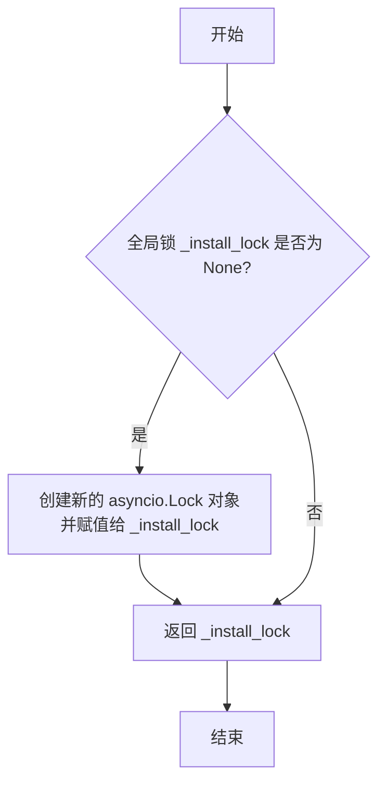
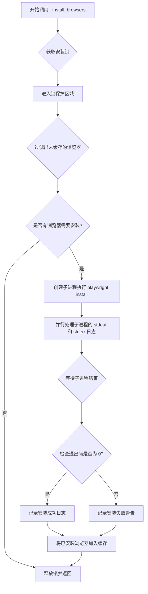
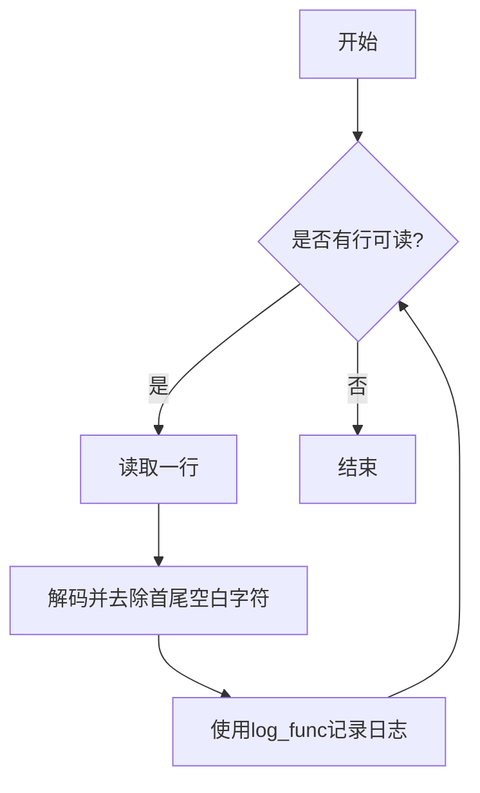
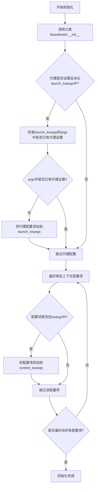
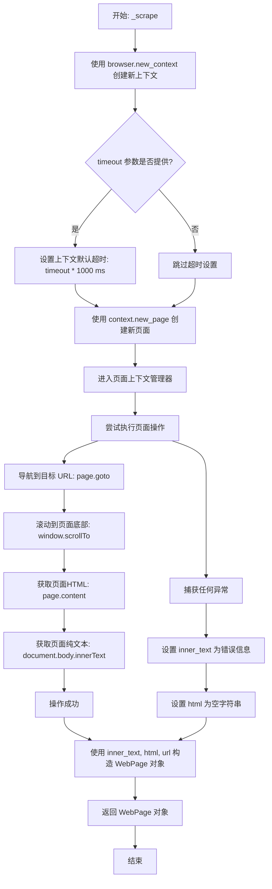

# `.\MetaGPT\metagpt\tools\web_browser_engine_playwright.py` 详细设计文档

该代码提供了一个基于 Playwright 的异步网页抓取包装器，核心功能是自动化浏览器操作以获取网页的 HTML 内容和纯文本内容。它封装了浏览器的启动、页面导航、滚动和内容提取等复杂操作，支持多浏览器类型、代理配置和超时设置，并包含浏览器环境的自动检查和安装机制，确保在缺少必要浏览器组件时能够自动安装。

## 整体流程

```mermaid
graph TD
    A[调用 PlaywrightWrapper.run()] --> B{是否传入多个URL?}
    B -- 是 --> C[并发抓取多个页面]
    B -- 否 --> D[抓取单个页面]
    C --> E[启动异步上下文 async_playwright]
    D --> E
    E --> F[执行浏览器环境预检查 _run_precheck]
    F --> G{浏览器是否存在?}
    G -- 否 --> H[异步安装浏览器 _install_browsers]
    G -- 是 --> I[启动指定类型浏览器]
    H --> I
    I --> J[为每个URL创建浏览器上下文和页面]
    J --> K[导航到目标URL]
    K --> L[滚动到页面底部]
    L --> M[提取页面HTML和innerText]
    M --> N[封装结果到WebPage对象]
    N --> O[返回WebPage对象或列表]
```

## 类结构

```
PlaywrightWrapper (Pydantic BaseModel)
├── 字段: browser_type, launch_kwargs, proxy, context_kwargs, _has_run_precheck
├── 方法: __init__, run, _scrape, _run_precheck
全局函数
├── _get_install_lock
├── _install_browsers
└── _log_stream
全局变量
├── _install_lock
└── _install_cache
```

## 全局变量及字段


### `_install_lock`
    
全局锁，用于确保浏览器安装过程在多协程环境下的线程安全，防止重复安装。

类型：`asyncio.Lock | None`
    


### `_install_cache`
    
全局缓存集合，用于记录已经成功安装的浏览器类型，避免重复执行安装命令。

类型：`set`
    


### `PlaywrightWrapper.browser_type`
    
指定要使用的浏览器引擎类型，默认为chromium。

类型：`Literal["chromium", "firefox", "webkit"]`
    


### `PlaywrightWrapper.launch_kwargs`
    
传递给Playwright浏览器启动方法的参数字典，用于配置浏览器实例。

类型：`dict`
    


### `PlaywrightWrapper.proxy`
    
可选的代理服务器地址，用于配置浏览器通过代理进行网络连接。

类型：`Optional[str]`
    


### `PlaywrightWrapper.context_kwargs`
    
传递给Playwright浏览器上下文创建方法的参数字典，用于配置浏览器上下文（如忽略HTTPS错误、设置User-Agent等）。

类型：`dict`
    


### `PlaywrightWrapper._has_run_precheck`
    
私有属性，标记浏览器环境预检查（如检查浏览器二进制文件是否存在）是否已执行，避免重复检查。

类型：`bool`
    
    

## 全局函数及方法


### `_get_install_lock`

该函数是一个全局辅助函数，用于获取一个全局的异步锁（`asyncio.Lock`）实例。它实现了单例模式，确保在整个应用程序中，用于控制浏览器安装过程的锁对象只有一个实例。这可以防止在并发环境下多个协程同时执行`playwright install`命令，从而避免潜在的安装冲突或错误。

参数：
- 无

返回值：`asyncio.Lock`，返回一个全局唯一的异步锁对象，用于同步浏览器安装操作。

#### 流程图



#### 带注释源码

```
def _get_install_lock():
    # 声明引用全局变量 _install_lock
    global _install_lock
    # 检查全局锁对象是否已被初始化（是否为None）
    if _install_lock is None:
        # 如果未初始化，则创建一个新的 asyncio.Lock 实例
        _install_lock = asyncio.Lock()
    # 返回全局锁对象（无论是新创建的还是已存在的）
    return _install_lock
```


### `_install_browsers`

一个异步全局函数，用于通过调用 Playwright 命令行工具来安装指定的浏览器。它实现了安装锁机制和缓存机制，以防止并发重复安装并记录已安装的浏览器。

参数：

-  `*browsers`：`str`，可变位置参数，表示需要安装的浏览器类型名称（如 `"chromium"`, `"firefox"`, `"webkit"`）。
-  `**kwargs`：`dict`，可变关键字参数，传递给 `asyncio.create_subprocess_exec` 的额外参数，例如用于设置代理的环境变量。

返回值：`None`，该函数不返回任何值，其主要作用是执行安装浏览器的副作用。

#### 流程图



#### 带注释源码

```python
async def _install_browsers(*browsers, **kwargs) -> None:
    # 1. 获取全局安装锁，确保同一时间只有一个安装任务在执行
    async with _get_install_lock():
        # 2. 根据全局缓存 `_install_cache` 过滤掉已经安装过的浏览器，避免重复安装
        browsers = [i for i in browsers if i not in _install_cache]
        # 3. 如果没有需要安装的浏览器，直接返回
        if not browsers:
            return
        # 4. 创建一个异步子进程，调用系统 Python 解释器执行 `playwright install` 命令
        #    `*browsers` 作为参数传递给该命令，`**kwargs` 用于配置子进程环境（如代理）
        process = await asyncio.create_subprocess_exec(
            sys.executable,  # 当前 Python 解释器
            "-m", "playwright", "install",  # 执行 playwright 模块的 install 命令
            *browsers,  # 要安装的浏览器列表
            # "--with-deps",  # 注释掉的选项，用于安装系统依赖
            stdout=asyncio.subprocess.PIPE,  # 捕获标准输出
            stderr=asyncio.subprocess.PIPE,  # 捕获标准错误
            **kwargs,  # 其他子进程参数，如环境变量
        )

        # 5. 并行启动两个协程，分别处理子进程的标准输出和标准错误流，并记录日志
        await asyncio.gather(_log_stream(process.stdout, logger.info), _log_stream(process.stderr, logger.warning))

        # 6. 等待子进程执行完毕，并获取其退出码
        if await process.wait() == 0:
            # 7. 如果退出码为 0，表示安装成功
            logger.info("Install browser for playwright successfully.")
        else:
            # 8. 如果退出码非 0，表示安装失败
            logger.warning("Fail to install browser for playwright.")
        # 9. 无论成功与否，都将尝试安装的浏览器名称添加到全局缓存中
        #    这可以防止因网络等问题安装失败后，后续每次调用都重复尝试安装
        _install_cache.update(browsers)
```


### `_log_stream`

该函数是一个异步辅助函数，用于实时读取并记录子进程（例如 Playwright 浏览器安装进程）的标准输出或标准错误流。它将读取到的每一行日志，通过指定的日志函数（如 `logger.info` 或 `logger.warning`）进行格式化输出，从而实现对安装过程的监控和日志记录。

参数：

- `sr`：`asyncio.StreamReader`，一个异步流读取器，用于读取子进程的输出流（如 `stdout` 或 `stderr`）。
- `log_func`：`Callable[[str], None]`，一个可调用的日志函数，用于处理并输出读取到的日志行。通常传入 `logger.info` 或 `logger.warning` 等方法。

返回值：`None`，该函数不返回任何值，其主要作用是执行副作用（即记录日志）。

#### 流程图



#### 带注释源码

```python
async def _log_stream(sr, log_func):
    """
    异步读取流（sr）中的每一行，并使用提供的日志函数（log_func）进行记录。

    参数:
        sr: asyncio.StreamReader，子进程的输出流（如stdout或stderr）。
        log_func: 一个可调用对象，用于记录日志字符串（例如logger.info或logger.warning）。
    """
    while True:
        # 异步读取流中的一行数据
        line = await sr.readline()
        # 如果读取到空行（EOF），则退出循环
        if not line:
            return
        # 将字节流解码为字符串，并去除首尾的空白字符（如换行符）
        # 然后使用log_func函数记录日志，并添加前缀以便识别
        log_func(f"[playwright install browser]: {line.decode().strip()}")
```

### `PlaywrightWrapper.__init__`

初始化 `PlaywrightWrapper` 实例，配置浏览器启动参数和上下文参数，包括代理设置和从传入的关键字参数中提取特定的上下文配置项。

参数：

- `**kwargs`：`dict`，传入的关键字参数，用于初始化父类 `BaseModel` 并提取特定的上下文配置项（如 `ignore_https_errors`、`java_script_enabled` 等）。

返回值：`None`，无返回值。

#### 流程图



#### 带注释源码

```python
def __init__(self, **kwargs):
    # 调用父类 BaseModel 的初始化方法，传入所有关键字参数
    super().__init__(**kwargs)

    # 获取实例的 launch_kwargs 字典
    launch_kwargs = self.launch_kwargs
    # 检查是否设置了代理，并且代理配置尚未在 launch_kwargs 中
    if self.proxy and "proxy" not in launch_kwargs:
        # 获取 launch_kwargs 中的 args 列表，如果不存在则默认为空列表
        args = launch_kwargs.get("args", [])
        # 检查 args 列表中是否已有以 "--proxy-server=" 开头的代理设置
        if not any(str.startswith(i, "--proxy-server=") for i in args):
            # 如果没有，则将代理配置添加到 launch_kwargs 中
            launch_kwargs["proxy"] = {"server": self.proxy}

    # 遍历需要从 kwargs 中提取并设置到 context_kwargs 的配置项
    for key in ["ignore_https_errors", "java_script_enabled", "extra_http_headers", "user_agent"]:
        # 如果当前配置项在传入的 kwargs 中
        if key in kwargs:
            # 将该配置项及其值添加到 context_kwargs 字典中
            self.context_kwargs[key] = kwargs[key]
```

### `PlaywrightWrapper.run`

`PlaywrightWrapper.run` 是 `PlaywrightWrapper` 类的核心异步方法，用于启动一个无头浏览器，导航到一个或多个给定的URL，抓取页面内容（包括HTML和纯文本），并将结果封装为 `WebPage` 对象返回。它支持批量处理多个URL，并允许为每个页面设置超时时间。

参数：
- `url`：`str`，要抓取的首个网页URL。
- `*urls`：`str`，可变参数，用于接收零个或多个额外的网页URL。
- `per_page_timeout`：`float`，可选参数，指定每个页面加载的最大超时时间（单位：秒）。如果为 `None`，则使用Playwright的默认超时设置。

返回值：`WebPage | list[WebPage]`，当只传入一个 `url` 时，返回单个 `WebPage` 对象；当传入多个URL（通过 `*urls`）时，返回一个 `WebPage` 对象列表。

#### 流程图

```mermaid
flowchart TD
    A[开始: run(url, *urls, per_page_timeout)] --> B{是否传入了多个URL?<br>即 urls 非空?}
    B -- 是 --> C[使用 asyncio.gather 并发执行 _scrape<br>抓取所有URL]
    C --> D[返回 WebPage 对象列表]
    B -- 否 --> E[执行 _scrape 抓取单个URL]
    E --> F[返回单个 WebPage 对象]

    subgraph _scrape [子流程: _scrape(browser, url, timeout)]
        G[创建新的浏览器上下文] --> H[设置页面超时（如提供）]
        H --> I[创建新页面]
        I --> J{尝试访问URL并抓取内容}
        J -- 成功 --> K[获取页面HTML和纯文本]
        J -- 失败 --> L[捕获异常，设置错误信息]
        K --> M[返回 WebPage 对象]
        L --> M
    end

    C -.-> _scrape
    E -.-> _scrape
```

#### 带注释源码

```python
async def run(self, url: str, *urls: str, per_page_timeout: float = None) -> WebPage | list[WebPage]:
    # 使用 async_playwright 上下文管理器，确保 Playwright 资源被正确清理
    async with async_playwright() as ap:
        # 根据配置的 browser_type（如 'chromium'）获取对应的浏览器类型对象
        browser_type = getattr(ap, self.browser_type)
        # 运行前置检查，确保浏览器已安装
        await self._run_precheck(browser_type)
        # 使用配置的启动参数启动浏览器实例
        browser = await browser_type.launch(**self.launch_kwargs)
        # 将内部方法 _scrape 赋值给局部变量，方便在后续的异步任务中使用
        _scrape = self._scrape

        # 判断是否传入了多个URL（通过可变参数 *urls）
        if urls:
            # 如果传入了多个URL，使用 asyncio.gather 并发执行所有抓取任务
            # 第一个任务是抓取主URL（url），其余任务通过生成器表达式创建
            return await asyncio.gather(
                _scrape(browser, url, per_page_timeout), *(_scrape(browser, i, per_page_timeout) for i in urls)
            )
        # 如果只传入了一个URL，则只执行单个抓取任务
        return await _scrape(browser, url, per_page_timeout)
```

### `PlaywrightWrapper._scrape`

该方法使用 Playwright 浏览器实例异步抓取指定 URL 的网页内容，包括 HTML 和纯文本，并封装成 `WebPage` 对象返回。它负责创建浏览器上下文和页面，导航到目标 URL，执行滚动操作以确保动态内容加载，并处理可能发生的页面加载异常。

参数：

- `browser`：`Browser`，已启动的 Playwright 浏览器实例，用于创建新的上下文和页面。
- `url`：`str`，要抓取的目标网页的 URL。
- `timeout`：`float`，可选参数，指定页面操作的超时时间（单位：秒）。如果提供，将设置上下文的默认超时。

返回值：`WebPage`，一个包含网页内部纯文本 (`inner_text`)、HTML 源码 (`html`) 和原始 URL (`url`) 的数据对象。即使在页面加载失败时，也会返回一个包含错误信息的 `WebPage` 对象。

#### 流程图



#### 带注释源码

```python
async def _scrape(self, browser, url, timeout: float = None):
    # 使用传入的浏览器实例和配置的上下文参数创建一个新的浏览器上下文。
    # 上下文是独立的会话，可以拥有自己的 cookies、缓存等。
    context = await browser.new_context(**self.context_kwargs)

    # 如果调用者指定了超时时间，则将其应用到该上下文中。
    # Playwright 的超时单位是毫秒，因此需要将秒转换为毫秒。
    if timeout is not None:
        context.set_default_timeout(timeout * 1000)  # playwright uses milliseconds.

    # 在刚创建的上下文中打开一个新的标签页（页面）。
    page = await context.new_page()
    # 使用异步上下文管理器管理页面生命周期，确保在操作完成后正确关闭页面。
    async with page:
        try:
            # 核心步骤1：导航到指定的 URL。
            await page.goto(url)
            # 核心步骤2：通过执行 JavaScript 将页面滚动到底部。
            # 这有助于触发懒加载的内容（如图片、动态加载的列表项等）。
            await page.evaluate("window.scrollTo(0, document.body.scrollHeight)")
            # 核心步骤3：获取滚动加载后页面的完整 HTML 源代码。
            html = await page.content()
            # 核心步骤4：获取页面 body 元素的纯文本内容，这通常用于后续的文本分析。
            inner_text = await page.evaluate("() => document.body.innerText")
        except Exception as e:
            # 异常处理：如果上述任何步骤失败（如网络超时、页面崩溃等），
            # 则记录错误信息，并将 HTML 设为空字符串。
            inner_text = f"Fail to load page content for {e}"
            html = ""
        # 无论成功与否，都将获取到的（或错误状态下的）文本、HTML 和原始 URL 封装成 WebPage 对象返回。
        # 这保证了方法始终有确定的返回值。
        return WebPage(inner_text=inner_text, html=html, url=url)
```

### `PlaywrightWrapper._run_precheck`

该方法用于执行Playwright浏览器启动前的预检查。主要功能是检查指定浏览器类型的可执行文件是否存在，如果不存在且未在启动参数中指定可执行路径，则尝试通过`playwright install`命令安装对应的浏览器。它还处理了操作系统可能不被Playwright官方支持的情况，尝试查找并使用回退版本的浏览器可执行文件。

参数：

- `browser_type`：`playwright.async_api.BrowserType`，Playwright浏览器类型对象，用于获取浏览器可执行路径和相关信息。

返回值：`None`，无返回值。

#### 流程图

```mermaid
flowchart TD
    A[开始] --> B{_has_run_precheck 为 True?}
    B -- 是 --> C[直接返回]
    B -- 否 --> D[获取浏览器可执行路径 executable_path]
    D --> E{executable_path 存在 且<br>launch_kwargs 中无 executable_path?}
    E -- 是 --> F[设置 _has_run_precheck = True]
    E -- 否 --> G{executable_path 不存在?}
    G -- 否 --> F
    G -- 是 --> H[准备安装参数 kwargs]
    H --> I[调用 _install_browsers 安装浏览器]
    I --> J{安装后 _has_run_precheck 为 True?}
    J -- 是 --> C
    J -- 否 --> K{executable_path 仍不存在?}
    K -- 否 --> F
    K -- 是 --> L[查找回退版本浏览器路径]
    L --> M{找到可用路径?}
    M -- 否 --> F
    M -- 是 --> N[设置 launch_kwargs['executable_path']]
    N --> F
    F --> C
```

#### 带注释源码

```python
async def _run_precheck(self, browser_type):
    # 如果已经运行过预检查，则直接返回，避免重复执行
    if self._has_run_precheck:
        return

    # 获取浏览器可执行文件的路径
    executable_path = Path(browser_type.executable_path)
    # 检查可执行文件是否存在，并且启动参数中没有手动指定可执行路径
    if not executable_path.exists() and "executable_path" not in self.launch_kwargs:
        # 准备安装浏览器时可能需要的参数，例如代理设置
        kwargs = {}
        if self.proxy:
            kwargs["env"] = {"ALL_PROXY": self.proxy}
        # 调用内部函数安装浏览器
        await _install_browsers(self.browser_type, **kwargs)

        # 安装后再次检查标志位（可能在安装过程中被其他并发调用设置）
        if self._has_run_precheck:
            return

        # 安装后再次检查可执行文件是否存在
        if not executable_path.exists():
            # 如果仍然不存在，可能是操作系统不被Playwright官方支持
            # 尝试在安装目录中查找回退版本的浏览器（例如 chromium-xxxx/chrome-linux/chrome）
            parts = executable_path.parts
            # 构建搜索模式，查找类似 chromium-* 的目录
            available_paths = list(Path(*parts[:-3]).glob(f"{self.browser_type}-*"))
            if available_paths:
                # 发出警告，提示用户操作系统可能不受官方支持
                logger.warning(
                    "It seems that your OS is not officially supported by Playwright. "
                    "Try to set executable_path to the fallback build version."
                )
                # 使用找到的第一个回退版本路径，并拼接上后续的子路径（如 chrome-linux/chrome）
                executable_path = available_paths[0].joinpath(*parts[-2:])
                # 将找到的回退路径设置到启动参数中
                self.launch_kwargs["executable_path"] = str(executable_path)
    # 无论是否执行了安装或路径查找，最终都将标志位设为True，表示预检查已完成
    self._has_run_precheck = True
```

## 关键组件


### PlaywrightWrapper 类

一个基于 Pydantic 的包装器类，用于封装 Playwright 浏览器自动化库，提供浏览器启动、页面导航、内容抓取以及浏览器环境预检查等核心功能。

### 浏览器环境预检查与安装机制 (`_run_precheck` 方法)

一个惰性初始化机制，在首次运行前检查指定类型的浏览器二进制文件是否存在，若不存在则通过异步子进程调用 `playwright install` 命令自动安装，并处理非官方支持操作系统的回退路径。

### 异步浏览器安装函数 (`_install_browsers`)

一个全局辅助函数，使用异步锁 (`_install_lock`) 确保浏览器安装过程的线程安全，并通过创建子进程执行 Playwright 的安装命令，同时实时捕获并记录安装过程的输出日志。

### 代理与启动参数配置逻辑 (`__init__` 方法)

在类初始化时，自动将用户提供的代理设置整合到浏览器的启动参数中，并将部分关键字参数（如 `ignore_https_errors`, `user_agent` 等）映射到浏览器上下文的配置中，简化了外部调用时的配置复杂度。

### 页面抓取核心流程 (`_scrape` 方法)

负责创建新的浏览器上下文和页面，导航至目标 URL，执行滚动操作以加载动态内容，最终提取页面的 HTML 源码和纯文本内容，并包装成 `WebPage` 对象返回。包含基本的超时设置和异常处理。

### 并发页面抓取调度 (`run` 方法)

作为主要对外接口，该方法管理 Playwright 实例的生命周期，支持同步抓取单个页面或使用 `asyncio.gather` 并发抓取多个页面，并统一返回 `WebPage` 对象或对象列表。


## 问题及建议


### 已知问题

-   **并发安装浏览器时的竞态条件**：`_install_browsers` 函数使用了一个全局锁 `_install_lock` 来防止并发安装，但 `_install_cache` 的更新和检查操作不是原子性的。在极端高并发场景下，多个协程可能同时通过 `if i not in _install_cache` 检查，导致重复执行安装命令。
-   **代理配置逻辑不完整**：在 `__init__` 方法中，当通过 `kwargs` 传入 `proxy` 时，会尝试将其配置到 `launch_kwargs` 中。然而，如果 `launch_kwargs` 中已经存在一个 `"proxy"` 键（其值可能不是 `{"server": proxy}` 格式），此逻辑会直接跳过，可能导致代理设置不生效或与预期不符。
-   **`_has_run_precheck` 状态管理缺陷**：`_run_precheck` 方法在成功执行后会将 `_has_run_precheck` 设置为 `True`。但是，如果预检查逻辑因为找不到浏览器可执行文件而失败（例如，在不受支持的操作系统上且没有可用的备用路径），这个标志位仍然会被设置为 `True`，导致后续调用直接返回，问题被永久忽略。
-   **异常处理粒度较粗**：`_scrape` 方法在 `page.goto` 和后续操作中捕获了所有 `Exception`。这虽然能防止单次抓取失败导致整个程序崩溃，但也可能掩盖了重要的错误信息（如网络配置错误、页面严重JavaScript错误等），不利于调试和问题定位。
-   **资源清理可能不充分**：`_scrape` 方法使用 `async with page:` 来确保页面关闭，但 `browser` 和 `context` 对象仅在 `run` 方法结束时（通过 `async with async_playwright()`）隐式关闭。如果在 `run` 方法执行过程中发生异常，`browser` 和 `context` 可能无法被正确清理，存在资源泄漏风险。

### 优化建议

-   **增强安装逻辑的原子性**：将 `_install_cache` 的检查和更新操作置于锁的保护之下，或者使用线程/进程安全的数据结构（如 `asyncio.Queue` 或 `set` 配合锁）来确保同一浏览器只被安装一次。
-   **重构代理配置逻辑**：明确代理设置的优先级。建议：1) 如果 `launch_kwargs` 中已显式设置了 `"proxy"`，则以其为准；2) 否则，如果类初始化参数中提供了 `proxy`，则使用它来构造 `launch_kwargs["proxy"]`。同时，考虑将 `args` 中的 `--proxy-server` 参数与 `proxy` 设置统一处理，避免冲突。
-   **改进预检查状态管理**：将 `_has_run_precheck` 设置为 `True` 的逻辑应仅在预检查**成功完成**后执行。如果预检查失败（例如，未找到浏览器且安装也失败），应抛出明确的异常或记录错误，并保持 `_has_run_precheck` 为 `False`，以便下次调用时重试。
-   **细化异常处理与日志记录**：在 `_scrape` 方法中，考虑捕获更具体的异常类型（如 `TimeoutError`, `NetworkError`），并对不同异常进行差异化处理（如重试、跳过或记录详细错误）。同时，将捕获的异常信息更丰富地记录到返回的 `WebPage` 对象或日志中。
-   **显式管理浏览器和上下文生命周期**：考虑在 `run` 方法内部也使用 `async with` 语句来管理 `browser` 和 `context` 对象，确保在任何情况下（包括异常）都能正确关闭它们。或者，将 `PlaywrightWrapper` 设计为异步上下文管理器，让调用方控制其生命周期。
-   **增加配置验证**：在 `__init__` 方法或通过 Pydantic 验证器，对 `launch_kwargs` 和 `context_kwargs` 等配置进行基本验证，避免传入无效参数导致运行时深层错误。
-   **提升代码可测试性**：将 `_install_browsers`、`_log_stream` 等函数以及浏览器启动逻辑 (`browser_type.launch`) 通过依赖注入或设为可重写的方法，以便在单元测试中进行模拟（Mock），提高测试覆盖率。
-   **考虑性能优化**：对于批量抓取多个URL的场景，可以复用同一个浏览器实例，但为每个URL创建新的上下文（Context）和页面（Page）。当前实现已经做到了这一点。可以进一步评估是否需要在多次 `run` 调用之间复用浏览器实例（通过将 `browser` 作为实例变量），但这会增加状态管理的复杂性。


## 其它


### 设计目标与约束

1.  **核心目标**：提供一个异步、可配置的Playwright浏览器自动化封装，用于高效、可靠地抓取网页内容（HTML和文本）。
2.  **关键约束**：
    *   **异步支持**：所有主要操作必须支持异步，以支持高并发网页抓取。
    *   **浏览器兼容性**：支持Chromium、Firefox和WebKit三种浏览器引擎。
    *   **代理支持**：允许通过配置代理服务器进行网络访问。
    *   **自动环境准备**：在首次运行时，若检测到缺失必要的浏览器二进制文件，应尝试自动安装。
    *   **资源管理**：正确管理浏览器实例、上下文和页面的生命周期，避免资源泄漏。
    *   **错误隔离**：单个页面的抓取失败不应影响其他并发抓取任务。

### 错误处理与异常设计

1.  **页面加载错误**：在`_scrape`方法中，使用`try...except`块包裹`page.goto`等核心操作。当页面加载失败时，捕获`Exception`，记录错误信息，并返回一个包含错误提示文本的`WebPage`对象，而非抛出异常，确保单个URL的失败不会中断整个批处理流程。
2.  **浏览器安装错误**：在`_install_browsers`函数中，通过检查子进程的退出码来判断浏览器安装是否成功。无论成功与否，都会通过日志记录详细信息，但不会向上抛出异常，而是依赖后续的路径检查（`_run_precheck`）来决定是否使用备用路径或最终失败。
3.  **并发控制**：通过全局的`_install_lock`（异步锁）确保浏览器安装过程是线程安全的，防止在多协程环境下重复安装或产生竞争条件。
4.  **超时控制**：支持通过`per_page_timeout`参数为每个页面设置加载超时（转换为毫秒后通过`context.set_default_timeout`设置），防止因个别页面无响应导致长时间阻塞。

### 数据流与状态机

1.  **主要数据流**：
    *   **输入**：URL（单个或多个）、浏览器配置（类型、启动参数、代理等）。
    *   **处理**：
        *   初始化`PlaywrightWrapper`实例，合并代理等配置。
        *   执行环境预检（`_run_precheck`），检查并可能安装浏览器。
        *   启动浏览器，创建上下文和页面。
        *   导航至URL，滚动页面，获取HTML和文本内容。
        *   将内容封装为`WebPage`对象。
    *   **输出**：单个`WebPage`对象或`WebPage`对象列表。
2.  **状态管理**：
    *   `_has_run_precheck`：私有属性，用于标记是否已执行过浏览器环境预检，避免重复检查。
    *   `_install_cache`：全局集合，缓存已成功安装的浏览器类型，避免重复安装。
    *   **浏览器实例生命周期**：通过`async with async_playwright() as ap:`和`async with page:`管理，确保在作用域结束时正确清理资源。

### 外部依赖与接口契约

1.  **外部库依赖**：
    *   `playwright`：核心浏览器自动化库。需通过`playwright install`安装浏览器二进制文件。
    *   `pydantic`：用于数据验证和设置管理，定义`PlaywrightWrapper`的配置模型。
    *   `asyncio`：提供异步执行框架。
    *   `metagpt.utils.parse_html.WebPage`：定义了输出数据的结构（`inner_text`, `html`, `url`）。本模块依赖于该数据模型。
2.  **系统依赖**：
    *   需要系统支持`playwright`安装的浏览器二进制文件（Chromium, Firefox, WebKit）。对于非官方支持的系统，代码提供了寻找备用路径的降级逻辑。
3.  **接口契约**：
    *   `PlaywrightWrapper.run()`：主入口方法。接受URL和超时参数，返回`WebPage`对象。其行为由类的字段（`browser_type`, `launch_kwargs`, `proxy`, `context_kwargs`）严格定义。
    *   `_install_browsers()`：内部全局函数。契约是执行`playwright install`命令并记录输出。它依赖于全局状态`_install_lock`和`_install_cache`进行同步和缓存。

### 并发与性能考量

1.  **异步并发**：`run`方法支持传入多个URL，内部使用`asyncio.gather`并发执行多个`_scrape`任务，充分利用异步I/O提升抓取效率。
2.  **资源复用**：对于批量URL抓取，所有任务共享同一个`browser`实例，但每个任务使用独立的`context`和`page`。这平衡了资源开销与隔离性。
3.  **安装锁**：浏览器安装过程使用全局锁进行串行化，这是正确的，因为安装是重量级操作且不应并行执行。安装结果被缓存以提升后续性能。
4.  **潜在瓶颈**：单个浏览器实例的并发页面数存在上限。对于超大规模并发，可能需要创建多个`PlaywrightWrapper`实例或使用浏览器池模式，当前设计未涉及此优化。

### 安全与配置

1.  **代理配置**：支持HTTP/HTTPS/SOCKS代理。配置逻辑在`__init__`中处理，优先使用`launch_kwargs`中显式指定的代理，否则根据`proxy`字段构造。
2.  **上下文配置**：通过`context_kwargs`可传递Playwright的`Browser.new_context`参数，如`ignore_https_errors`（忽略HTTPS证书错误）、`user_agent`（设置用户代理）等，提供了灵活的浏览器环境定制能力。
3.  **安全警告**：代码中使用了`ignore_https_errors`等配置选项，这些在绕过某些安全限制时有用，但需告知用户在非受信环境中使用的风险。
4.  **可执行路径回退**：当检测到非官方支持的系统时，会尝试寻找并设置备用的浏览器可执行路径，提高了在边缘环境下的兼容性。


    