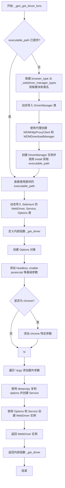
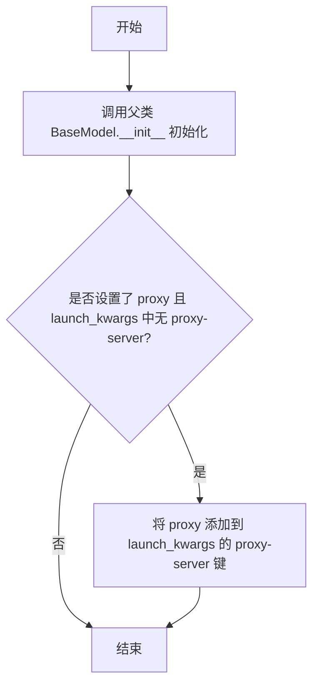
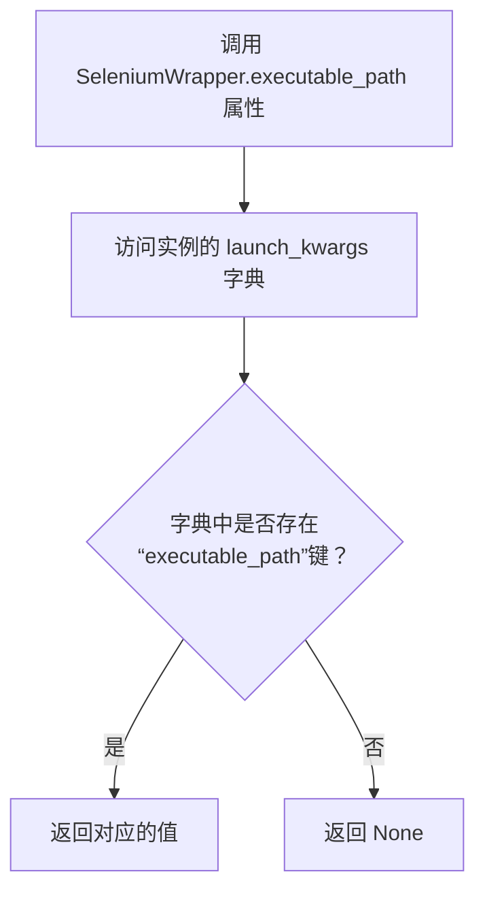
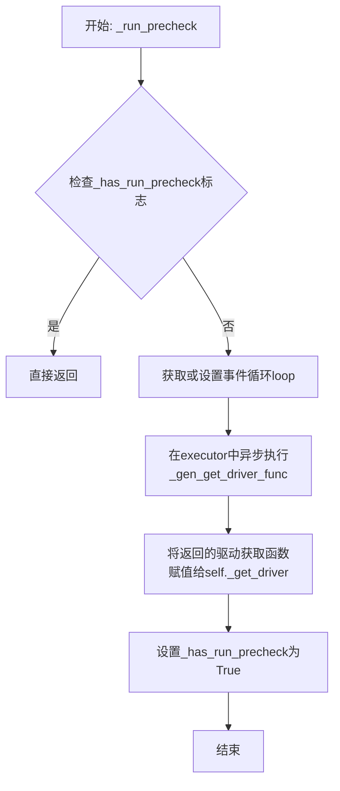
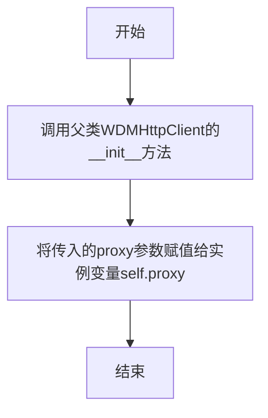

# `.\MetaGPT\metagpt\tools\web_browser_engine_selenium.py` 详细设计文档

该代码实现了一个基于Selenium的异步网页抓取包装器，核心功能是通过配置不同的浏览器类型和参数，异步地加载并抓取一个或多个网页的HTML源码和文本内容，返回结构化的网页数据对象。它封装了WebDriver的初始化和代理设置，支持通过webdriver-manager自动管理驱动程序。

## 整体流程

```mermaid
graph TD
    A[用户调用SeleniumWrapper.run] --> B{是否已运行预检查?}
    B -- 否 --> C[异步执行_run_precheck]
    C --> D[在事件循环中执行_gen_get_driver_func]
    D --> E{是否需要自动安装驱动?}
    E -- 是 --> F[通过webdriver-manager安装对应驱动]
    E -- 否 --> G[使用提供的executable_path]
    G --> H[生成并返回_get_driver函数]
    H --> I[预检查完成，标记_has_run_precheck]
    B -- 是 --> J[为每个URL创建_scrape_website任务]
    J --> K[在executor中同步执行_scrape_website]
    K --> L[使用_get_driver获取WebDriver实例]
    L --> M[driver.get(url)加载页面]
    M --> N[WebDriverWait等待body元素出现]
    N --> O[执行JS获取innerText和page_source]
    O --> P[封装结果到WebPage对象]
    P --> Q[返回WebPage或列表]
```

## 类结构

```
BaseModel (Pydantic基类)
├── SeleniumWrapper (Selenium包装器主类)
└── WDMHttpProxyClient (自定义HTTP客户端，用于代理)
```

## 全局变量及字段


### `_webdriver_manager_types`
    
映射浏览器类型到对应的webdriver_manager模块名和驱动管理器类名，用于动态导入和驱动管理。

类型：`dict[str, tuple[str, str]]`
    


### `SeleniumWrapper.browser_type`
    
指定要使用的浏览器类型，默认为'chrome'，用于初始化对应的WebDriver。

类型：`Literal['chrome', 'firefox', 'edge', 'ie']`
    


### `SeleniumWrapper.launch_kwargs`
    
启动浏览器时的额外参数字典，用于配置浏览器选项和参数。

类型：`dict`
    


### `SeleniumWrapper.proxy`
    
可选的代理服务器地址，用于配置浏览器和WebDriver Manager的HTTP请求代理。

类型：`Optional[str]`
    


### `SeleniumWrapper.loop`
    
可选的事件循环实例，用于异步执行任务，如果未提供则使用默认事件循环。

类型：`Optional[asyncio.AbstractEventLoop]`
    


### `SeleniumWrapper.executor`
    
可选的线程池执行器，用于在后台线程中运行阻塞的Selenium操作。

类型：`Optional[futures.Executor]`
    


### `SeleniumWrapper._has_run_precheck`
    
私有标志，指示是否已执行过驱动初始化预检查，避免重复初始化。

类型：`bool`
    


### `SeleniumWrapper._get_driver`
    
私有可调用对象，用于创建和返回配置好的WebDriver实例。

类型：`Optional[Callable]`
    


### `WDMHttpProxyClient.proxy`
    
代理服务器地址，用于配置WebDriver Manager的HTTP客户端以通过代理下载驱动。

类型：`str`
    
    

## 全局函数及方法

### `_gen_get_driver_func`

该函数是一个工厂函数，用于动态生成一个能够创建并返回配置好的 Selenium WebDriver 实例的闭包函数。它根据指定的浏览器类型、启动参数、可执行文件路径和代理设置，动态导入相应的 Selenium 模块和 WebDriver Manager，并配置 WebDriver 的选项和服务。

参数：
- `browser_type`：`str`，指定要使用的浏览器类型（如 "chrome", "firefox"）。
- `*args`：`tuple`，可变数量的字符串参数，用于向浏览器选项添加额外的命令行参数。
- `executable_path`：`str | None`，WebDriver 可执行文件的路径。如果为 `None`，则使用 WebDriver Manager 自动下载和管理。
- `proxy`：`str | None`，HTTP 代理服务器的地址，用于 WebDriver Manager 的下载请求。

返回值：`Callable[[], selenium.webdriver.remote.webdriver.WebDriver]`，返回一个无参函数，调用该函数将创建并返回一个配置好的 Selenium WebDriver 实例。

#### 流程图



#### 带注释源码

```python
def _gen_get_driver_func(browser_type, *args, executable_path=None, proxy=None):
    # 1. 动态导入指定浏览器类型对应的 Selenium WebDriver、Service 和 Options 类。
    WebDriver = getattr(importlib.import_module(f"selenium.webdriver.{browser_type}.webdriver"), "WebDriver")
    Service = getattr(importlib.import_module(f"selenium.webdriver.{browser_type}.service"), "Service")
    Options = getattr(importlib.import_module(f"selenium.webdriver.{browser_type}.options"), "Options")

    # 2. 如果没有提供可执行文件路径，则使用 WebDriver Manager 自动下载和管理。
    if not executable_path:
        # 2.1 根据浏览器类型查找对应的 WebDriver Manager 模块和类名。
        module_name, type_name = _webdriver_manager_types[browser_type]
        # 2.2 动态导入 DriverManager 类。
        DriverManager = getattr(importlib.import_module(module_name), type_name)
        # 2.3 创建带有代理设置的 HTTP 客户端和下载管理器，并实例化 DriverManager。
        driver_manager = DriverManager(download_manager=WDMDownloadManager(http_client=WDMHttpProxyClient(proxy=proxy)))
        # 2.4 安装并获取 WebDriver 的可执行文件路径。
        executable_path = driver_manager.install()

    # 3. 定义并返回一个创建 WebDriver 的闭包函数。
    def _get_driver():
        # 3.1 创建浏览器选项对象。
        options = Options()
        # 3.2 添加基础选项：无头模式和支持 JavaScript。
        options.add_argument("--headless")
        options.add_argument("--enable-javascript")
        # 3.3 如果是 Chrome 浏览器，添加特定参数以解决常见问题。
        if browser_type == "chrome":
            options.add_argument("--disable-gpu")  # 避免 GPU 渲染问题
            options.add_argument("--disable-dev-shm-usage")  # 解决资源限制问题
            options.add_argument("--no-sandbox")
        # 3.4 添加调用者通过 *args 传入的额外参数。
        for i in args:
            options.add_argument(i)
        # 3.5 使用深拷贝的选项和指定的服务（包含可执行路径）创建 WebDriver 实例。
        # 深拷贝 options 是为了避免多个 driver 实例共享同一个 options 对象导致配置冲突。
        return WebDriver(options=deepcopy(options), service=Service(executable_path=executable_path))

    # 4. 返回这个配置好的工厂函数。
    return _get_driver
```

### `SeleniumWrapper.__init__`

初始化 `SeleniumWrapper` 实例，设置浏览器配置和代理选项。

参数：

- `**kwargs`：`dict`，传递给父类 `BaseModel` 的初始化参数，用于设置 `SeleniumWrapper` 的字段（如 `browser_type`、`launch_kwargs`、`proxy` 等）。

返回值：`None`，无返回值。

#### 流程图



#### 带注释源码

```python
def __init__(self, **kwargs) -> None:
    # 调用父类 BaseModel 的 __init__ 方法，初始化所有 Pydantic 模型字段
    super().__init__(**kwargs)
    # 检查是否设置了代理（proxy）且启动参数（launch_kwargs）中尚未包含代理服务器配置
    if self.proxy and "proxy-server" not in self.launch_kwargs:
        # 将代理配置添加到启动参数中，以便 Selenium 使用该代理
        self.launch_kwargs["proxy-server"] = self.proxy
```

### `SeleniumWrapper.launch_args`

`SeleniumWrapper.launch_args` 是一个属性（property），用于将 `SeleniumWrapper` 实例的 `launch_kwargs` 字典转换为 Selenium WebDriver 启动时使用的命令行参数列表。它会过滤掉 `executable_path` 键，因为该键用于指定浏览器驱动路径，不作为命令行参数传递。

参数：
- 无显式参数。该属性通过 `self` 访问实例的 `launch_kwargs` 字段。

返回值：`list[str]`，返回一个字符串列表，每个字符串的格式为 `"--{key}={value}"`，其中 `key` 和 `value` 来自 `self.launch_kwargs`（不包括 `executable_path` 键）。

#### 流程图

```mermaid
flowchart TD
    A[开始] --> B[获取 self.launch_kwargs]
    B --> C[遍历 launch_kwargs 的每一项]
    C --> D{键是否为 'executable_path'?}
    D -- 是 --> E[跳过此项]
    D -- 否 --> F[格式化为 '--{key}={value}']
    E --> C
    F --> G[添加到结果列表]
    G --> C
    C --> H[遍历结束]
    H --> I[返回结果列表]
    I --> J[结束]
```

#### 带注释源码

```python
    @property
    def launch_args(self):
        # 将 launch_kwargs 字典中的每一项（排除 'executable_path' 键）
        # 格式化为 Selenium WebDriver 的命令行参数格式 '--{key}={value}'
        # 并返回这些参数组成的列表。
        return [f"--{k}={v}" for k, v in self.launch_kwargs.items() if k != "executable_path"]
```


### `SeleniumWrapper.executable_path`

这是一个只读属性（property），用于从 `SeleniumWrapper` 实例的 `launch_kwargs` 配置字典中获取 `executable_path` 的值。它提供了对 WebDriver 可执行文件路径的便捷访问。

参数：
-  `self`：`SeleniumWrapper`，`SeleniumWrapper` 类的实例。

返回值：`Optional[str]`，返回 `launch_kwargs` 字典中 `"executable_path"` 键对应的值。如果该键不存在，则返回 `None`。

#### 流程图



#### 带注释源码

```python
    @property
    def executable_path(self):
        # 从实例的 launch_kwargs 字典中获取键为 "executable_path" 的值
        # 如果键不存在，get 方法会返回 None
        return self.launch_kwargs.get("executable_path")
```


### `SeleniumWrapper.run`

`SeleniumWrapper.run` 方法是 `SeleniumWrapper` 类的核心异步方法，用于启动一个或多个网页的抓取任务。它首先确保 Selenium WebDriver 已正确初始化，然后并发地抓取传入的 URL 列表，最终返回包含网页文本内容、HTML 源码和 URL 的 `WebPage` 对象或对象列表。

参数：

- `url`：`str`，要抓取的首个网页 URL。
- `*urls`：`str`，可变参数，接受零个或多个额外的网页 URL。
- `per_page_timeout`：`float`，可选参数，指定每个页面加载的超时时间（秒）。如果未提供，将使用默认值。

返回值：`WebPage | list[WebPage]`，当只传入一个 `url` 时，返回单个 `WebPage` 对象；当传入多个 URL 时，返回一个 `WebPage` 对象列表。

#### 流程图

```mermaid
graph TD
    A[开始: run(url, *urls, per_page_timeout)] --> B{是否已运行预检查?};
    B -- 否 --> C[调用 _run_precheck 初始化驱动];
    C --> D[预检查完成];
    B -- 是 --> D;
    D --> E{是否传入了多个URL? <br> 即 urls 非空};
    E -- 是 --> F[为每个URL创建异步抓取任务 _scrape];
    F --> G[使用 asyncio.gather 并发执行所有任务];
    G --> H[返回 WebPage 对象列表];
    E -- 否 --> I[为单个URL创建异步抓取任务 _scrape];
    I --> J[执行单个任务];
    J --> K[返回单个 WebPage 对象];
```

#### 带注释源码

```python
async def run(self, url: str, *urls: str, per_page_timeout: float = None) -> WebPage | list[WebPage]:
    # 1. 预检查：确保事件循环、执行器和 WebDriver 获取函数已准备就绪。
    await self._run_precheck()

    # 2. 定义一个内部 lambda 函数 `_scrape`，用于将同步的 `_scrape_website` 方法包装成异步任务。
    #    它通过 `run_in_executor` 在指定的线程池执行器中运行，以避免阻塞事件循环。
    _scrape = lambda url, per_page_timeout: self.loop.run_in_executor(
        self.executor, self._scrape_website, url, per_page_timeout
    )

    # 3. 判断是否传入了多个URL。
    if urls:
        # 4. 如果传入了多个URL，为第一个URL和剩余的所有URL分别创建异步任务。
        #    使用 `asyncio.gather` 并发执行这些任务，并等待所有任务完成。
        return await asyncio.gather(_scrape(url, per_page_timeout), *(_scrape(i, per_page_timeout) for i in urls))
    # 5. 如果只传入了一个URL，则直接执行单个抓取任务并返回结果。
    return await _scrape(url, per_page_timeout)
```


### `SeleniumWrapper._run_precheck`

该方法是一个异步的预检查方法，用于初始化SeleniumWrapper实例的核心组件。它确保事件循环、执行器以及最重要的浏览器驱动获取函数`_get_driver`被正确设置。该方法实现了惰性初始化，即只在第一次调用时执行实际的初始化逻辑，后续调用直接返回，避免重复操作。

参数：
-  `self`：`SeleniumWrapper`，SeleniumWrapper类的实例。

返回值：`None`，该方法不返回任何值，其主要作用是对实例的内部状态进行初始化。

#### 流程图



#### 带注释源码

```python
async def _run_precheck(self):
    # 检查预检查是否已经执行过，避免重复初始化
    if self._has_run_precheck:
        return
    # 如果实例没有指定事件循环，则获取当前线程的默认事件循环
    self.loop = self.loop or asyncio.get_event_loop()
    # 在指定的执行器（或默认执行器）中同步执行驱动生成函数
    # 使用lambda包装是为了传递实例的配置参数（浏览器类型、启动参数、代理等）
    self._get_driver = await self.loop.run_in_executor(
        self.executor,
        lambda: _gen_get_driver_func(
            self.browser_type, *self.launch_args, executable_path=self.executable_path, proxy=self.proxy
        ),
    )
    # 设置标志位，表示预检查已完成
    self._has_run_precheck = True
```


### `SeleniumWrapper._scrape_website`

该方法使用Selenium WebDriver加载指定URL的网页，等待页面主体加载完成，然后提取页面的纯文本内容和HTML源码，最后封装成一个`WebPage`对象返回。如果加载过程中发生异常，则返回一个包含错误信息的`WebPage`对象。

参数：

- `url`：`str`，要抓取的网页URL。
- `timeout`：`float`，等待页面加载的超时时间（秒），默认为None，内部会使用30秒。

返回值：`WebPage`，一个包含网页URL、纯文本内容（`inner_text`）和HTML源码（`html`）的数据对象。

#### 流程图

```mermaid
graph TD
    A[开始] --> B[使用_get_driver获取WebDriver实例];
    B --> C[driver.get(url) 导航到目标URL];
    C --> D{WebDriverWait等待body元素出现};
    D -- 成功 --> E[执行JS获取document.body.innerText];
    E --> F[获取driver.page_source];
    F --> G[返回WebPage(inner_text, html, url)];
    D -- 超时或异常 --> H[捕获异常];
    H --> I[设置inner_text为错误信息, html为空];
    I --> G;
```

#### 带注释源码

```python
def _scrape_website(self, url, timeout: float = None):
    # 1. 使用上下文管理器确保WebDriver在使用后被正确关闭
    with self._get_driver() as driver:
        try:
            # 2. 导航到指定的URL
            driver.get(url)
            # 3. 显式等待，直到页面的<body>标签加载到DOM中，最长等待时间为timeout或30秒
            WebDriverWait(driver, timeout or 30).until(EC.presence_of_element_located((By.TAG_NAME, "body")))
            # 4. 通过执行JavaScript获取页面<body>元素的纯文本内容
            inner_text = driver.execute_script("return document.body.innerText;")
            # 5. 获取当前页面的完整HTML源码
            html = driver.page_source
        except Exception as e:
            # 6. 如果在上述任何步骤中发生异常（如超时、网络错误），则捕获异常
            # 将异常信息记录到inner_text中，并将html设置为空字符串
            inner_text = f"Fail to load page content for {e}"
            html = ""
        # 7. 返回一个WebPage对象，封装了URL、提取的文本（或错误信息）和HTML源码
        return WebPage(inner_text=inner_text, html=html, url=url)
```

### `WDMHttpProxyClient.__init__`

初始化一个支持代理的HTTP客户端，用于WebDriver Manager下载驱动程序时使用。

参数：

- `proxy`：`str`，可选，指定HTTP代理服务器地址，格式通常为`http://host:port`或`socks5://host:port`。如果提供，后续的HTTP请求将通过此代理发送。

返回值：`None`，此方法为构造函数，不返回任何值。

#### 流程图



#### 带注释源码

```python
def __init__(self, proxy: str = None):
    # 调用父类 WDMHttpClient 的构造函数进行初始化
    super().__init__()
    # 将传入的代理参数保存到实例变量中，供后续HTTP请求使用
    self.proxy = proxy
```

### `WDMHttpProxyClient.get`

该方法重写了父类 `WDMHttpClient` 的 `get` 方法，在发起 HTTP GET 请求时，如果实例化时传入了代理配置且当前请求未指定代理，则自动为请求添加代理设置。

参数：
- `url`：`str`，要请求的目标 URL。
- `**kwargs`：`dict`，传递给父类 `get` 方法的其他关键字参数。

返回值：`requests.Response`，HTTP 请求的响应对象。

#### 流程图

```mermaid
flowchart TD
    A[开始] --> B{实例化时是否传入代理<br>且kwargs中无proxies键?}
    B -- 是 --> C[在kwargs中添加代理配置<br>proxies: {'all': self.proxy}]
    B -- 否 --> D[保持kwargs不变]
    C --> D
    D --> E[调用父类WDMHttpClient.get方法]
    E --> F[返回响应对象]
    F --> G[结束]
```

#### 带注释源码

```python
def get(self, url, **kwargs):
    # 检查：如果调用时未在kwargs中指定代理，且实例化时传入了代理配置
    if "proxies" not in kwargs and self.proxy:
        # 则将实例的代理配置添加到请求参数中
        kwargs["proxies"] = {"all": self.proxy}
    # 调用父类（WDMHttpClient）的get方法执行实际的HTTP请求
    return super().get(url, **kwargs)
```

## 关键组件


### SeleniumWrapper 类

一个基于 Pydantic 的配置化 Selenium WebDriver 包装器，用于异步或同步地启动浏览器、导航至指定 URL 并抓取网页内容（包括 HTML 源码和纯文本），支持多种浏览器类型和代理配置。

### WebDriver 生成函数 (`_gen_get_driver_func`)

一个工厂函数，根据指定的浏览器类型、启动参数、可执行路径和代理设置，动态生成一个返回配置好的 Selenium WebDriver 实例的闭包函数。它负责处理 WebDriver 的自动下载（通过 webdriver-manager）和选项配置。

### WebDriver Manager 集成 (`_webdriver_manager_types` 与 `WDMHttpProxyClient`)

一个映射字典 (`_webdriver_manager_types`) 和一个自定义的 HTTP 客户端 (`WDMHttpProxyClient`)，用于支持通过 `webdriver-manager` 库自动下载和管理不同浏览器（Chrome, Firefox, Edge, IE）的 WebDriver 二进制文件，并允许在下载过程中使用代理。

### 异步执行与并发控制

通过 `asyncio` 事件循环和 `concurrent.futures.Executor` 实现，将阻塞的 Selenium 操作（如页面加载、元素等待）放到单独的线程中执行，从而支持异步并发地抓取多个网页，并允许通过 `per_page_timeout` 控制每个页面的加载超时时间。

### 网页内容解析与封装 (`WebPage`)

虽然 `WebPage` 类的定义不在当前代码片段中，但它是 `SeleniumWrapper.run` 方法的返回值，用于封装从网页抓取到的核心数据：URL、HTML 源码 (`html`) 和去除了 HTML 标签的纯文本内容 (`inner_text`)，为后续的信息提取和处理提供了结构化的数据对象。


## 问题及建议


### 已知问题

-   **资源管理与泄漏风险**：`_scrape_website` 方法中，`driver` 在 `with` 语句块结束后会自动调用 `quit()` 方法。然而，如果 `_get_driver` 函数返回的 `WebDriver` 对象不支持上下文管理器协议，或者 `WebDriver` 的 `__exit__` 方法未能正确释放所有资源（如浏览器进程、临时文件），则可能导致资源泄漏。虽然 Selenium 的 `WebDriver` 通常实现了上下文管理器，但依赖外部库的实现细节存在风险。
-   **异常处理粒度较粗**：`_scrape_website` 方法使用一个宽泛的 `except Exception` 来捕获所有异常。这会将网络错误、超时、页面解析错误、JavaScript执行错误等不同类型的问题混为一谈，返回一个通用的错误信息 `"Fail to load page content for {e}"`。这使得调用方难以根据具体的错误类型进行不同的处理或重试策略。
-   **并发控制与资源竞争**：`run` 方法使用 `asyncio.gather` 并发执行多个页面的抓取任务，所有任务共享同一个 `executor`（线程池）。如果并发任务数量很大，可能会快速创建大量浏览器实例，耗尽系统资源（内存、CPU、端口等），导致性能下降甚至崩溃。代码缺乏对并发度的控制机制。
-   **配置与状态管理耦合**：`launch_kwargs` 中的 `executable_path` 在 `launch_args` 属性中被特殊排除，这种逻辑分散在代码中（`launch_args` 属性和 `_gen_get_driver_func` 函数），增加了维护的复杂性和出错的可能性。如果未来 `launch_kwargs` 增加其他需要特殊处理的参数，需要同步修改多处代码。
-   **潜在的阻塞操作**：`_run_precheck` 方法中，通过 `loop.run_in_executor` 执行 `_gen_get_driver_func`，这是一个同步的、可能耗时的操作（如下载 WebDriver）。虽然放到了线程池中执行以避免阻塞事件循环，但如果线程池繁忙或网络缓慢，仍可能延迟后续所有抓取任务的启动。
-   **`WDMHttpProxyClient` 的代理配置可能不完整**：`WDMHttpProxyClient` 只重写了 `get` 方法并设置了 `proxies` 参数。然而，`webdriver_manager` 的下载过程可能涉及其他 HTTP 方法（如 `head`）或其他库（如 `requests`）的不同配置方式。当前的实现可能无法确保所有下载流量都经过代理。

### 优化建议

-   **增强资源管理**：在 `_get_driver` 返回的闭包函数内部，显式地确保 `WebDriver` 对象在创建后正确实现了上下文管理器协议。可以考虑在 `_gen_get_driver_func` 中包装返回的驱动函数，添加更健壮的清理逻辑，例如在 `finally` 块中调用 `driver.quit()`。
-   **细化异常处理**：将 `_scrape_website` 中的 `except Exception` 替换为捕获更具体的异常类型，如 `TimeoutException`、`WebDriverException`、`JavascriptException` 等。可以定义自定义异常类，将底层异常包装后抛出，或者返回一个包含错误类型和详细信息的结构化错误对象，而不是简单的字符串。
-   **引入并发控制机制**：为 `SeleniumWrapper` 类添加一个最大并发数（如 `max_workers`）配置参数。在 `run` 方法中，使用信号量（`asyncio.Semaphore`）或固定大小的线程池执行器来限制同时进行的 `_scrape_website` 调用数量，防止资源过载。
-   **解耦配置处理逻辑**：将 `executable_path` 等特殊参数从 `launch_kwargs` 中分离出来，作为独立的类字段。或者，创建一个专门的方法或属性来统一处理和验证所有启动参数，生成最终传递给浏览器的选项列表，避免逻辑分散。
-   **预初始化与缓存**：考虑在 `SeleniumWrapper` 初始化时或首次调用前，异步地执行 `_run_precheck`（例如在 `__ainit__` 中），提前完成 WebDriver 的下载和检查，避免在第一次抓取时引入延迟。对于 `_get_driver` 函数，可以考虑缓存已创建的 `DriverManager` 实例（注意线程安全），避免重复安装。
-   **完善代理支持**：审查 `webdriver_manager` 库的源码，确认其 HTTP 客户端的所有调用方式。确保 `WDMHttpProxyClient` 覆盖所有必要的方法（如 `head`），并正确设置代理。或者，探索是否可以通过环境变量或 `requests` 库的会话级配置来全局设置代理，这可能是更可靠的方式。
-   **增加可观测性**：添加日志记录，记录 WebDriver 的启动、页面加载时间、遇到的异常类型等。这对于调试和监控爬虫的健康状态非常有价值。可以考虑集成像 `structlog` 这样的结构化日志库。
-   **提供更灵活的页面就绪判断**：当前使用 `EC.presence_of_element_located((By.TAG_NAME, "body"))` 作为页面加载完成的标志。对于高度动态的页面（单页应用），这可能不够。可以提供配置选项，允许用户自定义等待条件（如等待某个特定元素出现、等待 JavaScript 变量就绪等）。


## 其它


### 设计目标与约束

1.  **核心目标**：提供一个异步、可配置的Selenium WebDriver封装，用于高效、可靠地抓取网页内容（包括HTML源码和纯文本），并支持多种浏览器和代理配置。
2.  **关键约束**：
    *   **异步友好**：所有耗时的I/O操作（如启动浏览器、加载页面）必须通过`asyncio`和线程池执行器（`executor`）进行，以避免阻塞事件循环。
    *   **浏览器兼容性**：支持Chrome、Firefox、Edge和IE四种浏览器，通过动态导入和`webdriver_manager`自动管理驱动程序。
    *   **配置灵活性**：允许通过`launch_kwargs`传递浏览器启动参数，支持通过`proxy`参数配置HTTP代理。
    *   **资源管理**：使用上下文管理器（`with`语句）确保WebDriver实例在使用后被正确关闭，防止资源泄漏。
    *   **错误隔离**：网页抓取过程中的异常（如超时、元素未找到）应被捕获并处理，返回包含错误信息的`WebPage`对象，而不是导致整个任务失败。

### 错误处理与异常设计

1.  **初始化与预检错误**：`_run_precheck`方法中动态导入模块或安装WebDriver可能失败（如网络问题、不支持的浏览器类型）。这些错误会以异常形式抛出，导致`run`方法调用失败。
2.  **网页抓取错误**：`_scrape_website`方法中，`driver.get(url)`或`WebDriverWait`可能因网络超时、页面无法访问、DOM元素未及时加载等原因抛出异常。此类异常被`try...except`块捕获，错误信息被记录到返回的`WebPage`对象的`inner_text`字段中，`html`字段为空字符串。这确保了单页抓取失败不会影响其他并发抓取任务。
3.  **代理配置错误**：如果提供的`proxy`字符串格式不正确或代理服务器不可用，可能导致`WDMHttpProxyClient`下载驱动失败或浏览器无法连接。这会在预检阶段或页面加载阶段引发异常。
4.  **并发限制**：虽然支持并发抓取多个页面，但过高的并发数可能受限于系统资源（内存、CPU）或目标服务器的反爬策略。当前实现未内置并发控制，需由调用方管理。

### 数据流与状态机

1.  **对象生命周期与状态**：
    *   **初始化**：`SeleniumWrapper`对象创建，配置参数被设置。`_has_run_precheck`为`False`，`_get_driver`为`None`。
    *   **预检（Lazy Initialization）**：首次调用`run`方法时触发`_run_precheck`。此方法在一个事件循环中仅执行一次。它初始化事件循环和线程池引用，并同步生成（通过线程池）驱动获取函数`_get_driver`。完成后，`_has_run_precheck`置为`True`。
    *   **执行抓取**：`run`方法将每个URL的抓取任务（`_scrape_website`）提交到线程池执行。每个任务独立运行：创建WebDriver实例 -> 导航至URL -> 等待页面加载 -> 提取内容 -> 关闭WebDriver。
    *   **结果返回**：抓取结果（`WebPage`对象或列表）通过`asyncio.gather`或直接`await`返回给调用者。
2.  **关键数据流**：
    *   **输入**：URL（字符串）、浏览器配置、代理设置、超时时间。
    *   **处理**：配置 -> 驱动准备 -> 浏览器实例化 -> 页面加载与渲染 -> DOM内容提取。
    *   **输出**：`WebPage`对象，包含`url`、`html`、`inner_text`。

### 外部依赖与接口契约

1.  **显式依赖库**：
    *   `selenium`：核心浏览器自动化库。
    *   `webdriver_manager`：用于自动下载和管理不同浏览器的WebDriver可执行文件。
    *   `pydantic`：用于数据验证和设置管理。
    *   `asyncio`, `concurrent.futures`：用于异步和并发执行。
2.  **隐式系统依赖**：
    *   系统中需安装对应版本的浏览器（如Chrome、Firefox）。
    *   网络连接（用于访问目标网页和下载WebDriver）。
3.  **接口契约**：
    *   `SeleniumWrapper.run(url: str, *urls: str, per_page_timeout: float = None) -> WebPage | list[WebPage]`：主对外接口。调用者提供URL和可选超时时间，返回抓取结果。这是一个异步方法，必须在异步上下文中调用。
    *   `_gen_get_driver_func`：一个内部工厂函数，返回一个可调用对象。该可调用对象每次被调用时，都创建一个配置好的新WebDriver实例。这隔离了驱动管理的复杂性和Driver实例的创建。
    *   `WebPage`（来自`metagpt.utils.parse_html`）：定义了输出数据的结构，包括`inner_text`、`html`和`url`字段。`SeleniumWrapper`依赖于这个外部数据模型。
4.  **配置契约**：
    *   `launch_kwargs`字典中的键值对会被转换为浏览器命令行参数（如`--headless`）。`executable_path`键被特殊处理，用于直接指定驱动路径，而非通过`webdriver_manager`获取。

    