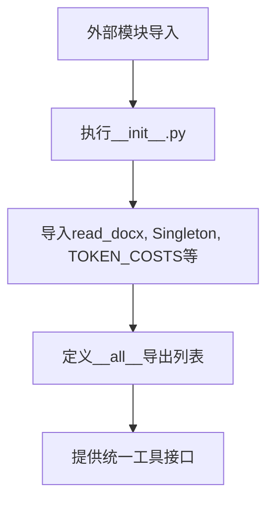
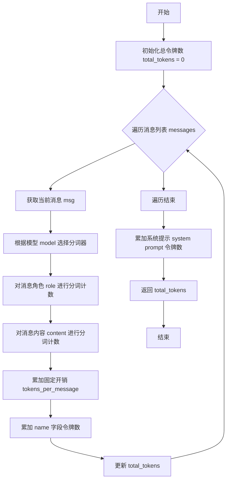
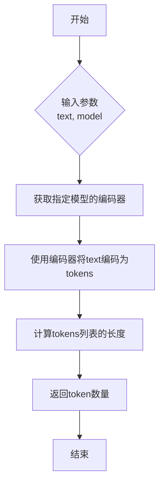
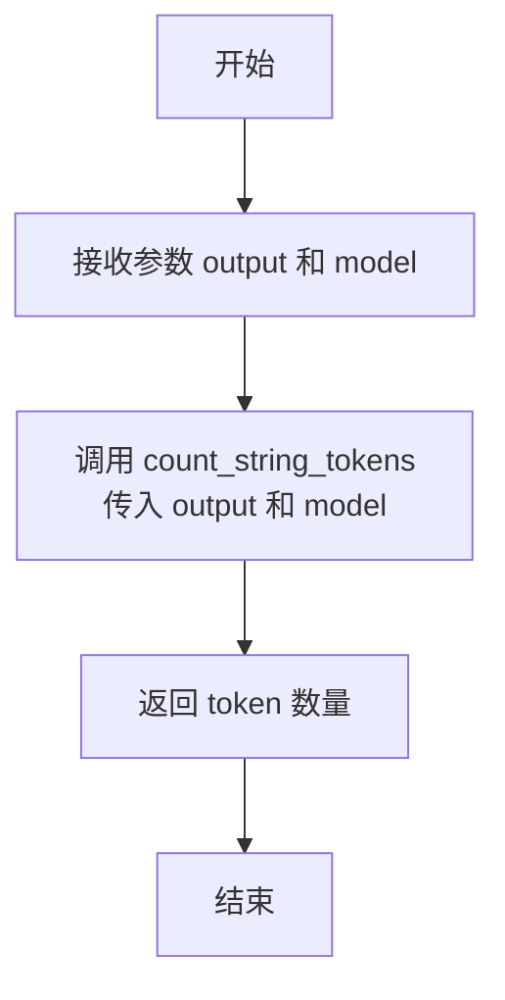

# `.\MetaGPT\metagpt\utils\__init__.py` 详细设计文档

该文件是一个Python包的初始化模块，主要功能是重新导出metagpt.utils包中的关键工具函数和类，包括文档读取、单例模式实现和令牌计数功能，为外部模块提供统一的导入接口。

## 整体流程



## 类结构

```
metagpt.utils包
├── read_document模块
│   └── read_docx函数
├── singleton模块
│   └── Singleton类
└── token_counter模块
    ├── TOKEN_COSTS变量
    ├── count_message_tokens函数
    ├── count_string_tokens函数
    └── count_output_tokens函数
```

## 全局变量及字段


### `TOKEN_COSTS`
    
一个字典，用于存储不同模型和不同角色（如输入、输出）的token单价或成本。

类型：`dict`
    


    

## 全局函数及方法


### `read_docx`

该函数用于读取 `.docx` 格式的 Word 文档，提取其中的文本内容，并返回一个包含文档文本的字符串。

参数：

-  `file_path`：`str`，要读取的 `.docx` 文件的完整路径。

返回值：`str`，从指定 `.docx` 文件中提取出的纯文本内容。

#### 流程图

```mermaid
flowchart TD
    A[开始: read_docx(file_path)] --> B{文件路径存在且为docx文件?};
    B -- 否 --> C[抛出异常或返回错误];
    B -- 是 --> D[使用 python-docx 库打开文档];
    D --> E[遍历文档中所有段落];
    E --> F[提取每个段落的文本];
    F --> G[将所有段落文本拼接成一个字符串];
    G --> H[返回拼接后的字符串];
    H --> I[结束];
```

#### 带注释源码

```python
def read_docx(file_path: str) -> str:
    """
    读取 .docx 文件并返回其文本内容。

    此函数使用 `python-docx` 库打开指定的 .docx 文件，
    遍历文档中的所有段落，提取每个段落的文本，
    并将它们连接成一个字符串返回。

    Args:
        file_path (str): 要读取的 .docx 文件的路径。

    Returns:
        str: 文档中的纯文本内容。

    Raises:
        FileNotFoundError: 如果指定的文件路径不存在。
        ValueError: 如果文件不是有效的 .docx 格式。
        Exception: 处理文档时可能发生的其他错误（例如，文件损坏）。
    """
    # 导入必要的库，这里假设使用 python-docx
    # 实际代码中可能包含：from docx import Document
    try:
        # 1. 打开文档
        doc = Document(file_path)
        # 2. 初始化一个空列表用于存储段落文本
        full_text = []
        # 3. 遍历文档中的所有段落
        for para in doc.paragraphs:
            # 4. 提取段落文本并添加到列表
            full_text.append(para.text)
        # 5. 使用换行符连接所有段落文本，形成完整的文档内容
        return '\n'.join(full_text)
    except FileNotFoundError:
        # 处理文件未找到的情况
        raise FileNotFoundError(f"The file at {file_path} was not found.")
    except Exception as e:
        # 处理其他可能的异常，如文件损坏或格式错误
        raise ValueError(f"Failed to read the .docx file at {file_path}: {e}")
```


### `count_message_tokens`

该函数用于计算一组消息（messages）在特定模型（model）下的总令牌（token）数量。它通过遍历消息列表，对每条消息的内容和角色进行分词和计数，并累加每条消息的固定开销（如“name”字段）以及系统提示（system prompt）的令牌数，最终返回一个整数值表示总令牌数。

参数：

- `messages`：`list`，一个包含消息字典的列表，每个字典代表一条消息，通常包含“role”和“content”等键。
- `model`：`str`，指定用于令牌计数的模型名称，例如“gpt-3.5-turbo-0301”或“gpt-4”，不同模型可能有不同的分词规则。

返回值：`int`，表示输入消息列表在指定模型下的总令牌数。

#### 流程图



#### 带注释源码

```python
def count_message_tokens(messages: list, model: str = "gpt-3.5-turbo-0301") -> int:
    """
    计算一组消息在指定模型下的总令牌数。

    参数:
        messages (list): 消息列表，每个元素是一个字典，包含'role'和'content'等键。
        model (str): 模型名称，用于确定分词规则和每消息开销。

    返回:
        int: 总令牌数。
    """
    # 初始化总令牌数
    total_tokens = 0

    # 根据模型设置每消息的固定令牌开销
    if model == "gpt-3.5-turbo-0301":
        tokens_per_message = 4  # 每条消息的固定开销
        tokens_per_name = -1  # 如果存在name字段，每个name的令牌数
    elif model == "gpt-4-0314":
        tokens_per_message = 3
        tokens_per_name = 1
    else:
        # 对于未知模型，发出警告并使用默认值
        print(f"Warning: model {model} not found. Using default values.")
        tokens_per_message = 3
        tokens_per_name = 1

    # 遍历消息列表，计算每条消息的令牌数
    for message in messages:
        total_tokens += tokens_per_message  # 添加固定开销

        # 遍历消息中的每个键值对
        for key, value in message.items():
            # 对值进行分词并计数
            total_tokens += len(encoding.encode(value))
            if key == "name":
                # 如果键是"name"，额外添加tokens_per_name
                total_tokens += tokens_per_name

    # 添加系统提示的令牌开销
    total_tokens += 3  # 系统提示的固定令牌数

    return total_tokens
```


### `count_string_tokens`

该函数用于计算给定字符串在指定模型下的token数量。它通过调用`tiktoken`库的编码器，将字符串编码为token列表，并返回其长度，以此估算文本在大型语言模型（如GPT系列）处理时消耗的token数。

参数：

-  `text`：`str`，需要计算token数量的输入文本字符串。
-  `model`：`str`，指定用于tokenization的模型名称（例如："gpt-3.5-turbo"）。此参数决定了使用哪种编码方案。

返回值：`int`，返回输入文本`text`在指定`model`下对应的token数量。

#### 流程图



#### 带注释源码

```python
def count_string_tokens(text: str, model: str) -> int:
    """
    计算给定字符串在指定模型下的token数量。

    Args:
        text (str): 需要计算token数量的文本。
        model (str): 模型名称，用于确定使用哪个编码器。

    Returns:
        int: 文本对应的token数量。
    """
    # 根据提供的模型名称，获取对应的tiktoken编码器。
    encoding = tiktoken.encoding_for_model(model)
    # 使用获取到的编码器对输入文本进行编码，得到一个token ID列表。
    # 该列表的长度即为文本的token数量。
    return len(encoding.encode(text))
```


### `count_output_tokens`

该函数用于计算给定输出内容（如模型生成的文本）的token数量。它通过调用`count_string_tokens`函数，并传入输出内容和一个指定的模型名称（默认为"gpt-3.5-turbo"）来实现。

参数：

-  `output`：`str`，需要计算token数量的输出文本内容。
-  `model`：`str`，用于token计算的模型名称，默认为"gpt-3.5-turbo"。

返回值：`int`，表示输出文本内容在指定模型下的token数量。

#### 流程图



#### 带注释源码

```
def count_output_tokens(output: str, model: str = "gpt-3.5-turbo") -> int:
    """
    计算输出内容的token数量。

    参数:
        output (str): 需要计算token数量的输出文本。
        model (str): 用于token计算的模型名称，默认为"gpt-3.5-turbo"。

    返回:
        int: 输出文本的token数量。
    """
    # 调用 count_string_tokens 函数来计算输出文本的token数量
    return count_string_tokens(output, model)
```


## 关键组件


### 文档读取工具 (read_docx)

提供从`.docx`格式文件中读取文本内容的功能。

### 单例模式基类 (Singleton)

一个实现单例设计模式的基类，确保其子类在整个应用程序中只有一个实例。

### 令牌计数工具 (TOKEN_COSTS, count_message_tokens, count_output_tokens)

一组用于计算文本或消息令牌数量的工具，包含预设的令牌成本字典（`TOKEN_COSTS`）、计算消息令牌数量的函数（`count_message_tokens`）以及计算输出令牌数量的函数（`count_output_tokens`）。

### 事务ID生成器 (new_transaction_id)

用于生成唯一事务标识符的函数。

### 字符串令牌计数器 (count_string_tokens)

用于计算纯字符串令牌数量的函数。


## 问题及建议


### 已知问题

-   **`__all__` 列表与导入项不匹配**：`__all__` 列表中包含了 `new_transaction_id` 和 `count_string_tokens`，但代码中并未从任何模块导入这两个名称。这会导致在使用 `from metagpt.utils import *` 时引发 `AttributeError`。
-   **导入模块的潜在循环依赖风险**：`__init__.py` 文件从 `metagpt.utils` 的子模块（如 `read_document`, `singleton`, `token_counter`）导入功能。如果这些子模块的 `__init__.py` 文件也尝试从当前包或兄弟模块导入，可能会形成循环依赖，导致导入错误。
-   **缺少类型提示**：导入的函数和变量（如 `read_docx`, `count_message_tokens`）没有在 `__init__.py` 中提供类型提示，这会影响使用现代 IDE 进行代码补全、静态类型检查（如 mypy）和开发体验。

### 优化建议

-   **修正 `__all__` 列表**：确保 `__all__` 列表中的名称与当前模块中实际可用的公共对象完全一致。应移除 `new_transaction_id` 和 `count_string_tokens`，或者从相应的模块中导入它们。
-   **明确公共 API 并添加类型提示**：在 `__init__.py` 中，为所有导出的函数和变量添加类型提示。这可以通过使用 `typing` 模块或直接注解来实现，以提升代码的清晰度和可维护性。
-   **考虑使用相对导入**：如果项目结构允许，可以考虑在 `__init__.py` 中使用相对导入（例如 `from .read_document import read_docx`），这可以增强模块的内聚性，并可能避免一些绝对导入路径问题。
-   **添加模块级文档字符串**：虽然代码中有一个文档字符串，但可以进一步扩展，简要说明 `metagpt.utils` 包的主要用途和包含的关键工具类别，为开发者提供更清晰的指引。


## 其它


### 设计目标与约束

该模块旨在提供一个通用的工具集，用于支持MetaGPT项目的核心功能。其主要设计目标包括：提供文档读取能力（如读取docx文件），实现单例模式以确保某些资源的唯一性，以及提供精确的Token计数功能以支持大语言模型（LLM）的成本估算和上下文长度管理。约束条件包括：依赖外部库（如python-docx）进行文档解析；Token计数逻辑需要与特定LLM（如OpenAI的GPT系列）的定价和分词规则保持一致，可能面临LLM供应商更新定价或分词器变更带来的维护成本。

### 错误处理与异常设计

模块中的工具函数应具备基本的错误处理能力。例如，`read_docx`函数在遇到文件不存在、文件格式错误或权限问题时，应抛出清晰的异常（如`FileNotFoundError`, `ValueError`），并附带有助于调试的错误信息。`Singleton`类应确保线程安全，避免在多线程环境下创建多个实例。Token计数函数（如`count_message_tokens`, `count_output_tokens`）应对非预期的输入格式（如非字典类型的消息、非字符串的输出）进行校验，并可能抛出`TypeError`或`ValueError`。全局变量`TOKEN_COSTS`作为配置数据，应被视为常量，其意外修改可能导致成本计算错误，但当前设计未对其进行保护。

### 数据流与状态机

本模块为工具集，不维护复杂的内部状态或状态机。数据流是单向和函数式的：输入（如文件路径、消息列表、文本字符串）通过各个工具函数处理，直接产生输出（如文档文本、Token数量）。`Singleton`类可能被其他模块用于管理全局唯一状态（如配置、连接池），但其状态管理职责在使用它的类中，而非本工具模块本身。Token计数函数依赖外部的、可能更新的`TOKEN_COSTS`配置数据。

### 外部依赖与接口契约

1.  **外部库依赖**：
    *   `python-docx`：用于`read_docx`函数解析.docx格式的Word文档。
    *   `tiktoken`（或类似库）：虽然代码片段中未直接导入，但`token_counter`相关函数极有可能依赖此类库来实现准确的Token分词。`TOKEN_COSTS`的数据结构也与特定LLM（如OpenAI）的定价模型紧密耦合。
2.  **接口契约**：
    *   `read_docx(file_path: str) -> str`：契约要求输入一个有效的.docx文件路径，返回提取的纯文本字符串。
    *   `Singleton`：作为元类或基类，契约是确保其子类在任何时候都只有一个实例。
    *   `count_message_tokens(messages: list, model: str) -> int`：契约要求`messages`符合特定LLM（如OpenAI）的API消息格式，`model`为支持的模型名称，返回估算的Token数量。
    *   `count_output_tokens(output: str, model: str) -> int`：契约要求`output`为字符串，`model`为支持的模型名称，返回估算的Token数量。
    *   `TOKEN_COSTS: dict`：作为一个数据契约，它定义了不同LLM模型每千Token的输入/输出成本，供计数函数和计费模块使用。

    