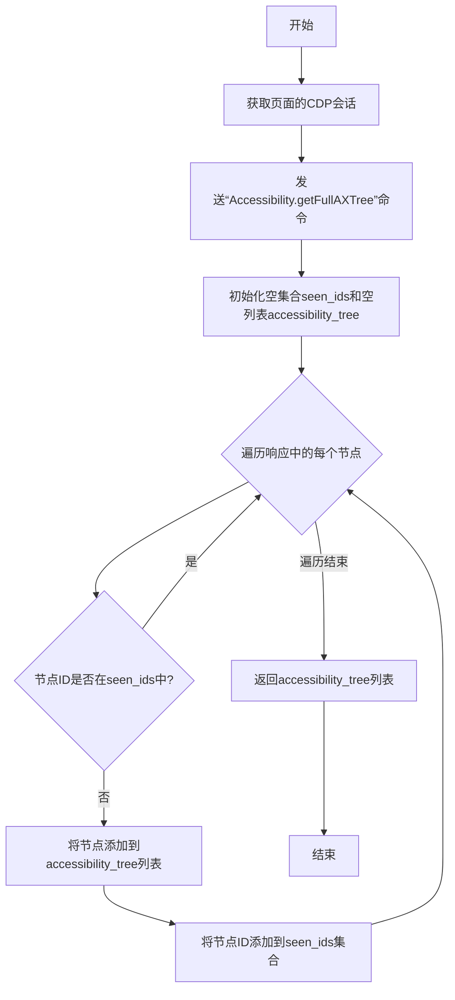

# `.\MetaGPT\metagpt\utils\a11y_tree.py` 详细设计文档

该代码是一个基于 Playwright 的 Web 自动化执行引擎，核心功能是解析和执行一系列预定义的高层指令（如点击、输入、滚动等），以模拟用户在浏览器中的交互行为。它通过 Chrome DevTools Protocol (CDP) 获取页面的无障碍辅助功能树（Accessibility Tree）来定位和操作页面元素，实现了对 Web 页面的程序化控制。

## 整体流程


## 类结构

```
全局函数 (无类定义)
├── 核心执行函数: execute_step
├── 元素操作函数: click_element, hover_element, type_text, key_press, scroll_page
├── 辅助功能树处理函数: get_accessibility_tree, parse_accessibility_tree
├── CDP工具函数: get_page_cdp_session, get_bounding_rect, get_element_center, get_element_outer_html
├── 工具函数: extract_step, get_backend_node_id
└── 全局常量: IGNORED_ACTREE_PROPERTIES
```

## 全局变量及字段


### `IGNORED_ACTREE_PROPERTIES`
    
一个包含在解析无障碍树时需要忽略的属性名称的元组，用于过滤掉不重要的节点属性以简化输出。

类型：`tuple[str, ...]`
    


    

## 全局函数及方法

### `get_accessibility_tree`

该函数通过Playwright的CDP（Chrome DevTools Protocol）会话，获取当前页面的完整无障碍（Accessibility）树，并返回一个去重后的节点列表。它主要用于自动化测试或辅助功能分析，以获取页面的结构化无障碍信息。

参数：

- `page`：`Page`，Playwright的页面对象，代表当前操作的浏览器标签页。

返回值：`list`，一个包含去重后无障碍树节点的列表。

#### 流程图



#### 带注释源码

```python
async def get_accessibility_tree(page: Page):
    # 获取当前页面的Chrome DevTools Protocol (CDP) 会话
    cdp_session = await get_page_cdp_session(page)
    # 通过CDP会话发送命令，获取完整的无障碍（AX）树
    resp = await cdp_session.send("Accessibility.getFullAXTree")

    # 使用集合来记录已经处理过的节点ID，避免重复
    seen_ids = set()
    # 用于存储去重后的无障碍树节点
    accessibility_tree = []
    # 遍历从CDP响应中获取的所有节点
    for node in resp["nodes"]:
        # 检查当前节点的ID是否已经在seen_ids集合中
        if node["nodeId"] not in seen_ids:
            # 如果未见过，则将其添加到结果列表中
            accessibility_tree.append(node)
            # 并将其ID记录到集合中，防止后续重复添加
            seen_ids.add(node["nodeId"])
    # 返回去重后的无障碍树节点列表
    return accessibility_tree
```

### `execute_step`

`execute_step` 函数是 WebArena 自动化框架的核心执行器，负责解析并执行用户指定的操作指令（如点击、输入、滚动等），通过 Playwright 控制浏览器页面，并利用无障碍树（accessibility tree）来定位页面元素。

参数：

- `step`：`str`，待解析和执行的操作指令字符串，格式如 `"click[123]"` 或 `"type[456][hello world][1]"`。
- `page`：`playwright.async_api.Page`，当前活动的 Playwright 页面对象，用于执行浏览器操作。
- `browser_ctx`：`playwright.async_api.BrowserContext`，浏览器上下文对象，用于管理多个标签页。
- `accessibility_tree`：`list`，当前页面的无障碍树节点列表，用于将指令中的元素 ID 映射为后端 DOM 节点 ID。

返回值：`Union[str, playwright.async_api.Page]`，根据指令类型返回不同的结果。对于 `stop` 指令，返回一个字符串答案；对于其他指令，在执行完成后返回更新后的 `page` 对象（可能因标签页操作而改变）。

#### 流程图

```mermaid
flowchart TD
    A[开始: execute_step(step, page, browser_ctx, accessibility_tree)] --> B[解析指令: 提取 func 和参数]
    B --> C{func 类型?}
    
    C -->|None| D[返回空字符串]
    C -->|click| E[解析元素ID并执行 click_element]
    C -->|hover| F[解析元素ID并执行 hover_element]
    C -->|type| G[解析元素ID、文本和回车标志<br>执行 click_element 和 type_text]
    C -->|press| H[解析按键并执行 key_press]
    C -->|scroll| I[解析方向并执行 scroll_page]
    C -->|goto| J[解析URL并执行 page.goto]
    C -->|new_tab| K[创建新标签页并更新 page 引用]
    C -->|go_back| L[执行 page.go_back]
    C -->|go_forward| M[执行 page.go_forward]
    C -->|tab_focus| N[解析标签页索引并切换到该页]
    C -->|close_tab| O[关闭当前标签页<br>切换到剩余最后一页或新建一页]
    C -->|stop| P[解析答案字符串并返回]
    C -->|其他| Q[抛出 ValueError]

    E & F & G & H & I & J & K & L & M & N & O --> R[等待页面加载至 'domcontentloaded' 状态]
    R --> S[返回 page 对象]
    D --> T[结束]
    P --> T
    Q --> T
```

#### 带注释源码

```python
async def execute_step(step: str, page: Page, browser_ctx: BrowserContext, accessibility_tree: list):
    # 1. 清理和解析指令字符串
    step = step.strip()
    # 提取动作函数名，例如从 "click[123]" 中提取 "click"
    func = step.split("[")[0].strip() if "[" in step else step.split()[0].strip()

    # 2. 根据动作函数名分派到不同的处理逻辑
    if func == "None":
        # 空操作，直接返回空字符串
        return ""
    elif func == "click":
        # 解析点击操作，格式应为 "click[元素ID]"
        match = re.search(r"click ?\[(\d+)\]", step)
        if not match:
            raise ValueError(f"Invalid click action {step}")
        element_id = match.group(1)
        # 通过无障碍树将前端元素ID转换为后端节点ID，然后执行点击
        await click_element(page, get_backend_node_id(element_id, accessibility_tree))
    elif func == "hover":
        # 解析悬停操作，格式应为 "hover[元素ID]"
        match = re.search(r"hover ?\[(\d+)\]", step)
        if not match:
            raise ValueError(f"Invalid hover action {step}")
        element_id = match.group(1)
        await hover_element(page, get_backend_node_id(element_id, accessibility_tree))
    elif func == "type":
        # 解析输入操作，格式应为 "type[元素ID][文本][回车标志]"
        # 为简化用户输入，如果未指定回车标志（0或1），则默认添加 "[1]" 表示按回车
        if not (step.endswith("[0]") or step.endswith("[1]")):
            step += " [1]"

        match = re.search(r"type ?\[(\d+)\] ?\[(.+)\] ?\[(\d+)\]", step)
        if not match:
            raise ValueError(f"Invalid type action {step}")
        element_id, text, enter_flag = (
            match.group(1),
            match.group(2),
            match.group(3),
        )
        # 如果回车标志为 "1"，则在文本末尾添加换行符以模拟回车
        if enter_flag == "1":
            text += "\n"
        # 先点击元素使其获得焦点，再输入文本
        await click_element(page, get_backend_node_id(element_id, accessibility_tree))
        await type_text(page, text)
    elif func == "press":
        # 解析按键操作，格式应为 "press[按键名称]"
        match = re.search(r"press ?\[(.+)\]", step)
        if not match:
            raise ValueError(f"Invalid press action {step}")
        key = match.group(1)
        await key_press(page, key)
    elif func == "scroll":
        # 解析滚动操作，格式应为 "scroll[up]" 或 "scroll[down]"
        match = re.search(r"scroll ?\[?(up|down)\]?", step)
        if not match:
            raise ValueError(f"Invalid scroll action {step}")
        direction = match.group(1)
        await scroll_page(page, direction)
    elif func == "goto":
        # 解析页面跳转操作，格式应为 "goto[URL]"
        match = re.search(r"goto ?\[(.+)\]", step)
        if not match:
            raise ValueError(f"Invalid goto action {step}")
        url = match.group(1)
        await page.goto(url)
    elif func == "new_tab":
        # 创建新标签页，并更新当前 page 引用为新页面
        page = await browser_ctx.new_page()
    elif func == "go_back":
        # 在浏览器历史中后退
        await page.go_back()
    elif func == "go_forward":
        # 在浏览器历史中前进
        await page.go_forward()
    elif func == "tab_focus":
        # 切换标签页焦点，格式应为 "tab_focus[标签页索引]"
        match = re.search(r"tab_focus ?\[(\d+)\]", step)
        if not match:
            raise ValueError(f"Invalid tab_focus action {step}")
        page_number = int(match.group(1))
        # 从浏览器上下文中获取指定索引的页面，并将其置前
        page = browser_ctx.pages[page_number]
        await page.bring_to_front()
    elif func == "close_tab":
        # 关闭当前标签页
        await page.close()
        # 如果还有标签页，则将当前 page 引用切换到最后一个标签页
        if len(browser_ctx.pages) > 0:
            page = browser_ctx.pages[-1]
        else:
            # 如果没有标签页了，则新建一个
            page = await browser_ctx.new_page()
    elif func == "stop":
        # 停止指令，表示任务完成，可以携带一个答案字符串
        # 格式如 'stop("答案")' 或 'stop'
        match = re.search(r'stop\(?"(.+)?"\)', step)
        answer = match.group(1) if match else ""
        # 直接返回答案字符串，不执行后续的页面等待和返回 page
        return answer
    else:
        # 未知指令，抛出异常
        raise ValueError(f"Unknown action {func}")

    # 3. 对于除 `stop` 和 `None` 外的所有操作，等待页面加载到指定状态
    # 这确保了在执行后续步骤前，DOM 内容已稳定
    await page.wait_for_load_state("domcontentloaded")
    # 4. 返回当前（可能已更新）的 page 对象
    return page
```

### `type_text`

该函数用于在指定的网页页面上模拟键盘输入，将给定的文本内容键入到当前聚焦的元素中。

参数：

- `page`：`Page`，Playwright的Page对象，代表当前操作的浏览器页面。
- `text`：`str`，需要键入的文本内容。

返回值：`None`，该函数不返回任何值。

#### 流程图

```mermaid
flowchart TD
    A[开始] --> B[接收参数 page 和 text]
    B --> C[调用 page.keyboard.type(text) 方法]
    C --> D[在页面上模拟键入文本]
    D --> E[结束]
```

#### 带注释源码

```python
async def type_text(page: Page, text: str):
    # 使用 Playwright 的 keyboard API 在页面上模拟键盘输入
    await page.keyboard.type(text)
```

### `click_element`

该函数用于在Playwright页面中模拟鼠标点击指定元素。它通过Chrome DevTools Protocol (CDP) 获取目标元素的边界矩形，计算其中心点坐标，然后通过页面滚动和鼠标点击操作来执行点击。

参数：

- `page`：`Page`，Playwright的Page对象，代表当前浏览器标签页。
- `backend_node_id`：`int`，目标元素的后端节点ID，用于在CDP中唯一标识该元素。

返回值：`None`，该函数不返回任何值，仅执行点击操作。

#### 流程图


#### 带注释源码

```python
async def click_element(page: Page, backend_node_id: int):
    # 获取当前页面的Chrome DevTools Protocol (CDP) 会话
    cdp_session = await get_page_cdp_session(page)
    # 通过CDP调用，获取指定后端节点ID对应的元素的边界矩形信息
    resp = await get_bounding_rect(cdp_session, backend_node_id)
    # 从响应中提取边界矩形的详细信息
    node_info = resp["result"]["value"]
    # 计算该边界矩形的中心点坐标 (x, y)
    x, y = await get_element_center(node_info)
    # 执行JavaScript代码，滚动页面，使元素的中心点大致位于视口中央
    # 这是为了确保元素在视口中可见，避免点击到不可见区域
    await page.evaluate(f"window.scrollTo({x}- window.innerWidth/2,{y} - window.innerHeight/2);")
    # 由于页面滚动后元素位置可能发生变化，重新获取其边界矩形信息
    resp = await get_bounding_rect(cdp_session, backend_node_id)
    node_info = resp["result"]["value"]
    # 重新计算滚动后元素的中心点坐标
    x, y = await get_element_center(node_info)
    # 使用Playwright的鼠标API，在计算出的坐标位置执行一次点击操作
    await page.mouse.click(x, y)
```

### `hover_element`

该函数用于在网页上模拟鼠标悬停（hover）操作。它通过给定的后端节点ID（backend_node_id）定位到页面上的特定元素，计算该元素的中心坐标，然后使用Playwright的鼠标API将鼠标移动到该位置，从而触发元素的悬停状态。

参数：

- `page`：`Page`，Playwright的Page对象，代表当前操作的浏览器页面。
- `backend_node_id`：`int`，目标元素的后端节点ID，用于唯一标识页面中的DOM元素。

返回值：`None`，该函数不返回任何值，仅执行悬停操作。

#### 流程图


#### 带注释源码

```python
async def hover_element(page: Page, backend_node_id: int) -> None:
    # 获取当前页面的Chrome DevTools Protocol (CDP) 会话
    cdp_session = await get_page_cdp_session(page)
    # 通过CDP会话，根据后端节点ID获取元素的边界矩形信息（位置和大小）
    resp = await get_bounding_rect(cdp_session, backend_node_id)
    # 从响应中提取元素的边界信息
    node_info = resp["result"]["value"]
    # 调用辅助函数，根据边界矩形计算元素的中心点坐标 (x, y)
    x, y = await get_element_center(node_info)
    # 使用Playwright的鼠标API，将鼠标移动到计算出的中心坐标，模拟悬停操作
    await page.mouse.move(x, y)
```

### `scroll_page`

该函数用于在浏览器页面中执行滚动操作，根据指定的方向（向上或向下）滚动一个视窗的高度。

参数：

- `page`：`Page`，Playwright的Page对象，代表当前操作的浏览器页面。
- `direction`：`str`，滚动方向，只能是"up"（向上）或"down"（向下）。

返回值：`None`，该函数不返回任何值，仅执行滚动操作。

#### 流程图


#### 带注释源码

```python
async def scroll_page(page: Page, direction: str) -> None:
    # 执行滚动操作
    # 代码来自natbot项目
    if direction == "up":
        # 向上滚动：将滚动条的垂直位置减去一个视窗的高度
        await page.evaluate(
            "(document.scrollingElement || document.body).scrollTop = (document.scrollingElement || document.body).scrollTop - window.innerHeight;"
        )
    elif direction == "down":
        # 向下滚动：将滚动条的垂直位置加上一个视窗的高度
        await page.evaluate(
            "(document.scrollingElement || document.body).scrollTop = (document.scrollingElement || document.body).scrollTop + window.innerHeight;"
        )
```

### `key_press`

模拟在网页上按下单个键盘按键或组合键。

参数：

- `page`：`Page`，Playwright的Page对象，代表当前操作的浏览器标签页。
- `key`：`str`，要按下的键的名称（例如，`"Enter"`, `"Control+A"`, `"Meta+C"`）。

返回值：`None`，该函数不返回任何值，其作用是执行一个副作用（模拟按键）。

#### 流程图

```mermaid
flowchart TD
    A[开始: key_press(page, key)] --> B{key 是否包含 'Meta'?};
    B -- 是 --> C{当前平台是否为 Mac?};
    C -- 否 --> D[将 key 中的 'Meta' 替换为 'Control'];
    C -- 是 --> E[保持 key 不变];
    B -- 否 --> E;
    D --> F[调用 page.keyboard.press(key)];
    E --> F;
    F --> G[结束];
```

#### 带注释源码

```python
async def key_press(page: Page, key: str) -> None:
    """Press a key."""
    # 检查按键字符串中是否包含“Meta”（通常代表Mac的Command键）
    # 并且检查当前浏览器运行平台是否不是Mac
    if "Meta" in key and "Mac" not in await page.evaluate("navigator.platform"):
        # 如果不是Mac平台，则将“Meta”替换为“Control”，
        # 以实现跨平台的功能键映射（例如，将Mac的Cmd+C映射为Windows/Linux的Ctrl+C）
        key = key.replace("Meta", "Control")
    # 使用Playwright的键盘API模拟按下指定的按键
    await page.keyboard.press(key)
```

### `get_element_outer_html`

该函数通过 Chrome DevTools Protocol (CDP) 获取指定 DOM 元素（由其 `backendNodeId` 标识）的完整外部 HTML 字符串。

参数：
- `page`：`Page`，Playwright 的页面对象，代表一个浏览器标签页。
- `backend_node_id`：`int`，目标 DOM 元素在 CDP 中的后端节点 ID。

返回值：`str`，目标元素的完整外部 HTML 字符串。如果获取失败，则抛出 `ValueError` 异常。

#### 流程图


#### 带注释源码

```python
async def get_element_outer_html(page: Page, backend_node_id: int):
    # 1. 获取当前页面（Page对象）的 Chrome DevTools Protocol (CDP) 会话。
    #    这是与浏览器底层通信的通道。
    cdp_session = await get_page_cdp_session(page)
    try:
        # 2. 通过 CDP 会话发送 `DOM.getOuterHTML` 命令。
        #    该命令需要传入目标元素的 `backendNodeId` 作为参数。
        #    `backendNodeId` 是 CDP 中标识 DOM 节点的稳定 ID。
        outer_html = await cdp_session.send("DOM.getOuterHTML", {"backendNodeId": int(backend_node_id)})
        # 3. 从命令的响应结果中提取 `outerHTML` 字段的值并返回。
        #    这个值就是目标元素（包括其自身标签和所有子元素）的 HTML 字符串。
        return outer_html["outerHTML"]
    except Exception as e:
        # 4. 如果在上述过程中发生任何异常（例如，节点ID无效或元素不存在），
        #    则抛出一个带有明确信息的 `ValueError` 异常，并将原始异常作为原因。
        raise ValueError("Element not found") from e
```

### `get_element_center`

该函数用于计算给定DOM节点的中心点坐标。它接收一个包含节点位置和尺寸信息的字典，通过计算其边界矩形的中心点，返回该点的X和Y坐标。

参数：

- `node_info`：`dict`，包含DOM节点的边界矩形信息，具体包括`x`、`y`、`width`、`height`四个键。

返回值：`tuple`，包含两个浮点数，分别表示中心点的X坐标和Y坐标。

#### 流程图


#### 带注释源码

```python
async def get_element_center(node_info):
    # 从传入的字典中提取节点的左上角坐标(x, y)以及宽度和高度
    x, y, width, height = node_info["x"], node_info["y"], node_info["width"], node_info["height"]
    # 计算中心点的X坐标：左上角X坐标 + 宽度的一半
    center_x = x + width / 2
    # 计算中心点的Y坐标：左上角Y坐标 + 高度的一半
    center_y = y + height / 2
    # 返回计算得到的中心点坐标
    return center_x, center_y
```

### `extract_step`

从给定的响应字符串中提取被特定分隔符包裹的动作步骤。

参数：
- `response`：`str`，包含可能被分隔符包裹的动作步骤的原始响应字符串。
- `action_splitter`：`str`，用于标识动作步骤开始和结束的分隔符，默认为 "```"。

返回值：`str`，提取出的动作步骤字符串。如果未找到，则抛出 `ValueError` 异常。

#### 流程图

```mermaid
flowchart TD
    A[开始: extract_step(response, action_splitter)] --> B[构建正则表达式模式<br>pattern = rf"{action_splitter}((.|\n)*?){action_splitter}"]
    B --> C{使用re.search在response中搜索pattern}
    C -->|找到匹配| D[返回匹配组(1)并去除首尾空白<br>return match.group(1).strip()]
    C -->|未找到匹配| E[抛出ValueError异常<br>raise ValueError(f'Cannot find the answer phrase "{response}"')]
    D --> F[结束]
    E --> F
```

#### 带注释源码

```python
def extract_step(response: str, action_splitter: str = "```") -> str:
    # 构建正则表达式模式，用于匹配被 action_splitter 包裹的内容
    # 模式解释：rf"{action_splitter}((.|\n)*?){action_splitter}"
    # - 匹配开始分隔符 action_splitter
    # - 使用非贪婪匹配 (.*?) 捕获中间的任何字符（包括换行符 \n）
    # - 匹配结束分隔符 action_splitter
    pattern = rf"{action_splitter}((.|\n)*?){action_splitter}"
    
    # 在 response 字符串中搜索第一个匹配该模式的部分
    match = re.search(pattern, response)
    
    # 如果找到匹配项
    if match:
        # 返回第一个捕获组（即分隔符之间的内容），并去除首尾的空白字符
        return match.group(1).strip()
    else:
        # 如果未找到匹配项，抛出 ValueError 异常，提示无法在响应中找到答案短语
        raise ValueError(f'Cannot find the answer phrase "{response}"')
```

### `get_bounding_rect`

该函数通过 Chrome DevTools Protocol (CDP) 会话，根据给定的后端节点 ID (`backend_node_id`) 获取对应 DOM 元素在视口中的边界矩形信息。它首先解析节点以获取其远程对象 ID，然后在该对象上执行一个 JavaScript 函数来计算其边界矩形，并以 JSON 格式返回结果。

参数：

- `cdp_session`：`CDPSession`，一个已建立的 Chrome DevTools Protocol 会话对象，用于与浏览器页面进行通信。
- `backend_node_id`：`str`，目标 DOM 元素的后端节点 ID，用于在 CDP 中唯一标识该元素。

返回值：`dict`，一个包含 CDP 响应数据的字典。该响应包含了执行 `Runtime.callFunctionOn` 命令的结果，其中 `result` 字段下的 `value` 键对应一个表示边界矩形的 JSON 对象（包含 `x`, `y`, `width`, `height` 等属性）。

#### 流程图


#### 带注释源码

```python
async def get_bounding_rect(cdp_session, backend_node_id: str):
    try:
        # 1. 使用 CDP 的 DOM.resolveNode 命令，根据后端节点 ID 解析出对应的节点对象。
        #    返回的 `remote_object` 包含该节点的远程对象信息。
        remote_object = await cdp_session.send("DOM.resolveNode", {"backendNodeId": int(backend_node_id)})
        # 2. 从解析结果中提取远程对象的 ID，这是后续执行 JavaScript 的关键。
        remote_object_id = remote_object["object"]["objectId"]
        # 3. 使用 CDP 的 Runtime.callFunctionOn 命令，在指定的远程对象（即我们的 DOM 元素）上执行一段 JavaScript 函数。
        #    `functionDeclaration` 定义了要执行的函数体。
        #    `returnByValue: True` 表示希望函数返回值以 JSON 格式（而非远程对象引用）返回，便于处理。
        response = await cdp_session.send(
            "Runtime.callFunctionOn",
            {
                "objectId": remote_object_id,
                "functionDeclaration": """
                    function() {
                        // 此函数在目标 DOM 元素的上下文中执行。
                        // 首先检查节点类型是否为文本节点 (nodeType == 3)。
                        if (this.nodeType == 3) {
                            // 对于文本节点，需要创建一个 Range 对象来选中它，然后获取其边界矩形。
                            var range = document.createRange();
                            range.selectNode(this);
                            var rect = range.getBoundingClientRect().toJSON(); // 转换为 JSON 对象
                            range.detach(); // 清理 Range 对象，避免内存泄漏
                            return rect;
                        } else {
                            // 对于非文本节点（元素节点），直接调用标准的 getBoundingClientRect 方法。
                            return this.getBoundingClientRect().toJSON();
                        }
                    }
                """,
                "returnByValue": True,
            },
        )
        # 4. 返回 CDP 的完整响应。调用方通常从 response['result']['value'] 中获取边界矩形的 JSON 数据。
        return response
    except Exception as e:
        # 5. 如果在任何步骤中出现错误（例如节点未找到、CDP命令失败），则抛出异常。
        #    外层使用 `ValueError("Element not found")` 包装，提供更清晰的错误上下文。
        raise ValueError("Element not found") from e
```

### `parse_accessibility_tree`

该函数用于解析浏览器获取到的可访问性树（Accessibility Tree），将其转换为结构化的文本表示，并提取每个节点的关键信息。它通过深度优先搜索遍历树节点，过滤掉不必要的信息，生成一个易于阅读的文本树，同时记录每个节点的后端DOM节点ID、边界信息和文本描述。

参数：

- `accessibility_tree`：`list`，包含可访问性树节点的列表，每个节点是一个字典，包含`nodeId`、`role`、`name`、`properties`、`childIds`、`backendDOMNodeId`和`union_bound`等字段。

返回值：`tuple`，包含两个元素：
  1. `tree_str`：`str`，解析后的可访问性树的文本表示，每行代表一个节点，缩进表示层级关系。
  2. `obs_nodes_info`：`dict`，映射节点ID到其详细信息的字典，包括后端DOM节点ID、边界信息和文本描述。

#### 流程图


#### 带注释源码

```python
def parse_accessibility_tree(accessibility_tree):
    """Parse the accessibility tree into a string text"""
    # 构建节点ID到索引的映射，便于快速查找
    node_id_to_idx = {}
    for idx, node in enumerate(accessibility_tree):
        node_id_to_idx[node["nodeId"]] = idx

    # 初始化字典，用于存储每个节点的详细信息
    obs_nodes_info = {}

    # 深度优先搜索函数，递归遍历树节点
    def dfs(idx: int, obs_node_id: str, depth: int) -> str:
        tree_str = ""
        node = accessibility_tree[idx]
        indent = "\t" * depth  # 根据深度生成缩进
        valid_node = True  # 标记节点是否有效

        try:
            # 提取节点的角色和名称
            role = node["role"]["value"]
            name = node["name"]["value"]
            node_str = f"[{obs_node_id}] {role} {repr(name)}"  # 构建节点基础字符串

            # 提取并过滤节点的属性
            properties = []
            for property in node.get("properties", []):
                try:
                    if property["name"] in IGNORED_ACTREE_PROPERTIES:
                        continue  # 忽略不需要的属性
                    properties.append(f'{property["name"]}: {property["value"]["value"]}')
                except KeyError:
                    pass  # 忽略属性提取中的错误

            # 如果有属性，添加到节点字符串
            if properties:
                node_str += " " + " ".join(properties)

            # 检查节点字符串是否为空，若为空则标记为无效
            if not node_str.strip():
                valid_node = False

            # 进一步过滤空泛的节点（如无名称且无属性的特定角色节点）
            if not name.strip():
                if not properties:
                    if role in [
                        "generic",
                        "img",
                        "list",
                        "strong",
                        "paragraph",
                        "banner",
                        "navigation",
                        "Section",
                        "LabelText",
                        "Legend",
                        "listitem",
                    ]:
                        valid_node = False
                elif role in ["listitem"]:
                    valid_node = False

            # 如果节点有效，添加到树字符串并记录信息
            if valid_node:
                tree_str += f"{indent}{node_str}"
                obs_nodes_info[obs_node_id] = {
                    "backend_id": node["backendDOMNodeId"],  # 后端DOM节点ID
                    "union_bound": node["union_bound"],  # 节点的边界信息
                    "text": node_str,  # 节点的文本描述
                }

        except Exception:
            valid_node = False  # 提取节点信息时发生错误，标记为无效

        # 递归遍历子节点
        for _, child_node_id in enumerate(node["childIds"]):
            if child_node_id not in node_id_to_idx:
                continue  # 跳过不在映射中的子节点
            # 如果当前节点无效，子节点保持相同深度（避免无效节点占用层级）
            child_depth = depth + 1 if valid_node else depth
            child_str = dfs(node_id_to_idx[child_node_id], child_node_id, child_depth)
            if child_str.strip():
                if tree_str.strip():
                    tree_str += "\n"  # 添加换行符分隔节点
                tree_str += child_str

        return tree_str

    # 从根节点开始遍历，生成树字符串
    tree_str = dfs(0, accessibility_tree[0]["nodeId"], 0)
    return tree_str, obs_nodes_info  # 返回树字符串和节点信息字典
```

### `get_page_cdp_session`

该函数用于获取与给定Playwright Page对象关联的Chrome DevTools Protocol (CDP) 会话。它实现了简单的缓存机制：如果Page对象已经有一个`cdp_session`属性，则直接返回该会话；否则，它会通过Page的上下文创建一个新的CDP会话，将其附加到Page对象上，然后返回。

参数：

- `page`：`Page`，一个Playwright的Page对象，代表一个浏览器标签页。

返回值：`CDPSession`，一个与给定Page对象关联的CDP会话对象。

#### 流程图

```mermaid
flowchart TD
    A[开始: get_page_cdp_session(page)] --> B{page对象是否已有<br>cdp_session属性?}
    B -- 是 --> C[返回 page.cdp_session]
    B -- 否 --> D[通过 page.context.new_cdp_session(page)<br>创建新的CDP会话]
    D --> E[将新会话赋值给 page.cdp_session]
    E --> C
```

#### 带注释源码

```python
async def get_page_cdp_session(page):
    # 检查传入的page对象是否已经有一个名为`cdp_session`的属性。
    # 这实现了简单的缓存，避免为同一个页面重复创建CDP会话。
    if hasattr(page, "cdp_session"):
        # 如果缓存存在，直接返回缓存的会话。
        return page.cdp_session

    # 如果缓存不存在，则通过Page的上下文（BrowserContext）创建一个新的CDP会话。
    # `new_cdp_session`方法会将该CDP会话附加到指定的Page。
    cdp_session = await page.context.new_cdp_session(page)
    # 将新创建的CDP会话对象存储到Page对象的`cdp_session`属性中，以便后续使用。
    page.cdp_session = cdp_session
    # 返回新创建的CDP会话。
    return cdp_session
```


### `get_backend_node_id`

该函数用于在可访问性树（accessibility tree）中，根据给定的前端节点ID（nodeId）查找并返回对应的后端DOM节点ID（backendDOMNodeId）。它是连接前端可访问性节点标识与后端DOM操作（如点击、悬停）的关键桥梁。

参数：

-  `element_id`：`str`，需要查找的前端可访问性树节点ID。
-  `accessibility_tree`：`list`，包含所有可访问性节点的列表，每个节点是一个字典。

返回值：`int | None`，如果找到对应节点，则返回其`backendDOMNodeId`字段的值（通常为整数）；如果未找到，则引发`ValueError`异常。

#### 流程图

```mermaid
flowchart TD
    A[开始: get_backend_node_id<br>输入: element_id, accessibility_tree] --> B{遍历accessibility_tree<br>中的每个节点i}
    B --> C{i['nodeId'] == element_id?}
    C -- 是 --> D[返回 i.get('backendDOMNodeId')]
    C -- 否 --> E{还有下一个节点?}
    E -- 是 --> B
    E -- 否 --> F[抛出 ValueError<br>“Element {element_id} not found”]
    D --> G[结束]
    F --> G
```

#### 带注释源码

```python
def get_backend_node_id(element_id, accessibility_tree):
    # 将输入的element_id转换为字符串，确保类型一致以便比较
    element_id = str(element_id)
    # 遍历可访问性树中的每一个节点字典
    for i in accessibility_tree:
        # 检查当前节点的'nodeId'是否与目标element_id匹配
        if i["nodeId"] == element_id:
            # 如果找到匹配的节点，使用.get方法安全地返回其'backendDOMNodeId'字段
            # .get方法在字段不存在时返回None，避免KeyError
            return i.get("backendDOMNodeId")
    # 如果遍历完整个列表仍未找到匹配的节点，抛出ValueError异常
    raise ValueError(f"Element {element_id} not found")
```


## 关键组件


### 可访问性树处理

负责获取、解析和操作网页的可访问性树，用于定位页面元素并获取其元数据。

### 浏览器自动化操作执行

解析和执行一系列预定义的浏览器操作指令（如点击、输入、滚动等），通过Playwright和CDP协议与网页进行交互。

### 元素定位与交互

通过可访问性树中的节点ID映射到实际的DOM元素，并计算其屏幕坐标，以执行精确的鼠标点击、悬停和键盘输入等交互操作。

### CDP会话管理

管理与Chrome DevTools Protocol的会话，用于执行底层浏览器操作，如获取元素边界框、获取外部HTML等。

### 操作指令解析

从自然语言或结构化响应中提取和验证浏览器操作指令，确保指令格式正确并映射到对应的执行函数。


## 问题及建议


### 已知问题

-   **正则表达式解析脆弱且易错**：`execute_step` 函数严重依赖正则表达式来解析动作字符串（如 `click[123]`）。这种解析方式非常脆弱，对格式错误（如多余的空格、括号不匹配）的容忍度低，容易导致 `ValueError`。例如，`type` 动作的解析逻辑复杂且容易出错。
-   **全局状态管理不清晰**：`execute_step` 函数内部修改了传入的 `page` 变量（例如在 `new_tab`、`close_tab`、`tab_focus` 操作后），但函数签名并未通过返回值明确反映这一变化。调用者可能错误地认为传入的 `page` 对象始终代表当前活动页面，导致状态不一致。
-   **错误处理不充分**：代码中多处使用 `try...except` 捕获异常后仅抛出 `ValueError` 或重新抛出，缺乏对特定异常（如网络错误、元素未找到、CDP会话失效）的精细化处理和恢复机制。例如，`get_bounding_rect` 中任何异常都被转化为 `ValueError("Element not found")`，可能掩盖真实原因。
-   **`click_element` 函数存在竞态条件和潜在定位错误**：该函数先滚动页面到元素大致位置，然后重新获取元素坐标并点击。在滚动和重新获取坐标之间，页面内容可能发生变化（如动态加载），导致点击位置错误。此外，滚动逻辑 `window.scrollTo({x}- window.innerWidth/2, ...)` 存在语法错误（缺少括号），应为 `window.scrollTo(x - window.innerWidth/2, ...)`。
-   **`parse_accessibility_tree` 函数中的硬编码规则可能不完整**：该函数通过一系列硬编码的角色（`role`）和条件来过滤“无效”节点（如 `generic` 无名称节点）。这些规则可能无法覆盖所有网站的可访问性树结构，导致重要信息被错误过滤或无关信息被保留。
-   **`get_page_cdp_session` 存在潜在的会话泄漏**：该函数为每个 `Page` 对象附加了一个 `cdp_session` 属性。如果页面被长时间复用或创建多个CDP会话，没有明确的清理机制，可能导致资源泄漏。
-   **`extract_step` 函数容错性差**：该函数严格依赖指定的 `action_splitter`（默认为 “```”）来从响应中提取步骤。如果响应格式不符合预期或分隔符缺失，将直接抛出 `ValueError`，缺乏降级或备选解析方案。

### 优化建议

-   **使用结构化数据或专用DSL替代字符串解析**：建议使用JSON、YAML等结构化格式，或定义专用的领域特定语言（DSL）来描述动作步骤，以替代当前易错的字符串正则匹配。可以创建一个 `Step` 数据类或使用Pydantic模型来验证和解析动作指令。
-   **明确页面状态管理**：重构 `execute_step` 函数，使其返回一个新的“当前页面”对象或状态标识符。或者，引入一个明确的 `BrowserState` 或 `Session` 类来集中管理浏览器上下文、页面列表和当前活动页面，避免在函数内部隐式修改参数。
-   **实施分层的错误处理策略**：定义清晰的异常层次结构（如 `BrowserActionError`、`ElementNotFoundError`、`CDPError`）。在关键操作（如元素交互、导航）周围添加更精细的异常捕获和重试逻辑（例如，对于瞬时性错误）。提供更详细的错误信息以辅助调试。
-   **优化元素交互的健壮性**：修复 `click_element` 中的JavaScript语法错误。考虑使用Playwright提供的更稳定的元素定位和交互API（如 `page.locator` 配合 `filter` 条件）作为备选方案，减少对CDP和手动坐标计算的依赖。对于滚动，可使用Playwright的 `scroll_into_view_if_needed` 方法。
-   **将可访问性树解析规则配置化或可扩展化**：将 `IGNORED_ACTREE_PROPERTIES` 和 `parse_accessibility_tree` 中的过滤规则（如无效角色列表）移至配置文件或允许通过参数覆盖。这样便于根据不同的网站或任务调整解析策略，而无需修改代码。
-   **管理CDP会话生命周期**：在 `BrowserState` 或页面包装器中明确管理CDP会话的创建和销毁。确保在页面关闭或不再需要时，能正确关闭关联的CDP会话，避免资源泄漏。
-   **增强 `extract_step` 的鲁棒性**：除了主要的分隔符匹配，可以尝试多种启发式方法从自由文本中提取动作指令，例如查找常见动作关键词（`click`， `type`）后的括号内容。可以提供多个 `action_splitter` 选项或一个解析器列表，依次尝试。
-   **代码结构与测试**：将不同的功能模块（如CDP操作、动作执行、树解析）拆分为更独立的类或模块，提高代码的可读性和可测试性。为关键函数（尤其是动作解析和执行逻辑）编写单元测试和集成测试，覆盖各种边界情况和错误场景。


## 其它


### 设计目标与约束

本模块的核心设计目标是提供一个与浏览器自动化框架（Playwright）集成的、基于可访问性树（Accessibility Tree）的**高级动作执行引擎**。它旨在解析和执行由外部智能体（如LLM）生成的、以特定文本格式（如 `click[123]`）描述的操作指令，从而实现对Web页面的自动化交互。主要约束包括：1) **动作格式的强约定**：必须严格遵循预定义的文本模式进行解析；2) **对CDP（Chrome DevTools Protocol）的深度依赖**：用于获取精确的元素位置和可访问性信息；3) **异步执行模型**：所有操作均为异步，以适应Playwright的异步API；4) **有限的错误恢复**：当前设计侧重于动作的精确执行，而非复杂的会话状态管理或失败重试。

### 错误处理与异常设计

模块采用**防御性编程**与**集中式异常抛出**相结合的策略。主要错误处理机制如下：
1.  **输入验证错误**：在 `execute_step` 函数中，对每个动作指令都使用正则表达式进行匹配。若匹配失败，则抛出带有清晰错误信息的 `ValueError`（如 `"Invalid click action {step}"`），明确指出是哪个动作格式不正确。
2.  **运行时资源查找错误**：在 `get_backend_node_id`、`get_element_outer_html`、`get_bounding_rect` 等函数中，当无法根据提供的ID在可访问性树或DOM中找到对应元素时，会抛出 `ValueError`（如 `"Element {element_id} not found"`）。`get_bounding_rect` 将底层CDP异常捕获并重新包装为 `ValueError` 抛出，保持了异常类型的统一。
3.  **动作执行后状态同步**：每个非终止性动作（如click, type, goto）执行后，都会调用 `await page.wait_for_load_state("domcontentloaded")`，等待页面达到一个相对稳定的状态，这有助于避免因页面异步加载导致的后续操作失败。但这并非针对网络错误或脚本错误的恢复机制。
4.  **异常传播**：大多数函数不捕获自身可能抛出的异常（如Playwright API调用失败），而是让异常向上层调用者传播，由更上层的控制逻辑决定如何处理（如记录日志、终止任务或尝试恢复）。

### 数据流与状态机

模块的数据流围绕 **“指令-状态-执行”** 循环展开：
1.  **输入**：外部输入的文本指令 `step` 和当前的浏览器页面状态（`Page` 对象、`BrowserContext` 对象、`accessibility_tree` 列表）。
2.  **解析与路由**：`execute_step` 函数作为**中央路由器**，解析 `step` 字符串，提取动作类型（`func`）和参数，然后路由到对应的底层执行函数（如 `click_element`, `type_text`）。
3.  **状态查询**：对于需要元素定位的动作（click, hover, type），流程依赖 `accessibility_tree` 和 `get_backend_node_id` 函数将逻辑元素ID映射为底层的 `backendDOMNodeId`。随后通过CDP会话（`get_page_cdp_session`）查询元素的几何信息（`get_bounding_rect`）。
4.  **动作执行**：底层执行函数（如 `click_element`）根据获取的元素坐标或直接接收的文本/按键信息，调用 Playwright 的 `mouse`、`keyboard` 或 `page` API 执行具体操作。
5.  **状态同步与输出**：动作执行后，页面状态可能发生变化。模块通过 `wait_for_load_state` 进行基础同步。`execute_step` 的返回值可能是更新后的 `page` 对象（供后续步骤使用）或一个字符串答案（对于 `stop` 动作）。
6.  **可访问性树作为共享状态**：`accessibility_tree` 作为关键的共享数据结构，在动作执行前由外部提供，反映了执行前页面的可访问性状态。模块内的函数（如 `get_backend_node_id`, `parse_accessibility_tree`）读取它，但通常不修改它。它的更新需要外部驱动（例如，在执行一系列动作后重新调用 `get_accessibility_tree`）。

### 外部依赖与接口契约

1.  **Playwright (`playwright.async_api`)**：
    *   **契约**：模块期望传入的 `page` 和 `browser_ctx` 对象是有效的、已初始化的Playwright对象。所有与浏览器的交互都通过它们的API进行。
    *   **关键依赖**：`Page` (点击、输入、导航、CDP会话)、`BrowserContext` (标签页管理)、`Mouse`、`Keyboard`。

2.  **Chrome DevTools Protocol (CDP)**：
    *   **契约**：模块假设连接的浏览器实例支持CDP，并且可以通过 `page.context.new_cdp_session` 创建会话。它调用特定的CDP方法（如 `Accessibility.getFullAXTree`, `DOM.resolveNode`, `Runtime.callFunctionOn`）来获取可访问性树和元素几何信息。
    *   **关键依赖**：`get_page_cdp_session` 函数封装了CDP会话的获取与缓存。

3.  **动作指令格式**：
    *   **输入契约**：调用者必须提供符合特定正则表达式模式的指令字符串。例如，`click[42]`、`type[10][hello world][1]`、`goto[https://example.com]`。这是模块与指令生成器（如LLM）之间的关键接口契约。

4.  **可访问性树数据结构**：
    *   **输入契约**：`accessibility_tree` 参数必须是由 `get_accessibility_tree` 函数或兼容CDP `Accessibility.getFullAXTree` 响应格式的列表。`parse_accessibility_tree` 和 `get_backend_node_id` 函数对其结构有特定假设（例如，存在 `nodeId`、`backendDOMNodeId` 等字段）。

5.  **Python标准库 (`re`)**：
    *   **契约**：用于所有动作指令字符串的解析，依赖于预定义的正则表达式模式。

    