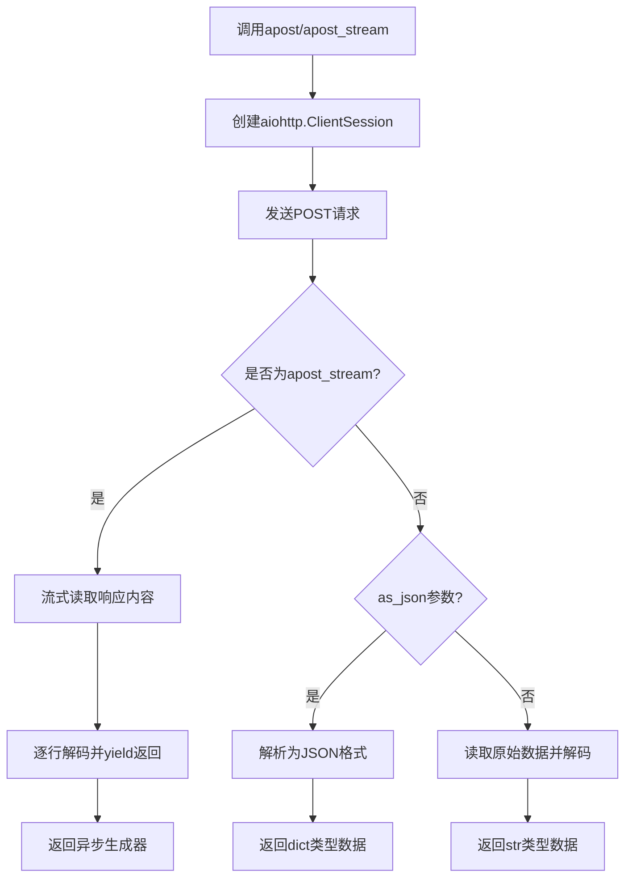
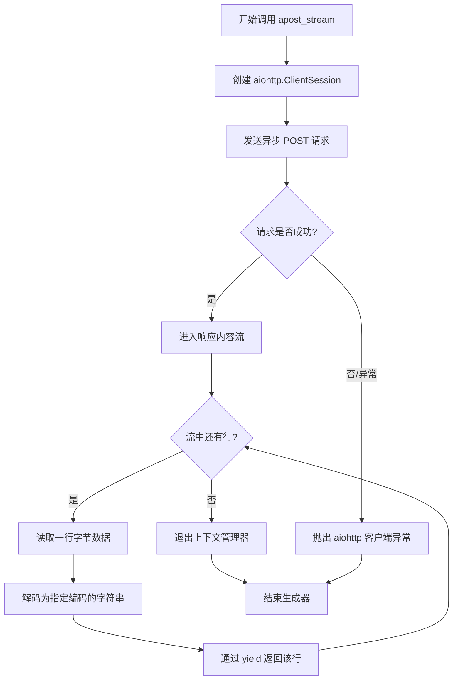

# `.\MetaGPT\metagpt\utils\ahttp_client.py` 详细设计文档

该代码实现了一个纯异步的HTTP客户端，提供了两个核心函数：`apost`用于发送HTTP POST请求并返回完整响应（支持JSON或文本格式），`apost_stream`用于发送HTTP POST请求并以流式方式逐行处理响应内容。代码基于aiohttp库构建，支持参数传递、超时设置和编码配置。

## 整体流程



## 类结构

```
HTTP Client Functions
├── apost (异步POST请求函数)
└── apost_stream (异步流式POST请求函数)
```

## 全局变量及字段


    

## 全局函数及方法


### `apost`

一个纯异步的HTTP POST请求函数，用于向指定URL发送POST请求，并支持多种参数格式和响应解码方式。

参数：

-  `url`：`str`，目标请求的URL地址
-  `params`：`Optional[Mapping[str, str]]`，可选的URL查询参数字典，默认为None
-  `json`：`Any`，可选的JSON格式请求体数据，默认为None
-  `data`：`Any`，可选的表单或其他格式请求体数据，默认为None
-  `headers`：`Optional[dict]`，可选的HTTP请求头字典，默认为None
-  `as_json`：`bool`，布尔标志，指示是否将响应解析为JSON，默认为False
-  `encoding`：`str`，用于解码响应字节流的字符编码，默认为"utf-8"
-  `timeout`：`int`，请求超时时间（秒），默认为aiohttp的默认超时总时长

返回值：`Union[str, dict]`，根据`as_json`参数，返回解码后的字符串或解析后的JSON字典。

#### 流程图

```mermaid
flowchart TD
    A[开始] --> B[创建aiohttp.ClientSession]
    B --> C[使用session.post发送POST请求]
    C --> D{as_json参数为True?}
    D -- 是 --> E[调用resp.json()<br>获取JSON数据]
    D -- 否 --> F[调用resp.read()<br>获取原始字节数据]
    F --> G[使用指定encoding解码字节数据]
    E --> H[返回数据]
    G --> H
    H --> I[结束]
```

#### 带注释源码

```python
async def apost(
    url: str,
    params: Optional[Mapping[str, str]] = None,
    json: Any = None,
    data: Any = None,
    headers: Optional[dict] = None,
    as_json: bool = False,
    encoding: str = "utf-8",
    timeout: int = DEFAULT_TIMEOUT.total,
) -> Union[str, dict]:
    # 创建一个异步HTTP客户端会话
    async with aiohttp.ClientSession() as session:
        # 使用会话发送POST请求，并传入所有相关参数
        async with session.post(url=url, params=params, json=json, data=data, headers=headers, timeout=timeout) as resp:
            # 根据as_json标志决定如何处理响应体
            if as_json:
                # 如果as_json为True，则将响应体解析为JSON字典
                data = await resp.json()
            else:
                # 如果as_json为False，则读取原始字节流
                data = await resp.read()
                # 然后使用指定的编码（如utf-8）将字节流解码为字符串
                data = data.decode(encoding)
    # 返回处理后的数据（字符串或字典）
    return data
```


### `apost_stream`

一个异步生成器函数，用于向指定URL发送HTTP POST请求，并以流式方式逐行读取响应内容。它适用于处理大型响应或服务器推送事件（SSE），允许客户端在数据到达时立即处理，而无需等待整个响应完成。

参数：

-  `url`：`str`，目标URL地址
-  `params`：`Optional[Mapping[str, str]]`，可选的查询参数字典，将附加到URL
-  `json`：`Any`，可选的JSON数据，将作为请求体发送（自动设置Content-Type为application/json）
-  `data`：`Any`，可选的请求体数据，可以是字典、字节或文件对象
-  `headers`：`Optional[dict]`，可选的HTTP请求头字典
-  `encoding`：`str`，用于解码响应字节流的字符编码，默认为"utf-8"
-  `timeout`：`int`，请求超时时间（秒），默认为aiohttp的默认超时

返回值：`AsyncGenerator[str, None]`，一个异步生成器，每次迭代返回解码后的一行响应文本

#### 流程图



#### 带注释源码

```python
async def apost_stream(
    url: str,
    params: Optional[Mapping[str, str]] = None,
    json: Any = None,
    data: Any = None,
    headers: Optional[dict] = None,
    encoding: str = "utf-8",
    timeout: int = DEFAULT_TIMEOUT.total,
) -> Any:  # 实际返回类型应为 AsyncGenerator[str, None]
    """
    usage:
        result = astream(url="xx")
        async for line in result:
            deal_with(line)
    """
    # 创建一个异步HTTP客户端会话上下文管理器，确保资源正确释放
    async with aiohttp.ClientSession() as session:
        # 使用会话发送POST请求，并进入响应上下文管理器
        async with session.post(url=url, params=params, json=json, data=data, headers=headers, timeout=timeout) as resp:
            # 异步迭代响应内容流（resp.content是一个异步可迭代对象）
            async for line in resp.content:
                # 将每一行字节数据解码为指定编码的字符串
                yield line.decode(encoding)
                # 函数在此处暂停，将解码后的行返回给调用者，直到下次迭代
```


## 关键组件


### 异步HTTP POST请求函数 (`apost`)

一个封装了aiohttp库的异步HTTP POST请求函数，支持发送JSON或表单数据，并可选择以JSON格式或指定编码的字符串形式返回响应内容。

### 异步HTTP POST流式请求函数 (`apost_stream`)

一个支持流式响应的异步HTTP POST请求函数，它通过异步生成器逐行返回解码后的响应内容，适用于处理服务器推送或大体积响应数据。

### aiohttp客户端会话管理

代码通过`async with aiohttp.ClientSession()`上下文管理器创建和管理HTTP客户端会话，确保会话在使用后被正确关闭，并作为发起HTTP请求的基础设施。

### 请求参数与数据处理

支持通过`params`传递URL查询参数，通过`json`或`data`传递请求体数据，并通过`headers`设置请求头，提供了灵活的请求构建能力。

### 响应处理与解码

根据`as_json`标志位，选择将响应解析为JSON字典或读取为字节流后按指定`encoding`解码为字符串，`apost_stream`函数则对流式响应进行逐行解码。


## 问题及建议


### 已知问题

-   **会话管理效率低下**：`apost` 和 `apost_stream` 函数在每次调用时都会创建一个新的 `aiohttp.ClientSession` 实例。`ClientSession` 旨在被复用，因为它内部维护了连接池。频繁创建和销毁会话会导致额外的开销，并可能耗尽系统资源（如文件描述符），尤其是在高并发场景下。
-   **缺乏错误处理机制**：代码没有对网络请求过程中可能发生的异常（如连接超时、DNS解析失败、HTTP错误状态码等）进行捕获和处理。当请求失败时，异常会直接抛出给调用者，这可能导致上层应用崩溃，且调用者难以区分不同类型的错误。
-   **硬编码的默认值**：编码 (`encoding="utf-8"`) 和超时时间 (`timeout=DEFAULT_TIMEOUT.total`) 等配置被硬编码在函数签名中。虽然提供了参数，但默认值可能不适合所有场景，且难以在项目范围内统一修改。
-   **`apost` 函数返回类型不精确**：函数签名声明返回 `Union[str, dict]`，但实际行为由 `as_json` 参数决定。当 `as_json=True` 时返回 `dict`，否则返回 `str`。这种设计虽然灵活，但降低了类型安全性和代码的可读性，调用者必须依赖运行时参数值来判断返回类型。
-   **`apost_stream` 函数文档字符串示例有误**：文档中的示例代码 `result = astream(url="xx")` 调用了不存在的 `astream` 函数，应为 `apost_stream`。这会造成使用者的困惑。

### 优化建议

-   **引入会话复用机制**：建议创建一个全局的、可配置的 `ClientSession` 实例，或者提供一个会话工厂/上下文管理器，供所有 HTTP 请求函数复用。这可以显著提升性能，尤其是对于向同一主机发送大量请求的场景。
-   **增强错误处理与重试逻辑**：
    -   使用 `try...except` 块包裹核心请求逻辑，捕获 `aiohttp.ClientError`, `asyncio.TimeoutError` 等异常。
    -   可以定义自定义异常类（如 `HTTPRequestError`），将底层异常信息封装后抛出，方便上层统一处理。
    -   考虑为关键请求添加可配置的重试机制（例如，使用 `tenacity` 库），以提高服务的健壮性。
-   **配置集中化管理**：
    -   将默认超时时间、默认编码、默认请求头等配置提取到配置文件或环境变量中。
    -   可以创建一个配置类（如 `HTTPClientConfig`）来集中管理这些设置，避免在代码中散落硬编码值。
-   **重构函数以提高类型安全性和单一职责**：
    -   考虑将 `apost` 拆分为两个函数：`apost_json` (返回 `dict`) 和 `apost_text` (返回 `str`)。这样每个函数的职责更清晰，返回类型确定，利于静态类型检查和调用。
    -   如果保持原函数，应至少完善文档，明确说明 `as_json` 参数如何影响返回类型。
-   **修正文档并补充更多信息**：
    -   修正 `apost_stream` 文档中的函数名错误。
    -   为两个函数补充更详细的参数说明、返回值说明以及可能抛出的异常。
    -   考虑为模块或函数添加 `__all__` 列表，明确导出哪些公共接口。
-   **考虑添加请求日志和监控**：在生产环境中，为重要的出站HTTP请求添加日志记录（如请求URL、状态码、耗时）是很有价值的，便于问题排查和性能分析。可以考虑通过装饰器或中间件模式非侵入式地实现。
-   **评估是否需要支持更丰富的特性**：根据业务需求，评估是否需要支持代理、SSL证书验证、自定义Cookie管理、请求/响应钩子（hooks）等高级功能。目前的实现是一个基础版本，扩展性有限。


## 其它


### 设计目标与约束

本模块的设计目标是提供一个纯异步的、轻量级的HTTP客户端工具，专注于处理POST请求。它旨在简化异步HTTP POST操作，支持常规的JSON/文本响应获取以及流式响应处理。核心约束包括：1) 依赖 `aiohttp` 库实现异步HTTP通信；2) 保持接口简单，仅封装最常用的参数和功能；3) 作为工具函数，不维护复杂的内部状态或会话生命周期。

### 错误处理与异常设计

当前代码将网络错误、超时、解码错误等异常直接向上层抛出。主要依赖 `aiohttp` 库和标准库（如 `decode`）的异常机制。例如，`aiohttp.ClientError` 及其子类（如 `aiohttp.ClientConnectionError`, `aiohttp.ClientResponseError`）可能被引发。`resp.json()` 在响应内容非有效JSON时会抛出 `aiohttp.ContentTypeError` 或 `json.JSONDecodeError`。`data.decode(encoding)` 在编码不匹配时可能抛出 `UnicodeDecodeError`。模块本身没有定义自定义异常，也没有实现重试、降级等高级容错逻辑。

### 数据流与状态机

模块不包含复杂的状态机。数据流清晰：
1.  **`apost` 函数**：输入参数 -> 创建 `aiohttp.ClientSession` -> 发起异步POST请求 -> 等待完整响应 -> 根据 `as_json` 标志解码响应体（JSON解码或字节解码）-> 返回解码后的数据（`str` 或 `dict`）。
2.  **`apost_stream` 函数**：输入参数 -> 创建 `aiohttp.ClientSession` -> 发起异步POST请求 -> 进入异步生成器循环 -> 逐行 (`async for line in resp.content`) 从响应流中读取、解码并生成数据 -> 外部调用者通过 `async for` 消费数据流。

### 外部依赖与接口契约

1.  **核心依赖**：`aiohttp` 库。这是实现异步HTTP客户端功能的唯一强外部依赖。
2.  **接口契约**：
    *   **调用方**：需要运行在异步环境中（如 `asyncio` 事件循环）。对于 `apost_stream`，调用方必须使用 `async for` 进行迭代。
    *   **被调用方（HTTP服务）**：函数遵循HTTP协议与远程服务通信。`headers`, `json`, `data` 等参数直接影响HTTP请求的构建。
    *   **参数默认值**：`encoding="utf-8"`, `timeout=DEFAULT_TIMEOUT.total` 定义了默认的编码和超时行为。
    *   **返回值**：`apost` 返回 `Union[str, dict]`；`apost_stream` 返回一个异步生成器 (`AsyncGenerator`)，生成解码后的字符串行。

### 安全与合规性考虑

1.  **超时控制**：通过 `timeout` 参数提供了请求超时控制，有助于防止资源耗尽和慢速攻击。
2.  **编码处理**：使用指定的 `encoding` 进行解码，但未对输入编码进行验证或规范化，可能因服务端返回非预期编码导致解码错误或乱码。
3.  **HTTPS**：支持HTTPS（通过 `aiohttp`），但未显式配置SSL验证级别（如忽略证书错误）。默认使用 `aiohttp` 的默认SSL上下文，通常进行验证。
4.  **敏感信息**：`headers` 参数可能用于传递认证信息（如 `Authorization`），但模块本身不提供任何敏感信息的存储或混淆机制，需由调用方负责。
5.  **数据验证**：对输入参数（如 `url`, `headers`）没有进行有效性或安全性验证。例如，未检查URL格式或过滤危险的Header。

    