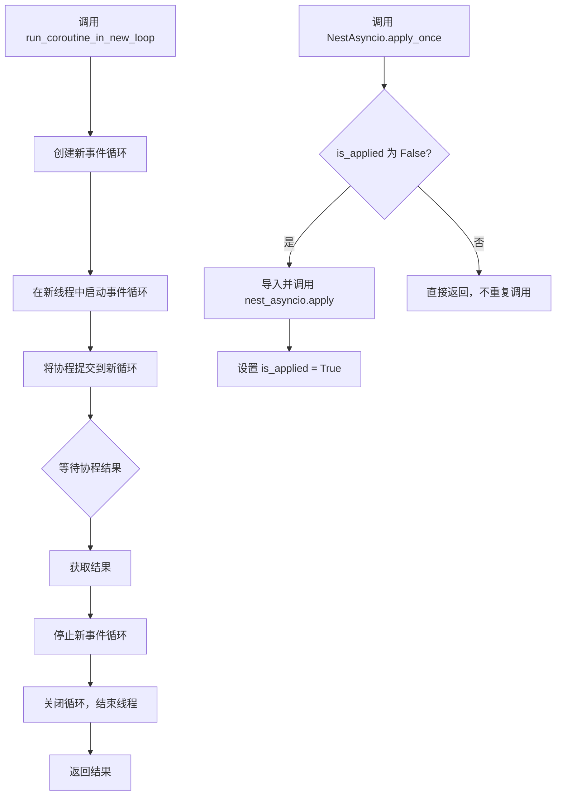
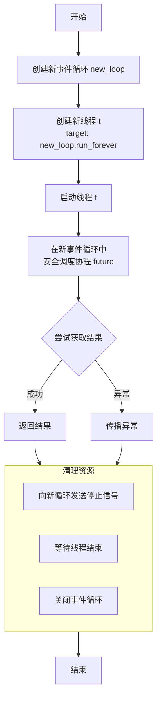

# `.\MetaGPT\metagpt\utils\async_helper.py` 详细设计文档

该代码提供了两个核心功能：1) 一个工具函数 `run_coroutine_in_new_loop`，用于在独立的线程和事件循环中同步执行异步协程，解决在已运行事件循环的上下文中调用异步函数时的冲突问题；2) 一个单例工具类 `NestAsyncio`，用于确保 `nest_asyncio` 库的 `apply` 方法仅被调用一次，使事件循环可重入，从而支持在 Jupyter Notebook 等环境中嵌套运行异步代码。

## 整体流程



## 类结构

```
全局函数
├── run_coroutine_in_new_loop
类
└── NestAsyncio
    ├── 类字段: is_applied
    └── 类方法: apply_once
```

## 全局变量及字段


### `NestAsyncio.is_applied`
    
一个类级别的布尔标志，用于跟踪 `nest_asyncio.apply()` 方法是否已被调用，确保其只执行一次。

类型：`bool`
    
    

## 全局函数及方法

### `run_coroutine_in_new_loop`

该函数用于在一个新创建的、独立的线程和事件循环中运行一个异步协程。它解决了在同步函数中调用异步函数时可能遇到的“事件循环已在运行”的运行时错误。函数会创建新的事件循环和线程，在新线程中启动事件循环，然后在新的事件循环中安全地运行传入的协程，并等待其完成，最后清理资源。

参数：

- `coroutine`：`Coroutine`，需要在新事件循环中运行的异步协程对象。

返回值：`Any`，传入的协程执行后返回的结果。

#### 流程图



#### 带注释源码

```python
def run_coroutine_in_new_loop(coroutine) -> Any:
    """Runs a coroutine in a new, separate event loop on a different thread.

    This function is useful when try to execute an async function within a sync function, but encounter the error `RuntimeError: This event loop is already running`.
    """
    # 1. 创建一个全新的事件循环对象
    new_loop = asyncio.new_event_loop()
    # 2. 创建一个新线程，该线程的目标是运行新事件循环直到其被停止
    t = threading.Thread(target=lambda: new_loop.run_forever())
    t.start()  # 启动线程，此时新事件循环开始在其线程中运行

    # 3. 将传入的协程安全地调度到新线程的事件循环中执行，并返回一个concurrent.futures.Future对象
    future = asyncio.run_coroutine_threadsafe(coroutine, new_loop)

    try:
        # 4. 阻塞等待，直到协程执行完成并返回结果（或抛出异常）
        return future.result()
    finally:
        # 5. 无论协程执行成功还是失败，都执行清理步骤
        # 5.1 向新事件循环发送一个停止信号（call_soon_threadsafe是线程安全的）
        new_loop.call_soon_threadsafe(new_loop.stop)
        # 5.2 等待运行事件循环的线程结束
        t.join()
        # 5.3 关闭事件循环，释放资源
        new_loop.close()
```


### `NestAsyncio.apply_once`

这是一个类方法，用于确保 `nest_asyncio.apply()` 函数在整个应用程序生命周期中仅被调用一次。它通过一个类级别的布尔标志 `is_applied` 来跟踪应用状态，防止重复应用导致潜在问题。

参数：
-  `cls`：`type`，指向 `NestAsyncio` 类本身的引用。

返回值：`None`，此方法不返回任何值。

#### 流程图

```mermaid
flowchart TD
    A[开始调用 apply_once] --> B{检查 is_applied 标志}
    B -- 标志为 False --> C[导入 nest_asyncio 模块]
    C --> D[调用 nest_asyncio.apply()]
    D --> E[将 is_applied 标志设为 True]
    E --> F[结束]
    B -- 标志为 True --> F
```

#### 带注释源码

```python
    @classmethod
    def apply_once(cls):
        """Ensures `nest_asyncio.apply()` is called only once."""
        # 检查类级别的标志，判断 nest_asyncio 是否已被应用
        if not cls.is_applied:
            # 动态导入 nest_asyncio 模块，避免不必要的依赖
            import nest_asyncio

            # 调用 nest_asyncio 的核心函数，使当前事件循环可重入
            nest_asyncio.apply()
            # 将标志设置为 True，确保后续调用不会重复执行
            cls.is_applied = True
```


## 关键组件


### 异步协程执行器 (run_coroutine_in_new_loop)

一个用于在独立的线程和事件循环中同步执行异步协程的实用函数，旨在解决在已运行事件循环的上下文中调用异步函数时遇到的“事件循环已在运行”的运行时错误。

### 事件循环重入管理器 (NestAsyncio)

一个确保`nest_asyncio.apply()`方法仅被调用一次的类，用于使asyncio事件循环可重入，从而允许在已运行的事件循环中嵌套执行异步代码。


## 问题及建议


### 已知问题

-   **线程管理与资源泄漏风险**：`run_coroutine_in_new_loop` 函数在每次调用时都会创建一个新线程和一个新的事件循环。如果频繁调用此函数，将导致大量线程和事件循环被创建和销毁，消耗系统资源，并可能因线程数过多而影响性能或导致程序不稳定。此外，虽然函数中使用了 `finally` 块来确保清理，但在极端情况下（如线程被强制终止），仍存在资源未正确释放的风险。
-   **潜在的并发与同步问题**：该函数将异步任务提交到另一个线程的事件循环中执行，并通过 `future.result()` 同步等待结果。如果被调用的协程内部也尝试与主线程或主事件循环中的对象进行交互（例如，访问非线程安全的资源），可能会引发竞态条件、死锁或数据不一致等并发问题。代码本身未提供任何同步机制来处理这类场景。
-   **错误传播与调试困难**：当在新线程的事件循环中运行的协程抛出异常时，异常会被包装在 `future.result()` 调用中并重新抛出。然而，异常的堆栈跟踪信息可能会变得复杂，因为它跨越了线程边界，这使得定位原始错误发生的位置更加困难，不利于调试。
-   **`NestAsyncio` 类的全局状态副作用**：`NestAsyncio.apply_once` 方法使用一个类变量 `is_applied` 来控制 `nest_asyncio.apply()` 的调用。这是一个全局状态修改。如果在某些环境下（例如，某些测试框架或动态加载场景）需要重置或隔离事件循环的状态，这种“应用一次”的模式可能不适用，且难以管理。
-   **对 `nest_asyncio` 的隐式依赖**：`NestAsyncio` 类在 `apply_once` 方法内部动态导入 `nest_asyncio`。这虽然延迟了依赖加载，但也意味着如果 `nest_asyncio` 包未安装，错误只会在首次调用 `apply_once` 时发生，而不是在导入模块时，这可能会推迟错误的发现时间。

### 优化建议

-   **引入线程池复用机制**：建议为 `run_coroutine_in_new_loop` 函数引入一个可配置的线程池（例如，使用 `concurrent.futures.ThreadPoolExecutor`）。可以将事件循环与线程绑定并放入池中管理，避免每次调用都创建和销毁线程与事件循环。这能显著提升性能并降低资源消耗。同时，应为线程池设置大小上限。
-   **增强错误处理与日志记录**：在 `run_coroutine_in_new_loop` 函数中，除了返回结果或抛出异常，建议增加更详细的日志记录，记录线程的创建、任务的提交、执行结果或异常以及资源的清理过程。这有助于监控和调试跨线程的异步操作。
-   **提供上下文管理器或可关闭接口**：考虑将 `run_coroutine_in_new_loop` 重构为一个类（例如 `AsyncExecutor`），该类实现上下文管理器协议（`__enter__`/`__exit__`）或提供一个显式的 `shutdown` 方法。这样，用户可以更清晰地管理执行器的生命周期，确保资源被正确释放，代码结构也更优雅。
-   **将 `NestAsyncio` 的状态管理显式化**：与其使用隐藏的类变量，不如让 `NestAsyncio` 的实例化来控制状态。可以创建一个 `NestAsyncio` 实例，并通过该实例的方法来应用或（如果可能）恢复设置。这样状态与对象实例绑定，更符合面向对象的设计原则，也便于测试和重置。
-   **明确依赖并考虑条件导入**：在模块顶部或 `NestAsyncio` 类的文档中，明确声明对 `nest_asyncio` 包的依赖。如果该依赖是可选的，可以考虑将 `NestAsyncio` 类放在一个单独的模块中，或者使用 `try...except ImportError` 并在 `apply_once` 中提供更清晰的错误提示，说明如何安装缺失的依赖。
-   **评估替代方案**：从根本上审视需要使用 `run_coroutine_in_new_loop` 和 `NestAsyncio` 的场景。如果是为了在同步代码中调用异步函数，可以考虑重构上层架构，使其原生支持异步（例如，使用 `asyncio.run` 作为入口点）。如果是为了解决事件循环嵌套问题，应优先检查代码结构，看是否能通过更好的任务编排（如 `asyncio.create_task`, `asyncio.gather`）来避免嵌套，而不是依赖 `nest_asyncio` 这种修改解释器运行时行为的库。


## 其它


### 设计目标与约束

该代码模块的核心设计目标是提供在同步环境中安全、可靠地执行异步操作的机制，同时避免常见的“事件循环已在运行”错误。主要约束包括：1) 线程安全性，确保在新线程中创建和运行事件循环不会干扰主线程或其他线程；2) 资源管理，必须确保创建的事件循环、线程等资源在使用后被正确清理，防止内存泄漏；3) 一次性应用，对于`nest_asyncio`的补丁，确保全局只应用一次，避免重复应用导致未定义行为。

### 错误处理与异常设计

代码通过`try...finally`结构确保了资源的清理。`run_coroutine_in_new_loop`函数中，无论协程执行成功还是抛出异常，`finally`块都会确保新创建的事件循环被停止、线程被等待结束、循环被关闭。这防止了线程和事件循环的泄漏。然而，该函数将协程执行过程中抛出的任何异常（包括`future.result()`调用引发的）直接传播给调用者，由调用者决定如何处理。`NestAsyncio.apply_once`方法没有显式的错误处理，如果`nest_asyncio.apply()`调用失败，异常将直接抛出。

### 数据流与状态机

模块的数据流相对简单直接：
1.  **`run_coroutine_in_new_loop`**: 输入一个协程对象 -> 在新线程中创建并启动新事件循环 -> 将协程调度到该循环中执行 -> 等待并获取结果（或异常）-> 清理线程和循环 -> 返回结果或传播异常。
2.  **`NestAsyncio`类**: 包含一个类级布尔状态`is_applied`。初始为`False`。当`apply_once`首次被调用时，状态变为`True`并应用补丁。后续调用检查此状态，直接返回，不执行任何操作。这是一个简单的“已初始化”状态机。

### 外部依赖与接口契约

1.  **显式依赖**:
    *   `asyncio`: Python标准库，用于异步编程，创建事件循环、运行协程。
    *   `threading`: Python标准库，用于创建和管理线程。
    *   `nest_asyncio`: 第三方库（`import nest_asyncio`）。这是关键的外部依赖，用于修补`asyncio`使其事件循环可重入。调用者必须确保此包已安装。

2.  **接口契约**:
    *   `run_coroutine_in_new_loop(coroutine) -> Any`:
        *   **输入**: 一个可等待的协程对象（`coroutine`）。调用者负责提供有效的、无需额外参数的协程。
        *   **输出**: 返回协程执行的结果（类型为`Any`），或在协程执行失败时抛出相应的异常。
        *   **副作用**: 内部会创建并最终销毁一个线程和一个事件循环。
    *   `NestAsyncio.apply_once()`:
        *   **输入**: 无。
        *   **输出**: 无返回值。
        *   **副作用**: 首次调用时，全局性地修改当前进程的`asyncio`事件循环行为（通过`nest_asyncio.apply()`）。后续调用无副作用。

    