# `.\MetaGPT\metagpt\utils\common.py` 详细设计文档

该文件是MetaGPT项目的通用工具模块，提供了丰富的辅助功能，包括文本解析（OutputParser、CodeParser）、文件操作（同步/异步读写JSON/CSV/文本文件）、异常处理、装饰器、字符串处理、类型转换、网络请求、图像编解码、路径处理、日志记录和时间测量等工具函数和类，是项目的基础设施组件。

## 整体流程

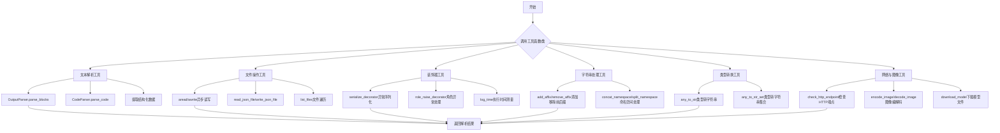

## 类结构

```
common.py (工具模块)
├── OutputParser (输出解析器类)
├── CodeParser (代码解析器类)
├── NoMoneyException (自定义异常类)
└── 全局函数 (30+个工具函数)
```

## 全局变量及字段


### `MARKDOWN_TITLE_PREFIX`
    
用于在Markdown文本中标识标题块的前缀字符串，通常用于解析文本块结构。

类型：`str`
    


### `MESSAGE_ROUTE_TO_ALL`
    
表示消息应路由给所有接收者的特殊标识符，用于消息路由逻辑。

类型：`str`
    


### `logger`
    
全局日志记录器实例，用于在整个应用程序中记录不同级别的日志信息。

类型：`loguru.Logger`
    


### `NoMoneyException.amount`
    
引发异常时所需的金额数值，表示操作因资金不足而无法完成的具体数额。

类型：`Any`
    


### `NoMoneyException.message`
    
异常的描述信息，默认为'Insufficient funds'，用于说明资金不足的具体情况。

类型：`str`
    
    

## 全局函数及方法

### `check_cmd_exists`

检查给定命令在操作系统中是否存在。

参数：

- `command`：`str`，待检查的命令字符串。

返回值：`int`，如果命令存在，返回0；如果命令不存在，返回非0值。

#### 流程图


#### 带注释源码

```python
def check_cmd_exists(command) -> int:
    """检查命令是否存在
    :param command: 待检查的命令
    :return: 如果命令存在，返回0，如果不存在，返回非0
    """
    # 根据操作系统类型，构建不同的命令来检查命令是否存在
    if platform.system().lower() == "windows":
        # Windows系统使用`where`命令来查找可执行文件
        check_command = "where " + command
    else:
        # Unix-like系统（如Linux, macOS）使用`command -v`来检查命令是否存在
        # 如果命令不存在，则输出错误信息并返回非0退出码
        check_command = "command -v " + command + ' >/dev/null 2>&1 || { echo >&2 "no mermaid"; exit 1; }'
    # 执行构建好的检查命令，并获取其退出状态码
    result = os.system(check_command)
    # 返回命令的执行结果（0表示成功/命令存在，非0表示失败/命令不存在）
    return result
```

### `require_python_version`

检查当前运行的Python版本是否高于指定的要求版本。

参数：

- `req_version`：`Tuple`，一个表示要求的最低Python版本的元组，格式应为`(主版本, 次版本)`或`(主版本, 次版本, 微版本)`，例如`(3, 9)`或`(3, 10, 13)`。

返回值：`bool`，如果当前Python版本高于要求版本则返回`True`，否则返回`False`。

#### 流程图

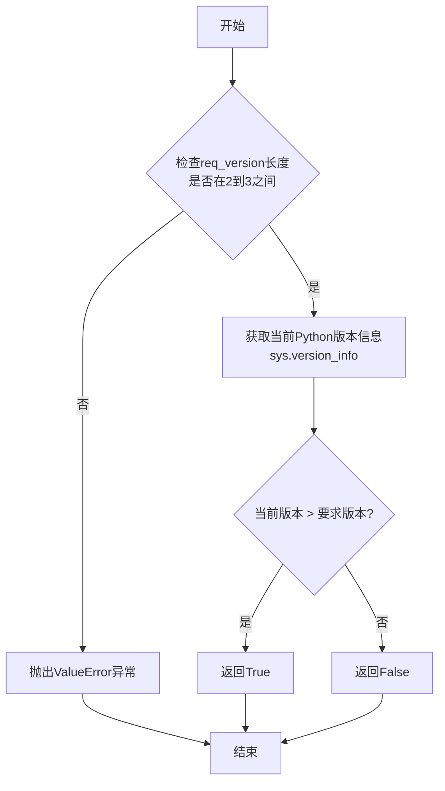

#### 带注释源码

```python
def require_python_version(req_version: Tuple) -> bool:
    # 验证输入参数req_version的长度，必须是2或3，分别对应(主版本, 次版本)或(主版本, 次版本, 微版本)
    if not (2 <= len(req_version) <= 3):
        raise ValueError("req_version should be (3, 9) or (3, 10, 13)")
    # 将当前Python版本信息(sys.version_info)与要求版本(req_version)进行比较
    # sys.version_info是一个命名元组，可以直接与普通元组进行比较
    # 如果当前版本高于要求版本，则返回True，否则返回False
    return bool(sys.version_info > req_version)
```

### `print_members`

递归打印模块、类、函数或方法的成员信息，包括类名、方法名和函数名，并以缩进方式展示层级结构。

参数：

- `module`：`module`，要检查的模块、类、函数或方法对象
- `indent`：`int`，缩进级别，用于控制输出格式的缩进空格数，默认为0

返回值：`None`，无返回值，直接打印输出

#### 流程图

```mermaid
flowchart TD
    A[开始: print_members(module, indent)] --> B[遍历 inspect.getmembers(module)]
    B --> C{检查成员类型}
    C -->|是类| D[打印类名]
    D --> E[递归调用 print_members<br>增加缩进级别]
    E --> B
    C -->|是函数| F[打印函数名]
    C -->|是方法| G[打印方法名]
    F --> H[继续遍历]
    G --> H
    H --> I[遍历结束]
    I --> J[结束]
```

#### 带注释源码

```python
def print_members(module, indent=0):
    """
    https://stackoverflow.com/questions/1796180/how-can-i-get-a-list-of-all-classes-within-current-module-in-python
    """
    # 设置当前层级的缩进前缀
    prefix = " " * indent
    # 遍历模块的所有成员（包括类、函数、方法等）
    for name, obj in inspect.getmembers(module):
        print(name, obj)
        # 如果成员是一个类
        if inspect.isclass(obj):
            print(f"{prefix}Class: {name}")
            # 打印类中的方法，跳过内置特殊方法如 __class__, __base__
            if name in ["__class__", "__base__"]:
                continue
            # 递归调用自身，检查该类的成员，并增加缩进级别
            print_members(obj, indent + 2)
        # 如果成员是一个函数
        elif inspect.isfunction(obj):
            print(f"{prefix}Function: {name}")
        # 如果成员是一个方法
        elif inspect.ismethod(obj):
            print(f"{prefix}Method: {name}")
```

### `get_function_schema`

该函数用于获取给定可调用对象（函数或方法）的签名信息，并将其封装为一个字典返回。字典包含输入参数的类型注解、返回值的类型注解、函数的文档字符串以及函数对象本身。

参数：

- `func`：`Callable`，需要获取签名信息的可调用对象（函数或方法）

返回值：`dict[str, Union[dict, Any, str]]`，包含以下键值对的字典：
  - `"input_params"`：一个字典，键为参数名，值为参数的类型注解
  - `"return_type"`：函数的返回类型注解
  - `"func_desc"`：函数的文档字符串（`__doc__`）
  - `"func"`：传入的函数对象本身

#### 流程图

```mermaid
flowchart TD
    A[开始] --> B[获取函数签名<br>inspect.signature(func)]
    B --> C[提取参数列表<br>sig.parameters]
    C --> D[构建参数字典<br>param_schema]
    D --> E[提取返回类型注解<br>sig.return_annotation]
    E --> F[提取函数文档字符串<br>func.__doc__]
    F --> G[组装结果字典]
    G --> H[返回结果字典]
    H --> I[结束]
```

#### 带注释源码

```python
def get_function_schema(func: Callable) -> dict[str, Union[dict, Any, str]]:
    # 使用inspect模块获取函数的签名
    sig = inspect.signature(func)
    # 从签名中获取参数字典
    parameters = sig.parameters
    # 从签名中获取返回类型注解
    return_type = sig.return_annotation
    # 构建参数字典：键为参数名，值为参数的类型注解
    param_schema = {name: parameter.annotation for name, parameter in parameters.items()}
    # 返回包含所有信息的字典
    return {"input_params": param_schema, "return_type": return_type, "func_desc": func.__doc__, "func": func}
```

### `parse_recipient`

从给定的文本中解析出收件人信息。该函数通过正则表达式匹配文本中的“## Send To:”或“Send To:”模式，提取收件人名称。如果未找到匹配项，则返回空字符串。

参数：

- `text`：`str`，包含收件人信息的文本。

返回值：`str`，解析出的收件人名称，如果未找到则返回空字符串。

#### 流程图

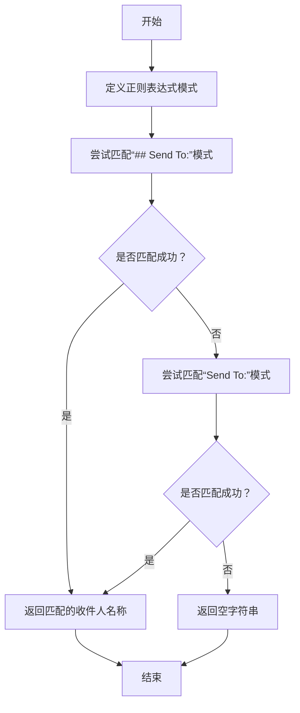

#### 带注释源码

```python
def parse_recipient(text):
    # FIXME: use ActionNode instead.
    # 定义正则表达式模式，匹配“## Send To:”后跟的收件人名称
    pattern = r"## Send To:\s*([A-Za-z]+)\s*?"  # hard code for now
    recipient = re.search(pattern, text)
    if recipient:
        # 如果匹配成功，返回收件人名称
        return recipient.group(1)
    # 如果第一个模式未匹配，尝试匹配“Send To:”模式
    pattern = r"Send To:\s*([A-Za-z]+)\s*?"
    recipient = re.search(pattern, text)
    if recipient:
        # 如果匹配成功，返回收件人名称
        return recipient.group(1)
    # 如果两个模式均未匹配，返回空字符串
    return ""
```

### `remove_comments`

该函数用于从给定的代码字符串中移除所有注释（包括单行注释），并清理多余的空行和行尾空格。

参数：

- `code_str`：`str`，包含注释的原始代码字符串

返回值：`str`，移除注释并清理后的代码字符串

#### 流程图

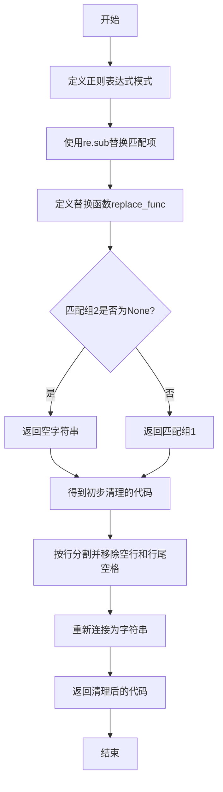

#### 带注释源码

```python
def remove_comments(code_str: str) -> str:
    """Remove comments from code."""
    # 正则表达式模式：匹配字符串字面量（单引号或双引号）或单行注释（#开头到行尾）
    pattern = r"(\".*?\"|\'.*?\')|(\#.*?$)"

    def replace_func(match):
        # 如果匹配到注释（组2不为None），则替换为空字符串
        if match.group(2) is not None:
            return ""
        else:
            # 否则保留字符串字面量（组1）
            return match.group(1)

    # 使用re.sub进行替换，re.MULTILINE标志确保$匹配每行结尾
    clean_code = re.sub(pattern, replace_func, code_str, flags=re.MULTILINE)
    # 进一步清理：移除空行和每行行尾的空格
    clean_code = os.linesep.join([s.rstrip() for s in clean_code.splitlines() if s.strip()])
    return clean_code
```

### `get_class_name`

`get_class_name` 是一个全局函数，用于获取给定类的完整限定名（包括模块名和类名）。它接受一个类对象作为参数，并返回一个字符串，格式为 `{模块名}.{类名}`。

参数：

- `cls`：`type`，需要获取名称的类对象。

返回值：`str`，返回类的完整限定名，格式为 `{模块名}.{类名}`。

#### 流程图

```mermaid
flowchart TD
    A[开始] --> B[接收类对象 cls]
    B --> C[获取类的模块名 cls.__module__]
    C --> D[获取类的名称 cls.__name__]
    D --> E[拼接模块名和类名<br>格式: {模块名}.{类名}]
    E --> F[返回完整限定名]
    F --> G[结束]
```

#### 带注释源码

```python
def get_class_name(cls) -> str:
    """Return class name"""
    return f"{cls.__module__}.{cls.__name__}"
```

### `any_to_str`

该函数用于将任意类型的值转换为其对应的字符串表示。如果输入是字符串类型，则直接返回；否则，返回该值的类名（包括模块路径）。对于可调用对象（如函数、类），也返回其类名。

参数：

- `val`：`Any`，任意类型的输入值

返回值：`str`，输入值的字符串表示。如果是字符串则直接返回，否则返回其类名（包括模块路径）。

#### 流程图

```mermaid
flowchart TD
    A[开始: any_to_str(val)] --> B{val 是字符串类型?}
    B -- 是 --> C[返回 val]
    B -- 否 --> D{val 是可调用对象?}
    D -- 是 --> E[返回 get_class_name(val)]
    D -- 否 --> F[返回 get_class_name(type(val))]
    C --> G[结束]
    E --> G
    F --> G
```

#### 带注释源码

```python
def any_to_str(val: Any) -> str:
    """Return the class name or the class name of the object, or 'val' if it's a string type."""
    # 如果输入值是字符串类型，直接返回该字符串
    if isinstance(val, str):
        return val
    # 如果输入值不是可调用对象（如普通对象实例），则获取其类型的类名
    elif not callable(val):
        return get_class_name(type(val))
    # 如果输入值是可调用对象（如函数、类），则直接获取其类名
    else:
        return get_class_name(val)
```

### `any_to_str_set`

将任意类型的值转换为字符串集合。该函数首先检查输入值是否为可迭代类型（字典、列表、集合、元组），如果是，则遍历其元素（对于字典，遍历其值），并将每个元素通过 `any_to_str` 函数转换为字符串后加入结果集合。如果输入值不是可迭代类型，则直接将其通过 `any_to_str` 转换为字符串并加入集合。最终返回一个包含所有转换后字符串的集合。

参数：

- `val`：`Any`，任意类型的输入值，可以是基本类型、对象、可迭代类型等。

返回值：`set`，包含转换后字符串的集合。

#### 流程图

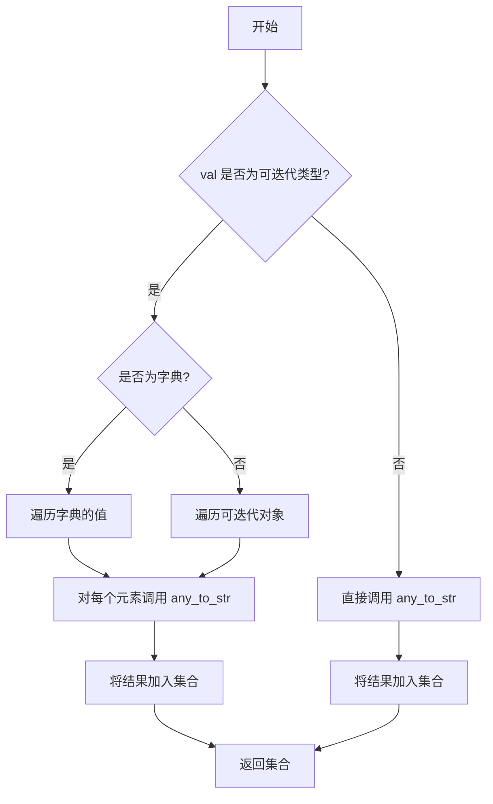

#### 带注释源码

```python
def any_to_str_set(val) -> set:
    """Convert any type to string set."""
    res = set()  # 初始化结果集合

    # 检查值是否为可迭代类型，但排除字符串（因为字符串也是可迭代的）
    if isinstance(val, (dict, list, set, tuple)):
        # 对字典特殊处理，遍历其值
        if isinstance(val, dict):
            val = val.values()

        # 遍历可迭代对象的每个元素
        for i in val:
            res.add(any_to_str(i))  # 将每个元素转换为字符串并加入集合
    else:
        # 如果值不是可迭代类型，直接转换为字符串并加入集合
        res.add(any_to_str(val))

    return res  # 返回结果集合
```

### `is_send_to`

判断给定的消息是否应该发送给指定的地址集合。如果消息的发送目标中包含特殊标记 `MESSAGE_ROUTE_TO_ALL`，或者消息的发送目标与给定的地址集合有交集，则返回 `True`，否则返回 `False`。

参数：
- `message`：`Message`，待检查的消息对象。
- `addresses`：`set`，目标地址集合。

返回值：`bool`，如果消息应发送给指定地址集合中的任一地址，则返回 `True`，否则返回 `False`。

#### 流程图

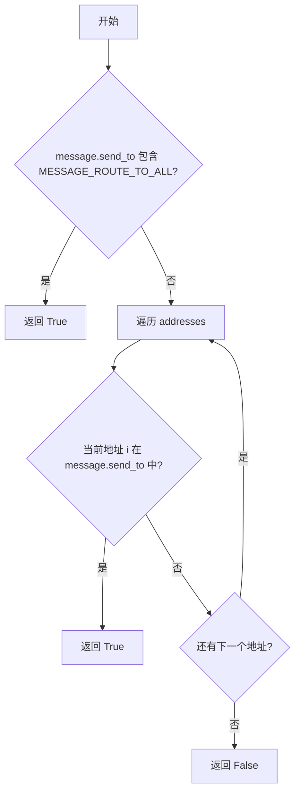

#### 带注释源码

```python
def is_send_to(message: "Message", addresses: set):
    """Return whether it's consumer"""
    # 检查消息的发送目标是否包含特殊标记，表示发送给所有地址
    if MESSAGE_ROUTE_TO_ALL in message.send_to:
        return True

    # 遍历给定的地址集合，检查是否有地址在消息的发送目标中
    for i in addresses:
        if i in message.send_to:
            return True
    # 如果没有找到匹配的地址，返回 False
    return False
```

### `any_to_name`

该函数用于将任意类型的值转换为其名称，通过提取点分路径的最后一部分来实现。例如，对于类名 `metagpt.common.OutputParser`，该函数将返回 `OutputParser`。

参数：

- `val`：`Any`，任意类型的输入值，可以是字符串、类、对象等。

返回值：`str`，输入值的名称（点分路径的最后一部分）。

#### 流程图

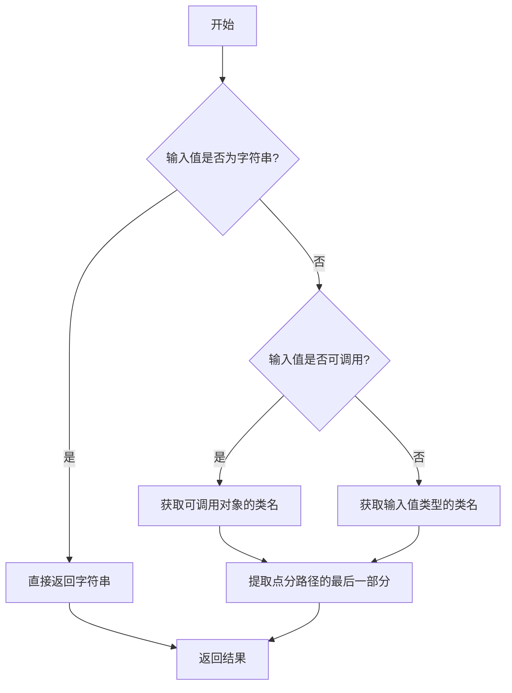

#### 带注释源码

```python
def any_to_name(val):
    """
    Convert a value to its name by extracting the last part of the dotted path.
    """
    # 调用 any_to_str 函数将输入值转换为完整的点分路径字符串
    # 然后通过 split('.') 分割字符串，取最后一部分作为名称
    return any_to_str(val).split(".")[-1]
```

### `concat_namespace`

该函数用于将多个字段连接起来，创建一个唯一的命名空间前缀。它接受任意数量的参数，并使用指定的分隔符将它们连接成一个字符串。

参数：

- `*args`：`Any`，任意数量的参数，这些参数将被转换为字符串并连接起来。
- `delimiter`：`str`，分隔符，默认为`":"`，用于连接各个参数。

返回值：`str`，返回由分隔符连接各个参数字符串后形成的命名空间前缀字符串。

#### 流程图

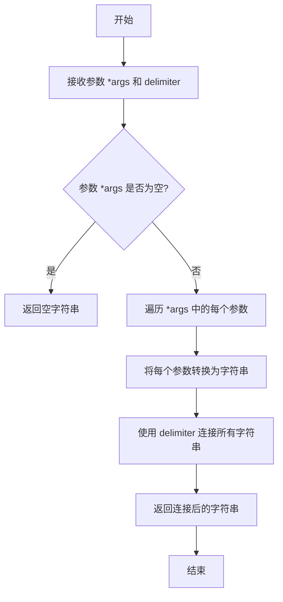

#### 带注释源码

```python
def concat_namespace(*args, delimiter: str = ":") -> str:
    """Concatenate fields to create a unique namespace prefix.

    Example:
        >>> concat_namespace('prefix', 'field1', 'field2', delimiter=":")
        'prefix:field1:field2'
    """
    # 使用指定的分隔符将传入的所有参数（转换为字符串后）连接起来
    return delimiter.join(str(value) for value in args)
```

### `split_namespace`

该函数用于将一个带有命名空间前缀的名称字符串按照指定的分隔符拆分成命名空间前缀和名称部分。它支持通过 `maxsplit` 参数控制最大拆分次数，从而可以处理多层嵌套的命名空间。

参数：

- `ns_class_name`：`str`，待拆分的带有命名空间前缀的名称字符串。
- `delimiter`：`str`，默认为 `":"`，用于拆分字符串的分隔符。
- `maxsplit`：`int`，默认为 `1`，最大拆分次数。

返回值：`List[str]`，拆分后的字符串列表，包含命名空间前缀和名称部分。

#### 流程图

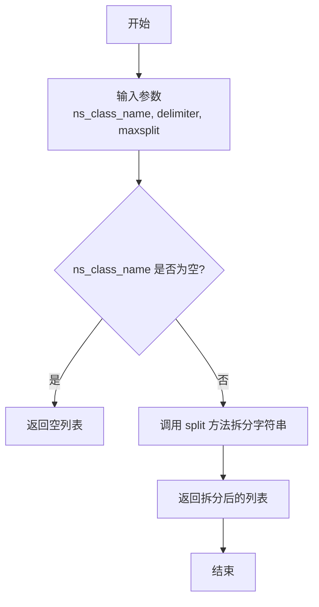

#### 带注释源码

```python
def split_namespace(ns_class_name: str, delimiter: str = ":", maxsplit: int = 1) -> List[str]:
    """Split a namespace-prefixed name into its namespace-prefix and name parts.

    Example:
        >>> split_namespace('prefix:classname')
        ['prefix', 'classname']

        >>> split_namespace('prefix:module:class', delimiter=":", maxsplit=2)
        ['prefix', 'module', 'class']
    """
    return ns_class_name.split(delimiter, maxsplit=maxsplit)
```

### `auto_namespace`

`auto_namespace` 函数用于自动处理带有命名空间前缀的名称。如果输入的名称没有命名空间前缀，它会为其添加一个默认的命名空间前缀（"?"）；如果输入为空，则返回一个默认的命名空间和名称组合（"?:?"）；如果输入已经包含命名空间前缀，则直接返回原名称。

参数：

- `name`：`str`，需要处理的名称字符串。
- `delimiter`：`str`，命名空间前缀与名称之间的分隔符，默认为 ":"。

返回值：`str`，处理后的带有命名空间前缀的名称字符串。

#### 流程图

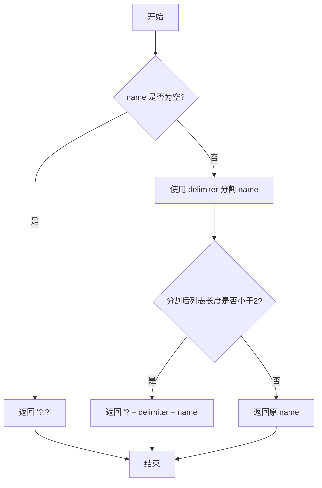

#### 带注释源码

```python
def auto_namespace(name: str, delimiter: str = ":") -> str:
    """Automatically handle namespace-prefixed names.

    If the input name is empty, returns a default namespace prefix and name.
    If the input name is not namespace-prefixed, adds a default namespace prefix.
    Otherwise, returns the input name unchanged.

    Example:
        >>> auto_namespace('classname')
        '?:classname'

        >>> auto_namespace('prefix:classname')
        'prefix:classname'

        >>> auto_namespace('')
        '?:?'

        >>> auto_namespace('?:custom')
        '?:custom'
    """
    # 如果输入名称为空，返回默认的命名空间和名称组合
    if not name:
        return f"?{delimiter}?"
    # 使用指定的分隔符分割名称
    v = split_namespace(name, delimiter=delimiter)
    # 如果分割后长度小于2，说明没有命名空间前缀，为其添加默认前缀 "?"
    if len(v) < 2:
        return f"?{delimiter}{name}"
    # 如果已有命名空间前缀，直接返回原名称
    return name
```

### `add_affix`

`add_affix` 是一个全局函数，用于根据指定的封装类型（affix）对输入文本进行封装。它支持两种封装方式：大括号封装和URL编码封装。如果指定了“none”或不支持的封装类型，则返回原始文本。

参数：

- `text`：`str`，需要被封装的原始文本。
- `affix`：`Literal["brace", "url", "none"]`，指定封装类型。可选值为“brace”（大括号封装）、“url”（URL编码封装）或“none”（不封装）。默认为“brace”。

返回值：`str`，封装后的文本。

#### 流程图

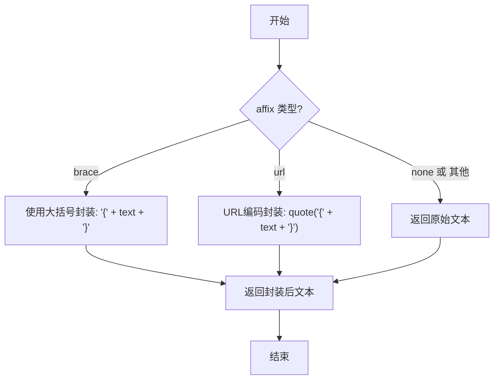

#### 带注释源码

```python
def add_affix(text: str, affix: Literal["brace", "url", "none"] = "brace"):
    """Add affix to encapsulate data.

    Example:
        >>> add_affix("data", affix="brace")
        '{data}'

        >>> add_affix("example.com", affix="url")
        '%7Bexample.com%7D'

        >>> add_affix("text", affix="none")
        'text'
    """
    # 定义封装类型到处理函数的映射字典
    mappings = {
        "brace": lambda x: "{" + x + "}",  # 大括号封装
        "url": lambda x: quote("{" + x + "}"),  # URL编码封装
    }
    # 根据affix参数获取对应的处理函数，若未找到则使用返回原始文本的lambda函数
    encoder = mappings.get(affix, lambda x: x)
    # 调用处理函数并返回结果
    return encoder(text)
```

### `remove_affix`

`remove_affix` 函数用于移除文本中的特定前缀和后缀，以提取封装的数据。它支持两种主要的封装方式：花括号（brace）和URL编码（url）。如果指定了“none”，则直接返回原始文本。

参数：

- `text`：`str`，需要移除前缀和后缀的输入文本。
- `affix`：`Literal["brace", "url", "none"]`，指定要移除的前缀和后缀类型，默认为“brace”。

返回值：`str`，移除前缀和后缀后的文本。

#### 流程图

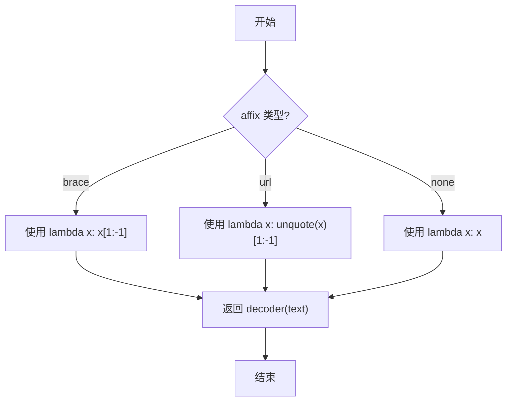

#### 带注释源码

```python
def remove_affix(text, affix: Literal["brace", "url", "none"] = "brace"):
    """Remove affix to extract encapsulated data.

    Args:
        text (str): The input text with affix to be removed.
        affix (str, optional): The type of affix used. Defaults to "brace".
            Supported affix types: "brace" for removing curly braces, "url" for URL decoding within curly braces.

    Returns:
        str: The text with affix removed.

    Example:
        >>> remove_affix('{data}', affix="brace")
        'data'

        >>> remove_affix('%7Bexample.com%7D', affix="url")
        'example.com'

        >>> remove_affix('text', affix="none")
        'text'
    """
    # 定义不同 affix 类型对应的解码函数
    mappings = {"brace": lambda x: x[1:-1], "url": lambda x: unquote(x)[1:-1]}
    # 根据 affix 类型选择解码器，默认为恒等函数（即不处理）
    decoder = mappings.get(affix, lambda x: x)
    # 应用解码器并返回结果
    return decoder(text)
```

### `general_after_log`

该函数是一个高阶函数，用于生成一个日志记录回调函数。这个生成的函数专门用于在 `tenacity` 库的重试机制中，当一次重试调用完成后（无论成功或失败）被调用。它会记录被调用函数的名称、调用耗时、尝试次数以及发生的异常（如果有的话），从而帮助监控和调试重试逻辑。

参数：

- `i`：`loguru.Logger`，一个 `loguru` 日志记录器实例，用于输出日志信息。
- `sec_format`：`str`，一个字符串格式说明符，用于格式化从调用开始到结束所经过的秒数。默认值为 `"%0.3f"`，表示保留三位小数。

返回值：`Callable[["RetryCallState"], None]`，返回一个可调用对象。该对象接受一个 `tenacity.RetryCallState` 类型的参数，不返回任何值（`None`）。当被调用时，它会根据 `RetryCallState` 对象中的信息记录日志。

#### 流程图

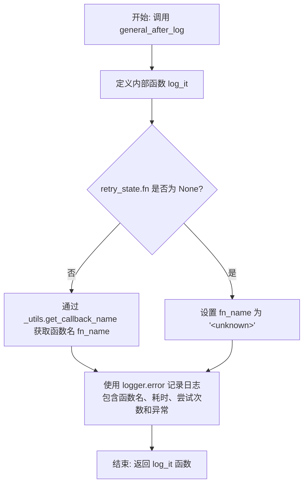

#### 带注释源码

```python
def general_after_log(i: "loguru.Logger", sec_format: str = "%0.3f") -> Callable[["RetryCallState"], None]:
    """
    Generates a logging function to be used after a call is retried.

    This generated function logs an error message with the outcome of the retried function call. It includes
    the name of the function, the time taken for the call in seconds (formatted according to `sec_format`),
    the number of attempts made, and the exception raised, if any.

    :param i: A Logger instance from the loguru library used to log the error message.
    :param sec_format: A string format specifier for how to format the number of seconds since the start of the call.
                       Defaults to three decimal places.
    :return: A callable that accepts a RetryCallState object and returns None. This callable logs the details
             of the retried call.
    """

    def log_it(retry_state: "RetryCallState") -> None:
        # 如果重试状态中没有函数信息，则使用默认名称
        if retry_state.fn is None:
            fn_name = "<unknown>"
        else:
            # 使用 tenacity 的内部工具函数获取可调用对象的名称
            fn_name = _utils.get_callback_name(retry_state.fn)

        # 使用传入的 logger 记录错误级别的日志
        # 日志内容包括：函数名、格式化后的耗时、尝试次数（序数形式）以及抛出的异常
        i.error(
            f"Finished call to '{fn_name}' after {sec_format % retry_state.seconds_since_start}(s), "
            f"this was the {_utils.to_ordinal(retry_state.attempt_number)} time calling it. "
            f"exp: {retry_state.outcome.exception()}"
        )

    # 返回内部定义的 log_it 函数
    return log_it
```

### `read_json_file`

读取指定路径的JSON文件，并将其内容解析为Python列表。如果文件不存在或解析失败，会抛出相应的异常。

参数：

- `json_file`：`str`，要读取的JSON文件的路径
- `encoding`：`str`，文件编码，默认为`"utf-8"`

返回值：`list[Any]`，解析后的JSON数据列表

#### 流程图

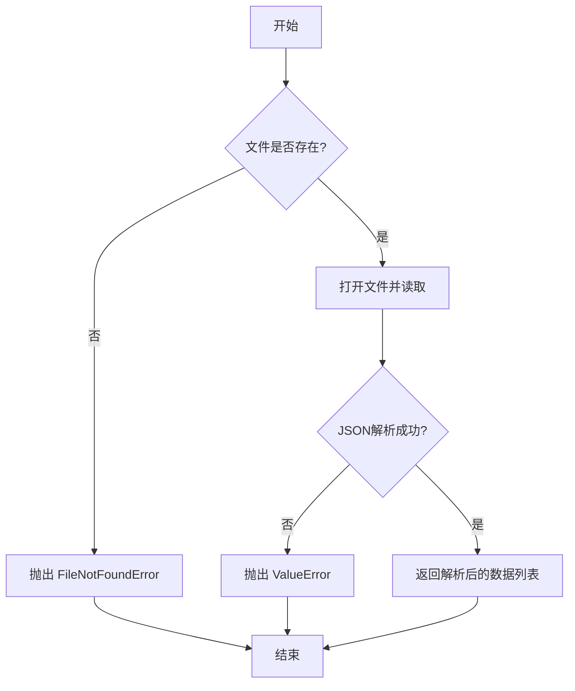

#### 带注释源码

```python
def read_json_file(json_file: str, encoding: str = "utf-8") -> list[Any]:
    # 检查文件是否存在，不存在则抛出 FileNotFoundError 异常
    if not Path(json_file).exists():
        raise FileNotFoundError(f"json_file: {json_file} not exist, return []")

    # 以指定编码打开文件进行读取
    with open(json_file, "r", encoding=encoding) as fin:
        try:
            # 尝试使用 json.load 解析文件内容
            data = json.load(fin)
        except Exception:
            # 如果解析过程中出现任何异常，抛出 ValueError
            raise ValueError(f"read json file: {json_file} failed")
    # 返回解析后的数据（预期为列表）
    return data
```

### `handle_unknown_serialization`

该函数用于在序列化过程中遇到无法处理的对象时，生成详细的错误提示信息。它通过检查对象的类型（如方法、函数、类实例等），构造一个包含对象名称和类型的描述性错误消息，并抛出 `TypeError` 异常。

参数：

- `x`：`Any`，需要检查的任意对象，可能是方法、函数、类实例或其他类型。

返回值：`None`，该函数不返回任何值，而是抛出 `TypeError` 异常。

#### 流程图

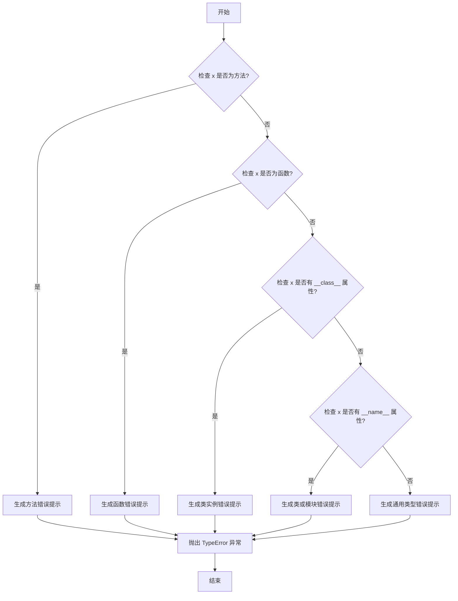

#### 带注释源码

```python
def handle_unknown_serialization(x: Any) -> str:
    """For `to_jsonable_python` debug, get more detail about the x."""

    # 检查 x 是否为方法（bound method）
    if inspect.ismethod(x):
        tip = f"Cannot serialize method '{x.__func__.__name__}' of class '{x.__self__.__class__.__name__}'"
    # 检查 x 是否为函数（unbound function）
    elif inspect.isfunction(x):
        tip = f"Cannot serialize function '{x.__name__}'"
    # 检查 x 是否为类实例（具有 __class__ 属性）
    elif hasattr(x, "__class__"):
        tip = f"Cannot serialize instance of '{x.__class__.__name__}'"
    # 检查 x 是否为类或模块（具有 __name__ 属性）
    elif hasattr(x, "__name__"):
        tip = f"Cannot serialize class or module '{x.__name__}'"
    # 其他情况，使用对象的类型名称
    else:
        tip = f"Cannot serialize object of type '{type(x).__name__}'"

    # 抛出 TypeError 异常，携带构造的错误提示信息
    raise TypeError(tip)
```

### `write_json_file`

将给定的数据对象序列化为JSON格式并写入到指定的文件中。该函数会确保目标目录存在，并支持自定义编码、缩进以及序列化失败时的回退处理。

参数：

- `json_file`：`str`，目标JSON文件的路径
- `data`：`Any`，需要被序列化并写入文件的数据对象
- `encoding`：`str`，可选，文件编码，默认为`"utf-8"`
- `indent`：`int`，可选，JSON输出的缩进空格数，默认为`4`
- `use_fallback`：`bool`，可选，是否在序列化失败时使用自定义的回退处理函数，默认为`False`

返回值：`None`，该函数没有返回值，其主要作用是将数据写入文件。

#### 流程图

```mermaid
flowchart TD
    A[开始: write_json_file] --> B[创建Path对象: folder_path]
    B --> C{检查父目录是否存在?}
    C -- 否 --> D[创建父目录<br>parents=True, exist_ok=True]
    C -- 是 --> E[定义自定义序列化函数<br>custom_default]
    D --> E
    E --> F[以写入模式打开文件]
    F --> G[使用json.dump写入数据<br>ensure_ascii=False, indent, default=custom_default]
    G --> H[结束]
```

#### 带注释源码

```python
def write_json_file(json_file: str, data: Any, encoding: str = "utf-8", indent: int = 4, use_fallback: bool = False):
    # 1. 获取目标文件的父目录路径
    folder_path = Path(json_file).parent
    # 2. 如果父目录不存在，则递归创建它
    if not folder_path.exists():
        folder_path.mkdir(parents=True, exist_ok=True)

    # 3. 创建一个偏函数，用于自定义JSON序列化。
    #    核心是`pydantic_core.to_jsonable_python`，它可以将Pydantic模型和许多Python类型转换为JSON兼容格式。
    #    `fallback`参数指定当`to_jsonable_python`无法处理某个对象时调用的函数。
    #    如果`use_fallback`为True，则使用`handle_unknown_serialization`函数提供更详细的错误信息。
    #    如果为False，则`fallback`为None，遇到无法序列化的对象会抛出`TypeError`。
    custom_default = partial(to_jsonable_python, fallback=handle_unknown_serialization if use_fallback else None)

    # 4. 以指定编码打开文件进行写入
    with open(json_file, "w", encoding=encoding) as fout:
        # 5. 使用json.dump将数据序列化并写入文件。
        #    `ensure_ascii=False`: 允许输出非ASCII字符（如中文）。
        #    `indent`: 指定缩进，使生成的JSON更易读。
        #    `default=custom_default`: 使用上面定义的偏函数作为默认序列化器。
        json.dump(data, fout, ensure_ascii=False, indent=indent, default=custom_default)
```

### `read_jsonl_file`

读取JSONL（JSON Lines）文件，将每一行解析为JSON对象，并返回一个包含所有解析后字典的列表。

参数：

- `jsonl_file`：`str`，要读取的JSONL文件的路径。
- `encoding`：`str`，可选，文件编码，默认为"utf-8"。

返回值：`list[dict]`，包含文件中所有JSON对象（每行一个）的列表。

#### 流程图

```mermaid
flowchart TD
    A[开始] --> B{文件是否存在？}
    B -- 否 --> C[抛出 FileNotFoundError]
    B -- 是 --> D[打开文件]
    D --> E[初始化空列表 datas]
    E --> F[遍历文件每一行]
    F --> G{是否成功解析为JSON？}
    G -- 否 --> H[抛出 ValueError]
    G -- 是 --> I[将解析后的字典添加到 datas]
    I --> J{是否还有更多行？}
    J -- 是 --> F
    J -- 否 --> K[返回 datas]
    C --> L[结束]
    H --> L
    K --> L
```

#### 带注释源码

```python
def read_jsonl_file(jsonl_file: str, encoding="utf-8") -> list[dict]:
    # 检查文件是否存在，如果不存在则抛出 FileNotFoundError 异常
    if not Path(jsonl_file).exists():
        raise FileNotFoundError(f"json_file: {jsonl_file} not exist, return []")
    datas = []  # 初始化一个空列表，用于存储解析后的JSON对象
    with open(jsonl_file, "r", encoding=encoding) as fin:  # 以指定编码打开文件
        try:
            for line in fin:  # 遍历文件的每一行
                data = json.loads(line)  # 将当前行解析为JSON对象（字典）
                datas.append(data)  # 将解析后的字典添加到列表中
        except Exception:  # 如果在解析过程中发生任何异常
            raise ValueError(f"read jsonl file: {jsonl_file} failed")  # 抛出 ValueError 异常
    return datas  # 返回包含所有解析后字典的列表
```

### `add_jsonl_file`

将给定的字典列表追加到指定的JSONL文件中。如果文件不存在，会创建文件及其父目录。

参数：

- `jsonl_file`：`str`，目标JSONL文件的路径
- `data`：`list[dict]`，要追加到文件中的字典列表
- `encoding`：`str`，可选，文件编码，默认为`None`（使用系统默认编码）

返回值：`None`，该函数不返回任何值，仅执行文件写入操作

#### 流程图

```mermaid
flowchart TD
    A[开始] --> B[获取文件父目录路径]
    B --> C{父目录是否存在?}
    C -->|否| D[创建父目录]
    C -->|是| E[打开文件准备追加写入]
    D --> E
    E --> F[遍历数据列表]
    F --> G[将字典转换为JSON字符串]
    G --> H[写入文件并添加换行符]
    H --> I{是否还有数据?}
    I -->|是| F
    I -->|否| J[结束]
```

#### 带注释源码

```python
def add_jsonl_file(jsonl_file: str, data: list[dict], encoding: str = None):
    # 获取JSONL文件的父目录路径
    folder_path = Path(jsonl_file).parent
    
    # 如果父目录不存在，则创建它（包括所有必要的父目录）
    if not folder_path.exists():
        folder_path.mkdir(parents=True, exist_ok=True)

    # 以追加模式打开文件，使用指定的编码（如果提供了的话）
    with open(jsonl_file, "a", encoding=encoding) as fout:
        # 遍历数据列表中的每个字典
        for json_item in data:
            # 将字典转换为JSON字符串并写入文件，末尾添加换行符
            fout.write(json.dumps(json_item) + "\n")
```

### `read_csv_to_list`

该函数用于读取CSV文件并将其内容转换为列表的列表。如果指定了`header`参数为`True`，则返回一个元组，包含表头行和所有数据行。

参数：

- `curr_file`：`str`，要读取的CSV文件路径。
- `header`：`bool`，可选参数，默认为`False`。如果为`True`，则返回表头行和数据行；如果为`False`，则仅返回数据行。
- `strip_trail`：`bool`，可选参数，默认为`True`。如果为`True`，则去除每个单元格值的前后空格。

返回值：`list` 或 `tuple`，如果`header`为`False`，返回一个列表的列表，其中每个子列表代表CSV文件的一行数据；如果`header`为`True`，返回一个元组，第一个元素是表头行（列表），第二个元素是数据行（列表的列表）。

#### 流程图

```mermaid
flowchart TD
    A[开始] --> B[打开CSV文件]
    B --> C[初始化analysis_list]
    C --> D[遍历CSV的每一行]
    D --> E{strip_trail为True?}
    E -->|是| F[去除行中每个元素的前后空格]
    E -->|否| G[保持原样]
    F --> H[将处理后的行添加到analysis_list]
    G --> H
    H --> I{是否还有下一行?}
    I -->|是| D
    I -->|否| J{header为True?}
    J -->|是| K[返回表头行和数据行]
    J -->|否| L[返回所有数据行]
    K --> M[结束]
    L --> M
```

#### 带注释源码

```python
def read_csv_to_list(curr_file: str, header=False, strip_trail=True):
    """
    Reads in a csv file to a list of list. If header is True, it returns a
    tuple with (header row, all rows)
    ARGS:
      curr_file: path to the current csv file.
    RETURNS:
      List of list where the component lists are the rows of the file.
    """
    logger.debug(f"start read csv: {curr_file}")  # 记录开始读取CSV文件的日志
    analysis_list = []  # 初始化一个空列表，用于存储CSV文件的所有行
    with open(curr_file) as f_analysis_file:  # 打开CSV文件
        data_reader = csv.reader(f_analysis_file, delimiter=",")  # 创建CSV读取器，指定逗号为分隔符
        for count, row in enumerate(data_reader):  # 遍历CSV文件的每一行
            if strip_trail:  # 如果strip_trail参数为True
                row = [i.strip() for i in row]  # 去除行中每个元素的前后空格
            analysis_list += [row]  # 将处理后的行添加到analysis_list中
    if not header:  # 如果header参数为False
        return analysis_list  # 返回所有数据行
    else:  # 如果header参数为True
        return analysis_list[0], analysis_list[1:]  # 返回表头行和数据行
```

### `import_class`

`import_class` 函数用于动态导入指定模块中的类。它接收模块名和类名作为参数，通过 `importlib.import_module` 导入模块，然后使用 `getattr` 获取模块中的类，并返回该类。

参数：

- `class_name`：`str`，要导入的类的名称。
- `module_name`：`str`，包含该类的模块的名称。

返回值：`type`，返回导入的类。

#### 流程图

```mermaid
flowchart TD
    A[开始] --> B[接收 class_name 和 module_name]
    B --> C[使用 importlib.import_module 导入模块]
    C --> D[使用 getattr 从模块中获取类]
    D --> E[返回类]
    E --> F[结束]
```

#### 带注释源码

```python
def import_class(class_name: str, module_name: str) -> type:
    # 导入指定的模块
    module = importlib.import_module(module_name)
    # 从模块中获取指定的类
    a_class = getattr(module, class_name)
    # 返回获取到的类
    return a_class
```

### `import_class_inst`

该函数用于动态导入指定模块中的类，并实例化该类，返回实例对象。

参数：

- `class_name`：`str`，要导入的类的名称
- `module_name`：`str`，包含该类的模块名称
- `*args`：`Any`，传递给类构造函数的可变位置参数
- `**kwargs`：`Any`，传递给类构造函数的可变关键字参数

返回值：`object`，返回指定类的实例对象

#### 流程图

```mermaid
flowchart TD
    A[开始: import_class_inst<br>class_name, module_name, *args, **kwargs] --> B[调用 import_class<br>导入指定模块中的类]
    B --> C{导入是否成功?}
    C -- 是 --> D[使用 *args 和 **kwargs<br>实例化该类]
    D --> E[返回实例对象]
    C -- 否 --> F[抛出异常]
    E --> G[结束]
    F --> G
```

#### 带注释源码

```python
def import_class_inst(class_name: str, module_name: str, *args, **kwargs) -> object:
    # 首先调用 import_class 函数，根据类名和模块名动态导入类
    a_class = import_class(class_name, module_name)
    # 使用传入的位置参数和关键字参数实例化导入的类
    class_inst = a_class(*args, **kwargs)
    # 返回类的实例对象
    return class_inst
```

### `format_trackback_info`

该函数用于格式化并返回当前异常的堆栈跟踪信息。它通过调用 `traceback.format_exc` 方法，可以限制返回的堆栈帧数量，以便于调试和日志记录。

参数：

- `limit`：`int`，可选参数，指定返回的堆栈帧数量。默认值为 2。

返回值：`str`，返回格式化的异常堆栈跟踪信息字符串。

#### 流程图

```mermaid
flowchart TD
    A[开始] --> B[调用 traceback.format_exc<br>并传入 limit 参数]
    B --> C[返回格式化后的<br>堆栈跟踪信息字符串]
    C --> D[结束]
```

#### 带注释源码

```python
def format_trackback_info(limit: int = 2):
    # 调用 traceback.format_exc 函数，传入 limit 参数以限制堆栈帧数量
    # 返回格式化的异常堆栈跟踪信息字符串
    return traceback.format_exc(limit=limit)
```

### `serialize_decorator`

`serialize_decorator` 是一个装饰器函数，用于包装异步方法。其主要功能是在被装饰的方法执行过程中捕获 `KeyboardInterrupt` 或其他异常，并在异常发生时调用 `self.serialize()` 方法（假设 `self` 是 `Team` 类的实例）来序列化项目状态，同时记录详细的错误信息。该装饰器旨在增强方法的健壮性，确保在意外中断或错误发生时能够保存项目状态，便于后续恢复或调试。

参数：

- `func`：`Callable`，需要被装饰的异步函数或方法。

返回值：`Callable`，返回一个新的异步包装函数 `wrapper`，该函数会执行原始函数并在异常发生时处理序列化逻辑。

#### 流程图

```mermaid
flowchart TD
    A[调用被装饰的函数] --> B{执行 func};
    B --> C[成功执行];
    C --> D[返回结果];
    B --> E[捕获 KeyboardInterrupt];
    E --> F[记录错误并序列化项目];
    F --> G[返回 None];
    B --> H[捕获其他异常];
    H --> I[记录错误并序列化项目];
    I --> J[返回 None];
```

#### 带注释源码

```python
def serialize_decorator(func):
    # 定义包装函数，用于增强原始函数的功能
    async def wrapper(self, *args, **kwargs):
        try:
            # 尝试执行原始函数
            result = await func(self, *args, **kwargs)
            return result
        except KeyboardInterrupt:
            # 捕获键盘中断异常（如 Ctrl+C）
            logger.error(f"KeyboardInterrupt occurs, start to serialize the project, exp:\n{format_trackback_info()}")
        except Exception:
            # 捕获其他所有异常
            logger.error(f"Exception occurs, start to serialize the project, exp:\n{format_trackback_info()}")
        # 在异常发生后调用序列化方法（假设 self 是 Team 类的实例）
        self.serialize()  # Team.serialize

    return wrapper
```

### `role_raise_decorator`

这是一个用于装饰角色（Role）类中异步方法的装饰器。它的核心功能是增强异常处理能力，确保在角色执行过程中发生异常（包括键盘中断`KeyboardInterrupt`和其他常规异常）时，能够进行适当的清理工作（如从内存中删除最近观察到的消息），并以一种可控的方式重新抛出异常，便于外部系统捕获和处理。它特别处理了`RetryError`，并对特定的外部库异常（如`openai`和`httpx`）进行了区分处理。

参数：

- `func`：`Callable`，被装饰的异步函数或方法。

返回值：`Callable`，返回一个新的异步包装函数（wrapper）。

#### 流程图

```mermaid
flowchart TD
    A[调用被装饰函数 func] --> B{执行是否成功？}
    B -- 是 --> C[返回 func 的执行结果]
    B -- 否，发生 KeyboardInterrupt --> D[记录错误日志]
    D --> E[从内存中删除 self.latest_observed_msg]
    E --> F[将 KeyboardInterrupt 包装为<br>新的 Exception 并抛出]
    B -- 否，发生其他 Exception --> G[记录异常日志]
    G --> H{异常是否为 RetryError？}
    H -- 是 --> I[提取其内部的 last_attempt._exception]
    I --> J{异常名称是否匹配<br>'openai.' 或 'httpx.'？}
    J -- 是 --> K[直接抛出该内部异常]
    J -- 否 --> L[从内存中删除 self.latest_observed_msg]
    H -- 否 --> L
    L --> M[将原始异常包装为<br>新的 Exception 并抛出]
```

#### 带注释源码

```python
def role_raise_decorator(func):
    # 定义内部包装函数，用于增强原函数func的异常处理逻辑
    async def wrapper(self, *args, **kwargs):
        try:
            # 尝试执行原异步函数
            return await func(self, *args, **kwargs)
        except KeyboardInterrupt as kbi:
            # 捕获键盘中断异常（如Ctrl+C）
            logger.error(f"KeyboardInterrupt: {kbi} occurs, start to serialize the project")
            # 如果角色有最近观察到的消息，则从内存中删除它
            if self.latest_observed_msg:
                self.rc.memory.delete(self.latest_observed_msg)
            # 将KeyboardInterrupt包装成一个新的Exception并抛出，以便外部捕获
            # format_trackback_info(limit=None)用于获取完整的堆栈跟踪信息
            raise Exception(format_trackback_info(limit=None))
        except Exception as e:
            # 捕获其他所有异常
            # 如果角色有最近观察到的消息，则记录日志并从内存中删除该消息
            # 目的是在异常后清理状态，可能为角色重新观察该消息创造条件
            if self.latest_observed_msg:
                logger.exception(
                    "There is a exception in role's execution, in order to resume, "
                    "we delete the newest role communication message in the role's memory."
                )
                self.rc.memory.delete(self.latest_observed_msg)
            # 对RetryError进行特殊处理（通常来自tenacity重试库）
            if isinstance(e, RetryError):
                # 获取重试过程中最后一次尝试抛出的异常
                last_error = e.last_attempt._exception
                # 将异常对象转换为其类名的字符串表示
                name = any_to_str(last_error)
                # 如果异常来自openai或httpx库，则直接抛出这个内部异常
                # 这允许对这些特定外部依赖的异常进行更精细的处理
                if re.match(r"^openai\.", name) or re.match(r"^httpx\.", name):
                    raise last_error
            # 对于其他异常，或者非openai/httpx的RetryError内部异常，
            # 将原始异常包装成一个新的Exception并抛出，同时携带完整的堆栈信息
            # `from e` 保留了原始异常的上下文链
            raise Exception(format_trackback_info(limit=None)) from e
    # 返回包装函数
    return wrapper
```

### `aread`

异步读取文件内容，支持自动检测文件编码。

参数：

- `filename`：`str | Path`，要读取的文件路径，可以是字符串或Path对象
- `encoding`：`str`，默认编码为"utf-8"，如果检测到编码错误会自动使用检测到的编码

返回值：`str`，读取到的文件内容字符串，如果文件不存在则返回空字符串

#### 流程图

```mermaid
graph TD
    A[开始] --> B{文件是否存在?}
    B -->|否| C[返回空字符串]
    B -->|是| D[尝试用指定编码读取]
    D --> E{是否发生<br>UnicodeDecodeError?}
    E -->|否| F[返回读取内容]
    E -->|是| G[以二进制模式读取文件]
    G --> H[使用chardet检测编码]
    H --> I[用检测到的编码解码内容]
    I --> F
```

#### 带注释源码

```python
@handle_exception  # 异常处理装饰器，统一处理函数执行过程中的异常
async def aread(filename: str | Path, encoding="utf-8") -> str:
    """Read file asynchronously."""  # 异步读取文件
    if not filename or not Path(filename).exists():  # 检查文件名是否有效且文件是否存在
        return ""  # 文件不存在时返回空字符串
    try:
        # 尝试用指定的编码打开并读取文件
        async with aiofiles.open(str(filename), mode="r", encoding=encoding) as reader:
            content = await reader.read()  # 异步读取文件内容
    except UnicodeDecodeError:  # 如果发生编码错误
        # 以二进制模式重新打开文件
        async with aiofiles.open(str(filename), mode="rb") as reader:
            raw = await reader.read()  # 读取原始字节数据
            result = chardet.detect(raw)  # 使用chardet检测文件编码
            detected_encoding = result["encoding"]  # 获取检测到的编码
            content = raw.decode(detected_encoding)  # 用检测到的编码解码内容
    return content  # 返回读取到的内容
```

### `awrite`

异步写入文件函数，用于将字符串数据异步写入指定文件。如果文件路径不存在，会自动创建父目录。

参数：

- `filename`：`str | Path`，要写入的文件路径，可以是字符串或Path对象
- `data`：`str`，要写入的字符串数据
- `encoding`：`str`，文件编码格式，默认为"utf-8"

返回值：`None`，该函数没有返回值

#### 流程图

```mermaid
flowchart TD
    A[开始] --> B[将filename转换为Path对象]
    B --> C[创建父目录<br>pathname.parent.mkdir]
    C --> D[异步打开文件写入模式]
    D --> E[写入数据到文件]
    E --> F[结束]
```

#### 带注释源码

```python
async def awrite(filename: str | Path, data: str, encoding="utf-8"):
    """Write file asynchronously."""
    # 将输入的文件名转换为Path对象，便于路径操作
    pathname = Path(filename)
    
    # 创建文件的父目录，如果目录已存在则不创建
    # parents=True表示创建所有必要的父目录
    # exist_ok=True表示如果目录已存在不抛出异常
    pathname.parent.mkdir(parents=True, exist_ok=True)
    
    # 使用aiofiles异步打开文件进行写入操作
    # mode="w"表示写入模式，会覆盖已有内容
    async with aiofiles.open(str(pathname), mode="w", encoding=encoding) as writer:
        # 异步写入数据到文件
        await writer.write(data)
```

### `read_file_block`

异步读取指定文件的特定行范围（从`lineno`到`end_lineno`）的内容，并返回这些行的拼接字符串。

参数：
- `filename`：`str | Path`，要读取的文件路径。
- `lineno`：`int`，起始行号（包含）。
- `end_lineno`：`int`，结束行号（包含）。

返回值：`str`，指定行范围内的文件内容拼接成的字符串。如果文件不存在，返回空字符串。

#### 流程图

```mermaid
flowchart TD
    A[开始] --> B{文件是否存在?}
    B -- 否 --> C[返回空字符串]
    B -- 是 --> D[初始化空列表 lines]
    D --> E[异步打开文件]
    E --> F[初始化行计数器 ix = 0]
    F --> G{ix < end_lineno?}
    G -- 否 --> H[拼接 lines 并返回]
    G -- 是 --> I[ix += 1]
    I --> J[读取一行]
    J --> K{ix < lineno?}
    K -- 是 --> G
    K -- 否 --> L{ix > end_lineno?}
    L -- 是 --> H
    L -- 否 --> M[将行添加到 lines]
    M --> G
```

#### 带注释源码

```python
async def read_file_block(filename: str | Path, lineno: int, end_lineno: int):
    # 检查文件是否存在，不存在则直接返回空字符串
    if not Path(filename).exists():
        return ""
    # 初始化一个列表用于存储符合条件的行
    lines = []
    # 异步打开文件进行读取
    async with aiofiles.open(str(filename), mode="r") as reader:
        # 初始化行计数器
        ix = 0
        # 循环直到处理完结束行
        while ix < end_lineno:
            ix += 1
            # 异步读取一行
            line = await reader.readline()
            # 如果当前行号小于起始行号，跳过
            if ix < lineno:
                continue
            # 如果当前行号大于结束行号，跳出循环
            if ix > end_lineno:
                break
            # 将符合条件的行添加到列表中
            lines.append(line)
    # 将列表中的所有行拼接成一个字符串并返回
    return "".join(lines)
```

### `list_files`

递归列出指定目录及其所有子目录中的文件路径。

参数：

- `root`：`str | Path`，要遍历的根目录路径，可以是字符串或Path对象

返回值：`List[Path]`，包含所有找到的文件路径的列表，每个路径都是Path对象

#### 流程图

```mermaid
flowchart TD
    A[开始: list_files(root)] --> B{目录是否存在?}
    B -->|否| C[返回空列表]
    B -->|是| D[遍历目录项]
    D --> E{是文件?}
    E -->|是| F[添加到文件列表]
    E -->|否| G[递归调用list_files]
    G --> H[合并子目录文件列表]
    F --> I[继续遍历]
    H --> I
    I --> J{遍历完成?}
    J -->|否| D
    J -->|是| K[返回文件列表]
    C --> K
```

#### 带注释源码

```python
def list_files(root: str | Path) -> List[Path]:
    # 初始化文件列表
    files = []
    try:
        # 将输入转换为Path对象
        directory_path = Path(root)
        # 检查目录是否存在
        if not directory_path.exists():
            # 目录不存在时返回空列表
            return []
        # 遍历目录中的所有项
        for file_path in directory_path.iterdir():
            # 判断是否为文件
            if file_path.is_file():
                # 如果是文件，直接添加到列表
                files.append(file_path)
            else:
                # 如果是目录，递归调用list_files获取子目录中的文件
                subfolder_files = list_files(root=file_path)
                # 将子目录的文件列表合并到当前列表
                files.extend(subfolder_files)
    except Exception as e:
        # 捕获并记录任何异常
        logger.error(f"Error: {e}")
    # 返回最终的文件列表
    return files
```

### `parse_json_code_block`

该函数用于从Markdown文本中提取JSON代码块。如果文本中包含用三个反引号包裹的JSON代码块（标记为`json`），则提取这些块的内容；否则，将整个文本视为一个JSON块。提取后，会去除每个块的前后空白字符。

参数：

- `markdown_text`：`str`，输入的Markdown文本，可能包含JSON代码块。

返回值：`List[str]`，提取出的JSON代码块列表，每个块为去除前后空白后的字符串。

#### 流程图

```mermaid
flowchart TD
    A[开始] --> B{文本中是否包含```json?}
    B -- 是 --> C[使用正则表达式提取所有```json...```块]
    B -- 否 --> D[将整个文本作为列表元素]
    C --> E[遍历提取的块列表]
    D --> F[将整个文本作为列表元素]
    E --> G[去除每个块的前后空白]
    F --> G
    G --> H[返回处理后的块列表]
    H --> I[结束]
```

#### 带注释源码

```python
def parse_json_code_block(markdown_text: str) -> List[str]:
    # 检查输入文本中是否包含```json标记
    # 如果包含，则使用正则表达式提取所有```json...```之间的内容（非贪婪模式，支持多行）
    # 如果不包含，则将整个文本作为一个元素放入列表
    json_blocks = (
        re.findall(r"```json(.*?)```", markdown_text, re.DOTALL) if "```json" in markdown_text else [markdown_text]
    )

    # 遍历提取出的块列表，对每个块去除前后的空白字符（如空格、换行符）
    return [v.strip() for v in json_blocks]
```

### `remove_white_spaces`

该函数用于移除字符串中除引号内空格外的所有空白字符。它通过正则表达式匹配并删除不在单引号或双引号内的空白字符，从而保留字符串字面量中的空格。

参数：

- `v`：`str`，需要处理的输入字符串。

返回值：`str`，处理后的字符串，移除了引号外的所有空白字符。

#### 流程图

```mermaid
graph TD
    A[开始] --> B[输入字符串 v]
    B --> C[使用正则表达式移除引号外空白]
    C --> D[返回处理后的字符串]
    D --> E[结束]
```

#### 带注释源码

```python
def remove_white_spaces(v: str) -> str:
    # 使用正则表达式移除字符串中除引号内空格外的所有空白字符
    # (?<!['\"]) 表示匹配前面不是单引号或双引号的位置
    # \s 匹配任何空白字符（空格、制表符、换行符等）
    # | 表示或
    # (?<=['\"]) 表示匹配前面是单引号或双引号的位置
    # 整体正则表达式匹配：不在引号内的空白字符 或 在引号内的空白字符（但实际替换为空）
    # 通过 re.sub 将匹配到的部分替换为空字符串，从而移除空白字符
    return re.sub(r"(?<!['\"])\s|(?<=['\"])\s", "", v)
```

### `aread_bin`

异步读取二进制文件的内容。

参数：

- `filename`：`Union[str, Path]`，要读取的文件名或路径。

返回值：`bytes`，文件的二进制内容。

#### 流程图

```mermaid
flowchart TD
    A[开始] --> B[打开文件<br>异步读取模式]
    B --> C[读取文件内容]
    C --> D[返回二进制数据]
    D --> E[结束]
```

#### 带注释源码

```python
async def aread_bin(filename: str | Path) -> bytes:
    """Read binary file asynchronously.

    Args:
        filename (Union[str, Path]): The name or path of the file to be read.

    Returns:
        bytes: The content of the file as bytes.

    Example:
        >>> content = await aread_bin('example.txt')
        b'This is the content of the file.'

        >>> content = await aread_bin(Path('example.txt'))
        b'This is the content of the file.'
    """
    # 使用 aiofiles 异步打开文件，模式为二进制读取 ('rb')
    async with aiofiles.open(str(filename), mode="rb") as reader:
        # 异步读取文件的全部内容
        content = await reader.read()
    # 返回读取到的二进制数据
    return content
```

### `awrite_bin`

异步写入二进制数据到指定文件。如果文件路径的父目录不存在，会自动创建。

参数：

- `filename`：`Union[str, Path]`，要写入的文件名或路径。
- `data`：`bytes`，要写入的二进制数据。

返回值：`None`，无返回值。

#### 流程图

```mermaid
flowchart TD
    A[开始] --> B[将filename转换为Path对象]
    B --> C[检查父目录是否存在]
    C --> D{父目录是否存在?}
    D -- 否 --> E[创建父目录]
    E --> F[以二进制写入模式打开文件]
    D -- 是 --> F
    F --> G[异步写入data]
    G --> H[结束]
```

#### 带注释源码

```python
async def awrite_bin(filename: str | Path, data: bytes):
    """Write binary file asynchronously.

    Args:
        filename (Union[str, Path]): The name or path of the file to be written.
        data (bytes): The binary data to be written to the file.

    Example:
        >>> await awrite_bin('output.bin', b'This is binary data.')

        >>> await awrite_bin(Path('output.bin'), b'Another set of binary data.')
    """
    # 将输入的文件名转换为Path对象，确保路径操作的一致性
    pathname = Path(filename)
    # 确保文件的父目录存在，如果不存在则递归创建
    pathname.parent.mkdir(parents=True, exist_ok=True)
    # 以异步二进制写入模式打开文件
    async with aiofiles.open(str(pathname), mode="wb") as writer:
        # 异步写入二进制数据
        await writer.write(data)
```

### `is_coroutine_func`

检查给定的可调用对象是否为协程函数。

参数：

- `func`：`Callable`，待检查的可调用对象（函数、方法等）。

返回值：`bool`，如果 `func` 是协程函数则返回 `True`，否则返回 `False`。

#### 流程图

```mermaid
flowchart TD
    A[开始] --> B{调用 inspect.iscoroutinefunction(func) }
    B --> C[返回 True]
    B --> D[返回 False]
    C --> E[结束]
    D --> E
```

#### 带注释源码

```python
def is_coroutine_func(func: Callable) -> bool:
    # 使用 inspect 模块的 iscoroutinefunction 函数判断传入的 func 是否为协程函数
    return inspect.iscoroutinefunction(func)
```

### `load_mc_skills_code`

该函数用于从指定的目录中加载Minecraft技能代码文件。它接受一个技能名称列表和一个技能目录路径作为参数，返回一个包含所有技能代码的字符串列表。如果未提供技能名称列表，则默认加载指定目录下所有以`.js`结尾的文件。

参数：

- `skill_names`：`list[str]`，可选参数，指定要加载的技能名称列表。如果为`None`，则加载目录下所有`.js`文件。
- `skills_dir`：`Path`，可选参数，指定技能代码文件所在的目录路径。如果为`None`，则默认使用当前文件所在目录。

返回值：`list[str]`，返回一个包含所有技能代码的字符串列表。

#### 流程图

```mermaid
flowchart TD
    A[开始] --> B{skills_dir 是否为 None?}
    B -->|是| C[设置 skills_dir 为当前文件所在目录]
    B -->|否| D[使用传入的 skills_dir]
    C --> E{skill_names 是否为 None?}
    D --> E
    E -->|是| F[获取目录下所有 .js 文件<br>并提取文件名作为技能名称]
    E -->|否| G[使用传入的 skill_names]
    F --> H[遍历技能名称列表]
    G --> H
    H --> I[读取每个技能文件内容]
    I --> J[将内容添加到技能列表]
    J --> K[返回技能代码列表]
    K --> L[结束]
```

#### 带注释源码

```python
def load_mc_skills_code(skill_names: list[str] = None, skills_dir: Path = None) -> list[str]:
    """load minecraft skill from js files"""
    # 如果未提供技能目录，则默认使用当前文件所在目录
    if not skills_dir:
        skills_dir = Path(__file__).parent.absolute()
    # 如果未提供技能名称列表，则获取目录下所有 .js 文件，并提取文件名作为技能名称
    if skill_names is None:
        skill_names = [skill[:-3] for skill in os.listdir(f"{skills_dir}") if skill.endswith(".js")]
    # 遍历技能名称列表，读取每个技能文件的内容，并添加到技能列表中
    skills = [skills_dir.joinpath(f"{skill_name}.js").read_text() for skill_name in skill_names]
    # 返回包含所有技能代码的字符串列表
    return skills
```

### `encode_image`

将图像文件或PIL.Image对象编码为Base64字符串。

参数：

- `image_path_or_pil`：`Union[Path, Image, str]`，图像文件路径、PIL.Image对象或图像文件路径字符串
- `encoding`：`str`，可选，Base64编码使用的字符编码，默认为"utf-8"

返回值：`str`，Base64编码后的图像字符串

#### 流程图

```mermaid
flowchart TD
    A[开始: encode_image] --> B{参数类型判断}
    B -->|PIL.Image| C[保存到内存缓冲区]
    B -->|Path/str| D[检查文件是否存在]
    D -->|不存在| E[抛出FileNotFoundError]
    D -->|存在| F[读取文件二进制数据]
    C --> G[获取字节数据]
    F --> G
    G --> H[Base64编码]
    H --> I[解码为指定编码字符串]
    I --> J[返回Base64字符串]
    E --> K[结束]
    J --> K
```

#### 带注释源码

```python
def encode_image(image_path_or_pil: Union[Path, Image, str], encoding: str = "utf-8") -> str:
    """encode image from file or PIL.Image into base64"""
    # 判断输入参数类型：如果是PIL.Image对象
    if isinstance(image_path_or_pil, Image.Image):
        # 创建内存缓冲区
        buffer = BytesIO()
        # 将图像保存为JPEG格式到缓冲区
        image_path_or_pil.save(buffer, format="JPEG")
        # 获取缓冲区中的字节数据
        bytes_data = buffer.getvalue()
    else:
        # 如果输入是字符串，转换为Path对象
        if isinstance(image_path_or_pil, str):
            image_path_or_pil = Path(image_path_or_pil)
        # 检查文件是否存在
        if not image_path_or_pil.exists():
            # 文件不存在时抛出异常
            raise FileNotFoundError(f"{image_path_or_pil} not exists")
        # 以二进制模式读取文件
        with open(str(image_path_or_pil), "rb") as image_file:
            bytes_data = image_file.read()
    # 对字节数据进行Base64编码，然后解码为指定编码的字符串
    return base64.b64encode(bytes_data).decode(encoding)
```

### `decode_image`

`decode_image` 函数用于从 URL 或 Base64 编码的字符串中解码图像，并返回一个 PIL.Image 对象。它支持处理 HTTP(S) 图像 URL 和 Base64 编码的图像数据。

参数：

- `img_url_or_b64`：`str`，包含图像 URL 或 Base64 编码字符串的输入字符串。

返回值：`Image`，解码后的 PIL.Image 对象。

#### 流程图

```mermaid
flowchart TD
    A[开始: decode_image(img_url_or_b64)] --> B{img_url_or_b64 是否以 'http' 开头?};
    B -- 是 --> C[发送 HTTP 请求获取图像数据];
    C --> D[从响应内容创建 BytesIO 对象];
    D --> E[使用 PIL.Image.open 打开图像];
    E --> F[返回 PIL.Image 对象];
    B -- 否 --> G[移除 Base64 数据 URI 前缀];
    G --> H[解码 Base64 字符串为二进制数据];
    H --> I[从二进制数据创建 BytesIO 对象];
    I --> J[使用 PIL.Image.open 打开图像];
    J --> F;
    F --> K[结束];
```

#### 带注释源码

```python
def decode_image(img_url_or_b64: str) -> Image:
    """decode image from url or base64 into PIL.Image"""
    # 检查输入字符串是否以 'http' 开头，判断是否为 URL
    if img_url_or_b64.startswith("http"):
        # 图像 HTTP(S) URL：发送 GET 请求获取图像内容
        resp = requests.get(img_url_or_b64)
        # 将响应内容包装为 BytesIO 对象，以便 PIL 可以读取
        img = Image.open(BytesIO(resp.content))
    else:
        # 图像 Base64 编码数据：使用正则表达式移除可能的数据 URI 前缀（如 'data:image/png;base64,'）
        b64_data = re.sub("^data:image/.+;base64,", "", img_url_or_b64)
        # 将 Base64 字符串解码为二进制数据
        img_data = BytesIO(base64.b64decode(b64_data))
        # 从二进制数据创建 PIL.Image 对象
        img = Image.open(img_data)
    # 返回解码后的图像对象
    return img
```

### `extract_image_paths`

该函数用于从给定的文本内容中提取所有符合特定图像文件扩展名的文件路径。它通过正则表达式匹配文本中出现的图像文件路径，并返回一个包含所有匹配路径的列表。

参数：

- `content`：`str`，需要从中提取图像路径的文本内容。

返回值：`list[str]`，返回一个包含所有匹配到的图像文件路径的列表。

#### 流程图

```mermaid
flowchart TD
    A[开始] --> B[定义正则表达式模式]
    B --> C[使用正则表达式匹配文本]
    C --> D[返回匹配到的图像路径列表]
    D --> E[结束]
```

#### 带注释源码

```python
def extract_image_paths(content: str) -> list[str]:
    # 定义正则表达式模式，用于匹配常见的图像文件扩展名（不区分大小写）
    pattern = r"[^\s]+\.(?:png|jpe?g|gif|bmp|tiff|PNG|JPE?G|GIF|BMP|TIFF)"
    # 使用正则表达式查找所有匹配的图像路径
    image_paths = re.findall(pattern, content)
    # 返回匹配到的图像路径列表
    return image_paths
```

### `extract_and_encode_images`

该函数用于从给定的文本内容中提取图像文件路径，检查这些路径是否存在，并将存在的图像文件编码为Base64字符串列表。

参数：

- `content`：`str`，包含可能存在的图像文件路径的文本内容。

返回值：`list[str]`，返回一个Base64编码的图像字符串列表，每个字符串对应一个存在的图像文件。

#### 流程图

```mermaid
flowchart TD
    A[开始] --> B[调用extract_image_paths<br>提取所有图像路径]
    B --> C[初始化空列表images]
    C --> D[遍历每个路径]
    D --> E{路径是否存在？}
    E -->|是| F[调用encode_image<br>编码图像为Base64]
    F --> G[将Base64字符串添加到images列表]
    G --> D
    E -->|否| D
    D --> H[遍历结束]
    H --> I[返回images列表]
    I --> J[结束]
```

#### 带注释源码

```python
def extract_and_encode_images(content: str) -> list[str]:
    # 初始化一个空列表，用于存储编码后的图像字符串
    images = []
    # 调用extract_image_paths函数，从输入文本中提取所有符合图像文件扩展名的路径
    for path in extract_image_paths(content):
        # 检查提取出的路径在文件系统中是否存在
        if os.path.exists(path):
            # 如果路径存在，调用encode_image函数将图像文件编码为Base64字符串
            images.append(encode_image(path))
    # 返回包含所有成功编码的图像Base64字符串的列表
    return images
```

### `log_and_reraise`

该函数是一个用于重试（retry）机制的异常处理回调函数。当重试操作达到最大尝试次数后，它会记录最后一次异常信息，并重新抛出该异常，从而终止重试过程。

参数：

- `retry_state`：`RetryCallState`，表示重试调用的状态，包含最后一次尝试的异常信息。

返回值：`None`，该函数不返回任何值，而是直接抛出异常。

#### 流程图

```mermaid
flowchart TD
    A[开始] --> B[记录最后一次异常信息]
    B --> C[记录推荐查看的文档链接]
    C --> D[重新抛出最后一次异常]
    D --> E[结束]
```

#### 带注释源码

```python
def log_and_reraise(retry_state: RetryCallState):
    # 记录最后一次尝试的异常信息
    logger.error(f"Retry attempts exhausted. Last exception: {retry_state.outcome.exception()}")
    # 记录推荐查看的文档链接，用于问题排查
    logger.warning(
        """
Recommend going to https://deepwisdom.feishu.cn/wiki/MsGnwQBjiif9c3koSJNcYaoSnu4#part-XdatdVlhEojeAfxaaEZcMV3ZniQ
See FAQ 5.8
"""
    )
    # 重新抛出最后一次尝试的异常，终止重试过程
    raise retry_state.outcome.exception()
```

### `get_mime_type`

该函数用于获取给定文件的MIME类型。它首先尝试通过文件扩展名猜测MIME类型，如果猜测失败或强制读取标志为真，则通过执行系统命令`file --mime-type`来获取更准确的MIME类型。如果系统命令执行失败，则返回猜测的MIME类型或"unknown"。

参数：

- `filename`：`str | Path`，需要获取MIME类型的文件路径或Path对象。
- `force_read`：`bool`，是否强制通过读取文件内容来获取MIME类型，默认为False。

返回值：`str`，文件的MIME类型字符串。如果无法确定，则返回"unknown"。

#### 流程图

```mermaid
graph TD
    A[开始] --> B{猜测MIME类型};
    B -->|成功| C{force_read为真?};
    B -->|失败| D[检查扩展名映射];
    D --> E{找到映射?};
    E -->|是| F[返回映射的MIME类型];
    E -->|否| G[执行系统命令];
    C -->|否| H[返回猜测的MIME类型];
    C -->|是| G;
    G --> I{命令执行成功?};
    I -->|是| J[解析并返回MIME类型];
    I -->|否| K[返回猜测的MIME类型或'unknown'];
    F --> L[结束];
    H --> L;
    J --> L;
    K --> L;
```

#### 带注释源码

```python
async def get_mime_type(filename: str | Path, force_read: bool = False) -> str:
    # 通过文件扩展名猜测MIME类型
    guess_mime_type, _ = mimetypes.guess_type(filename.name)
    # 如果猜测失败，检查预定义的扩展名映射
    if not guess_mime_type:
        ext_mappings = {".yml": "text/yaml", ".yaml": "text/yaml"}
        guess_mime_type = ext_mappings.get(filename.suffix)
    # 如果不需要强制读取且已猜测到MIME类型，直接返回
    if not force_read and guess_mime_type:
        return guess_mime_type

    # 避免循环导入，动态导入shell_execute函数
    from metagpt.tools.libs.shell import shell_execute

    # 定义文本类型的MIME类型集合
    text_set = {
        "application/json",
        "application/vnd.chipnuts.karaoke-mmd",
        "application/javascript",
        "application/xml",
        "application/x-sh",
        "application/sql",
        "text/yaml",
    }

    try:
        # 执行系统命令获取MIME类型
        stdout, stderr, _ = await shell_execute(f"file --mime-type '{str(filename)}'")
        if stderr:
            # 如果命令执行出错，记录日志并返回猜测的MIME类型
            logger.debug(f"file:{filename}, error:{stderr}")
            return guess_mime_type
        # 解析命令输出，提取MIME类型
        ix = stdout.rfind(" ")
        mime_type = stdout[ix:].strip()
        # 如果系统命令返回的是通用文本类型，但猜测类型在文本集合中，优先使用猜测类型
        if mime_type == "text/plain" and guess_mime_type in text_set:
            return guess_mime_type
        return mime_type
    except Exception as e:
        # 捕获异常，记录日志并返回"unknown"
        logger.debug(f"file:{filename}, error:{e}")
        return "unknown"
```

### `get_markdown_codeblock_type`

根据文件名或MIME类型返回对应的Markdown代码块类型。该函数首先尝试通过MIME类型映射到预定义的代码块类型，如果未提供MIME类型，则根据文件名猜测MIME类型。如果无法映射，则返回默认的"text"类型。

参数：

- `filename`：`str`，可选，文件名，用于猜测MIME类型。
- `mime_type`：`str`，可选，MIME类型，直接用于映射。

返回值：`str`，对应的Markdown代码块类型，如"python"、"javascript"等，默认为"text"。

#### 流程图

```mermaid
flowchart TD
    A[开始] --> B{filename 或 mime_type 有效?}
    B -->|否| C[抛出 ValueError]
    B -->|是| D{mime_type 已提供?}
    D -->|否| E[根据 filename 猜测 mime_type]
    D -->|是| F[使用提供的 mime_type]
    E --> F
    F --> G[从映射表中查找代码块类型]
    G --> H{找到映射?}
    H -->|是| I[返回映射的代码块类型]
    H -->|否| J[返回默认类型 'text']
    I --> K[结束]
    J --> K
    C --> K
```

#### 带注释源码

```python
def get_markdown_codeblock_type(filename: str = None, mime_type: str = None) -> str:
    """Return the markdown code-block type corresponding to the file extension."""
    # 检查参数有效性：必须提供 filename 或 mime_type 至少一个
    if not filename and not mime_type:
        raise ValueError("Either filename or mime_type must be valid.")

    # 如果未提供 mime_type，则根据 filename 猜测 MIME 类型
    if not mime_type:
        mime_type, _ = mimetypes.guess_type(filename)
    
    # 预定义的 MIME 类型到 Markdown 代码块类型的映射表
    mappings = {
        "text/x-shellscript": "bash",
        "text/x-c++src": "cpp",
        "text/css": "css",
        "text/html": "html",
        "text/x-java": "java",
        "text/x-python": "python",
        "text/x-ruby": "ruby",
        "text/x-c": "cpp",
        "text/yaml": "yaml",
        "application/javascript": "javascript",
        "application/json": "json",
        "application/sql": "sql",
        "application/vnd.chipnuts.karaoke-mmd": "mermaid",
        "application/x-sh": "bash",
        "application/xml": "xml",
    }
    # 根据 mime_type 查找对应的代码块类型，未找到则返回默认值 "text"
    return mappings.get(mime_type, "text")
```

### `get_project_srcs_path`

该函数用于获取项目源代码目录的路径。它首先检查工作目录下是否存在一个名为`.src_workspace`的文件。如果存在，则读取该文件内容作为源代码目录的名称；如果不存在，则使用工作目录的名称作为源代码目录的名称。最后，返回工作目录与源代码目录名称拼接后的完整路径。

参数：

- `workdir`：`str | Path`，项目的工作目录路径，可以是字符串或Path对象。

返回值：`Path`，返回拼接后的源代码目录的完整路径。

#### 流程图

```mermaid
flowchart TD
    A[开始] --> B{检查 .src_workspace 文件是否存在}
    B -->|是| C[读取文件内容作为 src_name]
    B -->|否| D[使用 workdir 名称作为 src_name]
    C --> E[拼接路径: workdir / src_name]
    D --> E
    E --> F[返回 Path 对象]
    F --> G[结束]
```

#### 带注释源码

```python
def get_project_srcs_path(workdir: str | Path) -> Path:
    # 构建 .src_workspace 文件的路径
    src_workdir_path = workdir / ".src_workspace"
    
    # 检查 .src_workspace 文件是否存在
    if src_workdir_path.exists():
        # 如果存在，打开文件并读取内容作为源代码目录的名称
        with open(src_workdir_path, "r") as file:
            src_name = file.read()
    else:
        # 如果不存在，使用工作目录的名称作为源代码目录的名称
        src_name = Path(workdir).name
    
    # 返回拼接后的完整路径
    return Path(workdir) / src_name
```

### `init_python_folder`

该函数用于在指定的工作目录下创建一个空的 `__init__.py` 文件，如果该文件不存在的话。这是为了将目录初始化为一个Python包，使其可以被导入。

参数：

- `workdir`：`str | Path`，目标工作目录的路径。如果目录不存在，函数将直接返回。

返回值：`None`，该函数没有返回值。

#### 流程图

```mermaid
flowchart TD
    A[开始] --> B{workdir 是否存在?}
    B -->|否| C[结束]
    B -->|是| D[将 workdir 转换为 Path 对象]
    D --> E[构建 __init__.py 文件路径]
    E --> F{__init__.py 文件是否存在?}
    F -->|是| C
    F -->|否| G[异步创建空文件]
    G --> H[更新文件访问和修改时间]
    H --> C
```

#### 带注释源码

```python
async def init_python_folder(workdir: str | Path):
    # 如果传入的工作目录路径为空，则直接返回，不执行任何操作。
    if not workdir:
        return
    # 将传入的路径字符串或Path对象统一转换为Path对象，便于后续操作。
    workdir = Path(workdir)
    # 检查转换后的路径是否存在。如果目录不存在，则直接返回。
    if not workdir.exists():
        return
    # 在目标工作目录下构建 `__init__.py` 文件的完整路径。
    init_filename = Path(workdir) / "__init__.py"
    # 检查 `__init__.py` 文件是否已经存在。如果存在，则直接返回，避免重复创建。
    if init_filename.exists():
        return
    # 使用异步文件I/O操作，以追加模式打开文件（如果文件不存在则创建）。
    # 这里打开后立即关闭，目的是创建一个空的 `__init__.py` 文件。
    async with aiofiles.open(init_filename, "a"):
        # 更新文件的访问和修改时间为当前时间。
        os.utime(init_filename, None)
```

### `get_markdown_code_block_type`

该函数根据文件扩展名返回对应的Markdown代码块类型（语言标识符），用于在Markdown文档中实现语法高亮。

参数：

- `filename`：`str`，需要获取代码块类型的文件名

返回值：`str`，返回对应的Markdown代码块类型（如"python"、"javascript"等），如果扩展名不在映射表中则返回空字符串

#### 流程图

```mermaid
flowchart TD
    A[开始] --> B{filename是否有效?}
    B -->|否| C[返回空字符串]
    B -->|是| D[提取文件扩展名]
    D --> E[查询类型映射表]
    E --> F{是否找到对应类型?}
    F -->|是| G[返回对应类型]
    F -->|否| H[返回空字符串]
    G --> I[结束]
    H --> I
    C --> I
```

#### 带注释源码

```python
def get_markdown_code_block_type(filename: str) -> str:
    """
    根据文件扩展名返回对应的Markdown代码块类型
    
    该函数通过文件扩展名查找预定义的映射表，返回适合在Markdown中
    进行语法高亮的代码块类型标识符。
    
    Args:
        filename (str): 需要获取代码块类型的文件名
        
    Returns:
        str: 对应的Markdown代码块类型，如果扩展名不在映射表中则返回空字符串
    """
    # 检查文件名是否有效
    if not filename:
        return ""
    
    # 提取文件扩展名
    ext = Path(filename).suffix
    
    # 定义文件扩展名到Markdown代码块类型的映射表
    types = {
        ".py": "python",
        ".js": "javascript",
        ".java": "java",
        ".cpp": "cpp",
        ".c": "c",
        ".html": "html",
        ".css": "css",
        ".xml": "xml",
        ".json": "json",
        ".yaml": "yaml",
        ".md": "markdown",
        ".sql": "sql",
        ".rb": "ruby",
        ".php": "php",
        ".sh": "bash",
        ".swift": "swift",
        ".go": "go",
        ".rs": "rust",
        ".pl": "perl",
        ".asm": "assembly",
        ".r": "r",
        ".scss": "scss",
        ".sass": "sass",
        ".lua": "lua",
        ".ts": "typescript",
        ".tsx": "tsx",
        ".jsx": "jsx",
        ".yml": "yaml",
        ".ini": "ini",
        ".toml": "toml",
        ".svg": "xml",  # SVG可以当作XML处理
        # 可以根据需要添加更多文件扩展名和对应的代码块类型
    }
    
    # 从映射表中查找对应的类型，如果找不到则返回空字符串
    return types.get(ext, "")
```

### `to_markdown_code_block`

将给定的字符串转换为Markdown格式的代码块。如果提供了代码类型（如`python`、`javascript`等），则会在代码块上添加相应的语言标识符，以实现语法高亮。如果输入字符串为空，则直接返回空字符串。

参数：
- `val`：`str`，需要被转换为Markdown代码块的原始字符串。
- `type_`：`str`，可选参数，指定代码块的编程语言类型，用于语法高亮。默认为空字符串。

返回值：`str`，返回包裹在Markdown代码块标记中的字符串。如果输入为空，则返回空字符串。

#### 流程图

```mermaid
flowchart TD
    A[开始] --> B{输入val是否为空?}
    B -- 是 --> C[返回空字符串]
    B -- 否 --> D[将val中的```替换为\`\`\`]
    D --> E[构造并返回代码块字符串]
    E --> F[结束]
```

#### 带注释源码

```python
def to_markdown_code_block(val: str, type_: str = "") -> str:
    """
    Convert a string to a Markdown code block.

    This function takes a string and wraps it in a Markdown code block.
    If a type is provided, it adds it as a language identifier for syntax highlighting.

    Args:
        val (str): The string to be converted to a Markdown code block.
        type_ (str, optional): The language identifier for syntax highlighting.
            Defaults to an empty string.

    Returns:
        str: The input string wrapped in a Markdown code block.
            If the input string is empty, it returns an empty string.

    Examples:
        >>> to_markdown_code_block("print('Hello, World!')", "python")
        \n```python\nprint('Hello, World!')\n```\n

        >>> to_markdown_code_block("Some text")
        \n```\nSome text\n```\n
    """
    # 检查输入字符串是否为空
    if not val:
        return val or ""
    # 转义字符串中可能存在的代码块结束标记，防止其破坏代码块结构
    val = val.replace("```", "\\`\\`\\`")
    # 使用Markdown语法包裹字符串，形成代码块。type_用于指定语言。
    return f"\n```{type_}\n{val}\n```\n"
```

### `save_json_to_markdown`

将提供的JSON内容保存为Markdown文件。该函数接收一个JSON字符串，将其转换为Markdown格式，并写入指定的输出文件。如果JSON解析失败或发生其他异常，函数会记录警告并静默返回，不抛出异常。

参数：

- `content`：`str`，要转换的JSON内容字符串
- `output_filename`：`Union[str, Path]`，输出Markdown文件的路径

返回值：`None`，该函数没有返回值

#### 流程图

```mermaid
flowchart TD
    A[开始: save_json_to_markdown] --> B{尝试解析JSON内容}
    B -->|成功| C[调用 json_to_markdown 转换为Markdown]
    C --> D[异步写入文件 awrite]
    D --> E[结束]
    B -->|JSONDecodeError| F[记录警告日志]
    F --> E
    B -->|其他异常| G[记录警告日志]
    G --> E
```

#### 带注释源码

```python
async def save_json_to_markdown(content: str, output_filename: str | Path):
    """
    Saves the provided JSON content as a Markdown file.

    This function takes a JSON string, converts it to Markdown format,
    and writes it to the specified output file.

    Args:
        content (str): The JSON content to be converted.
        output_filename (str or Path): The path where the output Markdown file will be saved.

    Returns:
        None

    Raises:
        None: Any exceptions are logged and the function returns without raising them.

    Examples:
        >>> await save_json_to_markdown('{"key": "value"}', Path("/path/to/output.md"))
        This will save the Markdown converted JSON to the specified file.

    Notes:
        - This function handles `json.JSONDecodeError` specifically for JSON parsing errors.
        - Any other exceptions during the process are also logged and handled gracefully.
    """
    try:
        # 尝试将输入的字符串解析为JSON对象
        m = json.loads(content)
    except json.JSONDecodeError as e:
        # 如果JSON格式错误，记录警告日志并返回
        logger.warning(f"Failed to decode JSON content: {e}")
        return
    except Exception as e:
        # 捕获其他任何意外异常，记录警告日志并返回
        logger.warning(f"An unexpected error occurred: {e}")
        return
    # 调用外部函数将JSON对象转换为Markdown字符串，并异步写入文件
    await awrite(filename=output_filename, data=json_to_markdown(m))
```

### `tool2name`

该函数用于生成一个字典映射，将类的方法名（或类名本身）与给定的条目（entry）关联起来。如果方法列表中的方法数量少于2个，则额外添加一个以类名为键的映射。

参数：

- `cls`：`type`，需要生成映射的类
- `methods`：`List[str]`，类中的方法名称列表
- `entry`：`Any`，需要与每个方法名关联的条目

返回值：`Dict[str, Any]`，返回一个字典，其中键为“类名.方法名”或“类名”，值为给定的条目

#### 流程图

```mermaid
flowchart TD
    A[开始] --> B[获取类名 class_name]
    B --> C{方法数量是否小于2?}
    C -- 是 --> D[创建映射 mappings<br>键: class_name, 值: entry]
    C -- 否 --> E[遍历 methods 列表]
    E --> F[为每个方法 i<br>创建键: class_name.i, 值: entry]
    F --> G[返回 mappings 字典]
    D --> G
    G --> H[结束]
```

#### 带注释源码

```python
def tool2name(cls, methods: List[str], entry) -> Dict[str, Any]:
    """
    Generates a mapping of class methods to a given entry with class name as a prefix.

    Args:
        cls: The class from which the methods are derived.
        methods (List[str]): A list of method names as strings.
        entry (Any): The entry to be mapped to each method.

    Returns:
        Dict[str, Any]: A dictionary where keys are method names prefixed with the class name and
                        values are the given entry. If the number of methods is less than 2,
                        the dictionary will contain a single entry with the class name as the key.

    Example:
        >>> class MyClass:
        >>>     pass
        >>>
        >>> tool2name(MyClass, ['method1', 'method2'], 'some_entry')
        {'MyClass.method1': 'some_entry', 'MyClass.method2': 'some_entry'}

        >>> tool2name(MyClass, ['method1'], 'some_entry')
        {'MyClass': 'some_entry', 'MyClass.method1': 'some_entry'}
    """
    # 获取传入类的名称
    class_name = cls.__name__
    # 为 methods 列表中的每个方法名，生成一个键为“类名.方法名”，值为 entry 的字典项
    mappings = {f"{class_name}.{i}": entry for i in methods}
    # 如果方法数量少于2个，则额外添加一个以类名为键的映射
    if len(mappings) < 2:
        mappings[class_name] = entry
    # 返回生成的映射字典
    return mappings
```

### `new_transaction_id`

生成一个基于当前时间戳和随机UUID的唯一交易ID。

参数：

- `postfix_len`：`int`，随机UUID后缀的长度，默认为8。

返回值：`str`，一个由时间戳和随机UUID组成的唯一交易ID。

#### 流程图

```mermaid
graph TD
    A[开始] --> B[获取当前时间戳]
    B --> C[生成随机UUID]
    C --> D[截取UUID前postfix_len位]
    D --> E[拼接时间戳和UUID片段]
    E --> F[返回交易ID]
    F --> G[结束]
```

#### 带注释源码

```python
def new_transaction_id(postfix_len=8) -> str:
    """
    Generates a new unique transaction ID based on current timestamp and a random UUID.

    Args:
        postfix_len (int): Length of the random UUID postfix to include in the transaction ID. Default is 8.

    Returns:
        str: A unique transaction ID composed of timestamp and a random UUID.
    """
    # 获取当前时间，格式化为年月日时分秒，并添加'T'作为分隔符
    timestamp_part = datetime.now().strftime("%Y%m%d%H%M%ST")
    # 生成一个随机UUID，取其十六进制表示的前postfix_len位
    uuid_part = uuid.uuid4().hex[0:postfix_len]
    # 将时间戳部分和UUID部分拼接起来，形成最终的交易ID
    return timestamp_part + uuid_part
```

### `log_time`

`log_time` 是一个装饰器函数，用于测量并记录被装饰方法的执行时间（包括总耗时和CPU耗时）。它支持同步方法和异步方法，并会在方法执行前后打印日志信息。

参数：

- `method`：`Callable`，需要被装饰的同步或异步方法。

返回值：`Callable`，返回一个包装后的函数（同步或异步），该函数在执行原方法前后添加了计时和日志功能。

#### 流程图

```mermaid
flowchart TD
    A[调用被装饰函数] --> B{是否为异步函数?};
    B -- 是 --> C[返回异步包装函数 timeit_wrapper_async];
    B -- 否 --> D[返回同步包装函数 timeit_wrapper];
    C --> E[记录开始时间 start_time, cpu_start_time];
    E --> F[执行原异步方法];
    F --> G[记录结束时间 end_time, cpu_end_time];
    G --> H[计算并打印耗时];
    H --> I[返回结果];
    D --> J[记录开始时间 start_time, cpu_start_time];
    J --> K[执行原同步方法];
    K --> L[记录结束时间 end_time, cpu_end_time];
    L --> M[计算并打印耗时];
    M --> N[返回结果];
```

#### 带注释源码

```python
def log_time(method):
    """A time-consuming decorator for printing execution duration."""

    # 内部函数：在方法调用前记录开始时间并打印开始日志
    def before_call():
        start_time, cpu_start_time = time.perf_counter(), time.process_time()
        logger.info(f"[{method.__name__}] started at: " f"{datetime.now().strftime('%Y-%m-%d %H:%m:%S')}")
        return start_time, cpu_start_time

    # 内部函数：在方法调用后记录结束时间，计算并打印耗时
    def after_call(start_time, cpu_start_time):
        end_time, cpu_end_time = time.perf_counter(), time.process_time()
        logger.info(
            f"[{method.__name__}] ended. "
            f"Time elapsed: {end_time - start_time:.4} sec, CPU elapsed: {cpu_end_time - cpu_start_time:.4} sec"
        )

    # 同步方法的包装函数
    @functools.wraps(method)
    def timeit_wrapper(*args, **kwargs):
        start_time, cpu_start_time = before_call()
        result = method(*args, **kwargs)
        after_call(start_time, cpu_start_time)
        return result

    # 异步方法的包装函数
    @functools.wraps(method)
    async def timeit_wrapper_async(*args, **kwargs):
        start_time, cpu_start_time = before_call()
        result = await method(*args, **kwargs)
        after_call(start_time, cpu_start_time)
        return result

    # 根据原方法是否为协程函数，返回相应的包装函数
    return timeit_wrapper_async if iscoroutinefunction(method) else timeit_wrapper
```

### `check_http_endpoint`

检查指定HTTP端点的状态，通过发送GET请求并检查响应状态码是否为200来判断端点是否在线且正常响应。

参数：

- `url`：`str`，要检查的HTTP端点的URL
- `timeout`：`int`，HTTP请求的超时时间（秒），默认为3秒

返回值：`bool`，如果端点在线且响应状态码为200则返回True，否则返回False

#### 流程图

```mermaid
flowchart TD
    A[开始] --> B[创建aiohttp会话]
    B --> C{尝试发送GET请求}
    C -->|成功| D[检查状态码是否为200]
    D -->|是| E[返回True]
    D -->|否| F[返回False]
    C -->|异常| G[打印错误信息]
    G --> F
    E --> H[结束]
    F --> H
```

#### 带注释源码

```python
async def check_http_endpoint(url: str, timeout: int = 3) -> bool:
    """
    Checks the status of an HTTP endpoint.

    Args:
        url (str): The URL of the HTTP endpoint to check.
        timeout (int, optional): The timeout in seconds for the HTTP request. Defaults to 3.

    Returns:
        bool: True if the endpoint is online and responding with a 200 status code, False otherwise.
    """
    # 创建异步HTTP客户端会话
    async with aiohttp.ClientSession() as session:
        try:
            # 发送GET请求到指定URL，使用指定的超时时间
            async with session.get(url, timeout=timeout) as response:
                # 检查响应状态码是否为200（成功）
                return response.status == 200
        except Exception as e:
            # 捕获任何异常（如连接超时、网络错误等），打印错误信息
            print(f"Error accessing the endpoint {url}: {e}")
            # 发生异常时返回False
            return False
```

### `rectify_pathname`

该函数用于修正给定的路径，确保其成为一个有效的输出文件路径。如果输入路径是一个目录，则创建该目录（如果不存在）并在其后追加默认文件名；如果输入路径是一个文件路径，则创建其父目录（如果不存在）并返回该路径。

参数：

- `path`：`Union[str, Path]`，输入的路径，可以是字符串或 `Path` 对象。
- `default_filename`：`str`，如果输入路径是目录时使用的默认文件名。

返回值：`Path`，修正后的输出路径。

#### 流程图

```mermaid
flowchart TD
    A[开始] --> B{path 是否为目录?}
    B -- 是 --> C[创建目录<br>（如果不存在）]
    C --> D[追加 default_filename<br>到目录路径]
    D --> E[返回修正后的路径]
    B -- 否 --> F[创建父目录<br>（如果不存在）]
    F --> E
    E --> G[结束]
```

#### 带注释源码

```python
def rectify_pathname(path: Union[str, Path], default_filename: str) -> Path:
    """
    Rectifies the given path to ensure a valid output file path.

    If the given `path` is a directory, it creates the directory (if it doesn't exist) and appends the `default_filename` to it. If the `path` is a file path, it creates the parent directory (if it doesn't exist) and returns the `path`.

    Args:
        path (Union[str, Path]): The input path, which can be a string or a `Path` object.
        default_filename (str): The default filename to use if the `path` is a directory.

    Returns:
        Path: The rectified output path.
    """
    # 将输入路径转换为 Path 对象，确保路径格式统一
    output_pathname = Path(path)
    # 判断路径是否为目录
    if output_pathname.is_dir():
        # 如果是目录，则创建该目录（如果不存在）
        output_pathname.mkdir(parents=True, exist_ok=True)
        # 将默认文件名追加到目录路径后，形成完整的文件路径
        output_pathname = output_pathname / default_filename
    else:
        # 如果是文件路径，则创建其父目录（如果不存在）
        output_pathname.parent.mkdir(parents=True, exist_ok=True)
    # 返回修正后的路径
    return output_pathname
```

### `generate_fingerprint`

生成给定文本的SHA-256哈希指纹。

参数：
- `text`：`str`，需要生成指纹的文本

返回值：`str`，文本的SHA-256哈希指纹值

#### 流程图

```mermaid
flowchart TD
    A[开始] --> B[将文本编码为UTF-8字节]
    B --> C[创建SHA-256哈希对象]
    C --> D[更新哈希对象<br>使用文本字节]
    D --> E[计算十六进制摘要]
    E --> F[返回指纹]
    F --> G[结束]
```

#### 带注释源码

```python
def generate_fingerprint(text: str) -> str:
    """
    Generate a fingerprint for the given text

    Args:
        text (str): The text for which the fingerprint needs to be generated

    Returns:
        str: The fingerprint value of the text
    """
    # 将输入文本转换为UTF-8编码的字节序列
    text_bytes = text.encode("utf-8")

    # 创建SHA-256哈希对象
    sha256 = hashlib.sha256()
    # 使用文本字节更新哈希对象
    sha256.update(text_bytes)
    # 计算并返回十六进制格式的哈希摘要作为指纹
    fingerprint = sha256.hexdigest()

    return fingerprint
```


### `download_model`

该函数用于从指定的URL下载模型文件到本地目标文件夹。如果目标文件已存在，则跳过下载直接返回文件路径；否则，会创建必要的父目录，并通过HTTP流式下载文件。

参数：

-  `file_url`：`str`，模型文件的远程URL地址。
-  `target_folder`：`Path`，本地存储模型文件的目标文件夹路径。

返回值：`Path`，下载完成后模型文件在本地的完整路径。

#### 流程图

```mermaid
flowchart TD
    A[开始: download_model(file_url, target_folder)] --> B[从URL提取文件名]
    B --> C[构建本地完整文件路径 file_path]
    C --> D{文件是否已存在?}
    D -- 是 --> E[直接返回 file_path]
    D -- 否 --> F[创建目标文件夹的父目录]
    F --> G[发起HTTP GET请求<br>（流式传输）]
    G --> H{请求是否成功?}
    H -- 否 --> I[记录HTTP错误日志]
    I --> J[结束]
    H -- 是 --> K[以二进制写入模式打开本地文件]
    K --> L[循环读取数据块并写入文件]
    L --> M[下载完成，记录成功日志]
    M --> N[返回 file_path]
```

#### 带注释源码

```python
def download_model(file_url: str, target_folder: Path) -> Path:
    # 从URL中提取文件名
    file_name = file_url.split("/")[-1]
    # 构建目标文件夹下的完整文件路径
    file_path = target_folder.joinpath(f"{file_name}")
    # 检查文件是否已存在，避免重复下载
    if not file_path.exists():
        # 创建目标文件夹（如果不存在），包括所有父目录
        file_path.mkdir(parents=True, exist_ok=True)
        try:
            # 发起HTTP GET请求，启用流式传输以处理大文件
            response = requests.get(file_url, stream=True)
            # 检查HTTP响应状态，非200状态码会抛出HTTPError异常
            response.raise_for_status()
            # 以二进制写入模式打开文件
            with open(file_path, "wb") as f:
                # 分块读取响应内容并写入文件，chunk_size为8192字节
                for chunk in response.iter_content(chunk_size=8192):
                    f.write(chunk)
                # 下载成功，记录日志
                logger.info(f"权重文件已下载并保存至 {file_path}")
        except requests.exceptions.HTTPError as err:
            # 捕获HTTP错误（如404， 500等）并记录日志
            logger.info(f"权重文件下载过程中发生错误: {err}")
    # 返回本地文件路径（无论是否是新下载的）
    return file_path
```


### `OutputParser.parse_blocks`

该方法是一个类方法，用于解析包含Markdown风格标题（以`##`开头）的文本块。它将输入文本按`##`分割成多个块，然后提取每个块的标题和内容，去除首尾空白字符，并存储在一个字典中返回。如果标题末尾包含冒号，该方法会进行修正，移除冒号。

参数：

- `text`：`str`，包含Markdown风格标题的文本，需要被解析成块。

返回值：`Dict[str, str]`，一个字典，其中键是每个块的标题（字符串），值是对应的内容（字符串）。

#### 流程图

```mermaid
flowchart TD
    A[开始] --> B[按 MARKDOWN_TITLE_PREFIX 分割文本]
    B --> C[初始化空字典 block_dict]
    C --> D{遍历每个块}
    D --> E[块是否为空?]
    E -- 是 --> F[跳过]
    E -- 否 --> G[按第一个换行符分割标题和内容]
    G --> H{标题末尾是否有冒号?}
    H -- 是 --> I[移除冒号]
    H -- 否 --> J[保持原样]
    I --> K[去除标题和内容首尾空白]
    J --> K
    K --> L[将标题-内容对存入字典]
    L --> D
    D --> M[遍历结束]
    M --> N[返回 block_dict]
    F --> D
```

#### 带注释源码

```python
@classmethod
def parse_blocks(cls, text: str):
    # 首先根据"##"将文本分割成不同的block
    blocks = text.split(MARKDOWN_TITLE_PREFIX)

    # 创建一个字典，用于存储每个block的标题和内容
    block_dict = {}

    # 遍历所有的block
    for block in blocks:
        # 如果block不为空，则继续处理
        if block.strip() != "":
            # 将block的标题和内容分开，并分别去掉前后的空白字符
            block_title, block_content = block.split("\n", 1)
            # LLM可能出错，在这里做一下修正
            if block_title[-1] == ":":
                block_title = block_title[:-1]
            block_dict[block_title.strip()] = block_content.strip()

    return block_dict
```

### `OutputParser.parse_code`

该方法用于从给定的文本中提取指定编程语言的代码块。它通过正则表达式匹配Markdown格式的代码块（以三个反引号包裹，并可指定语言），并返回代码块内的纯代码内容。如果未找到匹配的代码块，则抛出异常。

参数：

- `text`：`str`，包含可能带有Markdown代码块的输入文本。
- `lang`：`str`，可选参数，指定要提取的代码块的语言标识符（例如 "python"）。默认为空字符串，表示匹配任何语言的代码块。

返回值：`str`，从文本中提取出的纯代码字符串。

#### 流程图

```mermaid
flowchart TD
    A[开始: parse_code(text, lang='')] --> B[构造正则表达式 pattern]
    B --> C{在 text 中搜索 pattern}
    C -- 匹配成功 --> D[提取 group(1) 作为 code]
    D --> E[返回 code]
    C -- 匹配失败 --> F[抛出 Exception]
    E --> G[结束]
    F --> G
```

#### 带注释源码

```python
    @classmethod
    def parse_code(cls, text: str, lang: str = "") -> str:
        # 构造正则表达式模式，用于匹配Markdown代码块。
        # 模式解释：rf"```{lang}.*?\s+(.*?)```"
        # - ````{lang}`: 匹配代码块开始的三个反引号及可选的语言标识。
        # - `.*?\s+`: 非贪婪匹配开始反引号后的任意字符，直到遇到至少一个空白字符（如换行符）。
        # - `(.*?)`: 非贪婪捕获组，匹配代码块内部的所有内容。
        # - `````: 匹配代码块结束的三个反引号。
        # `re.DOTALL` 标志使 `.` 也能匹配换行符。
        pattern = rf"```{lang}.*?\s+(.*?)```"
        # 在文本中搜索第一个匹配该模式的子串。
        match = re.search(pattern, text, re.DOTALL)
        if match:
            # 如果找到匹配，则提取第一个捕获组（即代码内容）。
            code = match.group(1)
        else:
            # 如果未找到匹配的代码块，则抛出异常。
            raise Exception
        # 返回提取出的纯代码字符串。
        return code
```

### `OutputParser.parse_str`

该方法用于从字符串中提取并清理出被单引号或双引号包裹的值。它通过定位等号（`=`）来找到赋值语句的右侧部分，然后去除字符串两端的空白字符以及可能存在的单引号或双引号。

参数：

- `text`：`str`，输入的原始字符串，通常包含一个赋值语句。

返回值：`str`，清理后的字符串值。

#### 流程图

```mermaid
flowchart TD
    A[开始] --> B[输入字符串 text]
    B --> C{text 是否包含 '='?}
    C -- 是 --> D[取等号后的子串]
    C -- 否 --> E[使用原字符串]
    D --> F[去除子串两端的空白字符]
    E --> F
    F --> G[去除子串两端的单引号或双引号]
    G --> H[返回清理后的字符串]
    H --> I[结束]
```

#### 带注释源码

```python
    @classmethod
    def parse_str(cls, text: str):
        # 1. 定位赋值语句：通过等号分割字符串，取最后一部分（即等号右侧的值）
        text = text.split("=")[-1]
        # 2. 清理字符串：去除两端的空白字符，然后去除可能存在的单引号或双引号
        text = text.strip().strip("'").strip('"')
        # 3. 返回清理后的值
        return text
```

### `OutputParser.parse_file_list`

该方法用于从文本中解析出文件列表。它首先尝试使用正则表达式匹配并提取列表字符串，然后通过 `ast.literal_eval` 将其转换为 Python 列表。如果匹配失败，则回退到按换行符分割文本。

参数：

- `text`：`str`，包含文件列表信息的输入文本。

返回值：`list[str]`，解析出的文件列表。

#### 流程图

```mermaid
flowchart TD
    A[开始] --> B[使用正则表达式匹配列表字符串]
    B --> C{是否匹配成功?}
    C -- 是 --> D[使用 ast.literal_eval 解析列表]
    C -- 否 --> E[按换行符分割文本]
    D --> F[返回解析后的列表]
    E --> F
    F --> G[结束]
```

#### 带注释源码

```python
@classmethod
def parse_file_list(cls, text: str) -> list[str]:
    # 正则表达式模式，用于匹配类似 `tasks = [...]` 或直接是 `[...]` 的列表字符串。
    pattern = r"\s*(.*=.*)?(\[.*\])"

    # 使用正则表达式从文本中提取列表字符串。
    match = re.search(pattern, text, re.DOTALL)
    if match:
        # 如果匹配成功，获取第二个捕获组，即列表字符串部分。
        tasks_list_str = match.group(2)

        # 使用 ast.literal_eval 安全地将字符串表示的列表转换为 Python 列表。
        tasks = ast.literal_eval(tasks_list_str)
    else:
        # 如果正则匹配失败，则回退到按换行符分割文本，每行作为一个列表项。
        tasks = text.split("\n")
    return tasks
```

### `OutputParser.parse_python_code`

该方法用于从给定的文本中提取并验证有效的Python代码。它通过正则表达式匹配可能的代码块模式，并使用Python的`ast`模块进行语法验证，以确保提取的代码是有效的Python语法。

参数：

- `text`：`str`，包含可能嵌入Python代码块的输入文本。

返回值：`str`，从输入文本中提取并验证通过的Python代码字符串。如果未找到有效的Python代码，则抛出`ValueError`异常。

#### 流程图

```mermaid
flowchart TD
    A[开始: parse_python_code(text)] --> B[定义正则表达式模式列表]
    B --> C{遍历模式列表}
    C --> D[使用当前模式匹配文本]
    D --> E{是否匹配成功?}
    E -->|否| C
    E -->|是| F[提取匹配的代码组]
    F --> G{代码组是否为空?}
    G -->|是| C
    G -->|否| H[尝试使用ast.parse解析代码]
    H --> I{解析是否成功?}
    I -->|是| J[返回提取的代码]
    I -->|否| C
    C --> K[所有模式遍历完毕]
    K --> L[抛出ValueError异常]
```

#### 带注释源码

```python
    @staticmethod
    def parse_python_code(text: str) -> str:
        # 定义两个正则表达式模式，用于匹配可能包含在```python```标记内或单独的Python代码。
        for pattern in (r"(.*?```python.*?\s+)?(?P<code>.*)(```.*?)", r"(.*?```python.*?\s+)?(?P<code>.*)"):
            # 在文本中搜索当前模式
            match = re.search(pattern, text, re.DOTALL)
            if not match:
                # 如果未匹配，则尝试下一个模式
                continue
            # 提取命名为'code'的组
            code = match.group("code")
            if not code:
                # 如果提取的代码为空，则尝试下一个模式
                continue
            # 使用contextlib.suppress临时抑制异常，尝试解析代码语法
            with contextlib.suppress(Exception):
                ast.parse(code) # 如果代码语法有效，ast.parse不会抛出异常
                return code # 返回验证通过的代码
        # 如果所有模式都未能提取出有效的Python代码，则抛出异常
        raise ValueError("Invalid python code")
```

### `OutputParser.parse_data`

`OutputParser.parse_data` 是一个类方法，用于解析包含Markdown风格标题块（以`##`开头）的文本数据。它首先将文本分割成多个标题块，然后尝试对每个块的内容进行进一步解析：优先尝试提取代码块（去除代码标记），如果失败则尝试将内容解析为列表。最终返回一个字典，其中键是标题块名称，值是解析后的内容。

参数：

- `data`：`str`，包含Markdown风格标题块的文本数据。

返回值：`dict`，解析后的数据字典，键为标题块名称，值为解析后的内容（可能是字符串或列表）。

#### 流程图

```mermaid
flowchart TD
    A[开始] --> B[调用parse_blocks分割文本为标题块]
    B --> C[遍历每个标题块]
    C --> D{尝试parse_code提取代码?}
    D -- 成功 --> E[content = 提取的代码]
    D -- 失败 --> F{尝试parse_file_list解析为列表?}
    F -- 成功 --> G[content = 解析的列表]
    F -- 失败 --> H[content保持原样]
    E --> I[将块标题和content存入parsed_data]
    G --> I
    H --> I
    I --> J{是否还有未处理的块?}
    J -- 是 --> C
    J -- 否 --> K[返回parsed_data]
    K --> L[结束]
```

#### 带注释源码

```python
@classmethod
def parse_data(cls, data):
    # 1. 使用parse_blocks方法将输入文本按Markdown标题（##）分割成块，返回标题到内容的字典
    block_dict = cls.parse_blocks(data)
    # 2. 初始化一个空字典来存储最终解析的数据
    parsed_data = {}
    # 3. 遍历每个标题块及其内容
    for block, content in block_dict.items():
        # 4. 首先尝试将内容作为代码块解析（去除```lang```标记）
        try:
            content = cls.parse_code(text=content)
        except Exception:
            # 5. 如果代码解析失败，则尝试将内容解析为一个列表（例如文件列表）
            try:
                content = cls.parse_file_list(text=content)
            except Exception:
                # 6. 如果列表解析也失败，则保留原始内容
                pass
        # 7. 将解析（或原始）后的内容存入结果字典，键为标题块名称
        parsed_data[block] = content
    # 8. 返回包含所有解析后数据的字典
    return parsed_data
```

### `OutputParser.extract_content`

该方法用于从给定的文本中提取指定标签（默认为"CONTENT"）之间的内容。它使用正则表达式搜索标签包裹的内容，并返回去除首尾空白后的内容。如果未找到匹配的内容，则抛出`ValueError`异常。

参数：

- `text`：`str`，输入的文本字符串，可能包含标签包裹的内容。
- `tag`：`str`，可选参数，默认为"CONTENT"，指定要提取内容的标签名称。

返回值：`str`，提取到的标签之间的内容字符串，已去除首尾空白字符。如果未找到匹配内容，则抛出`ValueError`异常。

#### 流程图

```mermaid
flowchart TD
    A[开始] --> B[使用正则表达式搜索标签内容]
    B --> C{是否找到匹配内容?}
    C -- 是 --> D[提取并去除首尾空白]
    D --> E[返回提取的内容]
    C -- 否 --> F[抛出ValueError异常]
    F --> G[结束]
    E --> G
```

#### 带注释源码

```python
@staticmethod
def extract_content(text, tag="CONTENT"):
    # 使用正则表达式搜索指定标签之间的内容
    # 模式 rf"\[{tag}\](.*?)\[/{tag}\]" 匹配 [TAG]...[/TAG] 结构，使用 re.DOTALL 使 '.' 匹配换行符
    extracted_content = re.search(rf"\[{tag}\](.*?)\[/{tag}\]", text, re.DOTALL)

    if extracted_content:
        # 如果找到匹配，返回第一个捕获组（即标签间的内容），并去除首尾空白字符
        return extracted_content.group(1).strip()
    else:
        # 如果未找到匹配，抛出 ValueError 异常，提示未找到指定标签的内容
        raise ValueError(f"Could not find content between [{tag}] and [/{tag}]")
```

### `OutputParser.parse_data_with_mapping`

该方法用于解析包含特定标记（如`[CONTENT]`）和Markdown标题块的文本数据，并根据提供的映射字典对每个块的内容进行类型推断和格式化处理。它首先提取`[CONTENT]`标签内的内容（如果存在），然后根据Markdown标题（`##`）分割文本为多个块。对于每个块，尝试去除代码标记（如` ``` `），并根据映射字典中指定的类型（如`List[str]`）进行进一步解析（例如，将文本解析为列表）。最终返回一个字典，其中键为块标题，值为处理后的内容。

参数：

- `data`：`str`，待解析的原始文本数据，可能包含`[CONTENT]`标签和Markdown标题块。
- `mapping`：`dict`，一个映射字典，键为块标题，值为期望的数据类型（如`str`、`List[str]`）或包含类型和其他信息的元组。

返回值：`dict`，解析后的数据字典，键为块标题，值为根据映射类型处理后的内容。

#### 流程图

```mermaid
flowchart TD
    A[开始] --> B{data中是否包含<br>[CONTENT]标签?}
    B -->|是| C[提取CONTENT标签内的内容]
    B -->|否| D[直接使用原始data]
    C --> D
    D --> E[根据Markdown标题分割文本为块]
    E --> F[遍历每个块]
    F --> G{尝试去除代码标记?}
    G -->|成功| H[去除代码标记]
    G -->|失败| I[保持原内容]
    H --> J
    I --> J
    J --> K[根据mapping获取类型定义]
    K --> L{类型是否为List[str]等列表类型?}
    L -->|是| M[尝试解析为列表]
    L -->|否| N[保持原内容]
    M --> O[更新内容为解析后的列表]
    N --> O
    O --> P[将块标题和内容存入结果字典]
    P --> Q{是否还有未处理的块?}
    Q -->|是| F
    Q -->|否| R[返回解析后的数据字典]
    R --> S[结束]
```

#### 带注释源码

```python
@classmethod
def parse_data_with_mapping(cls, data, mapping):
    # 检查数据中是否包含[CONTENT]标签，如果有则提取标签内的内容
    if "[CONTENT]" in data:
        data = cls.extract_content(text=data)
    # 根据Markdown标题（##）将数据分割成多个块，返回块标题和内容的字典
    block_dict = cls.parse_blocks(data)
    # 初始化一个空字典用于存储解析后的数据
    parsed_data = {}
    # 遍历每个块
    for block, content in block_dict.items():
        # 尝试去除内容中的代码标记（如```python ... ```）
        try:
            content = cls.parse_code(text=content)
        except Exception:
            # 如果去除代码标记失败，则保持原内容不变
            pass
        # 从映射字典中获取当前块标题对应的类型定义
        typing_define = mapping.get(block, None)
        # 如果类型定义是元组，则取第一个元素作为类型
        if isinstance(typing_define, tuple):
            typing = typing_define[0]
        else:
            typing = typing_define
        # 如果类型是List[str]、List[Tuple[str, str]]或List[List[str]]，则尝试将内容解析为列表
        if typing == List[str] or typing == List[Tuple[str, str]] or typing == List[List[str]]:
            try:
                content = cls.parse_file_list(text=content)
            except Exception:
                # 如果解析失败，则保持原内容不变
                pass
        # 将处理后的内容存入结果字典，键为块标题
        parsed_data[block] = content
    # 返回解析后的数据字典
    return parsed_data
```

### `OutputParser.extract_struct`

该方法用于从给定的文本中提取并解析指定类型的数据结构（列表或字典）。文本中仅包含一个列表或字典，可能包含嵌套结构。如果提取和解析成功，返回相应的数据结构；如果提取失败或解析出错，则抛出异常。

参数：

- `text`：`str`，包含数据结构（字典或列表）的文本。
- `data_type`：`Union[type(list), type(dict)]`，要提取的数据类型，可以是`list`或`dict`。

返回值：`Union[list, dict]`，如果提取和解析成功，返回相应的数据结构（列表或字典）；如果提取失败或解析出错，则抛出异常。

#### 流程图

```mermaid
flowchart TD
    A[开始] --> B[查找第一个'['或'{'和最后一个']'或'}']
    B --> C{是否找到?}
    C -->|是| D[提取结构部分]
    C -->|否| E[记录错误并返回空结构]
    D --> F[尝试使用ast.literal_eval解析]
    F --> G{解析成功?}
    G -->|是| H[检查结果类型是否匹配]
    H --> I{类型匹配?}
    I -->|是| J[返回解析结果]
    I -->|否| K[抛出类型错误异常]
    G -->|否| L[抛出解析异常]
    E --> M[返回空列表或空字典]
    K --> N[结束]
    L --> N
    J --> N
    M --> N
```

#### 带注释源码

```python
@classmethod
def extract_struct(cls, text: str, data_type: Union[type(list), type(dict)]) -> Union[list, dict]:
    """Extracts and parses a specified type of structure (dictionary or list) from the given text.
    The text only contains a list or dictionary, which may have nested structures.

    Args:
        text: The text containing the structure (dictionary or list).
        data_type: The data type to extract, can be "list" or "dict".

    Returns:
        - If extraction and parsing are successful, it returns the corresponding data structure (list or dictionary).
        - If extraction fails or parsing encounters an error, it throw an exception.

    Examples:
        >>> text = 'xxx [1, 2, ["a", "b", [3, 4]], {"x": 5, "y": [6, 7]}] xxx'
        >>> result_list = OutputParser.extract_struct(text, "list")
        >>> print(result_list)
        >>> # Output: [1, 2, ["a", "b", [3, 4]], {"x": 5, "y": [6, 7]}]

        >>> text = 'xxx {"x": 1, "y": {"a": 2, "b": {"c": 3}}} xxx'
        >>> result_dict = OutputParser.extract_struct(text, "dict")
        >>> print(result_dict)
        >>> # Output: {"x": 1, "y": {"a": 2, "b": {"c": 3}}}
    """
    # Find the first "[" or "{" and the last "]" or "}"
    start_index = text.find("[" if data_type is list else "{")
    end_index = text.rfind("]" if data_type is list else "}")

    if start_index != -1 and end_index != -1:
        # Extract the structure part
        structure_text = text[start_index : end_index + 1]

        try:
            # Attempt to convert the text to a Python data type using ast.literal_eval
            result = ast.literal_eval(structure_text)

            # Ensure the result matches the specified data type
            if isinstance(result, (list, dict)):
                return result

            raise ValueError(f"The extracted structure is not a {data_type}.")

        except (ValueError, SyntaxError) as e:
            raise Exception(f"Error while extracting and parsing the {data_type}: {e}")
    else:
        logger.error(f"No {data_type} found in the text.")
        return [] if data_type is list else {}
```

### `CodeParser.parse_block`

该方法用于从给定的文本中提取指定标题块的内容。它首先将文本按"##"分割成多个块，然后查找标题中包含指定关键词的块，并返回该块的内容。如果未找到匹配的块，则返回空字符串。

参数：

- `block`：`str`，要查找的标题关键词
- `text`：`str`，待解析的原始文本

返回值：`str`，匹配到的块内容，若未找到则返回空字符串

#### 流程图

```mermaid
flowchart TD
    A[开始] --> B[调用 parse_blocks 方法分割文本]
    B --> C[遍历所有块]
    C --> D{当前块标题是否包含 block 关键词?}
    D -- 是 --> E[返回当前块内容]
    D -- 否 --> F[继续遍历]
    F --> C
    C --> G[遍历结束]
    G --> H[返回空字符串]
    E --> I[结束]
    H --> I
```

#### 带注释源码

```python
@classmethod
def parse_block(cls, block: str, text: str) -> str:
    # 调用 parse_blocks 方法将文本按 "##" 分割成块字典
    blocks = cls.parse_blocks(text)
    # 遍历所有块，查找标题中包含指定关键词的块
    for k, v in blocks.items():
        if block in k:
            # 找到匹配的块，返回其内容
            return v
    # 未找到匹配的块，返回空字符串
    return ""
```

### `CodeParser.parse_blocks`

该方法用于解析包含Markdown风格标题（以`##`开头）的文本，将其分割成多个区块，并返回一个字典，其中键为区块标题，值为区块内容。

参数：

- `text`：`str`，包含Markdown风格标题的文本字符串。

返回值：`Dict[str, str]`，返回一个字典，其中键为区块标题（去除首尾空白字符），值为对应的区块内容（去除首尾空白字符）。

#### 流程图

```mermaid
flowchart TD
    A[开始] --> B[使用“##”分割文本]
    B --> C[初始化空字典block_dict]
    C --> D{遍历每个区块}
    D --> E[区块是否为空或仅空白？]
    E -- 是 --> D
    E -- 否 --> F[区块是否包含换行符？]
    F -- 是 --> G[分割为标题和内容]
    F -- 否 --> H[标题为整个区块，内容为空]
    G --> I[去除标题和内容首尾空白]
    H --> I
    I --> J[将标题和内容存入字典]
    J --> D
    D --> K[遍历结束]
    K --> L[返回字典block_dict]
    L --> M[结束]
```

#### 带注释源码

```python
@classmethod
def parse_blocks(cls, text: str):
    # 首先根据"##"将文本分割成不同的block
    blocks = text.split("##")

    # 创建一个字典，用于存储每个block的标题和内容
    block_dict = {}

    # 遍历所有的block
    for block in blocks:
        # 如果block不为空，则继续处理
        if block.strip() == "":
            continue
        if "\n" not in block:
            block_title = block
            block_content = ""
        else:
            # 将block的标题和内容分开，并分别去掉前后的空白字符
            block_title, block_content = block.split("\n", 1)
        block_dict[block_title.strip()] = block_content.strip()

    return block_dict
```

### `CodeParser.parse_code`

该方法用于从给定的文本中提取指定编程语言的代码块。它首先根据提供的块标题（block）在文本中定位对应的内容区域，然后使用正则表达式匹配该区域内特定语言（lang）的代码块。如果找到匹配的代码块，则返回其内容；否则，如果未找到匹配的代码块，则记录错误并返回原始文本（假设原始文本即为代码）。

参数：

- `text`：`str`，包含代码块的原始文本。
- `lang`：`str`，可选参数，指定要提取的代码块的语言标识（如 "python"、"javascript" 等）。默认为空字符串，表示匹配任何语言的代码块。
- `block`：`Optional[str]`，可选参数，指定要提取的代码块所在的标题块。如果提供，则首先在文本中定位该标题块的内容区域，然后在该区域内提取代码块。默认为 `None`，表示在整个文本中提取代码块。

返回值：`str`，提取到的代码块内容。如果未找到匹配的代码块，则返回原始文本。

#### 流程图

```mermaid
flowchart TD
    A[开始] --> B{是否提供 block 参数?}
    B -->|是| C[调用 parse_block 方法<br>定位标题块内容区域]
    B -->|否| D[直接使用原始文本]
    C --> D
    D --> E[构建正则表达式模式<br>匹配指定语言的代码块]
    E --> F{是否找到匹配的代码块?}
    F -->|是| G[提取代码块内容]
    F -->|否| H[记录错误信息]
    H --> I[返回原始文本]
    G --> I
    I --> J[结束]
```

#### 带注释源码

```python
@classmethod
def parse_code(cls, text: str, lang: str = "", block: Optional[str] = None) -> str:
    # 如果提供了 block 参数，则首先定位该标题块的内容区域
    if block:
        text = cls.parse_block(block, text)
    # 构建正则表达式模式，用于匹配指定语言的代码块
    # 模式解释：匹配以 ```lang 开头（lang 可为空），后跟任意字符（非贪婪），
    # 然后是一个换行符，接着是代码内容（捕获组），最后以 ``` 结尾。
    pattern = rf"```{lang}.*?\s+(.*?)\n```"
    # 在文本中搜索匹配的代码块
    match = re.search(pattern, text, re.DOTALL)
    if match:
        # 如果找到匹配，提取捕获组中的代码内容
        code = match.group(1)
    else:
        # 如果未找到匹配，记录错误信息
        logger.error(f"{pattern} not match following text:")
        logger.error(text)
        # 返回原始文本，假设原始文本即为代码
        return text  # just assume original text is code
    # 返回提取到的代码块内容
    return code
```

### `CodeParser.parse_str`

该方法用于从给定的文本中解析出指定代码块内的字符串值。它首先通过`parse_code`方法提取指定代码块的内容，然后从该内容中提取等号后的部分，并去除多余的引号和空白字符，最终返回纯净的字符串值。

参数：

- `block`：`str`，指定要解析的代码块标题。
- `text`：`str`，包含代码块的原始文本。
- `lang`：`str`，可选参数，指定代码块的语言类型，默认为空字符串。

返回值：`str`，解析后的字符串值。

#### 流程图

```mermaid
flowchart TD
    A[开始] --> B[调用parse_code方法<br>提取指定代码块内容]
    B --> C[提取等号后的部分]
    C --> D[去除首尾空白字符]
    D --> E[去除单引号和双引号]
    E --> F[返回纯净字符串]
    F --> G[结束]
```

#### 带注释源码

```python
@classmethod
def parse_str(cls, block: str, text: str, lang: str = ""):
    # 调用parse_code方法，根据block和lang提取指定代码块的内容
    code = cls.parse_code(block=block, text=text, lang=lang)
    # 提取等号后的部分，即字符串值
    code = code.split("=")[-1]
    # 去除首尾空白字符以及多余的引号
    code = code.strip().strip("'").strip('"')
    # 返回解析后的字符串
    return code
```

### `CodeParser.parse_file_list`

该方法用于从给定的文本中解析出文件列表。它首先通过调用`parse_code`方法提取指定代码块中的代码，然后使用正则表达式匹配列表结构，最后通过`ast.literal_eval`将字符串形式的列表转换为Python列表。如果匹配失败，则抛出异常。

参数：

- `block`：`str`，指定要解析的代码块标题
- `text`：`str`，包含代码块的原始文本
- `lang`：`str`，代码块的语言标识，默认为空字符串

返回值：`list[str]`，解析出的文件列表

#### 流程图

```mermaid
flowchart TD
    A[开始] --> B[调用parse_code提取代码]
    B --> C{正则匹配列表结构?}
    C -- 是 --> D[提取列表字符串]
    D --> E[ast.literal_eval转换为列表]
    E --> F[返回列表]
    C -- 否 --> G[抛出异常]
    G --> H[结束]
    F --> H
```

#### 带注释源码

```python
@classmethod
def parse_file_list(cls, block: str, text: str, lang: str = "") -> list[str]:
    # 首先调用parse_code方法，根据block和lang从text中提取出对应的代码块内容
    code = cls.parse_code(block=block, text=text, lang=lang)
    # 定义正则表达式模式，用于匹配类似 `variable = [...]` 或直接是 `[...]` 的列表结构
    pattern = r"\s*(.*=.*)?(\[.*\])"

    # 使用正则表达式在提取出的代码中搜索匹配的列表字符串
    match = re.search(pattern, code, re.DOTALL)
    if match:
        # 如果匹配成功，提取第二个分组，即列表字符串部分
        tasks_list_str = match.group(2)

        # 使用ast.literal_eval安全地将字符串形式的列表转换为Python列表对象
        tasks = ast.literal_eval(tasks_list_str)
    else:
        # 如果正则匹配失败，则抛出异常
        raise Exception
    # 返回解析得到的文件列表
    return tasks
```

### `NoMoneyException.__init__`

该方法用于初始化`NoMoneyException`异常类，设置异常消息和所需的金额。

参数：

- `amount`：`Any`，表示操作所需的金额
- `message`：`str`，默认为`"Insufficient funds"`，表示异常的描述信息

返回值：`None`，无返回值

#### 流程图

```mermaid
flowchart TD
    A[开始] --> B[接收参数 amount 和 message]
    B --> C[将 amount 赋值给 self.amount]
    C --> D[将 message 赋值给 self.message]
    D --> E[调用父类 Exception 的 __init__ 方法<br>传入 self.message]
    E --> F[结束]
```

#### 带注释源码

```python
def __init__(self, amount, message="Insufficient funds"):
    # 将传入的金额赋值给实例变量 self.amount
    self.amount = amount
    # 将传入的消息（或默认消息）赋值给实例变量 self.message
    self.message = message
    # 调用父类 Exception 的 __init__ 方法，传入异常消息
    super().__init__(self.message)
```

### `NoMoneyException.__str__`

该方法用于生成`NoMoneyException`异常对象的字符串表示形式，当异常被打印或转换为字符串时调用。

参数：

- `self`：`NoMoneyException`，当前异常实例

返回值：`str`，返回一个格式化的字符串，包含异常消息和所需的金额信息。

#### 流程图

```mermaid
flowchart TD
    A[开始] --> B[获取异常消息 self.message]
    B --> C[获取所需金额 self.amount]
    C --> D[格式化字符串<br>f'{self.message} -> Amount required: {self.amount}']
    D --> E[返回格式化后的字符串]
    E --> F[结束]
```

#### 带注释源码

```python
def __str__(self):
    # 返回格式化的异常信息字符串，包含原始消息和触发异常所需的金额
    return f"{self.message} -> Amount required: {self.amount}"
```

## 关键组件


### 输出解析器 (OutputParser)

提供了一系列静态方法，用于从文本（特别是大语言模型生成的文本）中解析和提取结构化数据，例如代码块、列表、字典以及基于特定标记（如Markdown标题）划分的文本块。它是处理LLM非结构化输出的核心工具。

### 代码解析器 (CodeParser)

专注于从文本中解析代码块和特定代码结构，支持根据语言类型和块标题进行精确提取。常用于从包含混合内容的文档中分离出可执行的代码片段。

### 异常处理与装饰器

包含自定义异常类（如`NoMoneyException`）和功能装饰器（如`serialize_decorator`, `role_raise_decorator`），用于增强函数的错误处理、重试逻辑和资源序列化能力，提升系统在异常情况下的健壮性。

### 文件与数据操作工具集

提供了一系列同步和异步的文件读写函数（如`aread`, `awrite`, `read_json_file`, `write_json_file`）以及数据格式转换函数（如`json_to_markdown`）。这些工具是项目进行持久化存储和数据交换的基础。

### 字符串与命名空间处理

包含用于处理类名、对象标识符转换（`any_to_str`, `any_to_str_set`）、命名空间拼接与拆分（`concat_namespace`, `split_namespace`）以及添加/移除前后缀（`add_affix`, `remove_affix`）的函数。这些功能支持了项目中的动态类加载、消息路由和唯一标识生成。

### 图像处理工具

提供了图像编码（`encode_image`，将图片文件或PIL对象转为Base64字符串）和解码（`decode_image`，从URL或Base64字符串加载为PIL对象）的功能，并支持从文本内容中提取图像路径。这为多模态（文本+图像）内容的处理提供了支持。

### 网络与端点检查

提供了异步的HTTP端点状态检查功能（`check_http_endpoint`），用于验证外部服务或API的可用性。

### 杂项工具函数

包含众多实用的辅助函数，例如：检查命令是否存在（`check_cmd_exists`）、获取函数签名（`get_function_schema`）、移除代码注释（`remove_comments`）、生成唯一事务ID（`new_transaction_id`）、计算文本指纹（`generate_fingerprint`）、测量函数执行时间（`log_time`装饰器）等。这些函数共同构成了项目的基础设施层。


## 问题及建议


### 已知问题

-   **`OutputParser.parse_blocks` 对标题格式的假设过于严格**：该方法依赖于 `MARKDOWN_TITLE_PREFIX` (`##`) 来分割文本块。如果输入文本的标题格式不符合此规范（例如，使用 `#`、`###` 或其他分隔符），或者标题行内包含冒号等特殊字符，解析将失败或产生错误结果。
-   **`OutputParser.parse_code` 和 `CodeParser.parse_code` 的正则表达式模式存在缺陷**：两个方法都使用 `rf"```{lang}.*?\s+(.*?)```"` 模式来提取代码块。此模式无法正确处理代码块内包含反引号 `` ` `` 或代码块标记与内容之间没有换行的情况，可能导致提取不完整或失败。
-   **`parse_recipient` 函数逻辑脆弱且不通用**：该函数使用硬编码的正则表达式模式来解析收件人，模式 `r"## Send To:\s*([A-Za-z]+)\s*?"` 对输入格式要求严格，容易因GPT响应格式的微小变化而失效，注释中也提到应使用 `ActionNode` 替代。
-   **`remove_comments` 函数可能破坏字符串字面量**：该函数使用正则表达式移除注释，但正则表达式 `r"(\".*?\"|\'.*?\')|(\#.*?$)"` 在匹配多行字符串或字符串内包含引号转义符时可能出错，意外移除有效代码。
-   **`general_after_log` 函数存在潜在的 `KeyError` 风险**：函数内部直接访问 `retry_state.outcome.exception()`，如果 `retry_state.outcome` 为 `None` 或没有 `exception()` 属性，将导致程序崩溃。
-   **`handle_unknown_serialization` 函数异常信息可能不准确**：该函数用于 `to_jsonable_python` 的 `fallback` 参数，但其通过检查对象属性来生成错误信息的方式可能无法覆盖所有不可序列化类型，导致提示信息不准确或引发新的异常。
-   **`log_and_reraise` 函数中的硬编码外部链接**：函数内包含指向特定飞书文档的硬编码URL和中文提示，这降低了代码的可移植性和可维护性，且对非中文用户不友好。
-   **`download_model` 函数存在逻辑错误和异常处理不完善**：函数中 `file_path.mkdir(parents=True, exist_ok=True)` 意图是创建文件，但 `mkdir` 用于创建目录，这会导致错误。此外，异常处理仅捕获 `HTTPError`，未处理网络超时、磁盘写入失败等其他可能异常。
-   **`get_mime_type` 函数存在循环导入风险**：函数内部动态导入 `metagpt.tools.libs.shell` 模块以执行 shell 命令，这可能导致循环导入问题，并增加了模块间的耦合度。
-   **`get_markdown_codeblock_type` 与 `get_markdown_code_block_type` 功能重复且不一致**：代码中存在两个名称相似、功能重叠的函数，但它们的实现逻辑和返回结果可能不一致，这会造成混淆和维护困难。
-   **`tool2name` 函数逻辑令人困惑**：当方法列表长度小于2时，函数会额外添加一个以类名为键的映射。此行为的意图不明确，可能导致调用方产生误解。
-   **全局函数和类方法缺乏统一的错误处理和日志记录**：许多函数（如 `read_json_file`, `write_json_file`, `aread`, `awrite` 等）包含基本的错误处理，但风格不统一，且错误信息粒度不一，有些直接抛出异常，有些则静默处理或仅记录日志。

### 优化建议

-   **重构文本解析器以增强鲁棒性**：建议将 `OutputParser` 和 `CodeParser` 中基于正则表达式的解析逻辑，重构为使用更健壮的解析库（如 `parsimonious`、`lark`）或实现一个状态机来解析Markdown和代码块，以更好地处理边界情况。
-   **使用结构化数据格式替代正则表达式解析**：对于 `parse_recipient` 等场景，应推动使用 `ActionNode` 或定义明确的JSON/结构化输出格式，从根本上避免对自然语言文本进行脆弱的正则匹配。
-   **统一并完善错误处理机制**：建立项目级的错误处理规范，例如使用自定义异常类型、统一的错误码、以及上下文丰富的错误信息。为文件I/O、网络请求等常见操作提供包装函数，确保一致的错误传播和日志记录。
-   **消除重复代码和函数**：合并 `get_markdown_codeblock_type` 和 `get_markdown_code_block_type` 函数，提供一个清晰、统一的接口。审查项目中其他潜在的重复工具函数。
-   **改进 `download_model` 函数**：修正 `mkdir` 错误，应使用 `open` 写入文件。扩展异常处理范围，包含 `requests.exceptions.RequestException` 以捕获所有请求相关错误，以及 `OSError` 处理文件系统错误。考虑增加下载进度提示和断点续传功能。
-   **解耦 `get_mime_type` 的依赖**：将 `shell_execute` 的调用抽象为一个更通用的、可注入的依赖项，或者寻找纯Python的替代方案（如 `python-magic` 库）来检测MIME类型，以消除循环导入风险。
-   **澄清 `tool2name` 函数的意图并改进命名**：重命名该函数以更清晰地反映其目的（例如 `map_class_methods_to_entry`），并更新文档字符串，明确解释当方法数量少于2时的特殊行为及其用途。
-   **移除硬编码的配置和链接**：将 `log_and_reraise` 中的帮助文档链接提取到配置文件或常量中，支持国际化。避免在核心工具函数中嵌入环境特定的指引。
-   **增加单元测试覆盖**：为 `common.py` 中的所有工具函数和类方法编写全面的单元测试，特别是针对上述已知问题的边界案例，以确保代码的稳定性和重构的安全性。
-   **引入类型注解的严格检查**：虽然代码中已使用类型提示，但可以配置 `mypy` 或 `pyright` 进行严格的静态类型检查，提前发现潜在的类型不匹配问题，提升代码质量。
-   **优化异步文件操作**：`aread` 函数在检测编码失败时会同步读取文件。可以探索完全异步的编码检测库或优化流程。确保所有异步函数（如 `awrite`, `aread_bin`）在发生错误时能正确清理资源并抛出异常。
-   **提供配置化的日志和监控**：`log_time` 装饰器是一个好的开始。可以将其扩展为一个更通用的可观测性工具，允许配置是否记录时间、记录到哪个日志级别、以及是否收集性能指标等。


## 其它


### 设计目标与约束

该模块旨在为整个项目提供通用的工具函数和基础类，包括但不限于：文本解析（如Markdown、JSON、代码块）、文件操作（同步/异步读写）、类型转换、异常处理、装饰器、HTTP请求辅助、图像处理等。设计目标包括：高复用性、低耦合、良好的错误处理、支持异步操作、提供清晰的API接口。约束条件包括：保持向后兼容性、遵循PEP 8编码规范、尽量减少外部依赖、性能开销可控。

### 错误处理与异常设计

模块中广泛使用了异常处理机制，包括自定义异常（如`NoMoneyException`）、装饰器（如`handle_exception`、`serialize_decorator`、`role_raise_decorator`）来统一处理函数执行中的异常。对于网络请求（`check_http_endpoint`）、文件操作（`aread`, `awrite`）等可能失败的操作，使用try-except块捕获特定异常（如`aiohttp.ClientError`, `FileNotFoundError`, `UnicodeDecodeError`）并记录日志或抛出更友好的错误信息。`RetryError`在重试逻辑中被特别处理。整体设计倾向于在底层捕获并记录异常，在高层（如角色执行）进行统一处理和恢复（如删除失败的消息）。

### 数据流与状态机

本模块主要为工具函数集合，不维护复杂的内部状态。数据流主要体现在函数的输入输出转换上，例如：`OutputParser`和`CodeParser`类将原始文本解析为结构化的字典或代码字符串；`any_to_str`系列函数进行类型到字符串的映射；文件读写函数在磁盘I/O和内存数据间流动。`serialize_decorator`和`role_raise_decorator`隐式地引入了“正常执行”与“异常处理/序列化”两种状态路径。没有显式的状态机定义。

### 外部依赖与接口契约

**外部库依赖：**
*   `aiofiles`, `aiohttp`: 用于异步文件操作和HTTP请求。
*   `PIL` (`Image`): 用于图像编码/解码。
*   `chardet`: 用于检测文件编码。
*   `loguru`: 用于日志记录。
*   `pydantic_core`: 用于JSON序列化的回退处理。
*   `tenacity`: 用于重试机制。
*   `requests`: 用于同步HTTP请求和图像下载。

**接口契约：**
*   函数通常有明确的输入参数类型注解和返回值类型注解（使用Python类型提示）。
*   部分函数对输入格式有隐含约定，如`OutputParser.parse_blocks`期望文本包含`MARKDOWN_TITLE_PREFIX`分隔的块。
*   异步函数以`async`定义，调用者需使用`await`。
*   装饰器（如`log_time`）需要正确包装目标函数，并处理同步/异步区别。
*   工具函数应是无副作用的（纯函数），但文件操作、网络请求等函数显然会产生副作用。

### 安全考虑

1.  **路径遍历**：函数如`list_files`、`aread`等直接使用用户提供的路径，存在路径遍历风险。建议在接收外部输入时对路径进行规范化检查。
2.  **代码注入**：`OutputParser.extract_struct`、`parse_file_list`等函数使用`ast.literal_eval`解析字符串，这比`eval`安全，但仍可能消耗资源，需确保输入来源可信。
3.  **反序列化**：`read_json_file`等函数直接反序列化JSON，若数据来源不可信，可能存在对象注入风险。
4.  **命令注入**：`get_mime_type`函数内部通过`shell_execute`执行shell命令，如果`filename`参数包含用户控制的恶意输入，可能导致命令注入。应对输入进行严格的验证和转义。
5.  **敏感信息泄露**：异常处理和日志记录可能打印堆栈信息或变量内容，需确保不记录敏感数据。
6.  **HTTP请求**：`download_model`、`check_http_endpoint`等函数发起网络请求，需注意SSL验证、超时设置，防止SSRF攻击。

### 性能考量

1.  **I/O操作**：提供了异步文件读写（`aread`, `awrite`）和同步版本，在高并发场景下应使用异步版本以避免阻塞。
2.  **正则表达式**：大量使用正则表达式进行文本解析（如`OutputParser`, `CodeParser`, `parse_recipient`），复杂正则可能影响性能，需注意回溯问题。
3.  **递归**：`list_files`函数使用递归遍历目录，在深度很大的目录结构下可能导致递归栈溢出，可考虑改为迭代方式。
4.  **缓存**：`get_mime_type`函数中，`mimetypes.guess_type`的结果可考虑缓存，避免重复计算。
5.  **大文件处理**：`aread`一次性读取整个文件到内存，处理超大文件时可能内存不足，应考虑流式读取。
6.  **装饰器开销**：`log_time`、`serialize_decorator`等装饰器会增加函数调用开销，在生产环境需评估其影响。

### 测试策略建议

1.  **单元测试**：为每个工具函数编写单元测试，覆盖正常路径、边界条件和异常情况。特别是解析类函数（`OutputParser`, `CodeParser`）需要大量不同格式的输入用例。
2.  **集成测试**：测试函数组合，例如使用`aread`读取文件后用`OutputParser`解析。
3.  **异步测试**：使用`pytest-asyncio`等工具对异步函数进行测试。
4.  **Mock外部依赖**：在测试中Mock网络请求（`aiohttp`, `requests`）、文件系统操作、外部命令执行等，使测试快速且稳定。
5.  **安全测试**：对存在安全风险的函数进行模糊测试或注入测试。
6.  **性能测试**：对频繁调用或处理大数据量的函数进行性能基准测试。

### 部署与配置

1.  **环境依赖**：需要在部署环境中安装所有`requirements.txt`中列出的依赖包。某些功能（如`check_cmd_exists`）依赖系统命令（如`file`命令）。
2.  **日志配置**：模块使用`loguru`，项目的日志级别、输出格式和位置需要在主程序或配置文件中统一配置。
3.  **异步运行时**：使用异步函数的代码必须在异步运行时（如`asyncio.run`）中执行。
4.  **无状态服务**：该模块本身无状态，可直接打包部署。但需要注意文件路径的权限问题。
5.  **配置管理**：模块内硬编码了一些常量（如`MARKDOWN_TITLE_PREFIX`）和映射表（如`get_markdown_codeblock_type`中的字典），若需灵活配置，应考虑将其外置。

### 维护与扩展指南

1.  **添加新工具函数**：遵循现有函数的命名和代码风格，添加清晰的文档字符串和类型注解。如果是通用功能，可放在本模块；如果功能特定于某个领域，应考虑创建新的专用模块。
2.  **修改解析逻辑**：修改`OutputParser`或`CodeParser`时，需确保向后兼容，或提供版本迁移说明。增加新的解析模式时，应同时更新单元测试。
3.  **处理新文件类型**：扩展`get_markdown_codeblock_type`或`get_mime_type`中的映射字典以支持新类型。
4.  **性能优化**：如发现性能瓶颈，可考虑为常用函数添加缓存（如`functools.lru_cache`），或优化正则表达式。
5.  **错误处理增强**：根据运行中发现的新的异常类型，在相应的`try-except`块中添加更精确的捕获和处理逻辑。
6.  **依赖升级**：升级`aiohttp`、`tenacity`等依赖时，需关注其API变更，并相应修改调用代码。

    