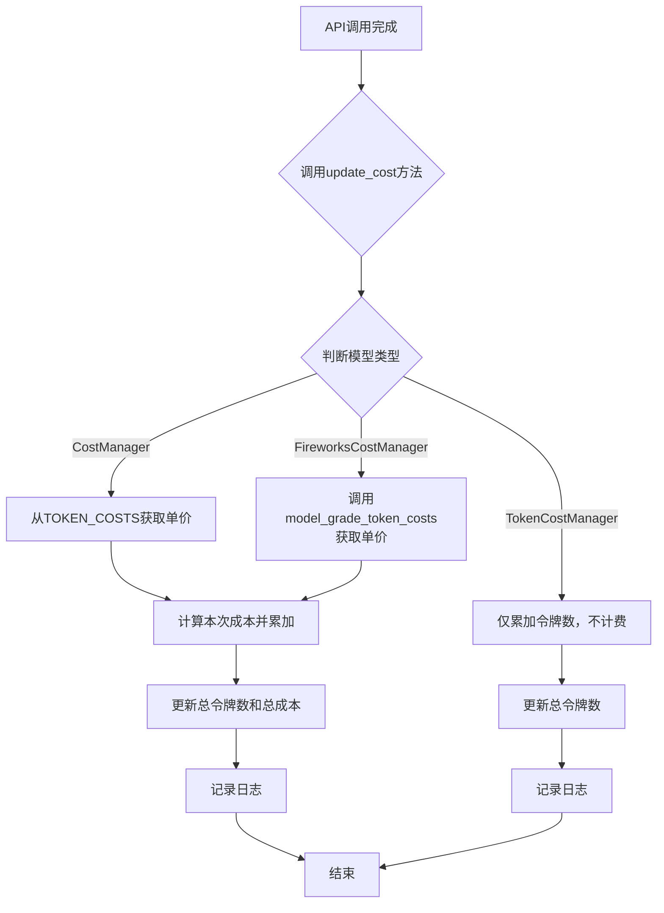
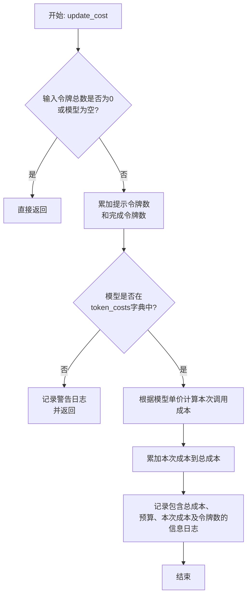
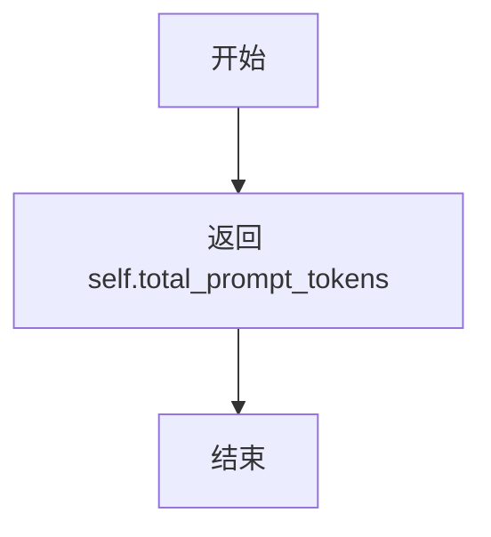
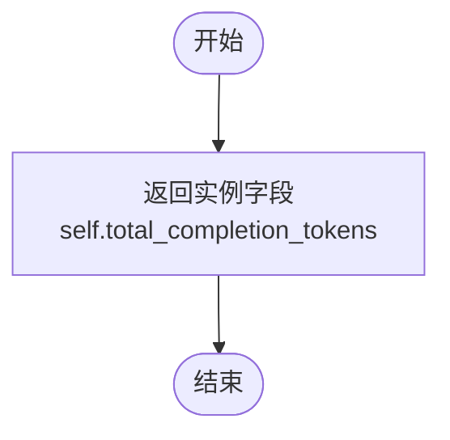
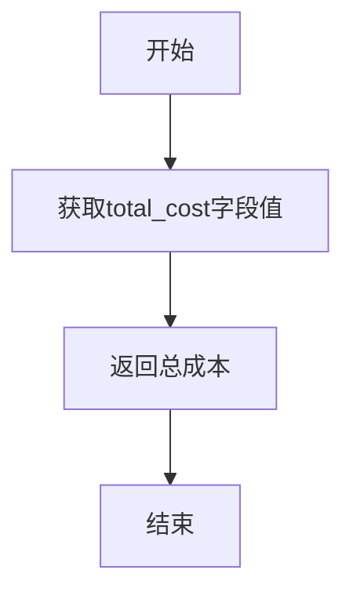
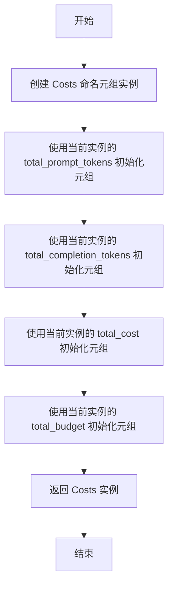
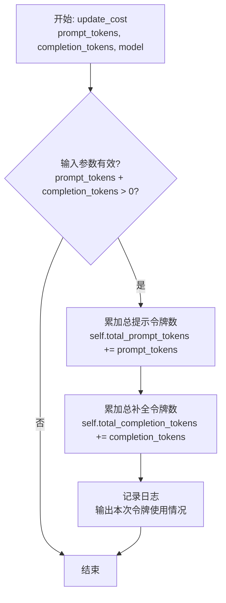

# `.\MetaGPT\metagpt\utils\cost_manager.py` 详细设计文档

该代码文件定义了一个用于管理和计算大语言模型（LLM）API调用成本的系统。核心功能是跟踪不同模型（如OpenAI、Fireworks等）的提示词（prompt）和补全词（completion）的令牌（token）使用量，并根据预设的每千/百万令牌成本计算总费用，同时支持设置预算上限。它通过一个基类 `CostManager` 和两个子类 `TokenCostManager`（用于免费的自托管模型）和 `FireworksCostManager`（用于Fireworks.ai平台）来实现不同计费策略。

## 整体流程



## 类结构

```
CostManager (Pydantic BaseModel)
├── TokenCostManager (用于免费自托管模型)
└── FireworksCostManager (用于Fireworks.ai平台)
```

## 全局变量及字段


### `logger`
    
用于记录日志信息的日志记录器实例，来自metagpt.logs模块。

类型：`logging.Logger`
    


### `FIREWORKS_GRADE_TOKEN_COSTS`
    
存储Fireworks AI不同模型等级（如16B、80B、mixtral-8x7b）的提示和完成token单价（每百万token）的字典。

类型：`dict[str, dict[str, float]]`
    


### `TOKEN_COSTS`
    
存储不同模型（如gpt-3.5-turbo, gpt-4）的提示和完成token单价（每千token）的字典，作为CostManager的默认token成本配置。

类型：`dict[str, dict[str, float]]`
    


### `Costs.total_prompt_tokens`
    
记录累计使用的提示token总数。

类型：`int`
    


### `Costs.total_completion_tokens`
    
记录累计使用的完成token总数。

类型：`int`
    


### `Costs.total_cost`
    
记录累计产生的总费用。

类型：`float`
    


### `Costs.total_budget`
    
记录累计的总预算。

类型：`float`
    


### `CostManager.total_prompt_tokens`
    
记录CostManager实例累计使用的提示token总数。

类型：`int`
    


### `CostManager.total_completion_tokens`
    
记录CostManager实例累计使用的完成token总数。

类型：`int`
    


### `CostManager.total_budget`
    
记录CostManager实例管理的总预算金额。

类型：`float`
    


### `CostManager.max_budget`
    
记录CostManager实例允许的最大预算上限，用于成本控制。

类型：`float`
    


### `CostManager.total_cost`
    
记录CostManager实例累计产生的总费用。

类型：`float`
    


### `CostManager.token_costs`
    
存储不同模型对应的提示和完成token单价（每千token）的字典，用于计算每次API调用的费用。

类型：`dict[str, dict[str, float]]`
    
    

## 全局函数及方法


### `CostManager.update_cost`

更新总成本、提示令牌数和完成令牌数。根据给定的模型和令牌使用量计算当前调用的成本，并累加到总成本中，同时更新总提示令牌数和总完成令牌数。如果模型不在预定义的令牌成本字典中，会记录警告日志。

参数：

- `prompt_tokens`：`int`，提示中使用的令牌数量。
- `completion_tokens`：`int`，完成中使用的令牌数量。
- `model`：`str`，用于API调用的模型名称。

返回值：`None`，此方法不返回任何值，仅更新对象内部状态。

#### 流程图



#### 带注释源码

```python
def update_cost(self, prompt_tokens, completion_tokens, model):
    """
    Update the total cost, prompt tokens, and completion tokens.

    Args:
    prompt_tokens (int): The number of tokens used in the prompt.
    completion_tokens (int): The number of tokens used in the completion.
    model (str): The model used for the API call.
    """
    # 1. 边界检查：如果令牌总数为0或模型未提供，则无需处理，直接返回。
    if prompt_tokens + completion_tokens == 0 or not model:
        return
    # 2. 更新累计令牌数。
    self.total_prompt_tokens += prompt_tokens
    self.total_completion_tokens += completion_tokens
    # 3. 检查模型是否在预定义的计价字典中，若不在则记录警告并返回。
    if model not in self.token_costs:
        logger.warning(f"Model {model} not found in TOKEN_COSTS.")
        return

    # 4. 计算本次API调用的成本。
    #    公式: (提示令牌数 * 提示单价 + 完成令牌数 * 完成单价) / 1000
    #    单价单位是每千令牌（美元），所以除以1000。
    cost = (
        prompt_tokens * self.token_costs[model]["prompt"]
        + completion_tokens * self.token_costs[model]["completion"]
    ) / 1000
    # 5. 更新总成本。
    self.total_cost += cost
    # 6. 记录详细的成本信息日志。
    logger.info(
        f"Total running cost: ${self.total_cost:.3f} | Max budget: ${self.max_budget:.3f} | "
        f"Current cost: ${cost:.3f}, prompt_tokens: {prompt_tokens}, completion_tokens: {completion_tokens}"
    )
```


### `CostManager.get_total_prompt_tokens`

该方法用于获取累计的提示词（prompt）令牌数量。它是`CostManager`类的一个简单访问器方法，直接返回内部记录的`total_prompt_tokens`字段值，该字段在每次调用`update_cost`方法时更新。

参数：
- 无

返回值：`int`，累计的提示词令牌总数。

#### 流程图



#### 带注释源码

```python
def get_total_prompt_tokens(self):
    """
    Get the total number of prompt tokens.

    Returns:
    int: The total number of prompt tokens.
    """
    # 直接返回类实例中记录的累计提示词令牌数
    return self.total_prompt_tokens
```


### `CostManager.get_total_completion_tokens`

该方法用于获取自 `CostManager` 实例创建以来，通过 `update_cost` 方法累计的所有完成令牌（completion tokens）的总数。这是一个简单的数据访问方法，用于查询成本统计中的完成令牌消耗量。

参数：
- 无

返回值：`int`，累计的完成令牌总数。

#### 流程图



#### 带注释源码

```python
    def get_total_completion_tokens(self):
        """
        Get the total number of completion tokens.

        Returns:
        int: The total number of completion tokens.
        """
        # 直接返回类实例中记录的完成令牌总数
        return self.total_completion_tokens
```


### `CostManager.get_total_cost`

该方法用于获取API调用的总成本。

参数：无

返回值：`float`，API调用的总成本

#### 流程图



#### 带注释源码

```python
def get_total_cost(self):
    """
    Get the total cost of API calls.

    Returns:
    float: The total cost of API calls.
    """
    return self.total_cost  # 直接返回实例的total_cost字段值
```

### `CostManager.get_costs`

该方法用于获取当前成本管理器实例中记录的所有成本信息，包括总提示词令牌数、总补全令牌数、总成本和总预算。

参数：无

返回值：`Costs`，一个包含四个字段的命名元组，分别是 `total_prompt_tokens`（总提示词令牌数）、`total_completion_tokens`（总补全令牌数）、`total_cost`（总成本）和 `total_budget`（总预算）。

#### 流程图



#### 带注释源码

```python
def get_costs(self) -> Costs:
    """Get all costs"""  # 方法描述：获取所有成本信息
    return Costs(self.total_prompt_tokens, self.total_completion_tokens, self.total_cost, self.total_budget)
    # 返回一个 Costs 命名元组，包含当前实例的四个成本相关属性
```


### `TokenCostManager.update_cost`

该方法用于更新自托管开源大语言模型的令牌使用统计。由于是自托管模型，不产生实际费用，因此该方法仅累加提示令牌和补全令牌的数量，并记录日志，不进行成本计算。

参数：

- `prompt_tokens`：`int`，本次API调用中提示部分消耗的令牌数量。
- `completion_tokens`：`int`，本次API调用中补全部分消耗的令牌数量。
- `model`：`str`，本次API调用所使用的模型名称。

返回值：`None`，该方法不返回任何值。

#### 流程图



#### 带注释源码

```python
def update_cost(self, prompt_tokens, completion_tokens, model):
    """
    Update the total cost, prompt tokens, and completion tokens.

    Args:
    prompt_tokens (int): The number of tokens used in the prompt.
    completion_tokens (int): The number of tokens used in the completion.
    model (str): The model used for the API call.
    """
    # 累加本次调用的提示令牌数到总提示令牌数
    self.total_prompt_tokens += prompt_tokens
    # 累加本次调用的补全令牌数到总补全令牌数
    self.total_completion_tokens += completion_tokens
    # 记录本次调用的令牌使用情况日志（由于是自托管模型，此处不计算成本）
    logger.info(f"prompt_tokens: {prompt_tokens}, completion_tokens: {completion_tokens}")
```


### `FireworksCostManager.model_grade_token_costs`

该方法根据传入的Fireworks AI模型名称，确定其对应的每百万token的计费标准（prompt和completion价格）。它通过解析模型名称中的参数量或匹配特定模型名称，从预定义的计费标准字典中查找对应的价格。

参数：
-  `model`：`str`，Fireworks AI的模型名称，例如 `'accounts/fireworks/models/mixtral-8x7b-instruct'` 或 `'accounts/fireworks/models/llama-v2-7b-chat'`。

返回值：`dict[str, float]`，一个包含 `'prompt'` 和 `'completion'` 为键的字典，其值为对应token类型的每百万token价格（美元）。

#### 流程图

```mermaid
flowchart TD
    A[开始: model_grade_token_costs(model)] --> B{模型名包含<br/>'mixtral-8x7b'?};
    B -- 是 --> C[token_costs = FIREWORKS_GRADE_TOKEN_COSTS['mixtral-8x7b']];
    B -- 否 --> D[调用_get_model_size(model)提取参数量];
    D --> E{参数量 size};
    E -- 0 < size <= 16 --> F[token_costs = FIREWORKS_GRADE_TOKEN_COSTS['16']];
    E -- 16 < size <= 80 --> G[token_costs = FIREWORKS_GRADE_TOKEN_COSTS['80']];
    E -- 其他情况<br/>(size <=0 或 >80) --> H[token_costs = FIREWORKS_GRADE_TOKEN_COSTS['-1']];
    C --> I[返回 token_costs];
    F --> I;
    G --> I;
    H --> I;
```

#### 带注释源码

```python
def model_grade_token_costs(self, model: str) -> dict[str, float]:
    # 内部辅助函数：从模型名称中提取参数量（以'b'为单位）
    def _get_model_size(model: str) -> float:
        # 使用正则表达式查找模型名中类似“-7b”或“-13.5b”这样的模式
        size = re.findall(".*-([0-9.]+)b", model)
        # 如果找到，转换为浮点数；否则返回-1表示未找到或格式不符
        size = float(size[0]) if len(size) > 0 else -1
        return size

    # 1. 检查是否为特定的 mixtral-8x7b 模型
    if "mixtral-8x7b" in model:
        # 直接从配置中获取该特定模型的计费标准
        token_costs = FIREWORKS_GRADE_TOKEN_COSTS["mixtral-8x7b"]
    else:
        # 2. 对于其他模型，根据参数量分级
        model_size = _get_model_size(model)
        if 0 < model_size <= 16:
            # 参数量 <= 16B 的模型（如 7B, 13B）
            token_costs = FIREWORKS_GRADE_TOKEN_COSTS["16"]
        elif 16 < model_size <= 80:
            # 参数量在 16B 到 80B 之间的模型
            token_costs = FIREWORKS_GRADE_TOKEN_COSTS["80"]
        else:
            # 参数量超出上述范围或无法解析的模型，使用默认/未知档位
            token_costs = FIREWORKS_GRADE_TOKEN_COSTS["-1"]
    # 返回找到的计费标准字典
    return token_costs
```


### `FireworksCostManager.update_cost`

该方法用于更新Fireworks AI模型调用的总成本、提示令牌数和完成令牌数。它根据模型名称确定对应的令牌单价，计算本次调用的成本并累加到总成本中，同时记录令牌使用情况。

参数：

- `prompt_tokens`：`int`，本次调用中提示部分使用的令牌数量
- `completion_tokens`：`int`，本次调用中完成部分使用的令牌数量
- `model`：`str`，使用的Fireworks AI模型名称

返回值：`None`，该方法不返回任何值，直接更新实例的状态

#### 流程图

```mermaid
flowchart TD
    A[开始] --> B{输入验证<br>prompt_tokens + completion_tokens > 0?}
    B -- 否 --> C[结束]
    B -- 是 --> D[更新令牌计数<br>total_prompt_tokens += prompt_tokens<br>total_completion_tokens += completion_tokens]
    D --> E[获取模型单价<br>调用model_grade_token_costs方法]
    E --> F[计算本次成本<br>cost = (prompt_tokens * prompt单价 + completion_tokens * completion单价) / 1000000]
    F --> G[更新总成本<br>total_cost += cost]
    G --> H[记录日志]
    H --> I[结束]
```

#### 带注释源码

```python
def update_cost(self, prompt_tokens: int, completion_tokens: int, model: str):
    """
    Refs to `https://app.fireworks.ai/pricing` **Developer pricing**
    Update the total cost, prompt tokens, and completion tokens.

    Args:
    prompt_tokens (int): The number of tokens used in the prompt.
    completion_tokens (int): The number of tokens used in the completion.
    model (str): The model used for the API call.
    """
    # 更新总提示令牌数和总完成令牌数
    self.total_prompt_tokens += prompt_tokens
    self.total_completion_tokens += completion_tokens

    # 根据模型名称获取对应的令牌单价（每百万令牌的价格）
    token_costs = self.model_grade_token_costs(model)
    # 计算本次调用的成本：成本 = (提示令牌数 * 提示单价 + 完成令牌数 * 完成单价) / 1000000
    cost = (prompt_tokens * token_costs["prompt"] + completion_tokens * token_costs["completion"]) / 1000000
    # 累加到总成本中
    self.total_cost += cost
    # 记录详细的成本日志
    logger.info(
        f"Total running cost: ${self.total_cost:.4f}, "
        f"Current cost: ${cost:.4f}, prompt_tokens: {prompt_tokens}, completion_tokens: {completion_tokens}"
    )
```

## 关键组件


### CostManager

核心成本管理组件，负责跟踪和计算使用不同AI模型API调用所产生的令牌消耗和费用。它维护了总提示令牌数、总完成令牌数、总成本、总预算和最大预算等状态，并提供了一个通用的`update_cost`方法来根据模型和令牌使用量更新这些统计信息。

### TokenCostManager

`CostManager`的一个特化子类，用于处理自托管开源大语言模型（Open LLM）的成本计算。由于自托管模型通常不产生直接费用，此组件重写了`update_cost`方法，仅记录令牌使用量而不计算财务成本。

### FireworksCostManager

`CostManager`的另一个特化子类，专门用于计算Fireworks.ai平台API调用的成本。它根据模型名称（如`mixtral-8x7b`或基于模型参数规模）动态确定对应的每百万令牌费率，并据此计算成本，实现了平台特定的定价策略。

### Costs NamedTuple

一个轻量级的数据结构，用于封装和返回成本相关的统计信息，包括总提示令牌数、总完成令牌数、总成本和总预算。它作为`CostManager.get_costs`方法的返回值，提供了一种不可变的、结构化的数据输出方式。

### 令牌成本配置（TOKEN_COSTS 与 FIREWORKS_GRADE_TOKEN_COSTS）

全局配置字典，定义了不同AI模型提供商（如OpenAI、Fireworks.ai）及其不同模型或模型规格下的提示令牌和完成令牌的单价。这些配置是成本计算的基础数据，支持系统的灵活性和可扩展性。


## 问题及建议


### 已知问题

-   **`CostManager.update_cost` 方法在模型未找到时静默返回**：当传入的 `model` 参数不在 `self.token_costs` 字典中时，方法会记录一条警告日志并直接返回，导致 `prompt_tokens` 和 `completion_tokens` 的计数被跳过，数据统计不完整。
-   **`FireworksCostManager.model_grade_token_costs` 方法存在潜在错误**：方法内部的正则表达式 `.*-([0-9.]+)b` 用于从模型名称中提取大小。如果模型名称格式不符合预期（例如不包含 `-Nb` 模式），`re.findall` 将返回空列表，导致 `size` 变量被赋值为 `-1`。这可能会错误地将模型归类到 `FIREWORKS_GRADE_TOKEN_COSTS["-1"]` 类别，而该类别可能代表“未知”或“默认”费率，可能与实际模型成本不匹配。
-   **`TokenCostManager` 的命名和职责存在歧义**：该类继承自 `CostManager` 但重写了 `update_cost` 方法，将成本计算置零，仅记录令牌数。其类名 `TokenCostManager` 容易让人误解为“令牌成本管理器”，而实际行为是“不计成本的成本管理器”。这违反了清晰命名原则，可能造成使用困惑。
-   **缺乏线程安全机制**：`CostManager` 及其子类的实例变量（如 `total_prompt_tokens`, `total_cost`）可能在多线程或多进程环境下被并发修改，导致数据不一致。当前代码没有使用锁或其他同步机制。
-   **`Costs` 命名元组包含未使用的字段**：`Costs` 结构体中包含了 `total_budget` 字段，但在 `CostManager.get_costs` 方法中，传入的是实例的 `total_budget` 属性。然而，在 `CostManager` 类中，`total_budget` 仅作为存储字段，并未在核心的成本计算逻辑（`update_cost`）中起到任何限制或校验作用，存在设计冗余。

### 优化建议

-   **增强 `update_cost` 方法的健壮性**：当 `model` 不在已知成本字典中时，除了记录警告，应考虑抛出一个明确的异常（如 `ValueError`）或设置一个默认的、较高的安全费率，并确保令牌计数正常进行，以保证监控数据的完整性。
-   **改进 `FireworksCostManager` 的模型识别逻辑**：应优化或替换 `_get_model_size` 函数中的正则表达式，使其能更鲁棒地处理不同的模型命名格式。或者，维护一个从模型名称到其规格（或直接到成本等级）的映射字典，作为回退机制，减少对字符串解析的依赖。
-   **重命名 `TokenCostManager` 类**：建议将 `TokenCostManager` 更名为更能反映其实际功能的名称，例如 `ZeroCostManager` 或 `FreeTierCostManager`，并在文档中明确说明其用于不计费的场景（如自托管模型）。
-   **引入线程安全支持**：如果该成本管理器需要在并发环境中使用，应考虑使用 `threading.Lock` 或 `multiprocessing.Lock` 来保护 `update_cost`、`get_costs` 等修改或读取状态的方法。或者，在文档中明确声明该类非线程安全，建议每个线程使用独立实例。
-   **重构 `Costs` 与 `total_budget` 字段的职责**：重新评估 `total_budget` 和 `max_budget` 字段的用途。如果旨在实现预算控制，应在 `update_cost` 方法中增加检查，当累计成本接近或超过预算时发出警告或停止服务。如果仅作记录，可考虑将其从核心的 `Costs` 汇报结构中移除，或明确其仅为信息字段。同时，确保 `Costs` 中返回的 `total_budget` 值与业务逻辑一致。
-   **考虑使用 `__slots__` 优化内存**：`CostManager` 作为可能被大量创建的基础数据类，可以考虑使用 `__slots__` 来减少内存占用并提高属性访问速度。
-   **增加单元测试覆盖**：为 `FireworksCostManager.model_grade_token_costs` 等包含复杂逻辑的方法编写详尽的单元测试，覆盖各种模型名称输入情况，确保成本计算规则正确无误。


## 其它


### 设计目标与约束

1. **设计目标**：
   - 提供统一的成本管理接口，支持不同AI模型服务提供商（如OpenAI、Fireworks AI、自托管开源模型）的token成本计算。
   - 实现用户级别的成本核算，能够跟踪和汇总每个用户的API调用消耗。
   - 提供成本预算管理功能，当总成本接近或超过预设预算时能够发出警告。
   - 代码结构清晰，易于扩展新的模型提供商或成本计算规则。

2. **设计约束**：
   - 必须与现有的`metagpt`项目中的`TOKEN_COSTS`和`FIREWORKS_GRADE_TOKEN_COSTS`全局配置字典兼容。
   - 成本计算逻辑需要处理模型名称未在配置中找到的边缘情况。
   - 日志输出格式需保持一致性，便于监控和分析。
   - 继承自`pydantic.BaseModel`，以利用其数据验证和序列化功能。

### 错误处理与异常设计

1. **错误处理策略**：
   - **静默处理**：在`CostManager.update_cost`方法中，当`prompt_tokens + completion_tokens == 0`或`model`为空时，方法直接返回，不进行任何操作。这是一种防御性编程，避免无效数据污染统计。
   - **警告日志**：当传入的`model`参数不在预定义的`token_costs`字典中时，记录一条警告日志(`logger.warning`)，但程序继续执行，不会抛出异常中断流程。这保证了系统的鲁棒性。
   - **默认值处理**：在`FireworksCostManager.model_grade_token_costs`方法中，如果无法从模型名称中解析出大小或不属于已知类别，则返回`FIREWORKS_GRADE_TOKEN_COSTS["-1"]`作为默认成本配置。

2. **潜在的异常点**：
   - `FireworksCostManager.model_grade_token_costs`方法中的正则表达式匹配(`re.findall`)可能失败，导致`size`列表为空，后续`float(size[0])`会引发`IndexError`。当前代码通过`if len(size) > 0`进行了防护。
   - 外部依赖的`TOKEN_COSTS`和`FIREWORKS_GRADE_TOKEN_COSTS`配置字典如果结构不正确或缺失关键键，可能导致`KeyError`。

### 数据流与状态机

1. **核心数据流**：
   - **输入**：`prompt_tokens`（整数），`completion_tokens`（整数），`model`（字符串）。
   - **处理**：
     - `CostManager`及其子类的`update_cost`方法是核心。它接收输入，根据`model`查找对应的token单价，计算本次调用成本，并累加到实例的`total_cost`、`total_prompt_tokens`、`total_completion_tokens`属性中。
     - `FireworksCostManager`重写了成本计算逻辑，使用不同的单价表和计算方式（每百万token计费）。
     - `TokenCostManager`重写了`update_cost`，仅累加token数量，不计算成本（模拟免费模型）。
   - **输出/状态更新**：
     - 内部状态：`total_prompt_tokens`, `total_completion_tokens`, `total_cost`被更新。
     - 日志输出：每次调用`update_cost`都会记录当前成本和累计成本。
     - 数据获取：通过`get_costs()`方法返回一个不可变的`Costs`命名元组，封装当前所有成本统计信息。

2. **状态机（简化）**：
   - **状态**：`CostManager`实例的属性构成了其状态，主要是几个累计值。
   - **转移**：每次调用`update_cost`都是一次状态转移，根据输入参数和当前`token_costs`配置，确定性地更新状态。
   - 没有复杂的多状态转换，是一个简单的累加器模型。

### 外部依赖与接口契约

1. **外部依赖**：
   - `pydantic.BaseModel`：用于类定义，提供字段类型验证和序列化能力。
   - `metagpt.logs.logger`：项目内部的日志记录器，用于输出信息性和警告性日志。
   - `metagpt.utils.token_counter.TOKEN_COSTS`：一个全局字典，预期结构为`{model_name: {"prompt": float, "completion": float}}`，存储OpenAI等模型的标准token单价（每千token）。
   - `metagpt.utils.token_counter.FIREWORKS_GRADE_TOKEN_COSTS`：一个全局字典，存储Fireworks AI模型按规格分级的token单价（每百万token）。预期结构为`{grade: {"prompt": float, "completion": float}}`，其中`grade`如`"16"`, `"80"`, `"mixtral-8x7b"`。

2. **接口契约**：
   - **`CostManager`类**：
     - **构造函数**：接受可选参数初始化各项累计值和预算。
     - **`update_cost(prompt_tokens: int, completion_tokens: int, model: str) -> None`**：核心方法，调用者需提供有效的token数和模型标识。它负责更新内部状态和记录日志。
     - **`get_costs() -> Costs`**：返回当前所有统计信息的快照。
     - 其他getter方法（如`get_total_cost`）提供了获取特定统计值的途径。
   - **子类**：`TokenCostManager`和`FireworksCostManager`继承了`CostManager`并重写了`update_cost`方法，但保持了相同的方法签名，遵循了里氏替换原则，客户端代码可以透明使用。
   - **`Costs`命名元组**：作为`get_costs`方法的返回值，提供了一个清晰、不可变的数据结构，包含`total_prompt_tokens`, `total_completion_tokens`, `total_cost`, `total_budget`四个字段。

    