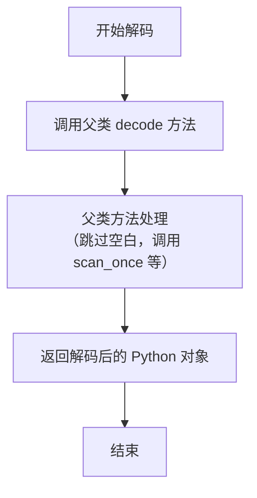

# `.\MetaGPT\metagpt\utils\custom_decoder.py` 详细设计文档

该文件实现了一个自定义的 JSON 解码器，扩展了 Python 标准库的 `json.JSONDecoder`。核心功能是支持单引号字符串和三引号字符串（`'''` 和 `"""`）作为有效的 JSON 字符串分隔符，同时保持了与标准 JSON 解析的兼容性。它通过重写扫描器（`scan_once`）、字符串解析（`scanstring`）和对象解析（`JSONObject`）等底层函数来实现这些扩展。

## 整体流程

```mermaid
graph TD
    A[调用 CustomDecoder.decode(s)] --> B[调用父类 JSONDecoder.decode]
    B --> C[内部调用 scan_once 进行词法分析]
    C --> D{识别下一个字符}
    D -- '"' 或 "'" --> E[调用 parse_string (py_scanstring)]
    D -- '{' --> F[调用 parse_object (JSONObject)]
    D -- '[' --> G[调用 parse_array]
    D -- 'n', 't', 'f' --> H[解析 null, true, false]
    D -- 数字 --> I[调用 match_number 解析数字]
    D -- 'N', 'I', '-' --> J[解析 NaN, Infinity]
    E --> K{是否为三引号?}
    K -- 是 --> L[使用三引号正则匹配块]
    K -- 否 --> M[使用单/双引号正则匹配块]
    L & M --> N[循环: 匹配内容与终止符]
    N --> O{终止符类型?}
    O -- 引号 --> P[字符串结束]
    O -- 反斜杠 \\ --> Q[处理转义序列]
    O -- 控制字符 --> R{strict 模式?}
    R -- 是 --> S[抛出 JSONDecodeError]
    R -- 否 --> T[作为字面量追加]
    Q --> U{是 \\u 转义?}
    U -- 是 --> V[调用 _decode_uXXXX 解码 Unicode]
    U -- 否 --> W[从 BACKSLASH 表查找]
    F --> X[解析键值对]
    X --> Y[使用 scan_once 解析值]
    Y --> Z[收集到 pairs 列表]
    Z --> AA{遇到 '}' ?}
    AA -- 否 --> AB{遇到 ',' ?}
    AB -- 是 --> X
    AB -- 否 --> AC[抛出 JSONDecodeError]
    AA -- 是 --> AD[应用 object_hook/object_pairs_hook]
    P & V & W & H & I & J & AD --> AE[返回解析结果与新索引]
    AE --> C
    C --> AF[所有内容解析完毕]
    AF --> AG[返回最终 Python 对象]
```

## 类结构

```
CustomDecoder (继承自 json.JSONDecoder)
├── 字段: parse_object, parse_string, scan_once
├── 方法: __init__, decode
└── 依赖的全局函数
    ├── py_make_scanner
    ├── JSONObject
    └── py_scanstring (别名 scanstring)
```

## 全局变量及字段


### `NUMBER_RE`
    
用于匹配JSON数字（整数、浮点数、科学计数法）的正则表达式模式对象。

类型：`re.Pattern`
    


### `FLAGS`
    
正则表达式编译标志的组合，包含re.VERBOSE、re.MULTILINE和re.DOTALL，用于定义正则表达式的匹配行为。

类型：`int`
    


### `STRINGCHUNK`
    
用于匹配双引号字符串内容的正则表达式模式对象，用于扫描和解析JSON字符串。

类型：`re.Pattern`
    


### `STRINGCHUNK_SINGLEQUOTE`
    
用于匹配单引号字符串内容的正则表达式模式对象，用于扫描和解析JSON字符串。

类型：`re.Pattern`
    


### `STRINGCHUNK_TRIPLE_DOUBLE_QUOTE`
    
用于匹配三双引号字符串内容的正则表达式模式对象，用于扫描和解析JSON字符串。

类型：`re.Pattern`
    


### `STRINGCHUNK_TRIPLE_SINGLEQUOTE`
    
用于匹配三单引号字符串内容的正则表达式模式对象，用于扫描和解析JSON字符串。

类型：`re.Pattern`
    


### `BACKSLASH`
    
转义字符映射字典，将JSON转义序列（如\n, \t）映射到对应的Python字符。

类型：`dict`
    


### `WHITESPACE`
    
用于匹配JSON中空白字符（空格、制表符、换行符、回车符）的正则表达式模式对象。

类型：`re.Pattern`
    


### `WHITESPACE_STR`
    
包含所有JSON空白字符的字符串，用于快速检查字符是否为空白。

类型：`str`
    


### `CustomDecoder.parse_object`
    
指向JSONObject函数的引用，用于解析JSON对象（字典）。

类型：`function`
    


### `CustomDecoder.parse_string`
    
指向py_scanstring函数的引用，用于解析JSON字符串（包括单引号和三引号变体）。

类型：`function`
    


### `CustomDecoder.scan_once`
    
指向由py_make_scanner生成的扫描函数的引用，用于迭代解析JSON值。

类型：`function`
    
    

## 全局函数及方法


### `py_make_scanner`

`py_make_scanner` 是一个工厂函数，用于创建 JSON 解码器的核心扫描函数 `scan_once`。它通过闭包捕获解码器上下文（如 `parse_object`, `parse_string`, `strict` 等配置），并返回一个能够根据输入字符串的当前位置识别并解析下一个 JSON 值（如对象、数组、字符串、数字、布尔值、`null` 等）的函数。该函数是 Python 标准库 `json` 模块中 C 语言实现的 `make_scanner` 的纯 Python 替代实现。

参数：

-   `context`：`object`，一个包含 JSON 解码器配置和方法的上下文对象。该对象应至少具有以下属性：`parse_object`, `parse_array`, `parse_string`, `strict`, `parse_float`, `parse_int`, `parse_constant`, `object_hook`, `object_pairs_hook`, `memo`。

返回值：`function`，返回一个名为 `scan_once` 的函数。该函数接受一个字符串和一个起始索引，返回一个元组 `(parsed_value, new_index)`，其中 `parsed_value` 是解析出的 JSON 值，`new_index` 是解析后字符串中的新位置索引。

#### 流程图

```mermaid
flowchart TD
    A[py_make_scanner(context)] --> B[捕获上下文变量<br>parse_object, parse_string, strict等]
    B --> C[定义内部函数 _scan_once]
    C --> D{检查索引处字符 nextchar}
    D -- 引号 ' 或 " --> E[调用 parse_string 解析字符串]
    D -- { --> F[调用 parse_object 解析对象]
    D -- [ --> G[调用 parse_array 解析数组]
    D -- n 且后续为 "null" --> H[返回 None 和新索引]
    D -- t 且后续为 "true" --> I[返回 True 和新索引]
    D -- f 且后续为 "false" --> J[返回 False 和新索引]
    D -- 数字或 - --> K[使用正则匹配数字]
    K --> L{匹配成功?}
    L -- 是 --> M[根据是否有小数/指数部分<br>调用 parse_float 或 parse_int]
    L -- 否 --> N{检查特殊常量<br>NaN, Infinity, -Infinity}
    N -- 匹配 --> O[调用 parse_constant]
    N -- 不匹配 --> P[抛出 StopIteration 异常]
    D -- 其他字符 --> P
    E & F & G & H & I & J & M & O --> Q[返回 (解析结果, 新索引)]
    P --> R[异常终止流程]
    C --> S[定义内部函数 scan_once]
    S --> T[调用 _scan_once]
    T --> U{是否发生异常?}
    U -- 是 --> V[抛出异常]
    U -- 否 --> W[清空 memo 缓存]
    W --> X[返回 _scan_once 的结果]
    A --> Y[返回 scan_once 函数]
```

#### 带注释源码

```python
def py_make_scanner(context):
    # 从上下文对象中捕获解码所需的所有函数和配置参数，形成闭包。
    # 这些变量在返回的 `scan_once` 函数及其内部函数 `_scan_once` 中可用。
    parse_object = context.parse_object  # 解析JSON对象的函数
    parse_array = context.parse_array    # 解析JSON数组的函数
    parse_string = context.parse_string  # 解析JSON字符串的函数
    match_number = NUMBER_RE.match       # 匹配数字的正则表达式方法
    strict = context.strict              # 是否启用严格模式（如控制字符检查）
    parse_float = context.parse_float    # 解析浮点数的函数（默认float）
    parse_int = context.parse_int        # 解析整数的函数（默认int）
    parse_constant = context.parse_constant # 解析常量（NaN, Infinity）的函数
    object_hook = context.object_hook    # 对象解码后的钩子函数
    object_pairs_hook = context.object_pairs_hook # 对象解码为键值对列表后的钩子函数
    memo = context.memo                  # 用于缓存字符串键的字典，优化性能

    def _scan_once(string, idx):
        """内部扫描函数，负责识别并解析从idx开始的第一个完整JSON值。"""
        try:
            # 获取当前索引位置的字符
            nextchar = string[idx]
        except IndexError:
            # 如果索引超出字符串范围，抛出StopIteration，其value属性为当前索引
            raise StopIteration(idx) from None

        # 根据当前字符判断JSON值的类型，并调用相应的解析函数
        if nextchar in ("'", '"'):
            # 处理字符串
            # 检查是否为三引号字符串（如 `"""` 或 `'''`）
            if idx + 2 < len(string) and string[idx + 1] == nextchar and string[idx + 2] == nextchar:
                # 是三引号，跳过开头的三个引号字符进行解析
                return parse_string(string, idx + 3, strict, delimiter=nextchar * 3)
            else:
                # 是单引号或双引号，跳过一个引号字符进行解析
                return parse_string(string, idx + 1, strict, delimiter=nextchar)
        elif nextchar == "{":
            # 处理对象，调用parse_object，并传入必要的参数（包括递归调用自身的_scan_once）
            return parse_object((string, idx + 1), strict, _scan_once, object_hook, object_pairs_hook, memo)
        elif nextchar == "[":
            # 处理数组，调用parse_array
            return parse_array((string, idx + 1), _scan_once)
        elif nextchar == "n" and string[idx : idx + 4] == "null":
            # 处理null字面量
            return None, idx + 4
        elif nextchar == "t" and string[idx : idx + 4] == "true":
            # 处理true字面量
            return True, idx + 4
        elif nextchar == "f" and string[idx : idx + 5] == "false":
            # 处理false字面量
            return False, idx + 5

        # 尝试匹配数字
        m = match_number(string, idx)
        if m is not None:
            integer, frac, exp = m.groups()
            if frac or exp:
                # 有小数部分或指数部分，按浮点数解析
                res = parse_float(integer + (frac or "") + (exp or ""))
            else:
                # 没有小数和指数部分，按整数解析
                res = parse_int(integer)
            # 返回解析结果和正则匹配结束的位置
            return res, m.end()
        # 处理非标准JSON数字常量（来自JavaScript）
        elif nextchar == "N" and string[idx : idx + 3] == "NaN":
            return parse_constant("NaN"), idx + 3
        elif nextchar == "I" and string[idx : idx + 8] == "Infinity":
            return parse_constant("Infinity"), idx + 8
        elif nextchar == "-" and string[idx : idx + 9] == "-Infinity":
            return parse_constant("-Infinity"), idx + 9
        else:
            # 无法识别的字符，抛出StopIteration
            raise StopIteration(idx)

    def scan_once(string, idx):
        """对外暴露的扫描函数。在每次扫描后清空memo缓存。"""
        try:
            # 调用内部扫描函数进行实际解析
            return _scan_once(string, idx)
        finally:
            # 无论解析成功与否，最后都清空memo缓存。
            # memo用于在解析单个对象时缓存键字符串，避免重复创建。
            # 清空它确保了解析不同对象或数组元素时的独立性。
            memo.clear()

    # 返回最终构造好的扫描函数
    return scan_once
```


### `JSONObject`

`JSONObject` 函数是 JSON 解码器的核心组件，负责解析 JSON 字符串中的对象（即键值对集合）。它从给定的字符串和起始索引开始，逐个字符扫描，识别键和值，处理分隔符和空白字符，并最终根据提供的钩子函数（如 `object_hook` 或 `object_pairs_hook`）构建并返回解析后的 Python 对象（通常是字典）以及解析结束后的新索引位置。

参数：

- `s_and_end`：`tuple`，一个包含待解析字符串 `s` 和当前解析索引 `end` 的元组。
- `strict`：`bool`，如果为 `True`，则强制执行严格的 JSON 字符串解码规则（例如，禁止未转义的控制字符）；如果为 `False`，则允许字面控制字符。
- `scan_once`：`callable`，一个用于扫描和解析 JSON 值（如字符串、数字、数组、对象等）的回调函数。
- `object_hook`：`callable`，如果指定，此函数将在对象被解析为字典后被调用，其返回值将替代默认的字典。
- `object_pairs_hook`：`callable`，如果指定，此函数将在对象被解析为键值对列表后被调用，其返回值将替代默认的字典。
- `memo`：`dict`，可选，一个用于缓存字符串键以优化性能的字典。默认为 `None`。
- `_w`：`function`，一个用于匹配空白字符的正则表达式函数。默认为 `WHITESPACE.match`。
- `_ws`：`str`，一个包含空白字符（空格、制表符、换行符、回车符）的字符串。默认为 `WHITESPACE_STR`。

返回值：`tuple`，返回一个元组，包含解析后的对象（可能是字典或 `object_pairs_hook` 的返回值）和解析结束后在字符串中的新索引位置。

#### 流程图

```mermaid
flowchart TD
    A[开始: JSONObject(s_and_end, strict, ...)] --> B[解包 s_and_end 为 s, end<br>初始化 pairs 列表和 memo]
    B --> C{检查下一个字符 nextchar}
    C -->|nextchar 是空白| D[跳过空白，更新 end 和 nextchar]
    D --> C
    C -->|nextchar 是 '}'| E[处理空对象<br>应用 object_pairs_hook/object_hook]
    E --> F[返回 空对象, end+1]
    C -->|nextchar 不是 '"' 或 "'"| G[抛出 JSONDecodeError]
    C -->|nextchar 是 '"' 或 "'"| H[end += 1<br>进入主循环]
    
    H --> I[循环: 解析键值对]
    I --> J[调用 scanstring 解析键 key]
    J --> K[使用 memo 缓存键]
    K --> L{检查键后字符是否为 ':'}
    L -->|不是 ':'| M[跳过空白，再次检查]
    M -->|仍不是 ':'| N[抛出 JSONDecodeError]
    L -->|是 ':'| O[end += 1<br>跳过值前的空白]
    M -->|是 ':'| O
    O --> P[调用 scan_once 解析值 value]
    P --> Q[将 (key, value) 加入 pairs 列表]
    Q --> R[检查对象结束或下一个键]
    R -->|nextchar 是 '}'| S[跳出循环]
    R -->|nextchar 是 ','| T[end += 1<br>跳过空白，期待下一个键]
    T --> U{检查下一个字符是否为引号}
    U -->|是| I
    U -->|不是| V[抛出 JSONDecodeError]
    R -->|nextchar 是其他| V
    
    S --> W[循环结束]
    W --> X{检查 object_pairs_hook}
    X -->|存在| Y[调用 object_pairs_hook(pairs)]
    Y --> Z[返回 hook_result, end]
    X -->|不存在| AA[将 pairs 列表转为字典]
    AA --> BB{检查 object_hook}
    BB -->|存在| CC[调用 object_hook(dict_pairs)]
    CC --> Z
    BB -->|不存在| DD[返回 dict_pairs, end]
```

#### 带注释源码

```python
def JSONObject(
    s_and_end, strict, scan_once, object_hook, object_pairs_hook, memo=None, _w=WHITESPACE.match, _ws=WHITESPACE_STR
):
    """Parse a JSON object from a string and return the parsed object.

    Args:
        s_and_end (tuple): A tuple containing the input string to parse and the current index within the string.
        strict (bool): If `True`, enforces strict JSON string decoding rules.
            If `False`, allows literal control characters in the string. Defaults to `True`.
        scan_once (callable): A function to scan and parse JSON values from the input string.
        object_hook (callable): A function that, if specified, will be called with the parsed object as a dictionary.
        object_pairs_hook (callable): A function that, if specified, will be called with the parsed object as a list of pairs.
        memo (dict, optional): A dictionary used to memoize string keys for optimization. Defaults to None.
        _w (function): A regular expression matching function for whitespace. Defaults to WHITESPACE.match.
        _ws (str): A string containing whitespace characters. Defaults to WHITESPACE_STR.

    Returns:
        tuple or dict: A tuple containing the parsed object and the index of the character in the input string
        after the end of the object.
    """
    # 1. 解包输入参数，获取字符串和起始索引
    s, end = s_and_end
    # 2. 初始化用于存储键值对的列表
    pairs = []
    pairs_append = pairs.append  # 优化：缓存 append 方法引用
    # 3. 处理 memo 参数，如果为 None 则初始化为空字典
    # Backwards compatibility
    if memo is None:
        memo = {}
    memo_get = memo.setdefault  # 优化：缓存 setdefault 方法引用
    # 4. 获取当前待解析的字符（对象应以 '{' 开头，但此函数在 '{' 之后被调用，所以期待的是键或 '}'）
    # Use a slice to prevent IndexError from being raised, the following
    # check will raise a more specific ValueError if the string is empty
    nextchar = s[end : end + 1]
    # Normally we expect nextchar == '"'
    # 5. 检查第一个有效字符。如果不是引号，可能是空白或直接结束。
    if nextchar != '"' and nextchar != "'":
        # 5a. 如果是空白字符，则跳过
        if nextchar in _ws:
            end = _w(s, end).end()
            nextchar = s[end : end + 1]
        # 5b. 如果跳过空白后是 '}'，说明是空对象
        # Trivial empty object
        if nextchar == "}":
            # 根据是否有 object_pairs_hook 决定返回值
            if object_pairs_hook is not None:
                result = object_pairs_hook(pairs)
                return result, end + 1
            pairs = {}
            if object_hook is not None:
                pairs = object_hook(pairs)
            return pairs, end + 1
        # 5c. 如果不是引号也不是结束符，则报错
        elif nextchar != '"':
            raise JSONDecodeError("Expecting property name enclosed in double quotes", s, end)
    # 6. 第一个字符是引号，将索引移动到引号之后，开始解析键
    end += 1
    # 7. 主循环：解析键值对
    while True:
        # 7a. 解析键（字符串）。支持单引号、双引号及其三引号变体。
        if end + 1 < len(s) and s[end] == nextchar and s[end + 1] == nextchar:
            # Handle the case where the next two characters are the same as nextchar
            key, end = scanstring(s, end + 2, strict, delimiter=nextchar * 3)  # triple quote
        else:
            # Handle the case where the next two characters are not the same as nextchar
            key, end = scanstring(s, end, strict, delimiter=nextchar)
        # 7b. 使用 memo 字典缓存键字符串，避免相同字符串重复创建。
        key = memo_get(key, key)
        # 7c. 查找键后的 ':' 分隔符。优化常见情况（": " 或 ":"）。
        # To skip some function call overhead we optimize the fast paths where
        # the JSON key separator is ": " or just ":".
        if s[end : end + 1] != ":":
            end = _w(s, end).end()
            if s[end : end + 1] != ":":
                raise JSONDecodeError("Expecting ':' delimiter", s, end)
        end += 1  # 跳过 ':'

        # 7d. 跳过值前的空白字符（可选）。
        try:
            if s[end] in _ws:
                end += 1
                if s[end] in _ws:
                    end = _w(s, end + 1).end()
        except IndexError:
            pass  # 如果已到字符串末尾，IndexError 是正常的

        # 7e. 调用 scan_once 解析值（可以是任何 JSON 类型）。
        try:
            value, end = scan_once(s, end)
        except StopIteration as err:
            raise JSONDecodeError("Expecting value", s, err.value) from None
        # 7f. 将解析出的键值对添加到列表中。
        pairs_append((key, value))
        # 7g. 查看当前字符，判断对象是否结束或是否有下一个键值对。
        try:
            nextchar = s[end]
            if nextchar in _ws:
                end = _w(s, end + 1).end()
                nextchar = s[end]
        except IndexError:
            nextchar = ""  # 字符串结束
        end += 1  # 移动到下一个待检查的字符

        # 7h. 如果遇到 '}'，对象解析结束。
        if nextchar == "}":
            break
        # 7i. 如果遇到 ','，说明还有更多键值对，继续循环。
        elif nextchar != ",":
            raise JSONDecodeError("Expecting ',' delimiter", s, end - 1)
        # 7j. 处理 ',' 之后的部分：跳过空白，期待下一个键（必须以引号开始）。
        end = _w(s, end).end()
        nextchar = s[end : end + 1]
        end += 1
        if nextchar != '"':
            raise JSONDecodeError("Expecting property name enclosed in double quotes", s, end - 1)
    # 8. 循环结束，所有键值对已解析完毕。
    # 9. 根据提供的钩子函数决定最终返回值。
    if object_pairs_hook is not None:
        result = object_pairs_hook(pairs)
        return result, end
    # 10. 如果没有 object_pairs_hook，则将列表转换为字典。
    pairs = dict(pairs)
    if object_hook is not None:
        pairs = object_hook(pairs)
    # 11. 返回解析后的对象和新的索引位置。
    return pairs, end
```

### `py_scanstring`

`py_scanstring` 函数是 JSON 解码器的核心组件，负责从输入字符串中扫描并解码 JSON 字符串字面量。它处理转义序列（包括 Unicode 转义）、控制字符验证，并支持单引号、双引号以及它们的三引号变体作为字符串分隔符。

参数：

-   `s`：`str`，包含待解码 JSON 字符串的输入字符串。
-   `end`：`int`，输入字符串 `s` 中起始引号之后字符的索引。
-   `strict`：`bool`，如果为 `True`，则强制执行严格的 JSON 字符串解码规则（例如，禁止字面控制字符）。如果为 `False`，则允许字面控制字符。默认为 `True`。
-   `_b`：`dict`，包含标准 JSON 转义序列（如 `\n`, `\t`）映射的字典。默认为预定义的 `BACKSLASH` 字典。
-   `_m`：`function`，用于匹配字符串块（内容与终止符）的正则表达式匹配函数。默认为 `STRINGCHUNK.match`。
-   `delimiter`：`str`，用于定义 JSON 字符串开始和结束的字符串分隔符。可以是 `"`、`'`、`\"\"\"` 或 `'''`。默认为 `"`。

返回值：`tuple`，一个包含解码后的字符串和输入字符串 `s` 中结束引号之后字符索引的元组。

#### 流程图

```mermaid
flowchart TD
    A[开始: py_scanstring(s, end, ...)] --> B[初始化: chunks = [], begin = end - 1]
    B --> C{根据 delimiter 选择匹配函数 _m}
    C --> D[循环: 使用 _m 匹配字符串块]
    D --> E{匹配成功?}
    E -- 否 --> F[抛出 JSONDecodeError<br>“Unterminated string”]
    E -- 是 --> G[更新 end = chunk.end()<br>获取 content, terminator]
    G --> H{content 非空?}
    H -- 是 --> I[chunks.append(content)]
    H -- 否 --> J{terminator == delimiter?}
    J -- 是 --> K[循环结束]
    J -- 否 --> L{terminator == '\\'?}
    L -- 否 --> M{strict == True?}
    M -- 是 --> N[抛出 JSONDecodeError<br>“Invalid control character”]
    M -- 否 --> O[chunks.append(terminator)]
    O --> D
    L -- 是 --> P[获取转义字符 esc = s[end]]
    P --> Q{esc == 'u'?<br>Unicode转义?}
    Q -- 否 --> R[从 _b 查找 esc<br>映射为 char]
    R --> S{映射成功?}
    S -- 否 --> T[抛出 JSONDecodeError<br>“Invalid \\escape”]
    S -- 是 --> U[end += 1]
    U --> V[chunks.append(char)]
    V --> D
    Q -- 是 --> W[调用 _decode_uXXXX(s, end)<br>解码4位十六进制为 uni]
    W --> X[end += 5]
    X --> Y{uni 是 UTF-16 代理对的高半部分?<br>且后跟 '\\u'?}
    Y -- 是 --> Z[解码低半部分 uni2]
    Z --> AA[组合为完整 Unicode 码点<br>char = chr(组合后码点)]
    AA --> AB[end += 6]
    AB --> V
    Y -- 否 --> AC[char = chr(uni)]
    AC --> V
    K --> AD[返回 ''.join(chunks), end]
```

#### 带注释源码

```python
def py_scanstring(s, end, strict=True, _b=BACKSLASH, _m=STRINGCHUNK.match, delimiter='"'):
    """Scan the string s for a JSON string.

    Args:
        s (str): The input string to be scanned for a JSON string.
        end (int): The index of the character in `s` after the quote that started the JSON string.
        strict (bool): If `True`, enforces strict JSON string decoding rules.
            If `False`, allows literal control characters in the string. Defaults to `True`.
        _b (dict): A dictionary containing escape sequence mappings.
        _m (function): A regular expression matching function for string chunks.
        delimiter (str): The string delimiter used to define the start and end of the JSON string.
            Can be one of: '"', "'", '\"""', or "'''". Defaults to '"'.

    Returns:
        tuple: A tuple containing the decoded string and the index of the character in `s`
        after the end quote.
    """

    # 存储解码后字符串块的列表
    chunks = []
    _append = chunks.append
    # 记录字符串起始引号的位置，用于错误信息
    begin = end - 1
    # 根据分隔符选择对应的正则匹配函数
    if delimiter == '"':
        _m = STRINGCHUNK.match
    elif delimiter == "'":
        _m = STRINGCHUNK_SINGLEQUOTE.match
    elif delimiter == '"""':
        _m = STRINGCHUNK_TRIPLE_DOUBLE_QUOTE.match
    else:
        _m = STRINGCHUNK_TRIPLE_SINGLEQUOTE.match
    # 主循环：逐块匹配和处理字符串内容
    while 1:
        # 使用选定的正则表达式匹配下一个块
        chunk = _m(s, end)
        if chunk is None:
            # 未找到匹配项，意味着字符串未正确终止
            raise JSONDecodeError("Unterminated string starting at", s, begin)
        # 更新索引到当前匹配块的结束位置
        end = chunk.end()
        # 分组：content 是未转义的文本，terminator 是终止符（引号、控制字符或反斜杠）
        content, terminator = chunk.groups()
        # 如果 content 非空，将其添加到块列表中
        if content:
            _append(content)
        # 检查终止符类型
        if terminator == delimiter:
            # 遇到结束引号，字符串扫描完成
            break
        elif terminator != "\\":
            # 终止符既不是结束引号也不是转义符，它是一个字面控制字符
            if strict:
                # 严格模式下，抛出错误
                msg = "Invalid control character {0!r} at".format(terminator)
                raise JSONDecodeError(msg, s, end)
            else:
                # 非严格模式下，将其作为普通字符处理
                _append(terminator)
                continue
        # 处理转义序列：terminator 是 '\\'
        try:
            # 获取转义字符
            esc = s[end]
        except IndexError:
            # 字符串在转义序列中途结束
            raise JSONDecodeError("Unterminated string starting at", s, begin) from None
        # 处理非Unicode转义（如 \n, \t, \" 等）
        if esc != "u":
            try:
                # 从转义映射表中查找对应的字符
                char = _b[esc]
            except KeyError:
                # 无效的转义序列
                msg = "Invalid \\escape: {0!r}".format(esc)
                raise JSONDecodeError(msg, s, end)
            # 成功解码，索引前进1位（跳过转义字符）
            end += 1
        else:
            # 处理Unicode转义序列：\uXXXX
            # 调用辅助函数解码4位十六进制数为整数
            uni = _decode_uXXXX(s, end)
            # 索引前进5位（跳过 \u 和4位十六进制数）
            end += 5
            # 检查解码出的整数是否是UTF-16代理对的高半部分（High Surrogate）
            # 并且后面紧跟另一个Unicode转义序列
            if 0xD800 <= uni <= 0xDBFF and s[end : end + 2] == "\\u":
                # 解码低半部分（Low Surrogate）
                uni2 = _decode_uXXXX(s, end + 1)
                # 检查是否是有效的低半部分
                if 0xDC00 <= uni2 <= 0xDFFF:
                    # 组合高半部分和低半部分，计算完整的Unicode码点
                    uni = 0x10000 + (((uni - 0xD800) << 10) | (uni2 - 0xDC00))
                    # 索引再前进6位（跳过第二个 \u 和4位十六进制数）
                    end += 6
            # 将Unicode码点转换为字符
            char = chr(uni)
        # 将解码出的字符添加到块列表中
        _append(char)
    # 循环结束，将所有块连接成完整的字符串，并返回字符串和结束索引
    return "".join(chunks), end
```


### `py_scanstring` / `scanstring`

该函数是 JSON 解码器的核心组件，负责从输入字符串中扫描并解码一个 JSON 字符串字面量。它处理转义序列（如 `\n`, `\uXXXX`），支持单引号、双引号以及它们的三引号变体作为分隔符，并根据 `strict` 参数决定是否允许字面控制字符。

参数：

-  `s`：`str`，包含待解码 JSON 字符串的完整输入字符串。
-  `end`：`int`，输入字符串 `s` 中的索引，指向起始引号之后的一个字符。
-  `strict`：`bool`，如果为 `True`，则严格执行 JSON 规范，禁止未转义的控制字符；如果为 `False`，则允许它们。默认为 `True`。
-  `_b`：`dict`，包含基本转义序列（如 `\n`, `\t`）映射的字典。默认为预定义的 `BACKSLASH` 字典。
-  `_m`：`function`，用于匹配字符串块（内容+终止符）的正则表达式匹配函数。默认为 `STRINGCHUNK.match`。
-  `delimiter`：`str`，用于界定字符串开始和结束的引号字符。可以是 `"`、`'`、`"""` 或 `'''`。默认为 `"`。

返回值：`tuple`，一个包含两个元素的元组：第一个元素是解码后的 Python 字符串，第二个元素是输入字符串 `s` 中结束引号之后字符的索引。

#### 流程图

```mermaid
flowchart TD
    A[开始: py_scanstring(s, end, ...)] --> B[初始化: chunks列表, 根据delimiter选择_m]
    B --> C{循环: 使用_m匹配字符串块}
    C -- 匹配成功 --> D[提取内容content和终止符terminator]
    D --> E{terminator类型判断}
    E -- "是结束引号(delimiter)" --> F[循环结束]
    E -- "是反斜杠(\)" --> G[处理转义序列]
    E -- "是控制字符(严格模式)" --> H[抛出JSONDecodeError]
    E -- "是控制字符(非严格模式)" --> I[将字符加入chunks]
    G --> J{转义字符类型判断}
    J -- "是'u'(Unicode转义)" --> K[调用_decode_uXXXX解码]
    K --> L[处理可能的UTF-16代理对]
    L --> M[将解码字符加入chunks]
    J -- "是其他字符" --> N[从_b字典查找映射]
    N --> O[将映射字符加入chunks]
    I --> C
    M --> C
    O --> C
    C -- 匹配失败(None) --> P[抛出JSONDecodeError<br>字符串未终止]
    F --> Q[将chunks连接成字符串并返回<br>及当前索引end]
```

#### 带注释源码

```python
def py_scanstring(s, end, strict=True, _b=BACKSLASH, _m=STRINGCHUNK.match, delimiter='"'):
    """Scan the string s for a JSON string.

    Args:
        s (str): The input string to be scanned for a JSON string.
        end (int): The index of the character in `s` after the quote that started the JSON string.
        strict (bool): If `True`, enforces strict JSON string decoding rules.
            If `False`, allows literal control characters in the string. Defaults to `True`.
        _b (dict): A dictionary containing escape sequence mappings.
        _m (function): A regular expression matching function for string chunks.
        delimiter (str): The string delimiter used to define the start and end of the JSON string.
            Can be one of: '"', "'", '\"""', or "'''". Defaults to '"'.

    Returns:
        tuple: A tuple containing the decoded string and the index of the character in `s`
        after the end quote.
    """

    # 用于收集字符串片段的列表
    chunks = []
    # 优化：将append方法本地化，避免每次循环中的属性查找
    _append = chunks.append
    # 记录字符串开始的引号位置，用于错误信息
    begin = end - 1
    # 根据指定的分隔符选择对应的正则表达式匹配函数
    if delimiter == '"':
        _m = STRINGCHUNK.match
    elif delimiter == "'":
        _m = STRINGCHUNK_SINGLEQUOTE.match
    elif delimiter == '"""':
        _m = STRINGCHUNK_TRIPLE_DOUBLE_QUOTE.match
    else:
        _m = STRINGCHUNK_TRIPLE_SINGLEQUOTE.match
    # 主循环：持续匹配字符串内容，直到遇到结束引号
    while 1:
        # 使用选定的正则表达式匹配函数查找下一个“块”
        # 一个块包含：普通内容 + 终止符（结束引号、控制字符或反斜杠）
        chunk = _m(s, end)
        # 如果匹配失败，说明字符串未正确终止
        if chunk is None:
            raise JSONDecodeError("Unterminated string starting at", s, begin)
        # 更新索引到当前匹配块的末尾
        end = chunk.end()
        # 将匹配结果分为两部分：普通字符串内容 和 终止符
        content, terminator = chunk.groups()
        # 如果存在未转义的普通内容，直接加入结果列表
        if content:
            _append(content)
        # 根据终止符的类型决定下一步操作
        # 情况1：终止符就是结束引号，字符串扫描完成
        if terminator == delimiter:
            break
        # 情况2：终止符是字面控制字符（非反斜杠）
        elif terminator != "\\":
            # 严格模式下，这是错误
            if strict:
                msg = "Invalid control character {0!r} at".format(terminator)
                raise JSONDecodeError(msg, s, end)
            # 非严格模式下，允许该字符，将其加入结果并继续循环
            else:
                _append(terminator)
                continue
        # 情况3：终止符是反斜杠，表示后面跟着一个转义序列
        try:
            # 获取转义字符
            esc = s[end]
        except IndexError:
            # 如果字符串在反斜杠后结束，也是未终止错误
            raise JSONDecodeError("Unterminated string starting at", s, begin) from None
        # 处理转义序列
        # 子情况3a：不是Unicode转义（\uXXXX）
        if esc != "u":
            try:
                # 从预定义的转义映射字典中查找对应的字符
                char = _b[esc]
            except KeyError:
                # 如果转义字符无效，抛出错误
                msg = "Invalid \\escape: {0!r}".format(esc)
                raise JSONDecodeError(msg, s, end)
            # 成功解码一个简单转义序列，索引前进1位
            end += 1
        # 子情况3b：是Unicode转义序列（\uXXXX）
        else:
            # 调用辅助函数解码4位十六进制数为Unicode码点
            uni = _decode_uXXXX(s, end)
            # 索引前进5位（\u + 4位十六进制数）
            end += 5
            # 处理UTF-16代理对：如果当前解码的码点在代理对高位范围内，
            # 并且后面紧跟着另一个Unicode转义序列
            if 0xD800 <= uni <= 0xDBFF and s[end : end + 2] == "\\u":
                # 解码第二个码点（低位代理）
                uni2 = _decode_uXXXX(s, end + 1)
                # 检查第二个码点是否在低位代理范围内
                if 0xDC00 <= uni2 <= 0xDFFF:
                    # 组合高位和低位代理，计算实际的Unicode码点
                    uni = 0x10000 + (((uni - 0xD800) << 10) | (uni2 - 0xDC00))
                    # 索引再前进6位（第二个\uXXXX）
                    end += 6
            # 将最终的Unicode码点转换为Python字符
            char = chr(uni)
        # 将解码得到的字符（无论是简单转义还是Unicode转义）加入结果列表
        _append(char)
    # 循环结束，将所有收集的字符串片段连接起来，并返回结果及当前索引
    return "".join(chunks), end
```


### `CustomDecoder.__init__`

该方法用于初始化一个自定义的 JSON 解码器 (`CustomDecoder`) 实例。它继承自 `json.JSONDecoder`，并重写了部分解析组件，以支持自定义的对象钩子、数值解析、常量解析以及更灵活的字符串解析（例如支持单引号和双引号字符串）。该方法通过调用父类的 `__init__` 方法完成基础初始化，然后替换默认的 `parse_object`、`parse_string` 和 `scan_once` 方法为自定义实现。

参数：

- `object_hook`：`Optional[Callable[[Dict[Any, Any]], Any]]`，可选参数，用于在解析 JSON 对象时调用的钩子函数，接收解析后的字典作为参数，返回自定义对象。
- `parse_float`：`Optional[Callable[[str], Any]]`，可选参数，用于解析 JSON 浮点数的自定义函数。
- `parse_int`：`Optional[Callable[[str], Any]]`，可选参数，用于解析 JSON 整数的自定义函数。
- `parse_constant`：`Optional[Callable[[str], Any]]`，可选参数，用于解析 JSON 常量（如 `NaN`、`Infinity`）的自定义函数。
- `strict`：`bool`，可选参数，默认为 `True`，表示是否启用严格的 JSON 字符串解析（禁止控制字符）。
- `object_pairs_hook`：`Optional[Callable[[List[Tuple[str, Any]]], Any]]`，可选参数，用于在解析 JSON 对象时调用的钩子函数，接收键值对列表作为参数，返回自定义对象。

返回值：`None`，该方法不返回任何值，仅用于初始化 `CustomDecoder` 实例。

#### 流程图

```mermaid
flowchart TD
    A[开始初始化 CustomDecoder] --> B[调用父类 JSONDecoder.__init__<br>传递所有参数]
    B --> C[设置 self.parse_object = JSONObject]
    C --> D[设置 self.parse_string = py_scanstring]
    D --> E[调用 py_make_scanner(self) 生成 scan_once 函数]
    E --> F[设置 self.scan_once = 生成的函数]
    F --> G[初始化完成]
```

#### 带注释源码

```python
def __init__(
    self,
    *,
    object_hook=None,
    parse_float=None,
    parse_int=None,
    parse_constant=None,
    strict=True,
    object_pairs_hook=None
):
    # 调用父类 json.JSONDecoder 的初始化方法，传递所有参数以保持基础功能
    super().__init__(
        object_hook=object_hook,
        parse_float=parse_float,
        parse_int=parse_int,
        parse_constant=parse_constant,
        strict=strict,
        object_pairs_hook=object_pairs_hook,
    )
    # 将默认的对象解析器替换为自定义的 JSONObject 函数
    self.parse_object = JSONObject
    # 将默认的字符串解析器替换为自定义的 py_scanstring 函数
    self.parse_string = py_scanstring
    # 使用 py_make_scanner 函数生成一个扫描器，并将其赋值给实例的 scan_once 属性
    # 该扫描器将使用当前实例（self）作为上下文，从而能够访问上面设置的自定义解析器
    self.scan_once = py_make_scanner(self)
```

### `CustomDecoder.decode`

该方法重写了标准库 `json.JSONDecoder` 的 `decode` 方法，用于解码一个 JSON 格式的字符串。它继承了父类的所有配置（如 `object_hook`, `parse_float` 等），并使用了自定义的扫描器 (`scan_once`) 和对象解析器 (`parse_object`)，以支持扩展的 JSON 语法（如单引号字符串和三引号字符串）。其核心功能是解析输入字符串，跳过前导空白字符，然后调用内部扫描器递归地构建 Python 对象。

参数：
-  `s`：`str`，需要解码的 JSON 格式字符串。
-  `_w`：`function`，一个用于匹配空白字符的正则表达式函数，默认为 `json.decoder.WHITESPACE.match`。

返回值：`Any`，解码后对应的 Python 对象（如 `dict`, `list`, `str`, `int`, `float`, `bool`, `None`）。

#### 流程图



#### 带注释源码

```python
    def decode(self, s, _w=json.decoder.WHITESPACE.match):
        # 直接调用父类 json.JSONDecoder 的 decode 方法。
        # 父类的 decode 方法会处理前导空白字符，并调用 self.scan_once 来递归解析 JSON 字符串。
        # 由于在 __init__ 中已将 self.scan_once 和 self.parse_object 等替换为自定义版本，
        # 因此此调用实际上使用了自定义的解析逻辑。
        return super().decode(s)
```

## 关键组件

### 自定义JSON解码器 (CustomDecoder)

一个扩展了Python标准库`json.JSONDecoder`的类，用于提供自定义的JSON解析行为，特别是支持单引号和三引号字符串。

### 扫描器工厂函数 (py_make_scanner)

一个工厂函数，用于创建`scan_once`函数。该函数是JSON解码器的核心扫描器，负责识别并解析JSON字符串中的下一个有效令牌（如对象、数组、字符串、数字、布尔值、null等），并支持单引号和三引号字符串的识别。

### JSON对象解析器 (JSONObject)

一个用于解析JSON对象的函数。它处理对象键值对的扫描、分隔符检查，并支持通过`object_hook`和`object_pairs_hook`进行自定义对象构建。它包含了处理单引号和三引号字符串键的逻辑。

### 字符串扫描器 (py_scanstring / scanstring)

一个用于扫描和解析JSON字符串字面量的函数。它处理转义序列（包括Unicode转义），并支持四种字符串分隔符：双引号(`"`)、单引号(`'`)、三双引号(`"""`)和三单引号(`'''`)。它根据传入的分隔符选择不同的正则表达式进行高效匹配。

### 正则表达式模式 (NUMBER_RE, STRINGCHUNK*)

一系列预编译的正则表达式，用于高效匹配JSON数字和字符串内容。它们是解码器性能的关键，负责识别数字字面量以及将字符串分割为未转义内容块和终止符（引号、反斜杠或控制字符）。

### 转义映射表 (BACKSLASH)

一个字典，将JSON转义字符（如`\n`, `\t`）映射到其对应的Python字符。用于快速解析简单的转义序列。

### 上下文与配置传递

通过`context`参数（在`py_make_scanner`中）将解码器的配置（如`strict`模式、`parse_float`、`object_hook`等）和关键函数（`parse_object`, `parse_string`）传递给扫描器，实现了配置的集中管理和功能的可插拔性。

## 问题及建议


### 已知问题

-   **单引号字符串支持不完整**：代码通过修改 `_scan_once` 和 `py_scanstring` 函数，尝试支持使用单引号 (`'`) 和三引号 (`'''`, `"""`) 作为字符串分隔符。然而，这种修改可能破坏了与标准 `json` 模块的严格兼容性，因为标准 JSON 规范仅允许双引号。这可能导致解析非标准 JSON 时行为不一致，或在与期望严格 JSON 的外部系统交互时出现问题。
-   **`memo` 缓存清理时机不当**：在 `scan_once` 函数中，`memo.clear()` 在 `finally` 块中被调用，这意味着每次扫描一个值（无论成功与否）后，用于优化字符串键的缓存都会被清空。这削弱了 `memo` 的设计初衷（在解析同一对象内重复键时优化性能），可能使其几乎无效，并带来不必要的清理开销。
-   **错误处理与异常信息**：`_scan_once` 函数在遇到无法识别的字符时抛出 `StopIteration` 异常。虽然 `JSONObject` 函数会捕获并将其转换为 `JSONDecodeError`，但使用 `StopIteration` 作为控制流和错误信号不符合其标准语义（表示迭代结束），可能使代码逻辑不易理解，并与 Python 3.7+ 中 `StopIteration` 在生成器中的行为变更产生潜在混淆。
-   **硬编码的正则表达式和映射**：`BACKSLASH` 转义映射和 `STRINGCHUNK_*` 系列正则表达式是硬编码的全局变量。虽然当前功能正常，但缺乏灵活性。如果需要支持自定义转义序列或不同的字符串分隔符模式，必须直接修改这些全局变量，这增加了维护成本和出错风险。
-   **`JSONObject` 函数参数过多**：`JSONObject` 函数接收大量参数（`s_and_end`, `strict`, `scan_once`, `object_hook`, `object_pairs_hook`, `memo`, `_w`, `_ws`），这使得函数签名冗长，调用不便，且降低了代码的可读性和可维护性。部分参数（如 `_w`, `_ws`）作为默认参数注入以优化性能，但也使函数逻辑更复杂。

### 优化建议

-   **明确解析模式**：建议在 `CustomDecoder` 中引入一个明确的配置选项（例如 `allow_single_quotes=False`），以控制是否启用非标准的单引号字符串支持。这可以提高代码的清晰度，并允许用户在需要严格兼容性与扩展功能之间做出选择。
-   **优化 `memo` 缓存策略**：将 `memo.clear()` 的调用从 `scan_once` 的 `finally` 块中移除。更合理的策略是在 `JSONObject` 函数开始时初始化 `memo`（如果为 `None`），并让其在整个对象解析期间持续存在，在对象解析完成后自然释放。这样可以真正实现键的重复利用优化。
-   **使用更合适的异常类型**：考虑在 `_scan_once` 函数中遇到解析错误时，直接抛出 `JSONDecodeError` 或一个自定义的、语义更清晰的异常（如 `ValueError` 子类），而不是 `StopIteration`。这可以使错误传播路径更直接，代码意图更明确。
-   **将配置抽象为类或结构**：考虑将 `BACKSLASH`、`STRINGCHUNK_*` 正则表达式、`delimiter` 支持逻辑等配置信息封装到一个可配置的类（例如 `StringScannerConfig`）或字典中。这样，`CustomDecoder` 可以通过传入不同的配置实例来轻松改变字符串解析行为，提高代码的模块化和可测试性。
-   **重构 `JSONObject` 函数**：
    1.  **减少参数**：考虑将 `scan_once`, `object_hook`, `object_pairs_hook`, `memo` 等紧密相关的参数封装到一个上下文对象（如 `ParseContext`）中，作为单个参数传递。
    2.  **提取辅助函数**：将解析键值对、跳空白字符等逻辑提取为独立的内部函数，以降低主函数的圈复杂度，提高可读性。
    3.  **性能权衡**：评估将 `_w` 和 `_ws` 作为参数注入带来的微优化是否值得增加的复杂度。在大多数场景下，直接使用模块级常量可能更简洁。
-   **增强类型注解**：为所有函数和方法添加完整的 Python 类型注解（Type Hints）。这可以显著提高代码在 IDE 中的可读性，方便静态类型检查工具（如 mypy）进行错误检测，并帮助其他开发者理解接口契约。
-   **补充单元测试**：针对单引号、三引号支持、`memo` 缓存行为、错误处理等新增或修改的功能，编写全面的单元测试。确保在各种边界情况（如转义字符、Unicode、嵌套结构）下解析行为符合预期，并防止未来回归。
-   **文档更新**：在 `CustomDecoder` 的文档字符串中明确说明其扩展功能（如单引号支持）与标准 `json.JSONDecoder` 的差异。同时，为新增的复杂函数（如 `JSONObject`, `py_scanstring`）提供更详细的参数说明和示例。


## 其它


### 设计目标与约束

本代码的核心设计目标是实现一个功能增强的 JSON 解码器，在兼容 Python 标准库 `json.JSONDecoder` 的基础上，扩展对单引号字符串和三引号字符串（`'''` 和 `"""`）的支持。主要约束包括：
1.  **向后兼容性**：必须保持与标准 `json.loads` 和 `json.JSONDecoder` 相同的 API 接口和行为，确保现有代码无需修改即可使用。
2.  **性能考量**：作为解析器核心组件，需在保证功能正确性的前提下，尽量减少性能开销。代码中使用了正则表达式预编译、函数局部变量缓存（如 `pairs_append = pairs.append`）等优化手段。
3.  **可维护性**：代码结构模仿了 `json` 模块的内部实现，通过覆写 `JSONDecoder` 的 `parse_object`、`parse_string` 和 `scan_once` 方法来实现定制，保持了与标准库相似的逻辑流，便于理解和维护。
4.  **严格模式**：支持标准 JSON 的严格模式（`strict=True`），在此模式下禁止字符串中出现未转义的控制字符。

### 错误处理与异常设计

代码的错误处理机制紧密遵循 Python 标准库 `json` 模块的设计，主要抛出 `json.JSONDecodeError` 异常。
1.  **异常类型**：统一使用 `json.JSONDecodeError` 来指示解析过程中遇到的语法错误或格式错误。该异常提供了错误信息、原始字符串和错误位置，便于调试。
2.  **错误触发点**：
    *   `_scan_once` 函数：在遇到无法识别的字符时，抛出 `StopIteration` 异常（被包装后重新抛出为 `JSONDecodeError("Expecting value", ...)`）。
    *   `JSONObject` 函数：在期望属性名引号、冒号分隔符、逗号分隔符或右花括号时未找到，抛出 `JSONDecodeError`。
    *   `py_scanstring` 函数：在遇到未终止的字符串、无效的控制字符（严格模式下）或无效的转义序列时，抛出 `JSONDecodeError`。
3.  **内部异常转换**：`_scan_once` 中抛出的 `StopIteration` 异常在 `JSONObject` 中被捕获并转换为更具描述性的 `JSONDecodeError("Expecting value", ...)`。
4.  **索引错误处理**：在多个地方使用 `try...except IndexError` 来安全地访问字符串索引，防止因字符串意外结束而导致的程序崩溃，并将其转化为相应的 `JSONDecodeError`。

### 数据流与状态机

解析过程本质上是一个基于递归下降的、隐式状态机，其状态由当前解析索引和上下文决定。
1.  **启动与驱动**：入口点为 `CustomDecoder.decode()`，它调用父类的 `decode` 方法。父类方法会调用 `self.scan_once`（即 `py_make_scanner` 返回的 `scan_once` 函数）来驱动解析。
2.  **核心扫描器 (`scan_once/_scan_once`)**：这是一个**状态识别器**。它根据当前索引 (`idx`) 指向的字符，判断下一个 JSON 值的类型（对象 `{`、数组 `[`、字符串 `"`/`'`、字面量 `null`/`true`/`false`、数字、`NaN`/`Infinity`），并委托给相应的解析函数或直接返回值。返回值是 `(parsed_value, new_index)` 元组，实现了状态的推进。
3.  **委托解析**：
    *   **对象解析 (`JSONObject`)**：进入此函数后，状态变为“解析对象”。它循环处理 `"key": value` 对，使用 `scan_once` 解析 `value`，直到遇到 `}`。`scan_once` 的递归调用可以处理嵌套结构。
    *   **字符串解析 (`py_scanstring`)**：根据给定的 `delimiter`（单引号、双引号、三引号）进入字符串解析状态。使用不同的正则表达式 (`STRINGCHUNK_*`) 分块读取内容并处理转义序列，直到遇到结束引号。
    *   **数组解析**：代码中未显式定义 `parse_array`，它使用了从父类上下文 (`context.parse_array`) 继承来的标准实现，逻辑类似对象解析，但处理的是值序列。
4.  **数据传递**：解析过程中的配置（如 `strict`, `object_hook`, `parse_float` 等）通过 `context` 对象（即 `CustomDecoder` 实例）传递给 `py_make_scanner` 生成的闭包函数，进而传递给 `JSONObject` 和 `py_scanstring`。
5.  **结果组装**：解析出的键值对以列表形式收集在 `JSONObject` 中，最后根据 `object_pairs_hook` 或 `object_hook` 的设置转换为最终对象。基础值（字符串、数字、字面量）由 `scan_once` 直接返回。

### 外部依赖与接口契约

1.  **标准库依赖**：
    *   `json`：核心依赖，用于基类 `JSONDecoder`、异常 `JSONDecodeError`、空白匹配器 `WHITESPACE.match` 以及 Unicode 解码辅助函数 `_decode_uXXXX`。
    *   `re`：用于编译正则表达式，进行数字、字符串分块和空白字符的模式匹配。
2.  **接口契约**：
    *   **`CustomDecoder` 类**：其构造函数与 `json.JSONDecoder` 完全一致，接受 `object_hook`, `parse_float`, `parse_int`, `parse_constant`, `strict`, `object_pairs_hook` 参数。它保证了作为 `json.JSONDecoder` 子类的可替换性。
    *   **`py_make_scanner` 函数**：预期接收一个 `context` 对象，该对象需具有 `parse_object`, `parse_array`, `parse_string`, `strict`, `parse_float`, `parse_int`, `parse_constant`, `object_hook`, `object_pairs_hook`, `memo` 属性。此契约与 `json` 模块内部用于创建扫描器的约定一致。
    *   **`JSONObject` 函数**：其参数签名与 `json.decoder.JSONObject` 兼容，这是为了能够直接赋值给 `decoder.parse_object`。它依赖于传入的 `scan_once` 函数来解析值。
    *   **`py_scanstring` 函数**：设计为 `json.decoder.py_scanstring` 的增强版，增加了 `delimiter` 参数以支持多种引号。它内部依赖 `_decode_uXXXX` 函数处理 Unicode 转义，并期望 `_b` (BACKSLASH)、`_m` (正则匹配函数) 等参数被注入以优化性能。
3.  **内部函数替换**：`CustomDecoder` 通过 `self.parse_object = JSONObject` 和 `self.parse_string = py_scanstring` 替换了默认的解析函数，这是与 `json` 模块内部机制交互的关键。

    