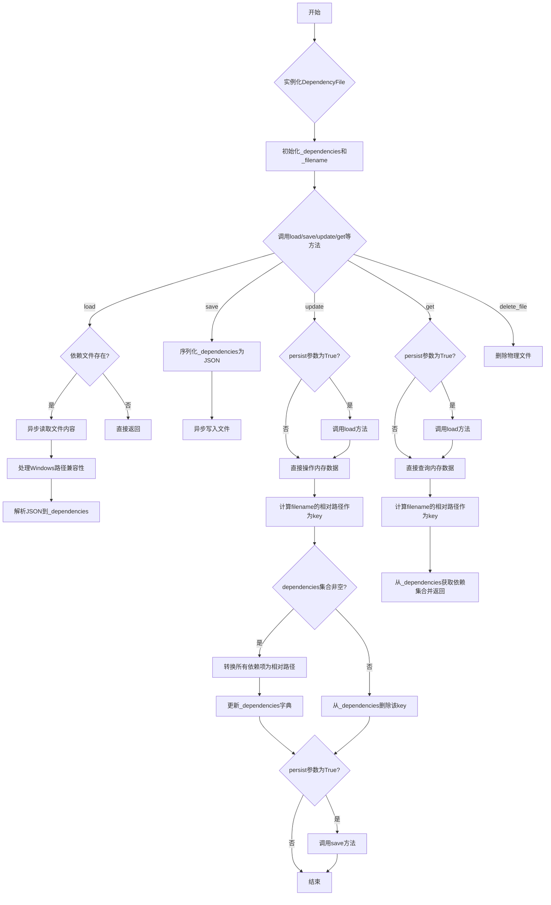
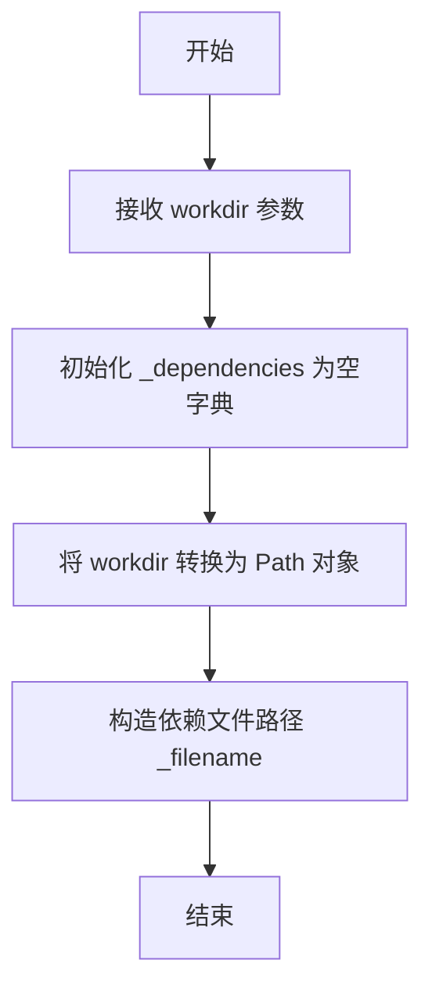
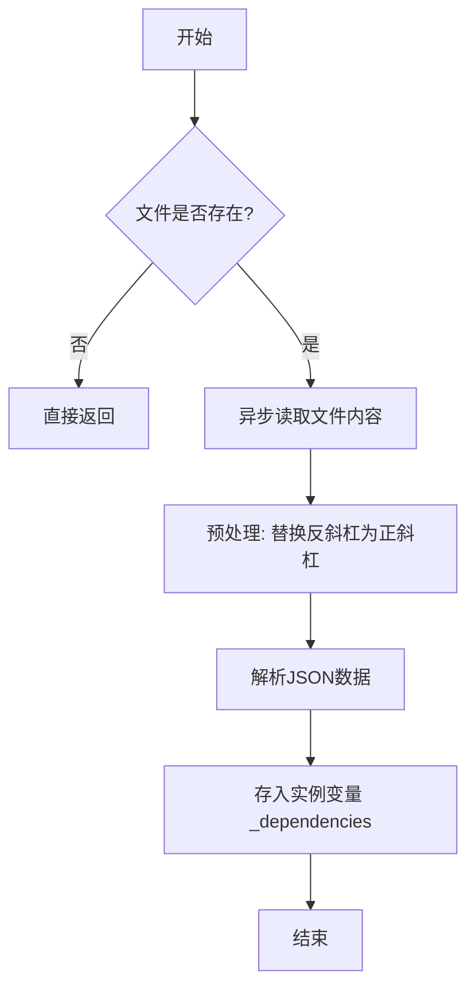
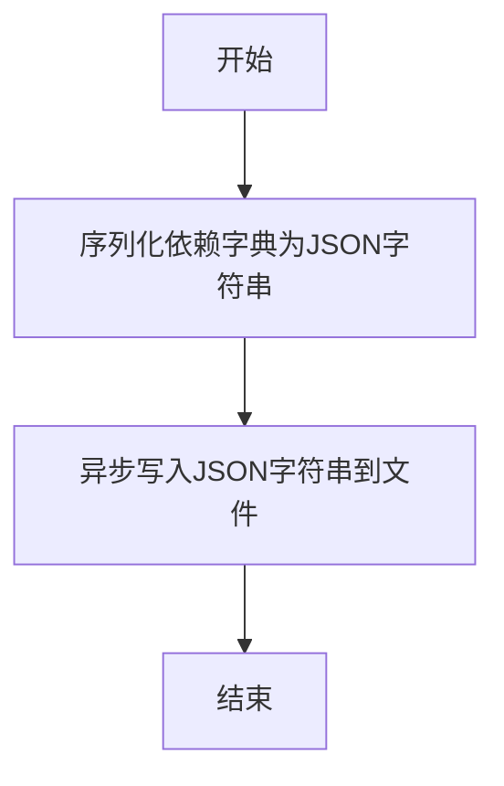
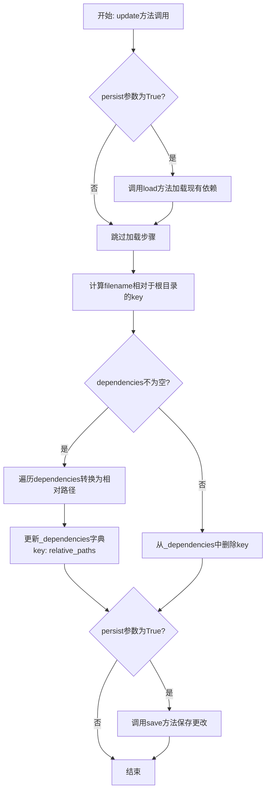
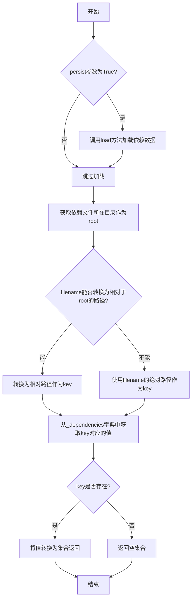
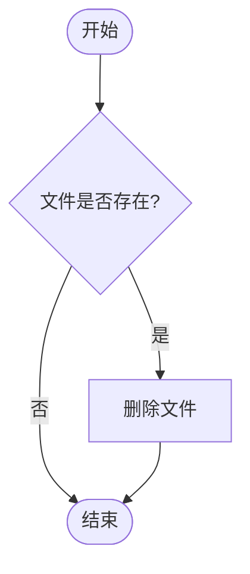
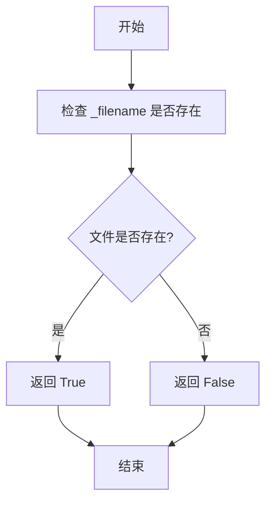

# `.\MetaGPT\metagpt\utils\dependency_file.py` 详细设计文档

该代码实现了一个依赖文件管理类，用于管理项目中文件之间的依赖关系。它基于RFC 135规范第2.2.3.2节描述，主要功能包括：从JSON文件异步加载依赖关系、异步保存更新后的依赖关系、为指定文件添加或删除依赖项、查询文件的依赖项集合，以及删除依赖文件本身。该类通过将文件路径转换为相对于工作目录的相对路径来标准化依赖关系的存储和查询。

## 整体流程



## 类结构

```
DependencyFile (依赖文件管理类)
├── 字段: _dependencies, _filename
├── 方法: __init__, load, save, update, get, delete_file
└── 属性: exists
```

## 全局变量及字段


### `DependencyFile._dependencies`
    
存储文件依赖关系的字典，键为文件路径，值为该文件依赖的其他文件路径列表。

类型：`dict`
    


### `DependencyFile._filename`
    
依赖关系数据文件的完整路径，默认为工作目录下的.dependencies.json文件。

类型：`Path`
    
    

## 全局函数及方法

### `DependencyFile.__init__`

初始化一个 `DependencyFile` 实例，设置依赖管理所需的基础数据结构和工作目录路径。

参数：

- `workdir`：`Path | str`，DependencyFile 的工作目录路径，用于确定依赖文件的存储位置。

返回值：`None`，无返回值。

#### 流程图



#### 带注释源码

```python
def __init__(self, workdir: Path | str):
    """Initialize a DependencyFile instance.

    :param workdir: The working directory path for the DependencyFile.
    """
    # 初始化依赖字典，用于存储文件与依赖关系的映射
    self._dependencies = {}
    # 将 workdir 转换为 Path 对象，并构造依赖文件的完整路径
    self._filename = Path(workdir) / ".dependencies.json"
```

### `DependencyFile.load`

该方法用于从 `.dependencies.json` 文件中异步加载依赖数据到内存中。如果文件不存在，则直接返回。加载过程中会对文件内容进行预处理，将 Windows 路径中的反斜杠替换为正斜杠，以确保跨平台兼容性。

参数：无

返回值：`None`，无返回值

#### 流程图



#### 带注释源码

```python
async def load(self):
    """Load dependencies from the file asynchronously."""
    # 检查依赖文件是否存在
    if not self._filename.exists():
        # 文件不存在，直接返回，不执行后续操作
        return
    # 异步读取文件内容
    json_data = await aread(self._filename)
    # 预处理：将路径中的连续反斜杠替换为正斜杠，确保Windows路径兼容性
    json_data = re.sub(r"\\+", "/", json_data)  # Compatible with windows path
    # 将JSON字符串解析为Python字典，并赋值给实例变量 _dependencies
    self._dependencies = json.loads(json_data)
```

### `DependencyFile.save`

该方法用于将当前内存中的依赖关系字典异步保存到JSON文件中。它使用`json.dumps`将字典序列化为JSON字符串，然后通过`awrite`异步写入到指定的文件路径（`self._filename`）。方法被`@handle_exception`装饰器包裹，以处理可能发生的异常。

参数：
- 无显式参数。方法操作实例变量`self._dependencies`和`self._filename`。

返回值：`None`，无返回值。

#### 流程图



#### 带注释源码

```python
@handle_exception  # 装饰器：异常处理，捕获并处理save方法执行过程中可能出现的异常
async def save(self):
    """Save dependencies to the file asynchronously."""  # 方法描述：异步保存依赖关系到文件
    data = json.dumps(self._dependencies)  # 将实例变量`_dependencies`（字典）序列化为JSON格式的字符串
    await awrite(filename=self._filename, data=data)  # 异步地将JSON字符串写入到`_filename`指定的文件中
```

### `DependencyFile.update`

该方法用于更新指定文件的依赖关系。它会将给定的依赖项集合转换为相对于依赖文件根目录的相对路径，然后更新内部依赖字典。如果提供了`persist=True`参数，则会自动加载当前依赖文件并保存更新后的结果。

参数：

- `filename`：`Path | str`，需要更新依赖关系的文件路径
- `dependencies`：`Set[Path | str]`，该文件的依赖项集合
- `persist`：`bool`，是否立即持久化更改（默认True）

返回值：`None`，无返回值

#### 流程图



#### 带注释源码

```python
async def update(self, filename: Path | str, dependencies: Set[Path | str], persist=True):
    """Update dependencies for a file asynchronously.

    :param filename: The filename or path.
    :param dependencies: The set of dependencies.
    :param persist: Whether to persist the changes immediately.
    """
    # 如果persist为True，先加载现有的依赖数据
    if persist:
        await self.load()

    # 获取依赖文件的根目录（工作目录）
    root = self._filename.parent
    try:
        # 尝试将filename转换为相对于根目录的路径作为key
        key = Path(filename).relative_to(root).as_posix()
    except ValueError:
        # 如果filename不在根目录下，直接使用原值
        key = filename
    key = str(key)  # 确保key是字符串类型
    
    # 如果dependencies不为空
    if dependencies:
        relative_paths = []
        # 遍历所有依赖项，转换为相对路径
        for i in dependencies:
            try:
                s = str(Path(i).relative_to(root).as_posix())
            except ValueError:
                s = str(i)
            relative_paths.append(s)

        # 更新依赖字典：key -> 相对路径列表
        self._dependencies[key] = relative_paths
    elif key in self._dependencies:
        # 如果dependencies为空且key已存在，则删除该key
        del self._dependencies[key]

    # 如果persist为True，保存更新后的依赖数据
    if persist:
        await self.save()
```

### `DependencyFile.get`

该方法用于异步获取指定文件的依赖项集合。它会根据参数决定是否从持久化存储中加载最新的依赖数据，然后将给定的文件名转换为相对于依赖文件所在目录的相对路径作为键，从内部依赖字典中查找对应的依赖项列表，并将其转换为集合返回。

参数：

- `filename`：`Path | str`，需要获取依赖项的文件名或路径
- `persist`：`bool`，是否立即从文件加载依赖数据（默认为True）

返回值：`Set[str]`，指定文件的依赖项集合，如果文件没有依赖项则返回空集合

#### 流程图



#### 带注释源码

```python
async def get(self, filename: Path | str, persist=True):
    """Get dependencies for a file asynchronously.

    :param filename: The filename or path.
    :param persist: Whether to load dependencies from the file immediately.
    :return: A set of dependencies.
    """
    # 如果persist为True，则从文件加载最新的依赖数据
    if persist:
        await self.load()

    # 获取依赖文件所在目录作为根目录
    root = self._filename.parent
    try:
        # 尝试将filename转换为相对于root的相对路径
        key = Path(filename).relative_to(root).as_posix()
    except ValueError:
        # 如果转换失败（如不在同一目录树），使用绝对路径
        key = Path(filename).as_posix()
    
    # 从_dependencies字典中获取key对应的依赖列表，转换为集合返回
    # 如果key不存在，返回空集合
    return set(self._dependencies.get(str(key), {}))
```

### `DependencyFile.delete_file`

删除依赖文件。

参数：无

返回值：`None`，无返回值

#### 流程图



#### 带注释源码

```python
def delete_file(self):
    """Delete the dependency file."""
    # 调用 Path.unlink 方法删除文件，missing_ok=True 表示如果文件不存在则忽略错误
    self._filename.unlink(missing_ok=True)
```

### `DependencyFile.exists`

检查依赖文件是否存在。

参数：无

返回值：`bool`，如果依赖文件存在则返回 `True`，否则返回 `False`

#### 流程图



#### 带注释源码

```python
@property
def exists(self):
    """Check if the dependency file exists."""
    return self._filename.exists()
```

## 关键组件

### DependencyFile 类

一个用于管理文件依赖关系的类，它允许异步加载、保存、更新和获取存储在JSON文件中的依赖信息。

### 异步文件I/O操作

通过 `aread` 和 `awrite` 函数实现异步读取和写入依赖文件，确保在处理文件时不会阻塞主线程。

### 路径规范化与兼容性处理

使用正则表达式替换和 `Path` 对象的 `relative_to` 方法，确保文件路径在不同操作系统（如Windows）下的一致性和正确性。

### 异常处理装饰器

通过 `@handle_exception` 装饰器对 `save` 方法进行异常处理，确保在保存依赖文件时能够优雅地处理可能出现的错误。

### JSON 数据序列化与反序列化

利用 `json.loads` 和 `json.dumps` 实现依赖数据的序列化和反序列化，确保数据在存储和读取时的结构一致性。

## 问题及建议


### 已知问题

-   **路径处理逻辑不一致**：`update` 和 `get` 方法在处理无法相对于根目录转换的路径时，逻辑不一致。`update` 方法将原始输入 `filename` 直接转为字符串作为键，而 `get` 方法会尝试使用 `Path(filename).as_posix()` 进行转换。这可能导致同一个文件在存储和查询时使用不同的键，从而无法正确获取依赖关系。
-   **异常处理范围不明确**：`save` 方法使用了 `@handle_exception` 装饰器，但 `load` 和 `update` 方法没有。如果 `load` 方法中 `json.loads` 失败（例如文件内容不是合法JSON），或者 `update` 方法中 `save` 失败，异常会直接抛出，缺乏统一的错误处理策略。
-   **潜在的竞态条件**：`update` 和 `get` 方法在 `persist=True` 时都会调用 `load` 方法。在多线程或异步环境下，如果文件在 `load` 之后、`save` 之前被其他进程修改，可能会导致数据覆盖或状态不一致。
-   **依赖集合去重逻辑缺失**：`update` 方法接收一个 `Set` 类型的 `dependencies` 参数，但在将其存储到 `_dependencies` 字典时，转换成了列表 `relative_paths`。虽然输入是集合，但内部存储为列表，后续 `get` 方法返回时再转换为集合，这本身没有问题。但 `update` 方法在更新时，如果 `key` 已存在，会直接覆盖旧的依赖列表，而不是合并或去重，这取决于调用方的输入是否正确。

### 优化建议

-   **统一路径键的生成逻辑**：建议在类内部创建一个私有方法（如 `_get_key`），用于统一将输入的 `filename` 参数转换为存储和查询用的键字符串。该方法应包含相对路径转换和回退逻辑，并在 `update` 和 `get` 方法中调用，确保键的一致性。
-   **明确并统一异常处理**：评估哪些操作是关键的，需要应用 `@handle_exception` 装饰器或类似的错误处理。至少 `load` 和 `save` 这两个直接进行文件I/O操作的方法应有明确的错误处理。可以考虑将 `handle_exception` 装饰器也应用于 `load` 方法，或者在类内部使用 try-catch 块进行更精细的控制。
-   **考虑增加锁机制或原子操作**：对于可能并发访问的场景，可以引入锁（如 `asyncio.Lock`）来保护 `_dependencies` 数据的加载和保存过程，确保操作的原子性。或者，将 `load` 和 `save` 操作设计为幂等的，并让调用方负责处理并发逻辑。
-   **优化数据更新策略**：在 `update` 方法中，当 `dependencies` 不为空时，可以考虑与现有的依赖列表进行合并（使用集合操作），而不是直接覆盖。这可以避免在多次、部分更新同一文件依赖时丢失信息。同时，可以保持内部存储为集合以提高去重和查询效率。
-   **增强代码健壮性**：在 `load` 方法中，`json.loads` 调用后，可以验证加载的数据是否为字典类型，并进行基本的键值类型检查，防止因文件内容损坏导致后续操作出错。
-   **提供批量操作接口**：如果业务场景中需要频繁更新多个文件的依赖，可以提供一个批量更新的方法，减少文件I/O次数，提高性能。


## 其它


### 设计目标与约束

1.  **设计目标**：
    *   **功能目标**：实现一个轻量级的依赖关系管理器，用于记录和管理项目内文件之间的依赖关系，支持增删改查操作，并将依赖数据持久化到JSON文件中。
    *   **非功能目标**：
        *   **异步操作**：核心的加载、保存、更新和获取操作均设计为异步，以提高I/O密集型操作的效率。
        *   **路径规范化**：自动处理文件路径，将其转换为相对于工作目录的相对路径，并统一使用正斜杠(`/`)作为路径分隔符，确保跨平台（特别是Windows）的一致性。
        *   **容错性**：在文件不存在或路径转换失败时能够优雅处理，避免程序崩溃。

2.  **设计约束**：
    *   **数据格式**：依赖关系必须持久化为JSON格式，存储在一个名为`.dependencies.json`的文件中。
    *   **接口契约**：类的方法签名（特别是`update`和`get`方法）必须支持`Path`和`str`两种类型的路径参数。
    *   **内存模型**：依赖关系在内存中以字典形式缓存，键为相对路径（字符串），值为依赖路径列表（字符串列表）。

### 错误处理与异常设计

1.  **异常处理策略**：
    *   **装饰器集中处理**：`save`方法使用`@handle_exception`装饰器，用于集中捕获和可能记录在保存文件时发生的异常（如权限错误、磁盘空间不足）。
    *   **显式异常捕获**：在`update`和`get`方法中，使用`try-except`块捕获`ValueError`异常。当传入的`filename`或`dependencies`中的路径无法转换为相对于工作目录的路径时（例如，路径不在工作目录下），此异常被捕获，并回退到使用原始路径字符串，保证了功能的鲁棒性。
    *   **静默处理**：`load`方法在依赖文件不存在时直接返回，`delete_file`方法使用`missing_ok=True`参数，确保删除不存在的文件时不会抛出异常。

2.  **预期的错误场景**：
    *   依赖文件`.dependencies.json`格式损坏（非标准JSON）。
    *   对文件或目录的操作权限不足。
    *   传入的路径参数格式非法或指向不存在的资源。

### 数据流与状态机

1.  **核心数据流**：
    *   **初始化**：创建`DependencyFile`对象，指定工作目录，初始化空依赖字典和文件路径。
    *   **加载数据流**：`load()` -> `aread()` -> JSON解析 -> 路径字符串替换(`\` -> `/`) -> 填充`self._dependencies`。
    *   **更新数据流**：`update(...)` -> (可选)`load()` -> 路径标准化（转为相对路径） -> 更新`self._dependencies`字典 -> (可选)`save()` -> `json.dumps()` -> `awrite()`。
    *   **获取数据流**：`get(...)` -> (可选)`load()` -> 路径标准化 -> 从`self._dependencies`字典中查询 -> 返回`set`。
    *   **保存数据流**：`save()`（可由`update`触发或手动调用） -> `json.dumps()` -> `awrite()`。
    *   **删除数据流**：`delete_file()` -> `Path.unlink()`。

2.  **状态机（简化）**：
    *   **状态**：
        *   `EMPTY`: `_dependencies`为空（初始化后或文件不存在时）。
        *   `LOADED`: `_dependencies`已从文件加载数据。
        *   `DIRTY`: `_dependencies`在内存中被修改，但尚未持久化。
    *   **状态转换**：
        *   `初始化` -> `EMPTY`
        *   `load()`成功 -> `LOADED`
        *   `update(persist=False)` -> `DIRTY`
        *   `update(persist=True)` 或 `save()` -> `LOADED` (假设保存成功)
        *   `delete_file()` -> `EMPTY` (仅删除文件，内存状态可能仍是`DIRTY`或`LOADED`)

### 外部依赖与接口契约

1.  **外部库依赖**：
    *   `json`: 用于依赖数据的序列化与反序列化。
    *   `re`: 用于在加载JSON数据时进行字符串替换，实现Windows路径兼容。
    *   `pathlib.Path`: 用于面向对象的路径操作和跨平台路径处理。
    *   `metagpt.utils.common.aread`, `awrite`: 项目内部封装的异步文件读写工具。
    *   `metagpt.utils.exceptions.handle_exception`: 项目内部封装的异常处理装饰器。

2.  **接口契约**：
    *   **文件格式契约**：`.dependencies.json`文件必须是一个合法的JSON对象，其键值对为`"<相对路径>": ["<依赖相对路径1>", ...]`。
    *   **方法行为契约**：
        *   `load()`: 如果文件不存在，应静默返回，不抛出异常。
        *   `update()`: 当`dependencies`参数为空集合时，应删除该文件对应的依赖条目。
        *   `get()`: 当查询的文件没有依赖记录时，应返回一个空集合(`set()`)。
        *   `save()`: 应覆盖写入目标文件，而非追加。
    *   **路径处理契约**：所有内部存储和返回的路径均为字符串，并使用正斜杠(`/`)分隔。对外接口接受`Path`和`str`类型。

    