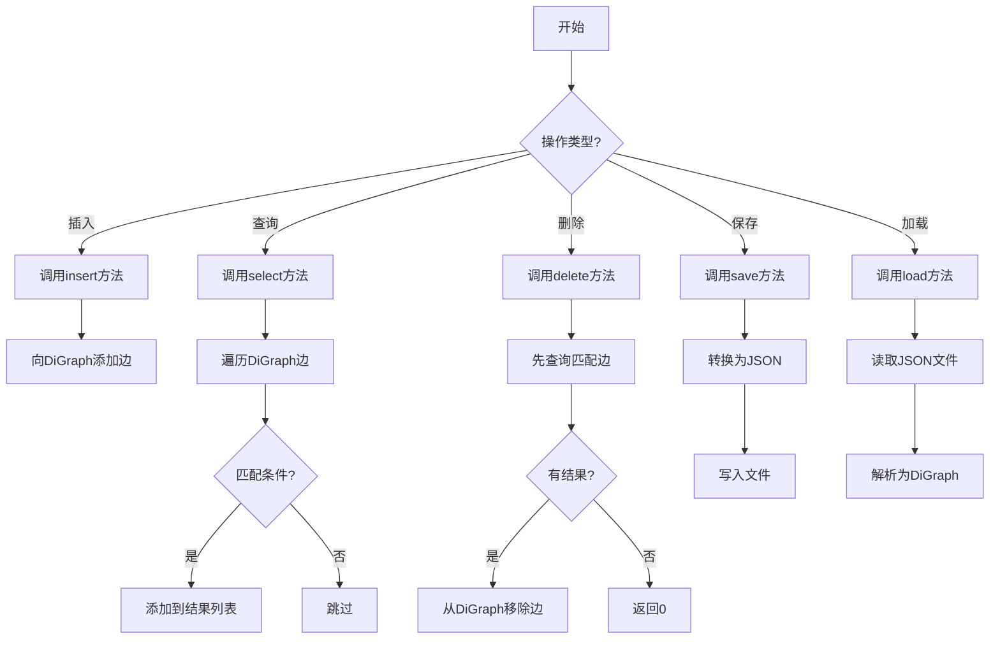
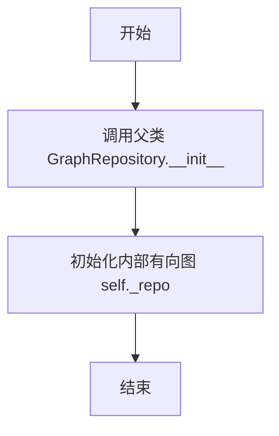
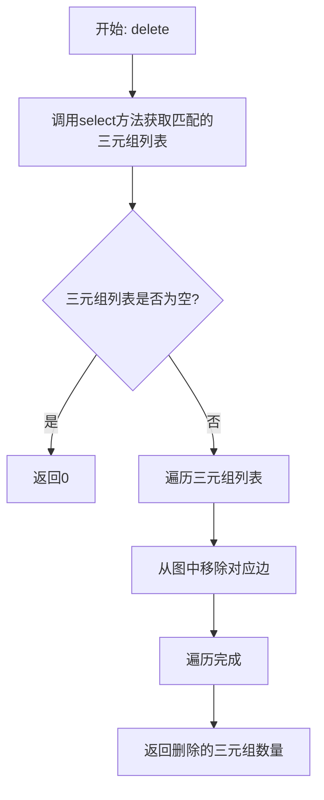
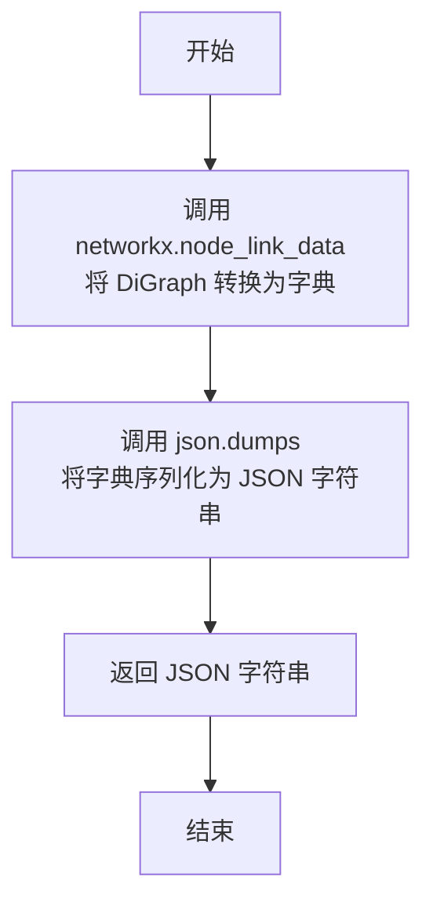
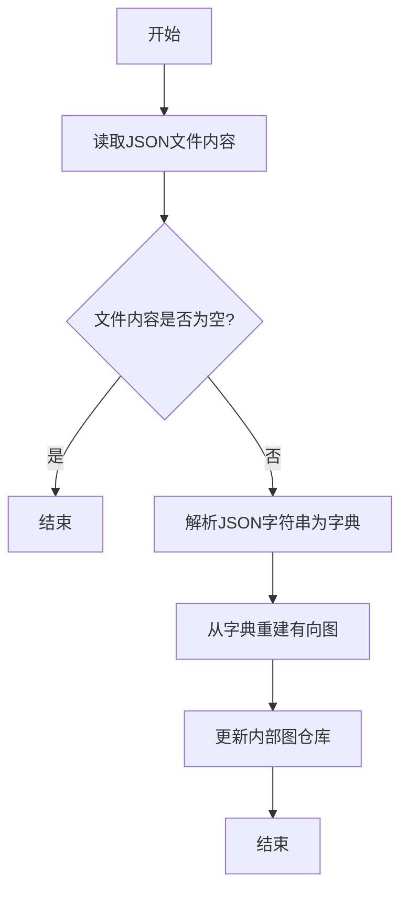
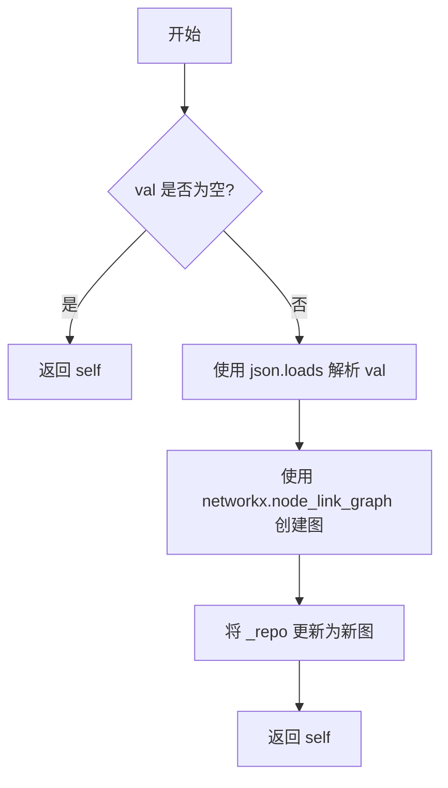
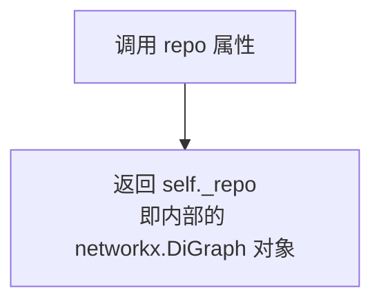

# `.\MetaGPT\metagpt\utils\di_graph_repository.py` 详细设计文档

该代码实现了一个基于有向图（DiGraph）的图数据库仓库类，继承自GraphRepository基类，提供了对三元组（主语-谓语-宾语）数据的增删查改、序列化/反序列化以及持久化存储功能，专门用于处理实体间的有向关系。

## 整体流程



## 类结构

```
GraphRepository (基类)
└── DiGraphRepository (有向图仓库实现类)
```

## 全局变量及字段


### `DiGraphRepository._repo`
    
存储有向图数据的底层数据结构，使用NetworkX的DiGraph类实现，用于表示实体间的有向关系。

类型：`networkx.DiGraph`
    


### `DiGraphRepository._kwargs`
    
继承自父类GraphRepository的参数字典，用于存储初始化时传入的额外配置参数，如文件保存路径等。

类型：`dict`
    


### `DiGraphRepository.name`
    
图存储库的名称，通常用于生成保存文件的文件名。

类型：`str`
    
    

## 全局函数及方法

### `DiGraphRepository.__init__`

初始化一个基于有向图（DiGraph）的图存储库实例，设置存储库名称并初始化内部有向图数据结构。

参数：

- `name`：`str | Path`，存储库的名称或路径，用于标识该图存储库。
- `**kwargs`：`dict`，可选的关键字参数，传递给父类 `GraphRepository` 的初始化方法。

返回值：`None`，此方法不返回任何值。

#### 流程图



#### 带注释源码

```python
def __init__(self, name: str | Path, **kwargs):
    # 调用父类 GraphRepository 的初始化方法，传递名称和可选关键字参数
    super().__init__(name=str(name), **kwargs)
    # 初始化内部有向图数据结构，使用 networkx.DiGraph 创建空的有向图
    self._repo = networkx.DiGraph()
```


### `DiGraphRepository.insert`

向有向图知识库中插入一个新的三元组（Subject-Predicate-Object）。该方法在有向图（`networkx.DiGraph`）中添加一条从`subject`节点指向`object_`节点的边，并将`predicate`作为该边的属性，从而建立一条有向关系。

参数：
-  `subject`：`str`，三元组的主体，表示关系的起点。
-  `predicate`：`str`，三元组的谓词，描述主体与客体之间的关系。
-  `object_`：`str`，三元组的客体，表示关系的终点。

返回值：`None`，此方法不返回任何值，其作用是在内部图结构中添加一条边。

#### 流程图

```mermaid
flowchart TD
    A[开始: insert(subject, predicate, object_)] --> B{参数有效性检查?}
    B -- 是 --> C[调用 _repo.add_edge<br>添加边: subject -> object_<br>边属性: predicate]
    C --> D[结束]
    B -- 否 --> E[抛出异常或静默失败]
    E --> D
```

#### 带注释源码

```python
async def insert(self, subject: str, predicate: str, object_: str):
    """Insert a new triple into the directed graph repository.

    Args:
        subject (str): The subject of the triple.
        predicate (str): The predicate describing the relationship.
        object_ (str): The object of the triple.

    Example:
        await my_di_graph_repo.insert(subject="Node1", predicate="connects_to", object_="Node2")
        # Adds a directed relationship: Node1 connects_to Node2
    """
    # 核心操作：使用 networkx.DiGraph 的 add_edge 方法。
    # 在内部有向图 `self._repo` 中添加一条从 `subject` 节点到 `object_` 节点的边。
    # 关键字参数 `predicate=predicate` 将谓词作为边的属性存储，便于后续查询和筛选。
    self._repo.add_edge(subject, object_, predicate=predicate)
```


### `DiGraphRepository.select`

从有向图存储库中根据指定的条件检索三元组。该方法遍历图中的所有边，并根据提供的subject、predicate和object参数进行过滤，返回匹配的三元组列表。

参数：

- `subject`：`str`，可选，用于过滤三元组的主体。
- `predicate`：`str`，可选，用于过滤三元组的谓词（关系描述）。
- `object_`：`str`，可选，用于过滤三元组的客体。

返回值：`List[SPO]`，表示所选三元组的SPO对象列表。

#### 流程图

```mermaid
flowchart TD
    A[开始] --> B[初始化结果列表 result]
    B --> C[遍历图中的所有边<br/>s, o, p = 边的主体, 客体, 谓词]
    C --> D{subject 参数存在?}
    D -- 是 --> E{s == subject?}
    E -- 否 --> C
    E -- 是 --> F
    D -- 否 --> F
    F{predicate 参数存在?}
    F -- 是 --> G{p == predicate?}
    G -- 否 --> C
    G -- 是 --> H
    F -- 否 --> H
    H{object_ 参数存在?}
    H -- 是 --> I{o == object_?}
    I -- 否 --> C
    I -- 是 --> J
    H -- 否 --> J
    J[将 SPO(s, p, o) 添加到 result]
    J --> C
    C --> K[遍历结束]
    K --> L[返回 result]
    L --> M[结束]
```

#### 带注释源码

```python
async def select(self, subject: str = None, predicate: str = None, object_: str = None) -> List[SPO]:
    """Retrieve triples from the directed graph repository based on specified criteria.

    Args:
        subject (str, optional): The subject of the triple to filter by.
        predicate (str, optional): The predicate describing the relationship to filter by.
        object_ (str, optional): The object of the triple to filter by.

    Returns:
        List[SPO]: A list of SPO objects representing the selected triples.

    Example:
        selected_triples = await my_di_graph_repo.select(subject="Node1", predicate="connects_to")
        # Retrieves directed relationships where Node1 is the subject and the predicate is 'connects_to'.
    """
    result = []  # 初始化一个空列表用于存储匹配的三元组
    # 遍历有向图 _repo 中的所有边，每条边包含主体(s)、客体(o)和谓词(p)信息
    for s, o, p in self._repo.edges(data="predicate"):
        # 如果提供了 subject 参数，且当前边的主体不等于该参数，则跳过当前边
        if subject and subject != s:
            continue
        # 如果提供了 predicate 参数，且当前边的谓词不等于该参数，则跳过当前边
        if predicate and predicate != p:
            continue
        # 如果提供了 object_ 参数，且当前边的客体不等于该参数，则跳过当前边
        if object_ and object_ != o:
            continue
        # 如果当前边通过了所有过滤条件，则创建一个 SPO 对象并添加到结果列表中
        result.append(SPO(subject=s, predicate=p, object_=o))
    # 返回包含所有匹配三元组的列表
    return result
```


### `DiGraphRepository.delete`

该方法用于从有向图存储库中删除满足指定条件的三元组（边）。它首先通过调用 `select` 方法查找所有匹配的三元组，然后遍历这些三元组，从内部有向图（`self._repo`）中移除对应的边。最后返回被删除的三元组数量。

参数：

- `subject`：`str`，可选，要过滤的三元组的主语。
- `predicate`：`str`，可选，要过滤的三元组的谓词（关系描述）。
- `object_`：`str`，可选，要过滤的三元组的宾语。

返回值：`int`，从存储库中删除的三元组数量。

#### 流程图



#### 带注释源码

```python
async def delete(self, subject: str = None, predicate: str = None, object_: str = None) -> int:
    """Delete triples from the directed graph repository based on specified criteria.

    Args:
        subject (str, optional): The subject of the triple to filter by.
        predicate (str, optional): The predicate describing the relationship to filter by.
        object_ (str, optional): The object of the triple to filter by.

    Returns:
        int: The number of triples deleted from the repository.

    Example:
        deleted_count = await my_di_graph_repo.delete(subject="Node1", predicate="connects_to")
        # Deletes directed relationships where Node1 is the subject and the predicate is 'connects_to'.
    """
    # 1. 调用select方法，根据传入的条件（subject, predicate, object_）查找所有匹配的三元组。
    rows = await self.select(subject=subject, predicate=predicate, object_=object_)
    # 2. 如果没有找到匹配的三元组，直接返回0。
    if not rows:
        return 0
    # 3. 遍历所有匹配的三元组。
    for r in rows:
        # 4. 从内部有向图（self._repo）中移除对应的边。
        #    边的两端节点分别是三元组的主语（r.subject）和宾语（r.object_）。
        self._repo.remove_edge(r.subject, r.object_)
    # 5. 返回被删除的三元组数量。
    return len(rows)
```


### `DiGraphRepository.json`

将当前有向图仓库对象序列化为 JSON 格式的字符串。该方法使用 `networkx.node_link_data` 函数将内部的 `networkx.DiGraph` 对象转换为一个可序列化的字典结构，然后使用 `json.dumps` 将其转换为 JSON 字符串。

参数：
-  `self`：`DiGraphRepository`，当前有向图仓库的实例。

返回值：`str`，一个 JSON 格式的字符串，表示当前有向图的结构和数据。

#### 流程图



#### 带注释源码

```python
def json(self) -> str:
    """Convert the directed graph repository to a JSON-formatted string."""
    # 使用 networkx 库的 node_link_data 函数，将内部的 DiGraph 对象 `self._repo`
    # 转换为一个标准的、可序列化的字典结构 `m`。
    # 这个字典包含了图的节点、边及其属性，遵循 NetworkX 的节点-链接格式。
    m = networkx.node_link_data(self._repo)
    # 使用 Python 内置的 json.dumps 函数，将上一步得到的字典 `m`
    # 序列化为一个 JSON 格式的字符串 `data`。
    data = json.dumps(m)
    # 返回生成的 JSON 字符串。
    return data
```


### `DiGraphRepository.save`

该方法用于将当前有向图仓库的内容序列化为JSON格式，并异步保存到指定的文件路径。如果未提供路径，则使用初始化时传入的`root`参数作为默认目录。在保存前，会确保目标目录存在。

参数：

- `path`：`str | Path`，可选参数，指定保存JSON文件的目录路径。如果未提供，则使用实例初始化时`kwargs`中的`"root"`值作为默认路径。

返回值：`None`，该方法没有返回值。

#### 流程图

```mermaid
flowchart TD
    A[开始: save(path)] --> B{path 参数是否提供?}
    B -- 是 --> C[使用提供的 path]
    B -- 否 --> D[从 self._kwargs 获取 'root' 作为 path]
    C --> E
    D --> E
    E[确保 path 对应的目录存在] --> F[构建完整文件路径: path / self.name.json]
    F --> G[调用 self.json() 获取图的 JSON 字符串]
    G --> H[异步写入文件: awrite(filename, data)]
    H --> I[结束]
```

#### 带注释源码

```python
async def save(self, path: str | Path = None):
    """Save the directed graph repository to a JSON file.

    Args:
        path (Union[str, Path], optional): The directory path where the JSON file will be saved.
            If not provided, the default path is taken from the 'root' key in the keyword arguments.
    """
    # 1. 将内部图结构序列化为JSON字符串
    data = self.json()
    # 2. 确定保存路径：优先使用传入的path，否则使用初始化时设置的root目录
    path = path or self._kwargs.get("root")
    # 3. 确保目标目录存在，若不存在则创建（包括父目录）
    if not path.exists():
        path.mkdir(parents=True, exist_ok=True)
    # 4. 构建完整的文件路径，文件名为 self.name，扩展名为 .json
    pathname = Path(path) / self.name
    # 5. 异步将JSON数据写入文件
    await awrite(filename=pathname.with_suffix(".json"), data=data, encoding="utf-8")
```

### `DiGraphRepository.load`

该方法用于从指定的JSON文件中加载有向图数据，并将其解析并更新到当前图仓库实例的内部数据结构中。

参数：

- `pathname`：`str | Path`，指向包含图数据的JSON文件的路径。

返回值：`None`，该方法不返回任何值，但会更新实例的内部状态。

#### 流程图



#### 带注释源码

```python
async def load(self, pathname: str | Path):
    """Load a directed graph repository from a JSON file."""
    # 异步读取指定路径的JSON文件内容，使用UTF-8编码
    data = await aread(filename=pathname, encoding="utf-8")
    # 调用load_json方法，将读取的JSON字符串解析并更新内部图结构
    self.load_json(data)
```

### `DiGraphRepository.load_json`

该方法用于加载一个JSON编码的字符串，该字符串表示一个图结构，并更新内部存储库（`_repo`）为解析后的图。

参数：

- `val`：`str`，一个表示图结构的JSON编码字符串。

返回值：`self`，返回更新了`_repo`属性的类实例。

#### 流程图



#### 带注释源码

```python
def load_json(self, val: str):
    """
    加载一个JSON编码的字符串，该字符串表示一个图结构，并更新内部存储库（_repo）为解析后的图。

    Args:
        val (str): 一个表示图结构的JSON编码字符串。

    Returns:
        self: 返回更新了 _repo 属性的类实例。

    Raises:
        TypeError: 如果 val 不是有效的 JSON 字符串，或者无法解析为有效的图结构。
    """
    # 检查输入字符串是否为空
    if not val:
        # 如果为空，直接返回当前实例，不进行任何操作
        return self
    # 将 JSON 字符串解析为 Python 字典
    m = json.loads(val)
    # 使用 networkx 的 node_link_graph 函数从字典重建有向图
    self._repo = networkx.node_link_graph(m)
    # 返回更新后的实例，支持链式调用
    return self
```


### `DiGraphRepository.load_from`

这是一个静态工厂方法，用于从指定的JSON文件路径创建并加载一个`DiGraphRepository`实例。它封装了实例创建和文件加载的逻辑，提供了一个便捷的入口点来初始化一个已持久化的有向图仓库。

参数：

-  `pathname`：`str | Path`，指向包含图数据（JSON格式）的文件的路径。

返回值：`GraphRepository`，一个加载了指定文件数据的新`DiGraphRepository`实例。

#### 流程图

```mermaid
flowchart TD
    A[开始: load_from(pathname)] --> B[将pathname转换为Path对象]
    B --> C[使用pathname.stem作为name<br>pathname.parent作为root<br>创建DiGraphRepository实例graph]
    C --> D{文件pathname是否存在?}
    D -- 是 --> E[调用graph.load(pathname)加载数据]
    D -- 否 --> F[跳过加载，graph为空仓库]
    E --> G[返回graph实例]
    F --> G
```

#### 带注释源码

```python
    @staticmethod
    # 声明这是一个静态方法，无需实例即可调用。
    async def load_from(pathname: str | Path) -> GraphRepository:
        """Create and load a directed graph repository from a JSON file.

        Args:
            pathname (Union[str, Path]): The path to the JSON file to be loaded.

        Returns:
            GraphRepository: A new instance of the graph repository loaded from the specified JSON file.
        """
        # 将输入路径转换为Path对象，确保后续操作的一致性。
        pathname = Path(pathname)
        # 1. 创建实例：使用文件名（不含后缀）作为仓库名(name)，文件所在目录作为根目录(root)。
        graph = DiGraphRepository(name=pathname.stem, root=pathname.parent)
        # 2. 条件加载：仅当文件存在时才执行加载操作，避免因文件不存在而报错。
        if pathname.exists():
            # 调用实例的异步load方法，从指定路径读取并解析JSON数据到内部图结构(_repo)。
            await graph.load(pathname=pathname)
        # 3. 返回实例：返回新创建（可能已加载数据）的图仓库实例。
        return graph
```


### `DiGraphRepository.root`

`root` 是 `DiGraphRepository` 类的一个只读属性（property）。它的作用是获取在初始化 `DiGraphRepository` 实例时，通过 `kwargs` 传入的 `root` 参数的值。这个 `root` 参数通常用于指定图数据文件（JSON格式）存储的根目录路径。

参数：
- 无

返回值：`str`，返回初始化时传入的 `root` 参数的值，即图数据文件存储的根目录路径。

#### 流程图

```mermaid
flowchart TD
    A[调用 root 属性] --> B[访问实例的 _kwargs 字典]
    B --> C{检查 'root' 键是否存在?}
    C -- 是 --> D[返回 _kwargs.get('root') 的值]
    C -- 否 --> E[返回 None]
```

#### 带注释源码

```python
    @property
    def root(self) -> str:
        """Return the root directory path for the graph repository files."""
        # 从实例的 _kwargs 字典中获取键为 'root' 的值并返回。
        # 如果 'root' 键不存在，则返回 None。
        return self._kwargs.get("root")
```

### `DiGraphRepository.pathname`

`pathname` 是 `DiGraphRepository` 类的一个只读属性（property）。它的核心功能是根据实例的 `root` 和 `name` 属性，动态计算并返回该图仓库数据文件（JSON格式）的完整路径。

参数：
- 无显式参数。作为属性，其值由实例的内部状态（`self.root` 和 `self.name`）决定。

返回值：`Path`，返回一个 `pathlib.Path` 对象，指向该图仓库数据文件的完整路径，文件扩展名为 `.json`。

#### 流程图

```mermaid
flowchart TD
    A[调用 pathname 属性] --> B[获取 self.root]
    B --> C[获取 self.name]
    C --> D[构造路径: Path(root) / name]
    D --> E[添加后缀: .with_suffix('.json')]
    E --> F[返回 Path 对象]
```

#### 带注释源码

```python
    @property
    def pathname(self) -> Path:
        """Return the path and filename to the graph repository file."""
        # 1. 从实例的 `_kwargs` 字典中获取 'root' 键对应的值，作为根目录路径。
        # 2. 将根目录路径字符串转换为 Path 对象。
        p = Path(self.root) / self.name
        # 3. 将根目录路径与实例名称拼接，形成基础文件名。
        # 4. 使用 `.with_suffix('.json')` 方法，确保返回的路径具有 `.json` 扩展名。
        #    如果 `self.name` 已包含其他后缀，此操作会将其替换为 `.json`。
        return p.with_suffix(".json")
```

### `DiGraphRepository.repo`

这是一个属性访问器，用于获取 `DiGraphRepository` 类实例的底层有向图（`networkx.DiGraph`）对象。它提供了对内部图结构的只读访问，允许外部代码查询图的结构、节点和边，但不允许直接修改。

参数：
- 无

返回值：`networkx.DiGraph`，返回该 `DiGraphRepository` 实例内部维护的有向图对象。

#### 流程图



#### 带注释源码

```python
@property
def repo(self):
    """Get the underlying directed graph repository."""
    # 返回内部维护的 networkx.DiGraph 对象。
    # 这是一个属性装饰器，使得可以通过 `instance.repo` 的方式访问，而不是 `instance.repo()`。
    # 它提供了对图结构的直接访问，但请注意，返回的是原始引用，外部修改会影响内部状态。
    return self._repo
```

## 关键组件

### DiGraphRepository

基于有向图（DiGraph）实现的图数据存储库，提供对实体间有向关系的增删改查、序列化与持久化功能。

### SPO 数据结构

表示一个三元组（Subject-Predicate-Object），用于在图数据库中封装和传递关系数据。

### NetworkX DiGraph

作为底层数据存储结构，提供了高效的有向图操作和算法支持，是本实现的核心依赖组件。

### 异步文件 I/O 操作

通过 `aread` 和 `awrite` 函数实现图的异步加载与保存，支持 JSON 格式的序列化与反序列化。

### 惰性加载机制

通过 `load_from` 静态方法支持从文件系统按需创建和加载图数据库实例。

## 问题及建议


### 已知问题

-   **`load_json` 方法返回值与文档描述不一致**：方法签名返回 `self`，但文档字符串描述返回 `self`，而实际代码中 `load_json` 方法没有显式返回任何值（Python 默认返回 `None`），这会导致调用方预期与实际行为不符，可能引发错误。
-   **`save` 方法路径处理逻辑存在潜在错误**：方法中 `if not path.exists():` 这行代码假设 `path` 是一个 `Path` 对象，但 `path` 参数类型为 `str | Path`，且可能为 `None`。当 `path` 为 `None` 时，代码会使用 `self._kwargs.get("root")`，但此值可能是字符串，直接调用 `.exists()` 会导致 `AttributeError`。此外，即使 `path` 是 `Path` 对象，`path.mkdir(parents=True, exist_ok=True)` 的意图是创建目录，但后续 `pathname = Path(path) / self.name` 操作可能将 `path`（本应是目录）与文件名拼接，逻辑上存在混淆。
-   **`select` 方法性能可能随图规模增长而线性下降**：该方法通过遍历图中所有边 (`self._repo.edges`) 并进行条件匹配来筛选结果。对于大型图，当没有提供筛选条件或条件非常宽松时，需要遍历所有边，时间复杂度为 O(E)，可能成为性能瓶颈。
-   **`delete` 方法存在冗余操作**：`delete` 方法内部先调用 `select` 获取所有匹配的边，然后遍历这些边进行删除。`select` 方法本身已经进行了一次全图或条件遍历，`delete` 的循环相当于进行了两次遍历（一次在 `select` 中，一次在自身的 `for` 循环中），对于大型图，这增加了不必要的开销。
-   **缺乏对 `networkx.DiGraph` 节点和边属性的利用**：当前实现仅使用边的 `predicate` 属性存储关系类型，但 `networkx` 支持为节点和边存储任意键值对属性。这限制了存储更丰富元数据（如关系权重、创建时间戳等）的能力，扩展性不足。
-   **`__init__` 方法中 `name` 参数类型转换可能掩盖错误**：`super().__init__(name=str(name), **kwargs)` 将 `name` 强制转换为字符串，如果 `name` 是其他不可转换为字符串的类型，可能会在后续使用中引发难以追踪的错误，而不是在初始化时立即失败。

### 优化建议

-   **修正 `load_json` 方法的返回值**：明确在 `load_json` 方法末尾添加 `return self` 语句，使其行为与文档描述一致，支持链式调用。
-   **重构 `save` 方法的路径处理逻辑**：
    1.  明确区分目录路径和文件路径。建议将 `path` 参数重命名为 `directory` 或 `save_dir` 以明确其表示目录。
    2.  在方法内部，统一将输入转换为 `Path` 对象，并优先使用 `self._kwargs.get("root")` 作为后备目录。
    3.  创建目录的逻辑应基于确定的目录路径，然后在该目录下拼接文件名（`self.name` + `.json`）形成完整的文件路径。
    4.  添加类型检查和更健壮的错误处理。
-   **优化 `select` 和 `delete` 方法的性能**：
    1.  对于 `select`，如果 `networkx` 版本支持，可以考虑使用更高效的图查询方法，或者对常用查询模式建立索引（但这会增加复杂性）。作为初级优化，确保在提供有效筛选条件时能尽早过滤。
    2.  对于 `delete`，可以重构为直接遍历图边并同时进行匹配和删除，避免调用 `select` 导致的二次遍历。例如，可以收集待删除的边到一个列表，然后统一删除。
-   **增强数据模型以支持属性存储**：考虑扩展 `SPO` 类或引入新的数据结构，以支持在插入和查询时携带节点和边的附加属性。相应地，修改 `insert`、`select` 等方法签名和实现，以处理这些属性。
-   **在 `__init__` 中添加参数验证**：对 `name` 参数进行类型检查，确保其为 `str` 或 `Path`，并在类型不符时抛出清晰的 `TypeError`，提高代码的健壮性。
-   **考虑添加批量操作接口**：当前 `insert` 和 `delete` 操作都是单条或条件批量。可以添加 `insert_batch` 和 `delete_batch` 方法，接受三元组列表，通过 `networkx` 的批量操作（如 `add_edges_from`）提高数据导入/删除效率。
-   **改进错误处理和异常信息**：在 `load`、`load_json`、`save` 等方法中，捕获 `json.JSONDecodeError`、文件 IO 错误等，并抛出更具上下文信息的自定义异常，便于调用方调试。
-   **添加图操作的高级方法**：作为图仓库，可以提供一些常用的图算法封装，如查找最短路径、检测环、计算入度/出度等，增加类的实用性。


## 其它


### 设计目标与约束

本模块旨在提供一个基于有向图（DiGraph）的图数据存储与查询仓库，继承自通用的`GraphRepository`抽象基类。核心设计目标是实现一个轻量级、内存式的三元组（SPO）存储，支持基本的增删查改（CRUD）操作，并能将图结构序列化为JSON格式进行持久化。主要约束包括：1) 依赖`networkx`库实现底层图结构；2) 操作主要为异步接口，以兼容上层异步框架；3) 持久化格式固定为`networkx`的`node_link_data`标准JSON格式。

### 错误处理与异常设计

当前代码中显式的错误处理较少，主要依赖`networkx`和标准库（如`json`）抛出的内置异常。例如，`load_json`方法在注释中提到了可能抛出`TypeError`。整体上，错误处理策略是被动的，调用者需要捕获可能发生的异常，如`json.JSONDecodeError`（当加载无效JSON时）或`networkx.NetworkXError`（在图操作中）。`save`方法会创建不存在的目录，这避免了`FileNotFoundError`。一个潜在的风险是，`delete`和`select`等方法在`subject`或`object`不存在时不会报错，而是静默地返回空结果或0，这符合查询语义，但调用者需注意。

### 数据流与状态机

该类的核心数据流围绕内部属性`_repo`（一个`networkx.DiGraph`实例）展开。初始状态为空图。数据流入主要通过`insert`方法添加边，或通过`load`/`load_json`方法从JSON字符串反序列化整个图。数据流出主要通过`select`方法查询并返回`SPO`列表，或通过`json`/`save`方法将图序列化后输出。`delete`操作会改变`_repo`的状态。状态转换简单直接：从空图开始，通过插入或加载数据变为非空图；删除操作可能使图恢复为空或部分移除边。没有复杂的状态机，状态完全由`_repo`中的节点和边决定。

### 外部依赖与接口契约

1.  **外部库依赖**：
    *   `networkx`：用于创建和操作有向图数据结构。是核心功能的基础。
    *   `metagpt.utils.common`：从项目内部工具模块导入`aread`和`awrite`异步文件读写函数。
    *   `metagpt.utils.graph_repository`：导入基类`GraphRepository`和数据结构`SPO`。这定义了必须实现的接口契约（如`insert`, `select`, `delete`, `save`, `load`等方法）。

2.  **接口契约**：
    *   **继承契约**：作为`GraphRepository`的子类，必须实现其定义的抽象或预期接口。当前实现覆盖了所有在基类中可能定义的核心异步方法。
    *   **序列化契约**：`json()`和`load_json()`方法遵循`networkx.node_link_data`和`networkx.node_link_graph`的JSON格式契约，确保了与`networkx`工具链的兼容性。
    *   **文件格式契约**：`save`和`load`方法假定持久化文件是UTF-8编码的JSON文件，且由`node_link_data`生成。

### 并发与线程安全

代码文档未明确涉及并发控制。由于核心数据`_repo`是一个普通的`networkx.DiGraph`对象，它并非线程安全或协程安全的数据结构。在异步上下文中，如果多个协程同时调用`insert`、`delete`或`load_json`等修改`_repo`的方法，可能会导致数据竞争、状态不一致或程序崩溃。当前实现适用于单线程、单协程顺序操作，或在外部（如调用者）进行加锁保护的情况下使用。这是一个重要的潜在风险点。

### 配置与元数据管理

配置信息主要通过`__init__`方法的`**kwargs`参数接收，并存储在`_kwargs`属性中（从父类继承）。目前明确使用的配置项是`root`，用于定义存储文件的根目录。`name`参数作为图仓库的名称，也用于构造文件名。元数据管理较为简单，图本身的节点和边属性（目前仅边的`predicate`属性）承载了所有业务数据，没有额外的、独立于图结构的系统元数据（如版本、创建时间等）。`pathname`属性是根据`root`和`name`动态计算出的完整文件路径。

    