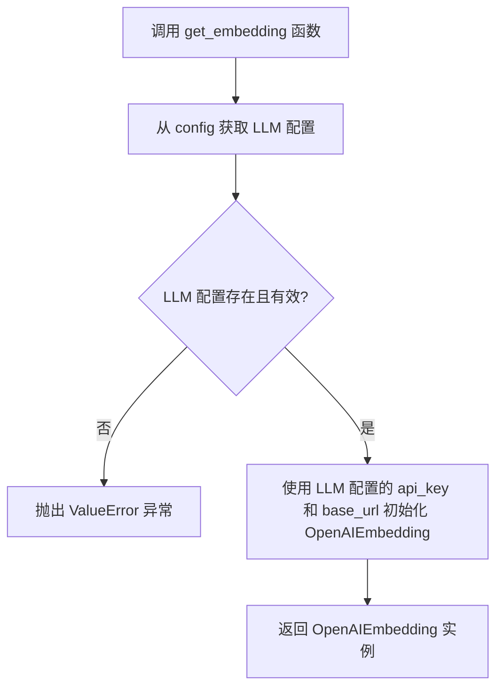
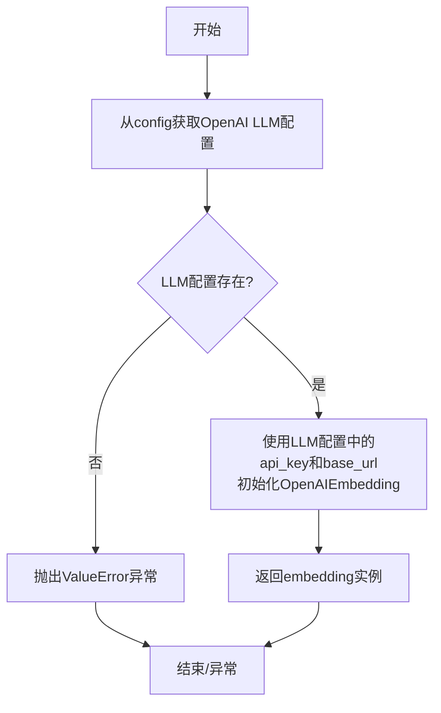

# `.\MetaGPT\metagpt\utils\embedding.py` 详细设计文档

该代码文件提供了一个工厂函数，用于根据全局配置创建并返回一个OpenAIEmbedding实例。它从配置中获取OpenAI LLM的配置信息，验证配置有效性，并使用这些配置（API密钥和基础URL）来初始化嵌入模型。

## 整体流程



## 类结构

```
OpenAIEmbedding (外部类)
├── api_key (字段)
└── api_base (字段)
```

## 全局变量及字段


### `config`
    
全局配置对象，用于获取和管理应用程序的配置信息，特别是LLM（大语言模型）相关的设置。

类型：`metagpt.config2.Config`
    


    

## 全局函数及方法


### `get_embedding`

该函数用于创建并返回一个基于OpenAI API的文本嵌入（Embedding）客户端实例。它从全局配置中读取OpenAI LLM的配置信息，并利用其中的API密钥和基础URL来初始化`OpenAIEmbedding`对象。

参数：
- 无

返回值：`OpenAIEmbedding`，一个配置好的OpenAI文本嵌入客户端实例，可用于将文本转换为向量表示。

#### 流程图



#### 带注释源码

```python
def get_embedding() -> OpenAIEmbedding:
    # 从全局配置对象`config`中获取OpenAI大语言模型(LLM)的配置信息。
    llm = config.get_openai_llm()
    
    # 检查是否成功获取到LLM配置。如果配置不存在（例如，api_type未设置为'openai'），则抛出异常。
    if llm is None:
        raise ValueError("To use OpenAIEmbedding, please ensure that config.llm.api_type is correctly set to 'openai'.")

    # 使用从LLM配置中提取的API密钥(api_key)和API基础地址(base_url)来实例化OpenAIEmbedding客户端。
    embedding = OpenAIEmbedding(api_key=llm.api_key, api_base=llm.base_url)
    
    # 返回创建好的嵌入客户端实例，供后续代码调用以生成文本嵌入向量。
    return embedding
```


## 关键组件


### OpenAIEmbedding 集成

封装了从 LlamaIndex 库导入的 OpenAIEmbedding 类，用于生成文本的向量嵌入表示。

### 配置驱动的嵌入模型获取

通过统一的配置对象 `config` 动态获取 OpenAI LLM 的配置信息（如 API Key 和 Base URL），并据此初始化 OpenAIEmbedding 实例，实现了嵌入模型的配置化与集中管理。

### 错误处理与配置验证

在初始化嵌入模型前，验证配置中是否成功获取了 OpenAI LLM 的配置，若未获取则抛出明确的 `ValueError` 异常，确保依赖配置的正确性。


## 问题及建议


### 已知问题

-   **硬编码依赖**：代码直接依赖于 `llama_index.embeddings.openai.OpenAIEmbedding` 和 `metagpt.config2.config` 中的 `get_openai_llm` 方法。这导致函数与特定的嵌入模型提供商（OpenAI）和特定的配置获取方式紧密耦合，降低了模块的灵活性和可测试性。
-   **错误信息不精确**：当 `llm` 为 `None` 时，抛出的 `ValueError` 提示信息为 `"To use OpenAIEmbedding, please ensure that config.llm.api_type is correctly set to 'openai'."`。这个错误信息假设问题出在配置上，但 `llm` 为 `None` 可能有多种原因（例如配置项缺失、路径错误等），此信息可能无法准确指导用户定位根本原因。
-   **缺乏配置验证**：函数在创建 `OpenAIEmbedding` 实例时，仅使用了 `llm.api_key` 和 `llm.base_url`。它没有验证这些值是否有效（例如，`api_key` 是否非空、格式是否正确），可能导致在后续使用嵌入模型时才出现更隐蔽的错误。
-   **单例模式管理缺失**：每次调用 `get_embedding()` 都会创建一个新的 `OpenAIEmbedding` 实例。对于嵌入模型这类通常重量级且可复用的客户端，反复创建实例可能带来不必要的开销（如连接建立）。代码没有提供或集成任何实例缓存或单例管理机制。

### 优化建议

-   **引入抽象与依赖注入**：定义一个抽象的 `Embedding` 接口或基类。让 `get_embedding` 函数返回这个接口类型，并通过依赖注入（如从配置或工厂类）来获取具体的实现（如 `OpenAIEmbedding`）。这样可以轻松切换不同的嵌入模型（如 Azure OpenAI, HuggingFace 模型等），并提高代码的可测试性。
-   **改进错误处理与日志**：
    1.  细化错误信息，区分“配置未找到”、“配置项无效”等不同场景。
    2.  在抛出异常前，可以记录 `WARNING` 或 `ERROR` 级别的日志，包含更详细的上下文信息（如当前的配置键），便于调试。
    3.  考虑对 `api_key` 等关键配置进行非空或格式校验，并在初始化失败时提供更明确的异常。
-   **实现实例缓存**：将 `get_embedding` 函数改造为返回一个缓存的、单例的嵌入模型实例。可以使用模块级变量、`functools.lru_cache` 装饰器或专门的客户端管理类来实现。这能避免重复初始化，提升性能。
-   **增强配置的灵活性**：允许通过函数参数覆盖部分默认配置（如 `api_base`, `model` 等），而不是完全依赖于全局配置。这为特定场景下的定制提供了便利。
-   **代码健壮性**：在 `llm` 对象上使用 `getattr` 或进行属性存在性检查，以避免在 `llm` 结构意外变化时导致 `AttributeError`。


## 其它


### 设计目标与约束

本模块的设计目标是提供一个统一的接口，用于获取基于 OpenAI 服务的文本嵌入（Embedding）模型实例。其核心约束包括：
1.  **依赖配置**：模块的行为完全由外部的 `metagpt.config2.config` 配置对象驱动，特别是其中的 LLM 配置部分。
2.  **供应商锁定**：当前实现紧密绑定于 `llama_index.embeddings.openai.OpenAIEmbedding` 类，即 OpenAI 的嵌入服务。
3.  **轻量封装**：模块本身不管理状态或生命周期，仅作为一个工厂函数，根据配置动态创建并返回客户端实例。
4.  **配置验证**：在创建实例前，需验证配置的有效性，确保必要的参数（如 API 类型）已正确设置。

### 错误处理与异常设计

模块的错误处理策略如下：
1.  **配置缺失错误**：当 `config.get_openai_llm()` 返回 `None` 时，表明配置中未正确设置 OpenAI LLM 相关参数（例如 `api_type` 不为 `'openai'`）。此时，函数将主动抛出 `ValueError` 异常，并附带明确的错误信息，指导用户检查配置。这是一种快速失败（Fail-Fast）策略，旨在尽早暴露配置问题。
2.  **依赖库异常**：在实例化 `OpenAIEmbedding` 时，如果传入的参数无效（如 `api_key` 为空或格式错误），或者网络请求失败，将抛出由 `llama_index` 或底层 `openai` 库定义的异常（例如 `AuthenticationError`, `APIConnectionError` 等）。这些异常会由调用者捕获和处理，本模块不进行额外封装。
3.  **无静默失败**：模块避免了静默返回 `None` 或无效对象的情况，确保调用者能明确知晓操作成功（返回有效对象）或失败（抛出异常）。

### 数据流与状态机

本模块无内部状态，其数据流是线性的、无状态的：
1.  **输入**：唯一的输入是来自全局配置 `config` 的数据。函数 `get_embedding` 不接收任何显式参数。
2.  **处理**：
    a. 从 `config` 中读取 LLM 配置。
    b. 验证配置有效性（是否为 OpenAI 类型且非空）。
    c. 使用配置中的 `api_key` 和 `base_url` 构造 `OpenAIEmbedding` 实例。
3.  **输出**：返回构造好的 `OpenAIEmbedding` 实例。
4.  **状态**：不维护任何模块级别的状态。每次调用都是独立的。

### 外部依赖与接口契约

1.  **外部依赖**：
    *   `llama_index.embeddings.openai.OpenAIEmbedding`：核心功能依赖，用于创建嵌入模型客户端。
    *   `metagpt.config2.config`：配置源依赖。假设该对象已正确初始化，并提供了 `get_openai_llm()` 方法，该方法返回一个包含 `api_key` 和 `base_url` 属性的对象（或 `None`）。
2.  **接口契约**：
    *   **函数 `get_embedding`**：
        *   **前置条件 (Pre-condition)**：全局 `config` 对象必须已初始化，且其 `llm` 配置部分支持 `get_openai_llm()` 调用。
        *   **后置条件 (Post-condition)**：如果函数成功返回，则返回值是一个可用的 `OpenAIEmbedding` 实例。如果配置无效，则抛出 `ValueError`。
        *   **调用者责任**：调用者需处理可能抛出的 `ValueError`（配置错误）及 `OpenAIEmbedding` 初始化或后续使用中可能抛出的各种异常。
    *   **与配置系统的契约**：模块期望 `config.get_openai_llm()` 返回的对象结构稳定。如果配置系统的接口或返回的数据结构发生变化，此模块必须同步更新。

### 安全与合规考虑

1.  **敏感信息处理**：API Key 作为敏感信息，通过配置系统 (`config`) 管理，本模块仅进行读取和传递，不进行存储、记录或硬编码。这符合将密钥与代码分离的安全最佳实践。
2.  **网络通信**：通过 `OpenAIEmbedding` 发出的请求，其安全性（如 TLS 加密）由底层的 `openai` 库和网络基础设施保障。
3.  **合规性**：使用本模块意味着将文本数据发送至 OpenAI 的服务器进行处理。调用者需确保其使用场景和数据内容符合 OpenAI 的使用条款、相关法律法规（如 GDPR, CCPA）以及其自身组织的合规要求。

### 测试策略建议

1.  **单元测试**：
    *   **配置有效**：模拟 `config.get_openai_llm()` 返回有效的配置对象，验证 `get_embedding` 返回正确类型的 `OpenAIEmbedding` 实例，且其初始化参数与模拟配置一致。
    *   **配置无效**：模拟 `config.get_openai_llm()` 返回 `None`，验证 `get_embedding` 抛出 `ValueError` 异常。
    *   **依赖注入测试**：可考虑通过依赖注入将配置源传入，以提高可测试性，避免对全局状态的依赖。
2.  **集成测试**：在拥有有效 OpenAI API 密钥的测试环境中，调用 `get_embedding` 获取实例，并执行一次简单的嵌入查询（如对短文本调用 `get_text_embedding`），验证整个链路（配置->实例化->API调用）是否畅通。
3.  **模拟测试**：使用 `unittest.mock` 对 `OpenAIEmbedding` 的初始化过程进行模拟，避免在单元测试中产生真实的网络调用和费用。


    