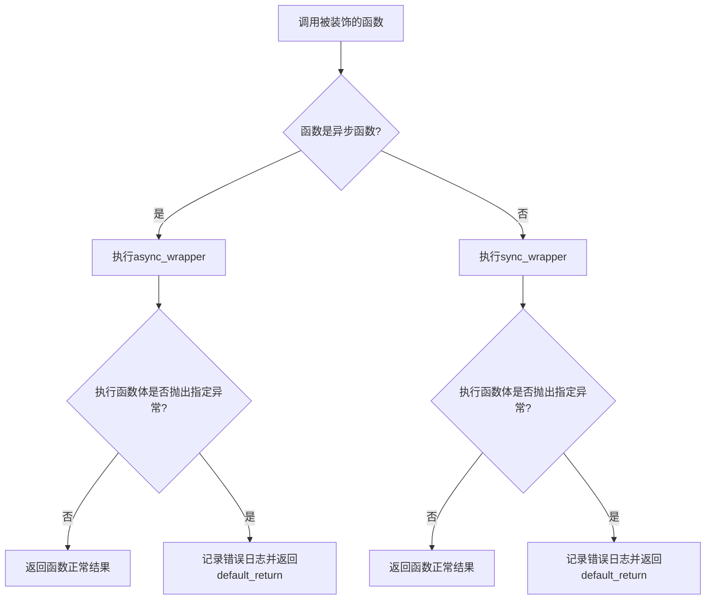
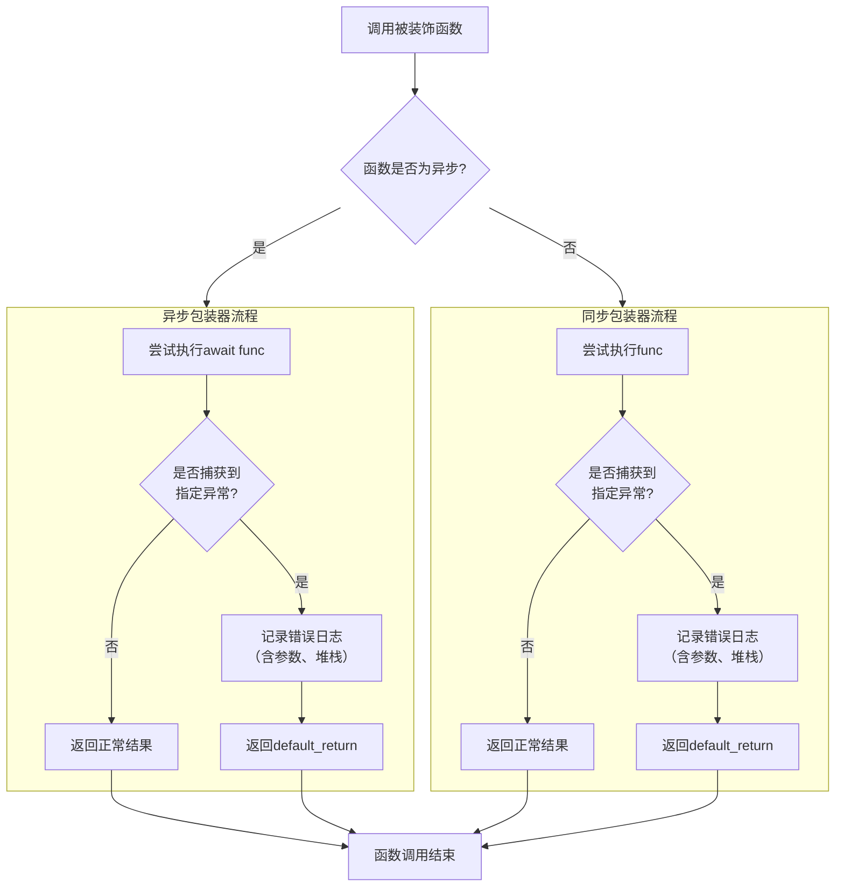

# `.\MetaGPT\metagpt\utils\exceptions.py` 详细设计文档

该代码提供了一个名为 `handle_exception` 的通用异常处理装饰器，用于包装同步或异步函数。当被装饰的函数抛出指定类型的异常时，该装饰器会捕获异常、记录详细的错误日志（包括函数名、参数和堆栈跟踪），并返回一个预设的默认值，从而增强代码的健壮性，避免因未处理的异常导致程序崩溃。

## 整体流程



## 类结构

```
全局函数
└── handle_exception (装饰器工厂函数)
    ├── decorator (内部装饰器函数)
    │   ├── async_wrapper (异步包装器)
    │   └── sync_wrapper (同步包装器)
```

## 全局变量及字段


### `ReturnType`
    
一个泛型类型变量，用于装饰器函数中，表示被装饰函数的返回值类型，以提供类型安全。

类型：`TypeVar`
    


    

## 全局函数及方法

### `handle_exception`

这是一个通用的异常处理装饰器，用于包装同步或异步函数。当被装饰的函数抛出指定类型的异常时，装饰器会捕获该异常，记录详细的错误日志（包括函数名、参数和堆栈跟踪），并返回一个预设的默认值，从而防止异常向上传播导致程序崩溃。

参数：

-   `_func`：`Callable[..., ReturnType]`，可选参数。当装饰器以`@handle_exception`形式使用时，此参数为被装饰的函数；当以`@handle_exception(...)`形式使用时，此参数为`None`。
-   `exception_type`：`Union[Type[Exception], Tuple[Type[Exception], ...]]`，关键字参数。指定要捕获的异常类型，默认为`Exception`（捕获所有异常）。
-   `exception_msg`：`str`，关键字参数。自定义的错误信息前缀，会附加到日志中。
-   `default_return`：`Any`，关键字参数。当异常发生时，函数返回的默认值。

返回值：`Callable[..., ReturnType]`，返回一个装饰器函数，该装饰器会返回一个包装了原始函数的新函数（包装器）。

#### 流程图



#### 带注释源码

```python
def handle_exception(
    # _func: 被装饰的原始函数。当装饰器带参数使用时，此值为None。
    _func: Callable[..., ReturnType] = None,
    *,
    # exception_type: 要捕获的异常类型，可以是单个异常类或元组。
    exception_type: Union[Type[Exception], Tuple[Type[Exception], ...]] = Exception,
    # exception_msg: 自定义的错误信息，会添加到日志中。
    exception_msg: str = "",
    # default_return: 发生异常时返回的默认值。
    default_return: Any = None,
) -> Callable[..., ReturnType]:
    """handle exception, return default value"""

    # decorator: 实际的装饰器函数，接收被装饰函数`func`作为参数。
    def decorator(func: Callable[..., ReturnType]) -> Callable[..., ReturnType]:

        # async_wrapper: 用于包装异步函数的包装器。
        @functools.wraps(func)
        async def async_wrapper(*args: Any, **kwargs: Any) -> ReturnType:
            try:
                # 尝试执行原始的异步函数并返回其结果。
                return await func(*args, **kwargs)
            except exception_type as e:
                # 如果捕获到指定异常，则记录错误日志。
                # logger.opt(depth=1)确保日志指向调用者，而非装饰器内部。
                logger.opt(depth=1).error(
                    f"{e}: {exception_msg}, "
                    f"\nCalling {func.__name__} with args: {args}, kwargs: {kwargs} "
                    f"\nStack: {traceback.format_exc()}" # 记录完整的堆栈跟踪。
                )
                # 返回预设的默认值。
                return default_return

        # sync_wrapper: 用于包装同步函数的包装器。
        @functools.wraps(func)
        def sync_wrapper(*args: Any, **kwargs: Any) -> ReturnType:
            try:
                # 尝试执行原始的同步函数并返回其结果。
                return func(*args, **kwargs)
            except exception_type as e:
                # 如果捕获到指定异常，则记录错误日志。
                logger.opt(depth=1).error(
                    f"Calling {func.__name__} with args: {args}, kwargs: {kwargs} failed: {e}, "
                    f"stack: {traceback.format_exc()}"
                )
                # 返回预设的默认值。
                return default_return

        # 根据原始函数是异步还是同步，返回对应的包装器。
        if asyncio.iscoroutinefunction(func):
            return async_wrapper
        else:
            return sync_wrapper

    # 处理装饰器的两种使用语法：@handle_exception 和 @handle_exception(...)
    if _func is None:
        # 当装饰器带参数使用时（@handle_exception(...)），返回decorator函数。
        return decorator
    else:
        # 当装饰器不带参数使用时（@handle_exception），直接应用decorator到_func上。
        return decorator(_func)
```

## 关键组件


### 异常处理装饰器 (handle_exception)

一个通用的、支持同步和异步函数的异常处理装饰器，用于捕获指定类型的异常，记录详细的错误信息（包括函数名、参数、调用栈），并返回一个预设的默认值，从而增强代码的健壮性。

### 日志记录集成

通过集成 `metagpt.logs.logger`，在捕获异常时，使用 `logger.opt(depth=1).error(...)` 记录错误日志。`depth=1` 参数确保日志调用点的信息准确，避免了装饰器本身对日志源位置的干扰，使得日志更易于追踪。

### 类型注解与泛型支持

使用 `typing` 模块中的 `TypeVar`、`Callable`、`Union`、`Tuple` 等工具为装饰器及其包装的函数提供了完整的类型注解，增强了代码的可读性和静态类型检查（如通过 mypy）的支持，确保了装饰器能正确处理不同类型的函数和返回值。


## 问题及建议


### 已知问题

-   **异常处理过于宽泛**：装饰器的默认异常类型是 `Exception`，这会捕获所有异常，包括 `KeyboardInterrupt` (Ctrl+C) 和 `SystemExit` 等通常不应被静默处理的异常，可能导致程序无法正常终止。
-   **日志输出不一致**：异步包装器 (`async_wrapper`) 和同步包装器 (`sync_wrapper`) 的日志格式不一致。异步包装器的日志将异常信息 `e` 放在了开头，而同步包装器将其放在了中间，这不利于日志的统一分析和解析。
-   **返回值类型安全缺失**：装饰器返回 `default_return`，但其类型 `Any` 可能与函数声明的返回类型 `ReturnType` 不匹配，这破坏了静态类型检查，可能导致运行时类型错误。
-   **错误信息可能丢失**：当异常发生时，原始异常被捕获并记录日志后，仅返回 `default_return`，调用者无法感知到异常的发生（除非检查返回值），这可能导致程序在错误状态下继续运行，产生不可预知的结果。
-   **装饰器应用不直观**：装饰器支持两种使用方式（`@handle_exception` 和 `@handle_exception(...)`），但内部逻辑（通过检查 `_func` 是否为 `None`）对于不熟悉此模式的开发者可能不够清晰。

### 优化建议

-   **限制默认异常捕获范围**：将 `exception_type` 的默认值从 `Exception` 改为更具体的异常元组，例如 `(Exception,)`，并在文档中明确说明它不会捕获 `BaseException` 的子类（如 `KeyboardInterrupt`）。更好的做法是鼓励使用者明确指定要处理的异常类型。
-   **统一日志格式**：重构 `async_wrapper` 和 `sync_wrapper` 中的日志记录代码，使用相同的格式字符串，确保输出的日志结构一致，便于后续的日志聚合与分析。
-   **增强类型安全性**：考虑为 `default_return` 参数添加类型注解，使其与 `ReturnType` 关联。虽然 Python 运行时无法强制，但这能提供更好的类型提示。或者，可以引入一个哨兵值（如 `object()`）来表示“无有效返回值”，并在调用处进行更严格的检查。
-   **提供异常重抛或更丰富的错误处理选项**：修改装饰器，增加一个参数（如 `reraise: bool = False`）或一个回调函数参数（如 `on_exception: Callable`），允许调用者选择是静默处理、记录后重抛原始异常，还是执行自定义的错误恢复逻辑。
-   **明确装饰器使用约定**：简化装饰器逻辑，只支持一种使用方式（如只支持带参数的形式 `@handle_exception(...)`），可以提高代码的可读性和可维护性。或者，在文档中提供清晰的示例说明两种用法。
-   **分离同步与异步逻辑**：考虑创建两个独立的装饰器 `handle_sync_exception` 和 `handle_async_exception`，以避免在单个函数内部进行 `asyncio.iscoroutinefunction` 的判断，使每个装饰器的职责更单一，逻辑更清晰。


## 其它


### 设计目标与约束

该模块的核心设计目标是提供一个通用、灵活且类型安全的异常处理装饰器，用于统一处理同步和异步函数中的异常。其主要约束包括：1) 必须同时支持同步和异步函数，且能自动识别函数类型；2) 装饰器需保持被装饰函数的元信息（如 `__name__`）；3) 允许调用者自定义捕获的异常类型、异常日志信息和默认返回值；4) 异常处理逻辑应记录详细的错误上下文（包括参数和堆栈信息）以便于调试。

### 错误处理与异常设计

本模块的核心功能即为错误处理。它通过一个装饰器 `handle_exception` 将 `try-except` 逻辑封装起来。设计上，它允许指定要捕获的 `exception_type`（默认为所有 `Exception`），当捕获到指定异常时，会记录包含函数名、调用参数、异常信息和完整堆栈跟踪的详细错误日志，然后返回一个用户定义的 `default_return` 值，从而允许函数在出错时优雅降级，避免异常向上传播导致程序崩溃。这种设计将错误处理逻辑与业务逻辑解耦。

### 数据流与状态机

此模块不涉及复杂的状态机。其数据流相对简单：当被装饰的函数被调用时，控制流进入装饰器生成的包装函数（`sync_wrapper` 或 `async_wrapper`）。包装函数尝试执行原函数，数据流在此处可能发生分叉：1) 若执行成功，原函数的返回值作为包装函数的返回值直接返回；2) 若执行中抛出符合 `exception_type` 的异常，控制流跳转到 `except` 块，在此记录日志并将 `default_return` 值作为包装函数的返回值返回。整个过程中，函数本身无内部状态变化。

### 外部依赖与接口契约

*   **外部依赖**:
    1.  `asyncio`: 用于检测函数是否为协程函数 (`iscoroutinefunction`)。
    2.  `functools.wraps`: 用于保留被装饰函数的元数据。
    3.  `traceback`: 用于获取和格式化异常的堆栈跟踪信息。
    4.  `metagpt.logs.logger`: 项目内部的日志记录器，用于输出结构化的错误日志。这是该模块对项目基础设施的关键依赖。

*   **接口契约**:
    1.  **装饰器接口 (`handle_exception`)**:
        *   **输入**: 可通过关键字参数配置 `exception_type`, `exception_msg`, `default_return`。
        *   **输出**: 返回一个装饰器函数，该装饰器生成的新函数（包装器）与原函数具有相同的调用签名。
        *   **行为**: 包装器函数需捕获指定异常，记录日志，并返回默认值。对于异步函数，包装器本身也是异步的。
    2.  **被装饰函数**: 无特殊要求，可以是任何同步或异步的可调用对象。装饰器不改变其原有的参数和返回值类型约定（通过 `TypeVar` 和类型注解保持）。

    