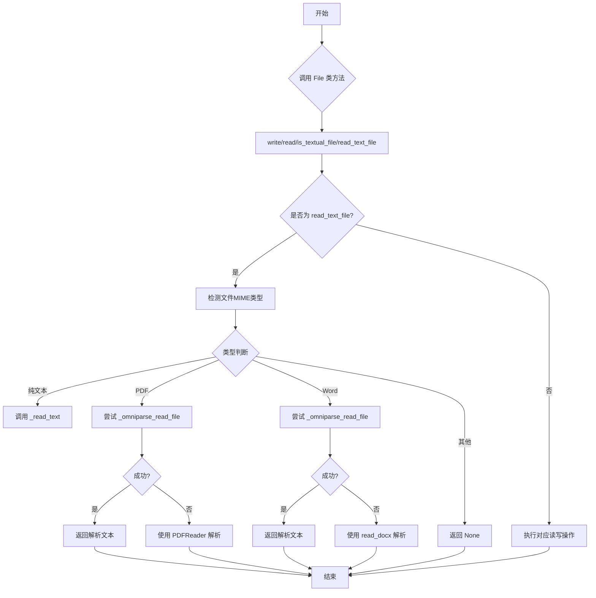
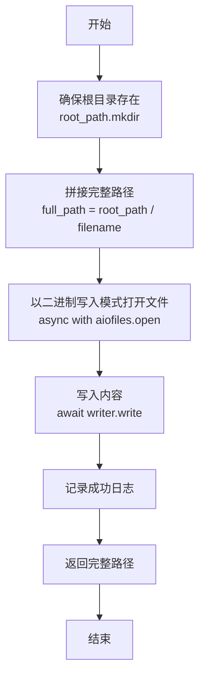
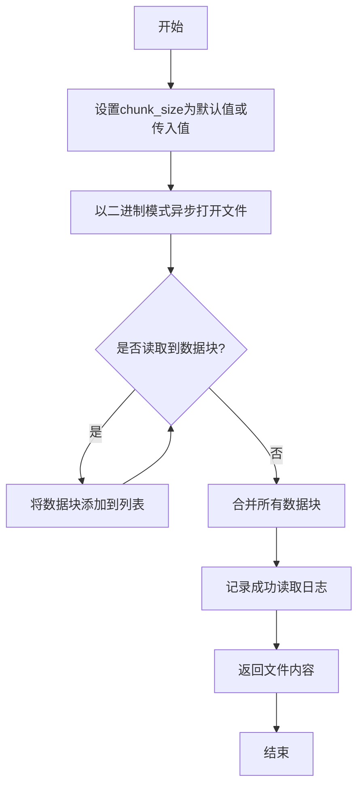
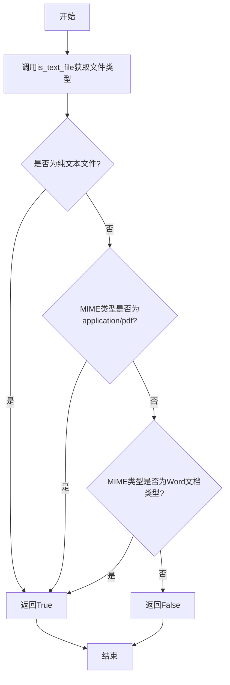
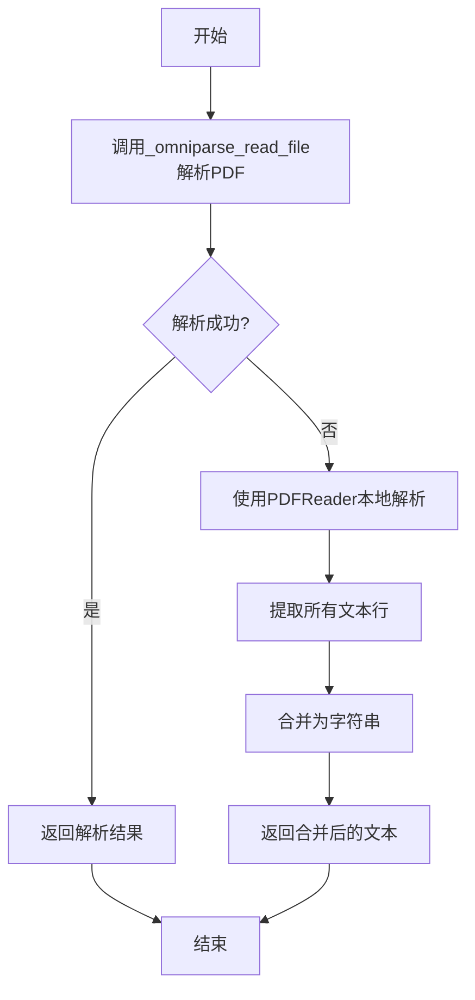
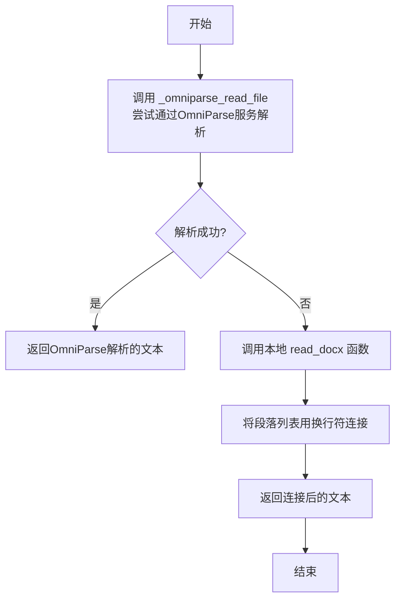
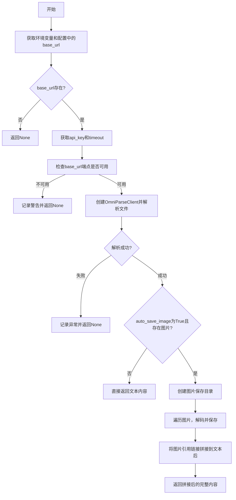
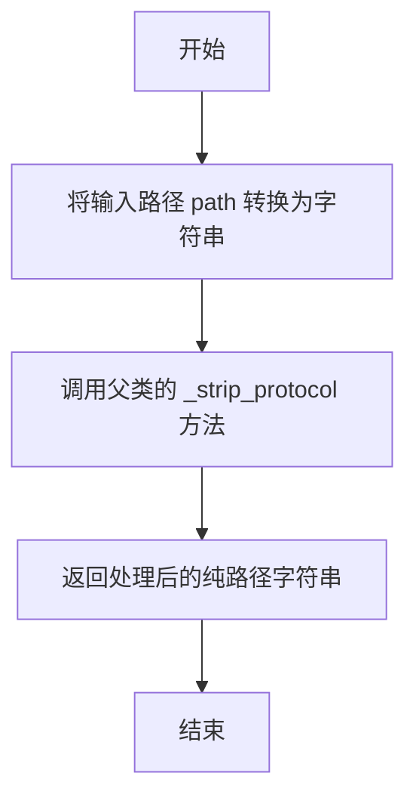

# `.\MetaGPT\metagpt\utils\file.py` 详细设计文档

该文件提供了一个通用的文件操作工具类 `File` 和一个内存文件系统类 `MemoryFileSystem`。`File` 类封装了异步的文件读写、文本文件检测以及多种格式（纯文本、PDF、Word文档）的内容读取功能，支持通过本地库或外部服务（OmniParse）进行文档解析。`MemoryFileSystem` 继承自 fsspec 的内存文件系统，用于内存中的文件操作。

## 整体流程



## 类结构

```
File (文件操作工具类)
├── 类字段: CHUNK_SIZE
├── 类方法: write, read, is_textual_file, read_text_file, _read_text, _read_pdf, _read_docx, _omniparse_read_file, _read_omniparse_config
MemoryFileSystem (内存文件系统类)
└── 类方法: _strip_protocol
```

## 全局变量及字段


### `File.CHUNK_SIZE`
    
类常量，定义文件读写操作中默认的数据块大小（64KB），用于优化大文件的处理性能。

类型：`int`
    
    

## 全局函数及方法

### `File.write`

这是一个类方法，用于将二进制内容异步写入到本地指定的路径。它会确保目标目录存在，然后以二进制写入模式打开文件，将内容写入后返回完整的文件路径。

参数：

- `root_path`：`Path`，文件存储的根目录路径，例如 "/data"。
- `filename`：`str`，要写入的文件名，例如 "test.txt"。
- `content`：`bytes`，要写入文件的二进制内容。

返回值：`Path`，写入成功后返回文件的完整路径，例如 "/data/test.txt"。

#### 流程图



#### 带注释源码

```python
@classmethod
@handle_exception
async def write(cls, root_path: Path, filename: str, content: bytes) -> Path:
    """Write the file content to the local specified path.

    Args:
        root_path: The root path of file, such as "/data".
        filename: The name of file, such as "test.txt".
        content: The binary content of file.

    Returns:
        The full filename of file, such as "/data/test.txt".

    Raises:
        Exception: If an unexpected error occurs during the file writing process.
    """
    # 确保目标目录存在，如果不存在则创建
    root_path.mkdir(parents=True, exist_ok=True)
    # 拼接出文件的完整路径
    full_path = root_path / filename
    # 使用 aiofiles 异步地以二进制写入模式打开文件
    async with aiofiles.open(full_path, mode="wb") as writer:
        # 将二进制内容写入文件
        await writer.write(content)
        # 记录成功写入的日志
        logger.debug(f"Successfully write file: {full_path}")
        # 返回文件的完整路径
        return full_path
```

### `File.read`

该方法用于从本地指定路径分块读取文件内容，支持异步操作，适用于大文件读取场景。

参数：

- `file_path`：`Path`，文件的完整路径，例如 "/data/test.txt"
- `chunk_size`：`int`，每个数据块的大小（字节），默认为64KB

返回值：`bytes`，文件的二进制内容

#### 流程图



#### 带注释源码

```python
@classmethod
@handle_exception
async def read(cls, file_path: Path, chunk_size: int = None) -> bytes:
    """Partitioning read the file content from the local specified path.

    Args:
        file_path: The full file name of file, such as "/data/test.txt".
        chunk_size: The size of each chunk in bytes (default is 64kb).

    Returns:
        The binary content of file.

    Raises:
        Exception: If an unexpected error occurs during the file reading process.
    """
    # 设置块大小，如果未传入则使用类常量CHUNK_SIZE（64KB）
    chunk_size = chunk_size or cls.CHUNK_SIZE
    
    # 异步打开文件进行二进制读取
    async with aiofiles.open(file_path, mode="rb") as reader:
        chunks = list()  # 存储读取的数据块
        
        # 循环读取文件直到结束
        while True:
            chunk = await reader.read(chunk_size)  # 读取指定大小的数据块
            if not chunk:  # 如果读取到空数据，表示文件已结束
                break
            chunks.append(chunk)  # 将数据块添加到列表
        
        # 合并所有数据块得到完整文件内容
        content = b"".join(chunks)
        
        # 记录成功读取的日志
        logger.debug(f"Successfully read file, the path of file: {file_path}")
        
        return content  # 返回文件的二进制内容
```

### `File.is_textual_file`

该方法用于判断给定的文件是否为文本文件。它通过检查文件的MIME类型来确定文件是否为纯文本文件或特定格式的文本文件（如PDF和Microsoft Word文档）。

参数：

- `filename`：`Union[str, Path]`，要检查的文件路径，可以是字符串或Path对象。

返回值：`bool`，如果文件是文本文件则返回True，否则返回False。

#### 流程图



#### 带注释源码

```python
@staticmethod
async def is_textual_file(filename: Union[str, Path]) -> bool:
    """Determines if a given file is a textual file.

    A file is considered a textual file if it is plain text or has a
    specific set of MIME types associated with textual formats,
    including PDF and Microsoft Word documents.

    Args:
        filename (Union[str, Path]): The path to the file to be checked.

    Returns:
        bool: True if the file is a textual file, False otherwise.
    """
    # 调用is_text_file函数获取文件是否为纯文本文件及其MIME类型
    is_text, mime_type = await is_text_file(filename)
    # 如果是纯文本文件，直接返回True
    if is_text:
        return True
    # 如果MIME类型为PDF，返回True
    if mime_type == "application/pdf":
        return True
    # 如果MIME类型为Microsoft Word文档类型，返回True
    if mime_type in {
        "application/msword",
        "application/vnd.openxmlformats-officedocument.wordprocessingml.document",
        "application/vnd.ms-word.document.macroEnabled.12",
        "application/vnd.openxmlformats-officedocument.wordprocessingml.template",
        "application/vnd.ms-word.template.macroEnabled.12",
    }:
        return True
    # 其他情况返回False
    return False
```

### `File.read_text_file`

读取指定文件的全部内容，支持文本文件、PDF和Word文档，根据文件类型调用相应的解析方法。

参数：

- `filename`：`Union[str, Path]`，文件的路径，可以是字符串或Path对象

返回值：`Optional[str]`，文件的内容字符串，如果文件无法解析则返回None

#### 流程图


#### 带注释源码

```python
@staticmethod
async def read_text_file(filename: Union[str, Path]) -> Optional[str]:
    """Read the whole content of a file. Using absolute paths as the argument for specifying the file location."""
    # 1. 检测文件类型
    is_text, mime_type = await is_text_file(filename)
    
    # 2. 根据文件类型调用相应的解析方法
    if is_text:
        # 文本文件：直接读取
        return await File._read_text(filename)
    if mime_type == "application/pdf":
        # PDF文件：调用PDF解析
        return await File._read_pdf(filename)
    if mime_type in {
        "application/msword",
        "application/vnd.openxmlformats-officedocument.wordprocessingml.document",
        "application/vnd.ms-word.document.macroEnabled.12",
        "application/vnd.openxmlformats-officedocument.wordprocessingml.template",
        "application/vnd.ms-word.template.macroEnabled.12",
    }:
        # Word文档：调用Word解析
        return await File._read_docx(filename)
    
    # 3. 不支持的文件类型返回None
    return None
```

### `File._read_text`

该方法是一个静态异步方法，用于读取纯文本文件的内容。它接受一个文件路径作为参数，并返回该文件的文本内容。该方法内部调用了另一个异步工具函数 `aread` 来执行实际的读取操作。

参数：

- `path`：`Union[str, Path]`，要读取的文本文件的路径，可以是字符串或 `Path` 对象。

返回值：`str`，读取到的文件文本内容。

#### 流程图


#### 带注释源码

```python
    @staticmethod
    async def _read_text(path: Union[str, Path]) -> str:
        # 调用通用的异步读取函数 aread，传入文件路径，并返回读取到的字符串内容。
        return await aread(path)
```

### `File._read_pdf`

该方法用于读取PDF文件的内容，并返回其文本表示。它首先尝试通过OmniParse服务解析PDF，如果失败，则回退到使用llama_index的PDFReader进行本地解析。

参数：

- `path`：`Union[str, Path]`，PDF文件的路径，可以是字符串或Path对象。

返回值：`str`，PDF文件的文本内容。

#### 流程图



#### 带注释源码

```python
@staticmethod
async def _read_pdf(path: Union[str, Path]) -> str:
    # 首先尝试通过OmniParse服务解析PDF文件
    result = await File._omniparse_read_file(path)
    if result:
        # 如果OmniParse解析成功，直接返回结果
        return result

    # 如果OmniParse解析失败，回退到使用llama_index的PDFReader进行本地解析
    from llama_index.readers.file import PDFReader

    reader = PDFReader()
    # 加载PDF文件并提取文本行
    lines = reader.load_data(file=Path(path))
    # 将所有文本行合并为一个字符串，以换行符分隔
    return "\n".join([i.text for i in lines])
```

### `File._read_docx`

`File._read_docx` 是一个静态方法，用于读取 `.docx` 格式的 Word 文档文件，并将其内容转换为纯文本字符串。它首先尝试通过 OmniParse 服务解析文档，如果服务不可用或解析失败，则回退到使用本地 `read_docx` 工具进行读取。

参数：

- `path`：`Union[str, Path]`，要读取的 `.docx` 文件的路径，可以是字符串或 `Path` 对象。

返回值：`str`，返回从 `.docx` 文件中提取出的纯文本内容，段落之间用换行符 `\n` 连接。

#### 流程图



#### 带注释源码

```python
    @staticmethod
    async def _read_docx(path: Union[str, Path]) -> str:
        # 1. 首先尝试调用 OmniParse 服务来解析文档
        result = await File._omniparse_read_file(path)
        # 2. 如果 OmniParse 服务返回了有效结果，则直接返回
        if result:
            return result
        # 3. 如果 OmniParse 服务不可用或解析失败，则回退到使用本地工具 read_docx
        #    read_docx 返回一个段落字符串列表
        return "\n".join(read_docx(str(path)))
```

### `File._omniparse_read_file`

该方法尝试使用OmniParse服务解析指定路径的文件（如PDF、DOCX等），并返回解析后的文本内容。如果解析成功且包含图片，可以选择自动保存图片到本地目录。

参数：

- `path`：`Union[str, Path]`，要解析的文件的路径，可以是字符串或Path对象。
- `auto_save_image`：`bool`，是否自动保存解析出的图片，默认为False。

返回值：`Optional[str]`，解析成功返回文本内容（字符串），失败返回None。

#### 流程图



#### 带注释源码

```python
    @staticmethod
    async def _omniparse_read_file(path: Union[str, Path], auto_save_image: bool = False) -> Optional[str]:
        # 导入必要的模块和函数
        from metagpt.tools.libs import get_env_default
        from metagpt.utils.omniparse_client import OmniParseClient

        # 1. 获取OmniParse服务的配置，优先级：环境变量 > 配置文件
        env_base_url = await get_env_default(key="base_url", app_name="OmniParse", default_value="")
        env_timeout = await get_env_default(key="timeout", app_name="OmniParse", default_value="")
        conf_base_url, conf_timeout = await File._read_omniparse_config()

        # 确定最终使用的base_url
        base_url = env_base_url or conf_base_url
        if not base_url:
            return None
        # 获取api_key
        api_key = await get_env_default(key="api_key", app_name="OmniParse", default_value="")
        # 确定最终使用的timeout，默认600秒
        timeout = env_timeout or conf_timeout or 600
        try:
            timeout = int(timeout)
        except ValueError:
            timeout = 600

        try:
            # 2. 检查配置的base_url是否是一个可用的HTTP端点
            if not await check_http_endpoint(url=base_url):
                logger.warning(f"{base_url}: NOT AVAILABLE")
                return None
            # 3. 创建OmniParse客户端
            client = OmniParseClient(api_key=api_key, base_url=base_url, max_timeout=timeout)
            # 读取文件的二进制数据
            file_data = await aread_bin(filename=path)
            # 4. 调用客户端解析文档
            ret = await client.parse_document(file_input=file_data, bytes_filename=str(path))
        except (ValueError, Exception) as e:
            # 5. 处理解析过程中可能出现的异常
            logger.exception(f"{path}: {e}")
            return None
        # 6. 如果没有图片或者不要求自动保存图片，直接返回文本
        if not ret.images or not auto_save_image:
            return ret.text

        # 7. 处理需要保存图片的情况
        result = [ret.text]
        # 创建图片保存目录，目录名为原文件名加上“_images”后缀
        img_dir = Path(path).parent / (Path(path).name.replace(".", "_") + "_images")
        img_dir.mkdir(parents=True, exist_ok=True)
        # 遍历解析结果中的所有图片
        for i in ret.images:
            # 将base64编码的图片数据解码
            byte_data = base64.b64decode(i.image)
            # 构造图片保存路径
            filename = img_dir / i.image_name
            # 将图片数据写入文件
            await awrite_bin(filename=filename, data=byte_data)
            # 将Markdown格式的图片引用链接添加到结果列表中
            result.append(f"})")
        # 8. 将所有文本（包括图片链接）用换行符连接并返回
        return "\n".join(result)
```

### `File._read_omniparse_config`

该方法用于读取OmniParse服务的配置信息，包括基础URL和超时时间。它首先检查全局配置对象中是否存在OmniParse配置，如果存在则返回配置中的`base_url`和`timeout`值；否则返回空字符串和0。

参数：

- 无

返回值：`Tuple[str, int]`，返回一个包含两个元素的元组，第一个元素是OmniParse服务的基础URL（字符串），第二个元素是超时时间（整数）。如果配置不存在，则返回空字符串和0。

#### 流程图


#### 带注释源码

```python
@staticmethod
async def _read_omniparse_config() -> Tuple[str, int]:
    # 检查全局配置对象config中是否存在omniparse配置，并且该配置的base_url不为空
    if config.omniparse and config.omniparse.base_url:
        # 如果配置存在，返回配置中的base_url和timeout
        return config.omniparse.base_url, config.omniparse.timeout
    # 如果配置不存在，返回空字符串和0作为默认值
    return "", 0
```

### `MemoryFileSystem._strip_protocol`

该方法用于从给定的文件路径字符串中移除协议前缀（例如 `"memory://"`），返回一个不包含协议部分的纯路径字符串。它是 `fsspec` 库中 `MemoryFileSystem` 类的内部方法，用于规范化路径，以便在内存文件系统中进行后续操作。

参数：

- `path`：`Any`，需要处理的文件路径。该方法内部会将其转换为字符串进行处理。

返回值：`str`，移除协议前缀后的纯路径字符串。

#### 流程图



#### 带注释源码

```python
@classmethod
def _strip_protocol(cls, path):
    # 调用父类 `_MemoryFileSystem` 的 `_strip_protocol` 方法，
    # 并将传入的 `path` 参数转换为字符串类型，以移除协议前缀。
    return super()._strip_protocol(str(path))
```

## 关键组件


### 文件读写操作

提供异步的文件写入和读取功能，支持分块读取以处理大文件。

### 文本文件识别与读取

通过MIME类型和文件内容检测，识别文本文件（包括纯文本、PDF、Word文档），并提供统一的异步读取接口。

### 外部文档解析服务集成

集成OmniParse服务，用于解析PDF和Word等复杂文档格式，支持图像提取和保存。

### 内存文件系统适配

继承并适配fsspec的内存文件系统，提供与Path对象兼容的协议处理。


## 问题及建议


### 已知问题

-   **OmniParse 服务依赖的健壮性不足**：`_omniparse_read_file` 方法在调用外部 OmniParse 服务时，虽然进行了端点可用性检查 (`check_http_endpoint`)，但整体错误处理较为简单。当服务不可用或返回意外数据时，仅记录日志并返回 `None`，可能导致上层调用者无法区分“文件内容为空”和“服务调用失败”这两种情况，影响系统的可观测性和故障排查。
-   **配置管理逻辑存在潜在冲突**：`_read_omniparse_config` 方法从全局 `config` 对象读取配置，而 `_omniparse_read_file` 方法优先使用环境变量。当环境变量和配置文件中的值不一致时，可能导致运行时行为与预期不符，且缺乏明确的配置优先级文档或验证。
-   **硬编码的默认值与魔法数字**：在 `_omniparse_read_file` 方法中，超时时间 `timeout` 的默认值 `600` 以及转换失败后的回退值 `600` 是硬编码的。这降低了代码的可配置性和可维护性，未来需要调整时必须在代码中多处修改。
-   **`MemoryFileSystem` 类的继承可能不完整**：`MemoryFileSystem` 类继承自 `fsspec` 的 `_MemoryFileSystem` 并重写了 `_strip_protocol` 方法。如果父类的其他方法依赖于对 `path` 类型的特定处理（例如期望 `str` 类型），此重写可能引入不一致性，且未经过充分测试覆盖。
-   **部分异常处理过于宽泛**：`@handle_exception` 装饰器被应用于 `write` 和 `read` 方法，虽然能捕获所有异常，但可能掩盖了具体的错误原因（如权限错误 `PermissionError`、文件未找到 `FileNotFoundError`），不利于调用者进行精细化的错误恢复。

### 优化建议

-   **增强外部服务调用的错误处理与状态反馈**：建议为 `_omniparse_read_file` 方法定义更明确的返回值或抛出更具业务含义的自定义异常。例如，可以区分“网络错误”、“服务内部错误”、“认证失败”等，或者返回一个包含状态码和详细信息的 `Result` 对象，使调用方能做出更合适的后续处理。
-   **明确并统一配置源优先级**：在项目文档或配置模块中明确说明 OmniParse 相关配置（`base_url`, `timeout`, `api_key`）的加载优先级（例如：环境变量 > 配置文件 > 默认值）。考虑在应用启动时进行一次性的配置验证和合并，而不是在每次方法调用时动态判断。
-   **将魔法数字提取为配置常量**：将 `_omniparse_read_file` 中的默认超时时间 `600` 提取到类常量或配置文件的可配置项中。例如，在 `File` 类中定义 `DEFAULT_OMNIPARSE_TIMEOUT = 600`，提高代码的可读性和可维护性。
-   **完善 `MemoryFileSystem` 的适配与测试**：审查 `fsspec` 的 `MemoryFileSystem` 父类，确保 `_strip_protocol` 方法的重写不会破坏其他功能。为该类编写单元测试，验证其与 `fsspec` 其他部分的兼容性，特别是当 `path` 为 `Path` 对象时的行为。
-   **细化异常处理策略**：评估 `@handle_exception` 装饰器的作用。如果目的是为了日志记录和防止崩溃，可以保留，但建议在装饰器内部或方法体内，对已知的、可预期的异常（如 `IOError` 的子类）进行更精细的捕获和处理，并重新抛出或转换为业务异常。对于未预期的异常，再由装饰器统一处理。
-   **考虑增加异步上下文管理器支持**：`File` 类的 `read` 和 `write` 方法每次调用都会打开和关闭文件。对于需要频繁读写同一文件的场景，可以考虑提供异步上下文管理器接口，允许用户在单个上下文中进行多次操作，以潜在提升性能。
-   **补充单元测试与集成测试**：针对 `File` 类的各个方法，特别是涉及外部依赖（OmniParse服务、PDF解析）和边界条件（大文件、空文件、非法路径）的情况，编写充分的单元测试和集成测试，确保代码的稳定性和可靠性。


## 其它


### 设计目标与约束

1.  **通用文件操作**：提供一个统一的、异步的接口，用于执行常见的文件操作（读、写），并支持多种文件格式（纯文本、PDF、Word文档）的内容提取。
2.  **异步高性能**：利用 `aiofiles` 库实现非阻塞的 I/O 操作，以提高在 I/O 密集型场景（如 Web 服务器）下的并发性能。
3.  **可扩展性与灵活性**：通过静态方法和类方法设计，便于直接调用，无需实例化。支持通过配置和外部服务（OmniParse）扩展文件解析能力。
4.  **错误处理与日志**：通过装饰器 `@handle_exception` 统一处理异常，并提供详细的日志记录，便于问题追踪。
5.  **内存文件系统集成**：继承 `fsspec` 的 `MemoryFileSystem`，提供内存中的文件系统操作能力，可能用于测试或缓存场景。

### 错误处理与异常设计

1.  **统一异常处理**：`File.write` 和 `File.read` 方法使用 `@handle_exception` 装饰器，旨在捕获并处理所有未预期的异常，防止程序因单个文件操作失败而崩溃，并记录错误日志。
2.  **条件检查与静默失败**：
    *   `_omniparse_read_file` 方法中，会检查 `base_url` 是否有效（`check_http_endpoint`），若无效则记录警告并返回 `None`，避免发起无效的网络请求。
    *   在调用外部服务（OmniParse）时，使用 `try...except` 块捕获 `ValueError` 和通用 `Exception`，记录异常详情后返回 `None`，实现服务降级。
3.  **返回值设计**：
    *   `read_text_file` 方法在无法识别或解析文件时返回 `None`，调用方需处理此情况。
    *   `_omniparse_read_file` 在配置缺失、服务不可用或解析失败时返回 `None`。
4.  **资源安全**：`write` 和 `read` 方法使用 `async with aiofiles.open(...) as ...` 确保文件句柄的正确打开和关闭，即使在发生异常时也能安全释放资源。

### 数据流与状态机

1.  **文件写入流程**：`调用者` -> `File.write(root_path, filename, content)` -> `创建目录` -> `打开文件（二进制写模式）` -> `写入内容` -> `记录日志` -> `返回完整路径`。
2.  **文件读取流程**：
    *   **二进制读取**：`调用者` -> `File.read(file_path, chunk_size)` -> `打开文件（二进制读模式）` -> `循环读取指定大小的数据块` -> `合并数据块` -> `记录日志` -> `返回二进制内容`。
    *   **文本内容提取**：`调用者` -> `File.read_text_file(filename)` -> `is_text_file 检测文件类型` -> 根据 MIME 类型分支：
        *   `text/*` -> `_read_text` (异步读取)。
        *   `application/pdf` -> `_read_pdf` (优先尝试 OmniParse，失败则回退到 llama_index PDFReader)。
        *   `application/msword` 等 -> `_read_docx` (优先尝试 OmniParse，失败则回退到 `read_docx` 工具函数)。
        *   其他类型 -> 返回 `None`。
3.  **外部服务调用流程** (OmniParse)：`_read_pdf` 或 `_read_docx` -> `_omniparse_read_file` -> `获取配置（环境变量 > 配置文件）` -> `检查服务端点可用性` -> `创建 OmniParseClient` -> `发送文件数据进行解析` -> `处理返回结果（文本和可选图片）`。

### 外部依赖与接口契约

1.  **第三方库**：
    *   `aiofiles`: 提供异步文件操作。
    *   `fsspec`: 提供抽象文件系统接口，`MemoryFileSystem` 是其内存实现。
    *   `llama-index` (通过 `llama_index.readers.file.PDFReader`): 用于 PDF 解析的回退方案。
    *   `metagpt.utils.read_docx`: 项目内部工具，用于解析 `.docx` 文件。
    *   `metagpt.utils.omniparse_client.OmniParseClient`: 项目内部客户端，用于与 OmniParse 服务交互。
2.  **配置依赖**：
    *   `metagpt.config2.config`: 全局配置对象，用于获取 `omniparse.base_url` 和 `omniparse.timeout`。
    *   环境变量 (`get_env_default`): 用于覆盖配置文件中的 OmniParse 服务设置 (`base_url`, `api_key`, `timeout`)。
3.  **接口契约**：
    *   `OmniParseClient.parse_document`: 期望接收二进制文件数据和文件名，返回包含 `text` 和 `images` 字段的对象。
    *   `check_http_endpoint`: 期望接收一个 URL 字符串，返回一个布尔值表示该 HTTP 端点是否可达。
    *   `aread`, `aread_bin`, `awrite_bin`: 项目内部的异步工具函数，分别用于异步读取文本、异步读取二进制和异步写入二进制。
4.  **隐式依赖**：代码中通过 `import` 动态导入 `PDFReader`，这要求运行时环境中必须安装 `llama-index` 库，否则在首次调用 `_read_pdf` 时会引发 `ImportError`。

### 安全考虑

1.  **路径遍历**：代码中直接使用 `Path` 对象进行路径拼接 (`root_path / filename`)，依赖于 `Pathlib` 的安全性和操作系统的路径解析。调用方需确保 `filename` 参数不包含恶意路径序列（如 `../../../etc/passwd`），否则可能导致文件被写入或读取到预期之外的位置。
2.  **内存使用**：
    *   `File.read` 方法虽然分块读取，但最终将所有块合并成一个 `bytes` 对象返回，对于超大文件可能导致内存消耗过高。
    *   `_omniparse_read_file` 方法将整个文件读入内存 (`aread_bin`) 后发送给外部服务，同样存在大文件内存压力。
3.  **外部服务风险**：依赖 OmniParse 服务进行文件解析，存在服务不可用、响应超时、返回恶意数据或泄露文件内容（如果服务不可信）的风险。代码通过超时设置和端点检查进行了部分缓解。
4.  **敏感信息**：OmniParse 的 `api_key` 通过环境变量获取，这是一种常见的敏感信息管理方式，但需确保环境变量本身的安全。

### 测试策略建议

1.  **单元测试**：
    *   `File.write` 和 `File.read`: 测试正常写入/读取、路径不存在时的创建、空内容、大文件分块。
    *   `File.is_textual_file` 和 `File.read_text_file`: 使用模拟的 MIME 类型检测结果，测试对不同类型文件的分支逻辑。
    *   `_read_text`, `_read_pdf`, `_read_docx`: 使用模拟文件或固定测试文件，验证内容提取的正确性。
    *   `_omniparse_read_file`: 模拟 `OmniParseClient` 和 `check_http_endpoint`，测试配置加载、服务调用成功/失败、图片保存等场景。
2.  **集成测试**：
    *   测试与真实本地文件系统的交互。
    *   在配置了有效 OmniParse 服务的情况下，测试端到端的 PDF/Word 文件解析流程。
3.  **异常测试**：模拟文件权限错误、磁盘空间不足、网络超时、服务返回异常等场景，验证错误处理逻辑和日志记录。
4.  **性能测试**：针对大文件，测试 `read` 方法的内存使用和耗时；测试并发文件操作时的性能表现。


    