# `.\MetaGPT\metagpt\utils\file_repository.py` 详细设计文档

该代码实现了一个文件仓库管理类 FileRepository，它封装了与 Git 仓库交互的文件操作，包括文件的保存、读取、删除、依赖关系管理以及变更文件追踪等功能。它作为 GitRepository 的辅助类，提供了基于相对路径的文件操作抽象，支持文档的序列化和依赖关系维护。

## 整体流程

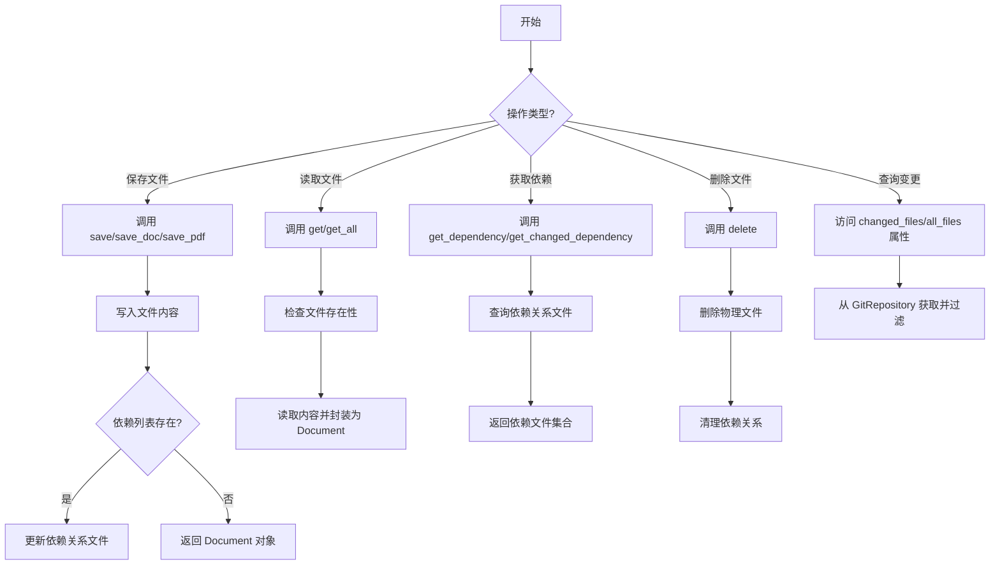

## 类结构

```
FileRepository
├── 字段: _relative_path, _git_repo
├── 属性: workdir, root_path, changed_files, all_files
├── 实例方法: save, get_dependency, get_changed_dependency, get, get_all, get_change_dir_files, save_doc, save_pdf, delete
└── 静态方法: new_filename
```

## 全局变量及字段


### `FileRepository._relative_path`
    
The relative path within the Git repository that this FileRepository instance manages.

类型：`Path`
    


### `FileRepository._git_repo`
    
The associated GitRepository instance that provides version control and dependency management capabilities.

类型：`GitRepository`
    
    

## 全局函数及方法

### `FileRepository.__init__`

初始化一个与Git仓库关联的FileRepository实例，设置其相对路径和关联的GitRepository实例，并确保工作目录存在。

参数：

- `git_repo`：`GitRepository`，关联的GitRepository实例
- `relative_path`：`Path`，在Git仓库内的相对路径，默认为当前目录

返回值：`None`，无返回值

#### 流程图

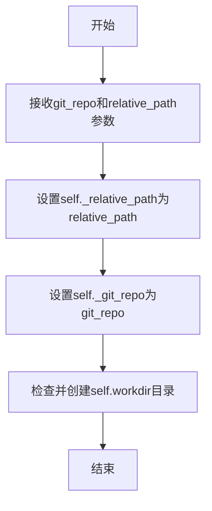

#### 带注释源码

```python
def __init__(self, git_repo, relative_path: Path = Path(".")):
    """Initialize a FileRepository instance.

    :param git_repo: The associated GitRepository instance.
    :param relative_path: The relative path within the Git repository.
    """
    # 设置实例的相对路径属性
    self._relative_path = relative_path
    # 设置关联的GitRepository实例
    self._git_repo = git_repo

    # 初始化工作目录，确保目录存在
    self.workdir.mkdir(parents=True, exist_ok=True)
```

### `FileRepository.save`

该方法用于将内容保存到文件仓库中的指定文件，并可选地更新该文件的依赖关系。它会确保目标目录存在，将内容写入文件，如果提供了依赖列表，则通过关联的Git仓库更新依赖文件，最后返回一个表示已保存文件的Document对象。

参数：

- `filename`：`Path | str`，要保存的文件名或路径（相对于当前FileRepository的工作目录）
- `content`：`any`，要保存到文件的内容
- `dependencies`：`List[str]`，可选参数，表示该文件依赖的其他文件路径列表

返回值：`Document`，返回一个Document对象，其中包含文件的根路径、文件名和内容

#### 流程图

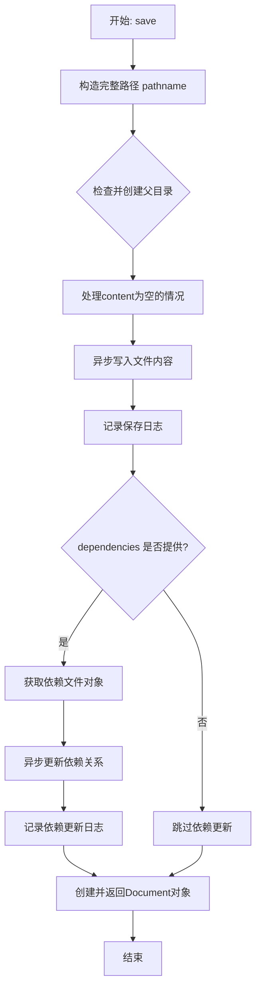

#### 带注释源码

```python
async def save(self, filename: Path | str, content, dependencies: List[str] = None) -> Document:
    """Save content to a file and update its dependencies.

    :param filename: The filename or path within the repository.
    :param content: The content to be saved.
    :param dependencies: List of dependency filenames or paths.
    """
    # 1. 构造文件的完整路径（基于工作目录和相对路径）
    pathname = self.workdir / filename
    # 2. 确保目标文件的父目录存在，不存在则创建
    pathname.parent.mkdir(parents=True, exist_ok=True)
    # 3. 处理content为None的情况，避免写入时类型错误
    content = content if content else ""  # avoid `argument must be str, not None` to make it continue
    # 4. 异步将内容写入文件
    await awrite(filename=str(pathname), data=content)
    # 5. 记录文件保存操作
    logger.info(f"save to: {str(pathname)}")

    # 6. 如果提供了依赖列表，则更新依赖关系
    if dependencies is not None:
        # 6.1 从关联的Git仓库获取依赖文件管理对象
        dependency_file = await self._git_repo.get_dependency()
        # 6.2 异步更新该文件的依赖关系（将依赖列表转换为集合）
        await dependency_file.update(pathname, set(dependencies))
        # 6.3 记录依赖更新操作
        logger.info(f"update dependency: {str(pathname)}:{dependencies}")

    # 7. 创建并返回一个Document对象，包含文件的基本信息和内容
    return Document(root_path=str(self._relative_path), filename=str(filename), content=content)
```

### `FileRepository.get_dependency`

获取指定文件的依赖项集合。

参数：

- `filename`：`Path | str`，需要查询依赖项的文件名或路径（相对于当前`FileRepository`的路径）。

返回值：`Set[str]`，返回一个包含依赖文件路径（字符串形式）的集合。如果文件没有依赖项或依赖文件不存在，则返回空集合。

#### 流程图

```mermaid
graph TD
    A[开始: get_dependency] --> B[构建文件的绝对路径 pathname]
    B --> C[从关联的Git仓库获取依赖文件对象 dependency_file]
    C --> D[调用依赖文件对象的get方法，传入pathname]
    D --> E{依赖文件对象返回结果}
    E --> F[返回依赖项集合 Set[str]]
    F --> G[结束]
```

#### 带注释源码

```python
async def get_dependency(self, filename: Path | str) -> Set[str]:
    """Get the dependencies of a file.

    :param filename: The filename or path within the repository.
    :return: Set of dependency filenames or paths.
    """
    # 1. 将传入的相对路径与当前工作目录组合，得到文件的绝对路径。
    pathname = self.workdir / filename
    # 2. 从关联的Git仓库对象中获取一个“依赖文件”对象。
    #    这个对象（例如一个DependencyFile类的实例）负责管理文件间的依赖关系。
    dependency_file = await self._git_repo.get_dependency()
    # 3. 调用依赖文件对象的`get`方法，传入目标文件的绝对路径，以获取其依赖项。
    #    该方法预期返回一个包含依赖文件路径字符串的集合。
    return await dependency_file.get(pathname)
```

### `FileRepository.get_changed_dependency`

获取指定文件的所有依赖项中，那些在Git仓库中发生了变更的文件列表。该方法首先获取文件的依赖项，然后与Git仓库中已变更的文件列表进行比对，筛选出既是依赖项又发生了变更的文件。

参数：

- `filename`：`Path | str`，需要检查依赖变更的文件名或路径（相对于当前FileRepository的路径）。

返回值：`Set[str]`，返回一个字符串集合，包含所有发生了变更的依赖文件的路径（相对于Git仓库根目录的路径）。

#### 流程图

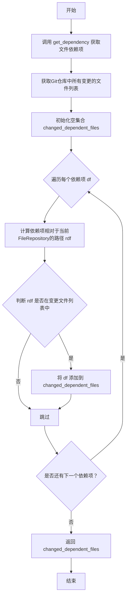

#### 带注释源码

```python
async def get_changed_dependency(self, filename: Path | str) -> Set[str]:
    """Get the dependencies of a file that have changed.

    :param filename: The filename or path within the repository.
    :return: List of changed dependency filenames or paths.
    """
    # 1. 获取指定文件的所有依赖项
    dependencies = await self.get_dependency(filename=filename)
    # 2. 获取Git仓库中所有已变更的文件列表（字典，键为文件路径，值为变更类型）
    changed_files = set(self.changed_files.keys())
    # 3. 初始化一个空集合，用于存储发生了变更的依赖文件
    changed_dependent_files = set()
    # 4. 遍历每一个依赖项
    for df in dependencies:
        # 5. 将依赖项路径（df）转换为相对于当前FileRepository根目录（self._relative_path）的路径
        rdf = Path(df).relative_to(self._relative_path)
        # 6. 判断这个相对路径（rdf）是否在已变更的文件列表中
        if str(rdf) in changed_files:
            # 7. 如果是，则将原始的依赖项路径（df）添加到结果集合中
            changed_dependent_files.add(df)
    # 8. 返回包含所有变更依赖项路径的集合
    return changed_dependent_files
```

### `FileRepository.get`

该方法用于读取指定文件的内容，并返回一个`Document`对象。如果文件不存在或不是普通文件，则返回`None`。

参数：

- `filename`：`Path | str`，要读取的文件名或路径（相对于当前`FileRepository`的工作目录）

返回值：`Document | None`，包含文件内容的`Document`对象；如果文件不存在或不是普通文件，则返回`None`

#### 流程图

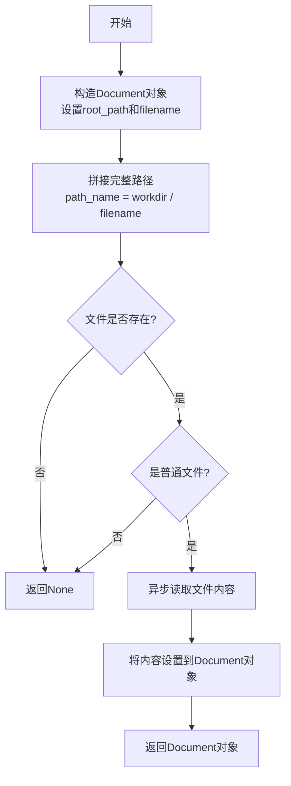

#### 带注释源码

```python
async def get(self, filename: Path | str) -> Document | None:
    """Read the content of a file.

    :param filename: The filename or path within the repository.
    :return: The content of the file.
    """
    # 1. 构造一个Document对象，设置其根路径和文件名
    doc = Document(root_path=str(self.root_path), filename=str(filename))
    
    # 2. 拼接文件的完整绝对路径
    path_name = self.workdir / filename
    
    # 3. 检查文件是否存在
    if not path_name.exists():
        return None
    
    # 4. 检查是否为普通文件（而非目录等）
    if not path_name.is_file():
        return None
    
    # 5. 异步读取文件内容
    doc.content = await aread(path_name)
    
    # 6. 返回包含内容的Document对象
    return doc
```

### `FileRepository.get_all`

获取文件仓库中所有文件的内容，可选择性地过滤被忽略的文件。

参数：

- `filter_ignored`：`bool`，是否过滤被忽略的文件。如果为True，则只返回未被忽略的文件；如果为False，则返回所有文件。

返回值：`List[Document]`，返回一个Document实例列表，每个实例代表一个文件。

#### 流程图

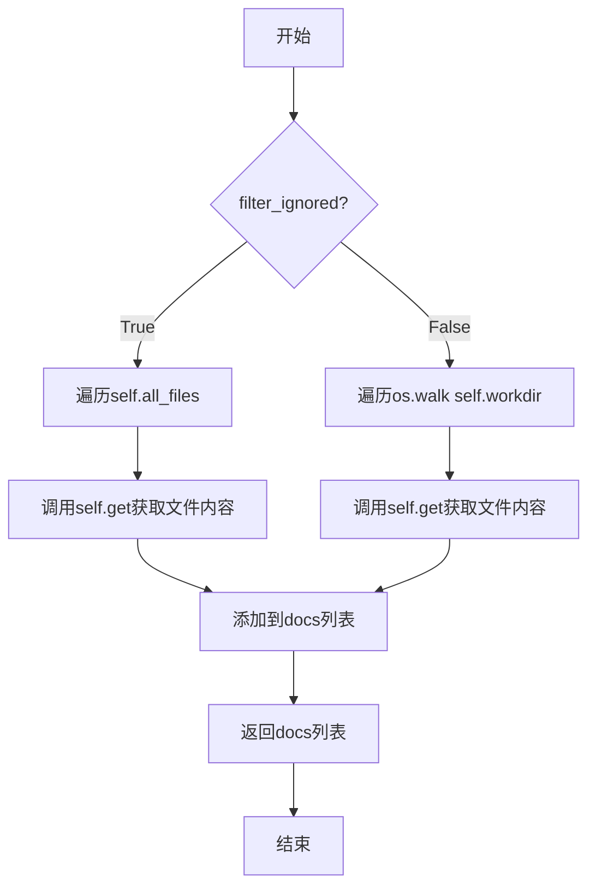

#### 带注释源码

```python
async def get_all(self, filter_ignored=True) -> List[Document]:
    """Get the content of all files in the repository.

    :return: List of Document instances representing files.
    """
    docs = []  # 初始化一个空列表，用于存储Document实例
    if filter_ignored:  # 如果filter_ignored为True
        for f in self.all_files:  # 遍历self.all_files中的每个文件
            doc = await self.get(f)  # 调用self.get方法获取文件内容
            docs.append(doc)  # 将获取到的Document实例添加到docs列表中
    else:  # 如果filter_ignored为False
        for root, dirs, files in os.walk(str(self.workdir)):  # 遍历self.workdir目录下的所有文件
            for file in files:  # 遍历每个文件
                file_path = Path(root) / file  # 构建文件的完整路径
                relative_path = file_path.relative_to(self.workdir)  # 获取相对于self.workdir的路径
                doc = await self.get(relative_path)  # 调用self.get方法获取文件内容
                docs.append(doc)  # 将获取到的Document实例添加到docs列表中
    return docs  # 返回包含所有文件内容的Document实例列表
```

### `FileRepository.workdir`

这是一个只读属性，返回当前 `FileRepository` 实例对应的工作目录的绝对路径。该路径由关联的 `GitRepository` 的工作目录和当前 `FileRepository` 的相对路径组合而成。

参数：无

返回值：`Path`，当前 `FileRepository` 工作目录的绝对路径。

#### 流程图

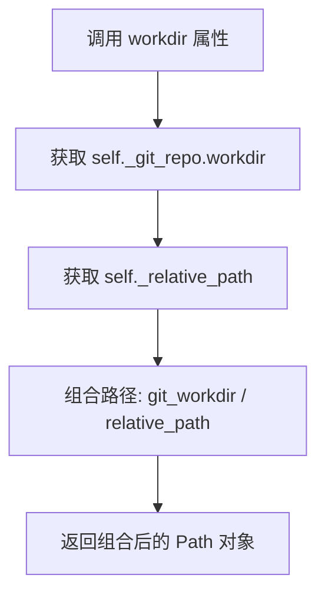

#### 带注释源码

```python
    @property
    def workdir(self):
        """Return the absolute path to the working directory of the FileRepository.

        :return: The absolute path to the working directory.
        """
        # 将关联的 GitRepository 的工作目录与当前 FileRepository 的相对路径进行拼接，
        # 从而得到当前 FileRepository 工作目录的绝对路径。
        return self._git_repo.workdir / self._relative_path
```

### `FileRepository.root_path`

返回相对于Git仓库根目录的相对路径。

参数：无

返回值：`Path`，相对于Git仓库根目录的相对路径。

#### 流程图

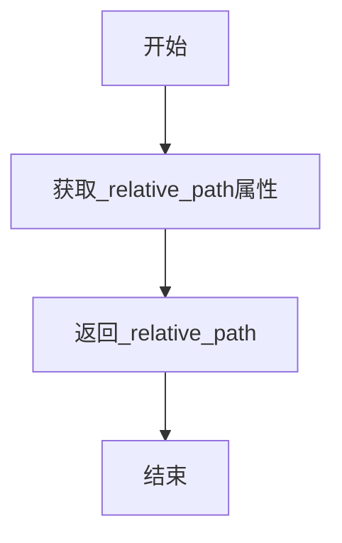

#### 带注释源码

```python
@property
def root_path(self):
    """Return the relative path from git repository root"""
    return self._relative_path
```

### `FileRepository.changed_files`

该方法返回一个字典，其中包含相对于当前 `FileRepository` 实例的 `_relative_path` 的、已更改的文件及其变更类型。它通过调用关联的 `GitRepository` 实例的 `changed_files` 属性来获取所有变更文件，然后过滤掉已删除的文件，并计算相对于当前 `FileRepository` 工作目录的相对路径。

参数：
- 无显式参数。这是一个属性方法，通过 `self` 访问实例内部状态。

返回值：`Dict[str, str]`，一个字典，其中键是相对于当前 `FileRepository` 工作目录的文件路径（字符串），值是变更类型（字符串）。

#### 流程图

```mermaid
flowchart TD
    A[开始] --> B[获取Git仓库所有变更文件<br>self._git_repo.changed_files]
    B --> C[初始化结果字典<br>relative_files = {}]
    C --> D[遍历变更文件字典<br>for p, ct in files.items()]
    D --> E{变更类型是否为'D'<br>（已删除）?}
    E -- 是 --> F[跳过此文件]
    F --> D
    E -- 否 --> G[尝试计算相对路径<br>rf = Path(p).relative_to(self._relative_path)]
    G --> H{是否成功计算<br>相对路径?}
    H -- 否<br>（ValueError） --> I[跳过此文件]
    I --> D
    H -- 是 --> J[将相对路径和变更类型<br>加入结果字典<br>relative_files[str(rf)] = ct]
    J --> D
    D --> K[遍历结束]
    K --> L[返回结果字典<br>return relative_files]
    L --> M[结束]
```

#### 带注释源码

```python
    @property
    def changed_files(self) -> Dict[str, str]:
        """Return a dictionary of changed files and their change types.

        :return: A dictionary where keys are file paths and values are change types.
        """
        # 1. 从关联的Git仓库实例获取所有变更文件及其类型
        files = self._git_repo.changed_files
        # 2. 初始化一个空字典，用于存储过滤和转换后的结果
        relative_files = {}
        # 3. 遍历Git仓库返回的变更文件字典
        for p, ct in files.items():
            # 4. 如果文件变更类型是'D'（删除），则跳过，因为已删除的文件不在当前仓库中
            if ct.value == "D":  # deleted
                continue
            try:
                # 5. 尝试计算文件路径p相对于当前FileRepository的_relative_path的相对路径
                rf = Path(p).relative_to(self._relative_path)
            except ValueError:
                # 6. 如果计算失败（例如，p不在_relative_path目录下），则跳过此文件
                continue
            # 7. 将计算得到的相对路径（转换为字符串）和变更类型存入结果字典
            relative_files[str(rf)] = ct
        # 8. 返回过滤和转换后的结果字典
        return relative_files
```

### `FileRepository.all_files`

这是一个只读属性，用于获取当前 `FileRepository` 实例所管理的相对路径下的所有文件列表。它通过调用关联的 `GitRepository` 实例的 `get_files` 方法来实现，并传入当前 `FileRepository` 的相对路径作为筛选条件。

参数：
- 无

返回值：`List`，一个包含文件路径（相对于当前 `FileRepository` 的 `_relative_path`）的列表。

#### 流程图

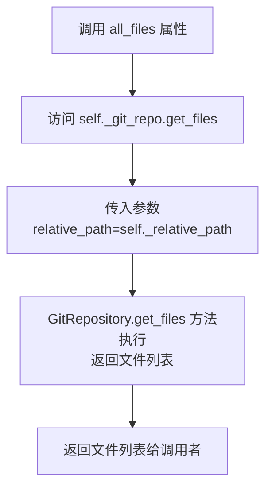

#### 带注释源码

```python
    @property
    def all_files(self) -> List:
        """Get a dictionary of all files in the repository.

        The dictionary includes file paths relative to the current FileRepository.

        :return: A dictionary where keys are file paths and values are file information.
        :rtype: List
        """
        # 核心逻辑：委托给关联的 GitRepository 对象，传入当前 FileRepository 的相对路径，
        # 以获取该路径下的所有文件列表。
        return self._git_repo.get_files(relative_path=self._relative_path)
```

### `FileRepository.get_change_dir_files`

该方法用于获取指定目录下发生变更的文件列表。它通过遍历当前文件仓库中所有已变更的文件，筛选出位于指定目录下的文件，并返回这些文件的相对路径列表。

参数：

- `dir`：`Path | str`，指定要查询变更文件的目录路径，可以是相对路径或绝对路径。

返回值：`List`，返回一个字符串列表，包含指定目录下所有发生变更的文件的相对路径。

#### 流程图

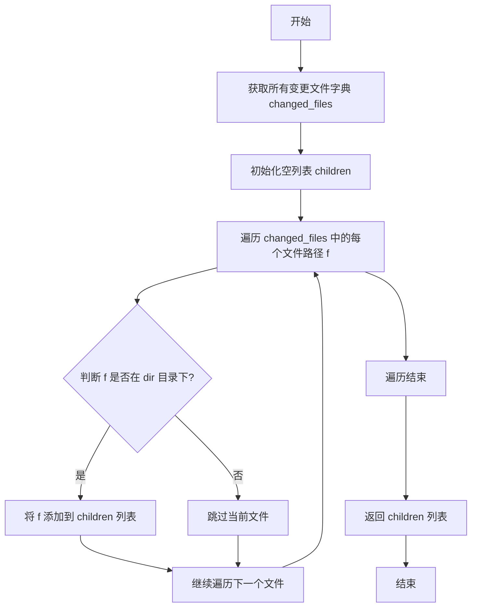

#### 带注释源码

```python
def get_change_dir_files(self, dir: Path | str) -> List:
    """Get the files in a directory that have changed.

    :param dir: The directory path within the repository.
    :return: List of changed filenames or paths within the directory.
    """
    # 获取当前文件仓库中所有已变更的文件及其变更类型
    changed_files = self.changed_files
    # 初始化一个空列表，用于存储指定目录下的变更文件
    children = []
    # 遍历所有变更文件的路径
    for f in changed_files:
        try:
            # 尝试将文件路径 f 转换为相对于指定目录 dir 的相对路径
            # 如果转换成功，说明 f 在 dir 目录下
            Path(f).relative_to(Path(dir))
        except ValueError:
            # 如果转换失败（抛出 ValueError），说明 f 不在 dir 目录下，跳过该文件
            continue
        # 将符合条件的文件路径 f 添加到 children 列表中
        children.append(str(f))
    # 返回包含指定目录下所有变更文件路径的列表
    return children
```

### `FileRepository.new_filename`

这是一个静态方法，用于生成一个基于当前时间戳的新文件名。

参数：
- 无

返回值：`str`，一个基于当前时间戳生成的新文件名字符串，格式为 `YYYYMMDDHHMMSS`。

#### 流程图

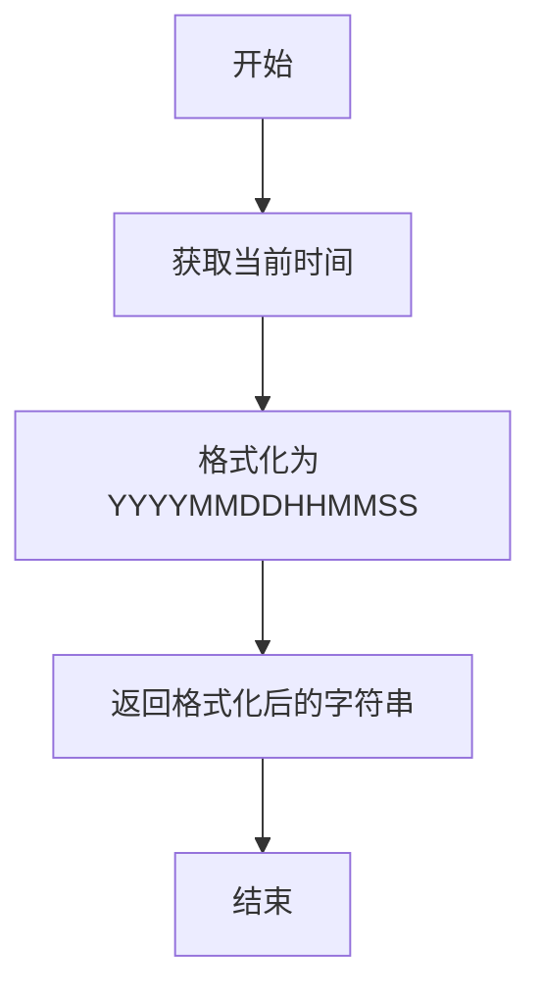

#### 带注释源码

```python
    @staticmethod
    def new_filename():
        """Generate a new filename based on the current timestamp and a UUID suffix.

        :return: A new filename string.
        """
        # 获取当前时间
        current_time = datetime.now().strftime("%Y%m%d%H%M%S")
        # 返回格式化后的时间字符串作为新文件名
        return current_time
```

### `FileRepository.save_doc`

该方法用于将一个 `Document` 对象的内容保存到文件仓库中，并可选地更新该文件的依赖关系。它本质上是对 `save` 方法的封装，提供了更符合面向对象设计的使用方式，直接接收 `Document` 对象作为参数。

参数：

- `doc`：`Document`，需要被保存的文档对象，包含文件名、路径和内容等信息。
- `dependencies`：`List[str]`，可选参数，表示该文件所依赖的其他文件路径列表。

返回值：`Document`，返回保存后更新了路径和内容的 `Document` 对象。

#### 流程图

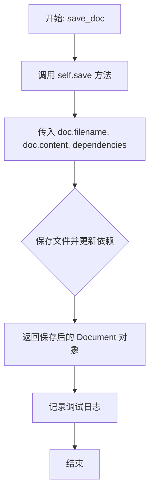

#### 带注释源码

```python
async def save_doc(self, doc: Document, dependencies: List[str] = None):
    """Save content to a file and update its dependencies.

    :param doc: The Document instance to be saved.
    :type doc: Document
    :param dependencies: A list of dependencies for the saved file.
    :type dependencies: List[str], optional
    """

    # 调用内部的 save 方法，传入文档的文件名、内容和依赖列表
    doc = await self.save(filename=doc.filename, content=doc.content, dependencies=dependencies)
    # 记录文件保存成功的调试信息
    logger.debug(f"File Saved: {str(doc.filename)}")
    # 返回更新后的 Document 对象
    return doc
```

### `FileRepository.save_pdf`

该方法用于将 `Document` 实例的内容转换为 Markdown 格式并保存为文件，同时可以更新文件的依赖关系。它首先解析文档内容中的 JSON 数据，然后将其转换为 Markdown 格式，最后调用 `save` 方法保存文件并记录日志。

参数：

- `doc`：`Document`，要保存的 Document 实例，包含文件名和内容。
- `with_suffix`：`str`，可选参数，指定保存文件的后缀，默认为 ".md"。
- `dependencies`：`List[str]`，可选参数，文件的依赖列表。

返回值：`Document`，返回保存后的 Document 实例。

#### 流程图

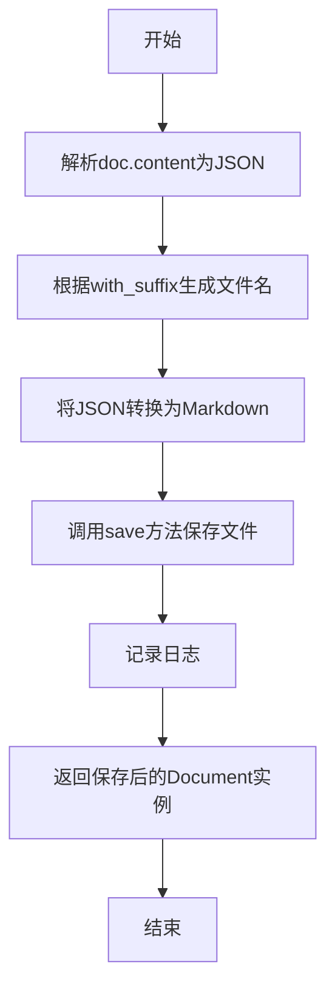

#### 带注释源码

```python
async def save_pdf(self, doc: Document, with_suffix: str = ".md", dependencies: List[str] = None):
    """Save a Document instance as a PDF file.

    This method converts the content of the Document instance to Markdown,
    saves it to a file with an optional specified suffix, and logs the saved file.

    :param doc: The Document instance to be saved.
    :type doc: Document
    :param with_suffix: An optional suffix to append to the saved file's name.
    :type with_suffix: str, optional
    :param dependencies: A list of dependencies for the saved file.
    :type dependencies: List[str], optional
    """
    # 解析doc.content中的JSON数据
    m = json.loads(doc.content)
    # 根据with_suffix生成新的文件名
    filename = Path(doc.filename).with_suffix(with_suffix) if with_suffix is not None else Path(doc.filename)
    # 将JSON数据转换为Markdown格式，并调用save方法保存文件
    doc = await self.save(filename=str(filename), content=json_to_markdown(m), dependencies=dependencies)
    # 记录保存文件的日志
    logger.debug(f"File Saved: {str(filename)}")
    # 返回保存后的Document实例
    return doc
```

### `FileRepository.delete`

该方法用于从文件仓库中删除指定的文件，并清理其依赖关系。

参数：

- `filename`：`Path | str`，要删除的文件名或路径。

返回值：`None`，无返回值。

#### 流程图

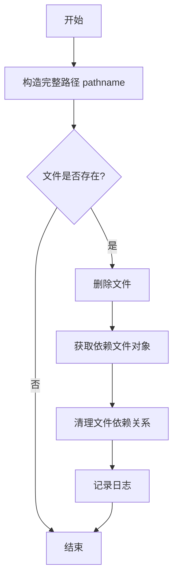

#### 带注释源码

```python
async def delete(self, filename: Path | str):
    """Delete a file from the file repository.

    This method deletes a file from the file repository based on the provided filename.

    :param filename: The name or path of the file to be deleted.
    :type filename: Path or str
    """
    # 构造文件在仓库工作目录下的完整路径
    pathname = self.workdir / filename
    # 检查文件是否存在，不存在则直接返回
    if not pathname.exists():
        return
    # 删除文件，missing_ok=True 确保文件不存在时不会抛出异常
    pathname.unlink(missing_ok=True)

    # 从关联的 GitRepository 获取依赖管理对象
    dependency_file = await self._git_repo.get_dependency()
    # 清理该文件在依赖关系中的记录（将依赖关系设置为 None）
    await dependency_file.update(filename=pathname, dependencies=None)
    # 记录删除操作和依赖清理的日志
    logger.info(f"remove dependency key: {str(pathname)}")
```

## 关键组件

### FileRepository

一个与Git仓库关联的文件仓库管理类，负责在指定相对路径下进行文件的增删改查、依赖关系管理以及变更追踪。它封装了底层Git操作，提供了面向文档的API，并支持将JSON内容转换为Markdown格式保存。

### 依赖管理组件

通过关联的GitRepository获取并维护一个依赖文件，用于记录和管理文件之间的依赖关系。支持更新和查询特定文件的依赖集合，并能识别出已变更的依赖项。

### 变更追踪组件

基于底层Git仓库的变更状态，提供当前FileRepository相对路径下的文件变更信息。能够筛选出已更改的文件，并支持按目录过滤变更文件列表。

### 文档序列化组件

提供将Document对象（包含JSON内容）保存为Markdown格式文件的功能。内部使用`json_to_markdown`工具进行格式转换，并支持指定文件后缀。

## 问题及建议

### 已知问题

-   **方法名与功能不符**：`save_pdf` 方法实际上是将 JSON 内容转换为 Markdown 格式并保存为 `.md` 文件，而非 PDF 文件。这容易导致误解和误用。
-   **潜在的循环依赖风险**：`save` 和 `get_dependency` 方法都通过 `self._git_repo.get_dependency()` 获取依赖文件对象。如果 `GitRepository` 内部也持有对 `FileRepository` 的引用，可能形成循环依赖，影响垃圾回收或导致意外行为。
-   **异常处理不完整**：`get` 方法在文件不存在或不是文件时返回 `None`，但调用方可能未处理此情况，导致后续操作出现 `AttributeError`。`save` 方法中 `awrite` 的异常也未捕获和处理。
-   **路径处理不一致**：`save` 方法内部使用 `self.workdir / filename` 构建路径，而 `get_dependency` 和 `delete` 等方法也使用相同逻辑。但 `get_changed_dependency` 方法中，从依赖项集合 (`dependencies`) 取出的路径 `df` 被直接用于构建 `Path(df)`，并尝试计算相对于 `self._relative_path` 的路径。如果 `df` 是绝对路径或相对于 Git 仓库根目录的路径，此计算可能失败或产生错误结果。
-   **`get_all` 方法效率问题**：当 `filter_ignored=True` 时，方法遍历 `self.all_files` 并逐个调用 `await self.get(f)`。`self.all_files` 可能已经过滤了被忽略的文件，但 `self.get` 内部会再次检查文件是否存在及是否为文件，存在重复检查。当 `filter_ignored=False` 时，使用 `os.walk` 遍历所有文件，但未考虑 Git 忽略规则，可能包含不应被版本控制的文件（如临时文件、构建产物）。

### 优化建议

-   **重命名误导性方法**：将 `save_pdf` 方法重命名为更准确的名称，例如 `save_as_markdown` 或 `save_json_as_markdown`，并在文档字符串中明确说明其功能。
-   **明确依赖关系与接口**：审查 `FileRepository` 与 `GitRepository` 之间的交互，确保依赖关系是单向的（例如，仅 `FileRepository` 依赖 `GitRepository`），避免循环引用。考虑将 `GitRepository` 作为接口或抽象基类注入，以降低耦合度。
-   **增强异常处理与类型提示**：
    -   在 `save`、`get`、`delete` 等可能失败的方法中添加更具体的异常处理（如 `IOError`、`OSError`），并向上抛出封装后的业务异常或记录错误日志。
    -   为方法参数和返回值添加更精确的类型提示（例如，使用 `typing.Optional`、`typing.Union`），并考虑使用 `pydantic` 模型来验证 `Document` 等数据结构。
-   **统一并安全地处理路径**：
    -   定义一个内部辅助方法（如 `_resolve_path`）来统一处理将相对文件名解析为绝对工作目录路径的逻辑，确保一致性。
    -   在 `get_changed_dependency` 中，应验证 `df` 路径的格式。如果依赖项存储的是相对于 Git 仓库根的路径，则应先将其转换为相对于当前 `FileRepository` (`self._relative_path`) 的路径，再进行后续操作。或者，在存储依赖关系时就统一使用相对于当前 `FileRepository` 的路径。
-   **优化 `get_all` 方法性能与逻辑**：
    -   当 `filter_ignored=True` 时，可以直接使用 `self.all_files` 的结果，因为 `GitRepository.get_files` 方法应该已经应用了忽略规则。可以移除 `self.get` 中冗余的文件存在性检查（或使其更轻量），或者直接读取文件内容。
    -   当 `filter_ignored=False` 时，如果需要严格排除 Git 忽略的文件，应调用 `GitRepository` 的相应接口来获取未过滤的文件列表，而不是使用 `os.walk`。如果确实需要遍历所有物理文件，应考虑是否真的有必要，并添加明确注释。
-   **考虑添加缓存机制**：对于频繁读取且不常变化的文件内容（如依赖关系文件），可以考虑在 `FileRepository` 或 `GitRepository` 层面添加适当的缓存，以减少 I/O 操作。需要注意缓存失效策略，例如在文件保存或删除时清除相关缓存。
-   **改进日志记录**：当前日志级别不统一（`save` 用 `info`，`save_doc` 用 `debug`）。建议根据操作的重要性统一日志级别，并考虑在关键操作失败时记录 `error` 或 `warning` 级别日志。

## 其它


### 设计目标与约束

本模块旨在为上层应用提供一个基于Git仓库的、具备依赖关系管理能力的文件存储与操作抽象层。其核心设计目标包括：1) 提供与Git仓库状态（如变更文件、所有文件）联动的文件读写接口；2) 维护文件间的依赖关系图，支持查询依赖和受影响的依赖；3) 封装底层文件操作，提供异步API以支持可能的并发场景。主要约束包括：1) 强依赖于外部的`GitRepository`实例来提供Git操作和依赖关系存储；2) 文件路径操作基于`pathlib.Path`，确保跨平台兼容性；3) 所有文件内容均以字符串形式处理，对二进制文件支持有限。

### 错误处理与异常设计

模块采用防御性编程和静默处理策略。在`get`方法中，若文件不存在或不是普通文件，则返回`None`，而非抛出异常。`delete`方法在文件不存在时直接返回。`save`方法将`None`内容转换为空字符串以避免写入错误。依赖关系操作委托给`_git_repo.get_dependency()`返回的对象，其内部的错误处理逻辑未在本模块暴露。整体上，模块倾向于避免因文件系统状态异常而中断主流程，通过返回值（如`None`）和日志记录来反馈问题。潜在的异常可能来自`pathlib`操作（如`relative_to`）或异步IO操作，这些异常会向上传播。

### 数据流与状态机

模块本身不维护复杂的内部状态，其状态主要源自关联的`GitRepository`实例（如`changed_files`）和文件系统的实际内容。核心数据流围绕`Document`对象展开：`save`/`save_doc`/`save_pdf`方法接收`Document`或内容，写入文件系统，并可选地更新依赖关系图；`get`/`get_all`方法从文件系统读取内容并封装为`Document`对象返回。依赖关系数据流：通过`_git_repo.get_dependency()`获取一个依赖管理对象，`save`时调用其`update`方法添加依赖，`get_dependency`时调用其`get`方法查询依赖。`changed_files`和`all_files`属性提供了从Git仓库状态到当前`FileRepository`相对路径下的视图映射。

### 外部依赖与接口契约

1.  **GitRepository 实例 (`_git_repo`)**：强依赖。需提供以下接口：
    *   属性 `workdir` (Path)：Git工作目录的绝对路径。
    *   属性 `changed_files` (Dict[str, ChangeType])：返回所有变更文件及其类型的字典。
    *   方法 `get_files(relative_path: Path) -> List`：返回指定相对路径下的文件列表。
    *   方法 `async get_dependency() -> DependencyFile`：返回一个用于管理依赖关系的对象，该对象需实现`async update(filename, dependencies)`和`async get(filename) -> Set[str]`方法。
2.  **Document 类 (`metagpt.schema.Document`)**：数据载体依赖。需具有`root_path`, `filename`, `content`属性。
3.  **工具函数 (`metagpt.utils.common.aread`, `awrite`, `metagpt.utils.json_to_markdown.json_to_markdown`)**：功能依赖。用于异步文件读写和JSON到Markdown的转换。
4.  **标准库**：`pathlib`, `os`, `json`, `datetime`。

### 并发与线程安全

模块所有公共方法均为`async`定义，表明其设计用于异步环境（如asyncio）。这要求调用者必须在异步上下文中使用。模块本身未使用显式的锁机制，其线程安全性依赖于：1) 底层文件系统操作的原子性（由操作系统保证）；2) 关联的`GitRepository`及其依赖管理组件在并发访问下的正确性。在多个协程同时操作同一文件或依赖关系时，可能存在竞态条件，需要由上层调用者或`GitRepository`的依赖管理组件来协调。

### 配置与扩展点

1.  **初始化配置**：通过`__init__`方法的`relative_path`参数，可以指定当前`FileRepository`实例在Git仓库中的工作子目录。
2.  **文件过滤**：`get_all`方法提供了`filter_ignored`参数，决定是使用Git管理的文件列表还是遍历所有文件。这依赖于`_git_repo.get_files`的实现。
3.  **文件名生成**：`new_filename`静态方法提供了基于时间戳的默认文件名生成策略，可作为扩展点替换为更复杂的逻辑。
4.  **依赖存储后端**：依赖关系的具体存储方式（如内存、数据库、文件）由`_git_repo.get_dependency()`返回的对象决定，这是一个重要的可扩展点。
5.  **内容转换**：`save_pdf`方法（实际保存为Markdown）展示了通过`json_to_markdown`进行内容转换的扩展模式，可类似地添加其他格式转换器。

    