# `.\MetaGPT\metagpt\utils\git_repository.py` 详细设计文档

该代码实现了一个Git仓库管理类，封装了Git仓库的本地操作（如初始化、提交、分支管理、文件变更跟踪）和远程操作（如克隆、推送、创建Pull Request和Issue），并集成了GitHub API交互功能，用于在自动化工作流中管理代码仓库。

## 整体流程

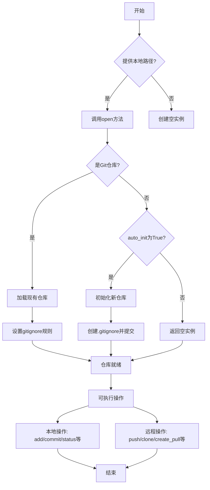

## 类结构

```
GitRepository (主类)
├── ChangeType (枚举类)
├── RateLimitError (异常类)
└── GitBranch (数据模型类)
```

## 全局变量及字段


### `GitBranch.head`
    
目标分支的名称，表示要合并到的分支。

类型：`str`
    


### `GitBranch.base`
    
源分支的名称，表示要合并的分支。

类型：`str`
    


### `GitBranch.repo_name`
    
Git仓库的名称，用于标识仓库。

类型：`str`
    


### `GitRepository._repository`
    
GitPython的Repo对象，表示Git仓库的核心实例。

类型：`Repo`
    


### `GitRepository._dependency`
    
依赖文件对象，用于管理仓库的依赖关系。

类型：`DependencyFile`
    


### `GitRepository._gitignore_rules`
    
解析后的.gitignore规则函数，用于过滤文件。

类型：`Callable[[str], bool]`
    
    

## 全局函数及方法

### `RateLimitError.__init__`

初始化一个表示速率限制错误的异常对象，设置错误消息。

参数：

- `message`：`str`，错误消息，默认为"Rate limit exceeded"

返回值：`None`，无返回值

#### 流程图

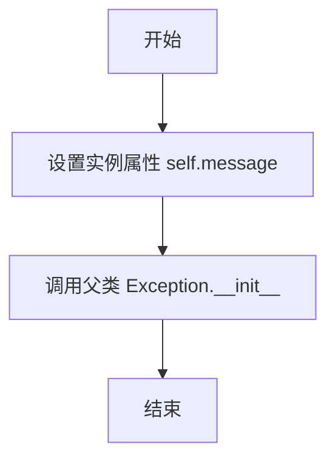

#### 带注释源码

```python
def __init__(self, message="Rate limit exceeded"):
    # 将传入的错误消息赋值给实例属性 self.message
    self.message = message
    # 调用父类 Exception 的初始化方法，传入错误消息
    super().__init__(self.message)
```

### `GitRepository.__init__`

初始化一个GitRepository实例。如果提供了本地路径，它会尝试打开一个已存在的Git仓库；如果`auto_init`为True且路径不是Git仓库，则会自动初始化一个新的Git仓库。

参数：

- `local_path`：`Optional[str]`，Git仓库的本地路径。如果为None，则仅创建对象而不打开仓库。
- `auto_init`：`bool`，如果为True，当提供的路径不是Git仓库时，自动初始化一个新的Git仓库。

返回值：`None`，构造函数不返回任何值。

#### 流程图

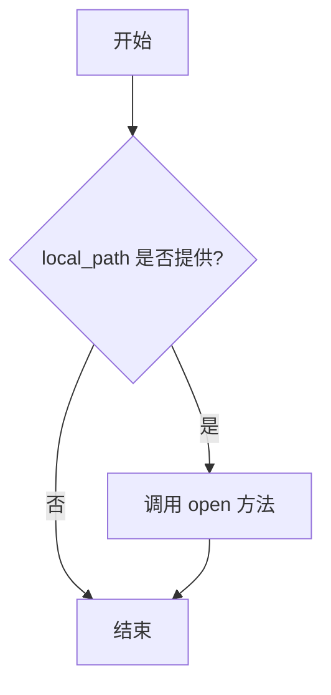

#### 带注释源码

```python
def __init__(self, local_path=None, auto_init=True):
    """Initialize a GitRepository instance.

    :param local_path: The local path to the Git repository.
    :param auto_init: If True, automatically initializes a new Git repository if the provided path is not a Git repository.
    """
    self._repository = None          # 初始化内部仓库对象为None
    self._dependency = None          # 初始化依赖文件对象为None
    self._gitignore_rules = None     # 初始化.gitignore规则为None
    if local_path:                   # 如果提供了本地路径
        self.open(local_path=Path(local_path), auto_init=auto_init)  # 调用open方法打开或初始化仓库
```

### `GitRepository.open`

该方法用于打开一个已存在的Git仓库，或者根据参数决定是否自动初始化一个新的Git仓库。它会检查指定路径是否为一个有效的Git仓库目录，如果是，则加载该仓库并解析其`.gitignore`规则；如果不是且`auto_init`为`True`，则在该路径初始化一个新的Git仓库。

参数：

- `local_path`：`Path`，本地Git仓库的路径。
- `auto_init`：`bool`，如果为`True`且指定路径不是Git仓库，则自动初始化一个新的Git仓库。

返回值：`None`，无返回值。

#### 流程图

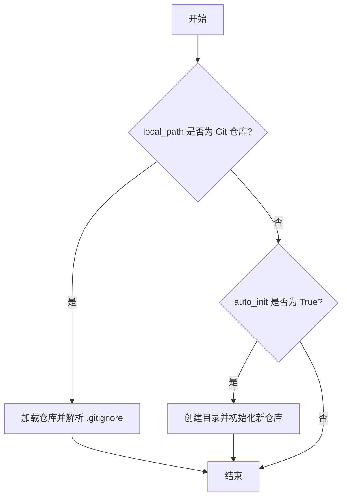

#### 带注释源码

```python
def open(self, local_path: Path, auto_init=False):
    """Open an existing Git repository or initialize a new one if auto_init is True.

    :param local_path: The local path to the Git repository.
    :param auto_init: If True, automatically initializes a new Git repository if the provided path is not a Git repository.
    """
    local_path = Path(local_path)  # 将路径转换为 Path 对象
    if self.is_git_dir(local_path):  # 检查路径是否为 Git 仓库
        self._repository = Repo(local_path)  # 加载现有仓库
        self._gitignore_rules = parse_gitignore(full_path=str(local_path / ".gitignore"))  # 解析 .gitignore 规则
        return
    if not auto_init:  # 如果不是 Git 仓库且 auto_init 为 False，直接返回
        return
    local_path.mkdir(parents=True, exist_ok=True)  # 创建目录（如果不存在）
    self._init(local_path)  # 初始化新仓库
```

### `GitRepository._init`

该方法用于在指定路径初始化一个新的Git仓库，并创建一个默认的`.gitignore`文件，然后提交该文件。

参数：

- `local_path`：`Path`，新Git仓库将被初始化的本地路径。

返回值：`None`，无返回值。

#### 流程图

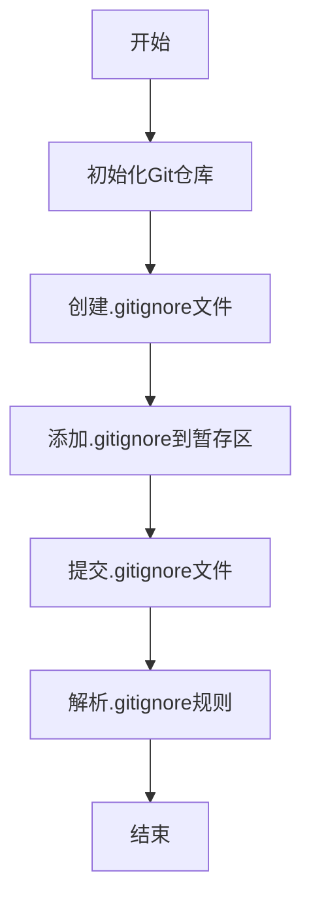

#### 带注释源码

```python
def _init(self, local_path: Path):
    """Initialize a new Git repository at the specified path.

    :param local_path: The local path where the new Git repository will be initialized.
    """
    # 使用GitPython的Repo.init方法在指定路径初始化一个新的Git仓库
    self._repository = Repo.init(path=Path(local_path))

    # 定义.gitignore文件的路径
    gitignore_filename = Path(local_path) / ".gitignore"
    # 定义默认的忽略规则列表
    ignores = ["__pycache__", "*.pyc", ".vs"]
    # 创建并写入.gitignore文件
    with open(str(gitignore_filename), mode="w") as writer:
        writer.write("\n".join(ignores))
    # 将.gitignore文件添加到Git暂存区
    self._repository.index.add([".gitignore"])
    # 提交.gitignore文件，提交信息为"Add .gitignore"
    self._repository.index.commit("Add .gitignore")
    # 解析.gitignore文件中的规则，并存储到实例变量中
    self._gitignore_rules = parse_gitignore(full_path=gitignore_filename)
```

### `GitRepository.add_change`

该方法用于根据提供的变更类型字典，将文件添加到Git暂存区或从暂存区移除。具体来说，对于标记为删除的文件，会从暂存区移除；对于其他变更类型（如新增、修改等），则将文件添加到暂存区。

参数：

- `files`：`Dict`，一个字典，其中键为文件路径，值为`ChangeType`枚举实例，表示该文件的变更类型。

返回值：`None`，无返回值。

#### 流程图

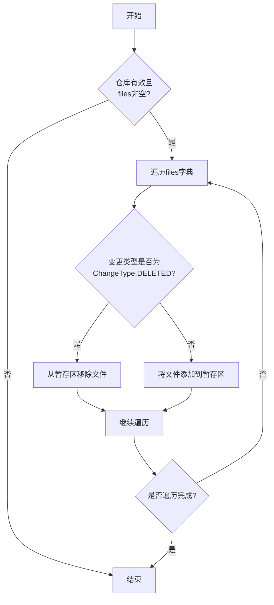

#### 带注释源码

```python
def add_change(self, files: Dict):
    """Add or remove files from the staging area based on the provided changes.

    :param files: A dictionary where keys are file paths and values are instances of ChangeType.
    """
    # 检查当前Git仓库是否有效且传入的变更字典是否非空
    if not self.is_valid or not files:
        return

    # 遍历变更字典中的每一项
    for k, v in files.items():
        # 如果变更类型是删除，则从暂存区移除该文件
        # 否则（新增、修改等），将文件添加到暂存区
        self._repository.index.remove(k) if v is ChangeType.DELETED else self._repository.index.add([k])
```

### `GitRepository.commit`

该方法用于提交暂存区的更改到Git仓库，并附带指定的提交信息。

参数：

- `comments`：`str`，提交的注释信息，用于描述本次提交的内容。

返回值：`None`，无返回值。

#### 流程图

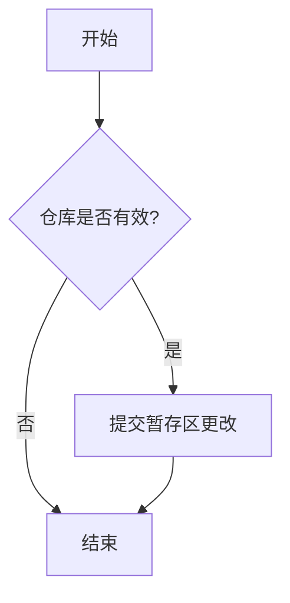

#### 带注释源码

```python
def commit(self, comments):
    """Commit the staged changes with the given comments.

    :param comments: Comments for the commit.
    """
    if self.is_valid:
        self._repository.index.commit(comments)
```

### `GitRepository.delete_repository`

该方法用于删除整个Git仓库目录。如果Git仓库实例有效（即已初始化），则调用`shutil.rmtree`递归删除仓库的工作目录。在删除过程中，如果发生异常，会记录错误日志。

参数：

- 无参数

返回值：`None`，无返回值

#### 流程图

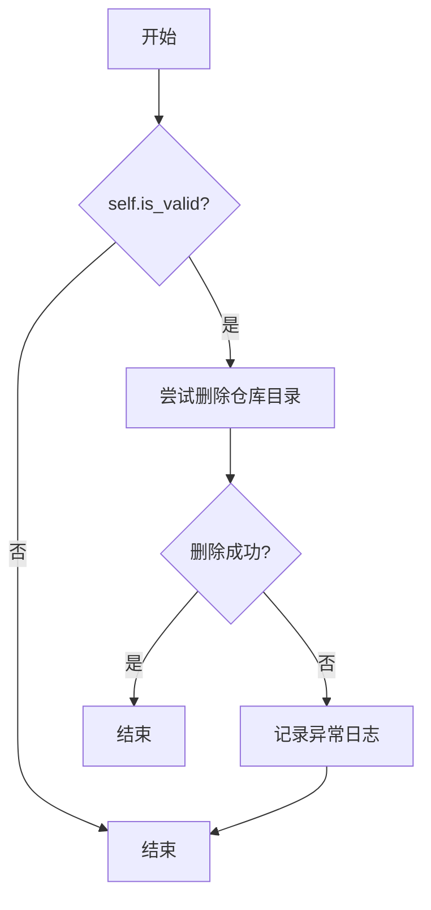

#### 带注释源码

```python
def delete_repository(self):
    """Delete the entire repository directory."""
    # 检查当前Git仓库实例是否有效（已初始化）
    if self.is_valid:
        try:
            # 使用shutil.rmtree递归删除仓库的工作目录
            shutil.rmtree(self._repository.working_dir)
        except Exception as e:
            # 如果删除过程中发生异常，记录异常日志
            logger.exception(f"Failed delete git repo:{self.workdir}, error:{e}")
```

### `GitRepository.changed_files`

该方法用于获取Git仓库中所有已更改的文件及其对应的变更类型。它首先收集未跟踪的文件，然后与暂存区进行比较，返回一个字典，其中键为文件路径，值为变更类型。

参数：

- 无参数

返回值：`Dict[str, str]`，返回一个字典，其中键为文件路径，值为变更类型（ChangeType枚举的字符串表示）。

#### 流程图

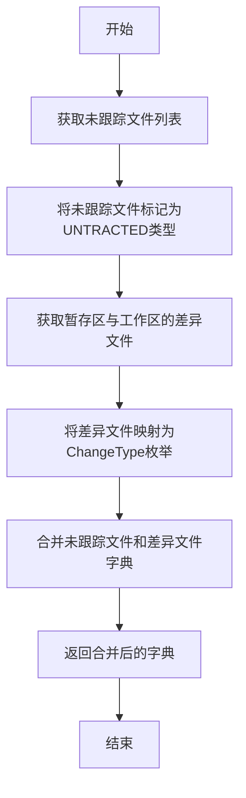

#### 带注释源码

```python
@property
def changed_files(self) -> Dict[str, str]:
    """Return a dictionary of changed files and their change types.

    :return: A dictionary where keys are file paths and values are change types.
    """
    # 获取未跟踪的文件列表，并将其标记为UNTRACTED类型
    files = {i: ChangeType.UNTRACTED for i in self._repository.untracked_files}
    
    # 获取暂存区与工作区之间的差异文件，并将变更类型映射为ChangeType枚举
    changed_files = {f.a_path: ChangeType(f.change_type) for f in self._repository.index.diff(None)}
    
    # 将未跟踪文件和差异文件合并到一个字典中
    files.update(changed_files)
    
    # 返回包含所有更改文件的字典
    return files
```

### `GitRepository.is_git_dir`

`is_git_dir` 是一个静态方法，用于检查指定的本地路径是否是一个有效的 Git 仓库目录。它通过检查路径下是否存在 `.git` 子目录，并利用 `git.repo.fun.is_git_dir` 函数验证该目录是否是一个合法的 Git 仓库。

参数：

- `local_path`：`Path` 或 `str`，需要检查的本地路径。

返回值：`bool`，如果指定路径是一个有效的 Git 仓库目录则返回 `True`，否则返回 `False`。

#### 流程图

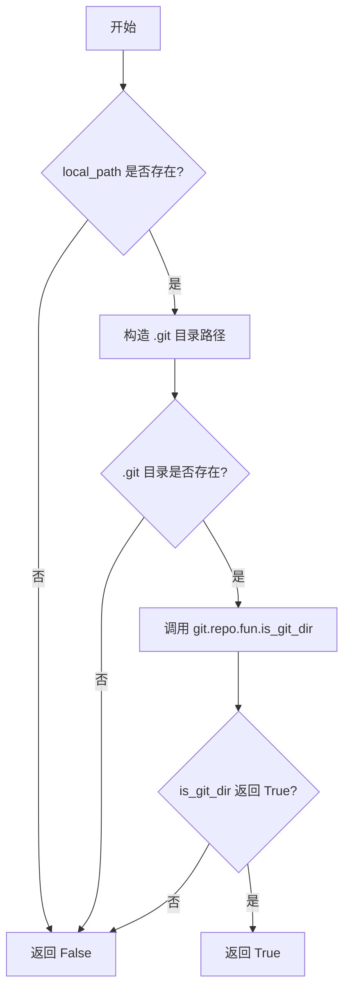

#### 带注释源码

```python
@staticmethod
def is_git_dir(local_path):
    """Check if the specified directory is a Git repository.

    :param local_path: The local path to check.
    :return: True if the directory is a Git repository, False otherwise.
    """
    # 1. 检查输入路径是否有效
    if not local_path:
        return False
    # 2. 构造 .git 子目录的路径
    git_dir = Path(local_path) / ".git"
    # 3. 检查 .git 目录是否存在，并使用 GitPython 的底层函数验证其有效性
    if git_dir.exists() and is_git_dir(git_dir):
        return True
    # 4. 如果任何条件不满足，则返回 False
    return False
```

### `GitRepository.is_valid`

这是一个只读属性，用于检查当前 `GitRepository` 实例是否关联了一个有效的 Git 仓库。它通过检查内部 `_repository` 字段是否已被初始化（即不为 `None`）来判断。

参数：
- 无（这是一个属性，不接受参数）

返回值：`bool`，如果 `_repository` 字段已初始化（即 `self._repository` 为真值），则返回 `True`，表示这是一个有效的 Git 仓库对象；否则返回 `False`。

#### 流程图

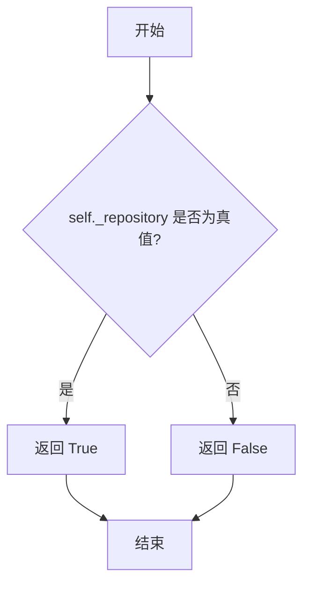

#### 带注释源码

```python
    @property
    def is_valid(self):
        """Check if the Git repository is valid (exists and is initialized).

        :return: True if the repository is valid, False otherwise.
        """
        # 核心逻辑：检查内部存储的 `_repository` 对象是否存在。
        # `bool(self._repository)` 在 `self._repository` 为 `None` 时返回 `False`，否则返回 `True`。
        return bool(self._repository)
```

### `GitRepository.status`

该方法返回Git仓库的当前状态信息，以字符串形式展示工作目录和暂存区的状态。

参数：无

返回值：`str`，返回Git仓库的状态信息字符串。如果仓库无效（未初始化或不存在），则返回空字符串。

#### 流程图

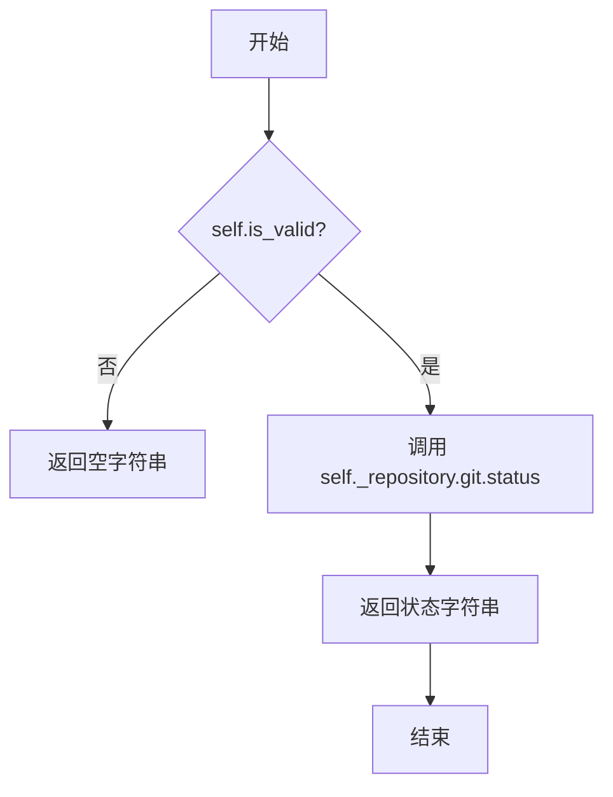

#### 带注释源码

```python
@property
def status(self) -> str:
    """Return the Git repository's status as a string."""
    # 检查仓库是否有效（已初始化且存在）
    if not self.is_valid:
        return ""
    # 调用GitPython的git.status()方法获取状态信息
    return self._repository.git.status()
```

### `GitRepository.workdir`

这是一个只读属性，用于获取Git仓库的工作目录路径。如果Git仓库对象无效（未初始化或不存在），则返回`None`。

参数：无

返回值：`Path | None`，Git仓库工作目录的`Path`对象；如果仓库无效则返回`None`。

#### 流程图

```mermaid
flowchart TD
    A[开始] --> B{self.is_valid?}
    B -- 否 --> C[返回 None]
    B -- 是 --> D[返回 Path(self._repository.working_dir)]
    D --> E[结束]
    C --> E
```

#### 带注释源码

```python
@property
def workdir(self) -> Path | None:
    """Return the path to the working directory of the Git repository.

    :return: The path to the working directory or None if the repository is not valid.
    """
    # 检查当前Git仓库对象是否有效（已初始化且存在）
    if not self.is_valid:
        # 如果无效，返回None
        return None
    # 如果有效，返回仓库工作目录的Path对象
    # self._repository.working_dir 是GitPython Repo对象的工作目录属性
    return Path(self._repository.working_dir)
```

### `GitRepository.current_branch`

返回当前 Git 仓库中活跃分支的名称。

参数：无

返回值：`str`，当前活跃分支的名称。

#### 流程图

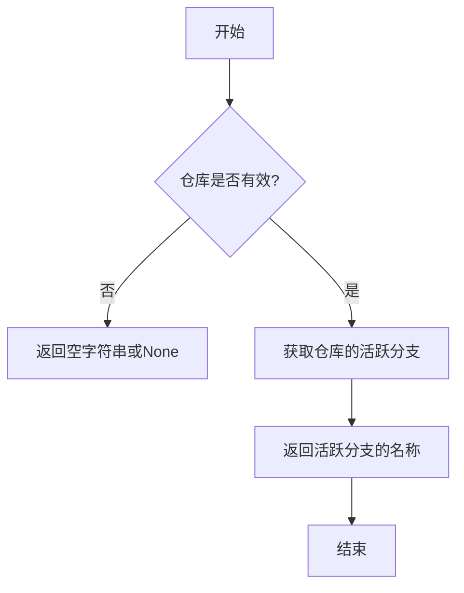

#### 带注释源码

```python
@property
def current_branch(self) -> str:
    """
    Returns the name of the current active branch.

    Returns:
        str: The name of the current active branch.
    """
    # 通过 GitPython 的 Repo 对象获取当前活跃分支的名称
    return self._repository.active_branch.name
```

### `GitRepository.remote_url`

该方法用于获取 Git 仓库的远程 URL（通常是 origin 远程仓库的 URL）。如果远程仓库未设置或无法访问，则返回空字符串。

参数：无

返回值：`str`，远程仓库的 URL 字符串。如果远程仓库未设置或无法访问，则返回空字符串。

#### 流程图

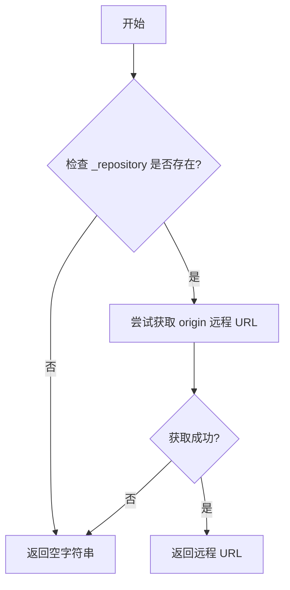

#### 带注释源码

```python
@property
def remote_url(self) -> str:
    try:
        # 尝试从 _repository 的 remotes 属性中获取 origin 远程仓库的 URL
        return self._repository.remotes.origin.url
    except AttributeError:
        # 如果 _repository 不存在或 remotes.origin 不存在，则捕获 AttributeError 异常
        # 返回空字符串表示无法获取远程 URL
        return ""
```

### `GitRepository.repo_name`

这是一个只读属性，用于从 Git 仓库的远程 URL 中提取仓库名称。它首先检查是否存在远程 URL，然后根据 URL 的格式（HTTPS 或 SSH）解析出仓库名称。

参数：
- 无

返回值：`str`，从远程 URL 中提取的仓库名称。如果远程 URL 不存在或格式无法识别，则返回空字符串。

#### 流程图

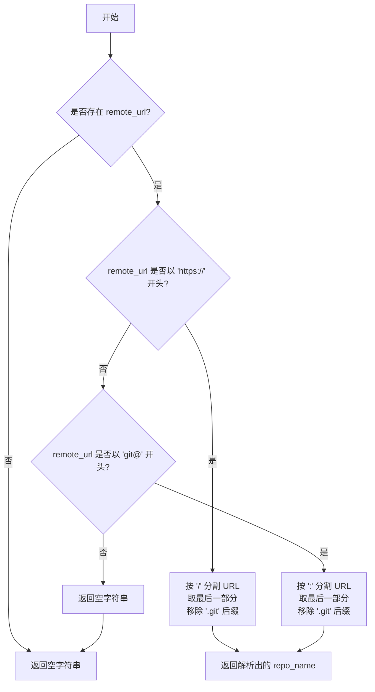

#### 带注释源码

```python
    @property
    def repo_name(self) -> str:
        # 检查是否存在远程 URL
        if self.remote_url:
            # 此逻辑假设远程 URL 为标准 HTTPS 或 SSH 格式
            # HTTPS 格式示例: https://github.com/username/repo_name.git
            # SSH 格式示例: git@github.com:username/repo_name.git
            if self.remote_url.startswith("https://"):
                # 对于 HTTPS URL，按 '/' 分割，取最后一部分（username/repo_name.git），然后移除 '.git' 后缀
                return self.remote_url.split("/", maxsplit=3)[-1].replace(".git", "")
            elif self.remote_url.startswith("git@"):
                # 对于 SSH URL，按 ':' 分割，取最后一部分（username/repo_name.git），然后移除 '.git' 后缀
                return self.remote_url.split(":")[-1].replace(".git", "")
        # 如果 remote_url 不存在或格式无法识别，返回空字符串
        return ""
```

### `GitRepository.new_branch`

创建一个新的 Git 分支并切换到该分支。如果提供的分支名称为空，则返回当前活动分支的名称。

参数：

- `branch_name`：`str`，要创建的新分支的名称。

返回值：`str`，新创建的分支名称。如果 `branch_name` 为空，则返回当前活动分支的名称。

#### 流程图

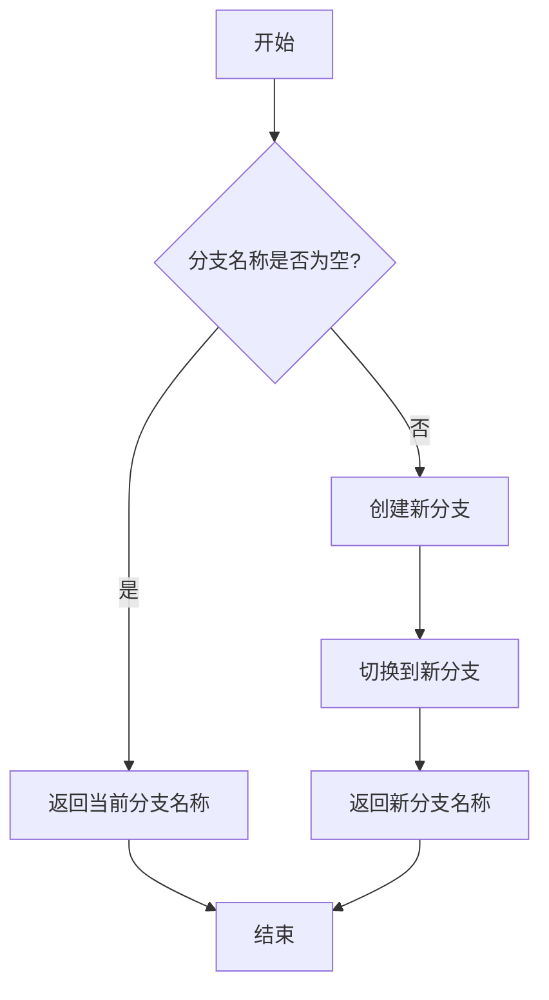

#### 带注释源码

```python
def new_branch(self, branch_name: str) -> str:
    """
    Creates a new branch with the given name.

    Args:
        branch_name (str): The name of the new branch to create.

    Returns:
        str: The name of the newly created branch.
            If the provided branch_name is empty, returns the name of the current active branch.
    """
    # 检查分支名称是否为空
    if not branch_name:
        # 如果为空，返回当前活动分支的名称
        return self.current_branch
    # 创建新分支
    new_branch = self._repository.create_head(branch_name)
    # 切换到新分支
    new_branch.checkout()
    # 返回新分支的名称
    return new_branch.name
```

### `GitRepository.archive`

该方法用于归档Git仓库的当前状态。它会检查是否有文件变更，如果有变更，则将变更添加到暂存区并提交一个归档提交。如果没有变更，则直接返回。

参数：

- `comments`：`str`，归档提交的注释信息，默认为"Archive"

返回值：`None`，无返回值

#### 流程图

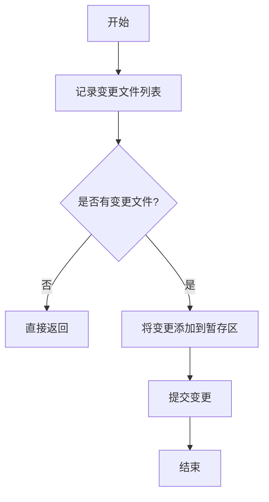

#### 带注释源码

```python
def archive(self, comments="Archive"):
    """Archive the current state of the Git repository.

    :param comments: Comments for the archive commit.
    """
    # 记录当前变更的文件列表
    logger.info(f"Archive: {list(self.changed_files.keys())}")
    
    # 如果没有变更文件，直接返回
    if not self.changed_files:
        return
    
    # 将变更文件添加到暂存区
    self.add_change(self.changed_files)
    
    # 提交变更
    self.commit(comments)
```

### `GitRepository.push`

该方法用于将本地仓库的更改推送到远程Git仓库。它会创建一个新的分支（如果指定），提交所有未提交的更改，然后使用Git命令将更改推送到远程仓库。支持通过访问令牌或认证对象进行身份验证，并可配置代理。

参数：

- `new_branch`：`str`，要推送的新分支名称。如果为空，则使用当前分支。
- `comments`：`str`，可选，默认为"Archive"。提交注释。
- `access_token`：`Optional[str]`，可选，用于身份验证的访问令牌。
- `auth`：`Optional[Auth]`，可选，用于身份验证的认证对象。

返回值：`GitBranch`，包含推送分支信息的对象，包括基础分支、头部分支和仓库名称。

#### 流程图

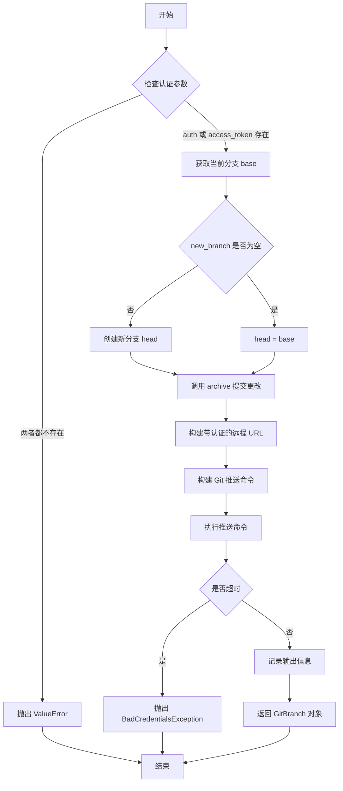

#### 带注释源码

```python
async def push(
    self, new_branch: str, comments="Archive", access_token: Optional[str] = None, auth: Optional[Auth] = None
) -> GitBranch:
    """
    Pushes changes to the remote repository.

    Args:
        new_branch (str): The name of the new branch to be pushed.
        comments (str, optional): Comments to be associated with the push. Defaults to "Archive".
        access_token (str, optional): Access token for authentication. Defaults to None. Visit `https://pygithub.readthedocs.io/en/latest/examples/Authentication.html`, `https://github.com/PyGithub/PyGithub/blob/main/doc/examples/Authentication.rst`.
        auth (Auth, optional): Optional authentication object. Defaults to None.

    Returns:
        GitBranch: The pushed branch object.

    Raises:
        ValueError: If neither `auth` nor `access_token` is provided.
        BadCredentialsException: If authentication fails due to bad credentials or timeout.

    Note:
        This function assumes that `self.current_branch`, `self.new_branch()`, `self.archive()`,
        `ctx.config.proxy`, `ctx.config`, `self.remote_url`, `shell_execute()`, and `logger` are
        defined and accessible within the scope of this function.
    """
    # 1. 参数验证：必须提供一种认证方式
    if not auth and not access_token:
        raise ValueError('`access_token` is invalid. Visit: "https://github.com/settings/tokens"')
    from metagpt.context import Context

    # 2. 确定基础分支和头部分支
    base = self.current_branch
    head = base if not new_branch else self.new_branch(new_branch)
    # 3. 提交所有未提交的更改（如果没有更改则跳过）
    self.archive(comments)  # will skip committing if no changes
    # 4. 准备执行环境（上下文、代理、环境变量）
    ctx = Context()
    env = ctx.new_environ()
    proxy = ["-c", f"http.proxy={ctx.config.proxy}"] if ctx.config.proxy else []
    # 5. 构建带认证令牌的远程URL
    token = access_token or auth.token
    remote_url = f"https://{token}@" + self.remote_url.removeprefix("https://")
    # 6. 构建Git推送命令
    command = ["git"] + proxy + ["push", remote_url]
    logger.info(" ".join(command).replace(token, "<TOKEN>"))
    try:
        # 7. 执行推送命令，设置超时
        stdout, stderr, return_code = await shell_execute(
            command=command, cwd=str(self.workdir), env=env, timeout=15
        )
    except TimeoutExpired as e:
        # 8. 处理超时异常，隐藏令牌信息
        info = str(e).replace(token, "<TOKEN>")
        raise BadCredentialsException(status=401, message=info)
    # 9. 记录命令输出，隐藏令牌信息
    info = f"{stdout}\n{stderr}\nexit: {return_code}\n"
    info = info.replace(token, "<TOKEN>")
    print(info)
    # 10. 返回分支信息对象
    return GitBranch(base=base, head=head, repo_name=self.repo_name)
```

### `GitRepository.new_file_repository`

创建一个与当前 Git 仓库关联的新 `FileRepository` 实例。该方法用于在 Git 仓库的指定相对路径下创建一个文件仓库对象，便于在该路径下进行文件操作。

参数：

- `relative_path`：`Path | str`，文件仓库在 Git 仓库中的相对路径，默认为当前目录（`.`）。

返回值：`FileRepository`，返回一个与当前 Git 仓库关联的 `FileRepository` 实例。

#### 流程图

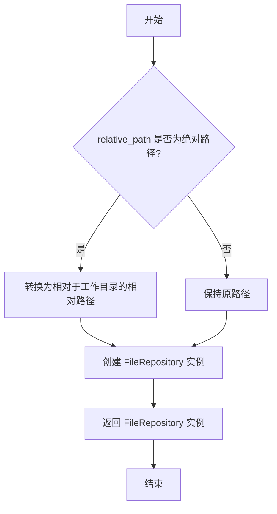

#### 带注释源码

```python
def new_file_repository(self, relative_path: Path | str = ".") -> FileRepository:
    """Create a new instance of FileRepository associated with this Git repository.

    :param relative_path: The relative path to the file repository within the Git repository.
    :return: A new instance of FileRepository.
    """
    # 将输入路径转换为 Path 对象
    path = Path(relative_path)
    try:
        # 尝试将路径转换为相对于 Git 工作目录的相对路径
        path = path.relative_to(self.workdir)
    except ValueError:
        # 如果转换失败（例如路径已经是相对路径），保持原路径不变
        path = relative_path
    # 创建并返回 FileRepository 实例，传入当前 Git 仓库对象和相对路径
    return FileRepository(git_repo=self, relative_path=Path(path))
```

### `GitRepository.get_dependency`

该方法用于获取与当前Git仓库关联的依赖文件对象。如果该对象尚未初始化，则会在首次调用时创建并缓存。

参数：
-  `self`：`GitRepository`，当前GitRepository实例。

返回值：`DependencyFile`，一个代表工作目录依赖关系的DependencyFile对象。

#### 流程图

```mermaid
flowchart TD
    A[开始] --> B{_dependency 已存在?}
    B -- 是 --> C[返回缓存的 _dependency]
    B -- 否 --> D[创建新的 DependencyFile 对象<br>传入 self.workdir]
    D --> E[将新对象赋值给 self._dependency]
    E --> C
```

#### 带注释源码

```python
async def get_dependency(self) -> DependencyFile:
    """Get the dependency file associated with the Git repository.

    :return: An instance of DependencyFile.
    """
    # 检查是否已经存在缓存的依赖文件对象
    if not self._dependency:
        # 如果不存在，则创建一个新的DependencyFile对象，传入当前工作目录路径
        self._dependency = DependencyFile(workdir=self.workdir)
    # 返回依赖文件对象（可能是新创建的，也可能是之前缓存的）
    return self._dependency
```

### `GitRepository.rename_root`

该方法用于重命名Git仓库的根目录。它会将当前工作目录移动到新的目录名，并更新内部仓库对象以指向新路径。如果目标目录已存在，会先尝试删除。操作完成后，会重新加载仓库并解析新的.gitignore规则。

参数：

- `new_dir_name`：`str`，新的根目录名称。

返回值：`None`，无返回值。

#### 流程图

```mermaid
flowchart TD
    A[开始: rename_root(new_dir_name)] --> B{当前工作目录名<br>等于 new_dir_name?}
    B -- 是 --> Z[结束: 直接返回]
    B -- 否 --> C[构造新路径: new_path]
    C --> D{new_path 已存在?}
    D -- 是 --> E[尝试删除 new_path]
    E --> F{删除成功?<br>new_path 仍存在?}
    F -- 是 --> G[记录警告并返回]
    D -- 否 --> H
    F -- 否 --> H[尝试移动目录<br>src: workdir, dst: new_path]
    H --> I{移动成功?<br>new_path 存在?}
    I -- 否 --> J[记录警告并返回]
    I -- 是 --> K[更新内部仓库对象 _repository<br>指向 new_path]
    K --> L[重新解析 .gitignore 规则]
    L --> Z
```

#### 带注释源码

```python
def rename_root(self, new_dir_name):
    """Rename the root directory of the Git repository.

    :param new_dir_name: The new name for the root directory.
    """
    # 1. 检查新目录名是否与当前工作目录名相同，相同则无需操作。
    if self.workdir.name == new_dir_name:
        return
    # 2. 构造目标路径。
    new_path = self.workdir.parent / new_dir_name
    # 3. 如果目标路径已存在，尝试删除它。
    if new_path.exists():
        logger.info(f"Delete directory {str(new_path)}")
        try:
            shutil.rmtree(new_path)
        except Exception as e:
            logger.warning(f"rm {str(new_path)} error: {e}")
    # 4. 再次检查目标路径是否存在（例如Windows系统可能删除失败）。
    if new_path.exists():  # Recheck for windows os
        logger.warning(f"Failed to delete directory {str(new_path)}")
        return
    # 5. 尝试将当前工作目录移动到新路径。
    try:
        shutil.move(src=str(self.workdir), dst=str(new_path))
    except Exception as e:
        logger.warning(f"Move {str(self.workdir)} to {str(new_path)} error: {e}")
    finally:
        # 6. 再次检查移动是否成功。
        if not new_path.exists():  # Recheck for windows os
            logger.warning(f"Failed to move {str(self.workdir)} to {str(new_path)}")
            return
    # 7. 移动成功，记录日志。
    logger.info(f"Rename directory {str(self.workdir)} to {str(new_path)}")
    # 8. 更新内部仓库对象，使其指向新路径。
    self._repository = Repo(new_path)
    # 9. 重新解析新路径下的.gitignore规则。
    self._gitignore_rules = parse_gitignore(full_path=str(new_path / ".gitignore"))
```

### `GitRepository.get_files`

该方法用于检索指定相对路径下的文件列表，并可根据 `.gitignore` 规则进行过滤。它递归地遍历目录，返回相对于指定根路径的文件路径列表。

参数：

- `relative_path`：`Path | str`，要检索文件的相对路径（相对于 Git 仓库的工作目录）。
- `root_relative_path`：`Path | str`，可选的根相对路径，用于计算返回文件路径的相对性。如果未提供，则默认为 `self.workdir / relative_path`。
- `filter_ignored`：`bool`，指示是否根据 `.gitignore` 规则过滤文件的标志。默认为 `True`。

返回值：`List[str]`，指定目录下的文件路径列表（相对于 `root_relative_path`）。

#### 流程图

```mermaid
flowchart TD
    A[开始] --> B[规范化 relative_path]
    B --> C{root_relative_path 是否提供?}
    C -->|否| D[设置为 self.workdir / relative_path]
    C -->|是| E[使用提供的 root_relative_path]
    D --> F
    E --> F[构建完整目录路径]
    F --> G{目录是否存在?}
    G -->|否| H[返回空列表]
    G -->|是| I[遍历目录项]
    I --> J{是否为文件?}
    J -->|是| K[计算相对于 root_relative_path 的路径并添加到列表]
    J -->|否| L[递归调用 get_files 处理子目录]
    L --> M[将子目录结果扩展到列表]
    K --> N
    M --> N[继续遍历]
    N --> O[遍历完成]
    O --> P{filter_ignored 是否为 True?}
    P -->|是| Q[调用 filter_gitignore 过滤列表]
    P -->|否| R[返回未过滤的列表]
    Q --> S[返回过滤后的列表]
    H --> S
    R --> S
```

#### 带注释源码

```python
def get_files(self, relative_path: Path | str, root_relative_path: Path | str = None, filter_ignored=True) -> List:
    """
    检索指定相对路径下的文件列表。

    该方法返回一个相对于当前 FileRepository 的文件路径列表。

    :param relative_path: 仓库内的相对路径。
    :type relative_path: Path or str
    :param root_relative_path: 仓库内的根相对路径。
    :type root_relative_path: Path or str
    :param filter_ignored: 指示是否根据 .gitignore 规则过滤文件的标志。
    :type filter_ignored: bool
    :return: 指定目录下的文件路径列表。
    :rtype: List[str]
    """
    # 尝试将 relative_path 转换为相对于工作目录的路径
    try:
        relative_path = Path(relative_path).relative_to(self.workdir)
    except ValueError:
        relative_path = Path(relative_path)

    # 如果未提供 root_relative_path，则设置为工作目录下的相对路径
    if not root_relative_path:
        root_relative_path = Path(self.workdir) / relative_path
    files = []
    try:
        # 构建完整的目录路径
        directory_path = Path(self.workdir) / relative_path
        # 如果目录不存在，返回空列表
        if not directory_path.exists():
            return []
        # 遍历目录中的每个项
        for file_path in directory_path.iterdir():
            # 确保文件路径在 root_relative_path 内
            if not file_path.is_relative_to(root_relative_path):
                continue
            # 如果是文件，计算相对路径并添加到列表
            if file_path.is_file():
                rpath = file_path.relative_to(root_relative_path)
                files.append(str(rpath))
            else:
                # 如果是目录，递归调用 get_files 处理子目录
                subfolder_files = self.get_files(
                    relative_path=file_path, root_relative_path=root_relative_path, filter_ignored=False
                )
                files.extend(subfolder_files)
    except Exception as e:
        logger.error(f"Error: {e}")
    # 如果不需要过滤，直接返回文件列表
    if not filter_ignored:
        return files
    # 否则，调用 filter_gitignore 方法过滤文件列表
    filtered_files = self.filter_gitignore(filenames=files, root_relative_path=root_relative_path)
    return filtered_files
```

### `GitRepository.filter_gitignore`

该方法用于根据 `.gitignore` 规则过滤文件列表，排除被 `.gitignore` 规则匹配的文件。

参数：

- `filenames`：`List[str]`，待过滤的文件名列表（相对于 `root_relative_path` 的路径）
- `root_relative_path`：`Path | str`，根相对路径，用于构建文件的绝对路径以进行 `.gitignore` 规则匹配。默认为 `self.workdir`

返回值：`List[str]`，过滤后的文件名列表（相对于 `root_relative_path` 的路径）

#### 流程图

```mermaid
flowchart TD
    A[开始] --> B{root_relative_path 是否为 None?}
    B -- 是 --> C[设置 root_relative_path = self.workdir]
    B -- 否 --> D[保持原值]
    C --> D
    D --> E[初始化空列表 files]
    E --> F[遍历 filenames 中的每个 filename]
    F --> G[构建绝对路径 pathname = root_relative_path / filename]
    G --> H{self._gitignore_rules 匹配 pathname?}
    H -- 是 --> I[跳过该文件]
    H -- 否 --> J[将 filename 添加到 files 列表]
    I --> F
    J --> F
    F --> K[遍历结束]
    K --> L[返回 files 列表]
    L --> M[结束]
```

#### 带注释源码

```python
def filter_gitignore(self, filenames: List[str], root_relative_path: Path | str = None) -> List[str]:
    """
    根据 .gitignore 规则过滤文件名列表。

    :param filenames: 待过滤的文件名列表。
    :type filenames: List[str]
    :param root_relative_path: 仓库内的根相对路径。
    :type root_relative_path: Path or str
    :return: 通过 .gitignore 过滤后的文件名列表。
    :rtype: List[str]
    """
    # 如果未提供根相对路径，则使用当前工作目录作为根路径
    if root_relative_path is None:
        root_relative_path = self.workdir
    files = []
    # 遍历所有待过滤的文件名
    for filename in filenames:
        # 构建文件的绝对路径，用于 .gitignore 规则匹配
        pathname = root_relative_path / filename
        # 如果文件被 .gitignore 规则匹配，则跳过
        if self._gitignore_rules(str(pathname)):
            continue
        # 否则，将文件名添加到结果列表中
        files.append(filename)
    return files
```

### `GitRepository.clone_from`

`GitRepository.clone_from` 是一个类方法，用于从指定的远程 Git 仓库 URL 克隆代码到本地目录。它支持代理配置，并具有重试机制以应对网络波动或临时故障。方法会创建目标目录（如果不存在），并在克隆成功后返回一个 `GitRepository` 实例。如果克隆失败或目标目录不是有效的 Git 仓库，则会抛出异常。

参数：

- `url`：`str | Path`，远程 Git 仓库的 URL 或路径。
- `output_dir`：`str | Path`，可选，指定克隆代码的输出目录。如果未提供，则默认使用 `workspace/downloads/{uuid}` 目录。

返回值：`GitRepository`，返回一个表示克隆后本地仓库的 `GitRepository` 实例。

#### 流程图

```mermaid
graph TD
    A[开始] --> B[解析输出目录路径]
    B --> C[创建输出目录]
    C --> D[构建目标仓库路径]
    D --> E{目标路径是否存在?}
    E -->|是| F[删除已存在的目录]
    F --> G
    E -->|否| G[构建 Git 克隆命令]
    G --> H[执行克隆命令]
    H --> I{克隆成功?}
    I -->|是| J[创建并返回 GitRepository 实例]
    I -->|否| K[抛出异常]
    J --> L[结束]
    K --> L
```

#### 带注释源码

```python
@classmethod
@retry(wait=wait_random_exponential(min=1, max=15), stop=stop_after_attempt(3))
async def clone_from(cls, url: str | Path, output_dir: str | Path = None) -> "GitRepository":
    # 导入 Context 类，用于获取配置信息（如代理）
    from metagpt.context import Context

    # 解析输出目录路径，如果未提供则使用默认路径
    to_path = Path(output_dir or Path(__file__).parent / f"../../workspace/downloads/{uuid.uuid4().hex}").resolve()
    # 创建输出目录（如果不存在）
    to_path.mkdir(parents=True, exist_ok=True)
    # 构建目标仓库路径（基于 URL 的 stem，即去除扩展名的文件名部分）
    repo_dir = to_path / Path(url).stem
    # 如果目标路径已存在，则删除它（避免冲突）
    if repo_dir.exists():
        shutil.rmtree(repo_dir, ignore_errors=True)
    # 获取上下文配置（如代理设置）
    ctx = Context()
    env = ctx.new_environ()
    # 如果配置了代理，则添加代理参数
    proxy = ["-c", f"http.proxy={ctx.config.proxy}"] if ctx.config.proxy else []
    # 构建 Git 克隆命令
    command = ["git", "clone"] + proxy + [str(url)]
    logger.info(" ".join(command))

    # 执行克隆命令，设置超时时间为 600 秒
    stdout, stderr, return_code = await shell_execute(command=command, cwd=str(to_path), env=env, timeout=600)
    # 记录执行结果（标准输出、标准错误、返回码）
    info = f"{stdout}\n{stderr}\nexit: {return_code}\n"
    logger.info(info)
    # 再次确认目标仓库路径
    dir_name = Path(url).stem
    to_path = to_path / dir_name
    # 检查克隆后的目录是否为有效的 Git 仓库
    if not cls.is_git_dir(to_path):
        # 如果不是，则抛出异常，包含执行信息
        raise ValueError(info)
    # 记录克隆成功信息
    logger.info(f"git clone to {to_path}")
    # 返回 GitRepository 实例（auto_init=False 表示不自动初始化新仓库）
    return GitRepository(local_path=to_path, auto_init=False)
```

### `GitRepository.checkout`

该方法用于将Git仓库的工作区切换到指定的提交（commit_id）。它通过调用底层的Git命令来执行检出操作，并在成功切换后记录日志信息。

参数：

- `commit_id`：`str`，要切换到的提交的哈希值或引用名称（如分支名、标签名）。

返回值：`None`，无返回值。

#### 流程图

```mermaid
flowchart TD
    A[开始] --> B{仓库是否有效?}
    B -- 否 --> C[结束]
    B -- 是 --> D[执行git checkout命令]
    D --> E[记录日志信息]
    E --> F[结束]
```

#### 带注释源码

```python
async def checkout(self, commit_id: str):
    # 调用GitPython的git.checkout方法，切换到指定的提交
    self._repository.git.checkout(commit_id)
    # 记录切换操作的日志信息
    logger.info(f"git checkout {commit_id}")
```

### `GitRepository.log`

该方法用于获取Git仓库的提交历史日志，返回格式化的日志字符串。

参数：无

返回值：`str`，返回Git仓库的提交历史日志字符串。

#### 流程图

```mermaid
graph TD
    A[开始] --> B{检查Git仓库是否有效?}
    B -- 否 --> C[返回空字符串]
    B -- 是 --> D[调用_repository.git.log()获取日志]
    D --> E[返回日志字符串]
    E --> F[结束]
```

#### 带注释源码

```python
def log(self) -> str:
    """Return git log"""
    # 调用GitPython的git.log()方法获取提交历史日志
    return self._repository.git.log()
```

### `GitRepository.create_pull`

该方法用于在指定的GitHub仓库中创建一个Pull Request（合并请求）。它接受基础分支、目标分支、仓库信息、Pull Request的标题、正文等参数，并尝试通过GitHub API创建Pull Request。如果创建失败（例如由于权限或网络问题），它会回退生成一个GitHub的Pull Request比较URL。

参数：

- `base`：`str`，基础分支的名称，即要将更改合并到的分支。
- `head`：`str`，源分支的名称，即包含要合并更改的分支。
- `base_repo_name`：`str`，目标仓库的完整名称（格式为`user/repo`），Pull Request将在此仓库创建。
- `head_repo_name`：`Optional[str]`，源仓库的完整名称（格式为`user/repo`）。如果未提供，则假定与`base_repo_name`相同。
- `title`：`Optional[str]`，Pull Request的标题。如果未提供，则使用默认值。
- `body`：`Optional[str]`，Pull Request的正文描述。如果未提供，则使用默认值。
- `maintainer_can_modify`：`Optional[bool]`，是否允许维护者修改此Pull Request。如果未提供，则使用默认值。
- `draft`：`Optional[bool]`，是否将此Pull Request标记为草稿。如果未提供，则使用默认值。
- `issue`：`Optional[Issue]`，与此Pull Request关联的Issue对象。如果未提供，则使用默认值。
- `access_token`：`Optional[str]`，用于GitHub API身份验证的访问令牌。如果未提供，则必须提供`auth`参数。
- `auth`：`Optional[Auth]`，GitHub身份验证对象。如果未提供，则必须提供`access_token`参数。

返回值：`Union[PullRequest, str]`，如果成功创建Pull Request，则返回`PullRequest`对象；如果创建失败，则返回一个GitHub Pull Request比较URL字符串。

#### 流程图

```mermaid
graph TD
    A[开始] --> B{参数验证};
    B --> C[检查auth或access_token];
    C --> D{是否有效?};
    D -->|否| E[抛出ValueError];
    D -->|是| F[初始化GitHub客户端];
    F --> G[获取基础仓库对象];
    G --> H{head_repo_name是否提供且不同?};
    H -->|是| I[获取源仓库对象并构建head分支名];
    H -->|否| J[head分支名保持不变];
    I --> K[调用GitHub API创建Pull Request];
    J --> K;
    K --> L{是否成功?};
    L -->|是| M[返回PullRequest对象];
    L -->|否| N[记录错误并生成GitHub比较URL];
    N --> O[返回URL字符串];
    E --> P[结束];
    M --> P;
    O --> P;
```

#### 带注释源码

```python
@staticmethod
async def create_pull(
    base: str,
    head: str,
    base_repo_name: str,
    head_repo_name: Optional[str] = None,
    *,
    title: Optional[str] = None,
    body: Optional[str] = None,
    maintainer_can_modify: Optional[bool] = None,
    draft: Optional[bool] = None,
    issue: Optional[Issue] = None,
    access_token: Optional[str] = None,
    auth: Optional[Auth] = None,
) -> Union[PullRequest, str]:
    """
    在指定仓库中创建一个Pull Request。

    参数:
        base: 基础分支名。
        head: 源分支名。
        base_repo_name: 目标仓库完整名（user/repo）。
        head_repo_name: 源仓库完整名（user/repo），可选。
        title: Pull Request标题，可选。
        body: Pull Request正文，可选。
        maintainer_can_modify: 是否允许维护者修改，可选。
        draft: 是否为草稿，可选。
        issue: 关联的Issue对象，可选。
        access_token: GitHub访问令牌，可选。
        auth: GitHub认证对象，可选。

    返回:
        PullRequest对象或GitHub比较URL字符串。

    异常:
        ValueError: 如果未提供有效的认证信息。
    """
    # 设置默认值或使用NotSet占位符
    title = title or NotSet
    body = body or NotSet
    maintainer_can_modify = maintainer_can_modify or NotSet
    draft = draft or NotSet
    issue = issue or NotSet

    # 验证认证参数
    if not auth and not access_token:
        raise ValueError('`access_token` is invalid. Visit: "https://github.com/settings/tokens"')

    # 基础仓库的克隆URL，用于错误回退
    clone_url = f"https://github.com/{base_repo_name}.git"
    try:
        # 初始化GitHub客户端
        auth = auth or Auth.Token(access_token)
        g = Github(auth=auth)

        # 获取基础仓库对象
        base_repo = g.get_repo(base_repo_name)
        clone_url = base_repo.clone_url  # 更新为实际的克隆URL

        # 处理源仓库信息
        head_repo = g.get_repo(head_repo_name) if head_repo_name and head_repo_name != base_repo_name else None
        if head_repo:
            # 如果源仓库不同，构建格式为"user:head"的分支名
            user = head_repo.full_name.split("/")[0]
            head = f"{user}:{head}"

        # 调用GitHub API创建Pull Request
        pr = base_repo.create_pull(
            base=base,
            head=head,
            title=title,
            body=body,
            maintainer_can_modify=maintainer_can_modify,
            draft=draft,
            issue=issue,
        )
    except Exception as e:
        # 如果创建失败，记录警告并生成一个GitHub比较URL作为回退
        logger.warning(f"Pull Request Error: {e}")
        return GitRepository.create_github_pull_url(
            clone_url=clone_url,
            base=base,
            head=head,
            head_repo_name=head_repo_name,
        )
    return pr  # 返回创建的Pull Request对象
```

### `GitRepository.create_issue`

该方法用于在指定的GitHub仓库中创建一个Issue。它通过GitHub API进行身份验证，并允许设置Issue的标题、正文、分配者、里程碑、标签等属性。如果API请求因速率限制而失败，会抛出`RateLimitError`异常。

参数：

- `repo_name`：`str`，完整的仓库名称（格式为`user/repo`），指定Issue将在哪个仓库中创建。
- `title`：`str`，Issue的标题。
- `body`：`Optional[str]`，Issue的正文内容，可选。
- `assignee`：`NamedUser | Optional[str]`，Issue的分配者，可以是`NamedUser`对象或用户名字符串，可选。
- `milestone`：`Optional[Milestone]`，与Issue关联的里程碑，可选。
- `labels`：`list[Label] | Optional[list[str]]`，与Issue关联的标签，可以是`Label`对象列表或标签名称列表，可选。
- `assignees`：`Optional[list[str]] | list[NamedUser]`，分配给Issue的用户列表，可以是用户名列表或`NamedUser`对象列表，可选。
- `access_token`：`Optional[str]`，用于GitHub API身份验证的访问令牌，可选。
- `auth`：`Optional[Auth]`，GitHub身份验证对象，可选。

返回值：`Issue`，创建的Issue对象。

#### 流程图

```mermaid
graph TD
    A[开始] --> B{参数检查: auth 或 access_token 是否存在?}
    B -->|否| C[抛出 ValueError 异常]
    B -->|是| D[初始化 GitHub 客户端]
    D --> E[获取仓库对象]
    E --> F{检查速率限制?}
    F -->|是| G[抛出 RateLimitError 异常]
    F -->|否| H[调用 GitHub API 创建 Issue]
    H --> I[返回创建的 Issue 对象]
    I --> J[结束]
    C --> J
    G --> J
```

#### 带注释源码

```python
@staticmethod
async def create_issue(
    repo_name: str,
    title: str,
    body: Optional[str] = None,
    assignee: NamedUser | Optional[str] = None,
    milestone: Optional[Milestone] = None,
    labels: list[Label] | Optional[list[str]] = None,
    assignees: Optional[list[str]] | list[NamedUser] = None,
    access_token: Optional[str] = None,
    auth: Optional[Auth] = None,
) -> Issue:
    """
    Creates an issue in the specified repository.

    Args:
        repo_name (str): The full repository name (user/repo) where the issue will be created.
        title (str): The title of the issue.
        body (Optional[str], optional): The body of the issue. Defaults to None.
        assignee (Union[NamedUser, str], optional): The assignee for the issue, either as a NamedUser object or their username. Defaults to None.
        milestone (Optional[Milestone], optional): The milestone to associate with the issue. Defaults to None.
        labels (Union[list[Label], list[str]], optional): The labels to associate with the issue, either as Label objects or their names. Defaults to None.
        assignees (Union[list[str], list[NamedUser]], optional): The list of usernames or NamedUser objects to assign to the issue. Defaults to None.
        access_token (Optional[str], optional): The access token for authentication. Defaults to None. Visit `https://pygithub.readthedocs.io/en/latest/examples/Authentication.html`, `https://github.com/PyGithub/PyGithub/blob/main/doc/examples/Authentication.rst`.
        auth (Optional[Auth], optional): The authentication method. Defaults to None. Visit `https://pygithub.readthedocs.io/en/latest/examples/Authentication.html`

    Returns:
        Issue: The created issue object.
    """
    # 将可选参数设置为 NotSet（GitHub API 的默认值）或保持原值
    body = body or NotSet
    assignee = assignee or NotSet
    milestone = milestone or NotSet
    labels = labels or NotSet
    assignees = assignees or NotSet
    # 检查是否提供了身份验证信息（auth 或 access_token）
    if not auth and not access_token:
        raise ValueError('`access_token` is invalid. Visit: "https://github.com/settings/tokens"')
    # 使用提供的 auth 对象或通过 access_token 创建新的 Auth 对象
    auth = auth or Auth.Token(access_token)
    g = Github(auth=auth)

    # 获取指定仓库的 GitHub 仓库对象
    repo = g.get_repo(repo_name)
    # 检查 API 速率限制（通过响应头中的 x-ratelimit-remaining）
    x_ratelimit_remaining = repo.raw_headers.get("x-ratelimit-remaining")
    if (
        x_ratelimit_remaining
        and bool(re.match(r"^-?\d+$", x_ratelimit_remaining))
        and int(x_ratelimit_remaining) <= 0
    ):
        # 如果剩余请求数为 0 或负数，抛出 RateLimitError 异常
        raise RateLimitError()
    # 调用 GitHub API 创建 Issue，传入所有参数
    issue = repo.create_issue(
        title=title,
        body=body,
        assignee=assignee,
        milestone=milestone,
        labels=labels,
        assignees=assignees,
    )
    # 返回创建的 Issue 对象
    return issue
```

### `GitRepository.get_repos`

`GitRepository.get_repos` 是一个静态方法，用于获取经过身份验证的用户的公开 GitHub 仓库列表。它通过 GitHub API 进行认证，并返回用户所有公开仓库的完整名称列表。

参数：

- `access_token`：`Optional[str]`，用于 GitHub API 身份验证的个人访问令牌。如果未提供，则必须提供 `auth` 参数。
- `auth`：`Optional[Auth]`，用于 GitHub API 身份验证的 `Auth` 对象。如果未提供，则必须提供 `access_token` 参数。

返回值：`List[str]`，一个包含用户所有公开仓库完整名称（格式为 `"用户名/仓库名"`）的列表。

#### 流程图

```mermaid
graph TD
    A[开始] --> B{参数检查};
    B -->|auth 为空| C{access_token 不为空?};
    C -->|是| D[使用 access_token 创建 Auth.Token];
    C -->|否| E[抛出 ValueError];
    B -->|auth 不为空| F[使用提供的 auth];
    D --> G[使用 auth 初始化 Github 客户端];
    F --> G;
    G --> H[获取认证用户对象];
    H --> I[获取用户的公开仓库列表];
    I --> J[提取每个仓库的完整名称];
    J --> K[返回完整名称列表];
    E --> L[结束];
    K --> L;
```

#### 带注释源码

```python
    @staticmethod
    async def get_repos(access_token: Optional[str] = None, auth: Optional[Auth] = None) -> List[str]:
        """
        Fetches a list of public repositories belonging to the authenticated user.

        Args:
            access_token (Optional[str], optional): The access token for authentication. Defaults to None.
                Visit `https://github.com/settings/tokens` for obtaining a personal access token.
            auth (Optional[Auth], optional): The authentication method. Defaults to None.
                Visit `https://pygithub.readthedocs.io/en/latest/examples/Authentication.html` for more information.

        Returns:
            List[str]: A list of full names of the public repositories belonging to the user.
        """
        # 使用提供的 auth 对象，或者使用 access_token 创建一个新的 Auth.Token 对象。
        auth = auth or Auth.Token(access_token)
        # 使用认证信息初始化 PyGithub 的 Github 客户端。
        git = Github(auth=auth)
        # 获取经过身份验证的用户对象。
        user = git.get_user()
        # 获取该用户的公开仓库列表。
        v = user.get_repos(visibility="public")
        # 使用列表推导式，从每个仓库对象中提取其完整名称（full_name），并返回列表。
        return [i.full_name for i in v]
```

### `GitRepository.create_github_pull_url`

该方法是一个静态方法，用于根据给定的参数构造一个GitHub的Pull Request比较页面的URL。它接收克隆URL、基础分支、头部分支以及可选的头部仓库名，通过字符串拼接和格式化，生成一个指向GitHub上两个分支差异比较的链接。当通过API创建Pull Request失败时，此方法可用于生成一个手动创建PR的备用链接。

参数：

- `clone_url`：`str`，用于克隆仓库的URL，通常以`.git`结尾。
- `base`：`str`，作为比较基础的分支或提交。
- `head`：`str`，作为比较头部的分支或提交。
- `head_repo_name`：`Optional[str]`，头部分支所在的仓库全名（格式为`user/repo`），如果未提供，则假定为同一仓库。

返回值：`str`，生成的GitHub分支比较页面的URL。

#### 流程图

```mermaid
graph TD
    A[开始] --> B{clone_url 是否以 .git 结尾?}
    B -- 是 --> C[移除 .git 后缀]
    B -- 否 --> D[保持原样]
    C --> E[拼接基础比较路径 /compare/{base}...]
    D --> E
    E --> F{head_repo_name 是否提供?}
    F -- 是 --> G[拼接头部仓库名并替换 / 为 :]
    F -- 否 --> H[直接拼接头部分支名]
    G --> I[拼接 : 和 head 分支名]
    H --> I
    I --> J[返回完整的URL]
    J --> K[结束]
```

#### 带注释源码

```python
@staticmethod
def create_github_pull_url(clone_url: str, base: str, head: str, head_repo_name: Optional[str] = None) -> str:
    """
    Create a URL for comparing changes between branches or repositories on GitHub.

    Args:
        clone_url (str): The URL used for cloning the repository, ending with '.git'.
        base (str): The base branch or commit.
        head (str): The head branch or commit.
        head_repo_name (str, optional): The name of the repository for the head branch. If not provided, assumes the same repository.

    Returns:
        str: The URL for comparing changes between the specified branches or commits.
    """
    # 移除克隆URL末尾的'.git'后缀，以得到仓库的基础URL
    url = clone_url.removesuffix(".git") + f"/compare/{base}..."
    # 如果提供了头部仓库名，则将其格式化并拼接到URL中（将'/'替换为':'）
    if head_repo_name:
        url += head_repo_name.replace("/", ":")
    # 拼接头部分支名，形成完整的比较URL
    url += ":" + head
    return url
```

### `GitRepository.create_gitlab_merge_request_url`

这是一个静态方法，用于根据给定的 GitLab 仓库克隆 URL 和目标分支名称，生成一个可以直接在 GitLab 上创建新合并请求（Merge Request）的 Web URL。

参数：

- `clone_url`：`str`，用于克隆仓库的 URL，通常以 `.git` 结尾。
- `head`：`str`，要创建合并请求的源分支名称。

返回值：`str`，指向 GitLab 上创建新合并请求页面的完整 URL。

#### 流程图

```mermaid
graph TD
    A[开始] --> B{输入参数 clone_url, head}
    B --> C[移除 clone_url 末尾的 '.git' 后缀]
    C --> D[对 head 分支名进行 URL 编码]
    D --> E[拼接 GitLab MR 创建页面的标准路径和查询参数]
    E --> F[返回完整的 URL]
    F --> G[结束]
```

#### 带注释源码

```python
@staticmethod
def create_gitlab_merge_request_url(clone_url: str, head: str) -> str:
    """
    Create a URL for creating a new merge request on GitLab.

    Args:
        clone_url (str): The URL used for cloning the repository, ending with '.git'.
        head (str): The name of the branch to be merged.

    Returns:
        str: The URL for creating a new merge request for the specified branch.
    """
    # 1. 移除克隆URL末尾的'.git'后缀，得到GitLab项目的基础URL。
    # 2. 拼接GitLab固定的创建合并请求页面路径：`/-/merge_requests/new`。
    # 3. 添加查询参数 `merge_request%5Bsource_branch%5D=`，其值为经过URL编码的源分支名 `head`。
    #    `%5B` 和 `%5D` 分别是 `[` 和 `]` 的URL编码，因此参数实际为 `merge_request[source_branch]=<branch_name>`。
    # 4. 使用 `urllib.parse.quote` 对 `head` 进行编码，确保URL中的特殊字符被正确处理。
    return (
        clone_url.removesuffix(".git")
        + "/-/merge_requests/new?merge_request%5Bsource_branch%5D="
        + quote(head, safe="")
    )
```

## 关键组件

### GitRepository 类

Git 仓库管理核心类，封装了本地 Git 仓库的初始化、打开、文件变更跟踪、提交、分支管理、推送以及与远程 GitHub/GitLab 仓库交互（如创建 PR、Issue）等功能。

### ChangeType 枚举

定义了文件变更类型的枚举，用于标识 Git 仓库中文件的状态变化，如新增、修改、删除、重命名等。

### GitBranch 数据模型

一个 Pydantic 数据模型，用于封装推送操作后返回的分支信息，包含源分支、目标分支和仓库名称。

### FileRepository 组件

一个与 GitRepository 关联的文件仓库组件，用于在 Git 仓库的特定相对路径下进行文件操作。

### DependencyFile 组件

依赖文件管理组件，用于管理 Git 仓库工作目录下的项目依赖文件。

### Git 操作执行器

通过 `shell_execute` 函数封装底层 Git 命令行操作（如 clone, push），提供了异步执行和超时控制的能力。

### GitHub API 客户端

通过 PyGithub 库 (`Github`, `Auth` 等) 封装了与 GitHub REST API 的交互，用于创建 Pull Request、Issue 以及获取仓库列表等高级操作。

### .gitignore 解析器

使用 `gitignore_parser` 库解析 `.gitignore` 文件规则，用于在 `get_files` 等方法中过滤被忽略的文件。

### 重试与错误处理机制

使用 `tenacity` 库为 `clone_from` 等方法提供了指数退避的重试逻辑，并定义了 `RateLimitError` 等自定义异常来处理特定错误场景（如 API 限流）。

## 问题及建议

### 已知问题

1.  **GitHub API 调用缺乏统一的错误处理与重试机制**：`create_pull` 和 `create_issue` 方法在调用 GitHub API 时，虽然使用了 `PyGithub` 库，但未对网络超时、服务器错误（如 5xx）等常见异常进行统一捕获和重试处理。`create_issue` 方法仅检查了速率限制，其他错误可能导致操作失败且无明确反馈。
2.  **`push` 方法的安全与信息泄露风险**：`push` 方法在构造远程 URL 时，直接将访问令牌（`token`）拼接在 URL 中（`https://{token}@...`）。虽然日志中进行了脱敏（`<TOKEN>`），但命令执行时令牌仍以明文形式存在于进程参数中，存在被系统进程监视工具捕获的风险。
3.  **`get_files` 方法的递归逻辑与性能问题**：`get_files` 方法在递归遍历目录时，对于每个子目录都重新调用自身，并且每次调用都重新计算 `directory_path = Path(self.workdir) / relative_path`。在深层嵌套或文件数量多的仓库中，这可能造成不必要的路径解析开销和函数调用栈深度增加。
4.  **`_gitignore_rules` 初始化和更新的不一致性**：`_gitignore_rules` 在 `open` 和 `_init` 方法中通过 `parse_gitignore` 初始化，在 `rename_root` 中更新。然而，当 `.gitignore` 文件在仓库操作过程中被修改（例如通过 `FileRepository` 写入）时，`_gitignore_rules` 不会自动重新加载，导致过滤规则过时。
5.  **`clone_from` 方法的路径处理与异常信息**：`clone_from` 方法在克隆失败时，抛出的 `ValueError` 信息直接使用了 `stdout` 和 `stderr`，其中可能包含命令执行的详细输出，对于调用者而言不够清晰（例如，未明确指出是克隆失败）。同时，`to_path` 的构建逻辑依赖于 `__file__` 的父目录，在打包或特定运行时环境下可能不可靠。
6.  **`archive` 方法可能提交空变更集**：`archive` 方法先调用 `self.changed_files` 检查变更，如果没有变更则直接返回。然而，在 `push` 方法中，`archive` 被调用后没有检查是否真的提交了变更。虽然当前逻辑避免了空提交，但 `archive` 方法名暗示了“归档”行为，在无变更时跳过可能让调用者困惑，且依赖 `changed_files` 的准确性。
7.  **`new_branch` 方法对空分支名的处理**：`new_branch` 方法在 `branch_name` 为空时返回当前分支名。虽然这是一种容错处理，但方法名 `new_branch` 暗示创建新分支，返回已有分支名可能违背调用者预期，更好的做法是抛出 `ValueError` 或明确要求非空。
8.  **`shell_execute` 调用的超时处理不一致**：`push` 方法中 `shell_execute` 的超时设置为 15 秒，而 `clone_from` 中设置为 600 秒。对于 `push` 操作，15 秒可能在某些网络或仓库状态下不足，导致不必要的 `TimeoutExpired` 异常，该异常被转换为 `BadCredentialsException`，可能误导错误原因。

### 优化建议

1.  **增强 GitHub API 调用的健壮性**：为 `create_pull` 和 `create_issue` 等方法引入更全面的异常处理。可以使用 `tenacity` 库（已在项目中导入）为这些方法添加装饰器，针对网络异常、服务器错误等进行重试，并区分处理业务逻辑错误（如无效参数）和临时性故障。
2.  **改进身份验证令牌的安全处理**：对于 `push` 操作，考虑使用 Git 的凭证存储机制（如 `git credential` 助手）或环境变量（`GIT_ASKPASS`）来安全地传递令牌，避免在命令行参数中明文传递。如果必须使用 URL 嵌入，应确保在调试日志中彻底脱敏，并考虑在敏感环境中禁用此类日志。
3.  **优化 `get_files` 方法的遍历算法**：重构 `get_files` 方法，使用 `os.walk` 或 `Path.rglob` 进行非递归的迭代遍历，一次性收集所有文件路径，然后进行相对路径计算和过滤。这可以减少递归调用和重复的路径拼接操作，提升性能，尤其是对于大型仓库。
4.  **实现 `.gitignore` 规则的热重载机制**：为 `GitRepository` 类添加一个方法（如 `reload_gitignore_rules`），允许在 `.gitignore` 文件被修改后手动触发规则重新加载。或者，在 `get_files` 和 `filter_gitignore` 等方法中，可以检查 `.gitignore` 文件的最后修改时间，如果晚于 `_gitignore_rules` 的加载时间，则自动重新加载。
5.  **改进 `clone_from` 的错误处理和路径生成**：在 `clone_from` 中，克隆失败时应抛出更具描述性的自定义异常（如 `GitCloneError`），包含原始错误信息但以更结构化的方式呈现。同时，考虑让 `output_dir` 成为必选参数，或提供更可预测的默认路径生成逻辑（例如，使用 `tempfile.mkdtemp` 创建临时目录）。
6.  **明确 `archive` 方法的行为并增加状态反馈**：考虑修改 `archive` 方法，使其返回一个布尔值，指示是否实际执行了提交操作。或者在方法文档中明确说明“无变更则跳过”的行为。在 `push` 方法中，可以根据 `archive` 的返回值决定是否需要进行后续的推送操作（尽管 Git 推送空提交也是允许的）。
7.  **严格化 `new_branch` 方法的输入验证**：将 `new_branch` 方法中对空 `branch_name` 的处理改为抛出 `ValueError`，并提供清晰的错误信息，强制调用者提供有效的分支名。这可以提高代码的严谨性和可预测性。
8.  **统一和合理设置 shell 命令超时**：重新评估 `push` 和 `clone_from` 等操作所需的合理超时时间。对于 `push`，可以考虑根据变更集大小动态调整超时，或提供一个可配置的超时参数。确保超时异常被正确分类，避免与认证错误混淆（例如，在 `push` 中区分 `TimeoutExpired` 和真正的 `BadCredentialsException`）。
9.  **增加对 GitLab 等其他平台的原生支持**：当前类名和部分方法（如 `create_github_pull_url`）暗示了与 GitHub 的强耦合。可以考虑引入一个抽象的版本控制平台接口，并将 `GitRepository` 作为针对 GitHub 的实现之一，同时为 GitLab 等平台提供其他实现，提高代码的可扩展性和可维护性。
10. **补充单元测试和集成测试**：针对上述潜在问题点，如错误处理、路径操作、`.gitignore` 过滤、分支管理等，编写全面的单元测试。同时，建立与真实 Git 服务（或使用本地模拟服务器）的集成测试，验证 `clone`, `push`, `create_pull` 等端到端流程的可靠性。

## 其它


### 设计目标与约束

本模块旨在提供一个高级、易用的Git仓库管理抽象层，封装底层Git操作（通过GitPython）和GitHub API交互（通过PyGithub），以支持自动化代码管理、版本控制、协作流程（如创建PR、Issue）等功能。核心设计目标包括：1) 提供统一的接口管理本地Git仓库的完整生命周期（初始化、克隆、提交、分支、推送）；2) 集成远程代码托管平台（如GitHub）的协作功能；3) 支持文件级别的变更跟踪和过滤（基于.gitignore）；4) 确保操作的安全性（如令牌脱敏）和健壮性（如重试机制、错误处理）。主要约束包括：依赖Git命令行工具和特定Python库（git, PyGithub, gitignore-parser等）；部分高级功能（如创建PR）需要有效的GitHub身份验证；设计上优先考虑与MetaGPT框架内其他组件（如Context, FileRepository）的集成。

### 错误处理与异常设计

模块定义了自定义异常`RateLimitError`用于处理GitHub API速率限制。错误处理策略包括：1) **预防性检查**：在关键操作前验证状态（如`is_valid`）、参数（如认证令牌）和前置条件（如仓库是否存在）。2) **异常捕获与转换**：在`push`、`clone_from`等方法中捕获`subprocess.TimeoutExpired`等底层异常，并将其转换为更语义化的异常（如`BadCredentialsException`）或记录日志后向上传播。3) **优雅降级**：`create_pull`方法在PyGithub API调用失败时，会降级为生成一个GitHub对比页面的URL并返回，而非直接抛出异常导致流程中断。4) **重试机制**：对可能因网络波动失败的操作（如`clone_from`）使用`tenacity`库进行指数退避重试。5) **安全日志**：在日志输出中自动脱敏敏感信息（如访问令牌）。未捕获的异常会由调用方处理。

### 数据流与状态机

模块的核心数据流围绕`GitRepository`实例的状态展开。**初始化/打开**时，通过`open`或`_init`方法设置`_repository`（GitPython Repo对象）和`_gitignore_rules`状态。**变更跟踪**：`changed_files`属性基于`Repo`对象的状态计算工作区与暂存区的差异，返回`Dict[文件路径, ChangeType]`。**提交周期**：用户通过`add_change`更新暂存区，然后调用`commit`完成提交，这是一个典型的两阶段数据流。**分支操作**：`new_branch`和`checkout`改变`_repository.active_branch`，是状态切换。**远程同步**：`push`方法将本地提交通过子进程执行git命令推送到远程，并返回描述分支关系的`GitBranch`对象。**文件列表**：`get_files`和`filter_gitignore`构成一个过滤管道，从磁盘读取文件列表，然后应用.gitignore规则。整个类的状态有效性由`is_valid`属性保护，无效状态下多数操作会提前返回。

### 外部依赖与接口契约

1.  **Git命令行工具**：必需的系统依赖，用于执行`clone`、`push`等核心Git操作。模块通过`subprocess`调用。
2.  **GitPython (`git`)**：主要Python依赖，提供对本地Git仓库的编程式访问。`GitRepository._repository`属性是其`Repo`类的实例。
3.  **PyGithub (`github`)**：用于与GitHub API交互，实现`create_pull`、`create_issue`、`get_repos`等功能。需要有效的`Auth.Token`。
4.  **gitignore-parser**：用于解析和匹配.gitignore文件规则，在`filter_gitignore`方法中调用。
5.  **MetaGPT内部组件**：
    *   `Context`：用于获取运行时配置（如代理设置）和环境变量。
    *   `shell_execute`：用于安全地执行shell命令。
    *   `FileRepository`：通过`new_file_repository`方法创建，提供基于Git仓库的文件读写抽象。
    *   `DependencyFile`：通过`get_dependency`方法获取，用于管理项目依赖。
6.  **接口契约**：`push`、`create_pull`、`create_issue`等方法要求调用方提供有效的认证（`access_token`或`auth`对象），否则抛出`ValueError`。返回的`PullRequest`和`Issue`对象遵循PyGithub的接口定义。`clone_from`的返回契约是一个已初始化的`GitRepository`实例。

### 安全与隐私考量

1.  **凭证管理**：访问令牌（`access_token`）作为参数传入，不在类中持久化存储。在`push`方法中，令牌被嵌入远程URL（`https://{token}@...`）进行认证，这是一种常见模式但需注意令牌可能出现在进程参数列表中。
2.  **日志脱敏**：所有日志输出（如`logger.info`）和错误信息在打印前，都会使用字符串替换将令牌替换为`<TOKEN>`占位符，防止敏感信息泄露。
3.  **输入验证**：对文件路径等输入进行了`Path`对象转换和相对路径解析，但未进行深入的路径遍历攻击防护，依赖调用方传入合理路径。
4.  **子进程安全**：使用`shell_execute`（假设其实现正确）而非直接`os.system`来执行Git命令，有助于防止命令注入，前提是参数得到妥善处理。
5.  **API速率限制**：在`create_issue`中检查GitHub API返回的`x-ratelimit-remaining`头部，并抛出`RateLimitError`，防止在限额用尽后持续发起无效请求。

### 并发与线程安全

模块文档和代码未显式处理并发访问。`GitRepository`实例方法多数操作其内部的`_repository`（GitPython Repo对象）和`_gitignore_rules`。GitPython的`Repo`对象**不是线程安全**的。因此，在多线程或异步环境中并发调用同一个`GitRepository`实例的方法（尤其是修改仓库状态的方法，如`add_change`、`commit`、`push`）可能导致数据竞争或未定义行为。建议的使用模式是：每个线程或异步任务操作独立的`GitRepository`实例，或者通过外部锁（如`threading.Lock`）对实例进行同步访问。`clone_from`、`create_pull`等类方法是静态的，但其内部使用的`Github`客户端和子进程调用也可能有并发限制，需注意。

### 配置与环境

模块的行为受以下配置和环境因素影响：
1.  **上下文配置（`Context().config`）**：
    *   `proxy`：用于配置Git命令的HTTP代理（`-c http.proxy=`）。在`push`和`clone_from`方法中使用。
    *   通过`ctx.new_environ()`获取的环境变量可能影响子进程的执行环境。
2.  **系统环境**：需要`git`可执行文件在系统的PATH中。网络代理设置、SSL证书等系统级环境变量也可能影响Git和API调用。
3.  **运行时参数**：
    *   `auto_init`：控制当路径不是Git仓库时是否自动初始化。
    *   `filter_ignored`：控制`get_files`是否应用.gitignore过滤。
4.  **认证信息**：`access_token`或`auth`对象是调用远程API（GitHub）的必要配置。
模块没有内置的配置文件读取机制，所有配置均通过构造函数参数、方法参数或全局`Context`对象传入。

### 测试策略建议

1.  **单元测试**：
    *   **模拟依赖**：使用`unittest.mock`模拟`git.Repo`、`github.Github`、`shell_execute`等外部依赖，测试`open`、`commit`、`create_pull`等方法的逻辑分支和异常处理。
    *   **临时仓库**：使用`tempfile.TemporaryDirectory`创建临时目录，测试`_init`、`add_change`、`changed_files`等与真实文件系统交互的方法。
    *   **状态测试**：验证`is_valid`、`status`、`current_branch`等属性在不同操作后的正确状态。
2.  **集成测试**：
    *   **本地Git操作**：在隔离的测试环境中运行真实的`git init`、`git add`、`git commit`，验证`GitRepository`封装是否正确。
    *   **文件过滤**：创建包含.gitignore的目录结构，测试`get_files`和`filter_gitignore`的过滤逻辑。
3.  **组件集成测试**：在MetaGPT框架内，测试`GitRepository`与`FileRepository`、`DependencyFile`的协作是否正确。
4.  **安全测试**：验证日志中令牌脱敏是否彻底。
5.  **异常与重试测试**：模拟网络超时、认证失败、GitHub API限流等场景，验证错误处理和重试机制。
由于涉及外部命令和API，测试可能需要区分“在线”（需要网络和真实令牌）和“离线”（完全模拟）模式。

    