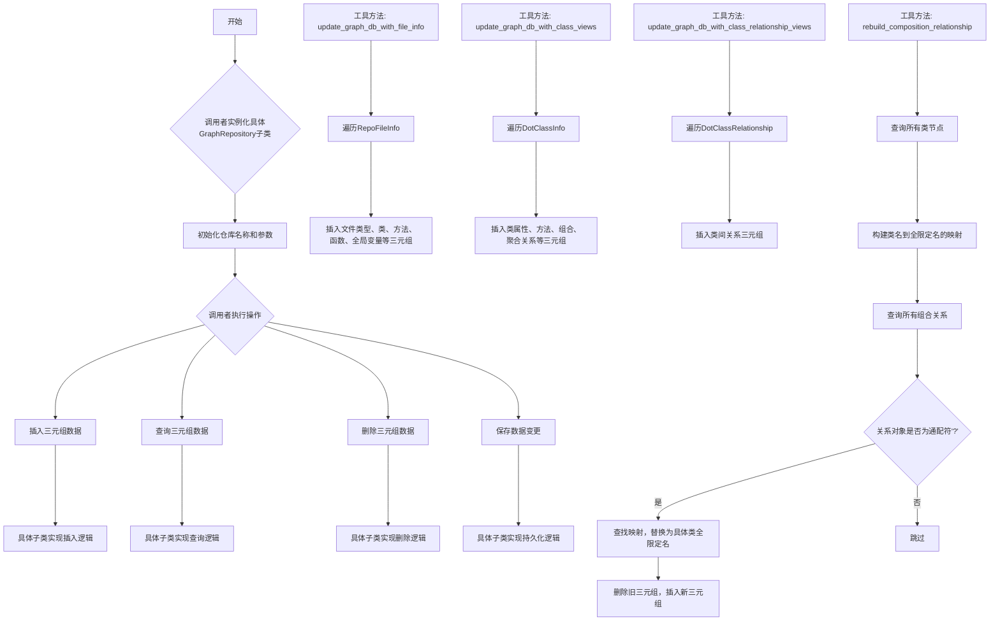
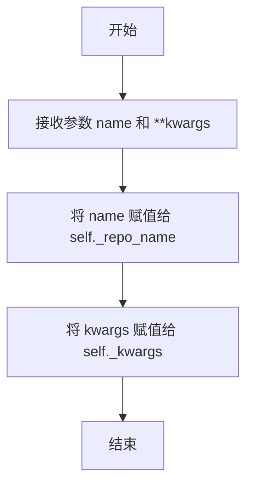
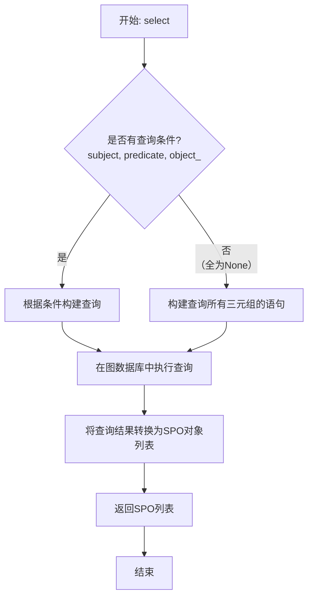
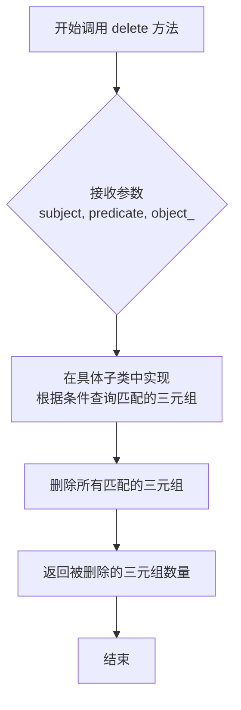
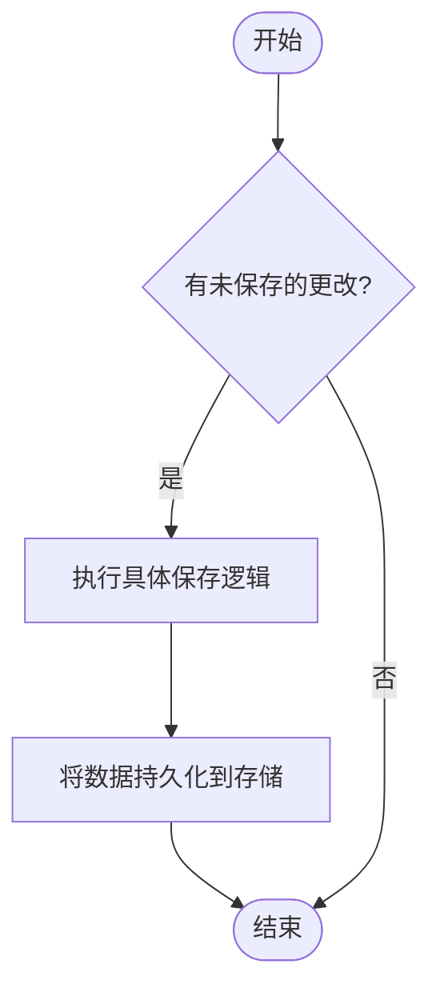
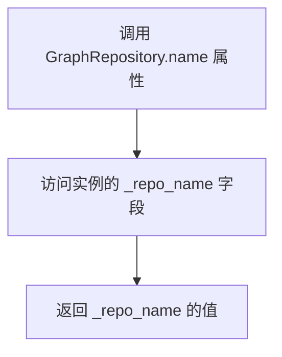
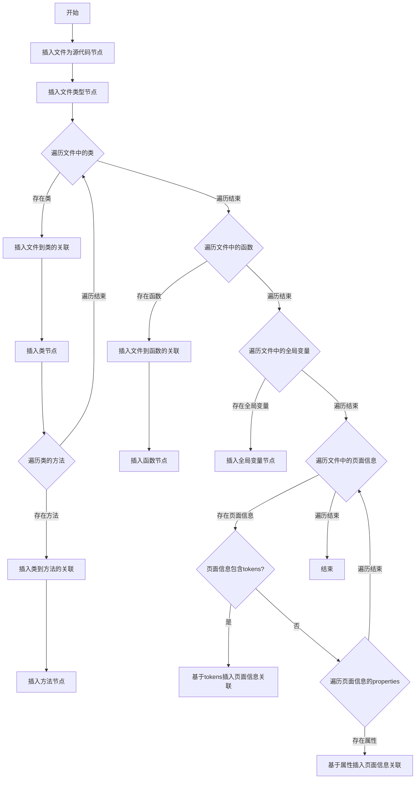
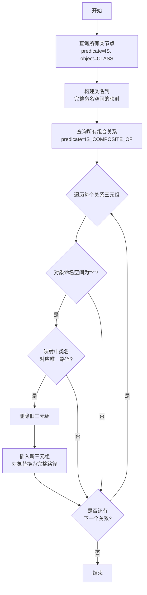

```mermaid
flowchart TD
    A[开始: update_graph_db_with_class_views] --> B{遍历 class_views 列表};
    B --> C[获取当前 DotClassInfo 对象 c];
    C --> D[从 c.package 提取文件名 filename];
    D --> E[插入三元组: filename IS SOURCE_CODE];
    E --> F[根据文件后缀确定 file_type];
    F --> G[插入三元组: filename IS file_type];
    G --> H[插入三元组: filename HAS_CLASS c.package];
    H --> I[插入三元组: c.package IS CLASS];
    I --> J[插入三元组: c.package HAS_DETAIL c的JSON详情];
    
    J --> K{遍历 c.attributes 字典};
    K --> L[插入三元组: c.package HAS_CLASS_PROPERTY 属性名];
    L --> M[插入三元组: 属性名 IS CLASS_PROPERTY];
    M --> N[插入三元组: 属性名 HAS_DETAIL 属性类型详情];
    N --> O{是否还有下一个属性?};
    O -- 是 --> K;
    O -- 否 --> P;

    P --> Q{遍历 c.methods 字典};
    Q --> R[插入三元组: c.package HAS_CLASS_METHOD 方法名];
    R --> S[插入三元组: 方法名 IS CLASS_METHOD];
    S --> T[插入三元组: 方法名 HAS_DETAIL 方法类型详情];
    T --> U{是否还有下一个方法?};
    U -- 是 --> Q;
    U -- 否 --> V;

    V --> W{遍历 c.compositions 列表};
    W --> X[插入三元组: c.package IS_COMPOSITE_OF 组合目标类];
    X --> Y{是否还有下一个组合关系?};
    Y -- 是 --> W;
    Y -- 否 --> Z;

    Z --> AA{遍历 c.aggregations 列表};
    AA --> AB[插入三元组: c.package IS_AGGREGATE_OF 聚合目标类];
    AB --> AC{是否还有下一个聚合关系?};
    AC -- 是 --> AA;
    AC -- 否 --> AD;

    AD --> AE{是否还有下一个 DotClassInfo?};
    AE -- 是 --> B;
    AE -- 否 --> AF[结束];
```

# `.\MetaGPT\metagpt\utils\graph_repository.py` 详细设计文档

该文件定义了一个图数据库仓库的抽象基类 `GraphRepository`，用于存储和查询以三元组（Subject-Predicate-Object）形式表示的知识图谱数据。它提供了插入、查询、删除和保存数据的基本接口，并包含多个静态工具方法，用于将代码仓库的结构化信息（如类、函数、全局变量、类关系等）转换为三元组并批量导入图数据库，从而构建一个反映代码结构和关系的知识图谱。

## 整体流程



## 类结构

```
GraphRepository (抽象基类)
├── __init__
├── insert (抽象方法)
├── select (抽象方法)
├── delete (抽象方法)
├── save (抽象方法)
├── name (属性)
├── update_graph_db_with_file_info (静态方法)
├── update_graph_db_with_class_views (静态方法)
├── update_graph_db_with_class_relationship_views (静态方法)
└── rebuild_composition_relationship (静态方法)
GraphKeyword (常量类)
SPO (数据模型类)
```

## 全局变量及字段


### `SPO.subject`
    
三元组的主语，表示关系中的主体实体。

类型：`str`
    


### `SPO.predicate`
    
三元组的谓语，描述主语和宾语之间的关系类型。

类型：`str`
    


### `SPO.object_`
    
三元组的宾语，表示关系中的客体实体。

类型：`str`
    


### `GraphRepository._repo_name`
    
图数据库仓库的名称标识符。

类型：`str`
    


### `GraphRepository._kwargs`
    
存储初始化时传入的额外关键字参数，用于配置具体实现。

类型：`dict`
    
    

## 全局函数及方法

### `GraphRepository.__init__`

GraphRepository 抽象基类的构造函数，用于初始化图数据库仓库实例。它接收一个仓库名称和可选的关键字参数，并将它们存储在实例变量中，为后续的图数据操作提供基础配置。

参数：

- `name`：`str`，图数据库仓库的名称，用于标识不同的仓库实例。
- `**kwargs`：`dict`，可选的关键字参数，允许传递额外的配置信息给具体的子类实现。

返回值：`None`，构造函数不返回任何值。

#### 流程图



#### 带注释源码

```python
def __init__(self, name: str, **kwargs):
    # 初始化图数据库仓库的名称
    self._repo_name = name
    # 存储可选的关键字参数，供子类使用
    self._kwargs = kwargs
```

### `GraphRepository.insert`

这是一个抽象方法，用于向图数据库中插入一个新的三元组（Subject-Predicate-Object）。作为抽象基类 `GraphRepository` 的一部分，它定义了所有具体图数据库实现必须遵循的插入操作接口。该方法接收三个字符串参数，分别代表三元组的主语、谓语和宾语，并将它们持久化到图数据库中。

参数：
- `subject`：`str`，三元组的主语，表示关系的起点或实体。
- `predicate`：`str`，三元组的谓语，描述主语和宾语之间的关系。
- `object_`：`str`，三元组的宾语，表示关系的终点或目标实体。

返回值：`None`，此方法不返回任何值，其作用是执行插入操作。

#### 流程图

```mermaid
flowchart TD
    A[开始: insert(subject, predicate, object_)] --> B{是否为抽象方法?}
    B -- 是 --> C[由子类实现具体逻辑]
    B -- 否 --> D[执行具体图数据库的插入操作]
    C --> E[结束]
    D --> E
```

#### 带注释源码

```python
    @abstractmethod
    async def insert(self, subject: str, predicate: str, object_: str):
        """Insert a new triple into the graph repository.

        Args:
            subject (str): The subject of the triple.
            predicate (str): The predicate describing the relationship.
            object_ (str): The object of the triple.

        Example:
            await my_repository.insert(subject="Node1", predicate="connects_to", object_="Node2")
            # Inserts a triple: Node1 connects_to Node2 into the graph repository.
        """
        pass
```

### `GraphRepository.select`

这是一个抽象方法，用于从图数据库中根据指定的条件（主题、谓词、对象）检索三元组。它允许进行灵活的查询，可以指定任意一个、两个或三个条件来过滤结果。如果所有条件都为None，则可能返回所有三元组（具体行为由子类实现决定）。

参数：
- `subject`：`str`，可选，用于过滤三元组的主语。
- `predicate`：`str`，可选，用于过滤三元组的谓词。
- `object_`：`str`，可选，用于过滤三元组的宾语。

返回值：`List[SPO]`，一个SPO对象列表，代表所有匹配查询条件的三元组。

#### 流程图



#### 带注释源码

```python
    @abstractmethod
    async def select(self, subject: str = None, predicate: str = None, object_: str = None) -> List[SPO]:
        """Retrieve triples from the graph repository based on specified criteria.

        Args:
            subject (str, optional): The subject of the triple to filter by.
            predicate (str, optional): The predicate describing the relationship to filter by.
            object_ (str, optional): The object of the triple to filter by.

        Returns:
            List[SPO]: A list of SPO objects representing the selected triples.

        Example:
            selected_triples = await my_repository.select(subject="Node1", predicate="connects_to")
            # Retrieves triples where Node1 is the subject and the predicate is 'connects_to'.
        """
        pass
```


### `GraphRepository.delete`

`GraphRepository.delete` 是一个抽象方法，用于从图数据库中删除符合指定条件的三元组（Subject-Predicate-Object）。调用者可以指定主题、谓词和对象中的任意一个或多个作为筛选条件，该方法将删除所有匹配的三元组并返回被删除的数量。具体的删除逻辑由继承 `GraphRepository` 的子类实现。

参数：

-  `subject`：`str`，可选参数。要删除的三元组的主题。如果为 `None`，则不以此条件进行筛选。
-  `predicate`：`str`，可选参数。要删除的三元组的谓词（关系）。如果为 `None`，则不以此条件进行筛选。
-  `object_`：`str`，可选参数。要删除的三元组的对象。如果为 `None`，则不以此条件进行筛选。

返回值：`int`，从图数据库中删除的三元组数量。

#### 流程图



#### 带注释源码

```python
    @abstractmethod
    async def delete(self, subject: str = None, predicate: str = None, object_: str = None) -> int:
        """Delete triples from the graph repository based on specified criteria.

        Args:
            subject (str, optional): The subject of the triple to filter by.
            predicate (str, optional): The predicate describing the relationship to filter by.
            object_ (str, optional): The object of the triple to filter by.

        Returns:
            int: The number of triples deleted from the repository.

        Example:
            deleted_count = await my_repository.delete(subject="Node1", predicate="connects_to")
            # Deletes triples where Node1 is the subject and the predicate is 'connects_to'.
        """
        pass
```


### `GraphRepository.save`

`GraphRepository.save` 是一个抽象方法，用于将图数据库中的任何更改持久化保存。作为抽象基类 `GraphRepository` 的一部分，它定义了所有具体图数据库实现必须遵循的接口。该方法不接收参数，也不返回任何值，其核心职责是确保内存中的图数据（如三元组）被安全地写入到持久化存储中（如磁盘文件、数据库等）。具体的保存逻辑（如事务处理、数据序列化、存储介质交互）由继承此类的子类实现。

参数：
- 无

返回值：`None`，无返回值

#### 流程图



#### 带注释源码

```python
    @abstractmethod
    async def save(self):
        """Save any changes made to the graph repository.

        Example:
            await my_repository.save()
            # Persists any changes made to the graph repository.
        """
        pass
```

### `GraphRepository.name`

这是一个属性访问器（property getter），用于获取图数据库仓库的名称。它返回在初始化 `GraphRepository` 实例时设置的 `_repo_name` 私有属性值。此属性是只读的，提供了对仓库标识符的安全访问。

参数：
- 无显式参数。作为属性访问器，它通过 `self` 隐式访问实例。

返回值：`str`，返回图数据库仓库的名称字符串。

#### 流程图



#### 带注释源码

```python
    @property
    def name(self) -> str:
        """Get the name of the graph repository."""
        return self._repo_name
```

### `GraphRepository.update_graph_db_with_file_info`

这是一个静态方法，用于将 `RepoFileInfo` 对象中包含的代码文件结构信息（如类、方法、函数、全局变量等）作为三元组（Subject-Predicate-Object）插入到指定的图数据库中。它通过一系列预定义的谓词（如 `is`, `has_class`, `has_function` 等）来构建文件、代码元素及其属性之间的关系图。

参数：
- `graph_db`：`GraphRepository`，需要被更新的图数据库实例。
- `file_info`：`RepoFileInfo`，包含待插入文件结构信息的对象。

返回值：`None`，此方法不返回任何值。

#### 流程图



#### 带注释源码

```python
@staticmethod
async def update_graph_db_with_file_info(graph_db: "GraphRepository", file_info: RepoFileInfo):
    """Insert information of RepoFileInfo into the specified graph repository.

    This function updates the provided graph repository with information from the given RepoFileInfo object.
    The function inserts triples related to various dimensions such as file type, class, class method, function,
    global variable, and page info.

    Triple Patterns:
    - (?, is, [file type])
    - (?, has class, ?)
    - (?, is, [class])
    - (?, has class method, ?)
    - (?, has function, ?)
    - (?, is, [function])
    - (?, is, global variable)
    - (?, has page info, ?)

    Args:
        graph_db (GraphRepository): The graph repository object to be updated.
        file_info (RepoFileInfo): The RepoFileInfo object containing information to be inserted.

    Example:
        await update_graph_db_with_file_info(my_graph_repo, my_file_info)
        # Updates 'my_graph_repo' with information from 'my_file_info'.
    """
    # 1. 将文件本身标记为源代码节点
    await graph_db.insert(subject=file_info.file, predicate=GraphKeyword.IS, object_=GraphKeyword.SOURCE_CODE)
    # 2. 根据文件后缀确定并插入文件类型节点
    file_types = {".py": "python", ".js": "javascript"}
    file_type = file_types.get(Path(file_info.file).suffix, GraphKeyword.NULL)
    await graph_db.insert(subject=file_info.file, predicate=GraphKeyword.IS, object_=file_type)

    # 3. 处理文件中的所有类
    for c in file_info.classes:
        class_name = c.get("name", "")
        # 3.1 建立文件到类的关联
        await graph_db.insert(
            subject=file_info.file,
            predicate=GraphKeyword.HAS_CLASS,
            object_=concat_namespace(file_info.file, class_name),
        )
        # 3.2 将类本身作为一个节点插入
        await graph_db.insert(
            subject=concat_namespace(file_info.file, class_name),
            predicate=GraphKeyword.IS,
            object_=GraphKeyword.CLASS,
        )
        # 3.3 处理类中的所有方法
        methods = c.get("methods", [])
        for fn in methods:
            # 3.3.1 建立类到方法的关联
            await graph_db.insert(
                subject=concat_namespace(file_info.file, class_name),
                predicate=GraphKeyword.HAS_CLASS_METHOD,
                object_=concat_namespace(file_info.file, class_name, fn),
            )
            # 3.3.2 将方法本身作为一个节点插入
            await graph_db.insert(
                subject=concat_namespace(file_info.file, class_name, fn),
                predicate=GraphKeyword.IS,
                object_=GraphKeyword.CLASS_METHOD,
            )

    # 4. 处理文件中的所有函数
    for f in file_info.functions:
        # 4.1 建立文件到函数的关联
        await graph_db.insert(
            subject=file_info.file, predicate=GraphKeyword.HAS_FUNCTION, object_=concat_namespace(file_info.file, f)
        )
        # 4.2 将函数本身作为一个节点插入
        await graph_db.insert(
            subject=concat_namespace(file_info.file, f), predicate=GraphKeyword.IS, object_=GraphKeyword.FUNCTION
        )

    # 5. 处理文件中的所有全局变量
    for g in file_info.globals:
        await graph_db.insert(
            subject=concat_namespace(file_info.file, g),
            predicate=GraphKeyword.IS,
            object_=GraphKeyword.GLOBAL_VARIABLE,
        )

    # 6. 处理文件中的页面信息（如代码块、文档等）
    for code_block in file_info.page_info:
        # 6.1 如果代码块有tokens，则基于tokens创建关联
        if code_block.tokens:
            await graph_db.insert(
                subject=concat_namespace(file_info.file, *code_block.tokens),
                predicate=GraphKeyword.HAS_PAGE_INFO,
                object_=code_block.model_dump_json(),
            )
        # 6.2 遍历代码块的属性，基于每个属性创建关联
        for k, v in code_block.properties.items():
            await graph_db.insert(
                subject=concat_namespace(file_info.file, k, v),
                predicate=GraphKeyword.HAS_PAGE_INFO,
                object_=code_block.model_dump_json(),
            )
```

### `GraphRepository.update_graph_db_with_class_views`

这是一个静态方法，用于将 `DotClassInfo` 对象列表中的类视图信息（如类定义、属性、方法、组合与聚合关系）插入到指定的图数据库中。它通过构建一系列三元组（Subject-Predicate-Object）来结构化地表示代码中的类及其关系，从而在图数据库中建立代码的语义模型。

参数：

- `graph_db`：`GraphRepository`，目标图数据库实例，用于执行三元组的插入操作。
- `class_views`：`List[DotClassInfo]`，包含类视图信息的对象列表，每个对象代表一个类的详细定义。

返回值：`None`，此方法不返回任何值，其作用是通过副作用更新图数据库。

#### 流程图



#### 带注释源码

```python
    @staticmethod
    async def update_graph_db_with_class_views(graph_db: "GraphRepository", class_views: List[DotClassInfo]):
        """Insert dot format class information into the specified graph repository.

        This function updates the provided graph repository with class information from the given list of DotClassInfo objects.
        The function inserts triples related to various aspects of class views, including source code, file type, class,
        class property, class detail, method, composition, and aggregation.

        Triple Patterns:
        - (?, is, source code)
        - (?, is, file type)
        - (?, has class, ?)
        - (?, is, class)
        - (?, has class property, ?)
        - (?, is, class property)
        - (?, has detail, ?)
        - (?, has method, ?)
        - (?, is composite of, ?)
        - (?, is aggregate of, ?)

        Args:
            graph_db (GraphRepository): The graph repository object to be updated.
            class_views (List[DotClassInfo]): List of DotClassInfo objects containing class information to be inserted.


        Example:
            await update_graph_db_with_class_views(my_graph_repo, [class_info1, class_info2])
            # Updates 'my_graph_repo' with class information from the provided list of DotClassInfo objects.
        """
        # 遍历传入的类视图信息列表
        for c in class_views:
            # 从类信息中的包名（如 `filename:ClassName`）提取文件名部分
            filename, _ = c.package.split(":", 1)
            # 插入三元组：标识该文件是一个源代码文件
            await graph_db.insert(subject=filename, predicate=GraphKeyword.IS, object_=GraphKeyword.SOURCE_CODE)
            # 根据文件后缀映射编程语言类型
            file_types = {".py": "python", ".js": "javascript"}
            file_type = file_types.get(Path(filename).suffix, GraphKeyword.NULL)
            # 插入三元组：标识该文件的编程语言类型
            await graph_db.insert(subject=filename, predicate=GraphKeyword.IS, object_=file_type)
            # 插入三元组：建立文件与类之间的包含关系
            await graph_db.insert(subject=filename, predicate=GraphKeyword.HAS_CLASS, object_=c.package)
            # 插入三元组：标识该节点是一个类
            await graph_db.insert(
                subject=c.package,
                predicate=GraphKeyword.IS,
                object_=GraphKeyword.CLASS,
            )
            # 插入三元组：存储该类的完整详细信息（JSON格式）
            await graph_db.insert(subject=c.package, predicate=GraphKeyword.HAS_DETAIL, object_=c.model_dump_json())
            # 遍历类的属性（成员变量）
            for vn, vt in c.attributes.items():
                # 插入三元组：建立类与其属性之间的拥有关系
                await graph_db.insert(
                    subject=c.package,
                    predicate=GraphKeyword.HAS_CLASS_PROPERTY,
                    object_=concat_namespace(c.package, vn),
                )
                # 插入三元组：标识该节点是一个类属性
                await graph_db.insert(
                    subject=concat_namespace(c.package, vn),
                    predicate=GraphKeyword.IS,
                    object_=GraphKeyword.CLASS_PROPERTY,
                )
                # 插入三元组：存储该属性的类型等详细信息
                await graph_db.insert(
                    subject=concat_namespace(c.package, vn),
                    predicate=GraphKeyword.HAS_DETAIL,
                    object_=vt.model_dump_json(),
                )
            # 遍历类的方法
            for fn, ft in c.methods.items():
                # 插入三元组：建立类与其方法之间的拥有关系
                await graph_db.insert(
                    subject=c.package,
                    predicate=GraphKeyword.HAS_CLASS_METHOD,
                    object_=concat_namespace(c.package, fn),
                )
                # 插入三元组：标识该节点是一个类方法
                await graph_db.insert(
                    subject=concat_namespace(c.package, fn),
                    predicate=GraphKeyword.IS,
                    object_=GraphKeyword.CLASS_METHOD,
                )
                # 插入三元组：存储该方法的签名等详细信息
                await graph_db.insert(
                    subject=concat_namespace(c.package, fn),
                    predicate=GraphKeyword.HAS_DETAIL,
                    object_=ft.model_dump_json(),
                )
            # 遍历类的组合关系（强拥有关系）
            for i in c.compositions:
                # 插入三元组：建立类与其组合部件之间的关系，目标类名暂时用 `?` 作为命名空间占位符
                await graph_db.insert(
                    subject=c.package, predicate=GraphKeyword.IS_COMPOSITE_OF, object_=concat_namespace("?", i)
                )
            # 遍历类的聚合关系（弱拥有关系）
            for i in c.aggregations:
                # 插入三元组：建立类与其聚合部件之间的关系，目标类名暂时用 `?` 作为命名空间占位符
                await graph_db.insert(
                    subject=c.package, predicate=GraphKeyword.IS_AGGREGATE_OF, object_=concat_namespace("?", i)
                )
```

### `GraphRepository.update_graph_db_with_class_relationship_views`

该方法用于将类关系视图（`DotClassRelationship` 对象列表）插入到指定的图数据库中。它遍历关系列表，为每个关系创建两种类型的三元组：一种是表示源类与目标类之间的基本关系（如继承、关联等），另一种是在关系有标签时，创建一个包含该标签的、更具体的关系三元组。这有助于在图数据库中构建类之间的语义连接。

参数：

- `graph_db`：`GraphRepository`，目标图数据库实例，用于执行三元组的插入操作。
- `relationship_views`：`List[DotClassRelationship]`，包含类关系信息的对象列表，每个对象定义了源类、目标类、关系类型和可选的标签。

返回值：`None`，该方法不返回任何值，其作用是通过副作用更新图数据库。

#### 流程图

```mermaid
flowchart TD
    A[开始] --> B{遍历 relationship_views 列表}
    B --> C[取出当前关系 r]
    C --> D[插入基本关系三元组<br/>subject: r.src<br/>predicate: IS + r.relationship + OF<br/>object: r.dest]
    D --> E{r.label 存在?}
    E -- 是 --> F[插入带标签的关系三元组<br/>subject: r.src<br/>predicate: IS + r.relationship + ON<br/>object: concat_namespace(r.dest, r.label)]
    E -- 否 --> G[继续循环]
    F --> G
    G --> B
    B -- 遍历结束 --> H[结束]
```

#### 带注释源码

```python
@staticmethod
async def update_graph_db_with_class_relationship_views(
    graph_db: "GraphRepository", relationship_views: List[DotClassRelationship]
):
    """Insert class relationships and labels into the specified graph repository.

    This function updates the provided graph repository with class relationship information from the given list
    of DotClassRelationship objects. The function inserts triples representing relationships and labels between
    classes.

    Triple Patterns:
    - (?, is relationship of, ?)
    - (?, is relationship on, ?)

    Args:
        graph_db (GraphRepository): The graph repository object to be updated.
        relationship_views (List[DotClassRelationship]): List of DotClassRelationship objects containing
        class relationship information to be inserted.

    Example:
        await update_graph_db_with_class_relationship_views(my_graph_repo, [relationship1, relationship2])
        # Updates 'my_graph_repo' with class relationship information from the provided list of DotClassRelationship objects.

    """
    # 遍历传入的所有类关系对象
    for r in relationship_views:
        # 插入基本关系三元组：源类 -(IS关系类型OF)-> 目标类
        # 例如：ClassA -(ISInheritanceOf)-> ClassB
        await graph_db.insert(
            subject=r.src, predicate=GraphKeyword.IS + r.relationship + GraphKeyword.OF, object_=r.dest
        )
        # 如果该关系有标签（label），则额外插入一个带标签的三元组
        # 这提供了关于此关系的更具体上下文
        if not r.label:
            continue
        # 插入带标签的关系三元组：源类 -(IS关系类型ON)-> 目标类:标签
        # 例如：ClassA -(ISAssociationOn)-> ClassB:member
        await graph_db.insert(
            subject=r.src,
            predicate=GraphKeyword.IS + r.relationship + GraphKeyword.ON,
            object_=concat_namespace(r.dest, r.label),
        )
```

### `GraphRepository.rebuild_composition_relationship`

该方法用于重建图数据库中的组合关系。它通过查询所有类节点，构建一个类名到其完整命名空间路径的映射。然后，它查找所有未指定命名空间的组合关系（即对象以“?”开头的三元组），并根据映射将这些关系的对象替换为正确的、完整的命名空间路径。这确保了组合关系指向的是具体的、已存在的类节点，而不是一个模糊的占位符。

参数：

- `graph_db`：`GraphRepository`，需要被更新的图数据库对象。

返回值：`None`，该方法不返回任何值，直接修改传入的图数据库。

#### 流程图



#### 带注释源码

```python
    @staticmethod
    async def rebuild_composition_relationship(graph_db: "GraphRepository"):
        """Append namespace-prefixed information to relationship SPO (Subject-Predicate-Object) objects in the graph
            repository.

        This function updates the provided graph repository by appending namespace-prefixed information to existing
        relationship SPO objects.

        Args:
            graph_db (GraphRepository): The graph repository object to be updated.
        """
        # 1. 查询所有标记为“类”的节点
        classes = await graph_db.select(predicate=GraphKeyword.IS, object_=GraphKeyword.CLASS)
        # 2. 构建一个映射：类名 -> [该类的完整命名空间路径列表]
        mapping = defaultdict(list)
        for c in classes:
            name = split_namespace(c.subject)[-1]  # 从完整路径中提取类名
            mapping[name].append(c.subject)  # 将完整路径添加到该类名对应的列表中

        # 3. 查询所有组合关系（IS_COMPOSITE_OF）
        rows = await graph_db.select(predicate=GraphKeyword.IS_COMPOSITE_OF)
        # 4. 遍历每个组合关系
        for r in rows:
            ns, class_ = split_namespace(r.object_)  # 分解关系对象的命名空间和类名
            if ns != "?":  # 如果命名空间不是占位符“?”，说明已经处理过，跳过
                continue
            val = mapping[class_]  # 根据类名获取可能的完整路径列表
            if len(val) != 1:  # 如果该类名对应多个路径（歧义）或没有路径，则无法确定，跳过
                continue
            ns_name = val[0]  # 获取唯一的完整路径
            # 5. 删除旧的、不明确的关系三元组
            await graph_db.delete(subject=r.subject, predicate=r.predicate, object_=r.object_)
            # 6. 插入新的、指向具体类节点的关系三元组
            await graph_db.insert(subject=r.subject, predicate=r.predicate, object_=ns_name)
```

## 关键组件


### GraphRepository 抽象基类

定义了图数据库仓库的抽象接口，提供了插入、查询、删除和保存三元组数据的基本操作，是具体图数据库实现（如 Neo4j、NetworkX）的基类。

### SPO 数据模型

表示图数据库中的一条三元组记录，包含主语（Subject）、谓语（Predicate）和宾语（Object）三个核心字段，用于结构化地存储和查询图中的关系数据。

### GraphKeyword 常量类

定义了在图数据库操作中使用的一系列标准关键词和关系谓词（如 `IS`、`HAS_CLASS`、`IS_COMPOSITE_OF`），用于统一和规范三元组中谓语的值，确保数据语义的一致性。

### 静态数据导入方法 (`update_graph_db_with_*`)

一组静态工具方法（`update_graph_db_with_file_info`, `update_graph_db_with_class_views`, `update_graph_db_with_class_relationship_views`），用于将不同来源的代码结构信息（如文件信息、类图、类关系）转换并批量导入到图数据库中，构建代码知识图谱。

### 命名空间工具函数 (`concat_namespace`, `split_namespace`)

用于生成和解析图中节点唯一标识符的工具函数。通过将文件路径、类名、方法名等拼接成唯一的命名空间字符串，或将其拆分，来确保图中节点标识的唯一性和可追溯性。

### 关系重建逻辑 (`rebuild_composition_relationship`)

一个后处理函数，用于解析和修正图中类之间的组合关系（`IS_COMPOSITE_OF`）。它通过查询现有的类节点，将关系中的占位符（如 `"?"`）替换为具体的、带有完整命名空间的类节点标识符，从而完善图谱中的关系链接。


## 问题及建议


### 已知问题

-   **硬编码的文件类型映射**：`update_graph_db_with_file_info` 和 `update_graph_db_with_class_views` 方法中，文件后缀与类型的映射（如 `.py` -> `"python"`）是硬编码的。这限制了代码的扩展性，当需要支持新的文件类型（如 `.java`, `.cpp`）时，必须修改源代码。
-   **潜在的重复插入**：`update_graph_db_with_file_info` 和 `update_graph_db_with_class_views` 方法都包含插入 `(filename, IS, SOURCE_CODE)` 和 `(filename, IS, file_type)` 三元组的逻辑。如果同一个文件被两个方法先后处理，会导致重复数据。虽然 `insert` 方法的具体实现未知，但重复数据可能影响查询效率或导致数据不一致。
-   **脆弱的命名空间拼接与拆分**：`concat_namespace` 和 `split_namespace` 函数的具体实现未知。如果它们的拼接/拆分规则（如分隔符）发生变化，或者处理包含特殊字符的字符串时出现问题，将直接影响所有依赖它们构建和解析标识符的方法，可能导致数据损坏或查询失败。
-   **`rebuild_composition_relationship` 方法中的模糊匹配风险**：该方法通过类名的简单匹配（`mapping[name]`）来查找完整的命名空间路径。如果项目中存在多个同名的类（在不同命名空间下），`len(val) != 1` 的条件会导致跳过更新，这可能使某些组合关系无法正确重建，留下不完整或错误的数据（`object_` 仍为 `concat_namespace("?", i)`）。
-   **抽象基类（ABC）缺少关键约束**：`GraphRepository` 作为抽象基类，其 `insert`, `select`, `delete`, `save` 方法都是抽象的，但未对它们的行为（如幂等性、事务性）和性能（如查询复杂度）做出任何约定或文档说明。不同的具体实现可能行为迥异，增加上层代码的使用复杂度和维护成本。
-   **静态方法依赖具体实现细节**：`update_graph_db_with_file_info` 等静态方法直接操作 `graph_db` 参数，并假设其 `insert` 和 `delete` 方法的行为符合预期。这增加了与具体 `GraphRepository` 子类实现的耦合度，如果子类的 `insert` 不是幂等的，或者 `delete` 有副作用，静态方法的行为可能不可预测。
-   **错误处理缺失**：所有方法（包括抽象方法和静态工具方法）均未包含任何错误处理逻辑（如 try-catch）。当底层数据库操作失败、输入数据格式错误或 `concat_namespace`/`split_namespace` 抛出异常时，程序会直接崩溃，缺乏健壮性。
-   **`SPO` 模型字段命名冲突**：`SPO` 类使用 `object_` 作为字段名以避免与 Python 关键字 `object` 冲突，但这在代码库中可能不一致或令人困惑。在 `select` 和 `delete` 方法中，参数也使用了 `object_`，但在文档字符串示例中却使用了 `object`，存在不一致。

### 优化建议

-   **将文件类型映射配置化**：将文件后缀到类型的映射提取到配置文件或类常量中，例如在 `GraphKeyword` 类中定义 `FILE_TYPE_MAPPING = {".py": "python", ".js": "javascript"}`，并在方法中引用。这样支持新类型时只需修改配置，无需改动核心逻辑。
-   **消除重复插入逻辑**：重构代码，确保每个文件的基础信息（如文件类型）只被插入一次。可以设计一个单独的方法（如 `_insert_file_metadata`）来负责此类操作，并在 `update_graph_db_with_file_info` 和 `update_graph_db_with_class_views` 中调用。或者，在 `insert` 方法实现中保证幂等性。
-   **增强命名空间工具的健壮性**：确保 `concat_namespace` 和 `split_namespace` 函数能处理边缘情况（如空字符串、包含分隔符的部件），并进行充分的单元测试。考虑使用标准库的 `urllib.parse` 或定义明确的转义机制。
-   **改进 `rebuild_composition_relationship` 的匹配策略**：除了类名，可以尝试利用更多上下文信息（如所在文件名、包路径）进行更精确的匹配，以减少因同名类导致的更新失败。或者，在无法唯一确定时记录警告或提供手动干预的接口。
-   **完善抽象基类的契约**：在 `GraphRepository` 的文档字符串中，明确约定关键方法的行为期望，例如 `insert` 是否应幂等、`select` 在参数为 `None` 时的语义、`save` 是否应同步持久化等。考虑使用 `typing` 模块提供更丰富的类型提示。
-   **降低静态方法与实现的耦合**：考虑将静态工具方法转化为实例方法，或者依赖一个更抽象的接口而非直接调用 `insert`/`delete`。也可以提供回调或钩子机制，允许具体实现自定义部分行为。
-   **增加全面的错误处理**：在所有数据库操作方法（`insert`, `select`, `delete`, `save`）以及静态工具方法中，添加适当的异常捕获和日志记录。可以定义项目特定的异常类型（如 `GraphRepositoryError`）来统一错误处理。
-   **统一并改进 `SPO` 模型**：如果可行，考虑将 `object_` 字段重命名为更直观的名称，如 `obj` 或 `target`，并在整个代码库中保持一致。确保文档字符串和实际代码参数名匹配。
-   **考虑性能优化**：`update_graph_db_with_*` 系列方法包含大量循环和单独的 `insert` 调用。如果底层图数据库支持批量操作，可以重构这些方法，收集所有三元组后进行批量插入，以显著提高数据导入性能。
-   **添加数据验证**：在 `insert` 方法或静态工具方法中，增加对输入参数（`subject`, `predicate`, `object_`）的验证，例如检查非空字符串、长度限制或有效字符，防止无效数据污染图数据库。


## 其它


### 设计目标与约束

本模块旨在定义一个图数据库存储库的抽象基类，提供对代码仓库元数据进行图结构存储和查询的统一接口。核心设计目标包括：1) 定义标准化的三元组(SPO)数据模型和操作接口(增删改查)，为不同底层图数据库实现提供抽象层；2) 提供将代码分析结果（如类、函数、关系）转换为图结构并持久化的工具方法；3) 支持通过命名空间机制管理代码元素的层次关系。主要约束包括：依赖`RepoFileInfo`、`DotClassInfo`等外部数据模型；异步接口设计；使用预定义的`GraphKeyword`词汇表确保语义一致性。

### 错误处理与异常设计

当前实现未显式定义错误处理机制。作为抽象基类，它依赖于具体子类实现错误处理。潜在异常包括：1) 数据库连接/操作失败；2) 无效的三元组数据（如空值、格式错误）；3) 在静态方法中，传入的`graph_db`或数据对象参数无效。建议在子类实现中，对`insert`、`select`、`delete`、`save`等抽象方法定义明确的异常类型（如`GraphOperationError`），并在静态工具方法（如`update_graph_db_with_file_info`）中添加参数验证和异常捕获，将底层异常转换为更语义化的应用层异常。

### 数据流与状态机

模块核心数据流为：外部代码分析工具生成的结构化数据（`RepoFileInfo`, `DotClassInfo`, `DotClassRelationship`） -> 通过`GraphRepository`的静态更新方法（如`update_graph_db_with_file_info`） -> 转换为标准的三元组(SPO) -> 调用具体`GraphRepository`子实例的`insert`方法存入图数据库。状态变化主要体现在图数据库的持久化存储中，由`save`方法触发。`rebuild_composition_relationship`方法展示了数据间的依赖和修复流程：先查询所有类节点建立映射，再查找并更新不完整的组合关系边。

### 外部依赖与接口契约

1.  **数据模型依赖**：强依赖`metagpt.repo_parser`模块中的`RepoFileInfo`、`DotClassInfo`、`DotClassRelationship`。这些类的结构变化将直接影响本模块中更新方法的逻辑。
2.  **工具函数依赖**：依赖`metagpt.utils.common`中的`concat_namespace`和`split_namespace`进行命名空间管理。
3.  **基类与模型**：继承`ABC`，使用`pydantic.BaseModel`定义`SPO`。
4.  **接口契约**：
    *   `GraphRepository`抽象类定义了与具体图数据库实现之间的契约，包括异步的`insert`、`select`、`delete`、`save`方法签名。
    *   `GraphKeyword`类定义了整个图结构语义的词汇表契约，任何插入和查询操作都应基于此词汇表以确保一致性。
    *   静态更新方法（如`update_graph_db_with_*`）定义了将特定领域数据转换为图三元组的规则契约。

### 安全与合规考虑

当前代码未涉及明显的安全操作（如网络、文件IO）。主要考虑点在于：1) **数据注入**：如果`subject`、`predicate`、`object_`参数来自不可信来源，在具体数据库实现中需防范查询注入攻击。2) **敏感信息**：`RepoFileInfo.page_info`可能包含任意序列化的JSON数据，存入图数据库前需评估是否包含敏感信息。3) **合规性**：若存储的代码元数据涉及隐私或知识产权，需确保存储和访问符合相关合规要求。建议在子类实现中，对输入参数进行严格的验证和清理。

### 测试策略建议

1.  **单元测试**：
    *   为`SPO`模型验证数据验证逻辑。
    *   为每个静态工具方法（`update_graph_db_with_file_info`等）创建测试，验证给定输入数据是否能生成预期的三元组序列。可使用内存型或模拟的`GraphRepository`实现。
    *   测试`rebuild_composition_relationship`中的映射逻辑和边更新逻辑。
2.  **集成测试**：
    *   针对具体的`GraphRepository`子类（如Neo4j、NetworkX实现），测试从插入、查询到删除的完整流程。
    *   测试工具方法与具体仓库实现的协同工作。
3.  **契约测试**：确保所有`GraphRepository`子类都正确实现了抽象基类定义的接口契约。
4.  **异常测试**：测试在传入无效参数、空数据或模拟数据库故障时，系统的行为是否符合预期（如抛出特定异常）。


    