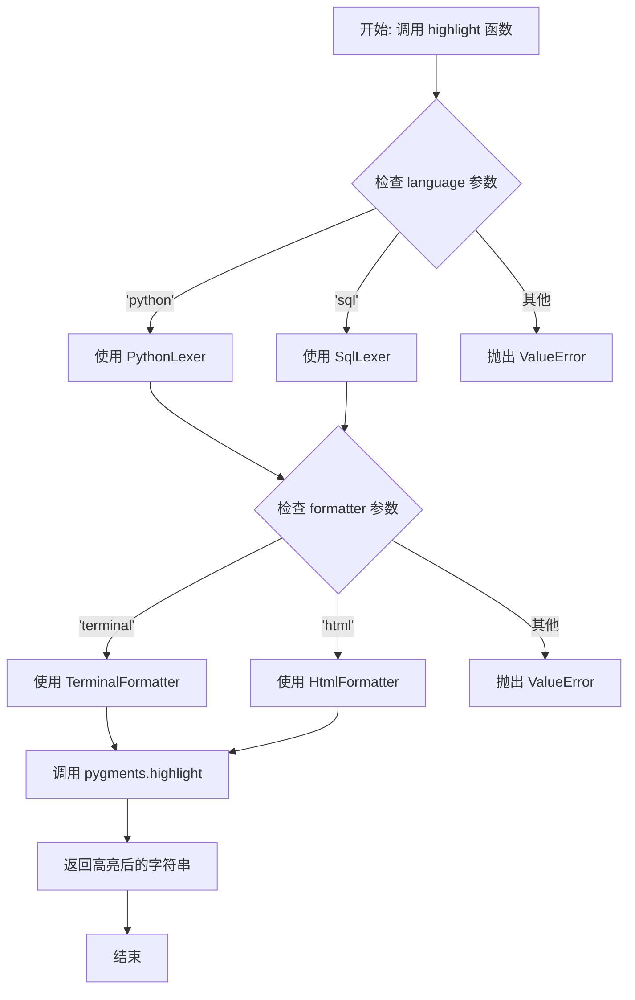

# `.\MetaGPT\metagpt\utils\highlight.py` 详细设计文档

该代码文件提供了一个通用的代码语法高亮工具函数，它利用 Pygments 库根据指定的编程语言（如 Python 或 SQL）和输出格式（如终端或 HTML）对输入的代码字符串进行语法高亮处理，并返回高亮后的结果。

## 整体流程



## 类结构

```
全局函数
└── highlight
```

## 全局变量及字段


### `highlight_`
    
从 pygments 模块导入的 highlight 函数，为避免命名冲突而重命名为 highlight_。

类型：`function`
    


### `HtmlFormatter`
    
从 pygments.formatters 模块导入的 HtmlFormatter 类，用于生成 HTML 格式的高亮代码。

类型：`class`
    


### `TerminalFormatter`
    
从 pygments.formatters 模块导入的 TerminalFormatter 类，用于生成终端格式的高亮代码。

类型：`class`
    


### `PythonLexer`
    
从 pygments.lexers 模块导入的 PythonLexer 类，用于解析 Python 代码语法。

类型：`class`
    


### `SqlLexer`
    
从 pygments.lexers 模块导入的 SqlLexer 类，用于解析 SQL 代码语法。

类型：`class`
    


    

## 全局函数及方法

### `highlight`

该函数接收一段代码字符串，根据指定的编程语言和输出格式，使用 Pygments 库进行语法高亮处理，并返回高亮后的字符串。

参数：

- `code`：`str`，需要进行语法高亮的源代码字符串。
- `language`：`str`，默认为 `"python"`。指定代码的编程语言，目前支持 `"python"` 和 `"sql"`。
- `formatter`：`str`，默认为 `"terminal"`。指定高亮输出的格式，目前支持 `"terminal"`（终端格式）和 `"html"`（HTML格式）。

返回值：`str`，经过语法高亮处理后的字符串。

#### 流程图

```mermaid
graph TD
    A[开始: highlight(code, language, formatter)] --> B{language 是否为 'python'?};
    B -- 是 --> C[lexer = PythonLexer];
    B -- 否 --> D{language 是否为 'sql'?};
    D -- 是 --> E[lexer = SqlLexer];
    D -- 否 --> F[抛出 ValueError];
    C --> G{formatter 是否为 'terminal'?};
    E --> G;
    G -- 是 --> H[formatter = TerminalFormatter];
    G -- 否 --> I{formatter 是否为 'html'?};
    I -- 是 --> J[formatter = HtmlFormatter];
    I -- 否 --> K[抛出 ValueError];
    H --> L[调用 pygments.highlight];
    J --> L;
    L --> M[返回高亮后的字符串];
    F --> N[结束: 异常];
    K --> N;
```

#### 带注释源码

```python
def highlight(code: str, language: str = "python", formatter: str = "terminal"):
    # 指定要高亮的语言
    # 根据 language 参数选择对应的 Pygments 词法分析器
    if language.lower() == "python":
        lexer = PythonLexer()
    elif language.lower() == "sql":
        lexer = SqlLexer()
    else:
        # 如果传入不支持的语言，抛出 ValueError 异常
        raise ValueError(f"Unsupported language: {language}")

    # 指定输出格式
    # 根据 formatter 参数选择对应的 Pygments 格式化器
    if formatter.lower() == "terminal":
        formatter = TerminalFormatter()
    elif formatter.lower() == "html":
        formatter = HtmlFormatter()
    else:
        # 如果传入不支持的格式，抛出 ValueError 异常
        raise ValueError(f"Unsupported formatter: {formatter}")

    # 使用 Pygments 高亮代码片段
    # 调用 pygments.highlight 函数，传入代码、词法分析器和格式化器，返回高亮后的字符串
    return highlight_(code, lexer, formatter)
```

## 关键组件


### Pygments 高亮引擎

该组件是代码高亮功能的核心，负责根据指定的编程语言和输出格式，将纯文本代码转换为带有语法高亮的格式化输出。

### 语言词法分析器 (Lexer)

该组件负责识别和解析不同编程语言的语法结构。代码中通过 `PythonLexer` 和 `SqlLexer` 分别处理 Python 和 SQL 语言的词法分析，为后续的高亮步骤提供语法标记。

### 输出格式器 (Formatter)

该组件负责将词法分析器生成的语法标记转换为特定格式的输出。代码中通过 `TerminalFormatter` 和 `HtmlFormatter` 分别生成适用于终端显示和网页显示的带样式代码。

### 高亮调度函数 (`highlight`)

该组件是代码高亮功能的统一入口和调度中心。它接收原始代码、目标语言和输出格式作为参数，协调调用相应的词法分析器和输出格式器，最终返回高亮后的结果字符串。


## 问题及建议


### 已知问题

-   **语言和格式化器支持有限**：当前代码仅支持 `python` 和 `sql` 两种语言以及 `terminal` 和 `html` 两种格式化器。任何其他输入都会导致 `ValueError` 异常，限制了代码的通用性和可扩展性。
-   **硬编码的映射逻辑**：语言到词法分析器（Lexer）以及格式化器名称到格式化器对象的映射是通过硬编码的 `if-elif-else` 语句实现的。这种实现方式在需要添加新支持时，必须直接修改函数代码，违反了开闭原则，使得维护变得困难。
-   **缺乏配置性和灵活性**：函数的行为（支持哪些语言和格式）是静态定义的，无法在运行时动态扩展或通过配置进行修改。这降低了代码在不同应用场景下的复用性。
-   **错误信息不够友好**：当传入不支持的语言或格式化器时，抛出的 `ValueError` 信息虽然指明了问题，但未向调用者提供当前支持的有效选项列表，不利于快速调试和问题定位。

### 优化建议

-   **使用字典映射替代硬编码逻辑**：建议使用字典来维护 `language -> lexer class` 和 `formatter_name -> formatter class` 的映射关系。这样可以清晰地集中管理所有支持项，并且添加新支持时只需更新字典，无需修改核心函数逻辑。
    ```python
    _SUPPORTED_LEXERS = {
        'python': PythonLexer,
        'sql': SqlLexer,
        # 可以轻松地在此添加新的映射，例如：
        # 'json': JsonLexer,
    }
    _SUPPORTED_FORMATTERS = {
        'terminal': TerminalFormatter,
        'html': HtmlFormatter,
    }
    ```
-   **增强可扩展性**：提供公共接口（如类方法或模块函数）允许用户在运行时注册自定义的词法分析器或格式化器，进一步解耦和增强灵活性。
-   **提供更详细的错误信息**：在抛出异常时，除了说明不支持的类型外，还可以列出当前所有支持的有效选项，帮助调用者快速纠正输入。
    ```python
    raise ValueError(f"Unsupported language: '{language}'. Supported languages are: {list(_SUPPORTED_LEXERS.keys())}")
    ```
-   **考虑引入默认行为**：可以设计一个逻辑，当传入的语言或格式化器不被支持时，尝试使用一个安全的默认值（例如，纯文本词法分析器或无格式输出），而不是直接抛出异常，这取决于函数的具体使用场景和容错要求。
-   **代码风格与类型提示**：现有代码类型提示良好。可考虑将映射字典定义为模块级常量，并使用 `typing.Dict` 进行更精确的类型注解，以提高代码可读性和工具支持。


## 其它


### 设计目标与约束

本模块的核心设计目标是提供一个轻量级、可扩展的代码语法高亮工具。它旨在接收纯文本代码片段和指定的语言/格式，返回经过语法高亮处理后的字符串。主要约束包括：1) 外部依赖仅限于 `pygments` 库；2) 初始版本仅支持 Python 和 SQL 两种语言以及终端和 HTML 两种输出格式，但架构上预留了扩展点；3) 函数设计为纯函数，无副作用，输入输出明确。

### 错误处理与异常设计

模块的错误处理策略是“快速失败”。当调用者传入不被支持的语言（`language` 参数）或格式器（`formatter` 参数）时，函数会立即抛出 `ValueError` 异常，并附带清晰的错误信息（例如 `f"Unsupported language: {language}"`）。这确保了无效输入能被尽早发现，避免了 `pygments` 库内部可能抛出的更晦涩的异常。目前没有设计更复杂的异常恢复或降级机制。

### 数据流与状态机

本模块的数据流是线性的、无状态的。输入数据（`code`, `language`, `formatter`）经过函数处理后直接产生输出数据（高亮后的字符串）。整个过程不依赖也不改变任何外部或内部状态。可以将其视为一个简单的处理管道：`原始代码字符串 -> 语言/格式器选择 -> Pygments引擎处理 -> 高亮后字符串`。没有循环、条件分支（除了参数验证）或状态转移。

### 外部依赖与接口契约

1.  **外部依赖**：本模块强依赖于 `pygments` 库及其子模块（`highlight`, `HtmlFormatter`, `TerminalFormatter`, `PythonLexer`, `SqlLexer`）。这是实现核心功能的唯一外部库。
2.  **接口契约**：
    *   **函数 `highlight`**：
        *   **输入契约**：调用者必须提供 `code`（字符串类型）。`language` 和 `formatter` 参数可选，但有默认值。对于 `language`，当前有效的输入为 `"python"`（不区分大小写）或 `"sql"`（不区分大小写）。对于 `formatter`，当前有效的输入为 `"terminal"`（不区分大小写）或 `"html"`（不区分大小写）。
        *   **输出契约**：函数返回一个字符串。当 `formatter` 为 `"terminal"` 时，返回包含 ANSI 转义序列的字符串；当为 `"html"` 时，返回包含 HTML 标签和样式的字符串。若输入违反契约，则抛出 `ValueError` 异常。

### 扩展性与维护性

当前设计通过 `if-elif-else` 结构进行语言和格式器的选择，这在支持类型较少时是清晰直接的。然而，这也构成了主要的扩展瓶颈。若要新增支持的语言或格式器，必须直接修改 `highlight` 函数的内部逻辑，违反了开闭原则。一个典型的优化方案是引入注册机制（例如，使用字典映射 `language/formatter` 名称到对应的 `lexer/formatter` 类），将扩展点外部化，使得新增支持类型无需修改核心函数体，从而提高模块的扩展性和可维护性。

    