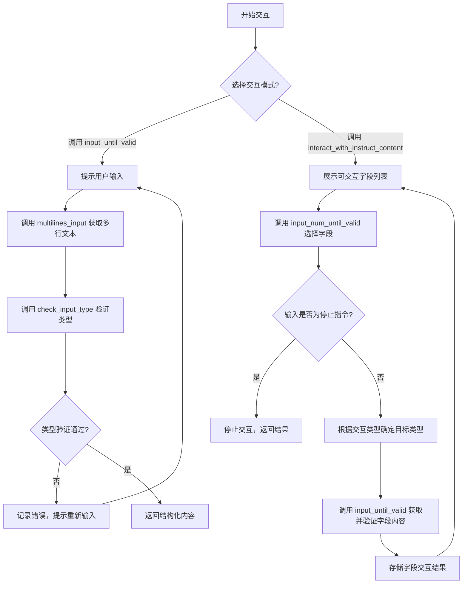
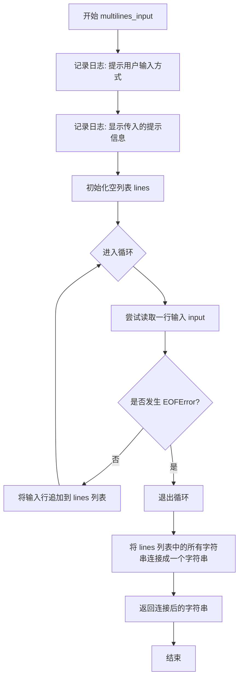
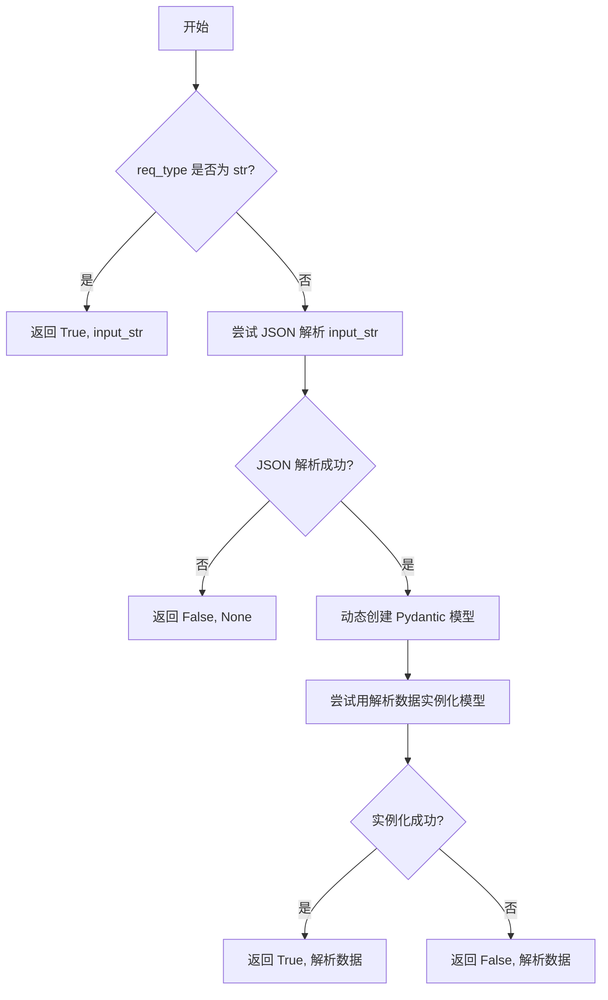
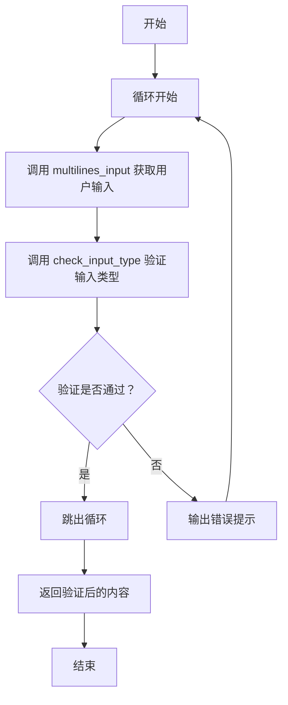
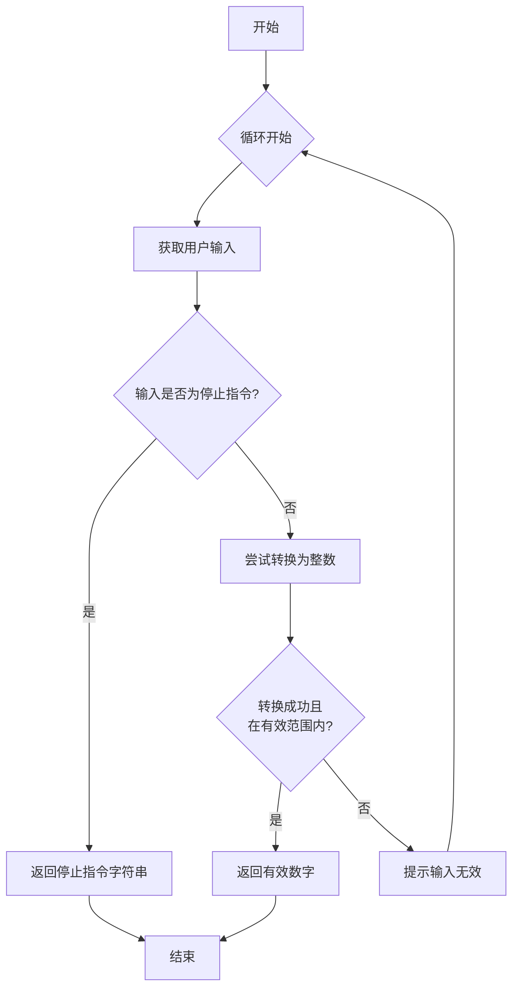
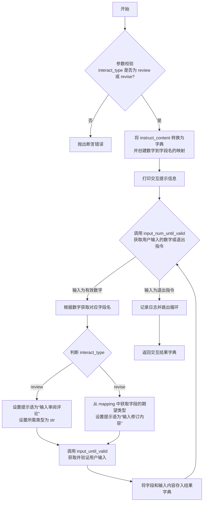

# `.\MetaGPT\metagpt\utils\human_interaction.py` 详细设计文档

该代码定义了一个`HumanInteraction`类，其核心功能是提供一个交互式命令行界面，引导用户输入文本内容，并根据指定的目标类型（如`str`或Pydantic模型字段类型）对输入进行验证，直到输入内容符合要求为止。它主要用于在需要结构化输入（例如，审查或修订基于Pydantic模型的指令内容）的场景中，实现人机交互。

## 整体流程



## 类结构

```
HumanInteraction
├── 类字段: stop_list
├── 类方法: multilines_input
├── 类方法: check_input_type
├── 类方法: input_until_valid
├── 类方法: input_num_until_valid
└── 类方法: interact_with_instruct_content
```

## 全局变量及字段


### `HumanInteraction.stop_list`
    
一个包含停止交互命令（如'q', 'quit', 'exit'）的元组，用于在用户输入这些命令时终止交互过程。

类型：`Tuple[str, ...]`
    
    

## 全局函数及方法


### `HumanInteraction.multilines_input`

该方法用于从标准输入（stdin）中读取多行文本，直到用户输入文件结束符（EOF，通常通过 Ctrl-D 或 Ctrl-Z 触发）。它主要用于在命令行环境中获取用户可能包含多行的输入内容。

参数：

-  `prompt`：`str`，在开始读取输入前显示的提示信息，默认为 "Enter: "。

返回值：`str`，返回用户输入的所有行连接成一个字符串的结果。

#### 流程图



#### 带注释源码

```python
def multilines_input(self, prompt: str = "Enter: ") -> str:
    # 记录警告日志，告知用户如何结束输入（使用 Ctrl-D 或 Ctrl-Z）
    logger.warning("Enter your content, use Ctrl-D or Ctrl-Z ( windows ) to save it.")
    # 记录信息日志，显示调用者传入的提示信息
    logger.info(f"{prompt}\n")
    # 初始化一个空列表，用于存储用户输入的每一行
    lines = []
    # 进入一个无限循环，持续读取用户输入
    while True:
        try:
            # 尝试从标准输入读取一行
            line = input()
            # 将读取到的行添加到列表中
            lines.append(line)
        except EOFError:
            # 当用户触发 EOF（文件结束符）时，捕获 EOFError 异常
            # 这通常是用户按下了 Ctrl-D (Unix/Linux/Mac) 或 Ctrl-Z (Windows)
            break
    # 循环结束后，将列表中所有的字符串连接成一个字符串并返回
    # 注意：这里使用空字符串 ''.join(lines) 进行连接，意味着行与行之间没有额外的分隔符（如换行符）。
    # 如果希望保留原始的行结构，可能需要使用 '\n'.join(lines)。
    return "".join(lines)
```


### `HumanInteraction.check_input_type`

该方法用于检查用户输入的字符串是否符合指定的类型要求。它首先尝试将输入字符串解析为JSON，然后使用动态创建的Pydantic模型来验证解析后的数据是否符合给定的类型约束。如果输入类型为`str`，则直接返回成功；否则，通过JSON解析和模型验证来判断类型匹配性。

参数：

- `input_str`：`str`，待检查的输入字符串
- `req_type`：`Type`，期望的数据类型（如`str`、`int`、`dict`等）

返回值：`Tuple[bool, Any]`，返回一个元组，第一个元素为布尔值表示检查是否通过，第二个元素为解析后的数据（如果检查通过）或`None`（如果检查失败）

#### 流程图



#### 带注释源码

```python
def check_input_type(self, input_str: str, req_type: Type) -> Tuple[bool, Any]:
    check_ret = True
    if req_type == str:
        # 如果期望类型是 str，直接返回成功和原始字符串
        return check_ret, input_str
    try:
        input_str = input_str.strip()
        data = json.loads(input_str)  # 尝试将输入字符串解析为 JSON
    except Exception:
        return False, None  # 解析失败，返回失败和 None

    # 动态导入 ActionNode 类，避免循环导入
    actionnode_class = import_class("ActionNode", "metagpt.actions.action_node")
    tmp_key = "tmp"
    # 创建一个临时的 Pydantic 模型类，该模型有一个字段，其类型为 req_type
    tmp_cls = actionnode_class.create_model_class(class_name=tmp_key.upper(), mapping={tmp_key: (req_type, ...)})
    try:
        _ = tmp_cls(**{tmp_key: data})  # 尝试用解析后的数据实例化模型
    except Exception:
        check_ret = False  # 实例化失败，表示类型不匹配
    return check_ret, data  # 返回检查结果和解析后的数据
```


### `HumanInteraction.input_until_valid`

该方法用于从用户获取输入，并持续验证输入内容是否符合指定的类型要求，直到用户输入有效内容为止。它通过调用 `multilines_input` 方法获取多行输入，然后使用 `check_input_type` 方法验证输入是否符合 `req_type` 指定的类型。如果输入无效，会提示用户重新输入，直到输入有效为止。

参数：

-  `prompt`：`str`，提示用户输入的文本信息。
-  `req_type`：`Type`，期望输入内容符合的数据类型（例如 `str`, `int`, `dict` 等）。

返回值：`Any`，验证成功后，返回符合 `req_type` 类型要求的输入内容。

#### 流程图



#### 带注释源码

```
def input_until_valid(self, prompt: str, req_type: Type) -> Any:
    # check the input with req_type until it's ok
    while True:
        # 1. 获取用户输入
        input_content = self.multilines_input(prompt)
        # 2. 验证输入类型
        check_ret, structure_content = self.check_input_type(input_content, req_type)
        # 3. 如果验证通过，跳出循环
        if check_ret:
            break
        else:
            # 4. 如果验证失败，提示用户重新输入
            logger.error(f"Input content can't meet required_type: {req_type}, please Re-Enter.")
    # 5. 返回验证通过的内容
    return structure_content
```


### `HumanInteraction.input_num_until_valid`

该方法用于从用户输入中获取一个有效的数字索引，直到用户输入符合要求（在指定范围内）或输入停止指令为止。它主要用于交互式选择操作中的字段索引输入。

参数：

-  `num_max`：`int`，允许输入的最大数字（不包含），即有效数字范围为 [0, num_max-1]

返回值：`int` 或 `str`，返回用户输入的有效数字索引（整数），如果用户输入了停止指令（如 "q", "quit", "exit"），则返回该停止指令字符串

#### 流程图



#### 带注释源码

```python
def input_num_until_valid(self, num_max: int) -> int:
    # 持续循环直到获取到有效输入
    while True:
        # 提示用户输入数字，并获取输入内容
        input_num = input("Enter the num of the interaction key: ")
        # 去除输入内容两端的空白字符
        input_num = input_num.strip()
        
        # 检查输入是否为停止指令（"q", "quit", "exit"）
        if input_num in self.stop_list:
            # 如果是停止指令，直接返回该字符串
            return input_num
        
        try:
            # 尝试将输入转换为整数
            input_num = int(input_num)
            # 检查转换后的整数是否在有效范围内 [0, num_max-1]
            if 0 <= input_num < num_max:
                # 如果在有效范围内，返回该数字
                return input_num
        except Exception:
            # 如果转换失败（输入不是数字），忽略异常，继续循环
            pass
        
        # 如果输入无效（不是停止指令、不是数字或不在有效范围内），
        # 循环继续，等待用户重新输入
```


### `HumanInteraction.interact_with_instruct_content`

该方法允许用户与一个给定的结构化指令内容（`instruct_content`）进行交互，支持“审阅”和“修订”两种模式。用户可以通过输入数字选择要交互的字段，然后根据模式输入相应的内容（审阅评论或修订值）。交互过程持续进行，直到用户输入退出指令（如“q”）。最终，该方法返回一个字典，包含用户交互过的字段及其对应的输入内容。

参数：

- `instruct_content`：`BaseModel`，一个Pydantic模型实例，包含了需要交互的结构化数据。
- `mapping`：`dict`，一个可选的字典，用于在“修订”模式下指定字段到其期望类型的映射。默认为空字典。
- `interact_type`：`str`，交互类型，必须是“review”（审阅）或“revise”（修订）之一。默认为“review”。

返回值：`dict[str, Any]`，一个字典，键为交互过的字段名，值为用户输入的内容（在“审阅”模式下为字符串，在“修订”模式下为符合字段类型的值）。

#### 流程图



#### 带注释源码

```python
def interact_with_instruct_content(
    self, instruct_content: BaseModel, mapping: dict = dict(), interact_type: str = "review"
) -> dict[str, Any]:
    # 1. 参数校验：确保交互类型是预定义的两种之一，并且指令内容不为空。
    assert interact_type in ["review", "revise"]
    assert instruct_content

    # 2. 数据准备：将Pydantic模型实例转换为字典，并创建一个从序号到字段名的映射，用于用户选择。
    instruct_content_dict = instruct_content.model_dump()
    num_fields_map = dict(zip(range(0, len(instruct_content_dict)), instruct_content_dict.keys()))

    # 3. 打印交互引导信息，告知用户如何操作。
    logger.info(
        f"\n{interact_type.upper()} interaction\n"
        f"Interaction data: {num_fields_map}\n"
        f"Enter the num to interact with corresponding field or `q`/`quit`/`exit` to stop interaction.\n"
        f"Enter the field content until it meet field required type.\n"
    )

    # 4. 初始化一个空字典，用于存储用户交互的结果。
    interact_contents = {}

    # 5. 进入主交互循环。
    while True:
        # 5.1 提示用户输入一个数字来选择字段，或输入退出指令。
        input_num = self.input_num_until_valid(len(instruct_content_dict))

        # 5.2 如果用户输入了退出指令，则记录日志并跳出循环。
        if input_num in self.stop_list:
            logger.warning("Stop human interaction")
            break

        # 5.3 根据用户输入的数字，获取对应的字段名。
        field = num_fields_map.get(input_num)
        logger.info(f"You choose to interact with field: {field}, and do a `{interact_type}` operation.")

        # 5.4 根据交互类型（review/revise）设置不同的提示语和期望的数据类型。
        if interact_type == "review":
            # 审阅模式：用户输入任意文本评论，类型为字符串。
            prompt = "Enter your review comment: "
            req_type = str
        else:
            # 修订模式：用户输入的内容必须符合该字段在`mapping`中定义的期望类型。
            prompt = "Enter your revise content: "
            req_type = mapping.get(field)[0]  # 从mapping中获取该字段的期望类型

        # 5.5 调用`input_until_valid`方法，循环提示用户输入，直到输入内容符合`req_type`要求。
        field_content = self.input_until_valid(prompt=prompt, req_type=req_type)

        # 5.6 将用户输入的有效内容存储到结果字典中。
        interact_contents[field] = field_content

    # 6. 返回包含所有交互结果的字典。
    return interact_contents
```

## 关键组件


### 输入验证与类型检查

通过 `check_input_type` 方法，结合 `json.loads` 和动态创建的 Pydantic 模型，对用户输入的字符串进行解析和类型验证，确保其符合指定的 `req_type` 要求。

### 交互式字段选择与操作

通过 `interact_with_instruct_content` 方法，将 `instruct_content` 的字段映射为数字选项，允许用户通过输入数字选择特定字段进行“审阅”或“修订”操作，实现了结构化的命令行交互流程。

### 多行文本输入处理

通过 `multilines_input` 方法，支持用户输入多行文本，并通过捕获 `EOFError`（通常是 Ctrl-D 或 Ctrl-Z 信号）来结束输入，适用于需要输入较长或结构化内容的场景。

### 动态模型类创建

在 `check_input_type` 方法中，通过 `ActionNode.create_model_class` 动态创建一个临时的 Pydantic 模型类，用于验证用户输入的数据结构是否符合目标类型 `req_type`，实现了灵活的类型校验。

### 循环输入直到有效

通过 `input_until_valid` 和 `input_num_until_valid` 方法，在用户输入不符合要求（如类型错误或数字越界）时，持续提示用户重新输入，直到获得有效输入为止，确保了交互的鲁棒性。


## 问题及建议


### 已知问题

-   **循环导入风险**：`check_input_type` 方法中通过字符串动态导入 `ActionNode` 类，虽然注释说明了是为了避免循环导入，但这是一种脆弱的解决方案。如果 `ActionNode` 的模块路径发生变化，或者 `import_class` 函数出现问题，代码将无法正常工作。
-   **异常处理过于宽泛**：`check_input_type` 方法在 `json.loads` 和 `tmp_cls` 实例化时使用了通用的 `Exception` 捕获。这会掩盖潜在的具体错误（如 `json.JSONDecodeError` 或 `pydantic.ValidationError`），使得调试和错误定位变得困难。
-   **输入验证逻辑耦合度高**：`check_input_type` 方法将 JSON 解析和 Pydantic 模型验证逻辑紧密耦合在一起。对于非 JSON 格式但符合 `req_type`（例如直接输入一个整数）的字符串，会被错误地拒绝。
-   **`input_num_until_valid` 方法返回值类型不一致**：该方法可能返回整数（`int`）或字符串（`str`，当输入为停止词时）。这种动态返回类型会降低代码的可读性和类型安全性，调用方必须进行额外的类型检查。
-   **硬编码的停止词列表**：停止词列表 `stop_list` 是硬编码在类中的常量。如果未来需要支持多语言或动态配置停止词，将需要修改代码。
-   **`interact_with_instruct_content` 方法参数默认值可变**：参数 `mapping: dict = dict()` 使用了可变对象作为默认值。这在 Python 中是一个常见陷阱，如果调用方修改了这个默认的 `dict`，可能会影响后续的调用。

### 优化建议

-   **重构导入方式以消除循环依赖**：重新设计模块间的依赖关系，或者使用依赖注入（如将 `ActionNode` 类作为参数传入），从根本上解决循环导入问题，而不是依赖运行时字符串导入。
-   **细化异常处理**：将 `check_input_type` 方法中的通用 `Exception` 捕获替换为更具体的异常类型（如 `json.JSONDecodeError`, `pydantic.ValidationError`）。可以记录或重新抛出更详细的错误信息，便于调试。
-   **分离输入验证逻辑**：将 `check_input_type` 方法拆分为两个步骤：1) 尝试将输入解析为目标类型（对于 `str` 以外的类型，先尝试 `json.loads`，失败后尝试直接类型转换）；2) 使用 Pydantic 进行结构化验证。这样能更清晰地处理不同格式的输入。
-   **统一 `input_num_until_valid` 方法的返回值**：考虑修改逻辑，使其始终返回整数，而将停止操作通过抛出特定异常或返回一个特殊值（如 `-1`）来表示，以保持返回类型的纯净和一致。
-   **将停止词列表配置化**：将 `stop_list` 提升为类属性或实例属性，并允许通过构造函数或配置文件进行初始化，提高灵活性。
-   **修正可变默认参数**：将 `interact_with_instruct_content` 方法中的 `mapping: dict = dict()` 修改为 `mapping: dict = None`，并在方法体内使用 `mapping = mapping or {}` 进行初始化，避免可变默认参数的风险。
-   **增强类型注解**：为方法（如 `interact_with_instruct_content`）的返回值添加更精确的类型注解（例如 `-> Dict[str, Any]`），并考虑使用 `TypedDict` 来定义 `interact_contents` 的结构，以提升代码的清晰度和 IDE 支持。
-   **改进用户提示和交互体验**：在 `multilines_input` 和 `input_until_valid` 等方法中，可以提供更明确的操作指引。例如，在 `input_until_valid` 中，当输入不符合要求时，可以提示用户期望的格式或示例。


## 其它


### 设计目标与约束

本模块的核心设计目标是提供一个灵活、健壮的人机交互接口，用于在程序运行过程中引导用户输入符合特定类型要求的数据。主要约束包括：1) 必须支持多种数据类型（特别是通过Pydantic模型定义的复杂类型）的输入验证；2) 交互过程需对用户友好，提供清晰的提示和错误反馈；3) 需要处理用户中断操作（如输入退出指令）；4) 避免因导入`ActionNode`类而产生循环依赖。

### 错误处理与异常设计

模块的错误处理主要围绕用户输入验证展开。`check_input_type`方法通过`try-except`块捕获JSON解析失败和Pydantic模型验证失败，并返回布尔值标识验证结果，而非抛出异常，将错误控制流转化为返回值判断。`input_num_until_valid`方法通过捕获`int`转换异常来处理非数字输入。`multilines_input`方法通过捕获`EOFError`来优雅地处理多行输入的结束。整体设计将异常作为内部处理机制，对外提供稳定的交互流程，并通过日志记录错误信息（如`logger.error`）向用户反馈。

### 数据流与状态机

模块的数据流始于用户通过控制台输入文本。核心状态转换如下：1) 在`input_until_valid`中，系统进入“等待有效输入”循环状态，直到`check_input_type`验证通过才跳出循环，进入“返回有效数据”状态。2) 在`interact_with_instruct_content`中，系统首先展示可交互字段列表，然后进入“选择字段”循环状态。用户选择一个字段编号后，系统根据`interact_type`进入“等待`review`文本输入”或“等待`revise`类型校验输入”子状态。子状态内部同样遵循`input_until_valid`的循环验证逻辑。用户输入退出指令（如‘q‘）是退出所有循环状态并结束交互的唯一外部事件。

### 外部依赖与接口契约

1.  **外部依赖**：
    *   `json`: 用于解析用户输入的JSON字符串。
    *   `pydantic.BaseModel`: 作为`instruct_content`参数的类型约束和`model_dump`方法的提供者。
    *   `metagpt.logs.logger`: 用于记录信息、警告和错误日志。
    *   `metagpt.utils.common.import_class`: 用于动态导入`ActionNode`类以避免循环依赖。
    *   `metagpt.actions.action_node.ActionNode`: 被动态导入，用于创建临时的Pydantic模型以验证复杂数据类型。

2.  **接口契约**：
    *   `multilines_input(prompt: str) -> str`: 契约要求调用方提供一个提示字符串，方法保证返回用户输入的所有行拼接后的字符串。
    *   `check_input_type(input_str: str, req_type: Type) -> Tuple[bool, Any]`: 契约要求`req_type`是一个有效的类型。方法返回一个元组，第一个元素表示输入是否匹配类型，第二个元素是解析后的数据（如果成功）或`None`（如果失败且`req_type`不是`str`）。
    *   `input_until_valid(prompt: str, req_type: Type) -> Any`: 契约要求`req_type`是一个有效的类型。方法保证返回一个符合`req_type`类型要求的数据，该过程会循环直到用户输入有效。
    *   `input_num_until_valid(num_max: int) -> int`: 契约要求`num_max`为整数。方法保证返回一个在`[0, num_max)`范围内的整数，或者是`stop_list`中的退出指令字符串。
    *   `interact_with_instruct_content(instruct_content: BaseModel, mapping: dict, interact_type: str) -> dict[str, Any]`: 契约要求`instruct_content`非空，`interact_type`为`"review"`或`"revise"`。当`interact_type`为`"revise"`时，`mapping`字典必须包含与`instruct_content`字段对应的类型信息。方法返回一个字典，键为交互过的字段名，值为用户输入的内容。

    