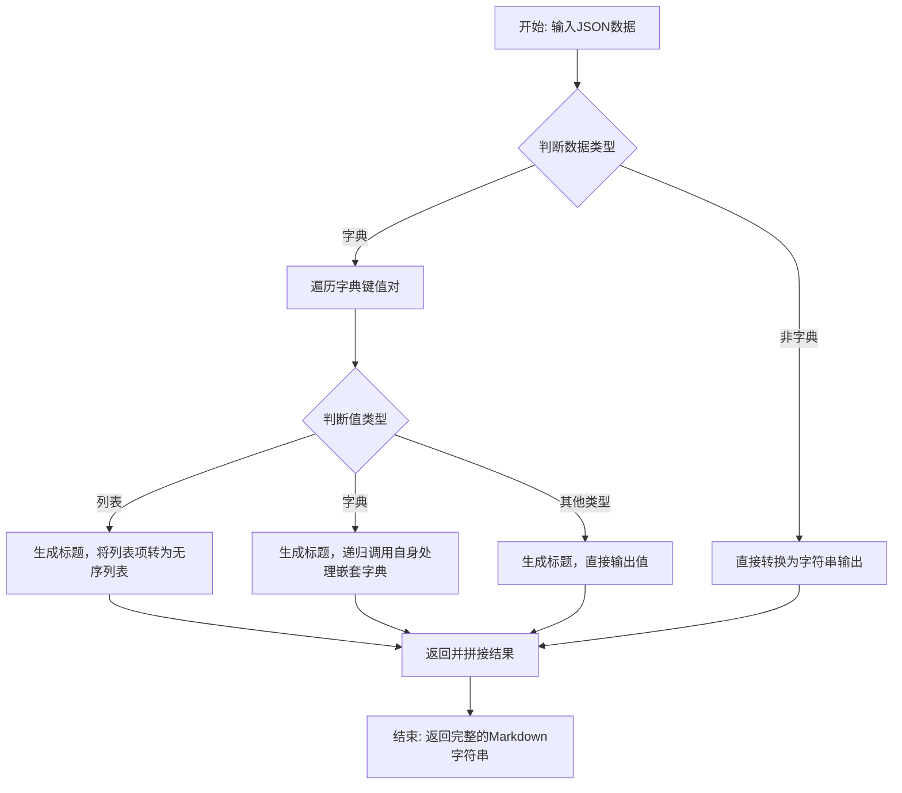

# `.\MetaGPT\metagpt\utils\json_to_markdown.py` 详细设计文档

该代码提供了一个将JSON数据结构递归转换为Markdown格式文本的函数。核心功能是遍历JSON对象（字典），将字典的键转换为指定层级的Markdown标题（#），将数组（列表）转换为无序列表项（-），并将其他类型的值直接作为文本内容输出，从而生成结构化的Markdown文档。

## 整体流程



## 类结构

```
该文件不包含类定义，仅包含一个全局函数。
```

## 全局变量及字段


### `data`
    
输入的JSON数据，可以是字典、列表或其他基本类型。

类型：`Any`
    


### `depth`
    
当前Markdown标题的层级深度，用于控制标题的'#'数量。

类型：`int`
    


### `markdown`
    
用于累积并最终返回的Markdown格式字符串。

类型：`str`
    


### `key`
    
在遍历字典时，当前处理的键名。

类型：`str`
    


### `value`
    
在遍历字典时，与当前键名对应的值。

类型：`Any`
    


### `items`
    
当值为列表时，用于临时存储列表中所有元素转换后的字符串形式。

类型：`List[str]`
    


### `item`
    
在遍历列表时，当前处理的列表项。

类型：`Any`
    


    

## 全局函数及方法

### `json_to_markdown`

该函数将一个JSON对象（Python字典）递归地转换为Markdown格式的字符串。它使用不同层级的标题（`#`）来表示字典的键，用列表项（`-`）来表示数组元素，从而清晰地展示JSON数据的层级结构。

参数：
- `data`：`Any`，需要转换的JSON数据，通常是字典或列表，也可以是其他基本类型。
- `depth`：`int`，当前标题的深度级别，默认为2（即`##`）。该参数在递归处理嵌套对象时递增。

返回值：`str`，返回转换后的Markdown格式字符串。

#### 流程图

```mermaid
flowchart TD
    A[开始: json_to_markdown(data, depth)] --> B{data 是 dict 吗?}
    B -- 是 --> C[遍历 data 的每个键值对 key, value]
    C --> D{value 是 list 吗?}
    D -- 是 --> E[添加 depth 级标题 key<br>将列表项转换为以“- ”开头的行]
    D -- 否 --> F{value 是 dict 吗?}
    F -- 是 --> G[添加 depth 级标题 key<br>递归调用 json_to_markdown(value, depth+1)]
    F -- 否 --> H[添加 depth 级标题 key<br>添加值 value]
    E --> I[循环结束?]
    G --> I
    H --> I
    I -- 否 --> C
    I -- 是 --> J[返回构建的 markdown 字符串]
    B -- 否 --> K[直接将 data 转换为字符串并返回]
```

#### 带注释源码

```python
def json_to_markdown(data, depth=2):
    """
    Convert a JSON object to Markdown with headings for keys and lists for arrays, supporting nested objects.

    Args:
        data: JSON object (dictionary) or value.
        depth (int): Current depth level for Markdown headings.

    Returns:
        str: Markdown representation of the JSON data.
    """
    markdown = ""  # 初始化用于累积Markdown内容的字符串

    if isinstance(data, dict):  # 检查输入数据是否为字典（JSON对象）
        for key, value in data.items():  # 遍历字典的每一个键值对
            if isinstance(value, list):  # 如果值是列表（JSON数组）
                # 根据当前深度添加对应数量的'#'作为标题，后跟键名
                markdown += "#" * depth + f" {key}\n\n"
                # 将列表中的每个元素转换为字符串
                items = [str(item) for item in value]
                # 用“- ”连接所有列表项，形成Markdown无序列表，并添加换行
                markdown += "- " + "\n- ".join(items) + "\n\n"
            elif isinstance(value, dict):  # 如果值是另一个字典（嵌套JSON对象）
                # 添加当前键作为标题
                markdown += "#" * depth + f" {key}\n\n"
                # 递归调用自身处理嵌套字典，深度加1
                markdown += json_to_markdown(value, depth + 1)
            else:  # 如果值是其他类型（字符串、数字、布尔值等）
                # 添加当前键作为标题，并在下一行显示其值
                markdown += "#" * depth + f" {key}\n\n{value}\n\n"
    else:  # 如果输入数据不是字典（例如是单个值或列表）
        # 直接将数据转换为字符串
        markdown = str(data)

    return markdown  # 返回构建好的Markdown字符串
```

## 关键组件


### JSON 到 Markdown 的递归转换器

该组件是一个递归函数，负责将嵌套的 JSON 对象（字典）和数组（列表）结构转换为具有层级标题和列表的 Markdown 格式字符串。

### 基于类型的条件分支处理器

该组件通过 `isinstance` 检查对输入数据的类型（字典、列表、其他类型）进行判断，并执行不同的处理逻辑，以生成相应的 Markdown 内容。

### 动态标题层级生成器

该组件根据当前递归深度动态生成对应层级的 Markdown 标题（`#` 的数量），以反映 JSON 数据的嵌套结构，确保输出的 Markdown 具有良好的可读性和层级关系。


## 问题及建议


### 已知问题

-   **递归深度限制**：函数使用递归处理嵌套字典。对于深度嵌套的JSON结构，可能超出Python的默认递归限制，导致`RecursionError`。
-   **列表项格式化简单**：处理列表时，直接将每个元素转换为字符串（`str(item)`）。如果列表项是复杂对象（如字典），输出将是不易读的Python默认字符串表示（如`{‘key’: ‘value’}`），而非格式化的Markdown。
-   **键名格式未转义**：如果JSON对象的键名包含Markdown的特殊字符（如`#`、`*`、`_`等），生成的标题可能破坏Markdown的语法结构。
-   **非字典根节点处理不充分**：当传入的`data`参数不是字典（如列表、字符串、数字）时，函数直接返回其字符串形式。这可能不符合用户对“将JSON转换为Markdown”的期望，输出格式不一致。
-   **缺少输入验证**：函数假设输入是有效的JSON数据结构（字典、列表、基本类型）。如果传入不支持的类型（如自定义类实例），`str(item)`或`isinstance`检查可能导致意外行为或错误。

### 优化建议

-   **使用迭代替代递归**：重构函数，使用栈（stack）或队列（queue）等迭代方法来处理嵌套结构，消除递归深度限制，并可能提升大数据的处理性能。
-   **增强列表处理逻辑**：检测列表内的元素类型。如果是字典或列表，应递归/迭代调用转换函数，以生成嵌套的、格式化的Markdown内容，而不是简单的`str()`表示。
-   **转义Markdown特殊字符**：在将键名和字符串值插入Markdown内容前，使用库函数或自定义逻辑对Markdown的特殊字符进行转义（例如，将`#`转换为`\#`），确保生成的文档语法正确。
-   **统一根节点处理策略**：定义清晰的根节点处理规则。例如，无论根节点是字典、列表还是其他类型，都将其包裹在一个统一的顶级标题下（如`# Document Root`），确保输出结构的一致性。
-   **增加输入类型检查与错误处理**：在函数开始处验证输入数据类型。对于不支持的类型，可以抛出明确的异常（如`TypeError`）或返回错误信息，提高代码的健壮性。
-   **添加配置选项**：考虑引入参数（如`max_depth`, `escape_chars`, `list_bullet`等），允许用户自定义转换行为，如设置最大标题深度、选择列表符号等，增加灵活性。
-   **性能优化与大数据支持**：对于非常大的JSON数据，当前字符串拼接（`+=`）可能效率较低。可以考虑使用`StringIO`或`list.join()`来构建最终的Markdown字符串。同时，提供流式输出接口的选项。
-   **完善文档与示例**：在函数文档字符串中添加更详细的说明，特别是关于嵌套处理、特殊字符和边界情况的描述，并提供不同类型输入的转换示例。


## 其它


### 设计目标与约束

该代码的设计目标是将JSON数据结构转换为Markdown格式的文本，以便于生成结构化的文档。主要约束包括：
- 支持嵌套的JSON对象和数组。
- 使用Markdown标题（`#`）表示JSON对象的键，并根据嵌套深度调整标题级别。
- 将JSON数组转换为Markdown无序列表（`-`）。
- 保持代码简洁，易于理解和维护。

### 错误处理与异常设计

当前代码未显式处理错误或异常情况。潜在问题包括：
- 输入数据可能不是有效的JSON对象或字典，导致`isinstance(data, dict)`判断失败，但函数仍会尝试处理非字典数据（如字符串、数字等），可能产生非预期的输出。
- 未处理递归深度过深的情况，可能导致递归栈溢出。
- 未对输入数据的类型进行严格验证，可能引发运行时错误。

建议改进：
- 添加输入验证，确保数据为字典或可转换类型。
- 设置递归深度限制，防止栈溢出。
- 使用异常处理捕获潜在错误，并提供友好的错误信息。

### 数据流与状态机

数据流：
1. 输入：JSON数据（字典、列表、基本类型）。
2. 处理：递归遍历JSON结构，根据类型生成Markdown文本。
   - 字典：为每个键生成Markdown标题，递归处理值。
   - 列表：将列表项转换为Markdown无序列表项。
   - 其他类型：直接转换为字符串。
3. 输出：Markdown格式的字符串。

状态机：
- 初始状态：处理根JSON对象。
- 递归状态：处理嵌套字典或列表，深度递增。
- 终止状态：所有嵌套结构处理完毕，返回最终Markdown字符串。

### 外部依赖与接口契约

外部依赖：
- 无外部库依赖，仅使用Python标准库。

接口契约：
- 函数：`json_to_markdown(data, depth=2)`
  - 输入：
    - `data`：任意JSON兼容的数据类型（字典、列表、字符串、数字等）。
    - `depth`：整数，表示当前Markdown标题的深度级别，默认为2。
  - 输出：字符串，表示转换后的Markdown文本。
  - 行为：递归转换JSON数据为Markdown，使用标题表示键，列表表示数组。

### 性能考虑

- 递归实现可能导致栈溢出，对于深度嵌套的JSON结构需谨慎使用。
- 字符串拼接在递归中可能产生多次内存分配，影响性能。对于大型JSON数据，建议使用`StringIO`或列表拼接优化。
- 无并行或异步处理，适用于中小型数据转换。

### 测试策略

- 单元测试：覆盖各种JSON结构（嵌套字典、数组、混合类型、边界值）。
- 集成测试：验证Markdown输出是否符合预期格式。
- 性能测试：针对大型JSON数据测试递归深度和内存使用。
- 错误测试：输入无效数据，验证错误处理行为。

### 扩展性

- 当前实现固定使用Markdown标题和列表，未来可扩展支持其他Markdown元素（如表格、代码块等）。
- 可通过配置参数自定义标题级别、列表样式等。
- 可扩展为支持其他文档格式（如HTML、PDF）的转换器。

### 维护性

- 代码结构简单，易于理解和修改。
- 缺乏注释和文档字符串，建议补充详细注释说明递归逻辑和边界条件。
- 函数职责单一，符合单一职责原则，便于测试和维护。

### 安全性

- 无外部数据输入风险，但需确保输入数据不包含恶意内容（如脚本注入），尽管Markdown渲染器可能处理此类风险。
- 递归深度未限制，可能被恶意构造的深层JSON数据攻击，导致栈溢出。

### 部署与配置

- 作为独立脚本或模块使用，无需特殊部署步骤。
- 可通过环境变量或配置文件调整默认参数（如初始深度）。
- 建议作为工具函数集成到更大的文档生成系统中。


    