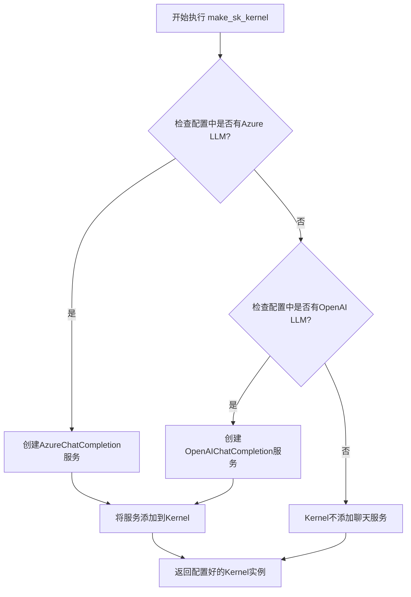
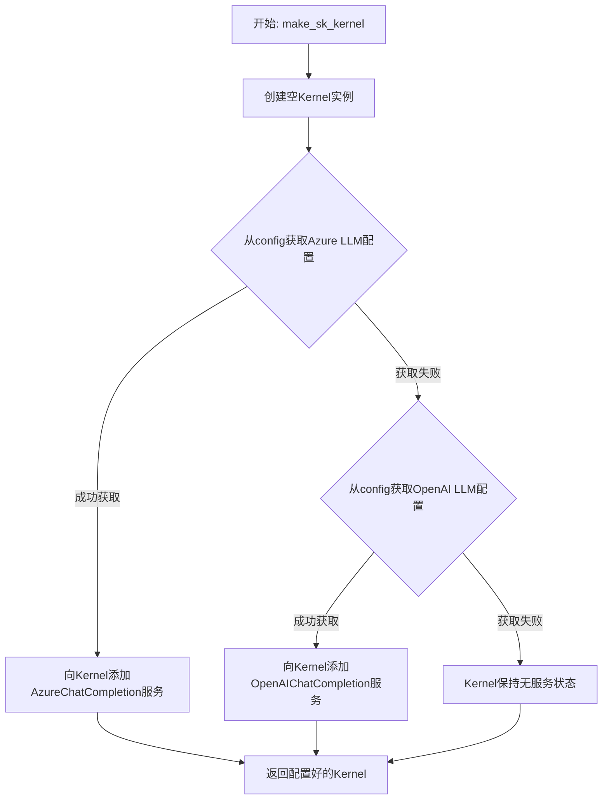
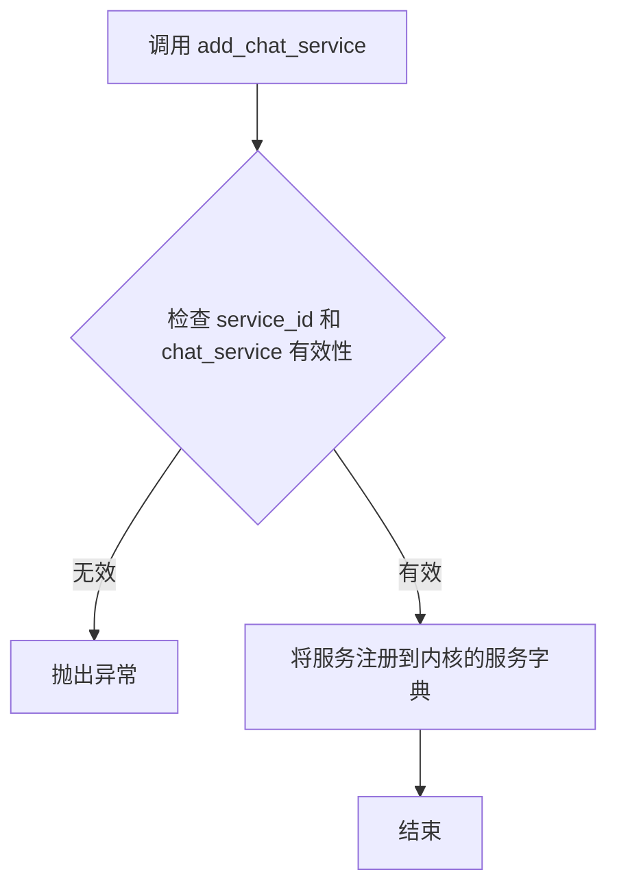

# `.\MetaGPT\metagpt\utils\make_sk_kernel.py` 详细设计文档

该代码文件的核心功能是根据配置动态创建一个语义内核（Semantic Kernel）实例，并根据配置的LLM（大语言模型）提供商（Azure OpenAI 或 OpenAI）为其添加相应的聊天服务。

## 整体流程



## 类结构

```
make_sk_kernel.py
├── 全局函数: make_sk_kernel
├── 导入模块: semantic_kernel
│   └── 类: Kernel
├── 导入模块: AzureChatCompletion (来自 semantic_kernel.connectors.ai.open_ai.services.azure_chat_completion)
├── 导入模块: OpenAIChatCompletion (来自 semantic_kernel.connectors.ai.open_ai.services.open_ai_chat_completion)
└── 导入模块: config (来自 metagpt.config2)
```

## 全局变量及字段


### `config`
    
全局配置对象，用于获取LLM（大语言模型）的配置信息，如模型、API密钥和端点URL。

类型：`metagpt.config2.config`
    


    

## 全局函数及方法


### `make_sk_kernel`

该函数用于创建一个语义内核（Semantic Kernel）实例，并根据配置动态选择并添加 Azure OpenAI 或 OpenAI 的聊天完成服务作为其核心 AI 后端。

参数：
- 无显式参数。该函数通过导入的全局 `config` 对象获取配置信息。

返回值：`semantic_kernel.Kernel`，一个配置了相应 AI 服务的语义内核实例。

#### 流程图



#### 带注释源码

```python
def make_sk_kernel():
    # 1. 创建一个新的、空的 Semantic Kernel 核心实例
    kernel = sk.Kernel()

    # 2. 尝试从全局配置中获取 Azure OpenAI 的配置信息
    #    使用 `:=` 海象运算符，在条件判断的同时将结果赋值给变量 `llm`
    if llm := config.get_azure_llm():
        # 2.1 如果成功获取到 Azure LLM 配置，则添加 Azure OpenAI 服务
        kernel.add_chat_service(
            "chat_completion",  # 为该服务指定一个内部名称
            AzureChatCompletion(llm.model, llm.base_url, llm.api_key),  # 使用配置创建服务实例
        )
    # 3. 如果上一步未获取到 Azure 配置，则尝试获取 OpenAI 的配置
    elif llm := config.get_openai_llm():
        # 3.1 如果成功获取到 OpenAI LLM 配置，则添加 OpenAI 服务
        kernel.add_chat_service(
            "chat_completion",  # 为该服务指定一个内部名称
            OpenAIChatCompletion(llm.model, llm.api_key),  # 使用配置创建服务实例
        )
    # 注意：如果两种配置都未获取到，kernel 将不包含任何聊天服务。

    # 4. 返回配置好的（或未配置服务的）Kernel 实例
    return kernel
```


### `Kernel.add_chat_service`

该方法用于向语义内核（Semantic Kernel）实例注册一个聊天服务。它允许内核在后续的语义函数调用中使用指定的AI服务（如Azure OpenAI或OpenAI）来完成对话任务。

参数：

- `service_id`：`str`，服务的标识符，用于在后续调用中引用此服务。
- `chat_service`：`Union[AzureChatCompletion, OpenAIChatCompletion]`，聊天服务实例，封装了与特定AI服务（如Azure OpenAI或OpenAI）交互的逻辑。

返回值：`None`，此方法不返回任何值，其作用是将服务注册到内核的内部服务集合中。

#### 流程图



#### 带注释源码

```python
def add_chat_service(
    self,
    service_id: str,
    chat_service: Union[AzureChatCompletion, OpenAIChatCompletion],
) -> None:
    """
    向内核添加一个聊天服务。

    参数:
        service_id (str): 服务的唯一标识符。
        chat_service (Union[AzureChatCompletion, OpenAIChatCompletion]): 聊天服务实例。

    返回:
        None
    """
    # 参数有效性检查（逻辑上应有，具体实现在SK库中）
    if not service_id or not chat_service:
        raise ValueError("service_id and chat_service must be provided.")
    
    # 将服务注册到内核的内部服务字典中，键为service_id，值为chat_service实例
    # 这使得内核在执行语义函数时，可以根据指定的service_id找到并使用对应的AI服务
    self._services[service_id] = chat_service
```

## 关键组件


### Semantic Kernel 核心

一个用于构建和管理AI服务的核心框架，允许集成不同的AI模型（如Azure OpenAI和OpenAI）作为聊天服务。

### AzureChatCompletion

Azure OpenAI服务的聊天完成实现，用于与部署在Azure上的OpenAI模型进行交互。

### OpenAIChatCompletion

OpenAI服务的聊天完成实现，用于与原生OpenAI API进行交互。

### 配置管理 (config)

一个配置管理组件，用于获取和提供不同环境（如Azure或OpenAI）下的LLM配置信息。

### 内核服务注册

一个流程组件，负责根据配置动态选择并注册相应的AI聊天服务到Semantic Kernel内核中。


## 问题及建议


### 已知问题

-   **硬编码的服务名称**：代码中在添加聊天服务时，使用了硬编码的字符串 `"chat_completion"` 作为服务名称。这降低了代码的灵活性，如果未来需要支持多个不同的聊天服务实例或更改服务名称，需要修改多处代码。
-   **缺乏显式的错误处理**：函数 `make_sk_kernel` 没有对 `config.get_azure_llm()` 和 `config.get_openai_llm()` 返回的对象进行有效性检查（例如，检查 `llm.api_key` 或 `llm.base_url` 是否为空）。如果配置不完整，后续创建 `AzureChatCompletion` 或 `OpenAIChatCompletion` 对象时可能会抛出难以追踪的异常。
-   **潜在的配置歧义**：代码逻辑是优先尝试获取 Azure LLM 配置，如果失败再尝试 OpenAI LLM 配置。如果系统同时配置了两种 LLM（例如，在测试或过渡阶段），此逻辑会隐式地选择 Azure，这可能不符合所有使用场景的预期，缺乏明确的配置优先级或选择策略。
-   **缺少日志记录**：函数执行过程中没有记录任何日志信息，例如成功创建了哪种类型的服务，或者因为配置缺失而未能创建任何服务。这在调试和运维中会带来不便。

### 优化建议

-   **将服务名称参数化**：建议将服务名称（如 `"chat_completion"`）作为函数 `make_sk_kernel` 的一个可选参数，并提供合理的默认值。这提高了代码的可配置性和复用性。
-   **增加配置验证和错误处理**：在创建 `AzureChatCompletion` 或 `OpenAIChatCompletion` 对象之前，应验证 `llm` 对象及其关键属性（如 `model`, `api_key`, 对于 Azure 还有 `base_url`）的有效性。可以使用 `assert` 语句或抛出更清晰的 `ValueError` 异常，并添加友好的错误信息。
-   **明确配置选择逻辑或支持多服务**：考虑修改配置读取逻辑，使其能够明确指定当前要使用的 LLM 类型（例如，通过一个环境变量或配置项）。或者，改进函数以支持同时添加多个聊天服务到 Kernel 中，并通过别名进行区分，以适应更复杂的场景。
-   **添加日志记录**：在关键步骤（如开始创建、成功创建 Azure/OpenAI 服务、配置缺失等）添加日志记录，便于监控和故障排查。
-   **考虑扩展性**：当前函数直接依赖于特定的 `config` 模块和两种具体的 LLM 实现。可以考虑定义一个更抽象的接口来获取 LLM 配置，并使用依赖注入或工厂模式来创建聊天服务，这样更容易支持新的 LLM 提供商。


## 其它


### 设计目标与约束

本模块的设计目标是提供一个工厂函数，用于根据配置动态创建并配置 Semantic Kernel 的核心对象（`sk.Kernel`）。其主要约束包括：
1.  **依赖注入**：函数不直接管理配置和凭据，而是依赖于外部的 `metagpt.config2.config` 对象来获取 LLM 服务配置。
2.  **服务适配**：需要适配两种不同的 LLM 服务提供商（Azure OpenAI 和 OpenAI），并根据配置选择其一进行初始化。
3.  **轻量简洁**：函数本身应保持简单，职责单一，仅负责 Kernel 的创建和基础服务的绑定，不包含复杂的业务逻辑或错误恢复机制。
4.  **可扩展性**：当前设计通过 `if-elif` 链选择服务，未来若需支持更多服务提供商，此部分逻辑需要扩展。

### 错误处理与异常设计

当前代码的错误处理策略较为简单：
1.  **隐式错误传播**：函数本身没有 `try-except` 块。在调用 `config.get_azure_llm()`、`config.get_openai_llm()` 或 `kernel.add_chat_service` 时，如果发生异常（如配置缺失、网络问题、API密钥无效等），异常将直接抛出给调用者。
2.  **配置缺失处理**：函数逻辑隐含了配置的优先级（先尝试 Azure，后尝试 OpenAI）。如果两者均未配置，函数将返回一个未添加任何聊天服务的 `Kernel` 对象。这可能导致后续使用该 Kernel 时发生错误，调用者需负责检查。
3.  **建议的强化措施**：可以添加更明确的配置验证，在无有效配置时抛出更具描述性的自定义异常（如 `ConfigurationError`），或者返回 `None` 并记录警告，使错误更早、更清晰地暴露。

### 数据流与状态机

本模块的数据流是线性的，不涉及复杂的状态机：
1.  **输入**：唯一的输入是来自全局 `config` 对象的配置信息。函数通过调用其方法 `get_azure_llm()` 和 `get_openai_llm()` 获取配置数据。
2.  **处理**：函数根据配置数据的存在性及类型，决定创建并初始化 `AzureChatCompletion` 或 `OpenAIChatCompletion` 服务对象。
3.  **输出**：输出是一个初始化后的 `sk.Kernel` 对象，该对象内部已注册了名为 `"chat_completion"` 的聊天服务（如果配置有效的话）。
4.  **状态**：函数是无状态的，不保存任何内部状态。每次调用都基于最新的配置创建一个新的 Kernel 实例。

### 外部依赖与接口契约

1.  **语义内核 (Semantic Kernel)**：核心依赖，通过 `import semantic_kernel as sk` 引入。函数创建其 `Kernel` 类实例并调用 `add_chat_service` 方法。
2.  **Azure OpenAI 服务连接器**：`from semantic_kernel.connectors.ai.open_ai.services.azure_chat_completion import AzureChatCompletion`。用于在配置指向 Azure OpenAI 时实例化服务。
3.  **OpenAI 服务连接器**：`from semantic_kernel.connectors.ai.open_ai.services.open_ai_chat_completion import OpenAIChatCompletion`。用于在配置指向 OpenAI 时实例化服务。
4.  **配置系统 (`metagpt.config2.config`)**：关键外部依赖。函数约定 `config` 对象必须提供 `get_azure_llm()` 和 `get_openai_llm()` 方法。这些方法应返回一个包含 `model`、`base_url`（仅 Azure 需要）、`api_key` 属性的对象，或者在没有对应配置时返回 `None`。函数的行为完全由这些方法的返回值驱动。

    