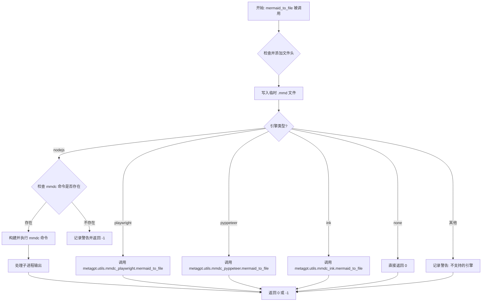
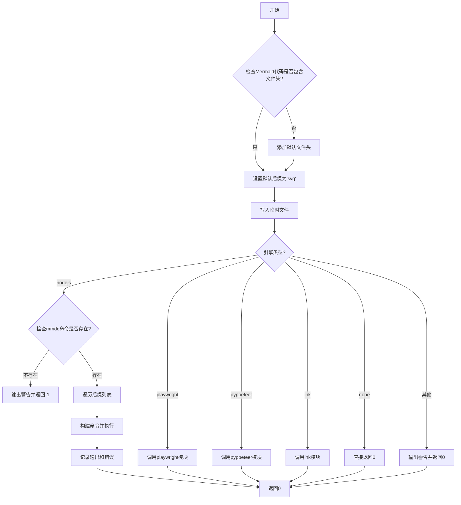

# `.\MetaGPT\metagpt\utils\mermaid.py` 详细设计文档

该代码提供了一个异步函数 `mermaid_to_file`，用于将 Mermaid 图表代码转换为多种格式的图像文件（如 PNG、PDF、SVG）。它支持多种渲染引擎（nodejs、playwright、pyppeteer、ink、none），并包含错误处理和日志记录功能。代码末尾还定义了两个示例 Mermaid 图表字符串（MMC1 和 MMC2）。

## 整体流程



## 类结构

```
mermaid.py (主文件)
├── 全局函数: mermaid_to_file
├── 全局变量: MMC1, MMC2
└── 外部依赖:
    ├── metagpt.utils.mmdc_playwright
    ├── metagpt.utils.mmdc_pyppeteer
    └── metagpt.utils.mmdc_ink
```

## 全局变量及字段


### `MMC1`
    
包含一个类图（classDiagram）的Mermaid代码字符串，描述了一个搜索系统的主要组件及其关系。

类型：`str`
    


### `MMC2`
    
包含一个序列图（sequenceDiagram）的Mermaid代码字符串，描述了搜索系统中各组件之间的交互流程。

类型：`str`
    


    

## 全局函数及方法

### `mermaid_to_file`

该函数是一个异步函数，用于将Mermaid代码转换为多种格式的文件（如PNG、PDF、SVG）。它支持多种渲染引擎（如nodejs、playwright、pyppeteer、ink、none），并允许指定输出图像的宽度、高度以及文件后缀。函数首先将Mermaid代码写入临时文件，然后根据指定的引擎调用相应的工具或库进行转换。如果使用nodejs引擎，会调用外部命令`mmdc`；如果使用其他引擎，则调用相应的Python模块。转换成功返回0，失败返回-1。

参数：

- `engine`：`str`，指定用于转换的引擎。支持的引擎有："nodejs"、"playwright"、"pyppeteer"、"ink"和"none"。
- `mermaid_code`：`str`，需要转换的Mermaid代码。
- `output_file_without_suffix`：`str`，输出文件的名称（不包含后缀）。
- `width`：`int`，可选，输出图像的宽度，默认为2048。
- `height`：`int`，可选，输出图像的高度，默认为2048。
- `config`：`Optional[Config]`，可选，用于转换的配置对象，默认为None，使用默认配置。
- `suffixes`：`Optional[List[str]]`，可选，要生成的文件后缀列表，支持"png"、"pdf"和"svg"，默认为["png"]。

返回值：`int`，如果转换成功返回0，如果转换失败返回-1。

#### 流程图



#### 带注释源码

```python
async def mermaid_to_file(
    engine,
    mermaid_code,
    output_file_without_suffix,
    width=2048,
    height=2048,
    config=None,
    suffixes: Optional[List[str]] = None,
) -> int:
    """Convert Mermaid code to various file formats.

    Args:
        engine (str): The engine to use for conversion. Supported engines are "nodejs", "playwright", "pyppeteer", "ink", and "none".
        mermaid_code (str): The Mermaid code to be converted.
        output_file_without_suffix (str): The output file name without the suffix.
        width (int, optional): The width of the output image. Defaults to 2048.
        height (int, optional): The height of the output image. Defaults to 2048.
        config (Optional[Config], optional): The configuration to use for the conversion. Defaults to None, which uses the default configuration.
        suffixes (Optional[List[str]], optional): The file suffixes to generate. Supports "png", "pdf", and "svg". Defaults to ["png"].

    Returns:
        int: 0 if the conversion is successful, -1 if the conversion fails.
    """
    # 添加默认的Mermaid文件头，用于设置主题和字体
    file_head = "%%{init: {'theme': 'default', 'themeVariables': { 'fontFamily': 'Inter' }}}%%\n"
    if not re.match(r"^%%\{.+", mermaid_code):
        mermaid_code = file_head + mermaid_code
    # 设置默认的后缀列表为["svg"]
    suffixes = suffixes or ["svg"]
    # 使用提供的配置或默认配置
    config = config if config else Config.default()
    # 确保输出目录存在
    dir_name = os.path.dirname(output_file_without_suffix)
    if dir_name and not os.path.exists(dir_name):
        os.makedirs(dir_name)
    # 将Mermaid代码写入临时文件
    tmp = Path(f"{output_file_without_suffix}.mmd")
    await awrite(filename=tmp, data=mermaid_code)

    # 根据指定的引擎进行转换
    if engine == "nodejs":
        # 检查mmdc命令是否存在
        if check_cmd_exists(config.mermaid.path) != 0:
            logger.warning(
                "RUN `npm install -g @mermaid-js/mermaid-cli` to install mmdc,"
                "or consider changing engine to `playwright`, `pyppeteer`, or `ink`."
            )
            return -1

        # 遍历所有指定的后缀，生成对应的文件
        for suffix in suffixes:
            output_file = f"{output_file_without_suffix}.{suffix}"
            logger.info(f"Generating {output_file}..")

            # 构建mmdc命令
            if config.mermaid.puppeteer_config:
                commands = [
                    config.mermaid.path,
                    "-p",
                    config.mermaid.puppeteer_config,
                    "-i",
                    str(tmp),
                    "-o",
                    output_file,
                    "-w",
                    str(width),
                    "-H",
                    str(height),
                ]
            else:
                commands = [config.mermaid.path, "-i", str(tmp), "-o", output_file, "-w", str(width), "-H", str(height)]
            # 执行命令并捕获输出
            process = await asyncio.create_subprocess_shell(
                " ".join(commands), stdout=asyncio.subprocess.PIPE, stderr=asyncio.subprocess.PIPE
            )

            stdout, stderr = await process.communicate()
            if stdout:
                logger.info(stdout.decode())
            if stderr:
                logger.warning(stderr.decode())
    else:
        # 根据引擎类型调用相应的Python模块
        if engine == "playwright":
            from metagpt.utils.mmdc_playwright import mermaid_to_file

            return await mermaid_to_file(mermaid_code, output_file_without_suffix, width, height, suffixes=suffixes)
        elif engine == "pyppeteer":
            from metagpt.utils.mmdc_pyppeteer import mermaid_to_file

            return await mermaid_to_file(mermaid_code, output_file_without_suffix, width, height, suffixes=suffixes)
        elif engine == "ink":
            from metagpt.utils.mmdc_ink import mermaid_to_file

            return await mermaid_to_file(mermaid_code, output_file_without_suffix, suffixes=suffixes)
        elif engine == "none":
            return 0
        else:
            logger.warning(f"Unsupported mermaid engine: {engine}")
    return 0
```

## 关键组件


### Mermaid 转换引擎适配器

该组件是一个多引擎适配器，负责将 Mermaid 代码转换为多种格式（如 PNG、SVG、PDF）的图像文件。它支持多种后端引擎（nodejs, playwright, pyppeteer, ink, none），通过统一的接口 `mermaid_to_file` 函数，根据传入的引擎参数动态选择并调用相应的底层实现，实现了渲染策略的可插拔和灵活切换。

### 配置管理

该组件通过 `Config` 类及其嵌套的 `mermaid` 配置项来管理 Mermaid 转换所需的外部依赖路径（如 `mmdc` 命令行工具）和运行时参数（如 Puppeteer 配置文件路径）。它确保了转换过程可以根据不同的部署环境（如是否安装了 Node.js）进行配置，提高了代码的可移植性和可配置性。

### 异步文件与进程操作

该组件利用 `asyncio` 库进行异步文件写入（`awrite`）和子进程管理（`create_subprocess_shell`）。这允许在等待外部命令行工具（如 `mmdc`）完成渲染时，程序可以处理其他任务，提高了 I/O 密集型操作的效率和整体程序的响应能力。

### 临时文件管理

在转换过程中，该组件会将传入的 Mermaid 代码先写入一个临时文件（`.mmd` 后缀），然后将此文件路径传递给底层的渲染引擎。这种设计隔离了代码逻辑与具体的渲染工具，使得不同引擎可以使用统一的文件接口，同时也便于调试和中间结果的检查。

### 错误处理与回退机制

该组件包含基本的错误处理逻辑，例如检查所需的命令行工具是否存在（`check_cmd_exists`）。当首选引擎（如 `nodejs`）不可用时，它会记录警告信息并返回错误码，或者（在代码逻辑中）允许调用者切换到其他可用的引擎（如 `playwright`），提供了基本的健壮性和用户指引。


## 问题及建议


### 已知问题

-   **硬编码的临时文件路径**：代码中临时文件路径的构建方式 (`Path(f"{output_file_without_suffix}.mmd")`) 存在潜在风险。如果 `output_file_without_suffix` 包含特殊字符或路径分隔符，可能导致文件创建失败或写入到非预期目录。同时，未使用系统安全的临时文件目录，可能引发权限问题或遗留临时文件。
-   **子进程命令注入风险**：在使用 `nodejs` 引擎时，通过 `asyncio.create_subprocess_shell` 执行命令字符串 (`" ".join(commands)`)。如果 `config.mermaid.path`、`config.mermaid.puppeteer_config` 或 `output_file` 等变量包含用户可控的恶意输入（如 `; rm -rf /`），可能导致命令注入攻击，执行任意系统命令。
-   **错误处理不充分**：函数返回 `0` 表示成功，`-1` 表示失败，但错误信息仅通过日志记录。调用者无法区分不同类型的失败（如引擎不支持、命令不存在、转换过程出错），也难以获取具体的错误原因进行程序化处理。
-   **资源泄漏风险**：当使用 `nodejs` 引擎时，创建了子进程 (`process`)，但在函数返回前没有显式地等待其终止或检查其退出状态码。虽然 `await process.communicate()` 会等待进程结束，但如果进程异常挂起，函数可能无法正常返回。此外，生成的临时文件 (`tmp`) 在函数结束后没有被清理，可能导致磁盘空间浪费。
-   **配置对象默认值逻辑**：`config = config if config else Config.default()` 这行代码在 `config` 为 `None` 时使用默认配置。然而，如果传入的 `config` 对象虽然不为 `None` 但缺少必要的属性（如 `config.mermaid.path`），后续代码会抛出 `AttributeError`，错误处理不够健壮。
-   **`engine == "none"` 的语义模糊**：当引擎为 `"none"` 时，函数直接返回 `0`，表示“成功”，但实际并未执行任何转换操作。这可能导致调用者误以为文件已生成。此设计意图不清晰，可能是用于跳过转换的“空操作”，但缺乏明确说明。
-   **同步与异步混合的目录创建**：函数使用 `os.makedirs` 创建目录，这是一个同步阻塞调用。在异步函数中执行此类I/O操作可能会阻塞事件循环，影响整体性能，尤其是在高并发场景下。

### 优化建议

-   **使用安全的临时文件处理**：建议使用 `tempfile` 模块创建临时文件，例如 `with tempfile.NamedTemporaryFile(mode='w', suffix='.mmd', delete=False) as tmp:`。这样可以确保文件位于系统临时目录，具有合适的权限，并且可以通过 `delete` 参数控制是否自动清理。同时，应确保在函数退出前（包括异常情况）删除临时文件。
-   **防范命令注入**：避免使用 `create_subprocess_shell` 和拼接命令字符串。应改用 `asyncio.create_subprocess_exec`，并将命令及其参数作为列表传递。例如：`process = await asyncio.create_subprocess_exec(config.mermaid.path, '-i', str(tmp), ...)`。这可以防止将参数误解为Shell元字符。
-   **细化错误处理与返回值**：定义更丰富的返回值或抛出特定异常。例如，可以定义枚举类 `ConversionResult` 或自定义异常（如 `UnsupportedEngineError`, `CommandNotFoundError`, `ConversionError`）。在函数内部捕获异常，记录日志，并向上层抛出或返回明确的错误码和消息。
-   **确保资源清理**：在 `try...finally` 块或异步上下文管理器中处理临时文件和子进程。确保在函数退出前，无论成功与否，都尝试删除临时文件。对于子进程，除了 `communicate`，还可以考虑设置超时 (`asyncio.wait_for`) 并强制终止 (`process.terminate()`, `process.kill()`) 长时间挂起的进程。
-   **增强配置验证**：在函数开始处，验证传入的 `config` 对象（或默认配置）是否包含 `mermaid` 部分以及必要的属性（如 `path`）。如果缺失，可以抛出 `ValueError` 或返回明确的错误，避免后续代码因属性错误而崩溃。
-   **明确“none”引擎的行为**：如果 `"none"` 引擎是设计用于跳过转换（例如，仅用于测试或特定工作流），应在函数文档字符串中明确说明其行为，并考虑是否返回一个特殊值或生成一个空的占位文件，以避免调用者混淆。
-   **使用异步文件与目录操作**：将同步的 `os.makedirs` 和 `awrite`（虽然 `awrite` 是异步的，但目录创建是同步的）替换为完全的异步操作。可以使用 `aiofiles.os` 模块（如果项目已引入）或 `asyncio.to_thread` 将同步的 `os.makedirs` 调用转移到线程池中执行，避免阻塞事件循环。
-   **考虑增加引擎自动回退机制**：当前逻辑中，如果指定的引擎（如 `nodejs`）不可用，函数直接返回失败。可以考虑实现一个优先级列表，当首选引擎失败时，自动尝试下一个可用的引擎（例如，`nodejs` -> `playwright` -> `pyppeteer` -> `ink`），提高鲁棒性。
-   **参数默认值优化**：`suffixes` 参数的默认值为 `["svg"]`，但函数文档和逻辑也支持 `"png"` 和 `"pdf"`。可以考虑将默认值设为 `["png", "svg"]` 或通过配置项设置，以提供更通用的默认输出。同时，应对传入的 `suffixes` 列表进行有效性校验。


## 其它


### 设计目标与约束

该模块的核心设计目标是提供一个灵活、可扩展的异步函数，用于将Mermaid代码转换为多种格式的图像文件（如PNG、SVG、PDF）。主要约束包括：
1.  **多引擎支持**：必须支持多种后端渲染引擎（nodejs, playwright, pyppeteer, ink, none），以适应不同的运行环境（如是否安装Node.js或浏览器）。
2.  **异步操作**：所有文件I/O和外部命令调用必须是异步的，以避免阻塞主程序。
3.  **配置驱动**：渲染行为（如命令行路径、浏览器配置）应通过外部配置对象（`Config`）管理，提高灵活性。
4.  **错误容忍与降级**：当首选引擎不可用时，应提供明确的警告信息，并允许降级到其他引擎或跳过渲染（`engine="none"`）。

### 错误处理与异常设计

模块采用返回状态码和日志记录的方式进行错误处理，而非抛出异常，以保持调用流程的简单。
1.  **返回值**：主函数`mermaid_to_file`返回整数，`0`表示成功，`-1`表示失败（主要针对`nodejs`引擎的依赖检查失败）。
2.  **依赖检查**：对于`nodejs`引擎，会检查`mmdc`命令是否存在，若不存在则记录警告并返回`-1`。
3.  **子进程错误**：执行`mmdc`命令时，会捕获并记录其标准错误输出（`stderr`），但不会因此中断程序，仅作日志记录。
4.  **引擎回退**：当指定引擎不支持时，记录警告信息。调用方需根据返回值判断是否成功。
5.  **文件操作**：创建目录和写入临时文件使用异步I/O，潜在的错误会由`awrite`函数或系统抛出，需由更上层的调用者处理。

### 数据流与状态机

1.  **数据流**：
    *   **输入**：Mermaid代码字符串、输出文件路径、配置参数、引擎选择。
    *   **处理**：
        *   代码预处理（添加主题头）。
        *   根据引擎类型分流。
        *   `nodejs`路径：写入临时`.mmd`文件 -> 构造命令行 -> 异步执行子进程 -> 捕获输出。
        *   其他引擎路径：委托给对应的专用模块（`mmdc_playwright`, `mmdc_pyppeteer`, `mmdc_ink`）。
    *   **输出**：在指定路径生成一个或多个图像文件（`.png`, `.svg`, `.pdf`）。
2.  **状态机**：函数逻辑可视为一个简化的决策状态机。
    *   **状态**：`初始化` -> `引擎判断` -> (`nodejs处理` | `playwright处理` | `pyppeteer处理` | `ink处理` | `none处理` | `引擎不支持`) -> `结束`。
    *   **转移条件**：`engine`参数的值。

### 外部依赖与接口契约

1.  **外部命令/工具**：
    *   **`@mermaid-js/mermaid-cli` (mmdc)**：当`engine="nodejs"`时必需。通过命令行调用，接口契约为指定的命令行参数格式（`-i`, `-o`, `-w`, `-H`, `-p`）。
2.  **Python第三方库**：
    *   **`playwright`**：当`engine="playwright"`时，由`metagpt.utils.mmdc_playwright`模块使用。
    *   **`pyppeteer`**：当`engine="pyppeteer"`时，由`metagpt.utils.mmdc_pyppeteer`模块使用。
3.  **项目内部模块**：
    *   **`metagpt.config2.Config`**：提供配置信息，特别是`mermaid.path`（mmdc路径）和`mermaid.puppeteer_config`（浏览器配置文件路径）。
    *   **`metagpt.utils.common.awrite`**：用于异步写入临时文件。
    *   **`metagpt.utils.common.check_cmd_exists`**：用于检查`mmdc`命令是否存在。
    *   **`metagpt.utils.mmdc_playwright` / `mmdc_pyppeteer` / `mmdc_ink`**：分别对应不同引擎的具体实现。`mermaid_to_file`函数通过动态导入调用它们，并传递参数。预期这些模块提供同名函数，并遵循相似的参数签名（可能略有不同，如`ink`引擎不支持`width`/`height`）。
4.  **接口契约**：`mermaid_to_file`函数是主要对外接口。调用者需确保传入的`engine`参数是受支持的，并理解不同引擎对环境的依赖。返回值`0`或`-1`是成功与否的简单契约。

    