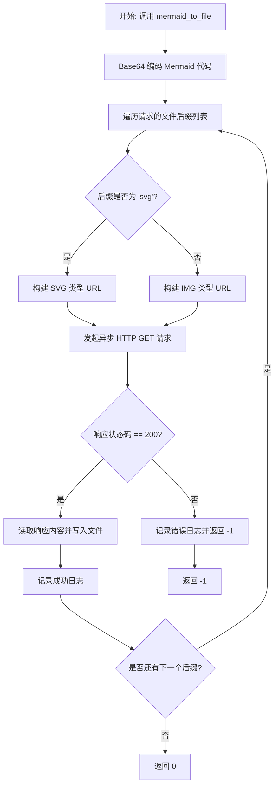
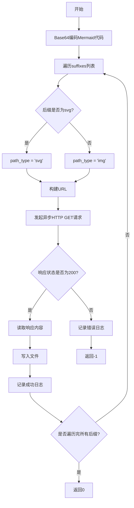

# `.\MetaGPT\metagpt\utils\mmdc_ink.py` 详细设计文档

该代码提供了一个异步函数 `mermaid_to_file`，其核心功能是将输入的 Mermaid 图表代码通过调用在线服务 `mermaid.ink` 的 API，转换为多种格式（如 PNG、PDF、SVG）的图像文件，并保存到本地。

## 整体流程



## 类结构

```
该文件不包含类定义，仅包含一个全局异步函数。
```

## 全局变量及字段


    

## 全局函数及方法

### `mermaid_to_file`

该函数是一个异步函数，用于将Mermaid代码转换为多种文件格式（如PNG、PDF、SVG）。它通过调用外部Mermaid服务（mermaid.ink）将Mermaid代码编码为Base64格式，并生成对应的图片或矢量图文件。函数支持批量生成多种格式的文件，并处理网络请求和文件写入操作。

参数：

- `mermaid_code`：`str`，需要转换的Mermaid代码。
- `output_file_without_suffix`：`str`，输出文件的名称（不包含后缀）。
- `suffixes`：`Optional[List[str]]`，需要生成的文件后缀列表，支持"png"、"pdf"和"svg"。默认为["png"]。

返回值：`int`，如果所有文件生成成功返回0，否则返回-1。

#### 流程图



#### 带注释源码

```python
async def mermaid_to_file(mermaid_code, output_file_without_suffix, suffixes: Optional[List[str]] = None):
    """Convert Mermaid code to various file formats.

    Args:
        mermaid_code (str): The Mermaid code to be converted.
        output_file_without_suffix (str): The output file name without the suffix.
        width (int, optional): The width of the output image. Defaults to 2048.
        height (int, optional): The height of the output image. Defaults to 2048.
        suffixes (Optional[List[str]], optional): The file suffixes to generate. Supports "png", "pdf", and "svg". Defaults to ["png"].

    Returns:
        int: 0 if the conversion is successful, -1 if the conversion fails.
    """
    # 将Mermaid代码进行Base64编码，用于URL传输
    encoded_string = base64.b64encode(mermaid_code.encode()).decode()
    # 如果未提供suffixes参数，默认生成PNG格式
    suffixes = suffixes or ["png"]
    # 遍历所有需要生成的文件后缀
    for suffix in suffixes:
        # 构建完整的输出文件名
        output_file = f"{output_file_without_suffix}.{suffix}"
        # 根据后缀类型确定URL路径类型（svg或img）
        path_type = "svg" if suffix == "svg" else "img"
        # 构建Mermaid服务的URL
        url = f"https://mermaid.ink/{path_type}/{encoded_string}"
        # 创建异步HTTP会话
        async with ClientSession() as session:
            try:
                # 发起异步GET请求
                async with session.get(url) as response:
                    # 检查响应状态码
                    if response.status == 200:
                        # 读取响应内容（二进制数据）
                        text = await response.content.read()
                        # 将内容写入文件
                        with open(output_file, "wb") as f:
                            f.write(text)
                        # 记录成功日志
                        logger.info(f"Generating {output_file}..")
                    else:
                        # 记录错误日志并返回失败
                        logger.error(f"Failed to generate {output_file}")
                        return -1
            except ClientError as e:
                # 处理网络异常并记录错误日志
                logger.error(f"network error: {e}")
                return -1
    # 所有文件生成成功，返回0
    return 0
```

## 关键组件


### Mermaid 在线渲染服务集成

通过调用 `mermaid.ink` 在线服务，将 Mermaid 代码转换为多种格式（如 PNG、SVG、PDF）的图像文件。

### 异步 HTTP 客户端

使用 `aiohttp` 库的 `ClientSession` 进行异步 HTTP 请求，以获取远程服务生成的图像数据。

### 文件输出处理器

根据指定的文件后缀名列表，将获取到的二进制图像数据写入到对应的本地文件中。

### 错误处理与日志记录

在网络请求失败或服务返回非 200 状态码时，通过 `metagpt.logs.logger` 记录错误信息并返回失败状态。


## 问题及建议


### 已知问题

-   **网络依赖与单点故障**：代码完全依赖外部服务 `https://mermaid.ink` 进行图表渲染。如果该服务不可用、响应缓慢、更改接口或停止服务，整个功能将失效。
-   **缺乏本地渲染能力**：没有提供备选的本地渲染方案（例如使用 `mermaid-cli` 或 `playwright`），导致功能受制于外部网络环境和第三方服务。
-   **错误处理不充分**：当 `response.status != 200` 时，函数会记录错误并立即返回 `-1`。这会导致在生成多个文件格式（如 `["png", "svg"]`）时，第一个文件失败就会中断整个流程，不会尝试生成后续格式的文件。
-   **硬编码的URL和参数**：服务URL (`https://mermaid.ink`) 和路径逻辑 (`/img/` 或 `/svg/`) 被硬编码在函数中，缺乏配置灵活性。同时，无法通过参数自定义生成图片的尺寸、样式等属性。
-   **同步文件写入**：在异步函数中使用了同步的 `with open(...) as f:` 进行文件写入。虽然对于单个小文件可能影响不大，但在高并发或处理大文件时，这会阻塞事件循环，影响整体性能。
-   **参数命名与文档不一致**：函数定义包含 `width` 和 `height` 参数，但函数体内部并未使用它们，且文档字符串中提到了这两个参数，这会造成使用者的困惑。这些参数可能是历史遗留或计划中的功能。

### 优化建议

-   **引入本地渲染后备方案**：集成 `mermaid-cli` (`mmdc`) 或使用 `playwright` 等无头浏览器进行本地渲染。可以设计一个策略，优先尝试本地渲染，失败或未安装时再回退到在线服务。
-   **改进错误处理与重试逻辑**：
    -   将每个文件格式的生成视为独立任务。一个格式生成失败不应影响其他格式的生成尝试。
    -   为网络请求添加重试机制（例如使用 `tenacity` 库）和超时设置，以提高在临时网络问题下的鲁棒性。
    -   区分不同类型的错误（网络错误、服务错误、文件写入错误）并记录更详细的信息。
-   **解耦与配置化**：
    -   将渲染服务的基础URL、路径模板等提取为配置项或函数参数，提高灵活性。
    -   考虑将渲染器（在线服务、本地CLI）抽象为策略模式，便于扩展和维护。
-   **使用异步文件IO**：将文件写入操作改为异步模式，例如使用 `aiofiles` 库，以避免阻塞事件循环。
-   **清理无用参数并更新文档**：移除函数签名和文档字符串中未使用的 `width` 和 `height` 参数，或者实现它们的功能（如果在线服务支持通过URL参数指定尺寸）。
-   **增强功能**：
    -   添加对输出图片尺寸、背景色、缩放等参数的支持（取决于渲染后端的能力）。
    -   考虑添加输入验证，确保 `mermaid_code` 是有效的Mermaid语法（可通过简单正则或尝试解析）。
    -   为输出文件路径创建必要的目录。


## 其它


### 设计目标与约束

该模块的核心设计目标是提供一个简单、异步的接口，将Mermaid代码转换为多种格式（PNG、PDF、SVG）的图像文件。其设计遵循以下约束：
1.  **外部服务依赖**：转换功能完全依赖于外部在线服务 `mermaid.ink`，因此模块的可用性和性能受该服务制约。
2.  **异步执行**：函数设计为异步，以支持在异步应用（如Web服务器）中高效执行网络I/O操作，避免阻塞。
3.  **轻量级与单一职责**：模块仅封装与 `mermaid.ink` API的交互逻辑，不包含Mermaid语法解析或图像处理功能，保持轻量和职责单一。
4.  **错误处理**：必须妥善处理网络请求失败、服务端错误等异常情况，并向调用者返回明确的错误状态。

### 错误处理与异常设计

模块的错误处理机制如下：
1.  **返回码机制**：函数 `mermaid_to_file` 使用整数返回码（0表示成功，-1表示失败）来指示操作的整体状态。这是一种简单的过程化错误指示方式。
2.  **网络与HTTP错误**：通过捕获 `aiohttp.ClientError` 异常来处理网络层面的问题（如连接超时、DNS解析失败）。同时，检查HTTP响应状态码，非200状态码被视为服务端错误或请求失败。
3.  **日志记录**：所有错误和关键操作（如文件生成成功）都通过 `logger` 进行记录，便于问题追踪和调试。错误日志包含具体的错误信息（如异常对象 `e` 或响应状态）。
4.  **短路返回**：在生成多个文件格式时，如果任一格式生成失败（网络错误或HTTP错误），函数会立即返回 `-1`，中止后续格式的生成。这确保了操作的原子性——要么全部成功，要么在第一个错误处停止。
5.  **潜在未处理异常**：函数未显式捕获文件I/O操作（`open` 和 `f.write`）可能抛出的异常（如 `PermissionError`, `FileNotFoundError`）。这些异常会直接向上层调用者传播。

### 数据流与状态机

1.  **数据流**：
    *   **输入**：Mermaid代码字符串 (`mermaid_code`)、输出文件基础名 (`output_file_without_suffix`)、目标格式列表 (`suffixes`)。
    *   **处理**：
        *   Mermaid代码被Base64编码。
        *   根据请求的格式 (`suffixes`)，构造指向 `mermaid.ink` 服务的URL。
        *   发起异步HTTP GET请求获取图像数据。
    *   **输出**：写入本地磁盘的对应格式的图像文件（如 `.png`, `.svg`）。
    *   **状态输出**：整数返回码（0/-1）和日志信息。

2.  **状态机（简化）**：
    函数执行可视为一个顺序状态机，针对 `suffixes` 列表中的每个格式执行以下步骤：
    *   **初始化**：构建URL和输出文件名。
    *   **请求中**：发起异步网络请求。
    *   **检查响应**：
        *   若状态码为200 -> **写入文件** -> 记录成功 -> 处理下一个格式（若存在）。
        *   若状态码非200 -> **记录错误** -> 状态转为 **失败** -> 终止循环，返回-1。
    *   若发生网络异常 (`ClientError`) -> **记录错误** -> 状态转为 **失败** -> 终止循环，返回-1。
    *   所有格式处理成功 -> 状态转为 **成功** -> 返回0。

### 外部依赖与接口契约

1.  **外部依赖**：
    *   **`aiohttp`**：用于进行异步HTTP请求。
    *   **`mermaid.ink` 公共服务**：核心依赖，提供Mermaid代码到图像的转换服务。模块的行为和输出质量完全取决于该服务的可用性、性能及API稳定性。
    *   **`metagpt.logs.logger`**：项目内部的日志记录器，用于输出信息、警告和错误。

2.  **接口契约**：
    *   **函数 `mermaid_to_file`**：
        *   **预期输入**：有效的Mermaid语法字符串；合法的文件路径基础名；支持的格式列表（默认为 `["png"]`）。
        *   **预期输出**：在指定路径生成对应的图像文件。
        *   **副作用**：在磁盘上创建或覆盖文件；向日志系统写入记录。
        *   **错误承诺**：遇到网络错误、服务错误或（可能的）文件写入错误时，返回 `-1` 并记录错误。不保证部分生成的文件会被清理。
    *   **与 `mermaid.ink` 的隐含契约**：
        *   通过特定URL格式 (`/{path_type}/{base64_encoded_mermaid_code}`) 发起GET请求。
        *   期望服务返回HTTP 200状态码及对应的图像二进制数据。
        *   未处理服务可能返回的其他状态码（如404, 500）或响应格式变化。

### 安全与合规性考虑

1.  **数据传输**：Mermaid代码通过URL参数（Base64编码）传输到 `mermaid.ink`。虽然Base64不是加密，但代码内容可能通过日志或网络监控被间接暴露。需注意代码中是否包含敏感信息。
2.  **服务可靠性**：依赖不受控的第三方公共服务存在单点故障风险。该服务可能不可用、响应缓慢、更改接口或限制访问，从而影响本模块的功能。
3.  **资源消耗**：函数会下载可能较大的图像文件并写入本地磁盘。在循环或高并发调用时，需注意磁盘I/O和网络带宽消耗。
4.  **输入验证**：当前代码未对输入进行验证（如 `mermaid_code` 是否为空或无效，`suffixes` 是否包含不支持的类型）。无效输入可能导致生成无意义的请求或文件。

    