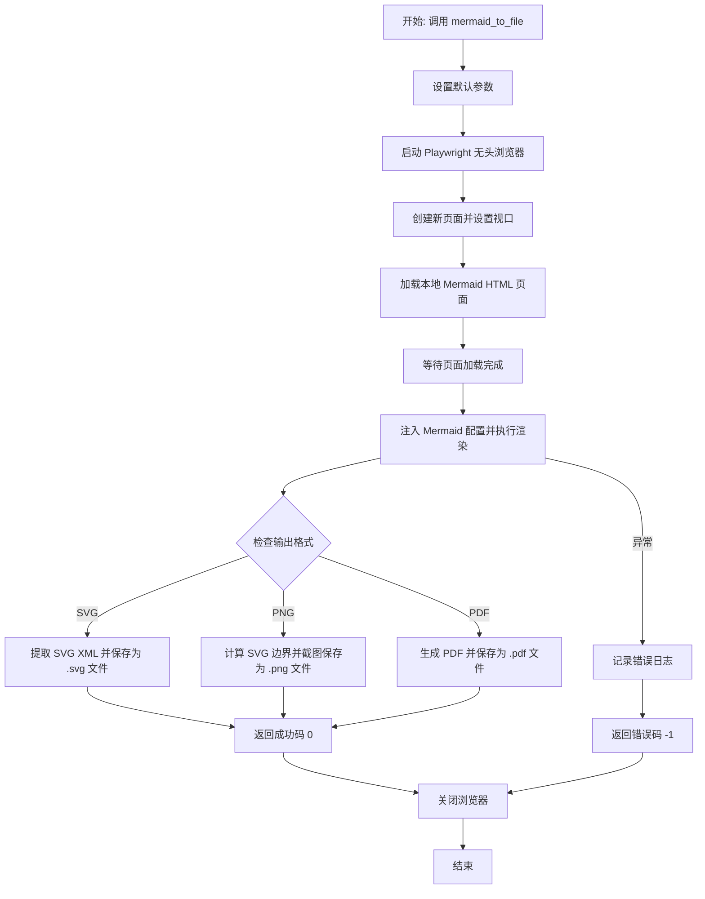
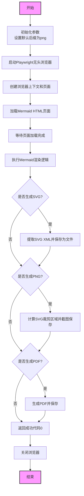

# `.\MetaGPT\metagpt\utils\mmdc_playwright.py` 详细设计文档

该代码是一个基于 Playwright 的异步工具函数，用于将 Mermaid 图表代码转换为多种格式的图像文件（如 PNG、SVG、PDF）。它通过启动一个无头浏览器，加载包含 Mermaid 渲染引擎的 HTML 页面，执行 Mermaid 代码生成 SVG，然后根据需求进行截图或导出为不同格式的文件。

## 整体流程



## 类结构

```
mmdc_playwright.py
├── 全局函数
│   └── mermaid_to_file
└── 内部函数
    └── console_message (事件处理函数)
```

## 全局变量及字段


### `__dirname`
    
当前脚本文件所在的目录的绝对路径。

类型：`str`
    


### `p`
    
Playwright异步上下文管理器实例，用于管理浏览器生命周期。

类型：`async_playwright`
    


### `browser`
    
启动的Chromium浏览器实例。

类型：`Browser`
    


### `device_scale_factor`
    
设备像素比例，用于控制输出图像的分辨率缩放。

类型：`float`
    


### `context`
    
浏览器上下文，用于隔离页面环境，包含视口和设备缩放因子等配置。

类型：`BrowserContext`
    


### `page`
    
浏览器页面实例，用于加载HTML、执行JavaScript和捕获输出。

类型：`Page`
    


### `mermaid_html_path`
    
本地Mermaid渲染HTML文件的绝对路径。

类型：`str`
    


### `mermaid_html_url`
    
转换为file:协议的URL，用于在浏览器中加载本地HTML文件。

类型：`str`
    


### `mermaid_config`
    
Mermaid图表的配置字典，用于初始化渲染器。

类型：`dict`
    


### `background_color`
    
图表背景颜色，默认为白色（#ffffff）。

类型：`str`
    


### `my_css`
    
自定义CSS样式字符串，可注入到生成的SVG中。

类型：`str`
    


### `svg_xml`
    
序列化后的SVG XML字符串，用于保存为.svg文件。

类型：`str`
    


### `clip`
    
包含SVG元素位置和尺寸的字典，用于精确截取PNG截图。

类型：`dict`
    


### `screenshot`
    
PNG格式的截图二进制数据。

类型：`bytes`
    


### `pdf_data`
    
PDF格式的文档二进制数据。

类型：`bytes`
    


    

## 全局函数及方法

### `mermaid_to_file`

该函数是一个异步函数，用于将Mermaid代码转换为多种文件格式（如PNG、SVG、PDF）。它通过Playwright控制无头浏览器加载一个包含Mermaid渲染引擎的HTML页面，执行Mermaid代码，并将渲染结果截图或导出为指定格式的文件。

参数：

- `mermaid_code`：`str`，需要转换的Mermaid代码。
- `output_file_without_suffix`：`str`，输出文件的名称（不包含后缀）。
- `width`：`int`，可选，输出图像的宽度，默认为2048。
- `height`：`int`，可选，输出图像的高度，默认为2048。
- `suffixes`：`Optional[List[str]]`，可选，需要生成的文件后缀列表，支持"png"、"pdf"和"svg"，默认为["png"]。

返回值：`int`，如果转换成功返回0，如果转换失败返回-1。

#### 流程图



#### 带注释源码

```python
async def mermaid_to_file(
    mermaid_code, output_file_without_suffix, width=2048, height=2048, suffixes: Optional[List[str]] = None
) -> int:
    """Convert Mermaid code to various file formats.

    Args:
        mermaid_code (str): The Mermaid code to be converted.
        output_file_without_suffix (str): The output file name without the suffix.
        width (int, optional): The width of the output image. Defaults to 2048.
        height (int, optional): The height of the output image. Defaults to 2048.
        suffixes (Optional[List[str]], optional): The file suffixes to generate. Supports "png", "pdf", and "svg". Defaults to ["png"].

    Returns:
        int: 0 if the conversion is successful, -1 if the conversion fails.
    """
    # 设置默认后缀为png，如果未提供suffixes参数
    suffixes = suffixes or ["png"]
    # 获取当前脚本所在目录的绝对路径
    __dirname = os.path.dirname(os.path.abspath(__file__))

    # 启动Playwright异步上下文管理器
    async with async_playwright() as p:
        # 启动Chromium浏览器
        browser = await p.chromium.launch()
        device_scale_factor = 1.0
        # 创建浏览器上下文，设置视口大小和设备缩放因子
        context = await browser.new_context(
            viewport={"width": width, "height": height},
            device_scale_factor=device_scale_factor,
        )
        # 创建新页面
        page = await context.new_page()

        # 定义控制台消息处理函数，用于日志记录
        async def console_message(msg):
            logger.info(msg.text)

        # 监听页面控制台消息
        page.on("console", console_message)

        try:
            # 设置页面视口大小
            await page.set_viewport_size({"width": width, "height": height})

            # 构建Mermaid HTML文件的路径和URL
            mermaid_html_path = os.path.abspath(os.path.join(__dirname, "index.html"))
            mermaid_html_url = urljoin("file:", mermaid_html_path)
            # 导航到Mermaid HTML页面
            await page.goto(mermaid_html_url)
            # 等待页面网络空闲状态
            await page.wait_for_load_state("networkidle")

            # 等待容器元素加载完成
            await page.wait_for_selector("div#container", state="attached")
            mermaid_config = {}
            background_color = "#ffffff"
            my_css = ""
            # 设置页面背景颜色
            await page.evaluate(f'document.body.style.background = "{background_color}";')

            # 执行JavaScript代码，渲染Mermaid图表
            await page.evaluate(
                """async ([definition, mermaidConfig, myCSS, backgroundColor]) => {
                const { mermaid, zenuml } = globalThis;
                await mermaid.registerExternalDiagrams([zenuml]);
                mermaid.initialize({ startOnLoad: false, ...mermaidConfig });
                const { svg } = await mermaid.render('my-svg', definition, document.getElementById('container'));
                document.getElementById('container').innerHTML = svg;
                const svgElement = document.querySelector('svg');
                svgElement.style.backgroundColor = backgroundColor;
            
                if (myCSS) {
                    const style = document.createElementNS('http://www.w3.org/2000/svg', 'style');
                    style.appendChild(document.createTextNode(myCSS));
                    svgElement.appendChild(style);
                }
            
            }""",
                [mermaid_code, mermaid_config, my_css, background_color],
            )

            # 如果请求生成SVG文件
            if "svg" in suffixes:
                # 提取SVG元素的XML内容
                svg_xml = await page.evaluate(
                    """() => {
                        const svg = document.querySelector('svg');
                        if (!svg) {
                            throw new Error('SVG element not found');
                        }
                        const xmlSerializer = new XMLSerializer();
                        return xmlSerializer.serializeToString(svg);
                    }"""
                )
                # 记录日志并保存SVG文件
                logger.info(f"Generating {output_file_without_suffix}.svg..")
                with open(f"{output_file_without_suffix}.svg", "wb") as f:
                    f.write(svg_xml.encode("utf-8"))

            # 如果请求生成PNG文件
            if "png" in suffixes:
                # 计算SVG元素的裁剪区域
                clip = await page.evaluate(
                    """() => {
                    const svg = document.querySelector('svg');
                    const rect = svg.getBoundingClientRect();
                    return {
                        x: Math.floor(rect.left),
                        y: Math.floor(rect.top),
                        width: Math.ceil(rect.width),
                        height: Math.ceil(rect.height)
                    };
                }"""
                )
                # 调整视口大小以适应SVG元素
                await page.set_viewport_size({"width": clip["x"] + clip["width"], "height": clip["y"] + clip["height"]})
                # 截图并保存PNG文件
                screenshot = await page.screenshot(clip=clip, omit_background=True, scale="device")
                logger.info(f"Generating {output_file_without_suffix}.png..")
                with open(f"{output_file_without_suffix}.png", "wb") as f:
                    f.write(screenshot)
            # 如果请求生成PDF文件
            if "pdf" in suffixes:
                # 生成PDF数据并保存文件
                pdf_data = await page.pdf(scale=device_scale_factor)
                logger.info(f"Generating {output_file_without_suffix}.pdf..")
                with open(f"{output_file_without_suffix}.pdf", "wb") as f:
                    f.write(pdf_data)
            # 返回成功代码
            return 0
        except Exception as e:
            # 记录错误并返回失败代码
            logger.error(e)
            return -1
        finally:
            # 确保浏览器被关闭
            await browser.close()
```

## 关键组件


### Mermaid 渲染引擎

通过 Playwright 控制的 Chromium 浏览器，加载并执行 Mermaid.js 库，将输入的 Mermaid 代码渲染为 SVG 图形。

### 文件格式转换器

将渲染得到的 SVG 图形，通过截图或序列化操作，转换为 PNG、PDF 或 SVG 文件格式。

### 异步浏览器自动化

利用 Playwright 的异步 API 启动和管理浏览器实例，实现无头环境下的页面导航、脚本执行和元素操作。

### 配置与样式注入

支持向渲染过程注入自定义的 Mermaid 配置、CSS 样式和背景颜色，以控制图表的最终外观。


## 问题及建议


### 已知问题

-   **资源泄漏风险**：代码中使用了 `async with async_playwright() as p:` 来管理 Playwright 实例的生命周期，这确保了在函数结束时浏览器实例会被正确关闭。然而，如果在 `try` 块中发生异常，`finally` 块中的 `await browser.close()` 仍然会执行，这是正确的。但需要注意，如果在 `browser = await p.chromium.launch()` 之后但在 `try` 块之前发生异常，`browser` 变量可能为 `None`，导致 `finally` 块中的 `await browser.close()` 调用失败。不过，当前代码结构下，`browser` 的初始化在 `try` 块外，如果此处失败，函数会直接退出，不会进入 `finally` 块，因此风险较低。主要风险在于 `context` 和 `page` 对象没有显式的 `close` 调用，它们依赖于 `browser.close()` 来清理。在复杂的异步场景中，这通常是足够的，但并非最佳实践。
-   **硬编码的 HTML 文件路径**：函数依赖于一个硬编码的本地 HTML 文件路径 (`index.html`) 来渲染 Mermaid 图表。这降低了代码的可移植性和可测试性，因为该文件必须存在于特定的相对位置。如果文件被移动、重命名或缺失，函数将无法工作。
-   **缺乏输入验证**：函数没有对输入参数（如 `mermaid_code`, `suffixes`）进行充分的验证。例如，空的 `mermaid_code` 可能导致页面渲染空白或错误；`suffixes` 列表中包含不支持的格式（如 `"jpg"`）时，函数会忽略它，但不会给出警告或错误。
-   **同步文件写入**：在异步函数中使用了同步的 `with open(...) as f:` 进行文件写入。虽然对于单个文件操作影响可能不大，但在高并发场景下，这可能会阻塞事件循环，影响性能。
-   **错误处理过于笼统**：`except Exception as e:` 捕获了所有异常，虽然记录了错误日志，但返回的 `-1` 对于调用者来说信息量不足，无法区分是网络问题、渲染问题、文件写入问题还是其他问题。
-   **潜在的竞态条件**：在生成 PNG 时，代码先通过 JavaScript 计算 SVG 的边界框 (`clip`)，然后调整视口大小，最后截图。如果在计算 `clip` 和截图之间，页面内容发生了变化（虽然在此特定场景中可能性很小），可能会导致截图不准确或失败。
-   **设备缩放因子处理**：`device_scale_factor` 被硬编码为 `1.0`，并且在生成 PDF 时使用了这个值。这可能导致在高DPI屏幕上生成的PDF尺寸与预期不符。虽然视口大小通过 `width` 和 `height` 参数控制，但 `device_scale_factor` 未根据实际需求或系统设置进行配置。

### 优化建议

-   **显式清理资源**：在 `try` 块内部，成功创建 `context` 和 `page` 后，可以考虑在 `finally` 块中先显式关闭 `page` 和 `context`，再关闭 `browser`。虽然 `browser.close()` 通常会清理其子资源，但显式关闭可以更清晰地表达资源生命周期管理意图，并避免在某些边缘情况下的资源泄漏。例如：
    ```python
    finally:
        if page:
            await page.close()
        if context:
            await context.close()
        if browser:
            await browser.close()
    ```
-   **解耦 HTML 模板依赖**：将 HTML 模板内容（`index.html`）作为字符串嵌入到 Python 代码中，或者通过参数、配置文件指定模板路径。这样可以提高代码的独立性和可测试性。例如，可以读取该文件内容，然后通过 `page.set_content()` 加载，而不是依赖 `file://` URL。
-   **增强输入验证**：在函数开始时验证关键参数。例如，检查 `mermaid_code` 是否非空且为字符串；检查 `suffixes` 列表中的每个元素是否属于 `{"png", "svg", "pdf"}`，对于无效项可以记录警告或引发明确的 `ValueError`。
-   **使用异步文件操作**：考虑使用 `aiofiles` 库或其他异步文件写入方法，以保持整个操作流程的异步性，避免阻塞事件循环。
-   **细化错误处理与返回信息**：可以定义自定义异常类或使用更具体的异常捕获（如 `playwright._impl._errors.Error`, `IOError`），并根据异常类型返回不同的错误码或包含错误信息的元组/对象，方便调用者处理。
-   **优化截图流程的原子性**：为了确保截图时页面状态稳定，可以在计算 `clip` 和执行 `page.screenshot` 之间，通过 `page.evaluate` 执行一个简单的同步操作或检查，以确保DOM没有在异步更新。或者，考虑使用 `page.wait_for_function` 来等待某个稳定状态。
-   **提供设备缩放因子配置**：将 `device_scale_factor` 作为函数的一个可选参数，允许调用者根据输出需求（如生成高分辨率图片）进行设置。同时，可以尝试自动检测系统或环境的缩放因子。
-   **代码结构与可读性**：当前函数较长，混合了浏览器控制、页面交互、文件输出等多种逻辑。可以考虑将其拆分为几个更小的、功能单一的辅助函数，例如 `_render_mermaid_to_svg`, `_save_svg_to_file`, `_take_screenshot`, `_generate_pdf` 等，以提高可读性、可测试性和可维护性。
-   **增加超时控制**：为页面导航 (`page.goto`)、等待选择器 (`page.wait_for_selector`)、渲染评估 (`page.evaluate`) 等操作添加超时参数，防止因网络问题或脚本错误导致函数长时间挂起。
-   **支持更多输出格式或配置**：评估是否需要支持更多 Mermaid 配置选项（通过 `mermaid_config` 参数），或者是否允许用户传入自定义的 CSS 样式 (`my_css`) 来更精细地控制输出样式。


## 其它


### 设计目标与约束

该模块的核心设计目标是将 Mermaid 图表代码转换为多种静态文件格式（SVG、PNG、PDF）。主要约束包括：1) 依赖 Playwright 无头浏览器进行渲染，以确保图表渲染的准确性和与 Web 环境的一致性；2) 需要本地 HTML 文件作为渲染模板，存在外部文件依赖；3) 转换过程为异步操作，需适应异步编程模型；4) 输出文件尺寸由输入参数动态控制，需确保渲染视口与截图区域匹配。

### 错误处理与异常设计

模块的错误处理策略较为集中。`mermaid_to_file` 函数使用一个顶层的 `try-except` 块捕获所有执行过程中的异常。当发生任何异常时，会记录错误日志并返回状态码 `-1` 表示失败。成功执行则返回 `0`。这种设计简化了错误处理，但可能掩盖具体的错误类型，不利于调用者进行精细化处理。例如，文件写入失败、浏览器启动失败、页面元素未找到等异常均被统一归类为通用失败。

### 数据流与状态机

1.  **输入**：Mermaid 代码字符串、输出文件基础名、图像尺寸参数、目标格式列表。
2.  **处理流程**：
    *   **初始化**：启动 Playwright 浏览器实例，创建指定尺寸的页面上下文。
    *   **加载环境**：导航至本地 HTML 模板文件，等待页面资源加载完成。
    *   **渲染图表**：通过 `page.evaluate` 将 Mermaid 代码注入页面，调用 Mermaid.js 库进行渲染，生成 SVG 元素。
    *   **输出生成**：根据 `suffixes` 列表，循环或条件判断生成不同格式文件：
        *   **SVG**：序列化页面中的 SVG 元素并写入文件。
        *   **PNG**：计算 SVG 元素的位置和尺寸，对特定区域进行截图并写入文件。
        *   **PDF**：将整个页面导出为 PDF 并写入文件。
3.  **输出**：一个或多个图像/文档文件（`.svg`, `.png`, `.pdf`）及一个整数状态码。
4.  **状态**：流程基本上是线性的，没有复杂的状态切换。主要状态节点包括：浏览器未启动、浏览器就绪、页面加载中、图表渲染完成、文件写入中、流程结束（成功或失败）。

### 外部依赖与接口契约

1.  **库依赖**：
    *   `playwright`: 用于控制无头浏览器进行页面渲染和截图/PDF生成。核心依赖其 `async_api`。
    *   `metagpt.logs`: 项目内部日志模块，用于记录过程信息和错误。
2.  **文件依赖**：
    *   同目录下的 `index.html` 文件：作为渲染 Mermaid 图表的宿主页面模板。此文件必须存在且包含 Mermaid.js 及其相关依赖（如 zenuml）的引入。
3.  **环境依赖**：
    *   需要安装 Playwright 的 Chromium 浏览器驱动（可通过 `playwright install chromium` 安装）。
    *   运行环境需支持异步 I/O。
4.  **接口契约**：
    *   **函数签名**: `async def mermaid_to_file(mermaid_code, output_file_without_suffix, width=2048, height=2048, suffixes: Optional[List[str]] = None) -> int`
    *   **调用约定**：调用者必须 `await` 此异步函数。`output_file_without_suffix` 应包含完整的目录路径（如果不在当前目录）。函数不负责创建目录。
    *   **参数约束**：`suffixes` 列表中的字符串应为小写的 `"png"`, `"svg"`, `"pdf"`，函数内部未做严格校验，传入不支持的后缀可能导致无输出。

### 安全与合规性考虑

1.  **本地文件访问**：通过 `file:` 协议加载本地 HTML 文件，这在现代浏览器中通常受到严格限制（CORS、同源策略）。Playwright 上下文默认可能放宽这些限制，但此行为依赖于 Playwright 的配置，存在环境差异性。
2.  **代码注入**：函数将用户提供的 `mermaid_code` 作为参数传递给页面内的 `evaluate` 方法执行。虽然 `evaluate` 的调用方式本身是参数化传递（非字符串拼接），减少了直接脚本注入风险，但 `mermaid_code` 内容最终会在浏览器环境中作为 Mermaid 定义被解析和执行。如果 Mermaid.js 库本身存在漏洞，恶意构造的 Mermaid 代码可能带来风险。目前设计假设输入代码是可信的。
3.  **资源清理**：使用 `async with` 和 `finally` 块确保浏览器实例在任何情况下（成功、异常）都会被关闭，避免了资源泄漏。

    