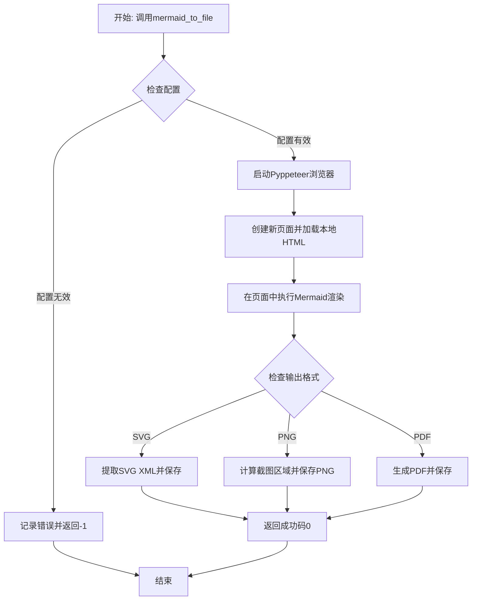

# `.\MetaGPT\metagpt\utils\mmdc_pyppeteer.py` 详细设计文档

该代码是一个基于Pyppeteer的Mermaid图表转换工具，能够将Mermaid代码转换为多种格式（SVG、PNG、PDF）的图像文件。它通过启动无头浏览器加载本地HTML页面，在页面中执行Mermaid渲染逻辑，然后捕获渲染结果并保存为指定格式的文件。

## 整体流程



## 类结构

```
全局函数
└── mermaid_to_file (异步函数)
```

## 全局变量及字段


### `logger`
    
用于记录日志的全局日志记录器实例。

类型：`Logger`
    


### `Config`
    
配置类，用于管理应用程序的配置信息。

类型：`class`
    


    

## 全局函数及方法

### `mermaid_to_file`

将 Mermaid 代码转换为多种文件格式（SVG、PNG、PDF）的异步函数。它通过 Pyppeteer 启动一个无头浏览器，加载包含 Mermaid 库的 HTML 页面，执行 Mermaid 渲染，并根据指定的后缀列表生成相应的输出文件。

参数：

- `mermaid_code`：`str`，要转换的 Mermaid 代码。
- `output_file_without_suffix`：`str`，输出文件名（不含后缀）。
- `width`：`int`，可选，输出图像的宽度，默认为 2048。
- `height`：`int`，可选，输出图像的高度，默认为 2048。
- `config`：`Optional[Config]`，可选，用于转换的配置对象，默认为 None（使用默认配置）。
- `suffixes`：`Optional[List[str]]`，可选，要生成的文件后缀列表，支持 "png"、"pdf" 和 "svg"，默认为 ["png"]。

返回值：`int`，转换成功返回 0，失败返回 -1。

#### 流程图

```mermaid
flowchart TD
    A[开始] --> B{配置检查}
    B -->|未提供| C[使用默认配置]
    B -->|已提供| D[使用传入配置]
    C --> E{检查后缀列表}
    D --> E
    E -->|未提供| F[默认后缀列表<br>['png']]
    E -->|已提供| G[使用传入后缀列表]
    F --> H[启动无头浏览器]
    G --> H
    H --> I{检查浏览器路径}
    I -->|未设置| J[记录错误并返回 -1]
    I -->|已设置| K[创建新页面]
    K --> L[设置视口]
    L --> M[加载 Mermaid HTML 页面]
    M --> N[执行 Mermaid 渲染]
    N --> O{后缀列表处理}
    O -->|包含 'svg'| P[生成 SVG 文件]
    O -->|包含 'png'| Q[生成 PNG 文件]
    O -->|包含 'pdf'| R[生成 PDF 文件]
    P --> S[记录生成信息]
    Q --> S
    R --> S
    S --> T[返回 0]
    J --> U[结束]
    T --> U
```

#### 带注释源码

```python
async def mermaid_to_file(
    mermaid_code, output_file_without_suffix, width=2048, height=2048, config=None, suffixes: Optional[List[str]] = None
) -> int:
    """Convert Mermaid code to various file formats.

    Args:
        mermaid_code (str): The Mermaid code to be converted.
        output_file_without_suffix (str): The output file name without the suffix.
        width (int, optional): The width of the output image. Defaults to 2048.
        height (int, optional): The height of the output image. Defaults to 2048.
        config (Optional[Config], optional): The configuration to use for the conversion. Defaults to None, which uses the default configuration.
        suffixes (Optional[List[str]], optional): The file suffixes to generate. Supports "png", "pdf", and "svg". Defaults to ["png"].

    Returns:
        int: 0 if the conversion is successful, -1 if the conversion fails.
    """
    # 1. 配置初始化：如果未提供配置，则使用默认配置；如果未提供后缀列表，则默认生成 PNG。
    config = config if config else Config.default()
    suffixes = suffixes or ["png"]
    __dirname = os.path.dirname(os.path.abspath(__file__))

    # 2. 启动无头浏览器：检查配置中是否设置了 Pyppeteer 路径，如果没有则记录错误并返回 -1。
    if config.mermaid.pyppeteer_path:
        browser = await launch(
            headless=True,
            executablePath=config.mermaid.pyppeteer_path,
            args=["--disable-extensions", "--no-sandbox"],
        )
    else:
        logger.error("Please set the var mermaid.pyppeteer_path in the config2.yaml.")
        return -1
    page = await browser.newPage()
    device_scale_factor = 1.0

    # 3. 控制台消息处理：注册一个事件监听器，将浏览器的控制台消息记录到日志中。
    async def console_message(msg):
        logger.info(msg.text)

    page.on("console", console_message)

    try:
        # 4. 设置页面视口：根据传入的宽度和高度设置页面视口。
        await page.setViewport(viewport={"width": width, "height": height, "deviceScaleFactor": device_scale_factor})

        # 5. 加载 Mermaid HTML 页面：构造本地 HTML 文件的 URL 并导航到该页面。
        mermaid_html_path = os.path.abspath(os.path.join(__dirname, "index.html"))
        mermaid_html_url = urljoin("file:", mermaid_html_path)
        await page.goto(mermaid_html_url)

        # 6. 等待容器元素加载：确保页面中的容器元素已加载。
        await page.querySelector("div#container")
        mermaid_config = {}
        background_color = "#ffffff"
        my_css = ""
        await page.evaluate(f'document.body.style.background = "{background_color}";')

        # 7. 执行 Mermaid 渲染：在页面上下文中执行 JavaScript 代码，初始化 Mermaid 并渲染图表。
        await page.evaluate(
            """async ([definition, mermaidConfig, myCSS, backgroundColor]) => {
            const { mermaid, zenuml } = globalThis;
            await mermaid.registerExternalDiagrams([zenuml]);
            mermaid.initialize({ startOnLoad: false, ...mermaidConfig });
            const { svg } = await mermaid.render('my-svg', definition, document.getElementById('container'));
            document.getElementById('container').innerHTML = svg;
            const svgElement = document.querySelector('svg');
            svgElement.style.backgroundColor = backgroundColor;
        
            if (myCSS) {
                const style = document.createElementNS('http://www.w3.org/2000/svg', 'style');
                style.appendChild(document.createTextNode(myCSS));
                svgElement.appendChild(style);
            }
        }""",
            [mermaid_code, mermaid_config, my_css, background_color],
        )

        # 8. 根据后缀列表生成文件：
        #    - SVG：序列化 SVG 元素并写入文件。
        if "svg" in suffixes:
            svg_xml = await page.evaluate(
                """() => {
                const svg = document.querySelector('svg');
                const xmlSerializer = new XMLSerializer();
                return xmlSerializer.serializeToString(svg);
            }"""
            )
            logger.info(f"Generating {output_file_without_suffix}.svg..")
            with open(f"{output_file_without_suffix}.svg", "wb") as f:
                f.write(svg_xml.encode("utf-8"))

        #    - PNG：计算 SVG 元素的边界框，调整视口并截图。
        if "png" in suffixes:
            clip = await page.evaluate(
                """() => {
                const svg = document.querySelector('svg');
                const rect = svg.getBoundingClientRect();
                return {
                    x: Math.floor(rect.left),
                    y: Math.floor(rect.top),
                    width: Math.ceil(rect.width),
                    height: Math.ceil(rect.height)
                };
            }"""
            )
            await page.setViewport(
                {
                    "width": clip["x"] + clip["width"],
                    "height": clip["y"] + clip["height"],
                    "deviceScaleFactor": device_scale_factor,
                }
            )
            screenshot = await page.screenshot(clip=clip, omit_background=True, scale="device")
            logger.info(f"Generating {output_file_without_suffix}.png..")
            with open(f"{output_file_without_suffix}.png", "wb") as f:
                f.write(screenshot)
        #    - PDF：生成 PDF 数据并写入文件。
        if "pdf" in suffixes:
            pdf_data = await page.pdf(scale=device_scale_factor)
            logger.info(f"Generating {output_file_without_suffix}.pdf..")
            with open(f"{output_file_without_suffix}.pdf", "wb") as f:
                f.write(pdf_data)
        return 0
    except Exception as e:
        # 9. 异常处理：捕获任何异常，记录错误并返回 -1。
        logger.error(e)
        return -1
    finally:
        # 10. 资源清理：无论成功与否，都关闭浏览器实例。
        await browser.close()
```

## 关键组件

### Mermaid 渲染与转换引擎

该组件负责将输入的 Mermaid 代码通过无头浏览器（Pyppeteer）渲染成 SVG 图形，并支持将渲染结果导出为 PNG、PDF 和 SVG 格式的文件。它封装了从代码到可视化图形的完整转换流程。

### 无头浏览器管理

该组件负责启动、配置和管理 Pyppeteer 无头浏览器实例。它根据配置文件中的路径启动浏览器，设置视口参数，并确保在转换任务完成后正确关闭浏览器，以管理浏览器生命周期和资源。

### 文件输出处理器

该组件根据用户指定的后缀列表（如 `png`, `pdf`, `svg`），将浏览器中渲染出的图形内容序列化为对应的二进制或文本数据，并写入到本地文件中。它处理了不同格式（SVG、PNG、PDF）的生成逻辑和文件保存操作。

### 配置与错误处理器

该组件负责加载和管理应用程序的配置（如浏览器可执行文件路径），并在转换过程的各个阶段（如浏览器启动失败、页面渲染异常、文件写入错误）进行异常捕获和日志记录，确保程序的健壮性并提供清晰的错误信息。

## 问题及建议


### 已知问题

-   **浏览器启动路径硬依赖配置**：代码强制要求 `config.mermaid.pyppeteer_path` 必须被设置，否则会记录错误并返回 -1。这增加了使用门槛，且未提供回退机制（例如，尝试使用系统默认的 Chrome/Chromium 路径）。
-   **资源泄漏风险**：虽然代码在 `finally` 块中关闭了浏览器，但如果 `await browser.newPage()` 或后续的页面操作（如 `await page.goto`）失败并抛出异常，`browser` 变量可能尚未被赋值或初始化，导致 `finally` 块中的 `await browser.close()` 调用失败，引发另一个异常并掩盖原始错误。
-   **异常处理过于宽泛**：主 `try` 块捕获了所有 `Exception` 类型，虽然记录了错误，但可能掩盖了特定类型的错误，不利于调试和针对性的错误恢复。
-   **HTML 文件路径硬编码**：Mermaid 渲染所依赖的 `index.html` 文件路径是硬编码的，并假设其与当前脚本文件在同一目录下。如果文件被移动或目录结构改变，功能将失效。
-   **视口设置逻辑可能不精确**：在生成 PNG 时，代码先根据传入的 `width` 和 `height` 设置视口，然后通过 JavaScript 计算 SVG 元素的实际边界来调整视口并进行截图。如果初始视口设置不当（例如过小），可能影响 SVG 边界的正确计算。
-   **缺乏输入验证**：函数没有对输入参数（如 `mermaid_code`, `suffixes` 列表内容）进行有效性验证。例如，传入空的 Mermaid 代码或不受支持的后缀名可能导致渲染失败或产生意外结果。

### 优化建议

-   **提供浏览器路径回退机制**：在 `config.mermaid.pyppeteer_path` 未设置时，可以尝试自动查找系统中已安装的 Chrome/Chromium 可执行文件路径（例如，通过 `which` 命令或检查常见安装位置），作为备选方案，提高易用性。
-   **增强资源管理**：确保 `browser` 变量在 `finally` 块中被安全地关闭。可以在 `browser` 初始化成功后设置一个标志，或在 `finally` 块中检查 `browser` 是否为 `None` 或已关闭。
-   **细化异常处理**：将宽泛的 `except Exception as e` 替换为捕获更具体的异常类型（如 `pyppeteer.errors` 中的特定错误），或者至少将原始异常信息更详细地记录或重新抛出，以便调用者能更好地处理。
-   **解耦 HTML 文件依赖**：考虑将 `index.html` 的内容作为字符串模板嵌入到 Python 代码中，或者通过配置项指定其路径。这样可以消除对特定文件位置的依赖，提高代码的可移植性。
-   **优化视口设置流程**：可以考虑先加载页面并渲染 SVG，然后直接根据 SVG 的实际尺寸来设置视口，避免初始的、可能不准确的视口设置步骤。或者，提供一个选项让调用者决定是否自动调整视口。
-   **增加输入参数验证**：在函数开始处添加参数检查逻辑。例如，确保 `mermaid_code` 是非空字符串，`suffixes` 列表中的每个元素都是 `["png", "svg", "pdf"]` 中的有效值，并对无效输入抛出清晰的 `ValueError`。
-   **提升日志信息**：当前的日志信息（如 `"Generating ..."`）较为基础。可以增加更详细的调试日志，例如记录浏览器启动参数、页面加载状态、渲染耗时等，便于监控和问题排查。
-   **考虑异步上下文管理器**：可以将浏览器启动和关闭的逻辑封装到一个异步上下文管理器（`async with`）中，使资源管理更加清晰和符合 Python 习惯。
-   **配置文件默认值**：在 `Config.default()` 中，为 `mermaid.pyppeteer_path` 设置一个合理的默认值（如空字符串或 `None`），并在文档中明确说明其用途和配置方法。


## 其它


### 设计目标与约束

该模块的核心设计目标是将 Mermaid 代码转换为多种格式（SVG、PNG、PDF）的图像文件。主要约束包括：
1.  **依赖外部浏览器引擎**：必须通过 Pyppeteer 控制无头 Chrome 来渲染 Mermaid 图表，这要求运行环境必须安装 Chrome/Chromium 浏览器或指定其可执行路径。
2.  **配置驱动**：关键参数（如浏览器路径）通过外部配置文件 (`config2.yaml`) 管理，增加了部署的灵活性，但也带来了配置依赖。
3.  **异步执行**：所有操作均为异步，以支持非阻塞的 I/O 操作，适用于需要高并发或集成到异步框架中的场景。
4.  **格式支持**：需支持 SVG（矢量图）、PNG（位图）和 PDF 三种输出格式，并允许用户通过参数选择生成一种或多种。

### 错误处理与异常设计

模块的错误处理策略如下：
1.  **配置缺失错误**：在启动浏览器前检查 `config.mermaid.pyppeteer_path` 配置项。若未配置，则记录错误日志并立即返回 `-1`，避免后续无效操作。
2.  **运行时异常捕获**：核心转换逻辑被包裹在一个 `try...except` 块中。任何在执行过程中抛出的异常（如页面导航失败、DOM 操作错误、文件写入错误等）都会被捕获，记录错误日志，并返回 `-1` 表示失败。
3.  **资源清理**：使用 `finally` 块确保无论成功或失败，浏览器实例都会被正确关闭 (`await browser.close()`)，防止资源泄漏。
4.  **返回值约定**：函数通过返回值表示操作状态：`0` 表示成功，`-1` 表示失败。调用方需检查此返回值。

### 数据流与状态机

1.  **数据流**：
    *   **输入**：Mermaid 代码字符串、输出文件名（无后缀）、输出尺寸、配置对象、目标格式列表。
    *   **处理**：
        a. 加载配置，验证浏览器路径。
        b. 启动无头浏览器，导航至本地 HTML 模板文件 (`index.html`)。
        c. 将 Mermaid 代码注入页面，通过 JavaScript 调用 Mermaid 库进行渲染。
        d. 根据请求的格式 (`suffixes`)，从页面中提取 SVG XML、截取 PNG 或生成 PDF。
    *   **输出**：一个或多个文件（`.svg`, `.png`, `.pdf`）写入磁盘。
2.  **状态机（简化）**：
    *   **初始态**：函数调用开始。
    *   **配置检查态**：检查 `pyppeteer_path`。无效则进入**失败终态**。
    *   **浏览器启动态**：启动 Pyppeteer。
    *   **页面加载与渲染态**：加载 HTML，执行 Mermaid 渲染。
    *   **文件生成态**：根据 `suffixes` 循环或条件生成各格式文件。
    *   **成功终态**：所有文件生成完毕，返回 0。
    *   **失败终态**：在任何态遇到错误，跳转至此，记录日志，清理资源，返回 -1。

### 外部依赖与接口契约

1.  **外部库依赖**：
    *   `pyppeteer`: 用于控制和与无头 Chrome 浏览器交互。版本兼容性需注意。
    *   `metagpt.config2.Config`: 项目特定的配置管理类，用于获取运行时配置（特别是 `mermaid.pyppeteer_path`）。
    *   `metagpt.logs.logger`: 项目特定的日志记录器。
2.  **文件依赖**：
    *   同目录下的 `index.html` 文件：该 HTML 文件必须内嵌或引用了 Mermaid.js 库及其插件（如 zenuml），作为渲染 Mermaid 代码的宿主环境。此文件的缺失或版本不匹配会导致渲染失败。
3.  **环境依赖**：
    *   系统中需安装 Chrome 或 Chromium 浏览器，且其版本与 Pyppeteer 兼容。
4.  **接口契约（函数签名）**：
    *   `async def mermaid_to_file(mermaid_code, output_file_without_suffix, width=2048, height=2048, config=None, suffixes: Optional[List[str]] = None) -> int`
    *   **调用者责任**：提供有效的 Mermaid 代码、合法的输出文件路径（有写入权限）、正确的配置。
    *   **提供者保证**：在输入和配置有效的前提下，尽最大努力生成指定格式的文件，并通过返回值明确指示成功或失败。

    