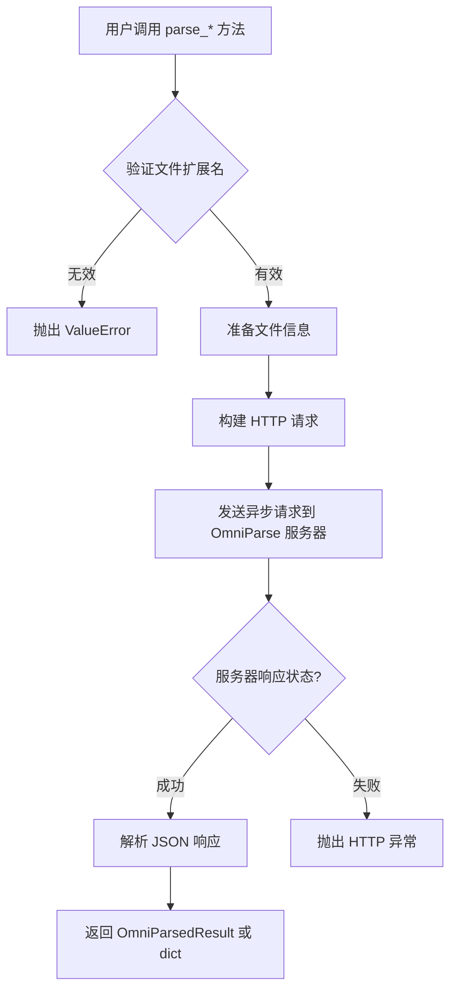
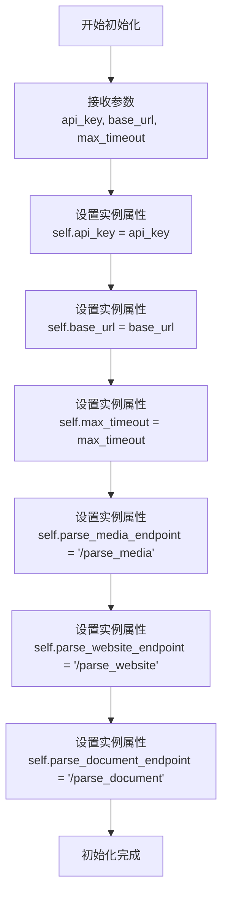
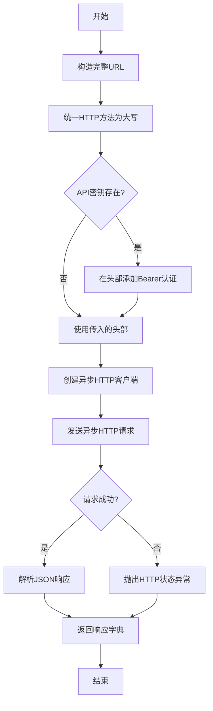
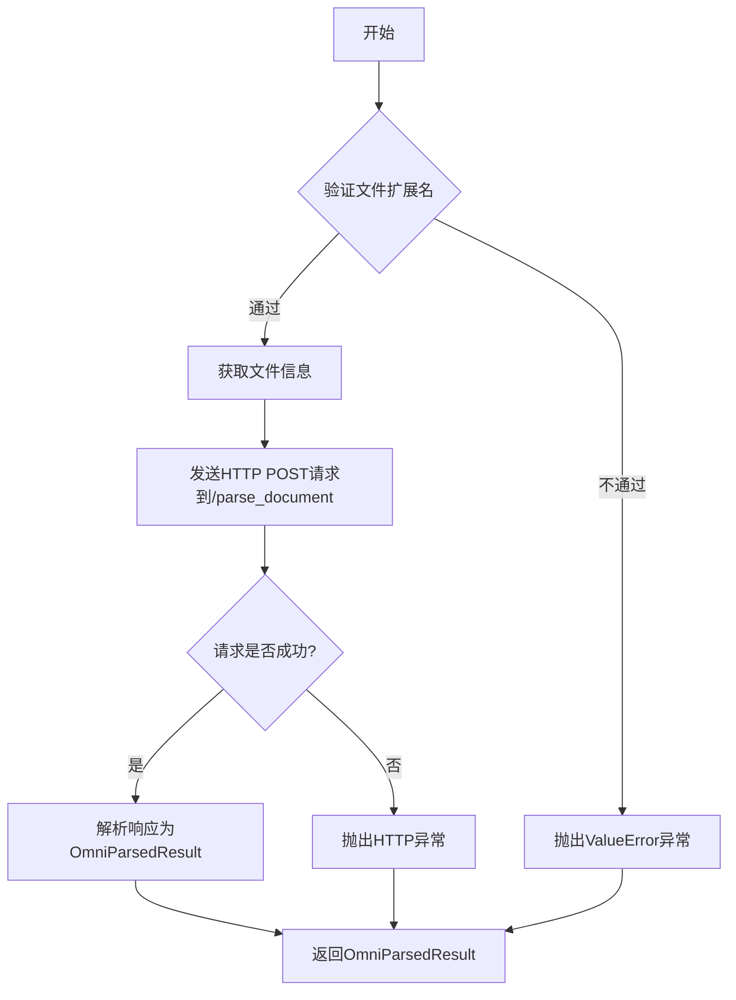
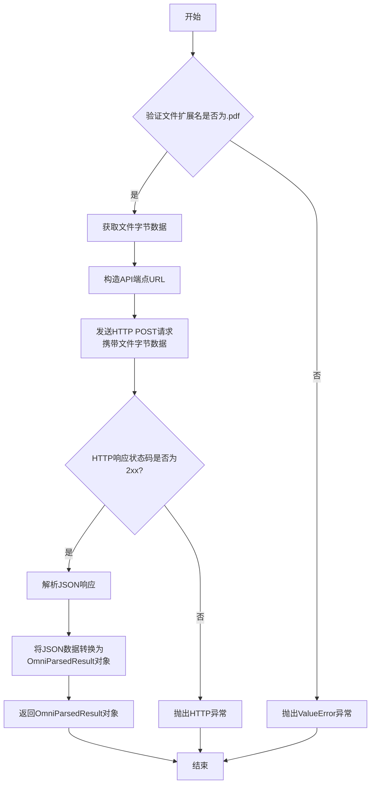
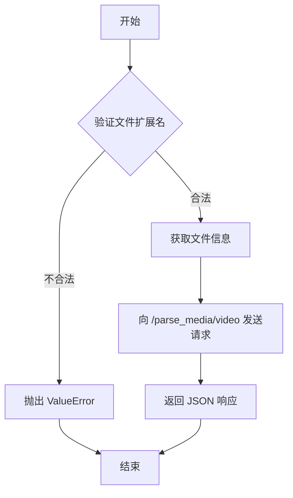
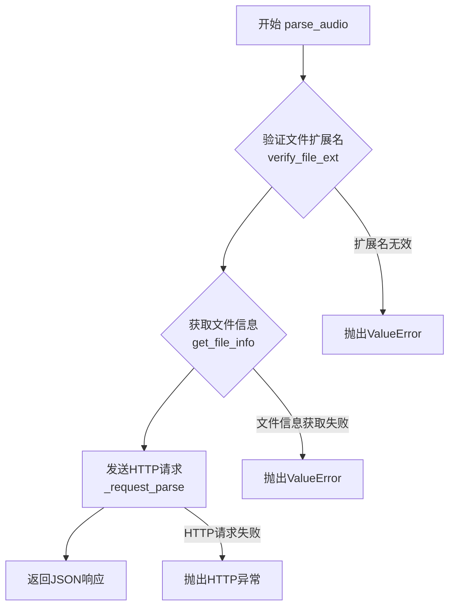

# `.\MetaGPT\metagpt\utils\omniparse_client.py` 详细设计文档

该代码实现了一个名为 OmniParseClient 的客户端类，用于与 OmniParse 服务器进行交互，以解析多种类型的媒体和文档文件。它支持通过 HTTP 请求上传文件（包括文档、音频、视频），并处理服务器返回的解析结果。客户端提供了文件扩展名验证、文件信息准备和异步 HTTP 请求等功能，旨在为上层应用提供一个统一的接口来处理不同格式的文件解析任务。

## 整体流程



## 类结构

```
OmniParseClient
├── 类字段
│   ├── ALLOWED_DOCUMENT_EXTENSIONS
│   ├── ALLOWED_AUDIO_EXTENSIONS
│   └── ALLOWED_VIDEO_EXTENSIONS
├── 实例字段
│   ├── api_key
│   ├── base_url
│   ├── max_timeout
│   ├── parse_media_endpoint
│   ├── parse_website_endpoint
│   └── parse_document_endpoint
├── 实例方法
│   ├── __init__
│   ├── _request_parse
│   ├── parse_document
│   ├── parse_pdf
│   ├── parse_video
│   └── parse_audio
└── 静态方法
    ├── verify_file_ext
    └── get_file_info
```

## 全局变量及字段


### `OmniParseClient.ALLOWED_DOCUMENT_EXTENSIONS`
    
支持的文档文件扩展名集合，包括.pdf, .ppt, .pptx, .doc, .docx。

类型：`set[str]`
    


### `OmniParseClient.ALLOWED_AUDIO_EXTENSIONS`
    
支持的音频文件扩展名集合，包括.mp3, .wav, .aac。

类型：`set[str]`
    


### `OmniParseClient.ALLOWED_VIDEO_EXTENSIONS`
    
支持的视频文件扩展名集合，包括.mp4, .mkv, .avi, .mov。

类型：`set[str]`
    


### `OmniParseClient.api_key`
    
用于API身份验证的密钥，可选。

类型：`str`
    


### `OmniParseClient.base_url`
    
OmniParse服务器的基础URL，默认为http://localhost:8000。

类型：`str`
    


### `OmniParseClient.max_timeout`
    
HTTP请求的最大超时时间（秒）。

类型：`int`
    


### `OmniParseClient.parse_media_endpoint`
    
解析媒体文件（音频/视频）的API端点路径。

类型：`str`
    


### `OmniParseClient.parse_website_endpoint`
    
解析网站的API端点路径。

类型：`str`
    


### `OmniParseClient.parse_document_endpoint`
    
解析文档文件的API端点路径。

类型：`str`
    
    

## 全局函数及方法

### `OmniParseClient.__init__`

初始化 OmniParseClient 实例，设置与 OmniParse 服务器交互所需的基本配置，包括 API 密钥、服务器基础 URL 和请求超时时间。

参数：

- `api_key`：`str`，用于 API 身份验证的密钥，默认为 `None`。
- `base_url`：`str`，OmniParse 服务器的基地址，默认为 `"http://localhost:8000"`。
- `max_timeout`：`int`，HTTP 请求的最大超时时间（秒），默认为 `120`。

返回值：`None`，此方法为构造函数，不返回任何值。

#### 流程图



#### 带注释源码

```python
def __init__(self, api_key: str = None, base_url: str = "http://localhost:8000", max_timeout: int = 120):
    """
    Args:
        api_key: Default None, can be used for authentication later.
        base_url: Base URL for the API.
        max_timeout: Maximum request timeout in seconds.
    """
    # 将传入的API密钥存储为实例属性，用于后续请求的身份验证
    self.api_key = api_key
    # 将传入的服务器基地址存储为实例属性，用于构建完整的API请求URL
    self.base_url = base_url
    # 将传入的超时时间存储为实例属性，用于配置HTTP客户端的请求超时
    self.max_timeout = max_timeout

    # 定义并存储用于解析媒体的API端点路径
    self.parse_media_endpoint = "/parse_media"
    # 定义并存储用于解析网站的API端点路径
    self.parse_website_endpoint = "/parse_website"
    # 定义并存储用于解析文档的API端点路径
    self.parse_document_endpoint = "/parse_document"
```

### `OmniParseClient._request_parse`

该方法是一个异步的HTTP请求封装函数，用于向指定的OmniParse API端点发送请求，并返回解析后的JSON响应数据。它支持多种HTTP方法、文件上传、参数传递和自定义头部，并集成了认证和超时处理。

参数：

- `endpoint`：`str`，API端点路径。
- `method`：`str`，可选，HTTP方法，默认为“POST”。
- `files`：`dict`，可选，要包含在请求中的文件。
- `params`：`dict`，可选，查询字符串参数。
- `data`：`dict`，可选，要包含在请求体中的表单数据。
- `json`：`dict`，可选，要包含在请求体中的JSON数据。
- `headers`：`dict`，可选，要包含在请求中的HTTP头部。
- `**kwargs`：`Any`，传递给`httpx.AsyncClient.request()`的额外关键字参数。

返回值：`dict`，JSON响应数据。

#### 流程图



#### 带注释源码

```python
async def _request_parse(
    self,
    endpoint: str,
    method: str = "POST",
    files: dict = None,
    params: dict = None,
    data: dict = None,
    json: dict = None,
    headers: dict = None,
    **kwargs,
) -> dict:
    """
    Request OmniParse API to parse a document.

    Args:
        endpoint (str): API endpoint.
        method (str, optional): HTTP method to use. Default is "POST".
        files (dict, optional): Files to include in the request.
        params (dict, optional): Query string parameters.
        data (dict, optional): Form data to include in the request body.
        json (dict, optional): JSON data to include in the request body.
        headers (dict, optional): HTTP headers to include in the request.
        **kwargs: Additional keyword arguments for httpx.AsyncClient.request()

    Returns:
        dict: JSON response data.
    """
    # 1. 构造完整的请求URL
    url = f"{self.base_url}{endpoint}"
    # 2. 确保HTTP方法为大写
    method = method.upper()
    # 3. 初始化头部字典，如果未传入则使用空字典
    headers = headers or {}
    # 4. 如果存在API密钥，则构造Bearer认证头部
    _headers = {"Authorization": f"Bearer {self.api_key}"} if self.api_key else {}
    # 5. 将认证头部更新到请求头部中
    headers.update(**_headers)
    # 6. 创建异步HTTP客户端上下文
    async with httpx.AsyncClient() as client:
        # 7. 发送异步HTTP请求，包含所有参数和超时设置
        response = await client.request(
            url=url,
            method=method,
            files=files,
            params=params,
            json=json,
            data=data,
            headers=headers,
            timeout=self.max_timeout,
            **kwargs,
        )
        # 8. 检查HTTP响应状态，如果失败则抛出异常
        response.raise_for_status()
        # 9. 将响应体解析为JSON字典并返回
        return response.json()
```

### `OmniParseClient.parse_document`

该方法用于解析文档类型的数据（支持 ".pdf", ".ppt", ".pptx", ".doc", ".docx"）。它首先验证文件扩展名，然后获取文件信息（如文件名、字节数据和MIME类型），最后通过向OmniParse服务器的`/parse_document`端点发送HTTP POST请求来解析文档，并将响应数据封装为`OmniParsedResult`对象返回。

参数：

- `file_input`：`Union[str, bytes, Path]`，文件路径、字节数据或Path对象，表示待解析的文档。
- `bytes_filename`：`str`，当`file_input`为字节数据时，用于指定文件名，以帮助确定HTTP请求中的MIME类型。

返回值：`OmniParsedResult`，文档解析的结果，包含解析后的结构化数据。

#### 流程图



#### 带注释源码

```python
async def parse_document(self, file_input: Union[str, bytes, Path], bytes_filename: str = None) -> OmniParsedResult:
    """
    解析文档类型的数据（支持 ".pdf", ".ppt", ".pptx", ".doc", ".docx"）。

    参数：
        file_input: 文件路径或文件字节数据。
        bytes_filename: 字节数据的文件名，用于确定HTTP请求中的MIME类型。

    抛出：
        ValueError: 如果文件扩展名不被允许。

    返回：
        OmniParsedResult: 文档解析的结果。
    """
    # 验证文件扩展名是否在允许的文档扩展名集合中
    self.verify_file_ext(file_input, self.ALLOWED_DOCUMENT_EXTENSIONS, bytes_filename)
    # 获取文件信息（文件名、字节数据、MIME类型）
    file_info = await self.get_file_info(file_input, bytes_filename)
    # 发送HTTP POST请求到/parse_document端点，上传文件
    resp = await self._request_parse(self.parse_document_endpoint, files={"file": file_info})
    # 将响应数据解析为OmniParsedResult对象
    data = OmniParsedResult(**resp)
    return data
```

### `OmniParseClient.parse_pdf`

该方法用于解析PDF文档。它首先验证输入文件的扩展名是否为`.pdf`，然后获取文件的字节数据，最后通过HTTP请求调用OmniParse服务器的特定端点来解析PDF，并将响应结果封装为`OmniParsedResult`对象返回。

参数：

- `file_input`：`Union[str, bytes, Path]`，PDF文件的路径、字节数据或Path对象。

返回值：`OmniParsedResult`，解析PDF文档后的结果对象。

#### 流程图



#### 带注释源码

```python
async def parse_pdf(self, file_input: Union[str, bytes, Path]) -> OmniParsedResult:
    """
    Parse pdf document.

    Args:
        file_input: File path or file byte data.

    Raises:
        ValueError: If the file extension is not allowed.

    Returns:
        OmniParsedResult: The result of the pdf parsing.
    """
    # 1. 验证文件扩展名是否为.pdf
    self.verify_file_ext(file_input, {".pdf"})
    # 2. 获取文件的字节数据（only_bytes=True表示只返回字节，不包含文件名和MIME类型）
    file_info = await self.get_file_info(file_input, only_bytes=True)
    # 3. 构造PDF解析专用的API端点URL
    endpoint = f"{self.parse_document_endpoint}/pdf"
    # 4. 发送HTTP POST请求到OmniParse服务器，携带文件字节数据
    resp = await self._request_parse(endpoint=endpoint, files={"file": file_info})
    # 5. 将服务器返回的JSON数据转换为OmniParsedResult对象
    data = OmniParsedResult(**resp)
    # 6. 返回解析结果
    return data
```

### `OmniParseClient.parse_video`

该方法用于解析视频文件，支持 `.mp4`、`.mkv`、`.avi`、`.mov` 格式。它首先验证文件扩展名，然后获取文件信息（文件名、字节数据、MIME类型），最后向 OmniParse 服务器的 `/parse_media/video` 端点发送请求以解析视频，并返回原始的 JSON 响应数据。

参数：
- `file_input`：`Union[str, bytes, Path]`，视频文件的路径、字节数据或 Path 对象。
- `bytes_filename`：`str`，当 `file_input` 为字节数据时，用于指定文件名以确定 MIME 类型，可选。

返回值：`dict`，OmniParse 服务器返回的原始 JSON 响应数据。

#### 流程图



#### 带注释源码

```python
async def parse_video(self, file_input: Union[str, bytes, Path], bytes_filename: str = None) -> dict:
    """
    Parse video-type data (supports ".mp4", ".mkv", ".avi", ".mov").

    Args:
        file_input: File path or file byte data.
        bytes_filename: Filename for byte data, useful for determining MIME type for the HTTP request.

    Raises:
        ValueError: If the file extension is not allowed.

    Returns:
        dict: JSON response data.
    """
    # 1. 验证文件扩展名是否在允许的视频扩展名集合中
    self.verify_file_ext(file_input, self.ALLOWED_VIDEO_EXTENSIONS, bytes_filename)
    # 2. 获取文件信息（文件名、字节数据、MIME类型）
    file_info = await self.get_file_info(file_input, bytes_filename)
    # 3. 向服务器端点发送请求并返回原始 JSON 响应
    return await self._request_parse(f"{self.parse_media_endpoint}/video", files={"file": file_info})
```

### `OmniParseClient.parse_audio`

该方法用于解析音频文件（支持 .mp3, .wav, .aac 格式）。它首先验证文件扩展名，然后获取文件信息（包括文件名、字节数据和MIME类型），最后向OmniParse服务器的`/parse_media/audio`端点发送HTTP POST请求以执行解析，并返回服务器的JSON响应。

参数：

- `file_input`：`Union[str, bytes, Path]`，音频文件的路径、字节数据或Path对象。
- `bytes_filename`：`str`，可选参数，当`file_input`为字节数据时，用于指定文件名以确定MIME类型。

返回值：`dict`，OmniParse服务器返回的JSON响应数据。

#### 流程图



#### 带注释源码

```python
async def parse_audio(self, file_input: Union[str, bytes, Path], bytes_filename: str = None) -> dict:
    """
    Parse audio-type data (supports ".mp3", ".wav", ".aac").

    Args:
        file_input: File path or file byte data.
        bytes_filename: Filename for byte data, useful for determining MIME type for the HTTP request.

    Raises:
        ValueError: If the file extension is not allowed.

    Returns:
        dict: JSON response data.
    """
    # 1. 验证文件扩展名是否在允许的音频扩展名集合中
    self.verify_file_ext(file_input, self.ALLOWED_AUDIO_EXTENSIONS, bytes_filename)
    # 2. 获取文件信息，返回一个三元组 (filename, file_bytes, mime_type)
    file_info = await self.get_file_info(file_input, bytes_filename)
    # 3. 向 /parse_media/audio 端点发送POST请求，携带文件信息，并返回JSON响应
    return await self._request_parse(f"{self.parse_media_endpoint}/audio", files={"file": file_info})
```

### `OmniParseClient.verify_file_ext`

验证文件扩展名是否在允许的集合中。如果文件输入是字符串或`Path`对象，则直接检查其扩展名；如果文件输入是字节数据，则使用提供的`bytes_filename`参数来获取扩展名进行验证。如果扩展名不在允许的集合中，则抛出`ValueError`异常。如果无法确定要验证的文件路径（例如，传入的是字节数据但没有提供`bytes_filename`），则静默返回，不进行验证。

参数：

- `file_input`：`Union[str, bytes, Path]`，文件路径、字节数据或`Path`对象。
- `allowed_file_extensions`：`set`，允许的文件扩展名集合。
- `bytes_filename`：`str`，当`file_input`为字节数据时，用于验证的文件名。

返回值：`None`，无返回值。如果验证失败，抛出`ValueError`异常。

#### 流程图

```mermaid
flowchart TD
    A[开始] --> B{file_input 类型?}
    B -->|str 或 Path| C[verify_file_path = str(file_input)]
    B -->|bytes 且 bytes_filename 存在| D[verify_file_path = bytes_filename]
    B -->|其他情况| E[静默返回]
    C --> F{verify_file_path 存在?}
    D --> F
    F -->|是| G[获取小写扩展名 file_ext]
    F -->|否| E
    G --> H{file_ext 在 allowed_file_extensions 中?}
    H -->|是| I[验证通过，结束]
    H -->|否| J[抛出 ValueError 异常]
```

#### 带注释源码

```python
@staticmethod
def verify_file_ext(file_input: Union[str, bytes, Path], allowed_file_extensions: set, bytes_filename: str = None):
    """
    验证文件扩展名。

    Args:
        file_input: 文件路径或文件字节数据。
        allowed_file_extensions: 允许的文件扩展名集合。
        bytes_filename: 当 `file_input` 是字节数据时，用于验证的文件名。

    Raises:
        ValueError: 如果文件扩展名不被允许。

    Returns:
    """
    # 步骤1: 确定用于验证的文件路径
    verify_file_path = None
    if isinstance(file_input, (str, Path)):
        # 情况1: 输入是字符串或Path对象，直接转换为字符串路径
        verify_file_path = str(file_input)
    elif isinstance(file_input, bytes) and bytes_filename:
        # 情况2: 输入是字节数据且提供了文件名，使用提供的文件名
        verify_file_path = bytes_filename

    # 步骤2: 如果无法确定验证路径，则静默返回（例如，只有字节数据但未提供文件名）
    if not verify_file_path:
        # 如果只有字节数据被提供，则不进行验证
        return

    # 步骤3: 从路径中提取小写的文件扩展名
    file_ext = Path(verify_file_path).suffix.lower()
    # 步骤4: 检查扩展名是否在允许的集合中
    if file_ext not in allowed_file_extensions:
        # 步骤5: 如果不在，抛出异常
        raise ValueError(f"Not allowed {file_ext} File extension must be one of {allowed_file_extensions}")
```

### `OmniParseClient.get_file_info`

该方法用于根据输入的文件路径或字节数据，获取文件信息。根据参数 `only_bytes` 决定返回纯字节数据还是一个包含文件名、文件字节数据和 MIME 类型的元组。它主要用于为后续的 API 请求准备文件数据。

参数：

- `file_input`：`Union[str, bytes, Path]`，文件路径或文件的字节数据。
- `bytes_filename`：`str`，当 `file_input` 为字节数据时，用于指定文件名，有助于确定 MIME 类型。
- `only_bytes`：`bool`，是否仅返回字节数据。默认为 `False`，返回元组。

返回值：`Union[bytes, tuple]`，如果 `only_bytes` 为 `True`，则返回字节数据；否则返回一个元组 `(filename, file_bytes, mime_type)`。

#### 流程图

```mermaid
flowchart TD
    A[开始] --> B{file_input 类型?}
    B -->|str 或 Path| C[从路径读取文件名和字节数据]
    C --> D{only_bytes?}
    D -->|是| E[返回 file_bytes]
    D -->|否| F[猜测 MIME 类型]
    F --> G[返回 (filename, file_bytes, mime_type)]
    B -->|bytes| H{only_bytes?}
    H -->|是| I[返回 file_input]
    H -->|否| J{bytes_filename 是否提供?}
    J -->|是| K[猜测 MIME 类型]
    K --> L[返回 (bytes_filename, file_input, mime_type)]
    J -->|否| M[抛出 ValueError]
    B -->|其他类型| N[抛出 ValueError]
    E --> O[结束]
    G --> O
    I --> O
    L --> O
    M --> O
    N --> O
```

#### 带注释源码

```python
@staticmethod
async def get_file_info(
    file_input: Union[str, bytes, Path],
    bytes_filename: str = None,
    only_bytes: bool = False,
) -> Union[bytes, tuple]:
    """
    Get file information.

    Args:
        file_input: File path or file byte data.
        bytes_filename: Filename to use when uploading byte data, useful for determining MIME type.
        only_bytes: Whether to return only byte data. Default is False, which returns a tuple.

    Raises:
        ValueError: If bytes_filename is not provided when file_input is bytes or if file_input is not a valid type.

    Notes:
        Since `parse_document`,`parse_video`, `parse_audio` supports parsing various file types,
        the MIME type of the file must be specified when uploading.

    Returns: [bytes, tuple]
        Returns bytes if only_bytes is True, otherwise returns a tuple (filename, file_bytes, mime_type).
    """
    # 处理输入为文件路径（字符串或 Path 对象）的情况
    if isinstance(file_input, (str, Path)):
        # 从路径中提取文件名
        filename = Path(file_input).name
        # 异步读取文件的二进制数据
        file_bytes = await aread_bin(file_input)

        # 如果只需要字节数据，直接返回
        if only_bytes:
            return file_bytes

        # 根据文件路径猜测 MIME 类型
        mime_type = mimetypes.guess_type(file_input)[0]
        # 返回包含文件名、字节数据和 MIME 类型的元组
        return filename, file_bytes, mime_type
    # 处理输入为字节数据的情况
    elif isinstance(file_input, bytes):
        # 如果只需要字节数据，直接返回
        if only_bytes:
            return file_input
        # 如果不需要只返回字节，但未提供文件名，则抛出异常
        if not bytes_filename:
            raise ValueError("bytes_filename must be set when passing bytes")

        # 根据提供的文件名猜测 MIME 类型
        mime_type = mimetypes.guess_type(bytes_filename)[0]
        # 返回包含提供的文件名、字节数据和 MIME 类型的元组
        return bytes_filename, file_input, mime_type
    # 如果输入类型无效，抛出异常
    else:
        raise ValueError("file_input must be a string (file path) or bytes.")
```

## 关键组件


### 文件类型验证与扩展名管理

通过静态类变量 `ALLOWED_DOCUMENT_EXTENSIONS`、`ALLOWED_AUDIO_EXTENSIONS`、`ALLOWED_VIDEO_EXTENSIONS` 和静态方法 `verify_file_ext` 来定义和验证客户端支持处理的文件类型，确保请求发送前文件格式的合规性。

### 统一HTTP请求处理

通过私有方法 `_request_parse` 封装了对 OmniParse 服务器的异步 HTTP 请求，统一处理 URL 拼接、认证头添加、超时设置和响应状态检查，为所有具体的解析方法（如 `parse_document`）提供底层网络通信支持。

### 多格式文件输入适配

通过静态方法 `get_file_info` 处理不同类型的文件输入（文件路径字符串、Path对象、字节数据），并统一转换为适合 HTTP 文件上传的格式（字节流或包含文件名、字节流、MIME类型的元组），实现了对上层解析方法的透明输入支持。

### 具体媒体解析接口

提供 `parse_document`、`parse_pdf`、`parse_video`、`parse_audio` 等面向特定媒体类型的高层解析方法。这些方法组合了文件验证、信息提取和网络请求，并返回结构化的解析结果（如 `OmniParsedResult`）或原始 JSON 数据，是客户端的主要功能入口。


## 问题及建议


### 已知问题

-   **API密钥处理不一致**：`__init__`方法允许`api_key`为`None`，但在`_request_parse`方法中，只有当`self.api_key`存在时才会添加`Authorization`头。如果服务端需要认证，而客户端未提供`api_key`，请求会因缺少认证头而失败，但错误信息可能不明确（例如返回401状态码），而非在客户端初始化或调用时给出清晰的提示。
-   **错误处理粒度不足**：`_request_parse`方法使用`response.raise_for_status()`，这会将HTTP错误（如4xx, 5xx）转换为`httpx.HTTPStatusError`异常。然而，对于业务逻辑错误（例如，服务器处理文件失败但返回200状态码并包含错误信息的JSON），该方法没有提供额外的解析或处理，调用方需要自行检查返回的JSON字典。
-   **`parse_video`和`parse_audio`方法返回类型不一致**：`parse_document`和`parse_pdf`方法返回`OmniParsedResult`对象，而`parse_video`和`parse_audio`方法直接返回原始的`dict`（JSON响应）。这导致了API使用上的不一致性，调用者需要处理两种不同的返回类型。
-   **文件扩展名验证逻辑存在漏洞**：`verify_file_ext`静态方法在`file_input`为`bytes`类型且未提供`bytes_filename`时，会直接`return`而不进行验证。这意味着如果用户传入纯字节数据但忘记提供文件名，代码将跳过文件扩展名检查，可能将不支持的文件类型发送给服务器，导致服务器端错误。
-   **MIME类型猜测可能不准确**：`get_file_info`方法使用`mimetypes.guess_type`来猜测MIME类型。这个库的猜测基于文件扩展名，如果文件扩展名不正确或缺失，猜测可能失败（返回`None`），这可能影响服务器对文件类型的正确识别。
-   **硬编码的端点路径**：端点路径（如`"/parse_media"`）在`__init__`中硬编码。如果服务器API的路径发生变化，需要修改代码并重新部署，缺乏灵活性。

### 优化建议

-   **增强初始化验证**：在`__init__`方法中，可以增加一个可选参数（如`validate_config: bool = False`）或直接进行逻辑检查，当`api_key`为`None`时记录警告信息，提示用户如果服务需要认证则必须提供`api_key`。
-   **细化错误处理与响应解析**：在`_request_parse`方法中，除了检查HTTP状态码，还可以尝试解析响应JSON，并检查其中是否包含常见的业务错误字段（例如，`error`, `status`, `code`等）。可以定义一个自定义异常类（如`OmniParseAPIError`）来封装HTTP错误和业务逻辑错误，提供更清晰的错误上下文。
-   **统一返回类型**：修改`parse_video`和`parse_audio`方法，使其也返回`OmniParsedResult`对象，与`parse_document`系列方法保持一致。这需要确保服务器对于视频和音频的响应结构能够映射到`OmniParsedResult`模型。如果结构不同，可能需要创建新的数据类或使用更通用的容器。
-   **强化文件验证逻辑**：修改`verify_file_ext`方法，当`file_input`为`bytes`类型且`bytes_filename`为`None`时，应考虑抛出一个`ValueError`，强制调用方为字节数据提供用于验证的文件名，或者明确记录此行为并建议调用方在不确定扩展名时自行承担风险。
-   **提供MIME类型回退机制**：在`get_file_info`方法中，如果`mimetypes.guess_type`返回`None`，可以根据`allowed_file_extensions`（需要作为参数传入或通过上下文判断）设置一个默认的MIME类型（如`‘application/octet-stream’`），或者抛出一个更友好的错误信息。
-   **配置化端点路径**：将端点路径作为类属性或实例属性，并允许通过`__init__`参数或配置文件进行覆盖。例如：`self.parse_document_endpoint = parse_document_endpoint or “/parse_document”`。
-   **增加连接池和超时配置**：目前每次请求都创建新的`httpx.AsyncClient`实例。对于高频调用，可以考虑复用客户端连接池，将`httpx.AsyncClient`实例作为类属性或通过上下文管理器在更长的生命周期内管理。同时，可以为不同的操作（连接、读取）设置更细粒度的超时。
-   **补充类型注解**：`_request_parse`方法的`**kwargs`参数可以添加更具体的类型提示（如`httpx.RequestKwargs`）。`parse_video`和`parse_audio`的返回类型应明确为`dict`，或者如前所述，改为`OmniParsedResult`。
-   **添加日志记录**：在关键步骤（如开始解析、请求发送、收到响应、遇到错误）添加日志记录，便于调试和监控。


## 其它


### 设计目标与约束

本客户端的设计目标是提供一个简洁、类型安全且易于使用的接口，用于与OmniParse服务器进行交互，以解析文档、音频和视频文件。主要约束包括：
1.  **向后兼容性**：`parse_document`、`parse_audio`、`parse_video`方法需支持多种文件格式，并正确设置MIME类型。
2.  **灵活性**：支持通过文件路径、`Path`对象或原始字节数据作为输入，以适应不同的使用场景。
3.  **错误处理**：在客户端进行初步的文件类型验证，避免向服务器发送无效请求。
4.  **性能**：使用异步HTTP客户端（`httpx.AsyncClient`）以提高I/O密集型操作的效率。
5.  **安全性**：支持通过API密钥进行身份验证。

### 错误处理与异常设计

代码采用了分层的错误处理策略：
1.  **输入验证**：`verify_file_ext`静态方法在调用具体解析方法前，验证文件扩展名是否在允许的集合内。若不符合，则抛出`ValueError`。
2.  **参数验证**：`get_file_info`方法检查`file_input`参数类型。当输入为字节数据且未提供`bytes_filename`时，抛出`ValueError`。
3.  **HTTP请求错误**：`_request_parse`方法调用`response.raise_for_status()`，当HTTP响应状态码为4xx或5xx时，会抛出`httpx.HTTPStatusError`异常，由调用者捕获和处理。
4.  **数据反序列化**：`parse_document`和`parse_pdf`方法在获取JSON响应后，尝试使用`OmniParsedResult(**resp)`进行反序列化。若`resp`数据结构与`OmniParsedResult`不匹配，将抛出`pydantic.ValidationError`。

### 数据流与状态机

本客户端不维护复杂的内部状态，其数据流是线性的、无状态的请求-响应模式：
1.  **输入**：用户调用一个公共解析方法（如`parse_document`），传入文件数据。
2.  **预处理**：方法内部调用`verify_file_ext`进行格式校验，然后调用`get_file_info`将输入统一转换为适合HTTP传输的格式（字节或包含元信息的元组）。
3.  **网络请求**：预处理后的数据通过`_request_parse`方法发送到指定的OmniParse服务器端点。
4.  **响应处理**：服务器返回JSON响应。对于文档和PDF解析，响应被反序列化为`OmniParsedResult`对象；对于音视频解析，直接返回原始的JSON字典。
5.  **输出**：将解析结果（`OmniParsedResult`对象或字典）返回给调用者。
整个过程不涉及状态转换，每个方法调用都是独立的。

### 外部依赖与接口契约

1.  **外部库依赖**：
    *   `httpx`：用于发起异步HTTP请求。
    *   `mimetypes`（Python标准库）：用于根据文件名猜测MIME类型。
    *   `metagpt.utils.common.aread_bin`：用于异步读取文件为字节数据。
    *   `metagpt.rag.schema.OmniParsedResult`：定义了文档解析响应的数据模型。

2.  **接口契约（与OmniParse服务器）**：
    *   **基础URL**：通过`base_url`配置，默认为`"http://localhost:8000"`。
    *   **认证**：通过`Authorization: Bearer {api_key}`请求头进行认证（如果提供了`api_key`）。
    *   **端点**：
        *   文档解析：`POST /parse_document`， 支持多种格式。
        *   PDF解析：`POST /parse_document/pdf`， 仅支持PDF。
        *   视频解析：`POST /parse_media/video`。
        *   音频解析：`POST /parse_media/audio`。
    *   **请求格式**：使用`multipart/form-data`格式上传文件，文件字段名为`"file"`。对于需要MIME类型的方法，文件信息以`(filename, file_bytes, mime_type)`三元组形式提供。
    *   **响应格式**：服务器应返回JSON格式的响应。对于文档/PDF解析，其结构必须与`OmniParsedResult`模型兼容。
    *   **超时**：请求超时时间由`max_timeout`参数控制。

    