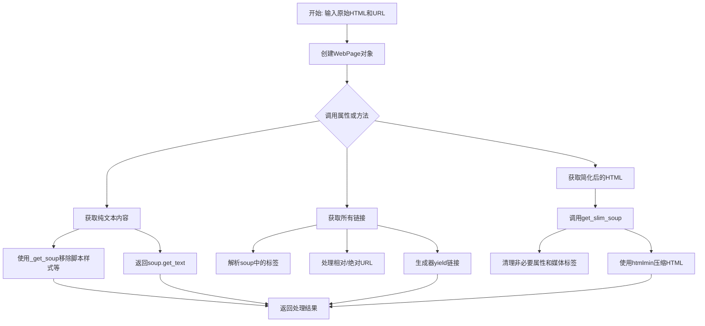
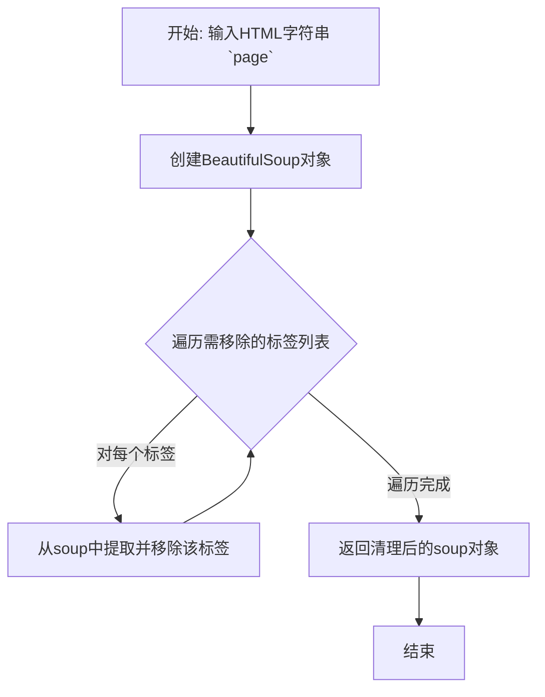
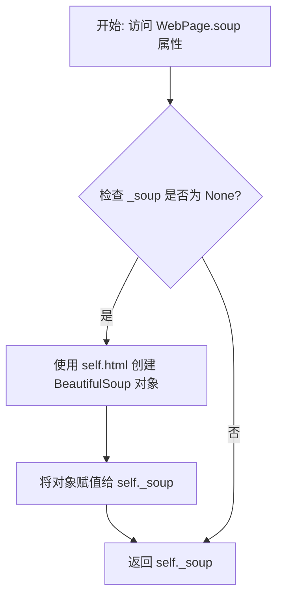
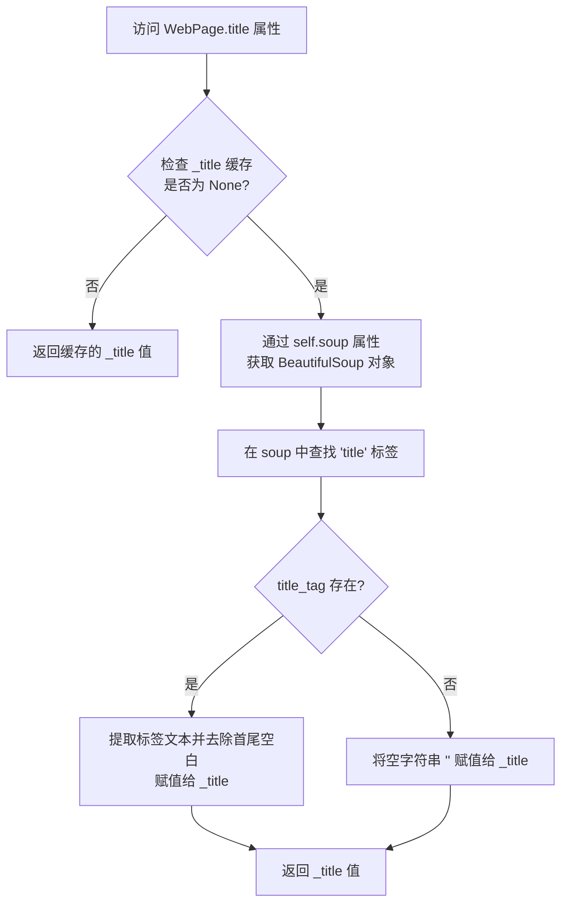

# `.\MetaGPT\metagpt\utils\parse_html.py` 详细设计文档

该代码定义了一个用于处理和解析网页内容的工具集，核心功能是封装网页的HTML、文本和URL信息，并提供提取链接、简化HTML结构、获取纯文本内容等方法，以便于进行网页内容分析和数据清洗。

## 整体流程



## 类结构

```
BaseModel (Pydantic基类)
└── WebPage (网页数据模型)

全局函数
├── get_html_content
├── _get_soup
└── simplify_html
```

## 全局变量及字段


### `WebPage.inner_text`
    
网页的纯文本内容，已去除HTML标签和空白字符

类型：`str`
    


### `WebPage.html`
    
网页的原始HTML源代码

类型：`str`
    


### `WebPage.url`
    
网页的完整URL地址，用于链接解析和相对路径处理

类型：`str`
    


### `WebPage._soup`
    
BeautifulSoup解析对象的私有缓存，延迟初始化以提高性能

类型：`Optional[BeautifulSoup]`
    


### `WebPage._title`
    
网页标题的私有缓存，延迟初始化以提高性能

类型：`Optional[str]`
    
    

## 全局函数及方法


### `get_html_content`

该函数接收一个HTML字符串和一个基础URL字符串，使用BeautifulSoup解析HTML，移除所有非内容标签（如样式、脚本、文档声明、头部、标题、页脚），然后提取并返回页面中所有可见文本内容。

参数：

-  `page`：`str`，包含HTML内容的字符串
-  `base`：`str`，用于解析相对URL的基础URL字符串（注意：在此函数实现中，`base`参数未被使用，可能是一个预留接口或设计上的冗余）

返回值：`str`，从HTML中提取并去除首尾空格的纯文本内容

#### 流程图

```mermaid
flowchart TD
    A[开始] --> B[接收参数 page, base]
    B --> C[调用内部函数 _get_soup(page)]
    C --> D[创建BeautifulSoup对象]
    D --> E[遍历并移除 style, script, [document], head, title, footer 标签]
    E --> F[返回清理后的soup对象]
    F --> G[调用soup.get_text(strip=True)]
    G --> H[返回提取的纯文本]
    H --> I[结束]
```

#### 带注释源码

```python
def get_html_content(page: str, base: str):
    # 调用内部辅助函数 _get_soup 来解析并清理HTML
    # 该函数会移除样式、脚本等非内容标签
    soup = _get_soup(page)

    # 使用BeautifulSoup的get_text方法提取所有文本
    # strip=True 参数会移除文本前后的空白字符
    return soup.get_text(strip=True)
```


### `_get_soup`

该函数是一个辅助函数，用于从给定的HTML字符串中创建一个经过清理的BeautifulSoup对象。其核心功能是移除HTML中通常不包含可见文本内容的标签（如样式、脚本、文档声明、头部、标题和页脚），从而得到一个更“干净”的、专注于页面主体内容的解析树。

参数：

-  `page`：`str`，包含原始HTML内容的字符串。

返回值：`BeautifulSoup`，一个经过清理的BeautifulSoup对象，移除了指定的非内容标签。

#### 流程图



#### 带注释源码

```python
def _get_soup(page: str):
    # 1. 使用html.parser解析器，将输入的HTML字符串`page`初始化为一个BeautifulSoup对象。
    soup = BeautifulSoup(page, "html.parser")
    # 2. 为了提高后续文本提取的效率和质量，移除那些通常不包含可见文本的标签。
    #    这些标签包括：`style`, `script`, `[document]`, `head`, `title`, `footer`。
    #    `[document]` 是一个特殊的CSS选择器，用于匹配文档类型声明。
    #    `s.extract()` 方法会将这些标签从解析树中永久移除。
    for s in soup(["style", "script", "[document]", "head", "title", "footer"]):
        s.extract()

    # 3. 返回清理后的BeautifulSoup对象。
    return soup
```


### `simplify_html`

该函数接收原始HTML字符串、其对应的URL以及一个可选标志，通过创建一个`WebPage`模型实例来清理和简化HTML内容，最后使用`htmlmin`库进行最小化处理并返回结果。

参数：

-  `html`：`str`，需要被简化的原始HTML字符串。
-  `url`：`str`，与HTML内容相关联的URL，用于处理相对链接。
-  `keep_links`：`bool`，可选参数，默认为`False`。指示在简化过程中是否保留`<a>`标签的`href`属性。

返回值：`str`，经过清理、简化并最小化后的HTML字符串。

#### 流程图

```mermaid
flowchart TD
    A[开始: simplify_html(html, url, keep_links)] --> B[创建WebPage实例]
    B --> C[调用实例方法 get_slim_soup(keep_links)]
    C --> D{keep_links 为 True?}
    D -- 是 --> E[保留 'href' 属性]
    D -- 否 --> F[不保留 'href' 属性]
    E --> G[清理HTML<br>移除非保留属性<br>移除指定标签]
    F --> G
    G --> H[将BeautifulSoup对象解码为字符串]
    H --> I[使用htmlmin.minify最小化HTML]
    I --> J[返回简化后的HTML字符串]
    J --> K[结束]
```

#### 带注释源码

```python
def simplify_html(html: str, url: str, keep_links: bool = False):
    # 1. 创建一个WebPage模型实例，传入原始HTML和URL。
    #    inner_text参数在此处未使用，传入空字符串。
    # 2. 调用实例的get_slim_soup方法，传入keep_links参数。
    #    该方法会清理HTML：移除非必要的标签属性，删除svg/img/video/audio等标签。
    # 3. 将返回的BeautifulSoup对象解码为HTML字符串。
    html = WebPage(inner_text="", html=html, url=url).get_slim_soup(keep_links).decode()
    
    # 使用htmlmin库对清理后的HTML字符串进行最小化处理。
    # remove_comments=True: 移除HTML注释。
    # remove_empty_space=True: 移除不必要的空白字符。
    return htmlmin.minify(html, remove_comments=True, remove_empty_space=True)
```


### `WebPage.soup`

`soup` 是 `WebPage` 类的一个只读属性（property），它实现了对 `BeautifulSoup` 对象的惰性初始化。当首次访问该属性时，它会使用 `html` 字段的内容创建一个 `BeautifulSoup` 解析器对象并缓存起来；后续访问将直接返回已缓存的解析器对象，避免了重复解析 HTML 带来的性能开销。

参数：
-  `self`：`WebPage`，`WebPage` 类的实例。

返回值：`BeautifulSoup`，一个基于 `self.html` 内容初始化的 `BeautifulSoup` 解析器对象，用于后续的 HTML 元素查找和操作。

#### 流程图



#### 带注释源码

```python
    @property
    def soup(self) -> BeautifulSoup:
        # 检查私有属性 _soup 是否已被初始化
        if self._soup is None:
            # 如果未初始化，则使用 self.html 字符串和 'html.parser' 解析器
            # 创建一个 BeautifulSoup 对象
            self._soup = BeautifulSoup(self.html, "html.parser")
        # 返回已缓存的 BeautifulSoup 对象
        return self._soup
```


### `WebPage.title`

`WebPage` 类的 `title` 属性。它是一个只读属性，用于从网页的 HTML 内容中提取并返回 `<title>` 标签内的文本。该属性实现了惰性计算和缓存机制，即只在第一次访问时解析 HTML 并提取标题，后续访问直接返回缓存值，以提高性能。

参数：
-  `self`：`WebPage`，`WebPage` 类的实例。

返回值：`str`，网页的标题文本。如果 HTML 中没有 `<title>` 标签，则返回空字符串 `""`。

#### 流程图



#### 带注释源码

```python
    @property
    def title(self):
        # 检查内部缓存 `_title` 是否已计算过。
        # 如果为 None，表示这是第一次访问该属性，需要执行解析。
        if self._title is None:
            # 通过 `self.soup` 属性获取已解析的 BeautifulSoup 对象。
            # `self.soup` 属性本身也实现了惰性加载。
            title_tag = self.soup.find("title")
            # 如果找到了 <title> 标签，提取其文本内容并去除首尾空白字符。
            # 如果没有找到，则将标题设置为空字符串。
            self._title = title_tag.text.strip() if title_tag is not None else ""
        # 返回计算或缓存的标题值。
        return self._title
```


### `WebPage.get_links`

该方法用于从网页的HTML内容中提取所有有效的超链接（`<a>`标签的`href`属性），并将相对URL转换为基于当前页面URL的绝对URL。

参数：
-  `self`：`WebPage`，当前WebPage实例，包含HTML内容和基础URL。

返回值：`Generator[str, None, None]`，一个生成器，依次生成处理后的绝对URL字符串。

#### 流程图

```mermaid
flowchart TD
    A[开始] --> B[遍历soup.find_all('a', href=True)]
    B --> C{获取href值}
    C --> D[解析URL]
    D --> E{是否为相对路径<br>（无scheme但有path）?}
    E -- 是 --> F[使用urljoin拼接绝对URL]
    E -- 否 --> G{是否以http://或https://开头?}
    G -- 是 --> H[使用urljoin处理URL]
    G -- 否 --> I[跳过此链接]
    F --> J[生成(yield) URL]
    H --> J
    I --> B
    B --> K[遍历结束]
    K --> L[结束]
```

#### 带注释源码

```python
def get_links(self) -> Generator[str, None, None]:
    # 遍历HTML文档中所有包含href属性的<a>标签
    for i in self.soup.find_all("a", href=True):
        # 获取链接的原始URL
        url = i["href"]
        # 使用urlparse解析URL，将其拆分为scheme, netloc, path等部分
        result = urlparse(url)
        # 判断是否为相对路径：没有协议(scheme)但有路径(path)
        if not result.scheme and result.path:
            # 使用urljoin将相对URL与当前页面的基础URL(self.url)拼接成绝对URL
            yield urljoin(self.url, url)
        # 判断是否为以http或https开头的绝对URL
        elif url.startswith(("http://", "https://")):
            # 同样使用urljoin处理，确保URL格式正确（例如处理`../`等路径）
            yield urljoin(self.url, url)
    # 方法返回一个生成器，通过yield逐个返回处理后的URL，而不是一次性返回列表，节省内存。
```


### `WebPage.get_slim_soup`

该方法用于对网页的HTML内容进行“瘦身”处理，通过移除不必要的标签和属性，生成一个简化版的BeautifulSoup对象，旨在保留核心结构和特定属性（如`class`、`id`，以及可选的链接`href`），同时移除多媒体和脚本等非文本内容，以优化后续处理或存储。

参数：

-  `keep_links`：`bool`，可选参数，默认为`False`。如果设置为`True`，则在清理元素属性时保留`href`属性；否则仅保留`class`和`id`属性。

返回值：`BeautifulSoup`，返回一个经过清理和简化后的BeautifulSoup对象，其中移除了指定的标签和大部分属性。

#### 流程图

```mermaid
flowchart TD
    A[开始: get_slim_soup(keep_links)] --> B[调用 _get_soup 解析 HTML]
    B --> C{是否保留链接?}
    C -- 是 --> D[keep_attrs = ['class', 'id', 'href']]
    C -- 否 --> E[keep_attrs = ['class', 'id']]
    D --> F[遍历所有HTML元素]
    E --> F
    F --> G[遍历当前元素的所有属性]
    G --> H{属性名是否在<br>keep_attrs列表中?}
    H -- 否 --> I[删除该属性]
    H -- 是 --> J[保留该属性]
    I --> K[继续遍历属性]
    J --> K
    K --> L{是否还有属性未处理?}
    L -- 是 --> G
    L -- 否 --> M[继续遍历元素]
    M --> N{是否还有元素未处理?}
    N -- 是 --> F
    N -- 否 --> O[移除所有'svg', 'img',<br>'video', 'audio'标签]
    O --> P[返回简化后的soup对象]
    P --> Q[结束]
```

#### 带注释源码

```python
def get_slim_soup(self, keep_links: bool = False):
    # 1. 使用内部辅助函数 _get_soup 解析 HTML 字符串，得到一个初始的 BeautifulSoup 对象。
    #    该辅助函数会移除 <style>, <script>, [document], <head>, <title>, <footer> 等标签。
    soup = _get_soup(self.html)

    # 2. 定义需要保留的属性列表。默认保留 'class' 和 'id' 属性。
    keep_attrs = ["class", "id"]
    # 3. 根据传入的 `keep_links` 参数决定是否将 'href' 属性加入保留列表。
    if keep_links:
        keep_attrs.append("href")

    # 4. 遍历 soup 对象中的所有 HTML 元素 (True 匹配所有标签)。
    for i in soup.find_all(True):
        # 5. 遍历当前元素的所有属性名（使用 list(i.attrs) 创建副本，避免在迭代时修改字典出错）。
        for name in list(i.attrs):
            # 6. 检查属性值是否存在且属性名不在保留列表中。
            if i[name] and name not in keep_attrs:
                # 7. 如果满足条件，则从元素中删除该属性。
                del i[name]

    # 8. 遍历并彻底移除所有指定的多媒体和图形标签（svg, img, video, audio）。
    #    decompose() 方法会移除标签及其所有内容。
    for i in soup.find_all(["svg", "img", "video", "audio"]):
        i.decompose()

    # 9. 返回经过属性清理和标签移除后的简化版 BeautifulSoup 对象。
    return soup
```


## 关键组件


### WebPage 数据模型

一个用于封装和操作网页数据的 Pydantic 数据模型，提供了对 HTML 内容进行解析、提取文本和链接等核心功能。

### 惰性解析与缓存

通过 `@property` 装饰器和私有属性（`_soup`, `_title`）实现 BeautifulSoup 对象和页面标题的惰性加载与缓存，仅在首次访问时进行解析，以提高性能。

### 链接提取与规范化

`get_links` 方法从网页中提取所有超链接，并利用 `urljoin` 和 `urlparse` 对相对链接进行规范化处理，确保返回完整的绝对 URL。

### HTML 简化与清理

`get_slim_soup` 方法通过移除非关键属性（如 `style`）、删除指定的媒体标签（如 `img`, `svg`）来清理和简化 HTML 结构，以生成更简洁的文档表示。

### 辅助工具函数

提供 `simplify_html` 和 `get_html_content` 等独立函数，用于执行特定的 HTML 处理任务，如提取纯文本或生成最小化的简化 HTML，增强了代码的模块化和复用性。


## 问题及建议


### 已知问题

-   **`get_links` 方法逻辑不完整**：该方法在解析链接时，仅处理了无协议（`scheme`）的路径和以 `http://` 或 `https://` 开头的绝对 URL。它忽略了其他有效协议（如 `mailto:`、`ftp:`）以及 `javascript:` 等非 HTTP 链接，可能导致链接丢失或包含无效链接。
-   **`get_slim_soup` 方法可能过度清理**：该方法在清理 HTML 时，默认移除了所有 `svg`、`img`、`video`、`audio` 标签。对于需要保留非文本内容（如图表、示意图）的应用场景，这会导致信息丢失。
-   **`_get_soup` 函数清理标签列表可能不全面**：该函数移除了 `style`, `script` 等标签以获取可见文本，但可能遗漏其他包含非正文内容的标签（如 `nav`, `aside`, `header` 等），影响文本提取的纯净度。
-   **`simplify_html` 函数存在冗余步骤**：该函数创建了一个临时的 `WebPage` 实例，但仅使用了其 `get_slim_soup` 方法。直接调用 `_get_soup` 和后续处理逻辑可能更高效，且实例化时传入的 `inner_text` 参数未被使用。
-   **缺乏错误处理**：代码中多处未对可能出现的异常进行处理，例如 `BeautifulSoup` 解析无效 HTML、`urljoin` 处理异常 URL 时可能抛出异常，导致程序意外中断。
-   **`htmlmin` 依赖可能引入风险**：使用 `htmlmin` 进行 HTML 压缩，虽然减少了体积，但可能在某些边缘情况下破坏 HTML 结构或引入难以调试的格式问题，且增加了外部依赖。

### 优化建议

-   **完善链接提取逻辑**：在 `get_links` 方法中，应更精确地过滤链接。建议使用 `urlparse` 检查 `scheme`，只保留 `http` 和 `https` 协议，并忽略 `javascript:`、`mailto:` 等。同时，确保相对路径能正确转换为绝对路径。
-   **使 `get_slim_soup` 方法可配置化**：为该方法的标签清理行为增加参数，允许调用者指定需要保留或移除的标签列表，提高方法的灵活性。
-   **扩展 `_get_soup` 的清理标签列表**：根据目标网站的结构，将常见的非正文容器标签（如 `nav`, `aside`, `header`, `footer`）加入清理列表，以获取更纯净的正文文本。
-   **重构 `simplify_html` 函数**：避免创建不必要的 `WebPage` 实例。可以重构为一个独立的函数，直接接收 HTML 和 URL 参数，调用内部的清理和压缩逻辑。
-   **增加健壮的错误处理**：在关键步骤（如 HTML 解析、URL 拼接）添加 `try-except` 块，捕获 `ValueError`、`AttributeError` 等可能异常，记录日志或返回默认值，确保程序流程的稳定性。
-   **评估 `htmlmin` 的必要性**：评估是否必须进行 HTML 压缩。如果压缩不是核心需求，可以考虑移除 `htmlmin` 依赖，简化项目。如果必需，应确保其处理后的 HTML 在后续使用中不会出现问题，并考虑将其设为可选功能。
-   **考虑性能优化**：`get_slim_soup` 方法中遍历所有标签并操作属性的过程可能对大型 HTML 文档产生性能开销。如果性能是关键考量，可以评估是否有更高效的清理方式。
-   **增强类型注解**：为 `get_slim_soup` 等方法添加更精确的返回值类型注解（如 `-> BeautifulSoup`），并考虑使用 `typing` 模块中的 `List`, `Set` 等来明确集合类型，提升代码可读性和工具支持。


## 其它


### 设计目标与约束

该代码库的核心设计目标是提供一个轻量级、高效的网页内容解析与简化工具。它旨在从原始HTML中提取关键信息（如纯文本、链接、标题），并生成一个经过精简、去除了冗余元素（如脚本、样式、多媒体）和属性的HTML版本，以优化存储或进一步处理。主要约束包括：保持对不完整URL（相对路径）的解析能力，确保内存效率（通过惰性解析和生成器），以及依赖外部库（BeautifulSoup, htmlmin）进行核心的HTML操作，同时通过Pydantic模型确保数据结构的类型安全和验证。

### 错误处理与异常设计

当前代码的异常处理策略较为隐式，主要依赖于底层库（如BeautifulSoup, htmlmin）和Python内置机制（如属性访问、类型转换）抛出的异常。例如，`WebPage.soup`属性在`self.html`无效时，`BeautifulSoup`的构造函数可能抛出解析异常；`urljoin`和`urlparse`在遇到畸形URL时可能抛出`ValueError`。代码本身没有显式的`try-except`块来捕获和处理这些异常，这意味着调用者需要负责处理可能出现的`AttributeError`、`ValueError`或解析错误。这是一种“让错误传播”的策略，适合在调用链上层进行统一错误处理。对于生产环境，建议在关键函数（如`simplify_html`）或调用入口处增加异常捕获和日志记录，以提供更友好的错误信息和系统稳定性。

### 数据流与状态机

数据流始于原始的HTML字符串和URL。`WebPage`类作为核心数据容器和处理器，其状态变化如下：
1.  **初始化**：接收`html`、`url`和`inner_text`（此字段在构造函数中未使用，可能由外部填充）并创建模型实例。`_soup`和`_title`为私有惰性加载状态，初始为`None`。
2.  **惰性解析**：当首次访问`soup`属性时，触发`BeautifulSoup`解析`html`，结果缓存于`_soup`。访问`title`属性时，依赖`soup`属性，从解析后的DOM中查找并缓存标题。
3.  **链接提取**：`get_links`方法依赖于`soup`属性，遍历`<a>`标签，对`href`进行URL规范化（处理相对路径）后通过生成器逐个产出，避免一次性加载所有链接到内存。
4.  **HTML简化**：`get_slim_soup`方法基于原始`html`创建一个新的`soup`对象（通过`_get_soup`），然后通过遍历节点删除非保留属性和特定多媒体标签来简化DOM结构。`simplify_html`函数封装此过程，并最终使用`htmlmin`进行最小化输出。
全局函数`get_html_content`和`_get_soup`提供辅助的数据提取和预处理功能，是数据流中的纯函数环节。

### 外部依赖与接口契约

*   **BeautifulSoup (`bs4`)**：核心依赖，用于HTML解析、DOM遍历和节点操作。接口契约：输入为HTML字符串，输出为可遍历的`soup`对象。代码假设其解析行为符合预期。
*   **htmlmin**：用于压缩简化后的HTML字符串，移除注释和空白。接口契约：输入为HTML字符串，输出为最小化的HTML字符串。
*   **Pydantic**：用于`WebPage`类的数据验证和序列化。接口契约：确保`inner_text`、`html`、`url`字段的类型（字符串），并通过`PrivateAttr`管理内部状态。
*   **urllib.parse (`urljoin`, `urlparse`)**：用于URL的解析和拼接。接口契约：遵循RFC标准处理URL。
*   **typing**：用于类型注解，提高代码可读性和IDE支持，属于开发期依赖。
这些依赖的版本和API稳定性会直接影响本代码库的功能。代码没有定义对它们版本的具体约束（如`requirements.txt`），这在项目化部署时需要注意。

### 性能考量

1.  **内存效率**：`get_links`方法使用生成器，适合处理包含大量链接的页面，避免一次性生成完整列表。`_soup`和`_title`的惰性加载也避免了不必要的解析开销。
2.  **计算效率**：`get_slim_soup`和`_get_soup`函数在每次调用时都会创建新的`BeautifulSoup`对象并进行完整的DOM遍历和修改操作。对于需要频繁简化同一页面的场景，这可能造成重复计算。考虑缓存简化结果（例如作为`WebPage`的一个新属性）如果性能成为瓶颈。
3.  **I/O与网络**：代码本身不涉及网络I/O，其性能主要受输入HTML文档的大小和复杂度影响。`BeautifulSoup`的解析和遍历操作对于非常大的文档可能较慢。
4.  **并发与线程安全**：`WebPage`类实例不是线程安全的，因为其内部缓存属性（`_soup`, `_title`）的惰性赋值在多线程环境下可能导致竞态条件。如果需要在多线程环境中使用，需要额外的同步机制或避免共享实例。

### 安全考量

1.  **输入验证**：代码直接接受外部提供的`html`和`url`字符串，未对内容进行消毒（Sanitization）。如果HTML来自不可信源，可能包含恶意脚本（XSS攻击），尽管后续的`_get_soup`移除了`<script>`标签，但其他攻击向量（如事件处理属性`onclick`等）可能因属性删除逻辑（`keep_attrs`）而被保留，如果`keep_links`为True，`href`属性中的`javascript:`协议也可能构成风险。建议增加对属性值的验证或过滤。
2.  **URL安全**：`urljoin`的使用可能引入URL重定向或协议处理问题。确保基础URL（`self.url`）可信是关键。
3.  **资源耗尽**：处理极大或恶意构造的HTML文档可能导致内存消耗过高或解析时间过长。在生产环境中应考虑设置超时或大小限制。

    