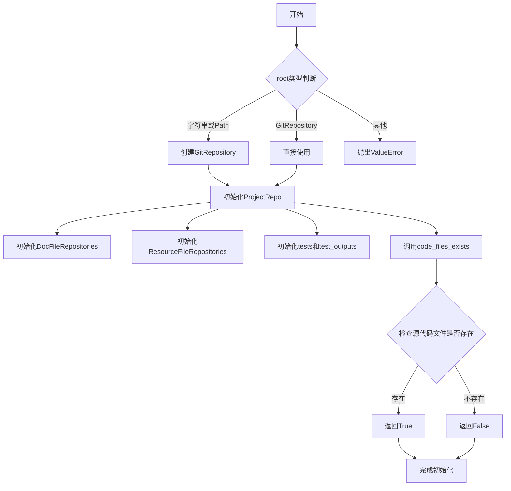
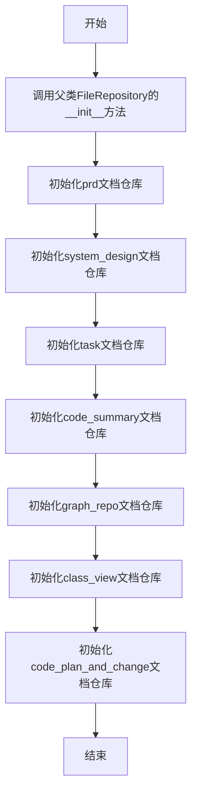
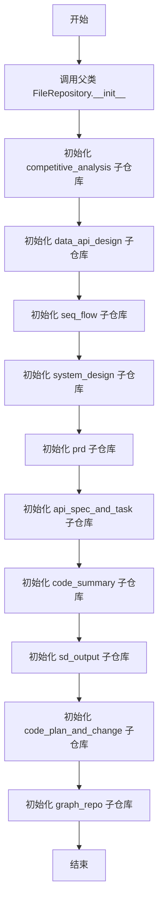
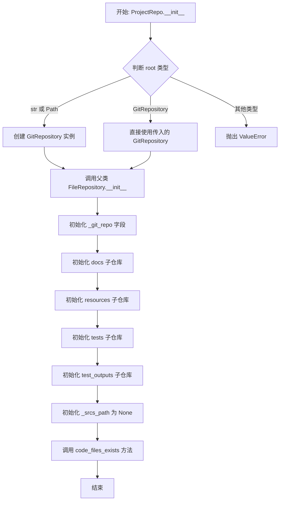
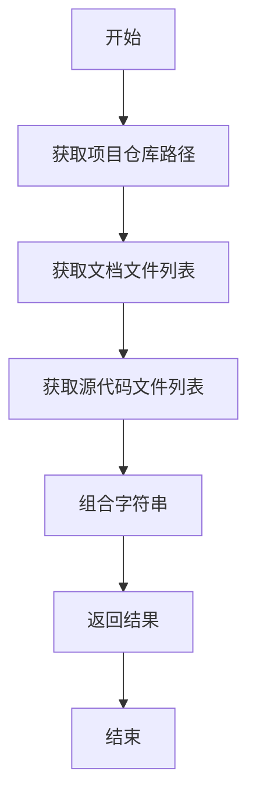
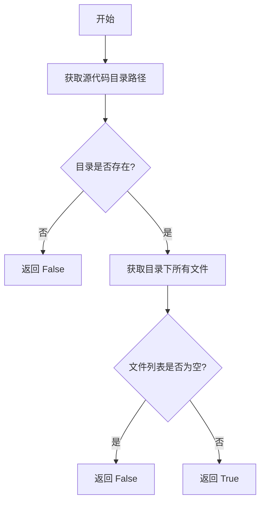
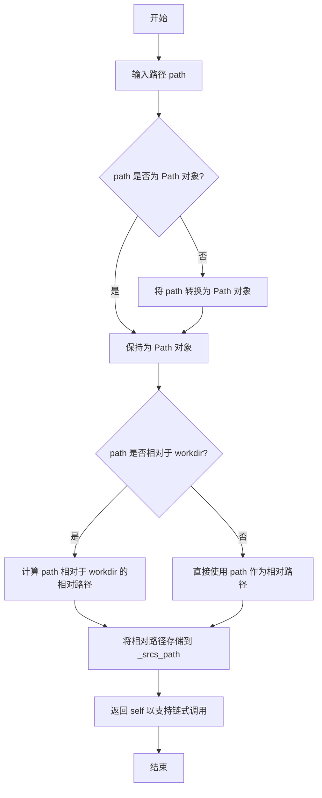

# `.\MetaGPT\metagpt\utils\project_repo.py` 详细设计文档

该文件是项目仓库的包装器，封装了GitRepository和FileRepository的功能，用于管理项目中的文档、资源和源代码文件。它实现了对项目不同部分（如需求文档、系统设计、任务、代码摘要等）的层次化文件存储管理，并提供了便捷的访问接口。

## 整体流程



## 类结构

```
FileRepository (基类)
├── DocFileRepositories (文档文件仓库)
├── ResourceFileRepositories (资源文件仓库)
└── ProjectRepo (项目仓库)
    ├── docs (DocFileRepositories实例)
    ├── resources (ResourceFileRepositories实例)
    ├── tests (FileRepository实例)
    └── test_outputs (FileRepository实例)
```

## 全局变量及字段


### `DocFileRepositories.prd`
    
用于存储产品需求文档（PRD）的文件仓库实例。

类型：`FileRepository`
    


### `DocFileRepositories.system_design`
    
用于存储系统设计文档的文件仓库实例。

类型：`FileRepository`
    


### `DocFileRepositories.task`
    
用于存储任务相关文档的文件仓库实例。

类型：`FileRepository`
    


### `DocFileRepositories.code_summary`
    
用于存储代码摘要文档的文件仓库实例。

类型：`FileRepository`
    


### `DocFileRepositories.graph_repo`
    
用于存储图形仓库（如UML图）相关文档的文件仓库实例。

类型：`FileRepository`
    


### `DocFileRepositories.class_view`
    
用于存储类视图相关文档的文件仓库实例。

类型：`FileRepository`
    


### `DocFileRepositories.code_plan_and_change`
    
用于存储代码计划和变更相关文档的文件仓库实例。

类型：`FileRepository`
    


### `ResourceFileRepositories.competitive_analysis`
    
用于存储竞争分析相关资源文件的文件仓库实例。

类型：`FileRepository`
    


### `ResourceFileRepositories.data_api_design`
    
用于存储数据API设计相关资源文件的文件仓库实例。

类型：`FileRepository`
    


### `ResourceFileRepositories.seq_flow`
    
用于存储序列流图相关资源文件的文件仓库实例。

类型：`FileRepository`
    


### `ResourceFileRepositories.system_design`
    
用于存储系统设计PDF等资源文件的文件仓库实例。

类型：`FileRepository`
    


### `ResourceFileRepositories.prd`
    
用于存储产品需求文档PDF等资源文件的文件仓库实例。

类型：`FileRepository`
    


### `ResourceFileRepositories.api_spec_and_task`
    
用于存储API规范和任务PDF等资源文件的文件仓库实例。

类型：`FileRepository`
    


### `ResourceFileRepositories.code_summary`
    
用于存储代码摘要PDF等资源文件的文件仓库实例。

类型：`FileRepository`
    


### `ResourceFileRepositories.sd_output`
    
用于存储系统设计输出相关资源文件的文件仓库实例。

类型：`FileRepository`
    


### `ResourceFileRepositories.code_plan_and_change`
    
用于存储代码计划和变更PDF等资源文件的文件仓库实例。

类型：`FileRepository`
    


### `ResourceFileRepositories.graph_repo`
    
用于存储可视化图形仓库相关资源文件的文件仓库实例。

类型：`FileRepository`
    


### `ProjectRepo._git_repo`
    
项目底层的Git仓库实例，用于版本控制和文件操作。

类型：`GitRepository`
    


### `ProjectRepo.docs`
    
项目文档文件仓库的聚合实例，包含PRD、设计、任务等各类文档。

类型：`DocFileRepositories`
    


### `ProjectRepo.resources`
    
项目资源文件仓库的聚合实例，包含分析、设计图、PDF等各类资源。

类型：`ResourceFileRepositories`
    


### `ProjectRepo.tests`
    
用于存储测试代码的文件仓库实例。

类型：`FileRepository`
    


### `ProjectRepo.test_outputs`
    
用于存储测试输出结果的文件仓库实例。

类型：`FileRepository`
    


### `ProjectRepo._srcs_path`
    
项目源代码目录相对于项目根目录的路径，用于定位和管理源代码文件。

类型：`Path | None`
    
    

## 全局函数及方法

### `DocFileRepositories.__init__`

该方法用于初始化`DocFileRepositories`类的实例，继承自`FileRepository`类，并创建多个特定类型的文档文件仓库实例，用于组织和管理项目中的各类文档。

参数：

- `git_repo`：`GitRepository`，一个Git仓库对象，用于创建和管理文件仓库。

返回值：`None`，无返回值。

#### 流程图



#### 带注释源码

```python
def __init__(self, git_repo):
    # 调用父类FileRepository的初始化方法，设置相对路径为DOCS_FILE_REPO
    super().__init__(git_repo=git_repo, relative_path=DOCS_FILE_REPO)

    # 初始化prd文档仓库，相对路径为PRDS_FILE_REPO
    self.prd = git_repo.new_file_repository(relative_path=PRDS_FILE_REPO)
    # 初始化system_design文档仓库，相对路径为SYSTEM_DESIGN_FILE_REPO
    self.system_design = git_repo.new_file_repository(relative_path=SYSTEM_DESIGN_FILE_REPO)
    # 初始化task文档仓库，相对路径为TASK_FILE_REPO
    self.task = git_repo.new_file_repository(relative_path=TASK_FILE_REPO)
    # 初始化code_summary文档仓库，相对路径为CODE_SUMMARIES_FILE_REPO
    self.code_summary = git_repo.new_file_repository(relative_path=CODE_SUMMARIES_FILE_REPO)
    # 初始化graph_repo文档仓库，相对路径为GRAPH_REPO_FILE_REPO
    self.graph_repo = git_repo.new_file_repository(relative_path=GRAPH_REPO_FILE_REPO)
    # 初始化class_view文档仓库，相对路径为CLASS_VIEW_FILE_REPO
    self.class_view = git_repo.new_file_repository(relative_path=CLASS_VIEW_FILE_REPO)
    # 初始化code_plan_and_change文档仓库，相对路径为CODE_PLAN_AND_CHANGE_FILE_REPO
    self.code_plan_and_change = git_repo.new_file_repository(relative_path=CODE_PLAN_AND_CHANGE_FILE_REPO)
```

### `ResourceFileRepositories.__init__`

该方法用于初始化 `ResourceFileRepositories` 类的实例。它首先调用父类 `FileRepository` 的构造函数，设置资源文件仓库的基础路径，然后为不同类型的资源文件（如竞争分析、数据API设计、序列流程图等）创建并初始化对应的 `FileRepository` 子仓库实例。

参数：

- `git_repo`：`GitRepository`，一个 Git 仓库对象，用于管理资源文件的版本控制和存储。

返回值：`None`，无返回值。

#### 流程图



#### 带注释源码

```python
def __init__(self, git_repo):
    # 调用父类 FileRepository 的构造函数，设置资源文件仓库的基础路径为 RESOURCES_FILE_REPO
    super().__init__(git_repo=git_repo, relative_path=RESOURCES_FILE_REPO)

    # 初始化竞争分析资源子仓库
    self.competitive_analysis = git_repo.new_file_repository(relative_path=COMPETITIVE_ANALYSIS_FILE_REPO)
    # 初始化数据API设计资源子仓库
    self.data_api_design = git_repo.new_file_repository(relative_path=DATA_API_DESIGN_FILE_REPO)
    # 初始化序列流程图资源子仓库
    self.seq_flow = git_repo.new_file_repository(relative_path=SEQ_FLOW_FILE_REPO)
    # 初始化系统设计资源子仓库
    self.system_design = git_repo.new_file_repository(relative_path=SYSTEM_DESIGN_PDF_FILE_REPO)
    # 初始化产品需求文档资源子仓库
    self.prd = git_repo.new_file_repository(relative_path=PRD_PDF_FILE_REPO)
    # 初始化API规范和任务资源子仓库
    self.api_spec_and_task = git_repo.new_file_repository(relative_path=TASK_PDF_FILE_REPO)
    # 初始化代码摘要资源子仓库
    self.code_summary = git_repo.new_file_repository(relative_path=CODE_SUMMARIES_PDF_FILE_REPO)
    # 初始化系统设计输出资源子仓库
    self.sd_output = git_repo.new_file_repository(relative_path=SD_OUTPUT_FILE_REPO)
    # 初始化代码计划和变更资源子仓库
    self.code_plan_and_change = git_repo.new_file_repository(relative_path=CODE_PLAN_AND_CHANGE_PDF_FILE_REPO)
    # 初始化可视化图资源子仓库
    self.graph_repo = git_repo.new_file_repository(relative_path=VISUAL_GRAPH_REPO_FILE_REPO)
```

### `ProjectRepo.__init__`

初始化 `ProjectRepo` 实例，根据传入的根路径参数创建或包装一个 `GitRepository`，并初始化文档、资源、测试等子仓库。

参数：

- `root`：`str | Path | GitRepository`，项目的根路径，可以是字符串、`Path` 对象或已存在的 `GitRepository` 实例。

返回值：`None`，构造函数不返回值。

#### 流程图



#### 带注释源码

```python
def __init__(self, root: str | Path | GitRepository):
    # 根据传入的 root 参数类型，创建或获取 GitRepository 实例
    if isinstance(root, str) or isinstance(root, Path):
        # 如果 root 是字符串或 Path 对象，则基于该路径创建一个新的 GitRepository
        git_repo_ = GitRepository(local_path=Path(root))
    elif isinstance(root, GitRepository):
        # 如果 root 已经是 GitRepository 实例，则直接使用它
        git_repo_ = root
    else:
        # 如果 root 是其他类型，则抛出 ValueError 异常
        raise ValueError("Invalid root")
    # 调用父类 FileRepository 的构造函数，传入 git_repo_ 和相对路径 "."
    super().__init__(git_repo=git_repo_, relative_path=Path("."))
    # 将 git_repo_ 保存到实例变量 _git_repo 中
    self._git_repo = git_repo_
    # 初始化 docs 属性，创建一个 DocFileRepositories 实例
    self.docs = DocFileRepositories(self._git_repo)
    # 初始化 resources 属性，创建一个 ResourceFileRepositories 实例
    self.resources = ResourceFileRepositories(self._git_repo)
    # 初始化 tests 属性，创建一个新的 FileRepository 用于测试代码
    self.tests = self._git_repo.new_file_repository(relative_path=TEST_CODES_FILE_REPO)
    # 初始化 test_outputs 属性，创建一个新的 FileRepository 用于测试输出
    self.test_outputs = self._git_repo.new_file_repository(relative_path=TEST_OUTPUTS_FILE_REPO)
    # 初始化 _srcs_path 为 None，表示源代码路径尚未设置
    self._srcs_path = None
    # 调用 code_files_exists 方法，检查项目中是否存在代码文件
    self.code_files_exists()
```

### `ProjectRepo.__str__`

该方法返回 `ProjectRepo` 对象的字符串表示形式，用于调试和日志记录。它组合了项目仓库的基本信息、文档目录的文件列表以及源代码目录的文件列表，以提供项目状态的概览。

参数：

- `self`：`ProjectRepo` 类型，表示当前 `ProjectRepo` 实例。

返回值：`str` 类型，返回一个格式化的字符串，包含项目仓库路径、文档文件列表和源代码文件列表。

#### 流程图



#### 带注释源码

```python
def __str__(self):
    # 获取项目仓库的工作目录路径
    repo_str = f"ProjectRepo({self._git_repo.workdir})"
    # 获取文档目录中的所有文件列表
    docs_str = f"Docs({self.docs.all_files})"
    # 获取源代码目录中的所有文件列表
    srcs_str = f"Srcs({self.srcs.all_files})"
    # 组合以上信息，每部分占一行
    return f"{repo_str}\n{docs_str}\n{srcs_str}"
```

### `ProjectRepo.code_files_exists`

该方法用于检查项目源代码目录是否存在且包含代码文件。它首先获取项目的源代码目录路径，然后验证该目录是否存在，最后检查该目录下是否包含任何代码文件。

参数：
- 无参数

返回值：`bool`，如果源代码目录存在且包含代码文件则返回 `True`，否则返回 `False`

#### 流程图



#### 带注释源码

```python
def code_files_exists(self) -> bool:
    # 获取项目的源代码目录路径
    src_workdir = get_project_srcs_path(self.git_repo.workdir)
    
    # 检查源代码目录是否存在
    if not src_workdir.exists():
        return False
    
    # 获取源代码目录下的所有文件
    code_files = self.with_src_path(path=src_workdir).srcs.all_files
    
    # 检查文件列表是否为空
    if not code_files:
        return False
    
    # 如果目录存在且包含文件，返回 True
    return bool(code_files)
```

### `ProjectRepo.with_src_path`

该方法用于设置项目源代码的根路径，并返回当前 `ProjectRepo` 实例以支持链式调用。它接受一个路径参数，将其转换为相对于项目工作目录的相对路径并存储在内部状态中，以便后续通过 `srcs` 属性访问源代码文件仓库。

参数：

- `path`：`str | Path`，源代码的根路径，可以是绝对路径或相对路径。

返回值：`ProjectRepo`，返回当前 `ProjectRepo` 实例以支持链式调用。

#### 流程图



#### 带注释源码

```python
def with_src_path(self, path: str | Path) -> ProjectRepo:
    # 将输入路径转换为 Path 对象，确保后续操作的一致性
    path = Path(path)
    
    # 检查路径是否相对于项目工作目录（workdir）
    if path.is_relative_to(self.workdir):
        # 如果是相对路径，则计算相对于 workdir 的相对路径并存储
        self._srcs_path = path.relative_to(self.workdir)
    else:
        # 如果不是相对路径（例如绝对路径），则直接存储该路径
        self._srcs_path = path
    
    # 返回当前实例以支持链式调用
    return self
```

### `ProjectRepo.search_project_path`

这是一个静态方法，用于在给定的文件或目录路径的父级目录中向上递归搜索，直到找到包含 `.git` 目录的根目录，从而定位项目根路径。

参数：
- `filename`：`str | Path`，起始搜索的文件或目录路径。

返回值：`Optional[Path]`，如果找到包含 `.git` 目录的项目根路径，则返回该路径的 `Path` 对象；否则返回 `None`。

#### 流程图

```mermaid
flowchart TD
    A[开始: search_project_path(filename)] --> B{filename 是文件?};
    B -- 是 --> C[取父目录作为 root];
    B -- 否 --> D[将 filename 作为 root];
    C --> E[将 root 解析为绝对路径];
    D --> E;
    E --> F{root 不等于 '/'?};
    F -- 是 --> G[检查 root/.git 是否存在];
    G -- 存在 --> H[返回 root];
    G -- 不存在 --> I[root = root.parent];
    I --> F;
    F -- 否 --> J[返回 None];
```

#### 带注释源码

```python
@staticmethod
def search_project_path(filename: str | Path) -> Optional[Path]:
    # 判断传入的路径是文件还是目录。如果是文件，则取其父目录作为搜索起点。
    root = Path(filename).parent if Path(filename).is_file() else Path(filename)
    # 将路径解析为绝对路径，确保后续搜索的准确性。
    root = root.resolve()
    # 从当前目录开始，逐级向上搜索父目录，直到根目录 '/'。
    while str(root) != "/":
        # 检查当前目录下是否存在 `.git` 目录，这是 Git 仓库的标识。
        git_repo = root / ".git"
        if git_repo.exists():
            # 如果找到 `.git` 目录，则当前目录即为项目根目录，返回该路径。
            return root
        # 如果当前目录不是项目根目录，则继续向上一级目录搜索。
        root = root.parent
    # 如果搜索到根目录 '/' 仍未找到 `.git` 目录，则返回 None，表示未找到项目根路径。
    return None
```

## 关键组件


### GitRepository 封装

`ProjectRepo` 类作为 `GitRepository` 和 `FileRepository` 的统一封装，为项目提供了一个结构化的文件存储和版本控制接口。它通过初始化时传入的路径或 `GitRepository` 对象，自动管理项目的工作目录和源代码路径。

### 文档文件仓库聚合

`DocFileRepositories` 类聚合了多个用于存储不同阶段文档的 `FileRepository` 实例，如产品需求文档（PRD）、系统设计文档、任务文档、代码总结等。它将这些文档仓库组织在统一的 `docs` 目录下，便于集中管理和访问。

### 资源文件仓库聚合

`ResourceFileRepositories` 类聚合了多个用于存储项目相关资源文件的 `FileRepository` 实例，如竞品分析、数据API设计、序列图、系统设计PDF、任务PDF等。它将这些资源仓库组织在统一的 `resources` 目录下，便于资源的管理和检索。

### 源代码路径管理

`ProjectRepo` 类通过 `with_src_path` 方法和 `srcs` 属性，提供了对项目源代码目录的动态管理和访问能力。它允许在运行时指定源代码的相对或绝对路径，并确保代码文件的存在性检查。

### 项目路径搜索

`ProjectRepo` 类提供了一个静态方法 `search_project_path`，用于根据给定的文件或目录名，向上递归搜索包含 `.git` 目录的项目根路径。这有助于在不确定项目根目录的情况下定位项目。


## 问题及建议


### 已知问题

-   **`code_files_exists` 方法逻辑不清晰且职责模糊**：该方法名为检查代码文件是否存在，但其内部调用了 `with_src_path` 方法，这实际上会修改 `self._srcs_path` 的状态。这导致该方法不仅是一个查询操作，还是一个有副作用的修改操作，违反了单一职责原则，可能引发意料之外的状态变更。
-   **`with_src_path` 方法可能产生不一致的路径表示**：该方法在处理传入的 `path` 参数时，如果 `path` 相对于项目工作目录，则存储相对路径；否则存储绝对路径。这导致 `self._srcs_path` 字段可能存储两种不同格式的路径，增加了后续使用该字段时的复杂性和出错风险。
-   **`srcs` 属性在未初始化时抛出通用异常**：当 `_srcs_path` 未设置时，访问 `srcs` 属性会抛出 `ValueError("Call with_srcs first.")`。这个错误信息不够具体，且 `ValueError` 对于“属性未初始化”这种上下文来说可能不是最合适的异常类型。
-   **`__str__` 方法可能引发异常**：`__str__` 方法中直接访问了 `self.srcs.all_files`。如果 `_srcs_path` 未设置，访问 `self.srcs` 属性会触发上述的 `ValueError`，导致 `__str__` 调用失败，这可能影响调试和日志记录。
-   **`requirement` 属性是异步的**：`requirement` 被定义为异步属性 (`async` property)。Python 的异步属性使用不便，且与类中其他同步属性风格不一致。调用者必须使用 `await` 来获取其值，这在同步上下文中会非常麻烦。
-   **硬编码的仓库路径常量**：`DocFileRepositories` 和 `ResourceFileRepositories` 的初始化依赖于从 `metagpt.const` 导入的大量路径常量。这些常量紧密耦合在类定义中，降低了类的灵活性和可测试性。如果需要新增或调整文档/资源类型，必须修改这些类的代码。

### 优化建议

-   **拆分 `code_files_exists` 方法**：将其职责分离。可以创建一个纯查询方法（如 `has_code_files`）来检查代码文件是否存在，而将设置 `_srcs_path` 的逻辑明确放在 `with_src_path` 或一个新的初始化方法中。避免在查询方法中修改对象状态。
-   **统一 `_srcs_path` 的存储格式**：修改 `with_src_path` 方法，始终将传入的路径转换为相对于 `self.workdir` 的路径进行存储。这样可以保证 `_srcs_path` 内部表示的一致性，简化 `srcs` 属性的实现逻辑。
-   **改进 `srcs` 属性的错误处理**：考虑使用更具体的自定义异常（如 `SrcPathNotSetError`）来代替通用的 `ValueError`。或者，可以实现惰性初始化，在第一次访问 `srcs` 时，如果 `_srcs_path` 未设置，则尝试通过一个默认规则（如查找 `src` 或 `app` 目录）来推断并设置它，而不是直接抛出异常。
-   **修复 `__str__` 方法**：在 `__str__` 方法中访问 `self.srcs` 时，应使用 `try-except` 块捕获可能的异常，并提供一个安全的回退表示（例如 `"Srcs(Not Set)"`），确保 `__str__` 方法在任何情况下都能正常执行。
-   **将 `requirement` 改为同步方法**：将 `requirement` 从异步属性改为一个普通的同步方法或属性。如果底层 `FileRepository.get` 操作确实是异步的，可以考虑在 `ProjectRepo` 初始化时或某个特定阶段预加载需求文档，或者提供一个同步的 `get_requirement` 方法，内部处理异步调用。这能显著改善 API 的易用性。
-   **解耦路径配置**：考虑将 `DocFileRepositories` 和 `ResourceFileRepositories` 中硬编码的路径常量提取为可配置的字典或映射，并通过构造函数的参数传入。这样可以提高类的可配置性和可测试性，符合依赖注入原则。例如，可以定义一个 `RepositoryConfig` 类来管理所有子仓库的路径映射。
-   **增强类型注解**：为 `_srcs_path` 字段（`Optional[Path]`）和 `search_project_path` 的返回值（`Optional[Path]`）添加更精确的类型注解。考虑使用 `typing` 模块中的 `ClassVar` 或 `Final` 来标注类级别的常量（如果适用），并使用 `__init__` 方法中的类型注解来明确实例变量的类型。


## 其它


### 设计目标与约束

本模块的设计目标是提供一个统一、结构化的项目仓库封装，用于管理软件开发过程中产生的各类文档、资源和源代码文件。它作为`GitRepository`和`FileRepository`的包装器，旨在实现特定知识库（如飞书文档中描述的章节4.6）的组织规范。核心约束包括：1) 必须与底层的`GitRepository`和`FileRepository`机制兼容；2) 需要按照预定义的目录结构（通过`metagpt.const`中的常量指定）组织不同类型的文件；3) 提供便捷的属性访问方式来操作不同类别的子仓库；4) 支持通过静态方法在文件系统中逆向查找项目根目录。

### 错误处理与异常设计

模块中的错误处理主要采用Python的异常机制。在`ProjectRepo.__init__`中，当传入的`root`参数类型无效时，会抛出`ValueError("Invalid root")`。在`ProjectRepo.srcs`属性访问器中，如果未预先调用`with_src_path`方法设置源码路径，会抛出`ValueError("Call with_srcs first.")`。对于文件操作（如`FileRepository`的方法）可能引发的`IOError`、`FileNotFoundError`等异常，本模块未进行显式捕获，而是交由调用者处理。`search_project_path`方法在未找到`.git`目录时返回`None`，这是一种通过返回值表示“未找到”状态的错误处理方式。

### 数据流与状态机

数据流主要围绕`GitRepository`对象展开。`ProjectRepo`实例初始化时，根据输入创建或接收一个`GitRepository`实例作为核心数据源。`DocFileRepositories`和`ResourceFileRepositories`作为`ProjectRepo`的组件，共享同一个`GitRepository`实例，但通过不同的`relative_path`参数指向项目工作区下的不同子目录（如`docs/`、`resources/`）。`ProjectRepo`的`srcs`属性依赖于内部状态`_srcs_path`，该状态必须通过`with_src_path`方法显式设置后才能有效访问。`code_files_exists`方法会触发一次状态检查，验证源码目录是否存在且包含文件。整体上，模块状态相对简单，核心是`_git_repo`引用和可选的`_srcs_path`。

### 外部依赖与接口契约

**外部依赖：**
1.  **`metagpt.const`模块：** 强依赖，用于获取所有预定义的目录路径常量（如`DOCS_FILE_REPO`, `PRDS_FILE_REPO`等）。这些常量定义了项目的目录结构契约。
2.  **`metagpt.utils.git_repository.GitRepository`：** 强依赖，是底层版本控制和文件存储的核心。`ProjectRepo`及其内部类通过组合关系使用它。
3.  **`metagpt.utils.file_repository.FileRepository`：** 强依赖，是文件操作的核心抽象。`ProjectRepo`、`DocFileRepositories`和`ResourceFileRepositories`均继承自它。
4.  **`metagpt.utils.common.get_project_srcs_path`：** 弱依赖，用于在`code_files_exists`方法中根据工作目录推导源码目录路径。

**接口契约：**
1.  **`ProjectRepo`初始化契约：** 接受`str`、`Path`或`GitRepository`类型的`root`参数。前两者会内部创建`GitRepository`，后者直接使用。
2.  **`FileRepository`子类契约：** `DocFileRepositories`和`ResourceFileRepositories`的`__init__`方法要求传入一个`GitRepository`实例。
3.  **`srcs`属性访问契约：** 在访问`ProjectRepo.srcs`属性前，必须成功调用`with_src_path`方法，否则会抛出异常。
4.  **`search_project_path`静态方法契约：** 输入一个文件或目录路径，返回包含该路径的最近上级Git项目根目录的`Path`对象，若未找到则返回`None`。

### 安全与权限考量

当前代码层面未涉及显式的安全与权限控制机制。文件系统的读写权限完全依赖于运行该Python进程的操作系统用户对项目目录及其子目录的权限。由于模块深度集成`GitRepository`，所有通过本模块进行的文件操作（增删改查）最终都会反映在Git仓库中，因此需要确保对`.git`目录有相应的读写权限。在分布式或多用户环境中，需要考虑Git操作可能引发的冲突。模块本身没有内置的并发安全控制（如锁机制），在并发访问场景下需要由调用方协调。

### 配置与可扩展性

**配置：** 模块的行为主要通过`metagpt.const`中的常量进行配置。要改变文档、资源等目录的结构，需要修改这些常量。`ProjectRepo`本身没有提供运行时配置选项。

**可扩展性：**
1.  **目录结构扩展：** 若要增加新的文档或资源类别，需要在`metagpt.const`中定义新的路径常量，并在`DocFileRepositories`或`ResourceFileRepositories`类中添加相应的`FileRepository`属性。这是一种编译时扩展。
2.  **功能扩展：** 由于`ProjectRepo`继承自`FileRepository`，因此可以自然地使用`FileRepository`提供的所有文件操作方法。也可以通过添加新的方法或属性来扩展项目级别的特定功能。
3.  **灵活性局限：** 当前的`DocFileRepositories`和`ResourceFileRepositories`是硬编码的，不支持动态添加或移除子仓库类型。如果需要更灵活的结构，可以考虑使用字典或配置文件来管理子仓库映射。

### 测试策略建议

1.  **单元测试：**
    *   **初始化测试：** 测试使用`str`、`Path`、`GitRepository`三种类型参数成功创建`ProjectRepo`，以及传入无效参数时抛出`ValueError`。
    *   **属性测试：** 验证`docs`、`resources`、`git_repo`、`workdir`等属性返回正确的对象或值。
    *   **`srcs`属性测试：** 测试未设置`_srcs_path`时访问`srcs`抛出异常，设置后能正确返回`FileRepository`。
    *   **`with_src_path`测试：** 测试传入相对路径和绝对路径时，`_srcs_path`被正确设置。
    *   **`code_files_exists`测试：** 模拟存在/不存在源码目录、目录为空/非空等情况，验证返回值。
    *   **`search_project_path`测试：** 在临时目录结构中创建嵌套的`.git`目录，测试该方法能否正确向上查找并返回项目根路径。

2.  **集成测试：**
    *   创建临时Git仓库，使用`ProjectRepo`在其中进行完整的文件操作流程（如在`docs.prd`子仓库写文件，在`srcs`子仓库读文件），验证文件能正确存储于预期的目录结构中，并且能通过属性访问到。
    *   测试`ProjectRepo`与底层`GitRepository`的交互，例如文件变更后检查Git状态。

3.  **模拟（Mocking）：** 在单元测试中，应使用`unittest.mock`来模拟`GitRepository`和`FileRepository`的行为，避免依赖真实的文件系统和Git操作，使测试更快速、独立。

    