# `.\MetaGPT\metagpt\utils\pycst.py` 详细设计文档

该代码是一个基于LibCST（Concrete Syntax Tree）的Python源代码处理工具，其核心功能是从一份已包含文档字符串（docstring）的源代码中提取这些文档字符串，并将其合并到另一份结构相同但可能缺少文档字符串的源代码中，实现文档字符串的智能迁移或同步。

## 整体流程

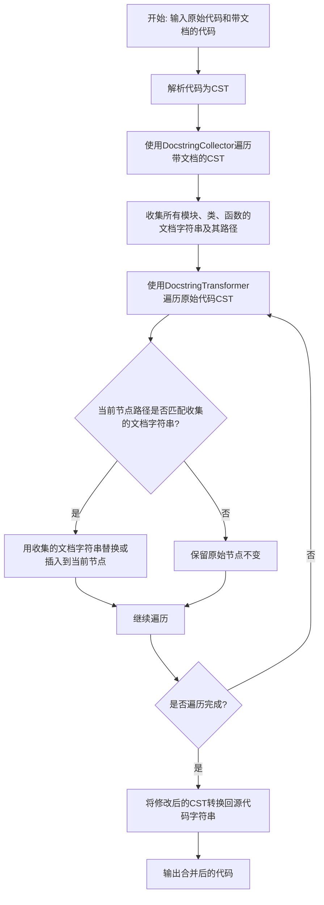

## 类结构

```
全局函数与类型定义
├── get_docstring_statement
├── has_decorator
├── merge_docstring
└── 类层次结构
    ├── DocstringCollector (继承自 CSTVisitor)
    └── DocstringTransformer (继承自 CSTTransformer)
```

## 全局变量及字段


### `DocstringNode`
    
表示可以包含文档字符串的CST节点类型别名，包括模块、类定义和函数定义。

类型：`Union[cst.Module, cst.ClassDef, cst.FunctionDef]`
    


### `DocstringCollector.stack`
    
用于在遍历CST时跟踪当前节点路径的栈结构。

类型：`list[str]`
    


### `DocstringCollector.docstrings`
    
存储从CST中收集到的文档字符串，键为节点路径元组，值为文档字符串语句。

类型：`dict[tuple[str, ...], cst.SimpleStatementLine]`
    


### `DocstringTransformer.stack`
    
用于在转换CST时跟踪当前节点路径的栈结构。

类型：`list[str]`
    


### `DocstringTransformer.docstrings`
    
存储待插入到目标CST中的文档字符串映射。

类型：`dict[tuple[str, ...], cst.SimpleStatementLine]`
    
    

## 全局函数及方法

### `get_docstring_statement`

该函数用于从给定的代码结构节点（模块、类定义或函数定义）中提取其文档字符串（docstring）对应的语句节点。它通过遍历节点的语法树，定位并验证第一个语句是否为有效的字符串表达式，从而判断并返回文档字符串。

参数：

- `body`：`DocstringNode`，一个联合类型，可以是 `cst.Module`、`cst.ClassDef` 或 `cst.FunctionDef` 节点，表示需要从中提取文档字符串的代码结构体。

返回值：`cst.SimpleStatementLine`，如果找到有效的文档字符串，则返回包含该文档字符串的简单语句行节点；否则返回 `None`。

#### 流程图

```mermaid
flowchart TD
    A[开始: get_docstring_statement(body)] --> B{body 类型?}
    B -->|Module| C[body = body.body]
    B -->|ClassDef 或 FunctionDef| D[body = body.body.body]
    C --> E{body 列表为空?}
    D --> E
    E -->|是| F[返回 None]
    E -->|否| G[获取第一个语句 statement]
    G --> H{statement 是 SimpleStatementLine?}
    H -->|否| F
    H -->|是| I[expr = statement]
    I --> J{expr 是 BaseSuite 或 SimpleStatementLine?}
    J -->|是| K{expr.body 为空?}
    K -->|是| F
    K -->|否| L[expr = expr.body[0]]
    L --> J
    J -->|否| M{expr 是 Expr 节点?}
    M -->|否| F
    M -->|是| N[val = expr.value]
    N --> O{val 是 SimpleString 或 ConcatenatedString?}
    O -->|否| F
    O -->|是| P[evaluated_value = val.evaluated_value]
    P --> Q{evaluated_value 是 bytes 类型?}
    Q -->|是| F
    Q -->|否| R[返回 statement]
```

#### 带注释源码

```python
def get_docstring_statement(body: DocstringNode) -> cst.SimpleStatementLine:
    """Extracts the docstring from the body of a node.

    Args:
        body: The body of a node.

    Returns:
        The docstring statement if it exists, None otherwise.
    """
    # 步骤1: 根据节点类型，获取其内部的语句体（body）列表。
    if isinstance(body, cst.Module):
        # 如果是模块，直接获取其 body 属性，这是一个语句列表。
        body = body.body
    else:
        # 如果是类或函数定义，其 body 是一个 IndentedBlock 节点，
        # 需要再获取其内部的 body 属性来得到语句列表。
        body = body.body.body

    # 步骤2: 检查语句体是否为空。
    if not body:
        # 如果为空，则没有文档字符串，返回 None。
        return

    # 步骤3: 获取语句体的第一个语句。
    statement = body[0]
    # 步骤4: 检查第一个语句是否是简单语句行（SimpleStatementLine）。
    # 文档字符串通常以这种形式出现（例如，一个字符串字面量）。
    if not isinstance(statement, cst.SimpleStatementLine):
        # 如果不是，则不是有效的文档字符串格式，返回 None。
        return

    # 步骤5: 遍历可能的嵌套结构，找到最内层的表达式。
    # 例如，文档字符串可能被包裹在其他的简单结构里。
    expr = statement
    while isinstance(expr, (cst.BaseSuite, cst.SimpleStatementLine)):
        # 检查当前表达式体是否为空。
        if len(expr.body) == 0:
            return None
        # 获取其第一个子元素继续检查。
        expr = expr.body[0]

    # 步骤6: 检查最终找到的节点是否是一个表达式（Expr）节点。
    if not isinstance(expr, cst.Expr):
        return None

    # 步骤7: 获取表达式节点的值。
    val = expr.value
    # 步骤8: 检查该值是否是字符串类型（简单字符串或拼接字符串）。
    if not isinstance(val, (cst.SimpleString, cst.ConcatenatedString)):
        return None

    # 步骤9: 获取字符串的求值后值，并检查其类型。
    evaluated_value = val.evaluated_value
    # 步骤10: 如果求值后是字节类型（例如 b'docstring'），则排除。
    # 通常文档字符串是文本字符串，而不是字节字符串。
    if isinstance(evaluated_value, bytes):
        return None

    # 步骤11: 所有检查通过，返回最初找到的包含文档字符串的语句节点。
    return statement
```

### `has_decorator`

检查给定的 CST 节点是否被指定名称的装饰器修饰。

参数：

- `node`：`DocstringNode`，一个 CST 节点，可以是模块、类定义或函数定义。
- `name`：`str`，要检查的装饰器的名称。

返回值：`bool`，如果节点被指定名称的装饰器修饰则返回 `True`，否则返回 `False`。

#### 流程图

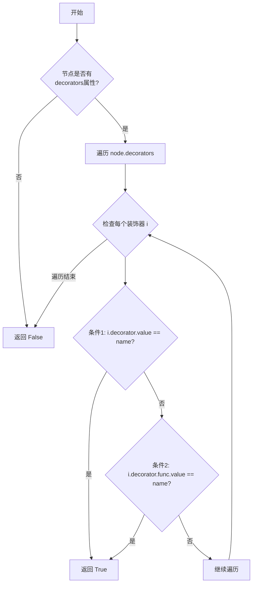

#### 带注释源码

```python
def has_decorator(node: DocstringNode, name: str) -> bool:
    # 首先检查节点是否具有 `decorators` 属性（例如，函数和类有，模块没有）
    return hasattr(node, "decorators") and any(
        # 条件1：检查装饰器是否为简单名称（如 @decorator）
        (hasattr(i.decorator, "value") and i.decorator.value == name)
        # 条件2：检查装饰器是否为带调用或属性的形式（如 @decorator() 或 @module.decorator）
        or (hasattr(i.decorator, "func") and hasattr(i.decorator.func, "value") and i.decorator.func.value == name)
        # 遍历节点的所有装饰器
        for i in node.decorators
    )
```

### `merge_docstring`

该函数是模块的入口点，负责将一段“已文档化”的代码中的文档字符串（docstrings）合并到另一段“原始”代码中。它通过解析两段代码为抽象语法树（CST），使用访问者模式从“已文档化”的代码中收集所有文档字符串，然后使用转换器模式将这些文档字符串插入到“原始”代码的对应位置，最后返回合并后的代码字符串。

参数：
- `code`：`str`，原始的、可能缺少文档字符串的源代码。
- `documented_code`：`str`，包含所需文档字符串的源代码。

返回值：`str`，合并了`documented_code`中文档字符串的`code`代码。

#### 流程图

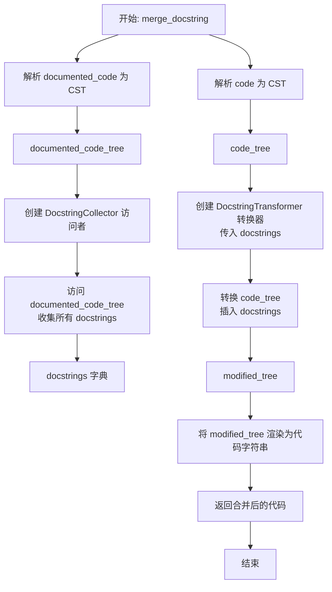

#### 带注释源码

```python
def merge_docstring(code: str, documented_code: str) -> str:
    """Merges the docstrings from the documented code into the original code.

    Args:
        code: The original code.
        documented_code: The documented code.

    Returns:
        The original code with the docstrings from the documented code.
    """
    # 1. 将输入的原始代码字符串解析为 LibCST 的 Module 节点（抽象语法树）。
    code_tree = cst.parse_module(code)
    # 2. 将输入的已文档化代码字符串解析为另一个 Module 节点。
    documented_code_tree = cst.parse_module(documented_code)

    # 3. 创建 DocstringCollector 访问者实例，用于遍历 documented_code_tree。
    visitor = DocstringCollector()
    # 4. 访问 documented_code_tree，收集其中所有模块、类和函数的文档字符串，
    #    结果存储在 visitor.docstrings 字典中。
    documented_code_tree.visit(visitor)
    # 5. 创建 DocstringTransformer 转换器实例，并传入上一步收集到的文档字符串字典。
    transformer = DocstringTransformer(visitor.docstrings)
    # 6. 使用转换器访问并转换 code_tree。转换器会根据路径匹配，
    #    将收集到的文档字符串插入到 code_tree 的对应节点中。
    modified_tree = code_tree.visit(transformer)
    # 7. 将修改后的抽象语法树（modified_tree）重新渲染为 Python 源代码字符串并返回。
    return modified_tree.code
```

### `DocstringCollector.__init__`

初始化一个 `DocstringCollector` 实例。该方法负责设置实例的两个核心属性：`stack` 和 `docstrings`。`stack` 用于在遍历代码的抽象语法树（CST）时追踪当前的路径（例如，模块、类、函数的嵌套关系），而 `docstrings` 则用于存储从 CST 中收集到的文档字符串，其键为路径元组，值为对应的文档字符串语句节点。

参数：
- 无显式参数。`self` 参数是 Python 类方法的隐式参数，代表实例本身。

返回值：`None`，此方法不返回任何值，仅用于初始化实例状态。

#### 流程图

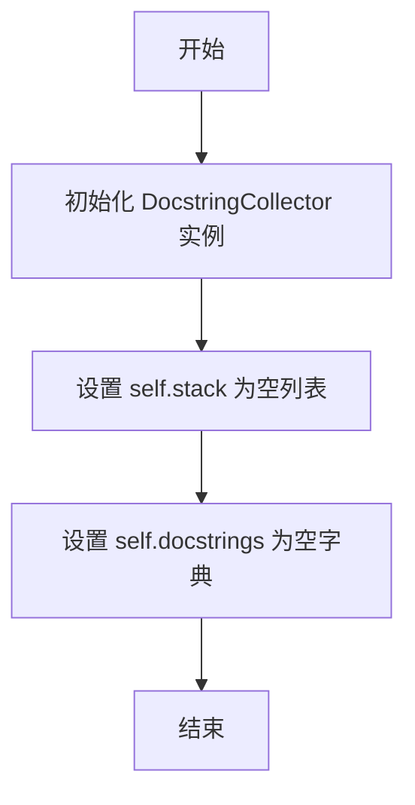

#### 带注释源码

```python
def __init__(self):
    # 初始化一个空列表，用于在遍历CST时记录当前路径。
    # 路径元素通常是模块名（空字符串）、类名或函数名。
    self.stack: list[str] = []
    # 初始化一个空字典，用于存储收集到的文档字符串。
    # 键是一个由路径元素组成的元组，唯一标识一个代码结构（模块、类、函数）。
    # 值是对应的 libcst.SimpleStatementLine 节点，即包含文档字符串的语句。
    self.docstrings: dict[tuple[str, ...], cst.SimpleStatementLine] = {}
```

### `DocstringCollector.visit_Module`

该方法是一个访问者模式中的“进入”方法，当遍历到抽象语法树（CST）中的 `Module` 节点时被调用。它的核心功能是初始化模块在路径栈中的表示，为后续收集该模块及其内部元素的文档字符串建立上下文路径。

参数：

- `node`：`cst.Module`，表示当前正在访问的模块节点。

返回值：`bool | None`，返回 `True` 表示继续访问该节点的子节点，返回 `False` 或 `None` 表示跳过子节点的访问。此方法返回 `None`，意味着将遵循默认的访问逻辑（即继续访问子节点）。

#### 流程图

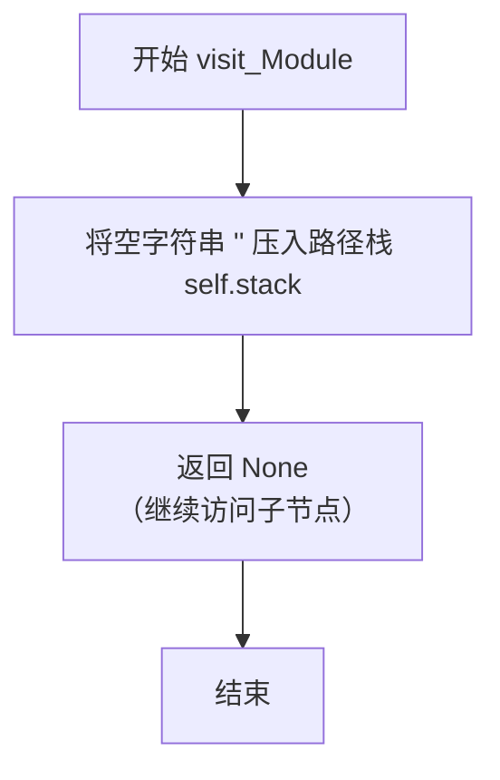

#### 带注释源码

```python
def visit_Module(self, node: cst.Module) -> bool | None:
    # 当访问到一个模块节点时，将一个空字符串压入栈中。
    # 这代表模块本身在路径中的标识。例如，模块 `foo.py` 的路径栈会是 `['']`。
    # 后续访问类 `Bar` 时，栈会变为 `['', 'Bar']`，从而形成路径 `('', 'Bar')`。
    self.stack.append("")
```

### `DocstringCollector.leave_Module`

该方法作为`DocstringCollector`访问器的一部分，在遍历完一个`Module`节点后调用。它的主要职责是处理模块级别的文档字符串收集工作。具体来说，它调用内部的`_leave`方法，将当前模块的路径（存储在`self.stack`中）作为键，如果该模块存在文档字符串，则将其存储到`self.docstrings`字典中。同时，它会从路径栈中弹出当前模块的标识符，以维护正确的遍历路径。

参数：

- `node`：`cst.Module`，表示当前正在离开的模块节点。

返回值：`None`，该方法不返回任何值。

#### 流程图

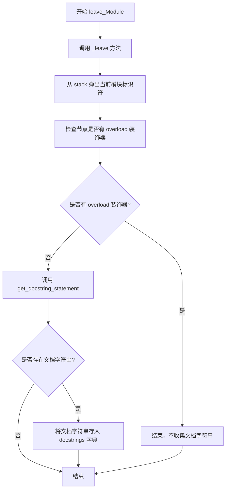

#### 带注释源码

```python
def leave_Module(self, node: cst.Module) -> None:
    # 调用内部方法 _leave 来处理通用的文档字符串收集逻辑
    # 传入当前模块节点作为参数
    return self._leave(node)
```

### `DocstringCollector.visit_ClassDef`

该方法用于在遍历抽象语法树（AST）时，访问并记录类定义的节点。当`DocstringCollector`访问到一个`ClassDef`节点时，它会将该类的名称压入栈中，以便后续在离开该节点时能够正确构建用于标识该节点的路径键。

参数：

- `node`：`cst.ClassDef`，表示当前访问的类定义节点。

返回值：`bool | None`，返回`True`表示继续访问该节点的子节点，返回`None`或`False`表示跳过子节点访问。此处返回`None`，遵循默认的访问逻辑。

#### 流程图

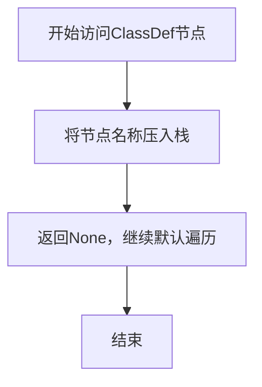

#### 带注释源码

```python
def visit_ClassDef(self, node: cst.ClassDef) -> bool | None:
    # 将当前类定义的名称（node.name.value）添加到栈（self.stack）中。
    # 这个栈用于在遍历过程中跟踪当前的嵌套路径（例如，模块 -> 类 -> 方法）。
    # 当后续离开这个节点（leave_ClassDef）时，会使用这个路径作为键来存储或检索对应的文档字符串。
    self.stack.append(node.name.value)
```

### `DocstringCollector.leave_ClassDef`

该方法作为`DocstringCollector`访问器的一部分，在遍历完一个类定义节点（`ClassDef`）后调用。它的核心职责是处理当前访问路径的弹出逻辑，并尝试从刚访问完的类节点中提取其文档字符串（如果存在且不是重载装饰器标记的类），然后将该文档字符串语句存储到收集器的字典中，其键为从根模块到当前类的完整路径元组。

参数：

- `node`：`cst.ClassDef`，表示刚刚完成访问的类定义抽象语法树节点。

返回值：`None`，该方法不返回任何值。

#### 流程图

```mermaid
flowchart TD
    A[开始 leave_ClassDef] --> B[构建当前路径键 key = tuple(self.stack)]
    B --> C[从栈中弹出当前类名 self.stack.pop]
    C --> D{节点是否被 @overload 装饰?}
    D -- 是 --> E[结束，直接返回]
    D -- 否 --> F[调用 get_docstring_statement(node) 提取文档字符串]
    F --> G{是否成功提取到文档字符串?}
    G -- 否 --> E
    G -- 是 --> H[将文档字符串存入 self.docstrings[key]]
    H --> E
```

#### 带注释源码

```python
def leave_ClassDef(self, node: cst.ClassDef) -> None:
    # 调用内部辅助方法 `_leave` 来处理通用的离开节点逻辑。
    # 对于 `ClassDef` 节点，`_leave` 方法会处理路径栈的维护、
    # 重载装饰器的检查以及文档字符串的提取和存储。
    return self._leave(node)
```

### `DocstringCollector.visit_FunctionDef`

该方法用于在遍历抽象语法树（AST）时，访问函数定义节点，并将其名称压入栈中，以便后续记录该函数的文档字符串路径。

参数：

- `node`：`cst.FunctionDef`，表示当前访问的函数定义节点。

返回值：`bool | None`，返回 `True` 表示继续访问该节点的子节点，返回 `None` 表示使用默认行为（继续访问子节点）。

#### 流程图

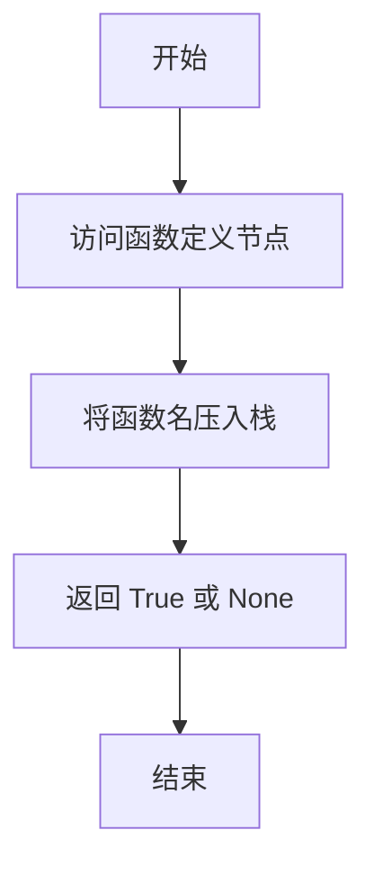

#### 带注释源码

```python
def visit_FunctionDef(self, node: cst.FunctionDef) -> bool | None:
    # 将当前函数定义的名称压入栈中，用于构建路径
    self.stack.append(node.name.value)
```

### `DocstringCollector.leave_FunctionDef`

该方法在访问器（Visitor）离开一个函数定义节点时被调用，用于收集该函数的文档字符串（docstring）。它是`DocstringCollector`类中用于处理`FunctionDef`节点的`leave`事件的方法，与`leave_Module`和`leave_ClassDef`方法共享核心逻辑。

参数：

- `node`：`cst.FunctionDef`，表示当前正在离开的LibCST函数定义节点。

返回值：`None`，该方法不返回任何值。

#### 流程图

```mermaid
flowchart TD
    A[开始 leave_FunctionDef] --> B[调用 _leave 方法]
    B --> C[从栈中弹出当前函数名]
    C --> D{节点是否被<br>@overload装饰？}
    D -- 是 --> E[结束，不收集]
    D -- 否 --> F[调用 get_docstring_statement]
    F --> G{是否成功<br>提取到文档字符串？}
    G -- 否 --> E
    G -- 是 --> H[将文档字符串存入<br>self.docstrings字典]
    H --> E
```

#### 带注释源码

```python
def leave_FunctionDef(self, node: cst.FunctionDef) -> None:
    # 调用内部方法 `_leave` 来处理通用的离开节点逻辑。
    # 对于函数定义节点，其核心操作（如栈管理、文档字符串提取和存储）
    # 与模块（Module）和类定义（ClassDef）节点是一致的。
    return self._leave(node)
```

### `DocstringCollector._leave`

该方法用于在离开一个节点（模块、类定义或函数定义）时，处理该节点的文档字符串。它首先根据当前访问栈生成一个唯一键，然后检查该节点是否被 `@overload` 装饰器修饰。如果不是，则尝试从节点中提取文档字符串。如果提取成功，就将该文档字符串语句存储到 `docstrings` 字典中，键为当前节点的路径。

参数：

- `node`：`DocstringNode`，表示当前正在离开的节点（可以是 `cst.Module`、`cst.ClassDef` 或 `cst.FunctionDef`）。

返回值：`None`，该方法不返回任何值，其作用是通过副作用更新 `self.docstrings` 字典。

#### 流程图

```mermaid
flowchart TD
    A[开始 _leave 方法] --> B[生成键 key = tuple(self.stack)]
    B --> C[从栈中弹出当前节点 self.stack.pop()]
    C --> D{节点是否被 @overload 装饰?}
    D -- 是 --> E[直接返回]
    D -- 否 --> F[调用 get_docstring_statement(node) 提取文档字符串]
    F --> G{是否成功提取到文档字符串?}
    G -- 否 --> E
    G -- 是 --> H[将文档字符串存入 self.docstrings[key]]
    H --> E[结束]
```

#### 带注释源码

```python
def _leave(self, node: DocstringNode) -> None:
    # 根据当前访问栈（self.stack）生成一个元组作为唯一键，用于标识当前节点在代码结构中的位置。
    key = tuple(self.stack)
    # 节点访问完毕，将其从访问栈中弹出，准备处理父节点或兄弟节点。
    self.stack.pop()
    # 检查当前节点是否被 `@overload` 装饰器修饰。如果是，则忽略该节点的文档字符串。
    if has_decorator(node, "overload"):
        return

    # 调用辅助函数 `get_docstring_statement`，尝试从当前节点中提取文档字符串语句。
    statement = get_docstring_statement(node)
    # 如果成功提取到文档字符串语句（statement 不为 None），则将其存储到 `self.docstrings` 字典中。
    if statement:
        self.docstrings[key] = statement
```

### `DocstringTransformer.__init__`

初始化 `DocstringTransformer` 实例，用于在遍历和转换代码的抽象语法树（CST）时，根据给定的文档字符串映射替换或插入文档字符串。

参数：

- `docstrings`：`dict[tuple[str, ...], cst.SimpleStatementLine]`，一个字典，其键为节点在CST中的路径（由字符串元组表示），值为对应的文档字符串语句（`cst.SimpleStatementLine`对象）。该映射通常由 `DocstringCollector` 收集生成，用于指导 `DocstringTransformer` 在相应位置进行文档字符串的替换或插入。

返回值：`None`，此方法为构造函数，不返回任何值。

#### 流程图

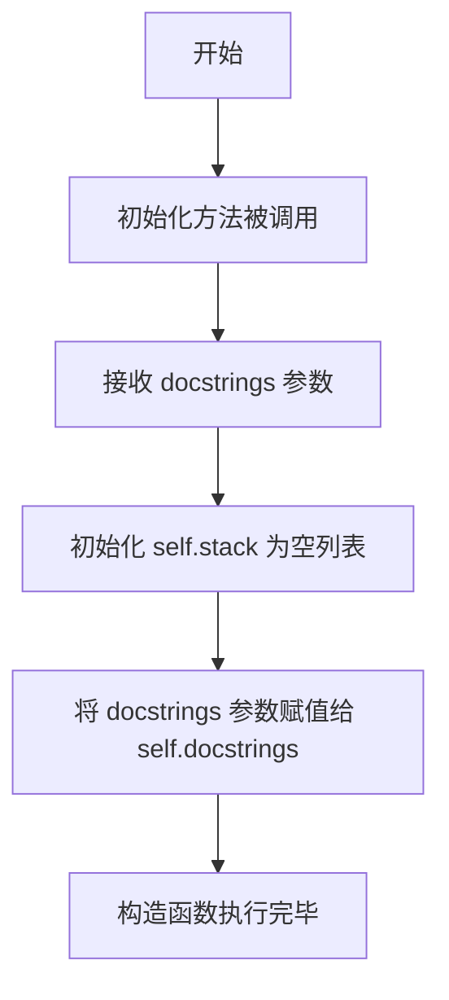

#### 带注释源码

```python
    def __init__(
        self,
        docstrings: dict[tuple[str, ...], cst.SimpleStatementLine],
    ):
        # 初始化一个空列表，用于在遍历CST时追踪当前节点的路径。
        # 路径由节点名称（如模块、类名、函数名）组成，用于在 `docstrings` 字典中定位对应的文档字符串。
        self.stack: list[str] = []
        # 存储传入的文档字符串映射。
        # 键是节点路径的元组，值是对应的文档字符串语句（`cst.SimpleStatementLine` 对象）。
        # 这个映射是 `DocstringTransformer` 进行文档字符串替换或插入操作的依据。
        self.docstrings = docstrings
```

### `DocstringTransformer.visit_Module`

该方法是一个访问者模式中的“进入”方法，当遍历到抽象语法树（AST）中的 `Module` 节点时被调用。它的主要职责是更新内部栈 `self.stack`，为后续在 `leave_Module` 方法中定位和替换当前模块的文档字符串做准备。它通过向栈中压入一个空字符串 `""` 来标记模块层级的路径。

参数：
- `node`：`cst.Module`，表示当前正在访问的模块节点。

返回值：`bool | None`，返回 `None` 或 `True` 表示继续遍历子节点，返回 `False` 表示跳过子节点。此处返回 `None`，遵循默认行为，继续遍历。

#### 流程图

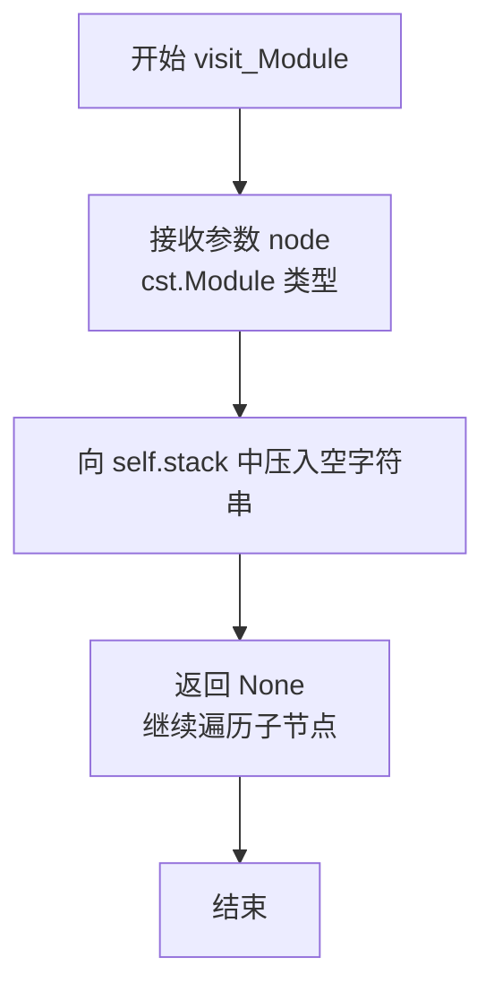

#### 带注释源码

```python
def visit_Module(self, node: cst.Module) -> bool | None:
    # 当访问到 Module 节点时，向路径栈中压入一个空字符串。
    # 这用于在 leave_Module 方法中构造当前模块的唯一路径键 (key)。
    self.stack.append("")
```

### `DocstringTransformer.leave_Module`

该方法属于 `DocstringTransformer` 类，是 LibCST 转换器在遍历并准备离开一个 `Module` 节点时调用的钩子函数。它的核心职责是：根据当前模块在文档字符串映射表中的路径键，查找对应的新文档字符串，并用它来替换原始模块节点中的文档字符串（如果存在的话），或者在最前面插入新的文档字符串。

参数：

- `original_node`：`Module`，原始的、未经修改的模块节点。
- `updated_node`：`Module`，经过之前所有转换步骤（包括其子节点的转换）后得到的当前模块节点。

返回值：`Module`，返回一个更新了文档字符串的新模块节点。

#### 流程图

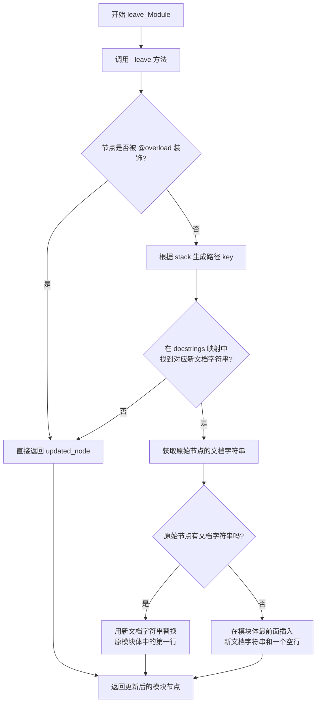

#### 带注释源码

```python
def leave_Module(self, original_node: Module, updated_node: Module) -> Module:
    # 调用内部辅助方法 `_leave` 来处理通用的文档字符串替换逻辑。
    # 该方法会处理路径栈（self.stack）的弹出、检查 @overload 装饰器、
    # 查找新文档字符串以及执行具体的节点更新操作。
    # 对于 Module 节点，`_leave` 方法内部会调用特定的逻辑来更新模块体。
    return self._leave(original_node, updated_node)
```

### `DocstringTransformer.visit_ClassDef`

该方法是一个访问者模式中的“访问”方法，用于在遍历抽象语法树（AST）时，当遇到一个类定义节点时，记录其路径信息。

参数：

- `node`：`cst.ClassDef`，表示当前正在访问的类定义节点。

返回值：`bool | None`，返回 `True` 表示继续访问该节点的子节点；返回 `False` 或 `None` 表示跳过该节点的子节点。此方法默认返回 `None`，意味着它将访问所有子节点。

#### 流程图

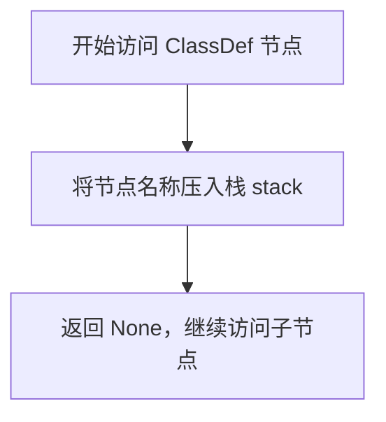

#### 带注释源码

```python
def visit_ClassDef(self, node: cst.ClassDef) -> bool | None:
    # 将当前类定义的名称（node.name.value）添加到栈（self.stack）中。
    # 这个栈用于在遍历过程中跟踪当前所在的嵌套路径（例如，模块 -> 类 -> 方法）。
    self.stack.append(node.name.value)
    # 返回 None，表示 CSTTransformer 应继续访问此 ClassDef 节点的所有子节点。
    # 这是 libcst 访问者模式的默认行为。
```

### `DocstringTransformer.leave_ClassDef`

该方法属于`DocstringTransformer`类，是LibCST转换器（`CSTTransformer`）的一个`leave_`钩子方法。当遍历抽象语法树（AST）离开一个`ClassDef`（类定义）节点时，此方法被调用。它的核心职责是：根据当前遍历路径（`self.stack`构成的键）查找对应的新文档字符串，并用它来替换原始类定义节点中的旧文档字符串（如果存在的话），最终返回更新后的节点。

参数：
- `original_node`：`cst.ClassDef`，原始的类定义节点。
- `updated_node`：`cst.ClassDef`，经过其子节点转换后（即`visit_*`和`leave_*`方法处理后的）的当前类定义节点。

返回值：`cst.CSTNode`，返回一个经过文档字符串替换处理后的新类定义节点。

#### 流程图

```mermaid
flowchart TD
    A[开始 leave_ClassDef] --> B[构建当前路径键 key = tuple(self.stack)]
    B --> C[从栈中弹出当前类名 self.stack.pop]
    C --> D{节点是否被 @overload 装饰?}
    D -- 是 --> E[直接返回 updated_node]
    D -- 否 --> F[根据 key 从 self.docstrings 中查找新文档字符串 statement]
    F --> G{是否找到新文档字符串?}
    G -- 否 --> E
    G -- 是 --> H[获取原始节点中的文档字符串 original_statement]
    H --> I{原始节点中是否存在文档字符串?}
    I -- 是 --> J[用新文档字符串替换原位置<br>body = updated_node.body.body[1:]]
    I -- 否 --> K[在 body 开头插入新文档字符串<br>body = updated_node.body.body]
    J --> L[构造并返回新节点<br>updated_node.with_changes(body=...)]
    K --> L
    L --> M[结束]
```

#### 带注释源码

```python
def leave_ClassDef(self, original_node: cst.ClassDef, updated_node: cst.ClassDef) -> cst.CSTNode:
    # 调用内部辅助方法 `_leave` 来处理通用的文档字符串替换逻辑。
    # 将原始的（original_node）和更新后的（updated_node）类定义节点传递给该方法。
    return self._leave(original_node, updated_node)
```

### `DocstringTransformer.visit_FunctionDef`

该方法在遍历抽象语法树（AST）时，每当遇到一个函数定义节点（`FunctionDef`）时被调用。它的主要职责是记录当前遍历的上下文，将函数名压入栈中，以便后续在离开该节点时能够准确地定位并可能替换其文档字符串。

参数：

- `node`：`cst.FunctionDef`，表示当前正在访问的函数定义节点。

返回值：`bool | None`，返回 `True` 表示继续遍历该节点的子节点；返回 `False` 表示跳过该节点的子节点；返回 `None` 等同于返回 `True`。

#### 流程图

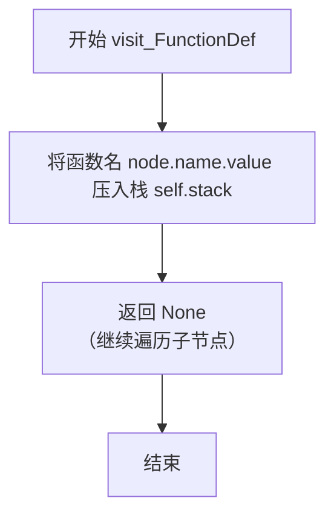

#### 带注释源码

```python
def visit_FunctionDef(self, node: cst.FunctionDef) -> bool | None:
    # 将当前函数定义的名称添加到栈中，用于构建当前节点在AST中的路径标识。
    # 这个路径标识（由栈内容构成的元组）将在 `leave_FunctionDef` 或 `_leave` 方法中
    # 用作键（key），来从 `self.docstrings` 字典中查找对应的新文档字符串。
    self.stack.append(node.name.value)
    # 返回 None，表示 CST 转换器应继续正常遍历当前节点的子节点。
    # 这是 libcst.CSTTransformer 的标准行为。
```

### `DocstringTransformer.leave_FunctionDef`

该方法属于 `DocstringTransformer` 类，是 LibCST 转换器（CSTTransformer）的一个钩子方法。它在访问器（Visitor）完成对一个 `FunctionDef`（函数定义）节点的遍历后调用。其核心职责是：根据当前函数在抽象语法树（CST）中的路径（由 `self.stack` 维护），查找在收集阶段（由 `DocstringCollector` 完成）存储的对应文档字符串（docstring），并用这个新的文档字符串替换原始代码中该函数的现有文档字符串（如果存在的话）。如果目标函数被 `@overload` 装饰器修饰，则跳过替换操作。

参数：

- `original_node`：`cst.FunctionDef`，原始的、未经修改的函数定义节点。
- `updated_node`：`cst.FunctionDef`，经过其子节点转换后（例如，其函数体内部可能已被其他转换规则修改）的当前函数定义节点。

返回值：`cst.CSTNode`，返回一个经过文档字符串替换（或保持不变）后的新函数定义节点。

#### 流程图

```mermaid
flowchart TD
    A[开始 leave_FunctionDef] --> B[构建当前节点路径 key = tuple(self.stack)]
    B --> C[从栈中弹出当前节点 self.stack.pop()]
    C --> D{节点是否被 @overload 装饰?}
    D -- 是 --> E[直接返回 updated_node]
    D -- 否 --> F[根据 key 从 docstrings 字典中查找新 docstring]
    F --> G{是否找到新 docstring?}
    G -- 否 --> E
    G -- 是 --> H[从 original_node 中提取原始 docstring]
    H --> I{原始节点是否有 docstring?}
    I -- 是 --> J[用新 docstring 替换原有 docstring<br>（保留原函数体其他部分）]
    I -- 否 --> K[在函数体开头插入新 docstring<br>（并确保格式正确）]
    J --> L[返回更新后的 updated_node]
    K --> L
    E --> L
    L --> M[结束]
```

#### 带注释源码

```python
def leave_FunctionDef(self, original_node: cst.FunctionDef, updated_node: cst.FunctionDef) -> cst.CSTNode:
    # 调用内部辅助方法 `_leave` 来处理通用的文档字符串替换逻辑。
    # `original_node` 和 `updated_node` 作为参数传入。
    return self._leave(original_node, updated_node)
```

### `DocstringTransformer._leave`

该方法用于在遍历抽象语法树（AST）时，在离开特定节点（如模块、类定义、函数定义）时，根据收集到的文档字符串字典，更新当前节点的文档字符串。它会检查当前节点路径是否存在于文档字符串字典中，如果存在，则用新的文档字符串替换原有的文档字符串，或者在没有文档字符串时插入新的文档字符串。

参数：

- `original_node`：`DocstringNode`，原始的节点对象，用于获取原始文档字符串信息。
- `updated_node`：`DocstringNode`，更新后的节点对象，用于替换或插入新的文档字符串。

返回值：`DocstringNode`，返回更新后的节点对象，其中可能包含新的文档字符串。

#### 流程图

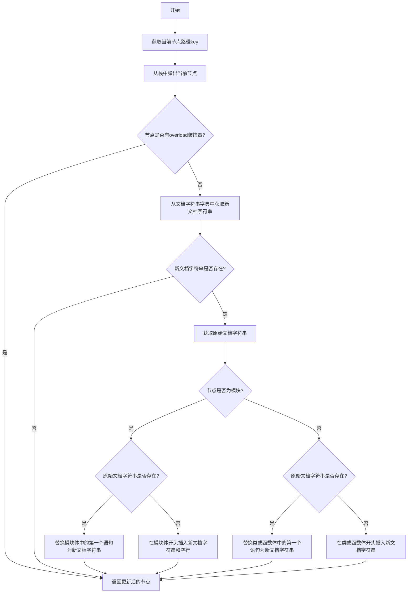

#### 带注释源码

```python
def _leave(self, original_node: DocstringNode, updated_node: DocstringNode) -> DocstringNode:
    # 获取当前节点在栈中的路径作为唯一标识符
    key = tuple(self.stack)
    # 离开节点时，从栈中弹出当前节点
    self.stack.pop()

    # 如果节点有overload装饰器，则跳过文档字符串的更新
    if has_decorator(updated_node, "overload"):
        return updated_node

    # 从文档字符串字典中获取当前节点对应的新文档字符串
    statement = self.docstrings.get(key)
    # 如果没有新文档字符串，则直接返回更新后的节点
    if not statement:
        return updated_node

    # 获取原始节点的文档字符串
    original_statement = get_docstring_statement(original_node)

    # 如果当前节点是模块
    if isinstance(updated_node, cst.Module):
        body = updated_node.body
        # 如果原始文档字符串存在，则替换模块体中的第一个语句
        if original_statement:
            return updated_node.with_changes(body=(statement, *body[1:]))
        # 如果原始文档字符串不存在，则在模块体开头插入新文档字符串和空行
        else:
            updated_node = updated_node.with_changes(body=(statement, cst.EmptyLine(), *body))
            return updated_node

    # 如果当前节点是类或函数定义
    # 如果原始文档字符串存在，则替换体中的第一个语句；否则，在体开头插入新文档字符串
    body = updated_node.body.body[1:] if original_statement else updated_node.body.body
    return updated_node.with_changes(body=updated_node.body.with_changes(body=(statement, *body)))
```

## 关键组件

### DocstringCollector

一个基于 libcst 的访问者类，用于遍历代码的抽象语法树，收集模块、类和函数定义中的文档字符串，并将其存储在一个字典中，键为节点在树中的路径。

### DocstringTransformer

一个基于 libcst 的转换器类，用于遍历原始代码的抽象语法树，并根据提供的文档字符串字典，将收集到的文档字符串替换或插入到对应的模块、类或函数节点中。

### get_docstring_statement 函数

一个工具函数，用于从给定的模块、类或函数定义节点中提取出文档字符串对应的语句节点。它能够处理嵌套的语句结构并识别字符串字面量作为文档字符串。

### has_decorator 函数

一个工具函数，用于检查给定的节点（模块、类或函数定义）是否被特定名称的装饰器所修饰，主要用于过滤掉被 `@overload` 装饰器标记的节点。

### merge_docstring 函数

主流程函数，负责协调整个文档字符串合并过程。它解析原始代码和已包含文档字符串的代码，使用 `DocstringCollector` 从后者收集文档字符串，然后使用 `DocstringTransformer` 将这些文档字符串应用到前者的语法树上，最终生成合并后的代码字符串。

## 问题及建议

### 已知问题

-   **`get_docstring_statement` 函数在特定情况下可能返回 `None` 而非 `cst.SimpleStatementLine`**：该函数的返回类型注解为 `-> cst.SimpleStatementLine`，但在函数体内部，当未找到文档字符串时，会执行 `return` 或 `return None`，这违反了类型契约，可能导致调用方出现类型错误或运行时异常。
-   **`has_decorator` 函数逻辑可能不完整**：该函数仅检查装饰器名称是否为 `name`，但未考虑装饰器可能带有参数（如 `@decorator(arg)`）的情况。当前的检查逻辑 `i.decorator.value == name` 或 `i.decorator.func.value == name` 可能无法正确匹配带参数的装饰器。
-   **`DocstringTransformer._leave` 方法在处理模块（Module）节点时逻辑复杂且可能不健壮**：该方法尝试通过索引操作（如 `body[1:]`）来替换或插入文档字符串。如果模块体的结构不符合预期（例如，第一个语句后没有换行），这种硬编码的索引操作可能导致代码格式错误或结构损坏。
-   **`merge_docstring` 函数缺乏输入验证和错误处理**：该函数直接对输入的字符串进行解析，如果 `code` 或 `documented_code` 包含语法错误，`cst.parse_module` 会抛出异常，但函数本身没有捕获或处理这些异常，也没有对输入进行基本的有效性检查。

### 优化建议

-   **修正 `get_docstring_statement` 函数的返回类型**：将返回类型改为 `Optional[cst.SimpleStatementLine]`，以准确反映函数可能返回 `None` 的情况，确保类型安全。
-   **增强 `has_decorator` 函数以支持带参数的装饰器**：改进装饰器匹配逻辑，使其能够处理装饰器调用（如 `cst.Call` 节点）。可以通过检查 `i.decorator` 是否为 `cst.Call` 节点，并进一步比较其 `func` 属性来实现。
-   **重构 `DocstringTransformer._leave` 方法，使用更稳健的节点替换策略**：避免直接操作子节点列表的索引。可以考虑使用 `libcst` 提供的更高级的变换工具或辅助函数来定位和替换文档字符串语句，以提高代码的鲁棒性和可维护性。
-   **为 `merge_docstring` 函数添加输入验证和异常处理**：在解析代码前，可以添加基本的输入检查（如非空字符串）。使用 `try-except` 块捕获 `cst.ParserSyntaxError` 等异常，并抛出更友好的自定义异常或返回错误信息，提高函数的健壮性。
-   **考虑性能优化**：`DocstringCollector` 和 `DocstringTransformer` 都会遍历整个 CST。如果处理的代码文件很大，这可能会成为性能瓶颈。可以考虑是否需要对遍历过程进行优化，或者提供增量更新的能力。
-   **增加日志记录或调试支持**：在关键步骤（如找到或替换文档字符串时）添加日志记录，有助于在集成或调试时理解程序的执行过程，尤其是在处理复杂代码结构时。

## 其它


### 设计目标与约束

本模块的核心设计目标是从一个已包含文档字符串的代码版本中，提取其文档字符串，并将其合并到另一个功能相同但可能缺少文档字符串的代码版本中。主要约束包括：1) 必须精确处理模块、类和函数层级的文档字符串；2) 需要正确处理 `@overload` 装饰器，避免为其生成或替换文档字符串；3) 保持目标代码除文档字符串外的所有原始结构（如代码格式、注释、逻辑）完全不变；4) 依赖 `libcst` 库进行无损的语法树解析与转换，确保生成代码的语法正确性。

### 错误处理与异常设计

当前代码采用防御性编程和静默处理策略。`get_docstring_statement` 函数在未找到文档字符串时返回 `None`，调用方需检查返回值。`has_decorator` 函数使用 `hasattr` 防止访问不存在的属性。主函数 `merge_docstring` 依赖 `libcst.parse_module`，如果输入的代码字符串语法无效，该函数将抛出 `libcst.ParserSyntaxError` 异常，此异常会向上传播给调用者。整体上，模块内部逻辑错误（如访问意外结构）通常会导致函数提前返回 `None` 或跳过处理，而不会抛出异常。

### 数据流与状态机

1.  **数据流**：
    *   **输入**：两个Python代码字符串（`code`, `documented_code`）。
    *   **处理**：
        a. 分别解析为CST（`code_tree`, `documented_code_tree`）。
        b. `DocstringCollector` 访问 `documented_code_tree`，收集所有非 `@overload` 的模块、类、函数的文档字符串，存储于 `docstrings` 字典（键为路径元组，值为文档字符串节点）。
        c. `DocstringTransformer` 使用上一步的字典访问 `code_tree`，在对应路径位置用收集到的文档字符串节点替换或插入。
    *   **输出**：合并后的代码字符串。
2.  **状态机（Visitor/Transformer 栈管理）**：
    *   `DocstringCollector` 和 `DocstringTransformer` 均使用 `self.stack` 列表作为状态跟踪。
    *   **进入节点**（`visit_*`）：将当前节点名称（模块为空字符串）压栈。
    *   **离开节点**（`leave_*`/`_leave`）：根据完整的栈路径生成键，进行收集或替换操作，然后将当前节点名称出栈。此过程构成了一个隐式的、与AST遍历顺序同步的状态机，确保了路径键的准确生成。

### 外部依赖与接口契约

1.  **外部依赖**：
    *   `libcst`：核心依赖，用于代码的解析、遍历和转换。必须确保其版本兼容性。
2.  **接口契约**：
    *   `merge_docstring(code: str, documented_code: str) -> str`：主公开接口。契约要求输入为有效的Python代码字符串。返回合并后的代码字符串，或在输入语法错误时抛出 `libcst.ParserSyntaxError`。
    *   `get_docstring_statement(body: DocstringNode) -> cst.SimpleStatementLine | None`：内部工具函数。契约要求输入为 `Module`, `ClassDef`, 或 `FunctionDef` 的body部分。返回文档字符串节点或 `None`。
    *   `has_decorator(node: DocstringNode, name: str) -> bool`：内部工具函数。契约要求输入的 `node` 可能具有 `decorators` 属性。
    *   `DocstringCollector` 与 `DocstringTransformer`：遵循 `libcst` 的 `CSTVisitor` 和 `CSTTransformer` 协议，正确实现 `visit_*` 和 `leave_*` 方法。

### 安全性与假设

1.  **安全性**：本模块不执行任何用户代码，仅进行语法树操作，因此不存在代码注入或远程执行风险。主要风险来自 `libcst` 库本身的安全性。
2.  **关键假设**：
    *   输入的两个代码版本（`code` 和 `documented_code`）在功能逻辑上应保持一致，仅文档字符串存在差异。模块不验证两者在类、函数定义结构上的一致性，若结构不同可能导致文档字符串被插入到错误的位置或丢失。
    *   文档字符串必须是模块、类或函数体的第一个语句，且是简单的字符串字面量或拼接字符串。符合PEP 257规范。
    *   `@overload` 装饰器的函数不应拥有独立的文档字符串，其文档应由最终的实现函数提供。

### 测试策略建议

1.  **单元测试**：
    *   `get_docstring_statement`：测试在不同节点类型、有无文档字符串、文档字符串为字节串、首句非文档字符串等情况下的返回值。
    *   `has_decorator`：测试节点有无装饰器、装饰器名称匹配、`@overload` 场景等。
    *   `DocstringCollector`：测试遍历简单和嵌套结构时，`docstrings` 字典的正确收集，并验证跳过了 `@overload` 函数。
    *   `DocstringTransformer`：测试文档字符串的插入、替换、以及当源结构无对应文档字符串时的保持原样。
    *   `merge_docstring`：集成测试，涵盖基础合并、空文档字符串源、目标已有文档字符串、包含 `@overload` 等场景。
2.  **集成/系统测试**：使用复杂的真实代码片段进行测试，确保合并后代码的语法正确性（可通过 `ast.parse` 验证）和功能无损。
3.  **边界测试**：空模块、仅包含文档字符串的模块、深层嵌套的类与函数。

### 部署与配置

本模块为纯Python库组件，无运行时配置要求。部署时需通过包管理器（如pip）安装依赖 `libcst`。应通过项目的依赖管理文件（如 `requirements.txt` 或 `pyproject.toml`）固定 `libcst` 的版本，以避免其API变更导致的不兼容。模块本身不包含任何环境变量或配置文件。

    