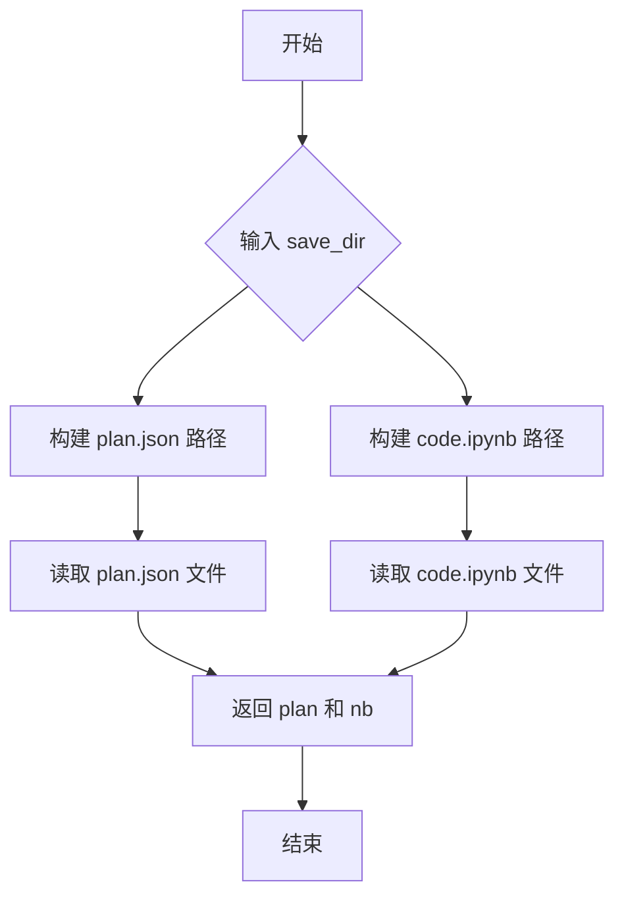

# `.\MetaGPT\metagpt\utils\recovery_util.py` 详细设计文档

该代码文件提供了用于保存和加载智能体（Role）执行轨迹（包括计划Plan和代码执行历史Notebook）的工具函数。它主要包含两个函数：`save_history` 用于将角色的计划（JSON格式）和代码执行历史（Jupyter Notebook格式）序列化并保存到指定目录；`load_history` 用于从指定目录加载先前保存的计划和代码执行历史，以便进行复盘或继续执行。

## 整体流程

```mermaid
graph TD
    A[开始] --> B{调用哪个函数?}
    B -- save_history --> C[获取当前时间戳]
    C --> D[创建以时间戳命名的输出目录]
    D --> E[将角色计划转为JSON并保存]
    E --> F[调用save_code_file保存Notebook]
    F --> G[返回保存路径]
    B -- load_history --> H[构建计划和Notebook文件路径]
    H --> I[读取并解析plan.json]
    I --> J[读取并解析code.ipynb]
    J --> K[返回(plan, nb)元组]
```

## 类结构

```
该文件不包含类定义，仅包含工具函数。
├── load_history (全局函数)
└── save_history (全局函数)
```

## 全局变量及字段


### `DATA_PATH`
    
一个常量路径，指向数据存储的基础目录。

类型：`pathlib.Path`
    


    

## 全局函数及方法

### `load_history`

从指定的保存目录加载计划和代码执行历史。

参数：

- `save_dir`：`str`，要从中加载历史的目录。

返回值：`Tuple`，包含加载的计划和笔记本。

#### 流程图



#### 带注释源码

```python
def load_history(save_dir: str = ""):
    """
    Load plan and code execution history from the specified save directory.

    Args:
        save_dir (str): The directory from which to load the history.

    Returns:
        Tuple: A tuple containing the loaded plan and notebook.
    """

    # 构建计划文件路径：save_dir/plan.json
    plan_path = Path(save_dir) / "plan.json"
    # 构建笔记本文件路径：save_dir/history_nb/code.ipynb
    nb_path = Path(save_dir) / "history_nb" / "code.ipynb"
    
    # 读取计划文件（JSON格式）
    plan = read_json_file(plan_path)
    # 读取笔记本文件（Jupyter Notebook格式）
    nb = nbformat.read(open(nb_path, "r", encoding="utf-8"), as_version=nbformat.NO_CONVERT)
    
    # 返回加载的计划和笔记本
    return plan, nb
```

### `save_history`

该函数用于保存角色（Role）的计划（plan）和代码执行历史（execute_code）到指定目录。它会创建一个以当前时间戳命名的输出目录，将计划保存为JSON文件，并将代码执行历史保存为Jupyter Notebook文件。

参数：

- `role`：`Role`，包含计划（planner.plan）和代码执行历史（execute_code.nb）的角色对象
- `save_dir`：`str`，保存历史的目录路径（当前版本未使用，保留为未来扩展）

返回值：`Path`，保存历史文件的目录路径

#### 流程图

```mermaid
flowchart TD
    A[开始] --> B[获取当前时间戳<br/>record_time]
    B --> C[构建保存路径<br/>save_path = DATA_PATH/output/{record_time}]
    C --> D[创建目录<br/>save_path.mkdir]
    D --> E[提取计划数据<br/>plan = role.planner.plan.dict]
    E --> F[保存计划到JSON文件<br/>plan.json]
    F --> G[保存代码历史到Jupyter Notebook<br/>code.ipynb]
    G --> H[返回保存路径<br/>save_path]
    H --> I[结束]
```

#### 带注释源码

```python
def save_history(role: Role, save_dir: str = ""):
    """
    保存计划（plan）和代码执行历史（execute_code）到指定目录。

    参数：
        role (Role): 包含计划（planner.plan）和代码执行历史（execute_code.nb）的角色对象
        save_dir (str): 保存历史的目录路径（当前版本未使用，保留为未来扩展）

    返回值：
        Path: 保存历史文件的目录路径
    """
    # 获取当前时间戳，格式化为"年-月-日_时-分-秒"
    record_time = datetime.now().strftime("%Y-%m-%d_%H-%M-%S")
    
    # 构建保存路径：DATA_PATH/output/{时间戳}
    save_path = DATA_PATH / "output" / f"{record_time}"

    # 创建目录，如果已存在则覆盖（exist_ok=True）
    save_path.mkdir(parents=True, exist_ok=True)

    # 从角色的planner.plan中提取计划数据并转换为字典
    plan = role.planner.plan.dict()

    # 将计划数据保存为JSON文件（plan.json）
    with open(save_path / "plan.json", "w", encoding="utf-8") as plan_file:
        json.dump(plan, plan_file, indent=4, ensure_ascii=False)

    # 保存代码执行历史为Jupyter Notebook文件
    save_code_file(name=Path(record_time), code_context=role.execute_code.nb, file_format="ipynb")
    
    # 返回保存路径
    return save_path
```

## 关键组件


### 历史数据加载与保存组件

该组件提供了从指定目录加载和保存计划与代码执行历史记录的功能，支持将角色（Role）的规划（plan）和执行代码（execute_code）序列化为JSON和Jupyter Notebook格式，并支持从这些格式反序列化以恢复历史状态。

### 文件路径管理组件

该组件负责构建和管理历史数据文件的存储路径，包括根据当前时间自动生成带时间戳的目录路径，并确保目录存在，以支持历史轨迹的持久化存储。

### 数据序列化与反序列化组件

该组件利用`json`和`nbformat`库，实现了将内存中的计划对象（字典格式）和Jupyter Notebook对象与磁盘文件之间的相互转换，确保数据在保存和加载过程中的格式一致性与完整性。

### 角色状态提取组件

该组件定义了从`Role`对象中提取关键状态（如`planner.plan`和`execute_code.nb`）的接口，作为历史数据保存的输入源，实现了角色状态与持久化逻辑的解耦。


## 问题及建议


### 已知问题

-   **硬编码的路径和文件名**：`save_history` 函数中，保存的 Jupyter Notebook 文件名被硬编码为 `"code.ipynb"`，而 `load_history` 函数则期望在 `"history_nb"` 子目录下找到同名文件。这种强耦合使得代码复用和路径配置变得不灵活，一旦保存逻辑或目录结构发生变化，加载功能就会失效。
-   **潜在的路径不一致**：`save_history` 函数将文件保存到 `DATA_PATH / "output" / f"{record_time}"` 目录下，而 `load_history` 函数则从用户传入的 `save_dir` 参数加载。虽然 `save_history` 返回了保存路径，但调用 `load_history` 时，用户需要手动构造出包含 `"history_nb"` 子目录的路径，这容易导致错误。
-   **缺乏错误处理**：`load_history` 函数直接打开文件并读取，如果文件不存在或格式错误（例如 `plan.json` 不是有效的 JSON，或 `.ipynb` 文件不是有效的 Notebook 格式），代码会抛出未处理的异常，影响程序健壮性。
-   **函数职责不单一**：`save_history` 函数同时负责生成基于时间戳的目录、保存计划（plan）和保存代码执行历史（notebook）。这违反了单一职责原则，使得函数难以测试和修改。

### 优化建议

-   **解耦路径配置**：将保存和加载时使用的关键路径（如 `history_nb` 子目录名、`code.ipynb` 文件名）提取为模块级常量或可配置参数。`save_history` 和 `load_history` 应基于同一套配置或约定来工作，确保保存和加载的路径是对称的。
-   **增强错误处理与日志记录**：在 `load_history` 函数中，使用 `try-except` 块捕获 `FileNotFoundError`、`json.JSONDecodeError` 和 `nbformat.read` 可能抛出的异常。在错误发生时，可以记录清晰的警告或错误日志，并返回 `None` 或空值，而不是让程序崩溃。
-   **重构 `save_history` 函数**：考虑将其拆分为更小的、职责单一的函数。例如，一个函数专门生成保存路径，一个函数保存 `plan.json`，另一个函数调用 `save_code_file` 保存 notebook。这可以提高代码的可测试性和可维护性。
-   **改进接口设计**：考虑让 `save_history` 和 `load_history` 的接口更加一致和易用。例如，`save_history` 可以返回一个包含所有必要路径信息的对象或字典，而 `load_history` 可以直接接受这个对象来加载，避免用户手动拼接路径。
-   **添加类型注解的完整性**：虽然已有部分类型注解，但可以更完整。例如，`load_history` 的返回值可以明确注解为 `Tuple[dict, nbformat.NotebookNode]`，`save_history` 的 `role` 参数可以进一步限定为包含特定属性（如 `planner.plan` 和 `execute_code.nb`）的角色类型，以提升代码的清晰度和 IDE 支持。


## 其它


### 设计目标与约束

本模块的设计目标是提供对角色（Role）的计划（plan）和代码执行历史（notebook）进行持久化保存和加载的功能。它作为元数据管理的一部分，旨在支持实验的可复现性和调试。主要约束包括：1) 依赖外部库（如nbformat）处理Jupyter Notebook格式；2) 文件路径结构相对固定，计划文件为`plan.json`，代码历史文件位于`history_nb`子目录下；3) 保存操作会覆盖同名的历史轨迹目录。

### 错误处理与异常设计

当前代码未显式处理文件操作（如`open`、`json.dump`、`nbformat.read`）可能引发的异常（如`FileNotFoundError`、`JSONDecodeError`、`OSError`）。这可能导致程序在文件不存在或格式错误时意外崩溃。建议增加`try-except`块来捕获这些异常，并根据上下文决定是向上层抛出更明确的异常、记录错误日志还是返回默认值（如空字典或空Notebook对象）。

### 数据流与状态机

数据流清晰且单向：
1.  **保存流程 (`save_history`)**：输入为`Role`对象和可选的`save_dir`（当前未使用）。从`Role`对象中提取`plan`和`execute_code.nb`，生成基于时间戳的目录路径，将`plan`序列化为JSON文件，将`nb`通过`save_code_file`保存为`.ipynb`文件。输出为保存目录的`Path`对象。
2.  **加载流程 (`load_history`)**：输入为`save_dir`路径。根据固定规则构造`plan.json`和`code.ipynb`的文件路径，分别读取并反序列化为Python对象（字典和`nbformat.NotebookNode`）。输出为这两个对象的元组。
模块本身不维护内部状态，所有操作都是无状态的纯函数。

### 外部依赖与接口契约

1.  **外部库依赖**：
    *   `json`: Python标准库，用于JSON序列化与反序列化。
    *   `nbformat`: 第三方库，用于读写Jupyter Notebook（`.ipynb`）文件。
    *   `pathlib.Path`: Python标准库，用于面向对象的路径操作。
    *   `datetime`: Python标准库，用于生成时间戳。
2.  **项目内部依赖**：
    *   `metagpt.const.DATA_PATH`: 常量，定义了项目数据根目录。
    *   `metagpt.roles.role.Role`: 类，作为`save_history`函数的参数，需提供`planner.plan`和`execute_code.nb`属性。
    *   `metagpt.utils.common.read_json_file`: 工具函数，用于读取JSON文件。
    *   `metagpt.utils.save_code.save_code_file`: 工具函数，用于保存代码文件（此处用于保存Notebook）。
3.  **接口契约**：
    *   `save_history`函数期望传入的`role`参数具有`role.planner.plan.dict()`和`role.execute_code.nb`属性。
    *   `load_history`函数期望`save_dir`目录下存在`plan.json`文件和`history_nb/code.ipynb`文件，且格式正确。
    *   两个函数都返回`pathlib.Path`对象或包含`pathlib.Path`的元组，与调用者约定使用Path对象进行后续路径操作。

### 配置与可扩展性

当前保存路径硬编码为`DATA_PATH / "output" / f"{record_time}"`，加载路径结构也相对固定。这缺乏灵活性。可以考虑：
1.  通过配置文件或环境变量允许用户自定义基础输出目录。
2.  将文件命名规则和子目录结构参数化，使得模块能够适应不同的持久化方案。
3.  `save_history`中未使用的`save_dir`参数提示了未来可能支持自定义保存路径的扩展点。

### 安全考虑

1.  **路径遍历**：`load_history`和`save_history`函数直接使用传入的`save_dir`或基于时间戳生成路径，如果`save_dir`来自不可信的用户输入，可能存在路径遍历风险，导致读取或写入系统敏感文件。建议对输入路径进行规范化（如使用`Path.resolve()`）和有效性检查。
2.  **文件覆盖**：`save_path.mkdir(parents=True, exist_ok=True)`会静默覆盖已存在的目录，可能导致历史数据丢失。在高价值实验场景下，可能需要更谨慎的策略，如检查目录是否存在并提示用户或自动添加序号后缀。
3.  **数据完整性**：保存操作（`json.dump`和`save_code_file`）非原子操作。如果在写入过程中发生中断（如程序崩溃、断电），可能导致`plan.json`和`code.ipynb`文件状态不一致。对于要求高一致性的场景，需要考虑事务性写入或生成完整性校验码。


    