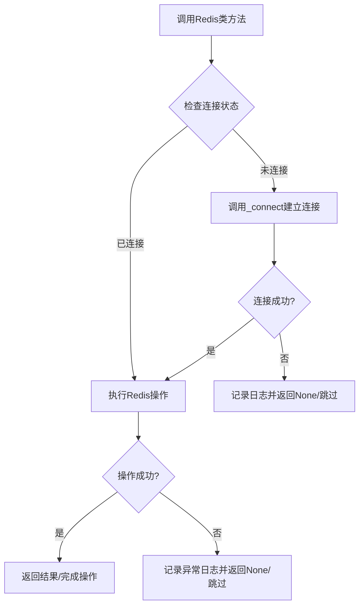
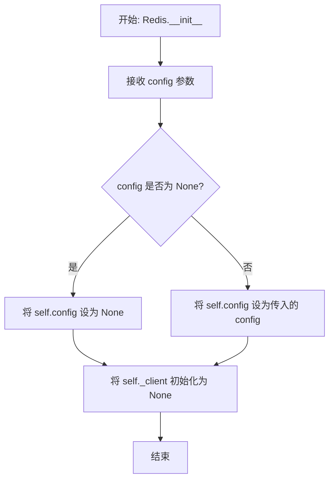
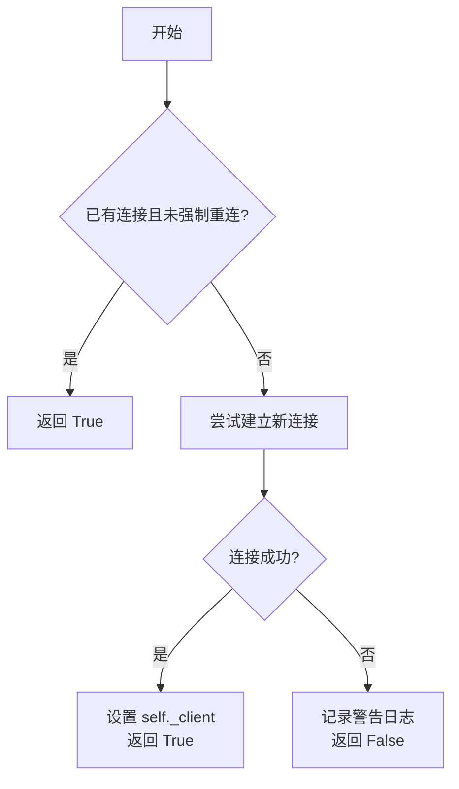
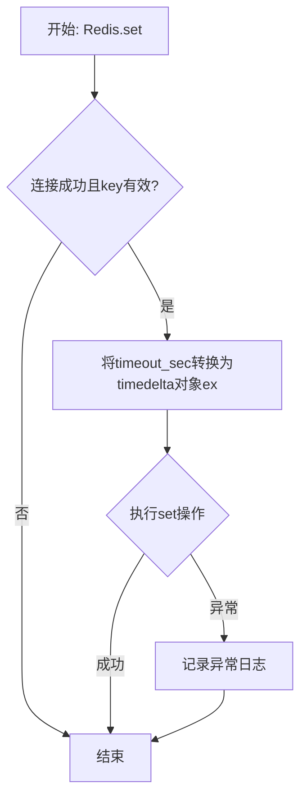
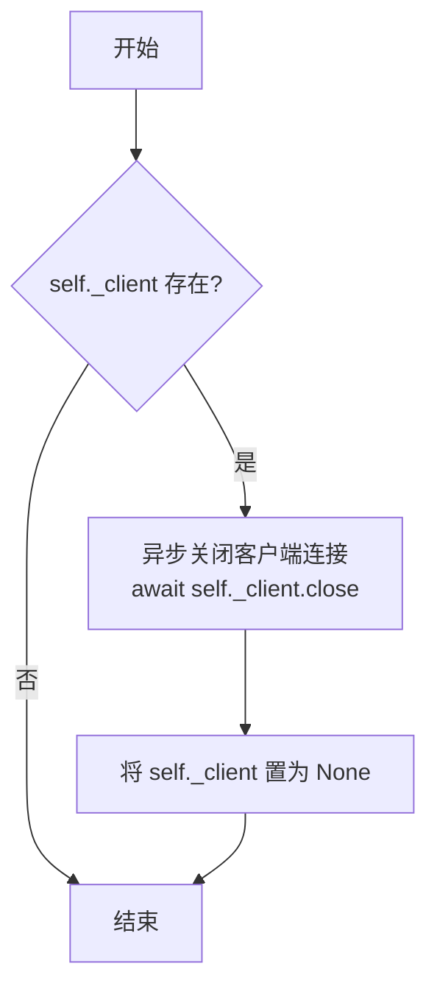

# `.\MetaGPT\metagpt\utils\redis.py` 详细设计文档

该代码实现了一个异步Redis客户端封装类，提供了连接管理、键值对存取和连接关闭等核心功能，旨在简化与Redis服务器的异步交互，并内置了连接池管理和异常处理机制。

## 整体流程



## 类结构

```
Redis (Redis客户端封装类)
├── __init__ (构造函数)
├── _connect (私有连接方法)
├── get (获取键值)
├── set (设置键值)
└── close (关闭连接)
```

## 全局变量及字段


### `Redis.config`
    
Redis连接配置对象，包含服务器地址、端口、认证信息等连接参数。

类型：`RedisConfig`
    


### `Redis._client`
    
Redis异步客户端实例，用于执行实际的Redis操作，初始化为None表示未连接状态。

类型：`aioredis.Redis | None`
    
    

## 全局函数及方法


### `Redis.__init__`

Redis 类的构造函数，用于初始化 Redis 客户端连接所需的配置。它接收一个可选的 RedisConfig 对象，用于配置 Redis 连接参数。如果未提供配置，则使用默认值（None）。此方法仅存储配置，实际的连接建立延迟到首次需要时（如调用 `get` 或 `set` 方法）通过 `_connect` 方法完成。

参数：

- `config`：`RedisConfig`，Redis 连接配置对象，包含主机、端口、用户名、密码、数据库等连接信息。如果为 None，则使用默认配置。

返回值：`None`，构造函数不返回任何值。

#### 流程图



#### 带注释源码

```python
def __init__(self, config: RedisConfig = None):
    # 存储传入的 Redis 配置对象，如果未提供则为 None。
    self.config = config
    # 初始化 Redis 异步客户端连接对象为 None。
    # 实际的连接将在首次需要时（惰性连接）通过 _connect 方法建立。
    self._client = None
```


### `Redis._connect`

该方法负责建立与Redis服务器的异步连接。它是一个私有方法，用于在需要时初始化Redis客户端连接。如果连接已存在且未强制重新连接，则直接返回成功；否则尝试根据配置建立新连接。连接成功返回True，失败返回False并记录警告日志。

参数：

- `force`：`bool`，可选参数，默认为False。如果为True，则强制重新建立连接，即使已有连接存在。

返回值：`bool`，连接成功返回True，失败返回False。

#### 流程图



#### 带注释源码

```python
async def _connect(self, force=False):
    # 检查是否已有客户端连接且未强制重新连接
    if self._client and not force:
        return True  # 已有连接，直接返回成功

    try:
        # 根据配置创建异步Redis客户端连接
        self._client = await aioredis.from_url(
            self.config.to_url(),  # 从配置生成连接URL
            username=self.config.username,  # 用户名
            password=self.config.password,  # 密码
            db=self.config.db,  # 数据库编号
        )
        return True  # 连接成功，返回True
    except Exception as e:
        # 连接失败，记录警告日志（不抛出异常，保持容错性）
        logger.warning(f"Redis initialization has failed:{e}")
    return False  # 连接失败，返回False
```


### `Redis.get`

该方法用于从Redis缓存中获取指定键（key）对应的值。它是一个异步方法，内部会确保Redis客户端连接已建立，然后执行GET命令。如果连接失败、键为空或执行过程中发生异常，则返回`None`。

参数：

-  `key`：`str`，要获取值的Redis键名。

返回值：`bytes | None`，如果成功获取到值，则返回对应的字节数据（bytes）；如果键不存在、连接失败、键为空或发生异常，则返回`None`。

#### 流程图

```mermaid
flowchart TD
    A[开始: Redis.get(key)] --> B{连接检查与参数校验}
    B -->|连接失败或key为空| C[返回 None]
    B -->|连接成功且key有效| D[执行 _client.get(key)]
    D --> E{执行成功?}
    E -->|是| F[返回获取的值 v]
    E -->|发生异常| G[记录异常日志]
    G --> C
```

#### 带注释源码

```python
async def get(self, key: str) -> bytes | None:
    # 1. 尝试建立Redis连接，如果连接失败或传入的key为空，则直接返回None
    if not await self._connect() or not key:
        return None
    try:
        # 2. 使用已连接的Redis客户端异步执行GET命令
        v = await self._client.get(key)
        # 3. 返回获取到的值（可能是bytes，如果key不存在则为None）
        return v
    except Exception as e:
        # 4. 如果执行过程中发生任何异常，记录详细的异常日志，并返回None
        logger.exception(f"{e}, stack:{traceback.format_exc()}")
        return None
```


### `Redis.set`

该方法用于向Redis服务器设置一个键值对，并支持设置可选的过期时间。

参数：

- `key`：`str`，要设置的键名
- `data`：`str`，要设置的字符串值
- `timeout_sec`：`int`，可选参数，键的过期时间（以秒为单位），默认为`None`表示永不过期

返回值：`None`，该方法没有返回值

#### 流程图



#### 带注释源码

```python
async def set(self, key: str, data: str, timeout_sec: int = None):
    # 1. 检查Redis连接是否成功建立，并验证key参数是否有效
    if not await self._connect() or not key:
        return  # 如果连接失败或key无效，则直接返回，不执行任何操作

    try:
        # 2. 将可选的过期时间（秒）转换为timedelta对象，如果未提供则设为None
        ex = None if not timeout_sec else timedelta(seconds=timeout_sec)
        # 3. 调用底层Redis客户端的set方法，设置键值对及可选的过期时间
        await self._client.set(key, data, ex=ex)
    except Exception as e:
        # 4. 如果执行过程中发生任何异常，记录详细的错误日志（包含堆栈信息）
        logger.exception(f"{e}, stack:{traceback.format_exc()}")
        # 注意：此处异常被捕获并记录后，方法静默结束，不向上抛出异常
```


### `Redis.close`

关闭 Redis 客户端连接。如果客户端实例存在，则异步关闭连接并将客户端引用置为 `None`，以确保资源被正确释放。

参数：
- 无

返回值：`None`，无返回值

#### 流程图



#### 带注释源码

```python
async def close(self):
    # 检查 Redis 客户端实例是否存在
    if not self._client:
        # 如果客户端不存在，直接返回，无需执行关闭操作
        return
    # 异步关闭 Redis 客户端连接
    await self._client.close()
    # 将客户端引用置为 None，释放资源并防止后续误用
    self._client = None
```


## 关键组件


### Redis 连接管理

负责管理与 Redis 服务器的异步连接，包括连接的初始化、惰性连接（首次使用时建立）以及连接关闭。通过 `_connect` 方法封装连接逻辑，确保在需要操作数据前连接已就绪。

### 配置驱动

通过 `RedisConfig` 类提供 Redis 服务器的连接配置（如 URL、用户名、密码、数据库索引），使 Redis 客户端的初始化参数可配置化，提高了代码的灵活性和可维护性。

### 异常处理与日志记录

在关键操作（如连接建立、数据读写）中捕获并记录异常，使用 `logger` 记录警告和异常堆栈信息，确保系统在 Redis 服务不可用时能够优雅降级，避免因单点故障导致整体服务中断。

### 数据存取操作

提供基础的异步 `get` 和 `set` 操作，支持字符串数据的读写。`set` 操作可选地支持设置过期时间，通过 `timeout_sec` 参数和 `timedelta` 实现。


## 问题及建议


### 已知问题

-   **连接管理逻辑存在缺陷**：`_connect` 方法在连接失败时返回 `False`，但调用方（如 `get`、`set`）并未根据此返回值进行有效的错误处理或重试。这可能导致在连接失败时，后续操作（如 `self._client.get`）在 `self._client` 为 `None` 的情况下被调用，从而引发 `AttributeError`。
-   **潜在的资源泄漏**：`close` 方法在关闭连接后没有确保连接池也被正确清理。虽然 `aioredis` 的 `close` 方法通常会处理，但在某些异常路径下（如 `_connect` 部分成功但客户端对象状态异常），可能无法彻底释放所有网络资源。
-   **异常处理过于宽泛**：`get` 和 `set` 方法捕获了所有 `Exception`，这可能会掩盖底层更具体的错误（如 `redis.ConnectionError`, `redis.TimeoutError`），不利于问题的诊断和针对性处理。
-   **缺乏连接健康检查与重连机制**：当前实现仅在操作前检查连接是否存在，但没有对现有连接的活性（如网络断开、服务器重启）进行验证。长生命周期的服务中，连接可能因故失效，导致后续操作失败。
-   **配置验证缺失**：`__init__` 方法接受一个可能为 `None` 的 `RedisConfig` 对象，但在 `_connect` 中直接使用其属性（如 `self.config.to_url()`），若 `config` 为 `None` 将导致 `AttributeError`。

### 优化建议

-   **重构连接与错误处理逻辑**：建议将 `_connect` 方法改为在连接失败时抛出明确的异常（如 `ConnectionError`），并在 `get`、`set` 等公开方法中捕获该异常，进行重试或返回明确的错误状态（如自定义的 `CacheError`）。同时，在执行 Redis 命令前，应检查 `self._client` 的有效性。
-   **实现连接池与生命周期管理**：考虑使用 `aioredis` 的连接池功能，并在 `close` 方法中显式调用 `await self._client.connection_pool.disconnect()` 以确保资源释放。可以为 `Redis` 类实现 `__aenter__` 和 `__aexit__` 方法，以支持异步上下文管理器，确保连接在使用后自动关闭。
-   **细化异常捕获**：在 `get` 和 `set` 方法中，应优先捕获 Redis 客户端库定义的特定异常（如 `aioredis.RedisError` 及其子类），并将其他未知异常向上抛出或至少记录更详细的错误类型。这有助于区分网络问题、命令错误和程序逻辑错误。
-   **增加连接健康检查**：在 `_connect` 方法或一个新的 `_ensure_connection` 方法中，成功建立连接后，可以执行一个简单的命令（如 `PING`）来验证连接的实际可用性。对于已存在的连接，在每次操作前或定期执行健康检查，并在失败时触发重连。
-   **添加配置验证与默认值**：在 `__init__` 方法中，如果 `config` 参数为 `None`，可以尝试从默认配置源（如环境变量、配置文件）加载，或提供一个合理的默认 `RedisConfig` 实例。同时，应验证配置对象的必需属性是否有效。
-   **考虑线程安全性**：虽然当前代码是异步的，但如果 `Redis` 实例在多个异步任务间共享，需确保 `_client` 的初始化和关闭操作是线程/任务安全的。可以使用锁（`asyncio.Lock`）来保护 `_connect` 和 `close` 中的状态变更。
-   **增强日志信息**：在连接成功、失败、重连等关键节点增加更详细的日志记录（如使用 `logger.info` 或 `logger.debug`），并考虑记录操作耗时，便于监控和性能分析。
-   **提供更丰富的 API**：根据业务需求，可以考虑封装更多的 Redis 命令（如 `hgetall`, `lpush`, `incr` 等），并提供批量操作、管道（pipeline）或事务（transaction）的支持，以提高使用便利性和性能。


## 其它


### 设计目标与约束

1.  **设计目标**：
    *   提供一个异步的、轻量级的Redis客户端封装，简化在MetaGPT项目中与Redis交互的代码。
    *   实现连接池管理，避免频繁创建和销毁连接带来的性能开销。
    *   提供基础的键值对（`get`/`set`）操作接口，并支持设置过期时间。
    *   确保操作的健壮性，通过异常捕获和日志记录来隔离Redis服务异常对主业务流程的影响。
    *   遵循依赖注入原则，通过`RedisConfig`类来管理连接配置，提高可测试性和配置灵活性。

2.  **设计约束**：
    *   必须使用`redis.asyncio`（aioredis）库以实现异步I/O，与MetaGPT项目的异步架构兼容。
    *   客户端实例的生命周期管理（如连接创建、关闭）由调用方负责，本类不提供单例或全局连接管理。
    *   当前版本仅封装了基础的字符串类型`get`和`set`操作，更复杂的数据结构（如Hash, List, Set）和命令（如发布订阅、事务）暂未支持。
    *   错误处理采用静默失败（返回`None`或忽略）并记录日志的策略，不向上抛出业务异常，以避免中断主流程。

### 错误处理与异常设计

1.  **异常来源**：
    *   **连接异常**：在`_connect`方法中，`aioredis.from_url`可能因网络问题、配置错误（如错误的URL、密码）或Redis服务不可用而抛出异常。
    *   **操作异常**：在`get`和`set`方法中，`_client.get`和`_client.set`可能因连接断开、命令执行错误（如内存不足、键类型不匹配）而抛出异常。

2.  **处理策略**：
    *   **连接阶段**：`_connect`方法捕获所有异常，记录警告日志（`logger.warning`），并返回`False`。调用方（`get`/`set`）根据返回值决定是否继续执行操作。
    *   **操作阶段**：`get`和`set`方法捕获所有异常，记录错误级别的异常详情（`logger.exception`，包含堆栈跟踪），并采取静默处理：`get`返回`None`，`set`直接返回。
    *   **资源清理**：`close`方法假设`_client`在正常或异常状态下都能安全调用`close()`，未进行异常捕获。调用方应确保在适当时候调用。

3.  **设计考量**：
    *   这种“防御式”设计确保了Redis操作的失败不会导致主程序崩溃，适用于缓存等非核心、可降级的场景。
    *   日志记录提供了足够的信息供运维排查问题。
    *   缺点是调用方无法区分“键不存在”和“操作失败”，两者都返回`None`。对于需要精确错误处理的场景，此设计可能不适用。

### 数据流与状态机

1.  **对象状态**：
    *   **初始状态**：`_client`为`None`。
    *   **连接中/已连接状态**：调用`_connect`成功后，`_client`指向一个有效的`aioredis.Redis`连接实例。
    *   **关闭状态**：调用`close`方法后，`_client`被置为`None`。

2.  **核心方法数据流**：
    *   `__init__`：输入`RedisConfig` -> 存储到`self.config`，`self._client`初始化为`None`。
    *   `_connect`：
        *   **输入**：`force`标志。
        *   **流程**：检查现有连接 -> 如需新建，使用`config`构建连接URL和参数 -> 调用`aioredis.from_url` -> 成功则更新`_client`并返回`True`，失败则记录日志并返回`False`。
        *   **输出**：布尔值（连接成功与否）。
    *   `get`：
        *   **输入**：键名`key`。
        *   **流程**：调用`_connect` -> 连接成功则执行`_client.get(key)` -> 成功则返回字节数据，失败则记录日志并返回`None`。任何环节失败（包括`key`为空）都返回`None`。
        *   **输出**：`bytes | None`。
    *   `set`：
        *   **输入**：键名`key`，值`data`，超时时间`timeout_sec`。
        *   **流程**：调用`_connect` -> 连接成功则将`timeout_sec`转换为`timedelta`对象`ex` -> 执行`_client.set(key, data, ex=ex)` -> 失败则记录日志。
        *   **输出**：`None`（无返回值）。
    *   `close`：
        *   **输入**：无。
        *   **流程**：如果`_client`存在，则调用其`close()`方法，然后将`_client`置为`None`。
        *   **输出**：`None`。

### 外部依赖与接口契约

1.  **外部库依赖**：
    *   `redis.asyncio` (别名为`aioredis`): 版本>=4.0.0。提供异步Redis客户端实现。这是核心运行时依赖。
    *   `metagpt.configs.redis_config.RedisConfig`: 项目内部配置类，用于提供连接参数（如URL、用户名、密码、数据库编号）。这是编译时/设计时依赖。

2.  **接口契约（对调用方）**：
    *   **初始化**：调用方需提供（或使用默认）`RedisConfig`实例来初始化`Redis`类。
    *   **异步上下文**：所有公开方法（`get`, `set`, `close`）均为异步，必须在异步环境中（如`async`函数内）调用。
    *   **资源管理**：调用方在使用完`Redis`实例后，应显式调用`await redis.close()`来关闭连接，释放资源。建议使用`async with`语句（虽然当前类未实现上下文管理器协议，但可考虑未来添加）。
    *   **错误处理**：调用方需知晓`get`方法在出错或键不存在时均返回`None`；`set`方法失败时静默无提示，需通过日志监控。
    *   **线程安全**：未声明。由于基于异步I/O和连接池，在单线程异步事件循环中使用是安全的。不支持多线程并发调用。

3.  **被依赖接口（对Redis服务器）**：
    *   **协议**：遵循Redis序列化协议。
    *   **命令**：当前实现仅使用了`GET`和`SET`命令。
    *   **连接**：支持通过URL连接，支持认证和数据库选择。

    