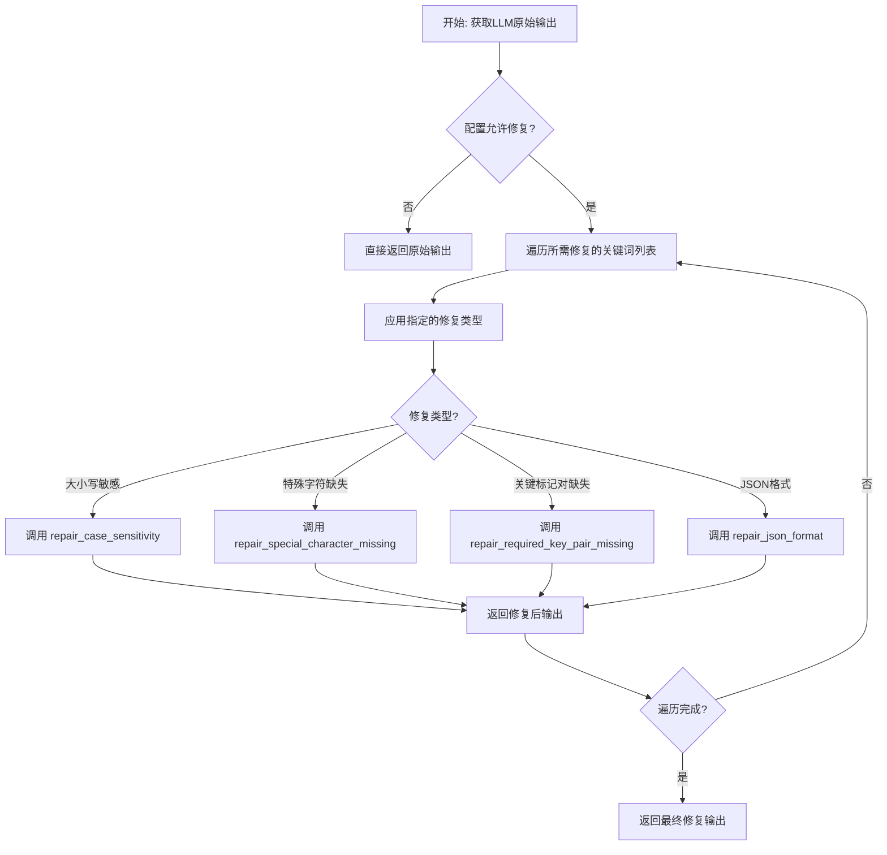
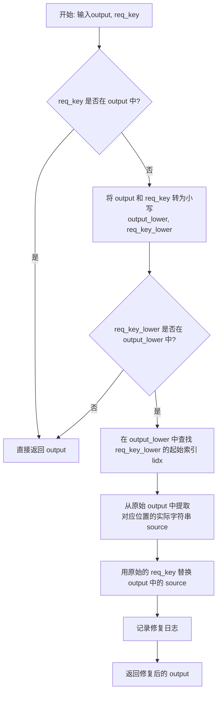
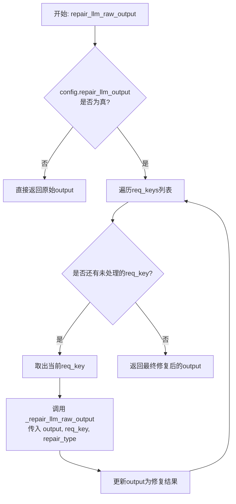
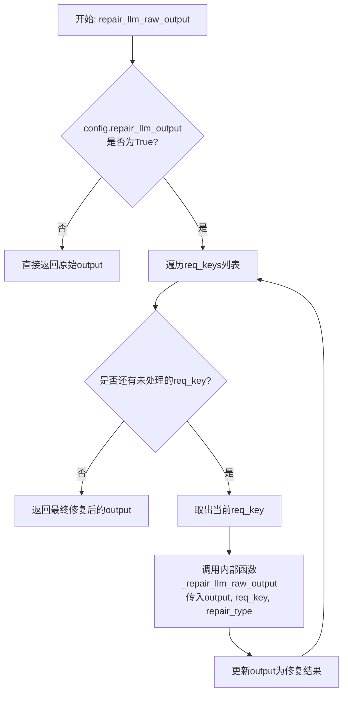

# `.\MetaGPT\metagpt\utils\repair_llm_raw_output.py` 详细设计文档

该代码文件提供了一个用于修复大型语言模型（LLM）原始输出的工具集，主要处理开源模型输出中常见的格式错误，如大小写敏感性问题、JSON格式错误、特殊标记缺失等，以提高下游任务（如JSON解析）的成功率。

## 整体流程



## 类结构

```
RepairType (枚举类)
├── CS (大小写敏感)
├── RKPM (关键标记对缺失)
├── SCM (特殊字符缺失)
└── JSON (JSON格式)
全局函数
├── repair_case_sensitivity
├── repair_special_character_missing
├── repair_required_key_pair_missing
├── repair_json_format
├── _repair_llm_raw_output
├── repair_llm_raw_output
├── repair_invalid_json
├── run_after_exp_and_passon_next_retry
├── repair_stop_after_attempt
├── retry_parse_json_text
├── extract_content_from_output
├── extract_state_value_from_output
└── repair_escape_error
```

## 全局变量及字段


    

## 全局函数及方法


### `repair_case_sensitivity`

该函数用于修复大语言模型（LLM）原始输出中，因大小写不敏感导致的特定关键词（`req_key`）匹配失败问题。其核心逻辑是：当原始输出中不包含精确的 `req_key` 时，在忽略大小写的情况下查找该关键词。如果找到，则用原始的、大小写正确的 `req_key` 替换输出中对应的小写（或大小写不一致）部分。

参数：

-  `output`：`str`，需要修复的原始文本字符串。
-  `req_key`：`str`，期望在输出中精确出现的关键词。

返回值：`str`，修复后的文本字符串。

#### 流程图



#### 带注释源码

```python
def repair_case_sensitivity(output: str, req_key: str) -> str:
    """
    usually, req_key is the key name of expected json or markdown content, it won't appear in the value part.
    fix target string `"Shared Knowledge": ""` but `"Shared knowledge": ""` actually
    """
    # 1. 检查精确匹配：如果req_key已经存在于output中，则无需修复，直接返回。
    if req_key in output:
        return output

    # 2. 准备不敏感匹配：将字符串转换为小写以便进行不区分大小写的搜索。
    output_lower = output.lower()
    req_key_lower = req_key.lower()

    # 3. 执行不敏感匹配检查：检查小写版本的关键词是否存在于小写版本的输出中。
    if req_key_lower in output_lower:
        # 4. 定位并替换：找到小写关键词的起始位置，并从原始输出中提取对应位置的子串。
        lidx = output_lower.find(req_key_lower)
        source = output[lidx : lidx + len(req_key_lower)]
        # 用正确大小写的req_key替换掉output中那个大小写不匹配的source部分。
        output = output.replace(source, req_key)
        # 5. 记录修复操作日志。
        logger.info(f"repair_case_sensitivity: {req_key}")

    # 6. 返回修复后的（或未修改的）输出。
    return output
```


### `repair_special_character_missing`

该函数用于修复大语言模型（LLM）原始输出中特定标记对（如 `[CONTENT]` 和 `[/CONTENT]`）缺失特殊字符（如 `/`）的问题。它通过查找目标标记的最后一个出现位置，并为其添加缺失的特殊字符来完成修复。

参数：

-  `output`：`str`，需要修复的原始文本字符串。
-  `req_key`：`str`，默认为 `"[/CONTENT]"`，期望在文本中成对出现的完整目标标记（例如 `[/CONTENT]`）。

返回值：`str`，修复后的文本字符串。

#### 流程图

```mermaid
flowchart TD
    A[开始: repair_special_character_missing(output, req_key)] --> B{req_key 是否已在 output 中?};
    B -- 是 --> C[返回原始 output];
    B -- 否 --> D[定义特殊字符列表 sc_arr = ['/']];
    D --> E[遍历 sc_arr 中的每个特殊字符 sc];
    E --> F[从 req_key 中移除 sc，得到 req_key_pure];
    F --> G{req_key_pure 是否在 output 中<br>且出现次数 > 1?};
    G -- 否 --> H[继续遍历或结束];
    G -- 是 --> I[找到 req_key_pure 在 output 中<br>最后一次出现的位置 ridx];
    I --> J[在 ridx 处将 req_key_pure 替换为 req_key];
    J --> K[记录修复日志];
    K --> L[返回修复后的 output];
    H --> C;
```

#### 带注释源码

```python
def repair_special_character_missing(output: str, req_key: str = "[/CONTENT]") -> str:
    """
    fix
        1. target string `[CONTENT] xx [CONTENT] xxx [CONTENT]` lacks `/` in the last `[CONTENT]`
        2. target string `xx [CONTENT] xxx [CONTENT] xxxx` lacks `/` in the last `[CONTENT]`
    """
    # 定义需要检查/修复的特殊字符列表，当前只处理 '/' 字符
    sc_arr = ["/"]

    # 如果目标标记已经存在于输出中，则无需修复，直接返回
    if req_key in output:
        return output

    # 遍历特殊字符列表（目前只有 '/'）
    for sc in sc_arr:
        # 从目标标记中移除特殊字符，得到其“纯净”版本
        # 例如，req_key='[/CONTENT]' -> req_key_pure='[CONTENT]'
        req_key_pure = req_key.replace(sc, "")
        # 计算纯净版本标记在输出中出现的次数
        appear_cnt = output.count(req_key_pure)
        # 检查条件：纯净标记存在且出现次数大于1（表明可能缺少闭合标记）
        if req_key_pure in output and appear_cnt > 1:
            # 假设带有特殊字符的标记（如 [/CONTENT]）通常出现在末尾作为闭合标记
            # 因此，找到纯净标记最后一次出现的位置
            ridx = output.rfind(req_key_pure)
            # 在该位置将纯净标记替换为完整的带特殊字符的目标标记
            # 使用字符串切片进行精确替换
            output = f"{output[:ridx]}{req_key}{output[ridx + len(req_key_pure):]}"
            # 记录修复日志，便于调试和追踪
            logger.info(f"repair_special_character_missing: {sc} in {req_key_pure} as position {ridx}")

    # 返回修复后的输出字符串
    return output
```


### `repair_required_key_pair_missing`

该函数用于修复大语言模型（LLM）原始输出中缺失的成对关键标记。它确保输出文本中，指定的关键标记（如 `[CONTENT]`）与其对应的闭合标记（如 `[/CONTENT]`）成对出现。如果缺失起始标记，则在文本开头添加；如果缺失闭合标记，则尝试在文本末尾或一个潜在的JSON结构体后添加。

参数：

-  `output`：`str`，需要修复的原始输出字符串。
-  `req_key`：`str`，指定的关键标记，例如 `[CONTENT]` 或 `[/CONTENT]`。

返回值：`str`，修复后的输出字符串。

#### 流程图

```mermaid
flowchart TD
    A[开始: repair_required_key_pair_missing] --> B{req_key 格式为 [xxx]?}
    B -- 否 --> Z[返回原始 output]
    B -- 是 --> C{req_key 包含 '/'?}
    C -- 是<br>如 [/CONTENT] --> D[左标记 left_key = req_key.replace('/', '')<br>右标记 right_key = req_key]
    C -- 否<br>如 [CONTENT] --> E[左标记 left_key = req_key<br>右标记 right_key = req_key 前插入 '/']
    D --> F{left_key 在 output 中?}
    E --> F
    F -- 否 --> G[在 output 开头添加 left_key + 换行]
    F -- 是 --> H{right_key 在 output 中?}
    G --> H
    H -- 是 --> Z
    H -- 否 --> I{output 以 '}' 或 ']' 结尾<br>且不以 left_key 结尾?}
    I -- 是 --> J[在 output 末尾添加 换行 + right_key]
    I -- 否 --> K[调用 judge_potential_json<br>检查末尾潜在JSON]
    K --> L{找到潜在JSON且 output 不以 left_key 结尾?}
    L -- 是 --> M[用 sub_content + 换行 + right_key 替换 output]
    L -- 否 --> Z
    J --> Z
    M --> Z
```

#### 带注释源码

```python
def repair_required_key_pair_missing(output: str, req_key: str = "[/CONTENT]") -> str:
    """
    implement the req_key pair in the begin or end of the content
        req_key format
            1. `[req_key]`, and its pair `[/req_key]`
            2. `[/req_key]`, and its pair `[req_key]`
    """
    sc = "/"  # special char
    # 检查 req_key 是否为 [xxx] 格式
    if req_key.startswith("[") and req_key.endswith("]"):
        # 根据 req_key 是否包含 '/' 来确定左标记和右标记
        if sc in req_key:
            left_key = req_key.replace(sc, "")  # `[/req_key]` -> `[req_key]`
            right_key = req_key
        else:
            left_key = req_key
            right_key = f"{req_key[0]}{sc}{req_key[1:]}"  # `[req_key]` -> `[/req_key]`

        # 如果左标记缺失，在输出开头添加
        if left_key not in output:
            output = left_key + "\n" + output
        # 如果右标记缺失，尝试在合适位置添加
        if right_key not in output:

            def judge_potential_json(routput: str, left_key: str) -> Union[str, None]:
                """辅助函数：从字符串末尾向前查找左标记，并尝试提取一个完整的JSON对象或数组"""
                ridx = routput.rfind(left_key)
                if ridx < 0:
                    return None
                sub_output = routput[ridx:]
                idx1 = sub_output.rfind("}")
                idx2 = sub_output.rindex("]")
                idx = idx1 if idx1 >= idx2 else idx2
                sub_output = sub_output[: idx + 1]
                return sub_output

            # 情况1：如果输出以 '}' 或 ']' 结尾，且不是以 left_key 结尾，则在末尾添加右标记
            if output.strip().endswith("}") or (output.strip().endswith("]") and not output.strip().endswith(left_key)):
                # # avoid [req_key]xx[req_key] case to append [/req_key]
                output = output + "\n" + right_key
            # 情况2：如果输出末尾存在一个潜在的JSON结构，且不是以 left_key 结尾，则在该JSON结构后添加右标记
            elif judge_potential_json(output, left_key) and (not output.strip().endswith(left_key)):
                sub_content = judge_potential_json(output, left_key)
                output = sub_content + "\n" + right_key

    return output
```


### `repair_json_format`

修复JSON格式的字符串，处理常见的格式错误，如多余的括号、注释等。

参数：

- `output`：`str`，需要修复的原始JSON字符串

返回值：`str`，修复后的JSON字符串

#### 流程图

```mermaid
flowchart TD
    A[开始] --> B[去除字符串首尾空白]
    B --> C{是否以'[{'开头?}
    C -- 是 --> D[移除开头的'[']
    C -- 否 --> E{是否以'}]'结尾?}
    E -- 是 --> F[移除结尾的']']
    E -- 否 --> G{是否以'{'开头且以']'结尾?}
    G -- 是 --> H[将结尾的']'替换为'}']
    G -- 否 --> I[按行分割字符串]
    I --> J[遍历每一行]
    J --> K{是否包含注释?}
    K -- 是 --> L[移除注释部分]
    K -- 否 --> M[保留原行]
    L --> M
    M --> N[收集处理后的行]
    N --> O[合并为新的字符串]
    O --> P[返回修复后的字符串]
    D --> I
    F --> I
    H --> I
```

#### 带注释源码

```python
def repair_json_format(output: str) -> str:
    """
    修复JSON格式的常见问题：
    1. 移除多余的'['或']'字符
    2. 移除JSON字符串中的注释
    """
    # 去除字符串首尾的空白字符
    output = output.strip()

    # 处理以'[{'开头的字符串，移除多余的'['
    if output.startswith("[{"):
        output = output[1:]
        logger.info(f"repair_json_format: {'[{'}")
    # 处理以'}]'结尾的字符串，移除多余的']'
    elif output.endswith("}]"):
        output = output[:-1]
        logger.info(f"repair_json_format: {'}]'}")
    # 处理以'{'开头且以']'结尾的字符串，将结尾的']'替换为'}'
    elif output.startswith("{") and output.endswith("]"):
        output = output[:-1] + "}"

    # 按行分割字符串，处理每行中的注释
    arr = output.split("\n")
    new_arr = []
    for json_line in arr:
        # 查找注释位置，确保不在字符串值内部
        comment_index = -1
        for match in re.finditer(r"(\".*?\"|\'.*?\')|(#|//)", json_line):
            if match.group(1):  # 如果是字符串值，跳过
                continue
            if match.group(2):  # 如果是注释，记录位置
                comment_index = match.start(2)
                break
        # 如果找到注释，移除注释部分
        if comment_index != -1:
            json_line = json_line[:comment_index].rstrip()
        new_arr.append(json_line)
    # 重新组合处理后的行
    output = "\n".join(new_arr)
    return output
```


### `repair_llm_raw_output`

该函数是修复LLM原始输出的主入口函数。它接收LLM的原始输出字符串、一组期望的关键词、可选的修复类型和配置对象，并返回修复后的字符串。其核心逻辑是遍历所有期望的关键词，对每个关键词调用内部修复函数 `_repair_llm_raw_output` 进行一系列指定的修复操作（如大小写敏感、缺失特殊字符、缺失关键对等）。修复行为受全局配置 `config.repair_llm_output` 控制。

参数：

-  `output`：`str`，需要修复的LLM原始输出字符串。
-  `req_keys`：`list[str]`，一个字符串列表，包含期望在输出中出现的特定关键词（例如JSON键名或标记标签）。
-  `repair_type`：`RepairType`，可选参数，指定要执行的修复类型。如果为 `None`，则默认执行除JSON格式修复外的所有修复。
-  `config`：`Optional[Config]`，可选参数，配置对象，用于控制是否启用修复功能。如果为 `None`，则使用默认配置。

返回值：`str`，修复后的输出字符串。

#### 流程图



#### 带注释源码

```python
def repair_llm_raw_output(
    output: str, req_keys: list[str], repair_type: RepairType = None, config: Optional[Config] = None
) -> str:
    """
    in open-source llm model, it usually can't follow the instruction well, the output may be incomplete,
    so here we try to repair it and use all repair methods by default.
    typical case
        1. case sensitivity
            target: "Original Requirements"
            output: "Original requirements"
        2. special character missing
            target: [/CONTENT]
            output: [CONTENT]
        3. json format
            target: { xxx }
            output: { xxx }]
    """
    # 获取配置，如果未提供则使用默认配置
    config = config if config else Config.default()
    # 检查配置是否启用了LLM输出修复功能
    if not config.repair_llm_output:
        return output  # 如果未启用，直接返回原始输出

    # 对非OpenAI模型（通常指开源模型）的输出进行修复
    # 遍历所有期望的关键词
    for req_key in req_keys:
        # 对每个关键词调用内部修复函数，并更新输出
        output = _repair_llm_raw_output(output=output, req_key=req_key, repair_type=repair_type)
    # 返回最终修复后的输出
    return output
```


### `repair_llm_raw_output`

该函数是修复大语言模型（LLM）原始输出的主入口函数。它通过遍历一组给定的关键字符串（`req_keys`），并应用指定的修复类型（如大小写敏感、缺失特殊字符等），来尝试修复LLM输出中常见的格式错误，使其符合预期的结构（如JSON格式或特定标记对）。修复行为受全局配置控制。

参数：

-  `output`：`str`，需要修复的原始LLM输出字符串。
-  `req_keys`：`list[str]`，一个关键字符串列表，用于指导修复过程（例如，期望的JSON键名或标记对如`[CONTENT]`）。
-  `repair_type`：`RepairType`，可选，指定要应用的修复类型。如果为`None`，则默认应用除`JSON`外的所有修复类型。
-  `config`：`Optional[Config]`，可选，配置对象，用于控制是否启用修复功能。如果为`None`，则使用默认配置。

返回值：`str`，修复后的输出字符串。

#### 流程图



#### 带注释源码

```python
def repair_llm_raw_output(
    output: str, req_keys: list[str], repair_type: RepairType = None, config: Optional[Config] = None
) -> str:
    """
    in open-source llm model, it usually can't follow the instruction well, the output may be incomplete,
    so here we try to repair it and use all repair methods by default.
    typical case
        1. case sensitivity
            target: "Original Requirements"
            output: "Original requirements"
        2. special character missing
            target: [/CONTENT]
            output: [CONTENT]
        3. json format
            target: { xxx }
            output: { xxx }]
    """
    # 步骤1: 获取配置。如果未提供config参数，则使用默认配置。
    config = config if config else Config.default()
    # 步骤2: 检查配置中是否启用了LLM输出修复功能。
    if not config.repair_llm_output:
        # 如果未启用，直接返回原始输出，不进行任何修复。
        return output

    # 步骤3: 对非OpenAI模型（通常指开源模型）的输出进行修复。
    # 遍历提供的所有关键字符串（req_keys）。
    for req_key in req_keys:
        # 对每个关键字符串，调用内部修复函数进行处理。
        # 将当前输出、当前关键字符串和指定的修复类型传入。
        # 函数返回修复后的字符串，并更新output变量，以便下一个req_key基于已修复的结果继续处理。
        output = _repair_llm_raw_output(output=output, req_key=req_key, repair_type=repair_type)
    # 步骤4: 返回最终修复完成的输出字符串。
    return output
```


### `repair_invalid_json`

该函数用于修复LLM输出中导致JSON解析失败的常见格式错误。它通过分析JSON解码错误信息，定位出错的行和列，然后针对特定错误模式（如多余的括号、缺失的逗号、引号问题等）进行字符串级别的修复，以生成一个可以被标准JSON解析器解析的字符串。

参数：

-  `output`：`str`，原始的、包含格式错误的JSON字符串。
-  `error`：`str`，JSON解析器抛出的异常信息字符串，用于定位错误位置和类型。

返回值：`str`，修复后的JSON字符串。

#### 流程图

```mermaid
flowchart TD
    A[开始: repair_invalid_json(output, error)] --> B{错误信息中<br>是否包含行/列号?}
    B -- 否 --> C[返回原始output]
    B -- 是 --> D[提取行号(line_no)与列号(col_no)]
    D --> E[预处理output<br>替换三引号为双引号]
    E --> F[按行分割output为数组arr]
    F --> G[获取错误行 rline = arr[line_no]]
    G --> H{基于错误位置与内容<br>判断错误类型并修复}
    
    H --> I1[类型1: 行以“], ”结尾]
    I1 --> J1[修复: 移除多余的“]”]
    
    H --> I2[类型2: 行以“}, ”结尾<br>且output不以“}, ”结尾]
    I2 --> J2[修复: 移除多余的“}”]
    
    H --> I3[类型3: 行以“}, ”结尾<br>且output以“}, ”结尾]
    I3 --> J3[修复: 移除行尾的“,”]
    
    H --> I4[类型4: 错误位置是引号<br>且行以引号开头<br>且行中无“,”]
    I4 --> J4[修复: 在行首添加“,”]
    
    H --> I5[类型5: 错误位置前一个字符是引号]
    I5 --> J5[修复: 在引号前及<br>下一个匹配引号前添加转义符“\\”]
    
    H --> I6[类型6: 行中无“,”且无引号]
    I6 --> J6[修复: 在行尾添加“\", ”]
    
    H --> I7[类型7: 行不以“,”结尾]
    I7 --> J7[修复: 在行尾添加“,”]
    
    H --> I8[类型8: 行仅为“,”]
    I8 --> J8[修复: 在行首添加引号]
    
    H --> I9[类型9: 行以“\", ”结尾]
    I9 --> J9[修复: 将“\", ”替换为“', ”]
    
    H --> I10[类型10: 其他情况]
    I10 --> J10[修复: 保持原行不变]
    
    J1 --> K
    J2 --> K
    J3 --> K
    J4 --> K
    J5 --> K
    J6 --> K
    J7 --> K
    J8 --> K
    J9 --> K
    J10 --> K
    
    K[将修复后的行 new_line<br>写回数组 arr[line_no]]
    K --> L[将数组合并为新字符串 output]
    L --> M[记录修复日志]
    M --> N[返回修复后的 output]
```

#### 带注释源码

```python
def repair_invalid_json(output: str, error: str) -> str:
    """
    repair the situation like there are extra chars like
    error examples
        example 1. json.decoder.JSONDecodeError: Expecting ',' delimiter: line 154 column 1 (char 2765)
        example 2. xxx.JSONDecodeError: Expecting property name enclosed in double quotes: line 14 column 1 (char 266)
    """
    # 正则表达式，用于从错误信息中提取行号和列号
    pattern = r"line ([0-9]+) column ([0-9]+)"

    # 在错误信息中搜索行号和列号
    matches = re.findall(pattern, error, re.DOTALL)
    if len(matches) > 0:
        # 提取行号和列号（转换为0起始的索引）
        line_no = int(matches[0][0]) - 1
        col_no = int(matches[0][1]) - 1

        # 预处理：将三引号替换为双引号，因为CustomDecoder可以处理单双引号混用
        output = output.replace('"""', '"').replace("'''", '"')
        # 将输出按行分割，便于定位
        arr = output.split("\n")
        rline = arr[line_no]  # 原始的错误行（保留前导空格）
        line = arr[line_no].strip()  # 去除前后空格后的错误行

        # 根据错误行的特征，应用不同的修复策略
        if line.endswith("],"):
            # 问题：行尾有多余的']'字符（例如：`"key": value],`）
            new_line = line.replace("]", "")
        elif line.endswith("},") and not output.endswith("},"):
            # 问题：行尾有多余的'}'字符，且整个输出不以`},`结尾
            new_line = line.replace("}", "")
        elif line.endswith("},") and output.endswith("},"):
            # 问题：行尾是`},`，但整个输出也以`},`结尾，可能是对象结束符后多余的逗号
            new_line = line[:-1]  # 移除最后一个字符（即逗号）
        elif (rline[col_no] in ["'", '"']) and (line.startswith('"') or line.startswith("'")) and "," not in line:
            # 问题：错误位置是引号，行以引号开头，且行内没有逗号。可能是缺失了分隔逗号。
            new_line = f",{line}"
        elif col_no - 1 >= 0 and rline[col_no - 1] in ['"', "'"]:
            # 问题：错误位置前一个字符是引号，可能是字符串内的转义问题（如缺失反斜杠）。
            # 例如：字符串中包含未转义的引号 `"It's "great""`。
            char = rline[col_no - 1]  # 引号字符
            # 查找下一个相同引号的位置
            nearest_char_idx = rline[col_no:].find(char)
            # 在当前位置的引号前和下一个匹配引号前插入转义反斜杠
            new_line = (
                rline[: col_no - 1]
                + "\\"
                + rline[col_no - 1 : col_no + nearest_char_idx]
                + "\\"
                + rline[col_no + nearest_char_idx :]
            )
        elif '",' not in line and "," not in line and '"' not in line:
            # 问题：行中没有引号和逗号，可能是一个未结束的字符串键或值。
            # 修复：在行尾添加 `",`，假设它是一个字符串值。
            new_line = f'{line}",'
        elif not line.endswith(","):
            # 问题：行尾缺少逗号分隔符（在JSON对象或数组内部）。
            new_line = f"{line},"
        elif "," in line and len(line) == 1:
            # 问题：行只有一个逗号，可能是一个孤立的、未引用的键或值。
            new_line = f'"{line}'
        elif '",' in line:
            # 问题：行以 `",` 结尾，但可能应该是单引号？这里将双引号替换为单引号。
            # 注意：此规则可能针对特定模型输出模式，通用性需验证。
            new_line = line[:-2] + "',"
        else:
            # 默认情况：无法识别特定模式，保持原行不变。
            new_line = line

        # 用修复后的行替换原数组中的错误行
        arr[line_no] = new_line
        # 将数组合并回字符串
        output = "\n".join(arr)
        # 记录修复日志
        logger.info(f"repair_invalid_json, raw error: {error}")

    # 返回修复后的字符串（如果未匹配到行号，则返回原始字符串）
    return output
```


### `run_after_exp_and_passon_next_retry`

这是一个工厂函数，用于生成一个供 `tenacity` 重试装饰器使用的 `after` 回调函数。该回调函数的主要职责是：当解析 JSON 失败时，捕获异常信息，尝试修复导致解析失败的原始输出字符串，并将修复后的字符串传递到下一次重试中。

参数：

-  `logger`：`loguru.Logger`，用于记录日志的 logger 对象。

返回值：`Callable[["RetryCallState"], None]`，返回一个接受 `RetryCallState` 对象作为参数、无返回值的回调函数。

#### 流程图

```mermaid
flowchart TD
    A[开始: run_and_passon(retry_state)] --> B{retry_state.outcome.failed?};
    B -- 否 --> Z[结束];
    B -- 是 --> C{从retry_state中<br>提取原始输出字符串func_param_output};
    C --> D[从retry_state.outcome.exception()<br>提取异常信息exp_str];
    D --> E[调用 repair_invalid_json<br>修复func_param_output];
    E --> F[将修复后的字符串<br>写回retry_state.kwargs['output']];
    F --> G[记录日志];
    G --> Z;
```

#### 带注释源码

```python
def run_after_exp_and_passon_next_retry(logger: "loguru.Logger") -> Callable[["RetryCallState"], None]:
    # 定义并返回一个内部函数，该函数符合 tenacity.after 回调的签名
    def run_and_passon(retry_state: "RetryCallState") -> None:
        """
        RetryCallState example
            {
                "start_time":143.098322024,
                "retry_object":"<Retrying object at 0x7fabcaca25e0 (stop=<tenacity.stop.stop_after_attempt ... >)>",
                "fn":"<function retry_parse_json_text_v2 at 0x7fabcac80ee0>",
                "args":"(\"tag:[/CONTENT]\",)",  # function input args
                "kwargs":{},                     # function input kwargs
                "attempt_number":1,              # retry number
                "outcome":"<Future at xxx>",  # type(outcome.result()) = "str", type(outcome.exception()) = "class"
                "outcome_timestamp":143.098416904,
                "idle_for":0,
                "next_action":"None"
            }
        """
        # 获取全局配置
        config = Config.default()
        # 检查上一次调用是否失败（即抛出了异常）
        if retry_state.outcome.failed:
            # 尝试从重试状态中获取原始的输出字符串参数
            if retry_state.args:
                # # can't be used as args=retry_state.args
                func_param_output = retry_state.args[0]
            elif retry_state.kwargs:
                func_param_output = retry_state.kwargs.get("output", "")
            # 获取异常的字符串表示，其中可能包含错误位置信息（如行号、列号）
            exp_str = str(retry_state.outcome.exception())

            # 根据配置决定日志信息
            fix_str = "try to fix it, " if config.repair_llm_output else ""
            logger.warning(
                f"parse json from content inside [CONTENT][/CONTENT] failed at retry "
                f"{retry_state.attempt_number}, {fix_str}exp: {exp_str}"
            )

            # 核心修复逻辑：利用异常信息 exp_str 来指导修复原始输出 func_param_output
            repaired_output = repair_invalid_json(func_param_output, exp_str)
            # 将修复后的输出字符串写回 retry_state 的 kwargs 中，
            # 这样下一次重试时，被装饰的函数（如 retry_parse_json_text）将使用修复后的字符串作为输入
            retry_state.kwargs["output"] = repaired_output

    return run_and_passon
```


### `repair_stop_after_attempt`

该函数是一个用于`tenacity`重试库的自定义停止条件（stop condition）生成器。它根据全局配置`Config.default().repair_llm_output`的值，动态决定重试次数。如果修复功能开启，则允许最多3次重试；如果修复功能关闭，则立即停止重试（即重试0次）。

参数：
- `retry_state`：`tenacity.RetryCallState`，`tenacity`重试库在每次重试尝试时传入的状态对象，包含当前重试的上下文信息（如尝试次数、函数参数、异常等）。

返回值：`tenacity.stop.stop_after_attempt`，一个`tenacity`停止条件对象，用于决定是否继续重试。

#### 流程图

```mermaid
flowchart TD
    A[开始: 调用 repair_stop_after_attempt(retry_state)] --> B{判断配置<br>Config.default().repair_llm_output}
    B -- True --> C[返回 stop_after_attempt(3)<br>允许最多3次重试]
    B -- False --> D[返回 stop_after_attempt(0)<br>立即停止重试]
    C --> E[结束]
    D --> E
```

#### 带注释源码

```python
def repair_stop_after_attempt(retry_state):
    # 根据全局配置决定重试次数
    # 如果 repair_llm_output 为 True，则允许最多3次重试，否则重试0次（立即停止）
    return stop_after_attempt(3 if Config.default().repair_llm_output else 0)(retry_state)
```


### `retry_parse_json_text`

该函数是一个经过`@retry`装饰器增强的JSON解析函数。其核心功能是尝试将输入的字符串`output`解析为Python的`list`或`dict`对象。当解析失败时，它会根据配置自动触发重试机制。在重试过程中，会调用`run_after_exp_and_passon_next_retry`钩子函数，该钩子函数会捕获解析异常，并尝试使用`repair_invalid_json`函数修复原始输出字符串，然后将修复后的字符串作为下一次重试的输入，以此循环直到解析成功或达到最大重试次数。

参数：

-  `output`：`str`，需要被解析为JSON格式的原始字符串。

返回值：`Union[list, dict]`，解析成功后的Python列表或字典对象。

#### 流程图

```mermaid
flowchart TD
    A[调用 retry_parse_json_text<br/>输入: output] --> B{解析JSON<br/>CustomDecoder.decode};
    B -- 成功 --> C[返回 parsed_data];
    B -- 失败<br/>抛出异常 --> D[触发 tenacity 重试机制];
    D --> E[执行 after 钩子<br/>run_after_exp_and_passon_next_retry];
    E --> F{配置允许修复?<br/>config.repair_llm_output};
    F -- 是 --> G[调用 repair_invalid_json<br/>修复 output];
    G --> H[更新 retry_state.kwargs['output']<br/>为修复后的字符串];
    F -- 否 --> I[记录日志，不修复];
    I --> J;
    H --> J[等待 wait_fixed 时间后<br/>进行下一次重试];
    J --> B;
    D -- 达到最大重试次数<br/>stop_after_attempt --> K[抛出最后一次的异常];
```

#### 带注释源码

```python
@retry(
    stop=repair_stop_after_attempt,          # 重试停止条件：根据配置决定重试次数
    wait=wait_fixed(1),                      # 重试等待策略：每次重试固定等待1秒
    after=run_after_exp_and_passon_next_retry(logger), # 重试后钩子：每次失败后执行，用于修复输出
)
def retry_parse_json_text(output: str) -> Union[list, dict]:
    """
    修复类似包含额外字符（如']'，'}'）的JSON文本情况。

    警告
        如果 CONFIG.repair_llm_output 为 False，_aask_v1 会重试 {x=3} 次，而 retry_parse_json_text 的重试不会生效。
        如果 CONFIG.repair_llm_output 为 True，_aask_v1 和 retry_parse_json_text 将循环 {x=3*3} 次。
            这是一个两层重试循环。
    """
    # logger.debug(f"output to json decode:\n{output}")

    # 如果 CONFIG.repair_llm_output 为 True，它将尝试修复输出直到重试中断
    parsed_data = CustomDecoder(strict=False).decode(output)  # 使用非严格模式的CustomDecoder进行JSON解析

    return parsed_data  # 返回解析后的数据
```


### `extract_content_from_output`

从给定的字符串内容中，使用正则表达式提取位于 `[CONTENT]` 和 `[/CONTENT]` 标签之间的核心内容。如果提取失败或格式异常，会尝试使用备用模式进行二次提取，并处理一些常见的标签不匹配情况。

参数：
-  `content`：`str`，包含 `[CONTENT]` 和 `[/CONTENT]` 标签的原始字符串。
-  `right_key`：`str`，默认为 `"[/CONTENT]"`，用于指定结束标签。当前函数逻辑主要使用硬编码的 `[/CONTENT]`，此参数在代码中未完全使用。

返回值：`str`，提取出的、位于 `[CONTENT]` 和 `[/CONTENT]` 之间的内容字符串。如果提取失败，可能返回经过部分处理的原内容。

#### 流程图

```mermaid
flowchart TD
    A[开始: extract_content_from_output] --> B[定义内部函数 re_extract_content]
    B --> C[复制输入内容到 raw_content]
    C --> D[使用模式1提取内容<br>模式: r'\[CONTENT\]([\s\S]*)\[/CONTENT\]']
    D --> E{提取到内容?}
    E -- 是 --> F[new_content = 提取的内容]
    E -- 否 --> G[new_content = raw_content]
    F --> H{new_content 以 '{' 开头?}
    H -- 是 --> I{new_content 包含 right_key?}
    I -- 是 --> J[截取 right_key 之前的部分]
    J --> K[返回 new_content]
    I -- 否 --> K
    H -- 否 --> L[记录警告日志]
    L --> M{right_key 不在 new_content 中?}
    M -- 是 --> N[构建新字符串: new_content + '\n' + right_key]
    N --> O[使用模式1再次提取]
    O --> P[返回提取结果]
    M -- 否 --> O
    G --> K
```

#### 带注释源码

```python
def extract_content_from_output(content: str, right_key: str = "[/CONTENT]"):
    """extract xxx from [CONTENT](xxx)[/CONTENT] using regex pattern"""

    # 内部函数：使用给定的正则模式从字符串中提取内容。
    # 它查找所有匹配项，并返回第一个非空匹配项。
    def re_extract_content(cont: str, pattern: str) -> str:
        matches = re.findall(pattern, cont, re.DOTALL)
        for match in matches:
            if match:
                cont = match
                break
        return cont.strip()

    # 深度复制输入内容，避免后续操作修改原始数据。
    raw_content = copy.deepcopy(content)
    # 主提取模式：匹配 [CONTENT] 和 [/CONTENT] 之间的所有字符（包括换行符）。
    pattern = r"\[CONTENT\]([\s\S]*)\[/CONTENT\]"
    # 尝试使用主模式提取内容。
    new_content = re_extract_content(raw_content, pattern)

    # 检查提取出的内容是否以 '{' 开头（通常期望是JSON对象）。
    if not new_content.startswith("{"):
        # TODO: 寻找更通用的模式来处理异常情况。
        # 处理类似 `[CONTENT]xxx[CONTENT]xxxx[/CONTENT]` 的嵌套或错误标签情况。
        logger.warning(f"extract_content try another pattern: {pattern}")
        # 如果提取的内容中没有结束标签，则手动添加一个，以便再次尝试提取。
        if right_key not in new_content:
            raw_content = copy.deepcopy(new_content + "\n" + right_key)
        # 再次使用相同的模式进行提取（注释中提到了一个JSON特化模式但未使用）。
        # # pattern = r"\[CONTENT\](\s*\{.*?\}\s*)\[/CONTENT\]"
        new_content = re_extract_content(raw_content, pattern)
    else:
        # 如果内容以 '{' 开头，但其中包含了结束标签，则截取结束标签之前的部分。
        # 这处理了内容正确但标签未正确闭合或多余的情况。
        if right_key in new_content:
            idx = new_content.find(right_key)
            new_content = new_content[:idx]
            new_content = new_content.strip()

    # 返回最终提取（或处理过）的内容。
    return new_content
```


### `extract_state_value_from_output`

该函数用于从LLM（大语言模型）的输出内容中提取状态值。主要针对开源LLM模型，其输出可能包含目标数字以外的长文本，通过正则表达式匹配数字来提高提取成功率。

参数：

-  `content`：`str`，LLM的输出内容，通常来自`Role._think`方法。

返回值：`str`，提取到的状态值字符串。如果未找到数字，则返回`"-1"`。

#### 流程图

```mermaid
flowchart TD
    A[开始: 输入content] --> B[去除content首尾空白字符]
    B --> C[定义正则表达式模式<br/>匹配单个数字]
    C --> D[在content中查找所有匹配项]
    D --> E{匹配项数量 > 0?}
    E -- 是 --> F[取第一个匹配项作为state]
    E -- 否 --> G[state = "-1"]
    F --> H[返回state]
    G --> H
```

#### 带注释源码

```python
def extract_state_value_from_output(content: str) -> str:
    """
    For openai models, they will always return state number. But for open llm models, the instruction result maybe a
    long text contain target number, so here add a extraction to improve success rate.

    Args:
        content (str): llm's output from `Role._think`
    """
    # 1. 清理输入字符串，去除可能干扰匹配的首尾空白字符（如空格、换行符）
    content = content.strip()  # deal the output cases like " 0", "0\n" and so on.
    # 2. 定义正则表达式模式，用于匹配单个数字字符（0-9）。
    #    模式 `(?<!-)[0-9]` 使用负向后视 `(?<!-)` 确保匹配的数字前面不是负号 `-`，
    #    以避免匹配到负数（例如，避免从 "-1" 中提取出 "1"）。
    #    这是一个简单的提取逻辑，注释中提到未来可能需要更精确的方法。
    pattern = (
        r"(?<!-)[0-9]"  # TODO find the number using a more proper method not just extract from content using pattern
    )
    # 3. 在清理后的content中查找所有符合模式的匹配项。
    #    `re.DOTALL`标志使`.`匹配任何字符，包括换行符。
    matches = re.findall(pattern, content, re.DOTALL)
    # 4. 对匹配结果进行去重（虽然对于单个数字匹配，重复可能性不大，但此处保留了通用处理）。
    matches = list(set(matches))
    # 5. 判断逻辑：如果找到了至少一个匹配项，则取第一个匹配项作为状态值；
    #    否则，将状态值设为"-1"，表示未找到有效状态。
    state = matches[0] if len(matches) > 0 else "-1"
    # 6. 返回提取到的状态值字符串。
    return state
```


### `repair_escape_error`

修复命令响应中的转义错误。当RoleZero解析命令时，命令中可能包含未知的转义字符。该函数通过两步修复：1. 将未转义的子字符串（如 `\d`、`\(`）转换为 `\\d`、`\\(`。2. 将转义字符（如 `\f`）转换为子字符串 `\\f`。

参数：

-  `commands`：`str`，包含可能转义错误的原始命令字符串。

返回值：`str`，修复转义错误后的新命令字符串。

#### 流程图

```mermaid
flowchart TD
    A[开始: 输入commands] --> B[初始化new_command为空字符串]
    B --> C[遍历commands的每个字符ch和索引index]
    C --> D{判断当前字符ch}
    D -- "ch是'\\'且不是最后一个字符" --> E{判断下一个字符\ncommands[index+1]}
    E -- "不是'n', '\"', 空格" --> F[在new_command后追加一个'\\']
    E -- "是'n', '\"', 空格" --> G[不做特殊处理]
    D -- "ch在escape_repair_map中" --> H[将ch替换为escape_repair_map[ch]]
    D -- "其他情况" --> I[直接追加ch到new_command]
    F --> I
    G --> I
    H --> I
    I --> J{是否遍历完所有字符?}
    J -- 否 --> C
    J -- 是 --> K[返回new_command]
    K --> L[结束]
```

#### 带注释源码

```python
def repair_escape_error(commands):
    """
    Repaires escape errors in command responses.
    When RoleZero parses a command, the command may contain unknown escape characters.

    This function has two steps:
    1. Transform unescaped substrings like "\d" and "\(" to "\\\\d" and "\\\\(".
    2. Transform escaped characters like '\f' to substrings like "\\\\f".

    Example:
        When the original JSON string is " {"content":"\\\\( \\\\frac{1}{2} \\\\)"} ",
        The "content" will be parsed correctly to "\( \frac{1}{2} \)".

        However, if the original JSON string is " {"content":"\( \frac{1}{2} \)"}" directly.
        It will cause a parsing error.

        To repair the wrong JSON string, the following transformations will be used:
        "\("   --->  "\\\\("
        '\f'   --->  "\\\\f"
        "\)"   --->  "\\\\)"

    """
    # 定义需要修复的转义字符映射表
    # 例如，将实际的换页符'\f'转换为字符串"\\f"
    escape_repair_map = {
        "\a": "\\\\a",  # 响铃
        "\b": "\\\\b",  # 退格
        "\f": "\\\\f",  # 换页
        "\r": "\\\\r",  # 回车
        "\t": "\\\\t",  # 水平制表符
        "\v": "\\\\v",  # 垂直制表符
    }
    new_command = ""  # 初始化修复后的字符串
    for index, ch in enumerate(commands):  # 遍历输入字符串的每个字符及其索引
        if ch == "\\" and index + 1 < len(commands):  # 如果当前字符是反斜杠，且不是最后一个字符
            if commands[index + 1] not in ["n", '"', " "]:  # 检查下一个字符是否不是'n'、双引号或空格
                # 对于像'\d'、'\('这样的未转义序列，在前面添加一个额外的反斜杠，使其变成'\\d'、'\\('
                new_command += "\\"
        elif ch in escape_repair_map:  # 如果当前字符是需要修复的转义字符（如'\f'）
            # 根据映射表将其替换为对应的字符串表示（如"\\f"）
            ch = escape_repair_map[ch]
        new_command += ch  # 将（可能已修改的）字符追加到新字符串中
    return new_command  # 返回修复后的字符串
```


## 关键组件


### 输出修复器 (Output Repairer)

一组用于修复大语言模型（LLM）原始输出文本的函数，主要处理大小写敏感、特殊标记缺失、JSON格式错误等常见问题，以提高下游解析的成功率。

### 重试与异常处理装饰器 (Retry and Exception Handling Decorator)

一个基于`tenacity`库的装饰器，用于在解析JSON失败时自动重试，并在每次重试前调用修复函数尝试修正输出文本，形成一个“修复-重试”循环。

### 内容提取器 (Content Extractor)

用于从包含特定标记（如`[CONTENT]...[/CONTENT]`）的文本中提取核心内容，或从文本中提取特定模式（如数字状态值），以适配不同LLM的输出格式。

### 转义字符修复器 (Escape Character Repairer)

专门修复JSON字符串中因转义字符处理不当而导致的解析错误，例如将未正确转义的`\d`、`\(`等字符序列转换为标准JSON转义序列。


## 问题及建议


### 已知问题

-   **修复逻辑的健壮性不足**：`repair_case_sensitivity` 函数在替换不区分大小写的关键词时，仅替换了第一个匹配项。如果输出中存在多个大小写错误的相同关键词，只有第一个会被修复。
-   **正则表达式模式过于具体**：`extract_content_from_output` 函数中用于提取内容的硬编码正则表达式模式 `r"\[CONTENT\]([\s\S]*)\[/CONTENT\]"` 依赖于固定的 `[CONTENT]` 和 `[/CONTENT]` 标签。当调用者传入不同的 `right_key` 参数时，该函数无法正确工作，导致 `TODO` 注释中提到的功能缺失。
-   **错误处理逻辑存在缺陷**：`repair_invalid_json` 函数严重依赖从 `json.decoder.JSONDecodeError` 异常信息中提取的行号和列号。如果错误信息格式发生变化或来自其他 JSON 解析库，该函数可能无法准确定位问题，导致修复失败。
-   **状态提取方法过于简单**：`extract_state_value_from_output` 函数使用简单的正则表达式 `r"(?<!-)[0-9]"` 提取第一个非负数字。这无法处理负数状态值（如 `-1`），并且如果输出中包含多个数字（例如，“选择选项 2 中的第 3 项”），可能会提取到错误的数字。
-   **多层重试可能导致性能问题**：代码注释指出，当 `CONFIG.repair_llm_output` 为 `True` 时，`retry_parse_json_text` 装饰器与外部调用函数（如 `_aask_v1`）的重试机制结合，可能形成两层重试循环，在最坏情况下导致 3*3=9 次尝试，影响响应速度。
-   **转义修复逻辑可能引入新错误**：`repair_escape_error` 函数通过硬编码的映射表修复转义字符，但逻辑（如检查 `commands[index + 1] not in ["n", '"', " "]`）可能不完整或过于武断，在某些边缘情况下可能错误地添加或修改反斜杠，破坏原始命令的语义。

### 优化建议

-   **增强修复函数的鲁棒性**：修改 `repair_case_sensitivity` 函数，使用正则表达式进行全局（`re.IGNORECASE`）替换，确保修复所有大小写错误的实例。
-   **实现通用的内容提取**：重构 `extract_content_from_output` 函数，根据传入的 `right_key` 动态构建正则表达式模式，以支持从不同的标签对（如 `[TAG]...[/TAG]`）中提取内容，完成 `TODO` 项。
-   **改进 JSON 错误修复策略**：在 `repair_invalid_json` 函数中，除了依赖错误信息，可以尝试更通用的修复策略，例如：使用 `json.JSONDecoder` 的 `raw_decode` 方法逐步解析并定位错误位置，或者实现一个简单的语法检查器来查找常见的 JSON 格式错误（如缺失的逗号、引号）。
-   **优化状态值提取逻辑**：改进 `extract_state_value_from_output` 函数，使其能够提取负数（如 `-1`），并考虑上下文。例如，可以优先寻找与特定模式（如 `"state": X`）关联的数字，或者使用更精确的正则表达式来匹配可能的状态值格式。
-   **明确并优化重试策略**：重新评估和设计重试逻辑。可以考虑将 `retry_parse_json_text` 的重试次数与外部调用的重试解耦，或者提供一个统一的、可配置的重试策略，避免不必要的嵌套重试循环，并在配置中明确说明其交互行为。
-   **完善转义字符处理**：审查并完善 `repair_escape_error` 函数的逻辑。确保其能正确处理所有标准的 Python 转义序列（`\n`, `\t`, `\"`, `\\` 等），并考虑使用更安全的方法，如 `json.dumps()` 对字符串部分进行重新编码，或使用 `ast.literal_eval` 的替代方案来处理可能包含非常规转义的字符串。
-   **增加单元测试覆盖**：为所有修复函数编写全面的单元测试，覆盖各种边缘情况和失败场景（如多关键词、嵌套标签、复杂的 JSON 错误、各种转义序列）。这有助于确保修复逻辑的正确性，并在未来重构时防止回归。
-   **提升代码可配置性**：考虑将一些硬编码的常量（如 `repair_special_character_missing` 中的 `sc_arr = ["/"]`）或阈值（如重试次数）移至配置文件中，使系统行为更易于调整和适应不同的 LLM 模型或输出格式。


## 其它


### 设计目标与约束

本模块的核心设计目标是提供一个健壮、可配置的LLM（大语言模型）原始输出修复工具。它旨在处理开源或能力受限的LLM在遵循复杂指令（如特定格式、键名、JSON结构）时可能产生的常见错误，确保下游处理逻辑（如JSON解析、内容提取）能够顺利进行。主要约束包括：1) 修复逻辑需保持轻量级，避免过度复杂的解析影响性能；2) 修复操作应是保守和增量的，优先保证不破坏原本正确的输出；3) 支持通过配置开关全局启用或禁用修复功能，以适应不同模型（如GPT-4可能不需要）和调试场景。

### 错误处理与异常设计

模块采用分层和主动结合的异常处理策略。在核心修复函数（如`repair_llm_raw_output`）中，错误处理是静默的，修复失败会返回原始输出，避免因修复过程本身引入新的崩溃点。对于JSON解析，设计了`retry_parse_json_text`函数，它利用`tenacity`库实现自动重试机制。当`JSONDecodeError`发生时，重试装饰器的`after`钩子（`run_after_exp_and_passon_next_retry`）会捕获异常，调用`repair_invalid_json`尝试基于错误信息定位并修复问题，然后将修复后的输出传递给下一次重试尝试。这种设计将错误修复无缝集成到重试循环中。所有修复操作均通过`logger`记录信息或警告，便于追踪和调试。

### 数据流与状态机

模块的数据流以原始文本输出`output`为核心。对于格式修复（`repair_llm_raw_output`），数据流是线性的：输入文本依次经过针对不同`RepairType`（如大小写、缺失标记、JSON格式）的修复函数处理，每个函数处理一个特定问题并返回修改后的文本，最终输出修复后的文本。对于JSON解析修复（`retry_parse_json_text`），数据流构成一个带反馈的循环：初始输出 -> JSON解码尝试 -> 若失败，触发重试钩子 -> 钩子调用`repair_invalid_json`生成修复后输出 -> 作为新参数进入下一次解码尝试 -> 循环直至成功或达到重试上限。模块本身没有复杂的状态机，其“状态”主要体现在重试次数和修复类型的选择上。

### 外部依赖与接口契约

**外部依赖：**
1.  **`tenacity`**: 用于实现`retry_parse_json_text`函数的重试逻辑。依赖其`retry`装饰器及`stop_after_attempt`, `wait_fixed`等策略。
2.  **`regex`**: 用于复杂的正则表达式匹配（如`repair_invalid_json`中解析错误行号、`extract_content_from_output`中提取内容），提供比标准`re`模块更强大的功能。
3.  **`metagpt.config2.Config`**: 提供运行时配置，特别是`repair_llm_output`开关，控制是否执行修复逻辑。
4.  **`metagpt.utils.custom_decoder.CustomDecoder`**: 一个定制的JSON解码器，用于`retry_parse_json_text`中，可能支持更宽松的JSON语法（如注释、单引号）。

**接口契约：**
1.  **`repair_llm_raw_output(output: str, req_keys: list[str], repair_type: RepairType = None, config: Optional[Config] = None) -> str`**: 主修复接口。调用者需提供原始输出`output`和期望的键列表`req_keys`。可选指定修复类型或配置。返回修复后的字符串。内部会按需调用`_repair_llm_raw_output`。
2.  **`retry_parse_json_text(output: str) -> Union[list, dict]`**: JSON解析接口。调用者提供可能包含格式错误的JSON字符串。函数在重试机制下尝试解析并返回Python对象（列表或字典）。其行为受全局`Config`中的`repair_llm_output`标志影响。
3.  **`extract_content_from_output(content: str, right_key: str = "[/CONTENT]") -> str`**: 内容提取接口。用于从类似`[CONTENT]...[/CONTENT]`的标记中提取核心内容。
4.  **枚举`RepairType`**: 定义了修复类型的分类（CS, RKPM, SCM, JSON），作为参数控制修复范围。

### 性能考量

1.  **时间复杂度**：多数修复函数（如`repair_case_sensitivity`, `repair_special_character_missing`）基于字符串查找和替换，时间复杂度近似O(n)。`repair_invalid_json`涉及正则匹配和行级操作，在长文本上可能稍慢。最坏情况是多重修复和JSON重试循环叠加。
2.  **空间复杂度**：主要为字符串拷贝开销，如`copy.deepcopy`在`extract_content_from_output`中的使用。在修复过程中会创建字符串的中间副本。
3.  **配置影响**：当`config.repair_llm_output`为`False`时，大部分修复逻辑和JSON解析重试会被跳过，性能最优。为`True`时，引入额外的计算和潜在的多轮重试。
4.  **重试开销**：`retry_parse_json_text`的重试机制（固定等待1秒）在失败时会引入明显延迟，需通过`stop_after_attempt`合理限制尝试次数（当前逻辑为3次或0次）。

### 测试策略建议

1.  **单元测试**：应为每个修复函数（`repair_case_sensitivity`, `repair_special_character_missing`等）编写测试用例，覆盖各种典型错误模式（如大小写错误、标记缺失、JSON格式错误）和边界情况（如无错误输入、多次出现的关键字）。
2.  **集成测试**：测试`repair_llm_raw_output`与`retry_parse_json_text`的协同工作，模拟LLM的真实错误输出，验证整个修复和解析管道是否能最终产生有效的JSON。
3.  **配置测试**：验证`Config.repair_llm_output`开关是否正确控制所有修复和重试行为。
4.  **异常流测试**：测试`repair_invalid_json`处理各种`JSONDecodeError`消息的能力，以及重试钩子`run_after_exp_and_passon_next_retry`在异常情况下的行为。
5.  **性能测试**：针对长文本输出，评估修复函数的耗时，确保在预期负载下可接受。

### 安全性与可靠性

1.  **输入验证**：当前模块假设输入为文本，未做严格验证。在不可信输入源下，需警惕正则表达式拒绝服务（ReDoS）风险，尽管当前模式相对简单。
2.  **修复安全性**：修复逻辑设计为保守的。例如，`repair_case_sensitivity`仅在确认小写匹配且原词不在输出中时才替换，避免误改。`repair_json_format`移除注释时，会跳过字符串内的`#`和`//`。
3.  **错误隔离**：单个修复函数的失败不应导致整个流程崩溃。函数通常以`if`条件保护，并在失败时返回原字符串。
4.  **资源管理**：重试机制中的`wait_fixed`可能在高并发下导致线程挂起，需注意在异步环境中的使用。重试次数被`repair_stop_after_attempt`动态控制，防止无限重试。
5.  **依赖安全**：依赖的第三方库（`tenacity`, `regex`）应保持更新，以获取安全补丁。


    