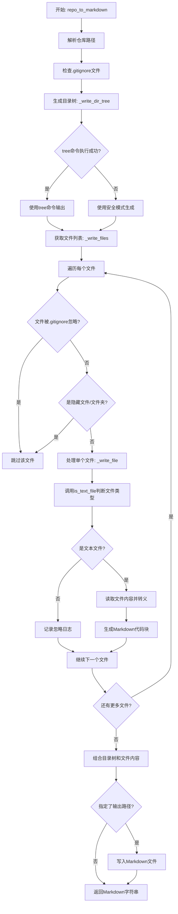
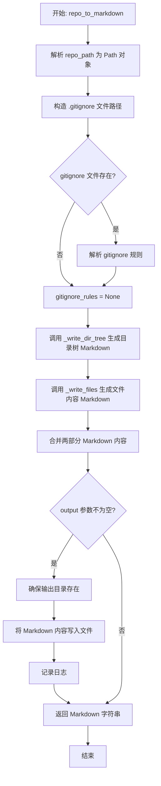
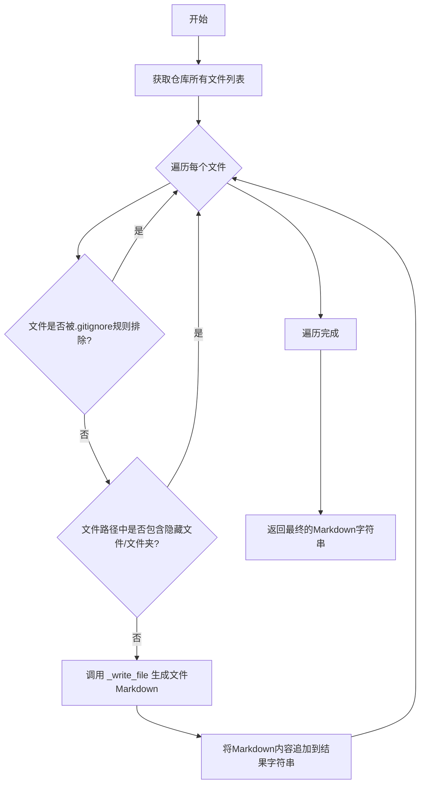
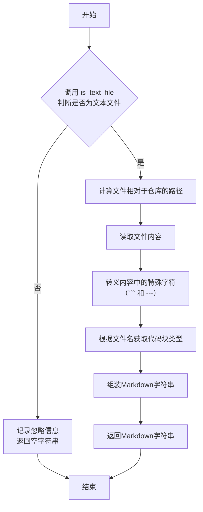

# `.\MetaGPT\metagpt\utils\repo_to_markdown.py` 详细设计文档

该代码提供了一个将本地代码仓库转换为Markdown文档的功能。它通过解析仓库目录结构生成目录树，读取文本文件内容并以代码块形式嵌入Markdown，同时支持.gitignore规则和隐藏文件过滤，最终输出完整的仓库文档化表示。

## 整体流程



## 类结构

```
本文件不包含类定义，主要由异步函数组成
├── repo_to_markdown (主函数)
├── _write_dir_tree (生成目录树)
├── _write_files (遍历处理文件)
├── _write_file (处理单个文件)
└── is_text_file (判断文件类型)
```

## 全局变量及字段


    

## 全局函数及方法

### `repo_to_markdown`

将本地代码仓库转换为 Markdown 表示形式。该函数接收一个本地仓库的路径，生成包含仓库目录树和文件列表的 Markdown 文档。如果提供了输出路径，文档将被保存到该路径。

参数：

- `repo_path`：`str | Path`，本地仓库的路径。
- `output`：`str | Path`，可选，保存生成的 Markdown 文件的路径。默认为 None。

返回值：`str`，仓库的 Markdown 表示形式。

#### 流程图



#### 带注释源码

```python
async def repo_to_markdown(repo_path: str | Path, output: str | Path = None) -> str:
    """
    Convert a local repository into a markdown representation.

    This function takes a path to a local repository and generates a markdown representation of the repository structure,
    including directory trees and file listings.

    Args:
        repo_path (str | Path): The path to the local repository.
        output (str | Path, optional): The path to save the generated markdown file. Defaults to None.

    Returns:
        str: The markdown representation of the repository.
    """
    # 1. 将输入的仓库路径解析为绝对路径的 Path 对象
    repo_path = Path(repo_path).resolve()
    # 2. 构造 .gitignore 文件的完整路径
    gitignore_file = repo_path / ".gitignore"

    # 3. 调用 _write_dir_tree 生成目录树部分的 Markdown
    markdown = await _write_dir_tree(repo_path=repo_path, gitignore=gitignore_file)

    # 4. 如果 .gitignore 文件存在，则解析其规则，否则规则为 None
    gitignore_rules = parse_gitignore(full_path=str(gitignore_file)) if gitignore_file.exists() else None
    # 5. 调用 _write_files 生成文件内容部分的 Markdown，并追加到总 Markdown 中
    markdown += await _write_files(repo_path=repo_path, gitignore_rules=gitignore_rules)

    # 6. 如果提供了输出路径，则将生成的 Markdown 内容写入文件
    if output:
        output_file = Path(output).resolve()
        # 确保输出文件的父目录存在
        output_file.parent.mkdir(parents=True, exist_ok=True)
        # 异步写入文件
        await awrite(filename=str(output_file), data=markdown, encoding="utf-8")
        # 记录日志
        logger.info(f"save: {output_file}")
    # 7. 返回生成的 Markdown 字符串
    return markdown
```

### `_write_dir_tree`

该函数用于生成指定目录的树状结构文本表示，并将其格式化为Markdown文档的一部分。它首先尝试使用命令行工具生成目录树，如果失败则回退到安全模式（不使用命令行）。最终将生成的目录树内容包装在Markdown代码块中，并添加标题和分隔符。

参数：

- `repo_path`：`Path`，目标仓库的根目录路径
- `gitignore`：`Path`，.gitignore文件的路径，用于排除特定文件或目录

返回值：`str`，包含目录树结构的Markdown格式字符串

#### 流程图


#### 带注释源码

```python
async def _write_dir_tree(repo_path: Path, gitignore: Path) -> str:
    """
    生成目录树的Markdown表示
    
    尝试使用tree命令生成目录结构，如果失败则使用Python实现的安全模式
    """
    try:
        # 尝试使用命令行工具生成目录树
        content = await tree(repo_path, gitignore, run_command=True)
    except Exception as e:
        # 如果命令行工具失败，记录错误并切换到安全模式
        logger.info(f"{e}, using safe mode.")
        content = await tree(repo_path, gitignore, run_command=False)

    # 将目录树内容包装为Markdown格式
    doc = f"## Directory Tree\n```text\n{content}\n```\n---\n\n"
    return doc
```

### `_write_files`

该函数是 `repo_to_markdown` 辅助函数的一部分，负责遍历指定仓库目录下的所有文件，并根据 `.gitignore` 规则和隐藏文件模式进行过滤。对于未被过滤的文本文件，它会调用 `_write_file` 函数将其内容格式化为 Markdown 代码块，并最终将所有文件的 Markdown 内容拼接成一个字符串返回。

参数：

- `repo_path`：`Path`，仓库的根目录路径。
- `gitignore_rules`：`function` 或 `None`，一个可调用对象，用于判断给定文件路径是否应被 `.gitignore` 规则排除。如果为 `None`，则不应用 `.gitignore` 规则。

返回值：`str`，返回一个字符串，其中包含了所有未被过滤的文本文件的 Markdown 表示，每个文件以 `## {相对路径}` 标题和代码块的形式呈现。

#### 流程图



#### 带注释源码

```python
async def _write_files(repo_path, gitignore_rules=None) -> str:
    # 1. 列出仓库根目录下的所有文件（包括子目录中的文件）
    filenames = list_files(repo_path)
    markdown = ""
    # 2. 定义用于匹配隐藏文件/文件夹的正则表达式模式（以点开头）
    pattern = r"^\..*"  # Hidden folders/files
    # 3. 遍历每个文件
    for filename in filenames:
        # 4. 如果提供了 gitignore_rules，检查当前文件是否应被忽略
        if gitignore_rules and gitignore_rules(str(filename)):
            continue
        ignore = False
        # 5. 检查文件路径的每一部分（目录或文件名）是否为隐藏项
        for i in filename.parts:
            if re.match(pattern, i):
                ignore = True
                break
        if ignore:
            continue
        # 6. 对于未被忽略的文件，调用 _write_file 生成其 Markdown 表示
        markdown += await _write_file(filename=filename, repo_path=repo_path)
    # 7. 返回所有文件 Markdown 内容的拼接字符串
    return markdown
```

### `_write_file`

该函数负责将单个文件的内容转换为Markdown格式的代码块。它首先判断文件是否为文本文件，如果是，则读取文件内容，进行必要的转义处理，并根据文件扩展名确定Markdown代码块的语言类型，最终生成包含文件路径和内容的Markdown字符串。如果文件不是文本文件或读取过程中发生错误，则返回空字符串。

参数：

- `filename`：`Path`，要处理的文件的绝对或相对路径。
- `repo_path`：`Path`，代码仓库的根目录路径，用于计算文件的相对路径。

返回值：`str`，生成的Markdown字符串。如果文件不是文本文件或处理失败，则返回空字符串。

#### 流程图



#### 带注释源码

```python
async def _write_file(filename: Path, repo_path: Path) -> str:
    # 1. 判断文件是否为文本文件
    is_text, mime_type = await is_text_file(filename)
    if not is_text:
        # 如果不是文本文件，记录日志并返回空字符串
        logger.info(f"Ignore content: {filename}")
        return ""

    try:
        # 2. 计算文件相对于仓库根目录的路径，用于生成Markdown标题
        relative_path = filename.relative_to(repo_path)
        # 初始化Markdown字符串，以文件相对路径作为二级标题
        markdown = f"## {relative_path}\n"
        # 3. 以UTF-8编码读取文件内容
        content = await aread(filename, encoding="utf-8")
        # 4. 对内容中的Markdown特殊字符进行转义，防止破坏代码块结构
        content = content.replace("```", "\\`\\`\\`").replace("---", "\\-\\-\\-")
        # 5. 根据文件扩展名（文件名）确定Markdown代码块的语言类型
        code_block_type = get_markdown_codeblock_type(filename.name)
        # 6. 将内容包装在指定语言的代码块中，并添加分隔符
        markdown += f"```{code_block_type}\n{content}\n```\n---\n\n"
        # 7. 返回生成的完整Markdown字符串
        return markdown
    except Exception as e:
        # 如果在处理过程中发生任何异常，记录错误并返回空字符串
        logger.error(e)
        return ""
```

### `is_text_file`

该函数用于根据文件的MIME类型判断其是否为文本文件。它通过检查MIME类型是否属于预定义的文本类型集合或非文本类型集合，返回一个布尔值表示是否为文本文件以及文件的MIME类型。

参数：

- `filename`：`Union[str, Path]`，文件路径，可以是字符串或Path对象。

返回值：`Tuple[bool, str]`，返回一个元组，第一个元素为布尔值，表示是否为文本文件（True表示是文本文件，False表示不是），第二个元素为文件的MIME类型。

#### 流程图


#### 带注释源码

```python
async def is_text_file(filename: Union[str, Path]) -> Tuple[bool, str]:
    """
    Determines if the specified file is a text file based on its MIME type.

    Args:
        filename (Union[str, Path]): The path to the file.

    Returns:
        Tuple[bool, str]: A tuple where the first element indicates if the file is a text file
        (True for text file, False otherwise), and the second element is the MIME type of the file.
    """
    # 预定义的文本类型集合
    pass_set = {
        "application/json",
        "application/vnd.chipnuts.karaoke-mmd",
        "application/javascript",
        "application/xml",
        "application/x-sh",
        "application/sql",
    }
    # 预定义的非文本类型集合
    denied_set = {
        "application/zlib",
        "application/octet-stream",
        "image/svg+xml",
        "application/pdf",
        "application/msword",
        "application/vnd.ms-excel",
        "audio/x-wav",
        "application/x-git",
        "application/vnd.openxmlformats-officedocument.wordprocessingml.document",
        "application/zip",
        "image/jpeg",
        "audio/mpeg",
        "video/mp2t",
        "inode/x-empty",
        "application/vnd.openxmlformats-officedocument.spreadsheetml.sheet",
        "image/png",
        "image/vnd.microsoft.icon",
        "video/mp4",
    }
    # 获取文件的MIME类型
    mime_type = await get_mime_type(Path(filename), force_read=True)
    # 判断是否为文本类型
    v = "text/" in mime_type or mime_type in pass_set
    if v:
        return True, mime_type

    # 如果MIME类型不在denied_set中，记录到日志
    if mime_type not in denied_set:
        logger.info(mime_type)
    return False, mime_type
```

## 关键组件

### 文件遍历与过滤

负责遍历指定仓库目录下的所有文件，并根据`.gitignore`规则和隐藏文件模式进行过滤，以确定哪些文件需要被处理。

### 目录树生成

负责生成仓库的目录结构树状图，并以Markdown代码块的形式输出，用于展示项目的整体文件组织。

### 文件内容读取与转换

负责读取被识别为文本文件的原始内容，进行必要的转义处理（如防止Markdown语法冲突），并将其格式化为带语法高亮的Markdown代码块。

### MIME类型检测与文件分类

通过检测文件的MIME类型，判断文件是否为纯文本文件，以此决定是否读取并转换其内容。它维护了已知的文本类型白名单和非文本类型黑名单以提高判断准确性。

### 异步I/O操作

封装了底层的异步文件读写操作（`aread`, `awrite`），确保在处理大量或大文件时，主程序流程不会被阻塞，从而提高整体转换效率。

### Markdown文档组装与输出

作为主协调器，按顺序调用目录树生成和文件内容转换等组件，将各部分结果组装成完整的Markdown文档字符串，并可选择将其异步写入到指定的输出文件中。

## 问题及建议

### 已知问题

-   **`is_text_file` 函数存在硬编码的 MIME 类型集合**：函数 `is_text_file` 使用硬编码的 `pass_set` 和 `denied_set` 来判断文件是否为文本文件。这种方法不灵活，难以维护，且可能无法覆盖所有情况，导致误判或漏判。
-   **`_write_file` 函数中的字符串替换可能不充分**：在将文件内容写入 Markdown 时，代码仅替换了 ```` 和 `---` 字符。然而，Markdown 中还有其他特殊字符（如 `#`, `*`, `_`, `[]`, `()` 等）需要转义，否则可能导致生成的 Markdown 格式错误。
-   **异常处理过于宽泛**：在 `_write_dir_tree` 和 `_write_file` 函数中，使用了 `except Exception` 来捕获所有异常。这虽然能防止程序崩溃，但可能掩盖了具体的错误原因，不利于调试和问题定位。
-   **`_write_files` 函数中的正则表达式匹配效率**：使用正则表达式 `r"^\..*"` 来匹配隐藏文件/文件夹，对于每个文件的每个路径部分都进行匹配，在大型仓库中可能影响性能。
-   **`repo_to_markdown` 函数缺少输入验证**：函数没有对输入的 `repo_path` 和 `output` 参数进行充分的验证（例如，检查路径是否存在、是否为目录等），可能导致运行时错误。

### 优化建议

-   **使用更通用的 MIME 类型检测库或方法**：建议使用更成熟、维护更好的库（如 `python-magic`）或标准库方法（如 `mimetypes` 结合文件内容嗅探）来动态判断文件是否为文本类型，避免硬编码。
-   **完善 Markdown 特殊字符转义**：在 `_write_file` 函数中，应使用更全面的 Markdown 转义库（如 `markdown` 或 `mistune` 的转义功能）或编写一个转义函数，确保所有可能破坏格式的字符都被正确处理。
-   **细化异常处理**：将 `except Exception` 替换为更具体的异常类型（如 `OSError`, `UnicodeDecodeError`, `GitCommandError` 等），并在捕获异常时记录更详细的错误信息（如堆栈跟踪），以便于问题诊断。
-   **优化隐藏文件检测逻辑**：在 `_write_files` 函数中，可以考虑在遍历文件列表前，先使用 `Path` 对象的属性（如 `name.startswith('.')`）或编译一次正则表达式进行预过滤，减少重复匹配的开销。
-   **增加输入参数验证和错误提示**：在 `repo_to_markdown` 函数开始处，添加对 `repo_path` 的检查（如 `Path(repo_path).is_dir()`），如果路径无效，则抛出明确的异常（如 `ValueError`）或返回有意义的错误信息，提高代码的健壮性。

## 其它


### 设计目标与约束

本模块的核心设计目标是将本地代码仓库（Git 仓库）的结构和内容高效、准确地转换为 Markdown 格式的文档。主要约束包括：1. 必须正确处理 `.gitignore` 规则，以排除不应包含在文档中的文件和目录；2. 需要智能识别文本文件与非文本文件（如二进制文件），避免将非文本内容错误地嵌入 Markdown 代码块；3. 转换过程应保持异步操作，以支持处理大型仓库；4. 生成的 Markdown 内容需要正确转义，避免与 Markdown 语法冲突（如代码块分隔符 ` ``` ` 和水平线 `---`）。

### 错误处理与异常设计

模块采用了分层的错误处理策略。在顶层函数 `repo_to_markdown` 中，主要处理文件系统操作（如创建输出目录）的异常。在内部函数中：`_write_dir_tree` 尝试使用外部命令生成目录树，失败后回退到安全的纯 Python 实现；`_write_file` 在读取文件内容时捕获所有异常，记录错误并跳过该文件，确保单个文件的处理失败不会中断整个转换流程。`is_text_file` 函数通过预定义的 MIME 类型白名单和黑名单来判定文件类型，对于未知类型会记录日志以供后续分析，但不会抛出异常。

### 数据流与状态机

数据流起始于用户提供的仓库路径 `repo_path`。首先，解析 `.gitignore` 文件生成忽略规则。接着，生成目录树结构并写入 Markdown。然后，遍历仓库中的所有文件，对每个文件应用忽略规则和隐藏文件过滤。对于未被过滤的文本文件，读取其内容，进行必要的转义后，以代码块形式写入 Markdown。最终，完整的 Markdown 字符串要么返回给调用者，要么写入指定的输出文件。整个过程是线性的，没有复杂的循环依赖或状态转移。

### 外部依赖与接口契约

**外部依赖：**
1.  `gitignore_parser`: 用于解析 `.gitignore` 文件，生成匹配规则函数。
2.  `metagpt.utils.common`: 提供了异步文件读写 (`aread`, `awrite`)、文件列表获取 (`list_files`)、MIME 类型检测 (`get_mime_type`) 和代码块类型推断 (`get_markdown_codeblock_type`) 等工具函数。
3.  `metagpt.utils.tree`: 提供了生成目录树字符串的功能 (`tree` 函数)，支持命令模式和纯 Python 模式。
4.  `metagpt.logs`: 提供日志记录功能 (`logger`)。

**接口契约：**
1.  `repo_to_markdown(repo_path: str | Path, output: str | Path = None) -> str`: 主入口函数。接收仓库路径和可选的输出路径。返回生成的 Markdown 字符串。如果提供了输出路径，则同时将内容写入该文件。
2.  内部函数 `_write_dir_tree`, `_write_files`, `_write_file`, `is_text_file` 均为 `async` 函数，构成异步处理流水线。它们之间的调用关系定义了内部数据转换的契约。

### 性能考量

1.  **I/O 操作**：大量使用异步 I/O (`aread`, `awrite`) 来避免在文件读写时阻塞事件循环，这对于处理包含众多文件的仓库至关重要。
2.  **内存使用**：`_write_files` 函数在遍历文件时逐步构建 Markdown 字符串，而非一次性将所有文件内容加载到内存，这有助于控制内存峰值。
3.  **文件类型判断**：`is_text_file` 函数依赖 `get_mime_type`，后者可能涉及文件内容读取 (`force_read=True`)。对于大文件，这可能成为性能瓶颈。目前的策略是通过预定义的集合进行快速判断，减少了对未知类型文件的深度探测。
4.  **目录树生成**：`_write_dir_tree` 优先尝试使用系统命令（如 `tree`）生成目录树，这通常比纯 Python 实现更快。失败时回退到安全但可能较慢的 Python 实现。

### 安全考量

1.  **路径遍历**：代码使用 `Path.resolve()` 来规范化路径，并利用 `relative_to` 确保在生成相对路径引用时不会意外包含仓库之外的目录，防止潜在的路径遍历风险。
2.  **内容转义**：在将文件内容嵌入 Markdown 代码块前，对可能破坏 Markdown 语法的字符序列（` ``` ` 和 `---`）进行了转义，确保了生成文档的正确性和安全性。
3.  **输入验证**：虽然代码中未显式展示对 `repo_path` 和 `output` 参数的严格验证（如检查路径是否存在、是否可读/写），但依赖 `Path` 对象和后续操作（如 `mkdir`）的异常来暴露问题。在生产环境中，可能需要更前置的验证。

    