# `.\MetaGPT\metagpt\utils\report.py` 详细设计文档

该代码定义了一个资源报告系统，用于在MetaGPT框架中向外部服务（如UI界面）同步或异步地报告不同类型资源（如终端输出、浏览器页面、文件、任务等）的状态和数据。核心是ResourceReporter基类及其多个子类，每个子类对应一种特定的资源类型（BlockType），并提供了标准化的报告接口。系统支持同步和异步报告，能够处理本地Unix套接字连接，并集成了LLM流式报告功能。

## 整体流程

```mermaid
graph TD
    A[调用者调用report/async_report] --> B{是否启用报告?}
    B -- 否（callback_url为空） --> C[直接返回]
    B -- 是 --> D[格式化数据 (_format_data)]
    D --> E{报告模式?}
    E -- 同步 --> F[使用requests库POST数据]
    E -- 异步 --> G{URL协议是否为unix?}
    G -- 是 --> H[转换为HTTP URL并使用UnixConnector]
    G -- 否 --> I[使用标准ClientSession]
    H --> J[使用aiohttp异步POST数据]
    I --> J
    F --> K[返回响应文本]
    J --> K
    L[异步上下文管理器进入] --> M{是否启用LLM流?}
    M -- 是 --> N[创建LLM流报告任务 (_llm_stream_report)]
    M -- 否 --> O[直接进入]
    N --> O
    P[异步上下文管理器退出] --> Q{LLM流任务存在且未被取消?}
    Q -- 是 --> R[向队列发送结束信号并等待任务完成]
    Q -- 否 --> S[发送结束标记报告]
    R --> S
```

## 类结构

```
ResourceReporter (基类，Pydantic BaseModel)
├── TerminalReporter (终端报告)
├── BrowserReporter (浏览器报告)
├── ServerReporter (服务器部署报告)
├── ObjectReporter (对象报告)
│   ├── TaskReporter (任务报告)
│   └── ThoughtReporter (思考报告)
└── FileReporter (文件报告)
    ├── NotebookReporter (笔记本报告)
    ├── DocsReporter (文档报告)
    ├── EditorReporter (编辑器报告)
    └── GalleryReporter (画廊/图片报告)
```

## 全局变量及字段


### `END_MARKER_NAME`
    
用于标识流式报告结束的特殊标记名称。

类型：`str`
    


### `END_MARKER_VALUE`
    
用于标识流式报告结束的特殊标记值。

类型：`str`
    


### `CURRENT_ROLE`
    
用于存储当前上下文中正在执行报告操作的Role对象的上下文变量。

类型：`ContextVar[Optional[Role]]`
    


### `ResourceReporter.block`
    
标识报告资源所属的区块类型。

类型：`BlockType`
    


### `ResourceReporter.uuid`
    
报告资源的唯一标识符。

类型：`UUID`
    


### `ResourceReporter.enable_llm_stream`
    
指示是否启用LLM流式报告功能。

类型：`bool`
    


### `ResourceReporter.callback_url`
    
报告数据应发送到的目标URL。

类型：`str`
    


### `ResourceReporter._llm_task`
    
用于管理LLM流式报告任务的私有异步任务对象。

类型：`Optional[asyncio.Task]`
    


### `TerminalReporter.block`
    
固定为BlockType.TERMINAL，标识此报告器用于终端区块。

类型：`Literal[BlockType.TERMINAL]`
    


### `BrowserReporter.block`
    
固定为BlockType.BROWSER，标识此报告器用于浏览器区块。

类型：`Literal[BlockType.BROWSER]`
    


### `ServerReporter.block`
    
固定为BlockType.BROWSER_RT，标识此报告器用于实时服务器区块。

类型：`Literal[BlockType.BROWSER_RT]`
    


### `TaskReporter.block`
    
固定为BlockType.TASK，标识此报告器用于任务区块。

类型：`Literal[BlockType.TASK]`
    


### `ThoughtReporter.block`
    
固定为BlockType.THOUGHT，标识此报告器用于思考区块。

类型：`Literal[BlockType.THOUGHT]`
    


### `NotebookReporter.block`
    
固定为BlockType.NOTEBOOK，标识此报告器用于笔记本区块。

类型：`Literal[BlockType.NOTEBOOK]`
    


### `DocsReporter.block`
    
固定为BlockType.DOCS，标识此报告器用于文档区块。

类型：`Literal[BlockType.DOCS]`
    


### `EditorReporter.block`
    
固定为BlockType.EDITOR，标识此报告器用于编辑器区块。

类型：`Literal[BlockType.EDITOR]`
    


### `GalleryReporter.block`
    
固定为BlockType.GALLERY，标识此报告器用于图库区块。

类型：`Literal[BlockType.GALLERY]`
    
    

## 全局函数及方法

### `ResourceReporter.report`

该方法用于同步报告资源观察数据。它将给定的数据格式化后，通过 HTTP POST 请求发送到配置的回调 URL。如果回调 URL 未设置，则直接返回。

参数：

- `value`：`Any`，需要报告的数据。
- `name`：`str`，数据的类型名称。
- `extra`：`Optional[dict]`，额外的元数据信息。

返回值：`str`，HTTP 响应的文本内容。

#### 流程图

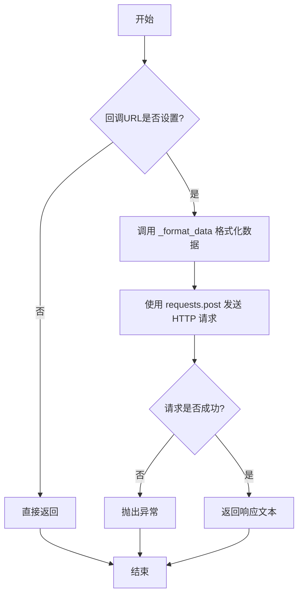

#### 带注释源码

```python
def report(self, value: Any, name: str, extra: Optional[dict] = None):
    """Synchronously report resource observation data.

    Args:
        value: The data to report.
        name: The type name of the data.
    """
    return self._report(value, name, extra)
```

### `ResourceReporter.async_report`

异步报告资源观察数据。该方法将给定的数据异步发送到配置的回调URL，支持处理Unix域套接字连接，并自动格式化数据（包括角色信息、路径转换等）。如果未设置回调URL，则直接返回。

参数：

- `value`：`Any`，要报告的数据内容
- `name`：`str`，数据的类型名称（如"cmd"、"output"、"path"等）
- `extra`：`Optional[dict]`，可选的额外数据字典，将合并到报告数据中

返回值：`Optional[str]`，返回HTTP响应的文本内容，如果未设置回调URL则返回None

#### 流程图

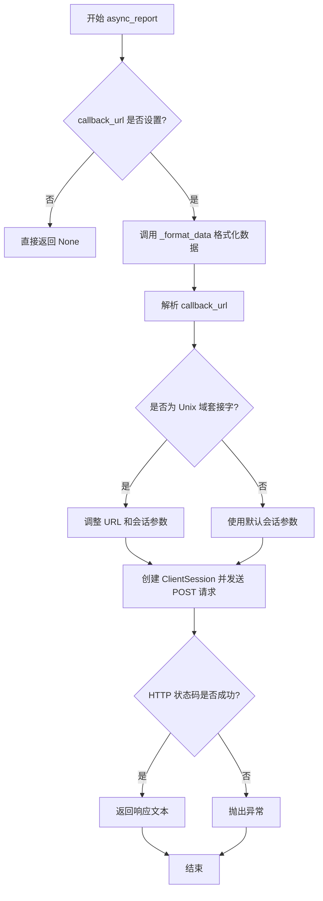

#### 带注释源码

```python
async def async_report(self, value: Any, name: str, extra: Optional[dict] = None):
    """Asynchronously report resource observation data.

    Args:
        value: The data to report.
        name: The type name of the data.
    """
    return await self._async_report(value, name, extra)
```

**注意**：`async_report` 方法本身是一个包装器，实际逻辑在 `_async_report` 方法中。以下是 `_async_report` 方法的带注释源码：

```python
async def _async_report(self, value: Any, name: str, extra: Optional[dict] = None):
    # 检查回调URL是否设置，未设置则直接返回
    if not self.callback_url:
        return

    # 格式化数据，包括转换BaseModel/Path类型、添加角色信息等
    data = self._format_data(value, name, extra)
    url = self.callback_url
    _result = urlparse(url)  # 解析URL以检查是否为Unix域套接字
    sessiion_kwargs = {}
    # 处理Unix域套接字URL（scheme以"+unix"结尾）
    if _result.scheme.endswith("+unix"):
        parsed_list = list(_result)
        parsed_list[0] = parsed_list[0][:-5]  # 移除"+unix"后缀
        parsed_list[1] = "fake.org"  # 替换域名为占位符
        url = urlunparse(parsed_list)  # 重新构建URL
        sessiion_kwargs["connector"] = UnixConnector(path=unquote(_result.netloc))  # 设置Unix连接器

    # 创建异步HTTP客户端会话并发送POST请求
    async with ClientSession(**sessiion_kwargs) as client:
        async with client.post(url, json=data) as resp:
            resp.raise_for_status()  # 检查HTTP状态码，失败则抛出异常
            return await resp.text()  # 返回响应文本
```

### `ResourceReporter.set_report_fn`

该方法是一个类方法，用于设置 `ResourceReporter` 类及其子类的同步报告函数。它允许用户自定义同步报告（`report` 方法）的实际执行逻辑，例如将数据打印到控制台或发送到自定义的 HTTP 端点。

参数：
- `fn`：`Callable`，一个可调用对象，用于替换默认的同步报告逻辑。该函数应接受与 `_report` 方法相同的参数。

返回值：`None`，此方法不返回任何值。

#### 流程图

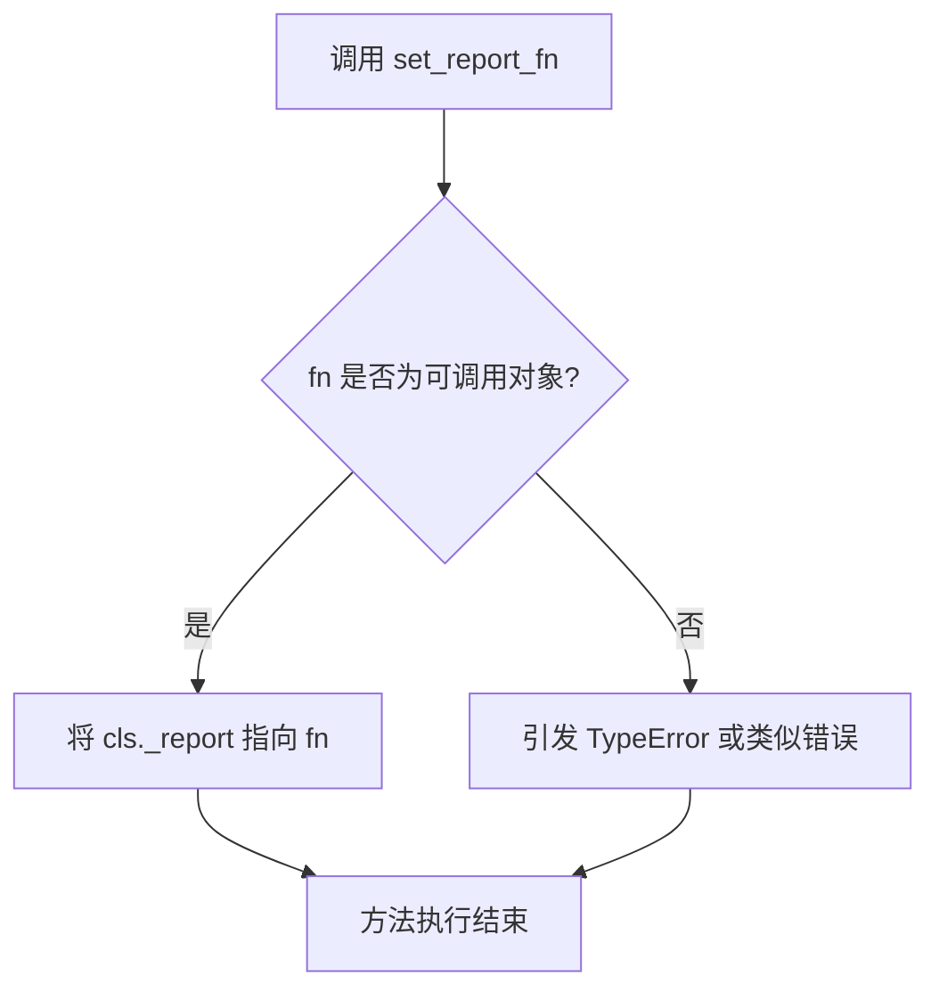

#### 带注释源码

```python
    @classmethod
    def set_report_fn(cls, fn: Callable):
        """Set the synchronous report function.

        Args:
            fn: A callable function used for synchronous reporting. For example:

                >>> def _report(self, value: Any, name: str):
                ...     print(value, name)

        """
        # 将传入的可调用对象 fn 赋值给类的 _report 属性。
        # 此后，所有实例的同步报告方法 `report` 都将调用此自定义函数。
        cls._report = fn
```

### `ResourceReporter.set_async_report_fn`

这是一个类方法，用于设置 `ResourceReporter` 类及其子类的异步报告函数。它允许用户自定义异步报告的逻辑，替换掉默认的通过 HTTP POST 请求发送数据到回调 URL 的实现。

参数：
- `fn`：`Callable`，一个可调用对象，用于执行异步报告。例如，一个接受 `value`、`name` 和 `extra` 参数的异步函数。

返回值：`None`，此方法不返回任何值，它直接修改类的 `_async_report` 属性。

#### 流程图

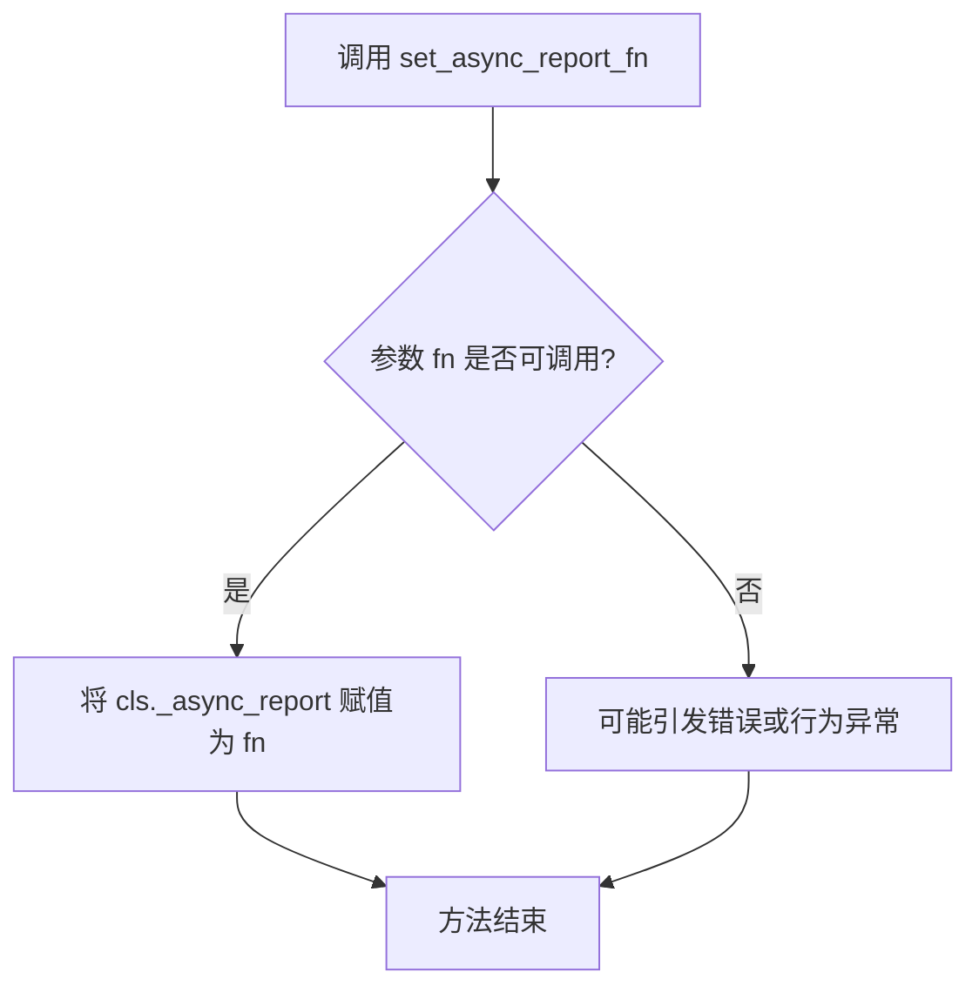

#### 带注释源码

```python
    @classmethod
    def set_async_report_fn(cls, fn: Callable):
        """Set the asynchronous report function.

        Args:
            fn: A callable function used for asynchronous reporting. For example:

                ```python
                >>> async def _report(self, value: Any, name: str):
                ...     print(value, name)
                ```
        """
        # 将传入的可调用对象 fn 赋值给类的 _async_report 属性。
        # 此后，所有实例的异步报告行为都将使用此函数。
        cls._async_report = fn
```

### `ResourceReporter._report`

该方法用于同步报告资源观察数据。它会检查回调URL是否设置，如果未设置则直接返回。然后，它会格式化数据，并通过HTTP POST请求将数据发送到指定的回调URL。如果请求失败，它会抛出异常。

参数：

- `self`：`ResourceReporter`，当前`ResourceReporter`实例
- `value`：`Any`，要报告的数据
- `name`：`str`，数据的类型名称
- `extra`：`Optional[dict]`，额外的数据，可选

返回值：`str`，HTTP响应的文本内容

#### 流程图

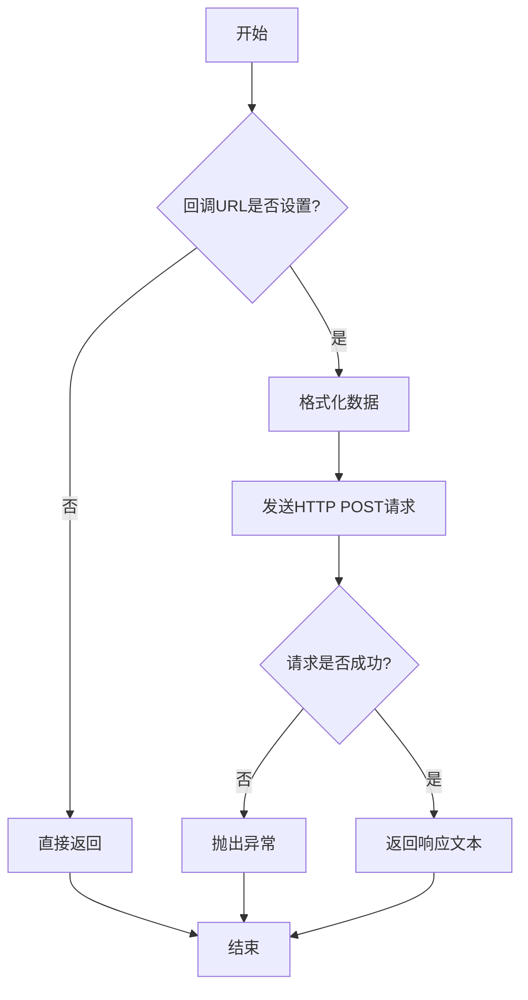

#### 带注释源码

```python
def _report(self, value: Any, name: str, extra: Optional[dict] = None):
    # 检查回调URL是否设置，如果未设置则直接返回
    if not self.callback_url:
        return

    # 格式化数据，将value、name、extra等信息打包成字典
    data = self._format_data(value, name, extra)
    # 发送HTTP POST请求到回调URL，数据以JSON格式发送
    resp = requests.post(self.callback_url, json=data)
    # 如果HTTP响应状态码表示错误，则抛出异常
    resp.raise_for_status()
    # 返回HTTP响应的文本内容
    return resp.text
```

### `ResourceReporter._async_report`

异步报告资源观察数据。该方法将给定的数据格式化后，通过HTTP POST请求异步发送到配置的回调URL。它支持Unix域套接字连接，并能处理不同类型的输入数据（如Pydantic模型、Path对象），同时会附加当前角色信息。

参数：
- `value`：`Any`，要报告的数据内容。
- `name`：`str`，数据的类型名称（例如："cmd"、"output"、"path"）。
- `extra`：`Optional[dict]`，可选的额外元数据字典。

返回值：`str`，HTTP响应的文本内容。如果未设置回调URL，则返回`None`。

#### 流程图

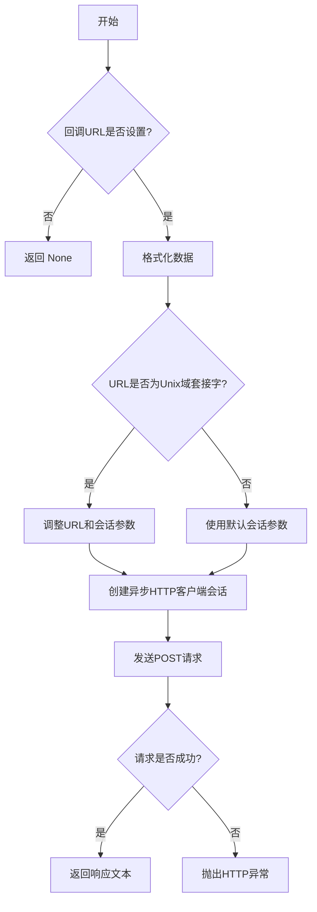

#### 带注释源码

```python
async def _async_report(self, value: Any, name: str, extra: Optional[dict] = None):
    # 检查是否配置了回调URL，如果没有则直接返回
    if not self.callback_url:
        return

    # 调用内部方法格式化数据，准备发送
    data = self._format_data(value, name, extra)
    url = self.callback_url
    # 解析URL以检查其协议和网络位置
    _result = urlparse(url)
    sessiion_kwargs = {}
    # 判断是否为Unix域套接字URL（协议以"+unix"结尾）
    if _result.scheme.endswith("+unix"):
        # 如果是Unix域套接字，调整URL和会话参数
        parsed_list = list(_result)
        parsed_list[0] = parsed_list[0][:-5]  # 移除协议后缀"+unix"
        parsed_list[1] = "fake.org"  # 设置一个假的域名
        url = urlunparse(parsed_list)  # 重新构建URL
        # 对网络位置进行URL解码，并设置Unix连接器
        sessiion_kwargs["connector"] = UnixConnector(path=unquote(_result.netloc))

    # 创建异步HTTP客户端会话
    async with ClientSession(**sessiion_kwargs) as client:
        # 发送异步POST请求
        async with client.post(url, json=data) as resp:
            # 检查HTTP响应状态，如果失败则抛出异常
            resp.raise_for_status()
            # 返回响应的文本内容
            return await resp.text()
```

### `ResourceReporter._format_data`

该方法用于格式化要上报的资源数据。它接收原始值、名称和额外信息，将其转换为一个包含块类型、UUID、值、名称、角色等字段的字典。该方法会处理特殊的数据类型（如Pydantic模型、Path对象），并确保路径被转换为绝对路径。同时，它会尝试从上下文变量或环境变量中获取当前角色名称。

参数：

- `value`：`Any`，要上报的原始数据值
- `name`：`str`，数据的类型名称（例如："path"、"cmd"、"output"等）
- `extra`：`Optional[dict]`，可选的额外信息字典，将被合并到最终数据中

返回值：`dict`，格式化后的数据字典，包含块类型、UUID、值、名称、角色等字段

#### 流程图

```mermaid
flowchart TD
    A[开始] --> B[调用model_dump<br>获取基础数据]
    B --> C{value是否为BaseModel?}
    C -- 是 --> D[转换为字典]
    C -- 否 --> E{value是否为Path?}
    E -- 是 --> F[转换为字符串]
    E -- 否 --> G[保持原样]
    D --> H
    F --> H
    G --> H
    H[name是否为"path"?]
    H -- 是 --> I[转换为绝对路径]
    H -- 否 --> J[保持原样]
    I --> K[尝试从上下文获取角色]
    J --> K
    K --> L{是否获取到角色?}
    L -- 是 --> M[使用角色名称]
    L -- 否 --> N[从环境变量获取角色名称]
    N --> O[构建最终数据字典]
    M --> O
    O --> P[返回格式化数据]
```

#### 带注释源码

```python
def _format_data(self, value, name, extra):
    # 1. 获取基础数据：通过model_dump方法将当前对象转换为字典，排除callback_url和llm_stream字段
    data = self.model_dump(mode="json", exclude=("callback_url", "llm_stream"))
    
    # 2. 处理特殊类型的value值
    if isinstance(value, BaseModel):
        # 如果value是Pydantic BaseModel，将其转换为字典
        value = value.model_dump(mode="json")
    elif isinstance(value, Path):
        # 如果value是Path对象，将其转换为字符串
        value = str(value)

    # 3. 特殊处理：如果name为"path"，将路径转换为绝对路径
    if name == "path":
        value = os.path.abspath(value)
    
    # 4. 将处理后的value和name添加到数据字典中
    data["value"] = value
    data["name"] = name
    
    # 5. 获取角色名称：首先尝试从上下文变量获取，失败则从环境变量获取
    role = CURRENT_ROLE.get(None)
    if role:
        role_name = role.name
    else:
        role_name = os.environ.get("METAGPT_ROLE")
    data["role"] = role_name
    
    # 6. 如果有额外信息，将其合并到数据字典中
    if extra:
        data["extra"] = extra
    
    # 7. 返回格式化后的完整数据字典
    return data
```

### `ResourceReporter.__enter__`

该方法实现了 `ResourceReporter` 类的同步上下文管理器入口。当使用 `with` 语句进入 `ResourceReporter` 实例的上下文时，此方法被调用。它不执行任何初始化或设置操作，仅返回 `self` 实例本身，使得该实例可以在 `with` 代码块中被使用。其核心作用是支持将 `ResourceReporter` 及其子类用作同步上下文管理器，以便在退出上下文时自动调用 `__exit__` 方法发送结束标记。

参数：
-  `self`：`ResourceReporter`，`ResourceReporter` 类的实例。

返回值：`ResourceReporter`，返回 `ResourceReporter` 实例本身，以便在 `with` 代码块中使用。

#### 流程图

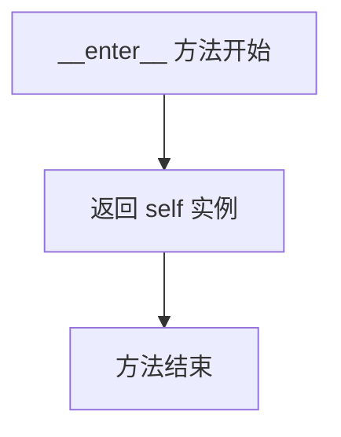

#### 带注释源码

```python
def __enter__(self):
    """Enter the synchronous streaming callback context."""
    return self
```

### `ResourceReporter.__exit__`

该方法实现了 `ResourceReporter` 类作为上下文管理器时的同步退出逻辑。当使用 `with` 语句块结束时，该方法会被自动调用，其主要职责是发送一个特殊的结束标记（`END_MARKER`）到配置的回调地址，以通知接收方该资源报告流已结束。

参数：

- `self`：`ResourceReporter`，`ResourceReporter` 类的实例。
- `*args`：`tuple`，用于接收任何位置参数（在此方法中未使用）。
- `**kwargs`：`dict`，用于接收任何关键字参数（在此方法中未使用）。

返回值：`None`，此方法不返回任何值。

#### 流程图

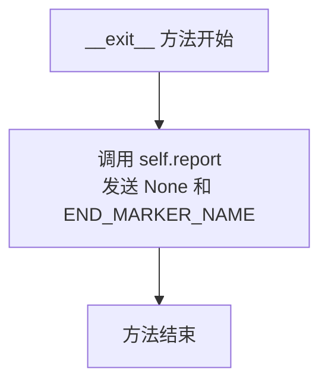

#### 带注释源码

```python
def __exit__(self, *args, **kwargs):
    """Exit the synchronous streaming callback context."""
    # 调用同步报告方法，发送一个特殊的结束标记。
    # 参数 `None` 作为值，`END_MARKER_NAME` 作为名称。
    # 这通知接收方该报告流已结束。
    self.report(None, END_MARKER_NAME)
```

### `ResourceReporter.__aenter__`

该方法用于异步进入`ResourceReporter`对象的上下文管理器。如果启用了LLM流（`enable_llm_stream`为`True`），它会创建一个异步队列并启动一个后台任务来监听并报告从该队列接收到的LLM流数据。该方法返回`self`，允许在`async with`语句中使用该对象。

参数：
-  `self`：`ResourceReporter`，当前`ResourceReporter`实例。

返回值：`ResourceReporter`，返回当前`ResourceReporter`实例自身，以便在异步上下文管理器中使用。

#### 流程图

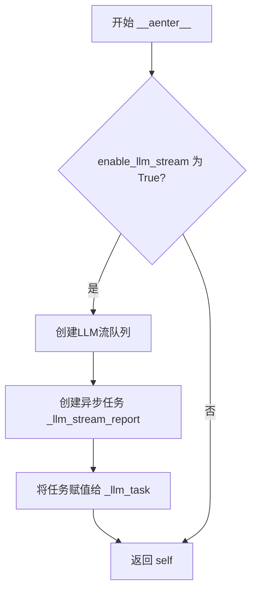

#### 带注释源码

```python
async def __aenter__(self):
    """Enter the asynchronous streaming callback context."""
    # 检查是否启用了LLM流报告功能
    if self.enable_llm_stream:
        # 创建一个用于LLM流数据的异步队列
        queue = create_llm_stream_queue()
        # 创建一个异步任务，该任务将监听队列并报告接收到的数据
        self._llm_task = asyncio.create_task(self._llm_stream_report(queue))
    # 返回当前对象实例，以便在`async with`语句中使用
    return self
```

### `ResourceReporter.__aexit__`

该方法用于异步退出`ResourceReporter`对象的上下文管理器。它负责清理异步上下文中的资源，特别是当启用了LLM流报告时，它会等待LLM流报告任务完成，并发送一个结束标记报告。

参数：

- `exc_type`：`Optional[Type[BaseException]]`，异常类型，表示在异步上下文中发生的异常类型（如果有）。
- `exc_value`：`Optional[BaseException]`，异常值，表示在异步上下文中发生的异常实例（如果有）。
- `exc_tb`：`Optional[TracebackType]`，异常回溯，表示在异步上下文中发生的异常的回溯信息（如果有）。

返回值：`None`，该方法不返回任何值。

#### 流程图

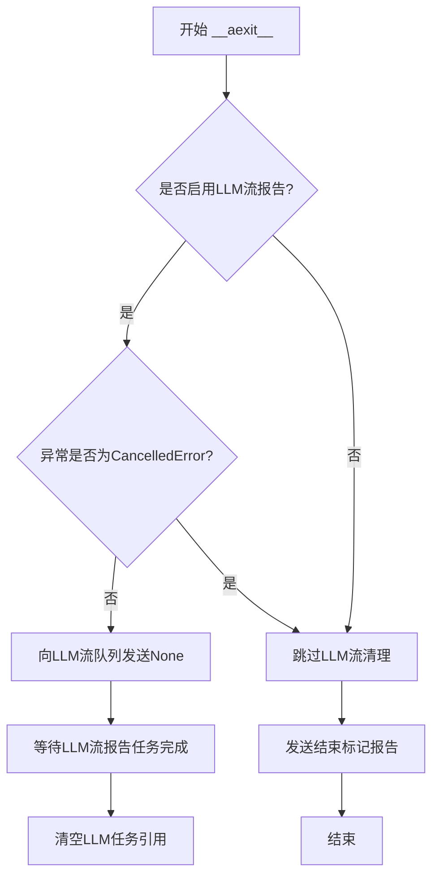

#### 带注释源码

```python
async def __aexit__(self, exc_type, exc_value, exc_tb):
    """Exit the asynchronous streaming callback context."""
    # 如果启用了LLM流报告并且异常不是asyncio.CancelledError
    if self.enable_llm_stream and exc_type != asyncio.CancelledError:
        # 向LLM流队列发送None，表示流结束
        await get_llm_stream_queue().put(None)
        # 等待LLM流报告任务完成
        await self._llm_task
        # 清空LLM任务引用
        self._llm_task = None
    # 发送结束标记报告，表示资源报告结束
    await self.async_report(None, END_MARKER_NAME)
```

### `ResourceReporter._llm_stream_report`

该方法是一个异步私有方法，用于处理LLM（大语言模型）流式报告。它持续监听一个异步队列，当从队列中获取到数据时，就调用异步报告方法将数据上报。当从队列中接收到一个`None`值时，表示流式报告结束，方法退出循环并返回。

参数：
- `queue`：`asyncio.Queue`，一个异步队列，用于接收需要上报的LLM流式数据。

返回值：`None`，该方法不返回任何值。

#### 流程图

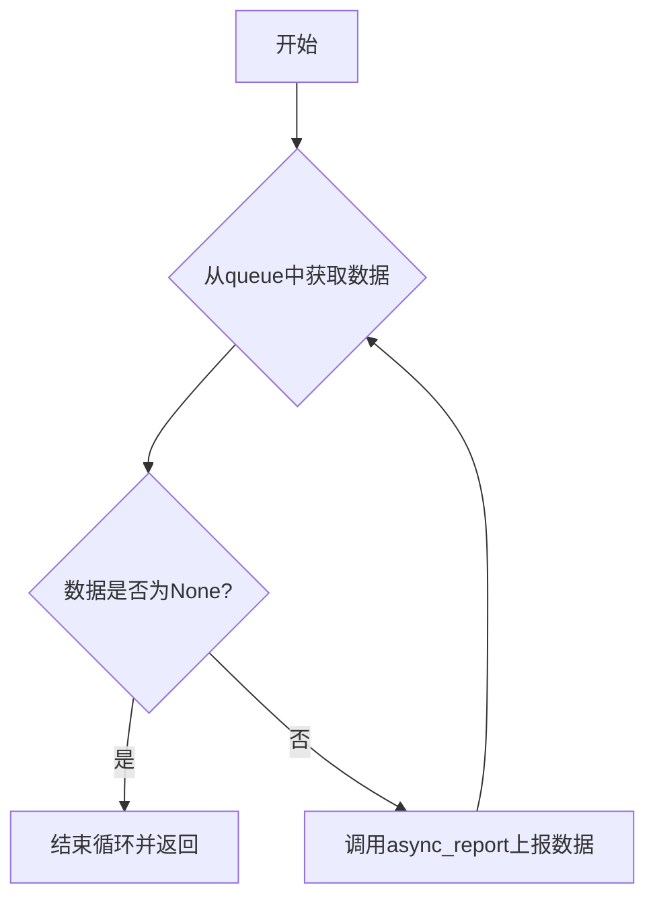

#### 带注释源码

```python
async def _llm_stream_report(self, queue: asyncio.Queue):
    # 进入一个无限循环，持续监听队列
    while True:
        # 从队列中异步获取数据，如果队列为空则等待
        data = await queue.get()
        # 检查获取到的数据是否为None，None是流结束的信号
        if data is None:
            # 如果是None，则退出循环，结束流式报告任务
            return
        # 如果数据不是None，则调用异步报告方法，将数据上报
        # 上报的数据类型名称为"content"
        await self.async_report(data, "content")
```

### `ResourceReporter.wait_llm_stream_report`

该方法用于等待与当前`ResourceReporter`实例关联的LLM流式报告任务完成。它会轮询全局的LLM流队列，直到队列为空，从而确保在异步上下文退出前，所有已生成的流式数据都已被报告。

参数：
- 无

返回值：`None`，无返回值

#### 流程图

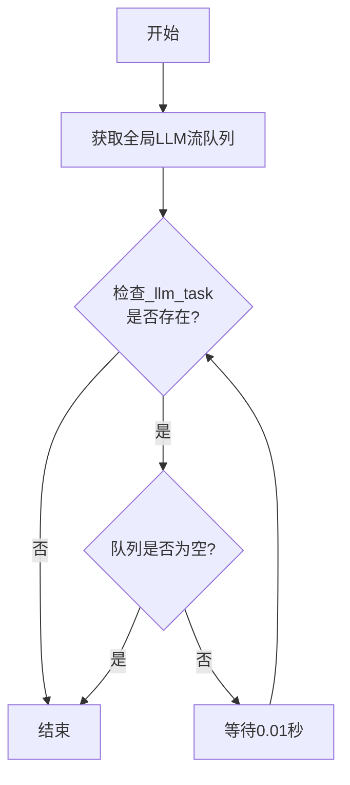

#### 带注释源码

```python
async def wait_llm_stream_report(self):
    """Wait for the LLM stream report to complete."""
    # 获取全局的LLM流队列，该队列用于在异步上下文中传递流式数据
    queue = get_llm_stream_queue()
    # 循环检查，直到与当前实例关联的LLM报告任务完成
    while self._llm_task:
        # 如果队列为空，说明所有流式数据都已处理，可以退出循环
        if queue.empty():
            break
        # 短暂休眠以避免CPU空转，等待新的数据被放入队列
        await asyncio.sleep(0.01)
```

### `TerminalReporter.report`

该方法用于同步报告终端命令或输出数据。它继承自父类 `ResourceReporter` 的 `report` 方法，但通过类型注解限定了 `name` 参数只能为 `"cmd"` 或 `"output"`，以明确报告的是命令还是输出内容。

参数：
- `value`：`str`，要报告的终端命令或输出内容。
- `name`：`Literal["cmd", "output"]`，报告的数据类型，只能是 `"cmd"`（命令）或 `"output"`（输出）。

返回值：`Any`，返回父类 `_report` 方法的执行结果，通常是 HTTP 响应的文本内容，如果未设置回调 URL 则返回 `None`。

#### 流程图

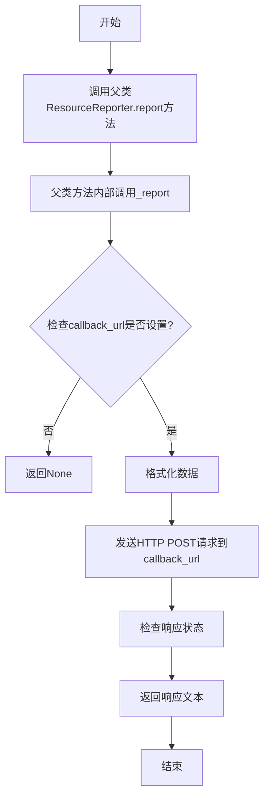

#### 带注释源码

```python
def report(self, value: str, name: Literal["cmd", "output"]):
    """Report terminal command or output synchronously."""
    return super().report(value, name)
```

### `TerminalReporter.async_report`

异步报告终端命令或输出数据到指定的回调URL。该方法继承自`ResourceReporter`，专门用于处理终端（`BlockType.TERMINAL`）类型的资源报告，支持异步HTTP POST请求发送数据。

参数：
- `value`：`str`，要报告的数据内容，例如终端命令或输出文本。
- `name`：`Literal["cmd", "output"]`，数据的类型名称，用于标识是命令（`"cmd"`）还是输出（`"output"`）。

返回值：`str`，返回HTTP响应的文本内容，如果未设置回调URL则返回`None`。

#### 流程图

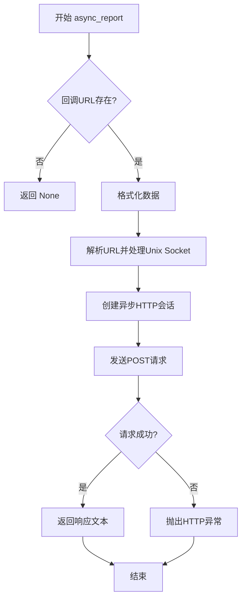

#### 带注释源码

```python
async def async_report(self, value: str, name: Literal["cmd", "output"]):
    """Report terminal command or output asynchronously."""
    return await super().async_report(value, name)
```

### `BrowserReporter.report`

该方法用于同步报告浏览器相关的资源观察数据，例如请求的URL或页面内容。它继承自`ResourceReporter`，并针对`Browser`类型的块进行了特化处理。当报告页面内容时，它会提取页面的URL、标题和截图信息，并将其格式化为字典。

参数：

- `value`：`Union[str, SyncPage]`，要报告的数据。当`name`为`"url"`时，应为字符串类型的URL；当`name`为`"page"`时，应为`SyncPage`类型的Playwright页面对象。
- `name`：`Literal["url", "page"]`，数据的类型名称。只能是`"url"`或`"page"`。

返回值：`Any`，返回HTTP POST请求的响应文本，如果`callback_url`未设置则返回`None`。

#### 流程图

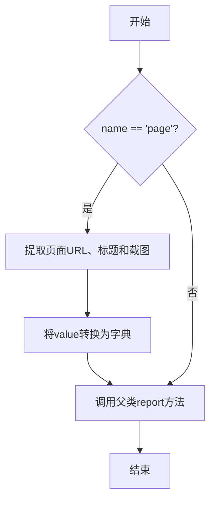

#### 带注释源码

```python
def report(self, value: Union[str, SyncPage], name: Literal["url", "page"]):
    """Report browser URL or page content synchronously."""
    # 如果报告的是页面内容，则提取页面的URL、标题和截图信息
    if name == "page":
        value = {"page_url": value.url, "title": value.title(), "screenshot": str(value.screenshot())}
    # 调用父类ResourceReporter的report方法进行实际的报告操作
    return super().report(value, name)
```

### `BrowserReporter.async_report`

该方法用于异步报告浏览器相关的资源观察数据，例如请求的URL或页面内容。它会根据传入的`name`参数处理不同类型的值（如URL字符串或Playwright的AsyncPage对象），并将其格式化为JSON数据后通过HTTP POST请求发送到配置的回调URL。

参数：

- `value`：`Union[str, AsyncPage]`，要报告的数据，可以是URL字符串或Playwright的AsyncPage对象。
- `name`：`Literal["url", "page"]`，数据的类型名称，指示是URL还是页面内容。
- `extra`：`Optional[dict]`，可选的额外数据，用于扩展报告内容。

返回值：`Any`，返回HTTP响应的文本内容，如果未配置回调URL则返回None。

#### 流程图

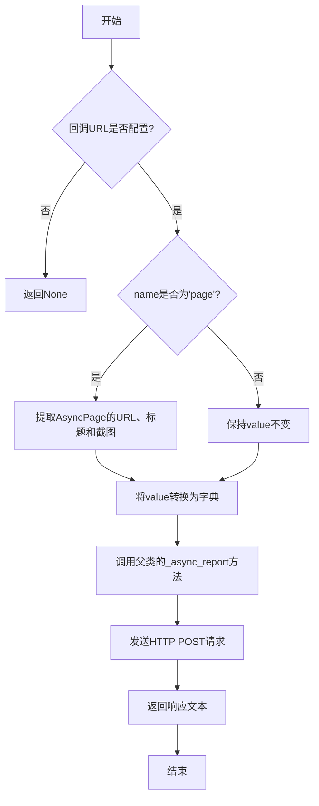

#### 带注释源码

```python
async def async_report(self, value: Union[str, AsyncPage], name: Literal["url", "page"]):
    """Report browser URL or page content asynchronously."""
    # 如果name为'page'，则从AsyncPage对象中提取URL、标题和截图，并转换为字典
    if name == "page":
        value = {"page_url": value.url, "title": await value.title(), "screenshot": str(await value.screenshot())}
    # 调用父类的异步报告方法，传递处理后的value、name和extra参数
    return await super().async_report(value, name)
```

### `ServerReporter.report`

该方法用于同步报告服务器部署信息。它继承自 `ResourceReporter` 基类，专门用于向配置的回调 URL 发送服务器本地 URL 信息。

参数：

- `value`：`str`，要报告的服务器本地 URL 值。
- `name`：`Literal["local_url"]`，报告数据的类型名称，默认为 `"local_url"`。

返回值：`Any`，返回底层 HTTP POST 请求的响应文本，如果 `callback_url` 未设置则返回 `None`。

#### 流程图

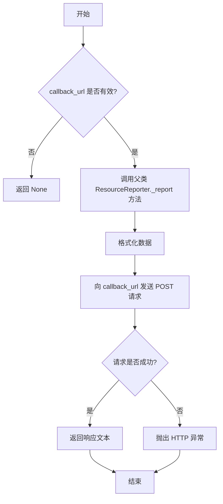

#### 带注释源码

```python
def report(self, value: str, name: Literal["local_url"] = "local_url"):
    """Report server deployment synchronously."""
    # 调用父类 ResourceReporter 的 report 方法
    # 该方法内部会调用 _report 方法，执行数据格式化与 HTTP 请求
    return super().report(value, name)
```

### `ServerReporter.async_report`

异步报告服务器部署信息。该方法继承自 `ResourceReporter` 基类，用于将服务器部署的本地 URL 等信息异步发送到指定的回调 URL。

参数：
- `value`：`str`，要报告的数据值，通常是服务器部署的本地 URL。
- `name`：`Literal["local_url"]`，数据类型的名称，固定为 `"local_url"`。
- `extra`：`Optional[dict]`，可选的额外数据字典，用于传递附加信息。

返回值：`Optional[str]`，返回服务器响应的文本内容，如果未设置回调 URL 则返回 `None`。

#### 流程图

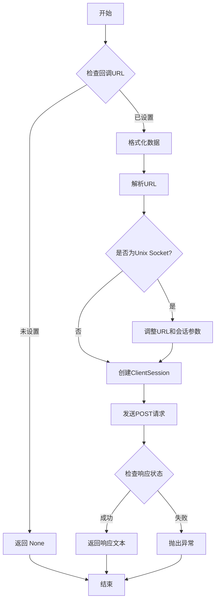

#### 带注释源码

```python
async def async_report(self, value: str, name: Literal["local_url"] = "local_url"):
    """Report server deployment asynchronously."""
    # 调用父类 ResourceReporter 的异步报告方法
    return await super().async_report(value, name)
```

### `ObjectReporter.report`

该方法用于同步报告完整的对象资源。它继承自 `ResourceReporter` 基类，并指定了报告的数据类型为 `"object"`。该方法将调用父类的 `_report` 方法，将提供的字典数据格式化为 JSON 并发送到配置的回调 URL。

参数：

- `value`：`dict`，要报告的对象数据，通常是一个字典。
- `name`：`Literal["object"]`，报告的数据类型名称，固定为 `"object"`。

返回值：`str`，HTTP 响应的文本内容，如果发送失败则可能引发异常。

#### 流程图

```mermaid
flowchart TD
    A[开始] --> B[调用父类 report 方法]
    B --> C{回调URL是否有效?}
    C -->|否| D[直接返回]
    C -->|是| E[格式化数据为 JSON]
    E --> F[发送 HTTP POST 请求]
    F --> G{请求是否成功?}
    G -->|是| H[返回响应文本]
    G -->|否| I[抛出异常]
    H --> J[结束]
    I --> J
    D --> J
```

#### 带注释源码

```python
def report(self, value: dict, name: Literal["object"] = "object"):
    """Report object resource synchronously."""
    # 调用父类 ResourceReporter 的 report 方法
    # 该方法内部会调用 _report 方法进行实际的 HTTP 请求发送
    return super().report(value, name)
```

### `ObjectReporter.async_report`

异步报告对象资源。该方法继承自 `ResourceReporter` 基类，用于将结构化的对象数据（字典格式）异步上报到指定的回调URL。它主要用于向“对象”类型的报告块发送数据。

参数：
- `value`：`dict`，要报告的对象数据，通常是一个字典。
- `name`：`Literal["object"]`，报告数据的类型名称，固定为 `"object"`。
- `extra`：`Optional[dict]`，可选的额外数据字典，将与主数据一同上报。

返回值：`Optional[str]`，如果上报成功且服务器返回了响应体，则返回响应文本（字符串）；如果未设置回调URL（`callback_url`为空），则返回 `None`。

#### 流程图

```mermaid
flowchart TD
    A[开始: async_report] --> B{callback_url 是否有效?};
    B -- 否 --> C[返回 None];
    B -- 是 --> D[调用 _format_data 格式化数据];
    D --> E[解析 callback_url];
    E --> F{是否为 Unix Socket 协议?};
    F -- 是 --> G[调整 URL 并配置 UnixConnector];
    F -- 否 --> H[使用标准 HTTP 配置];
    G --> I[创建异步 ClientSession];
    H --> I;
    I --> J[发起异步 POST 请求];
    J --> K{请求是否成功?};
    K -- 是 --> L[读取并返回响应文本];
    K -- 否 --> M[抛出 HTTP 异常];
    L --> N[结束];
    M --> N;
```

#### 带注释源码

```python
async def async_report(self, value: dict, name: Literal["object"] = "object"):
    """Report object resource asynchronously."""
    # 调用父类 ResourceReporter 的异步报告方法
    return await super().async_report(value, name)
```

### `ResourceReporter._report`

该方法用于同步报告资源观察数据。它会将数据格式化后通过 HTTP POST 请求发送到指定的回调 URL。如果回调 URL 未设置，则直接返回。

参数：
- `value`：`Any`，要报告的数据。
- `name`：`str`，数据的类型名称。
- `extra`：`Optional[dict]`，额外的元数据，可选。

返回值：`str`，HTTP 响应的文本内容。

#### 流程图

```mermaid
flowchart TD
    A[开始] --> B{回调URL是否设置?}
    B -->|否| C[直接返回]
    B -->|是| D[调用_format_data方法<br>格式化数据]
    D --> E[使用requests.post发送HTTP POST请求]
    E --> F{请求是否成功?}
    F -->|是| G[返回响应文本]
    F -->|否| H[抛出HTTP错误异常]
    H --> I[结束]
    C --> I
    G --> I
```

#### 带注释源码

```python
def _report(self, value: Any, name: str, extra: Optional[dict] = None):
    # 检查回调URL是否设置，若未设置则直接返回，不执行报告操作
    if not self.callback_url:
        return

    # 调用内部方法_format_data，将输入的数据、名称和额外信息格式化为适合发送的字典结构
    data = self._format_data(value, name, extra)
    # 使用requests库向指定的回调URL发送一个同步的HTTP POST请求，请求体为JSON格式的data
    resp = requests.post(self.callback_url, json=data)
    # 检查HTTP响应状态码，如果状态码表示错误（4xx或5xx），则抛出异常
    resp.raise_for_status()
    # 如果请求成功，返回响应体的文本内容
    return resp.text
```

### `FileReporter.async_report`

该方法用于异步报告文件资源。它继承自 `ResourceReporter` 基类，支持报告文件路径、元数据或内容。方法内部会调用基类的 `_async_report` 方法，将数据格式化为 JSON 并异步发送到指定的回调 URL。

参数：

- `value`：`Union[Path, dict, Any]`，要报告的数据，可以是文件路径、元数据字典或其他任意类型。
- `name`：`Literal["path", "meta", "content"]`，数据的类型名称，用于标识报告的内容类型。
- `extra`：`Optional[dict]`，可选的额外数据字典，用于提供附加信息。

返回值：`Any`，返回异步 HTTP 请求的响应文本，如果未设置回调 URL 则返回 `None`。

#### 流程图

```mermaid
graph TD
    A[开始] --> B{回调URL是否设置?}
    B -->|否| C[返回 None]
    B -->|是| D[格式化数据]
    D --> E[解析URL并处理Unix Socket]
    E --> F[创建异步HTTP会话]
    F --> G[发送POST请求]
    G --> H{请求是否成功?}
    H -->|是| I[返回响应文本]
    H -->|否| J[抛出异常]
    I --> K[结束]
    J --> K
    C --> K
```

#### 带注释源码

```python
async def async_report(
    self,
    value: Union[Path, dict, Any],
    name: Literal["path", "meta", "content"] = "path",
    extra: Optional[dict] = None,
):
    """Report file resource asynchronously."""
    # 调用父类 ResourceReporter 的异步报告方法
    return await super().async_report(value, name, extra)
```

### `GalleryReporter.report`

该方法用于同步报告图像资源（如图片元数据或文件路径）到指定的回调URL。它是`FileReporter`的子类，专门用于处理Gallery（图库）类型的资源报告，支持同步方式发送数据。

参数：

- `value`：`Union[dict, Path]`，要报告的数据，可以是包含图像元信息的字典或图像文件的路径对象。
- `name`：`Literal["meta", "path"]`，报告的数据类型名称，可选值为"meta"（元数据）或"path"（文件路径），默认为"path"。

返回值：`Any`，返回HTTP POST请求的响应文本，如果未设置回调URL则返回None。

#### 流程图

```mermaid
graph TD
    A[开始] --> B{回调URL是否设置?}
    B -->|否| C[返回None]
    B -->|是| D[格式化数据]
    D --> E[发送HTTP POST请求]
    E --> F{请求是否成功?}
    F -->|是| G[返回响应文本]
    F -->|否| H[抛出HTTP异常]
    H --> I[结束]
    G --> I
    C --> I
```

#### 带注释源码

```python
def report(self, value: Union[dict, Path], name: Literal["meta", "path"] = "path"):
    """Report image resource synchronously."""
    return super().report(value, name)
```

### `GalleryReporter.async_report`

异步报告图像资源数据。该方法继承自 `FileReporter` 和 `ResourceReporter`，用于向指定的回调 URL 发送图像资源的元数据或文件路径信息。它支持处理 Unix 域套接字连接，并自动格式化数据，包括当前角色信息。

参数：

- `value`：`Union[dict, Path]`，要报告的数据，可以是包含元信息的字典或文件路径对象。
- `name`：`Literal["meta", "path"]`，数据的类型名称，指示是元数据还是文件路径。

返回值：`Optional[str]`，如果回调 URL 未设置则返回 `None`，否则返回 HTTP 响应的文本内容。

#### 流程图

```mermaid
flowchart TD
    Start[开始] --> CheckURL{检查 callback_url}
    CheckURL -->|为空| ReturnNone[返回 None]
    CheckURL -->|不为空| FormatData[格式化数据]
    FormatData --> ParseURL[解析 URL 并处理 Unix 套接字]
    ParseURL --> CreateSession[创建异步 HTTP 会话]
    CreateSession --> SendPost[发送 POST 请求]
    SendPost --> CheckResponse{检查响应状态}
    CheckResponse -->|成功| ReturnText[返回响应文本]
    CheckResponse -->|失败| RaiseError[抛出异常]
    ReturnText --> End[结束]
    ReturnNone --> End
    RaiseError --> End
```

#### 带注释源码

```python
async def async_report(self, value: Union[dict, Path], name: Literal["meta", "path"] = "path"):
    """Report image resource asynchronously."""
    # 调用父类 ResourceReporter 的异步报告方法
    return await super().async_report(value, name)
```

## 关键组件


### ResourceReporter 基类

资源报告系统的核心基类，定义了统一的资源报告接口、数据格式化逻辑、同步/异步报告机制以及上下文管理器支持，为所有具体类型的报告器提供基础功能。

### 同步/异步报告机制

通过 `_report` 和 `_async_report` 方法以及对应的类方法 `set_report_fn` 和 `set_async_report_fn`，实现了可插拔的报告逻辑，支持向配置的 `callback_url` 发送 HTTP POST 请求，并处理 Unix Socket 等特殊 URL 格式。

### 上下文管理器

通过 `__enter__`/`__exit__` 和 `__aenter__`/`__aexit__` 方法，为同步和异步代码提供了资源报告的生命周期管理，确保在进入和退出上下文时自动发送开始和结束标记。

### LLM 流式报告集成

通过 `enable_llm_stream` 标志、`_llm_task` 私有属性和 `_llm_stream_report` 方法，实现了与 LLM 生成内容流的集成，能够异步地从队列中消费数据并实时报告。

### 具体报告器类 (TerminalReporter, BrowserReporter 等)

继承自 `ResourceReporter` 的各类具体报告器，如 `TerminalReporter`、`BrowserReporter`、`FileReporter` 等。它们通过固定 `block` 字段类型和重写 `report`/`async_report` 方法的参数类型，为终端命令、浏览器页面、文件路径、图像等特定类型的资源提供了类型安全且语义明确的报告接口。

### 数据格式化与角色上下文

`_format_data` 方法负责将报告的值、名称、额外信息以及从 `CURRENT_ROLE` 上下文变量或环境变量中获取的角色信息，统一封装成符合上报接口要求的 JSON 数据结构。

### 块类型枚举 (BlockType)

定义了系统支持的所有资源报告块类型（如 Terminal, Task, Browser 等），用于在报告数据中标识资源所属的UI组件或功能区域。

### 全局角色上下文 (CURRENT_ROLE)

使用 `contextvars.ContextVar` 维护的当前执行角色的上下文变量，确保在异步环境中也能正确地将报告与发起报告的角色关联起来。


## 问题及建议


### 已知问题

-   **`requests_unixsocket` 导入回退逻辑存在潜在问题**：代码尝试导入 `requests_unixsocket`，失败后回退到标准 `requests`。然而，`requests_unixsocket` 会修改 `requests` 模块的全局行为（如 `requests.Session` 和 `requests.adapters.HTTPAdapter`）。如果后续代码依赖 `requests_unixsocket` 的功能（例如，处理 `http+unix://` 协议的 URL），但导入失败，回退到标准 `requests` 将导致运行时错误（如 `InvalidSchema`），因为标准 `requests` 不支持该协议。当前代码仅在 `_async_report` 方法中处理了 `unix` 协议，但同步的 `_report` 方法直接使用 `requests.post`，如果 `callback_url` 是 `http+unix://` 协议，同步报告将失败。
-   **`_llm_task` 生命周期管理不完善**：在 `__aexit__` 方法中，仅当 `exc_type != asyncio.CancelledError` 时才等待 `_llm_task` 完成。如果异步上下文管理器因任务取消而退出，`_llm_task` 可能不会被正确清理，导致潜在的内存泄漏或未完成的异步任务。
-   **`wait_llm_stream_report` 方法逻辑可能无效**：该方法旨在等待 LLM 流报告完成，但其实现是检查队列是否为空，然后短暂休眠。这并不能可靠地等待 `_llm_task` 完成，因为任务可能在队列为空后仍在运行（例如，处理最后一条数据）。此外，如果 `_llm_task` 为 `None`，此方法将无限循环。
-   **`CURRENT_ROLE` 上下文变量可能引发 `LookupError`**：在 `_format_data` 方法中，使用 `CURRENT_ROLE.get(None)` 获取当前角色。然而，如果 `CURRENT_ROLE` 从未被设置（即没有调用 `CURRENT_ROLE.set()`），调用 `CURRENT_ROLE.get(None)` 是安全的，但文档中未明确说明调用者必须设置此上下文变量。如果依赖于此功能，缺乏设置可能导致 `role` 字段为 `None`，可能不符合接收端的期望。
-   **`sessiion_kwargs` 变量名拼写错误**：在 `_async_report` 方法中，变量 `sessiion_kwargs` 拼写错误（多了一个 ‘s’），应为 `session_kwargs`。虽然不影响功能，但影响代码可读性。
-   **`BlockType` 枚举值 `BROWSER_RT` 命名不清晰**：`BROWSER_RT` 被 `ServerReporter` 使用，但名称 “Browser-RT” 不能直观反映其用于服务器部署报告的功能，容易与浏览器实时功能混淆。

### 优化建议

-   **重构协议处理逻辑，明确依赖**：建议将 Unix Socket 协议的支持作为明确依赖或可选功能。可以创建一个统一的 HTTP 客户端工厂，根据 URL 协议动态创建合适的客户端（标准 HTTP 或 Unix Socket）。这样可以将协议处理逻辑集中，避免在 `_async_report` 中分散处理，并确保同步报告也能支持 Unix Socket。
-   **完善异步任务清理**：在 `__aexit__` 方法中，无论是否取消，都应尝试清理 `_llm_task`。可以添加一个 `finally` 块来取消任务（如果仍在运行）并等待其结束，以确保资源被正确释放。
-   **重写或移除 `wait_llm_stream_report` 方法**：如果此方法必要，应将其重写为等待 `_llm_task` 完成（使用 `await self._llm_task`），并添加适当的空值检查。或者，考虑移除此方法，因为外部调用者通常不需要直接等待内部任务，生命周期应由 `__aexit__` 管理。
-   **增强 `_format_data` 中角色获取的健壮性**：可以添加日志记录，当无法获取角色时进行提示。或者，提供一个设置默认角色的机制，确保 `role` 字段总有有意义的值。
-   **修正拼写错误**：将 `sessiion_kwargs` 重命名为 `session_kwargs`。
-   **考虑重命名 `BROWSER_RT` 或 `ServerReporter`**：将 `BlockType.BROWSER_RT` 重命名为更贴切的名称，如 `SERVER` 或 `DEPLOYMENT`，以准确反映其用途。或者，将 `ServerReporter` 的 `block` 字段改为新的枚举值。
-   **考虑添加连接池和超时配置**：当前的 `ClientSession` 和 `requests` 调用没有显式设置超时和连接池限制。在生产环境中，建议为 HTTP 客户端配置合理的超时（连接、读取）和连接池大小，以避免资源耗尽或长时间挂起。
-   **考虑将 `_format_data` 方法提取为独立函数或策略类**：该方法包含数据转换逻辑（如处理 `BaseModel`、`Path`）。将其提取出来可以提高可测试性，并允许未来通过依赖注入支持不同的数据格式化策略。


## 其它


### 设计目标与约束

本模块的核心设计目标是提供一个统一、可扩展的资源报告框架，用于将AI Agent在执行任务过程中产生的各类中间结果和最终产物（如终端输出、浏览器页面、文件、任务对象等）异步地报告给外部系统（如UI前端）。其设计遵循以下约束：
1.  **统一接口**：通过基类`ResourceReporter`定义同步(`report`)和异步(`async_report`)报告接口，所有具体报告器（如`TerminalReporter`, `BrowserReporter`）继承并特化此接口。
2.  **上下文感知**：利用`ContextVar` (`CURRENT_ROLE`) 自动捕获并附加当前执行`Role`的信息到报告数据中，实现报告与执行上下文的关联。
3.  **传输协议抽象**：支持通过HTTP或Unix Domain Socket（通过URL scheme `http+unix://`）发送报告，内部处理协议差异，对使用者透明。
4.  **流式报告支持**：通过异步上下文管理器(`__aenter__`/`__aexit__`)和队列机制，支持与LLM（大语言模型）输出流集成，实现实时内容流式报告。
5.  **数据格式标准化**：报告数据统一封装为包含`block`（资源类型）、`uuid`（唯一标识）、`value`（数据值）、`name`（数据子类型）、`role`（产生者角色）等字段的JSON结构。

### 错误处理与异常设计

模块的错误处理主要围绕网络通信和数据序列化：
1.  **网络请求异常**：在`_report`和`_async_report`方法中，使用`resp.raise_for_status()`。当HTTP请求返回非2xx状态码时，会抛出`requests.HTTPError`或`aiohttp.ClientResponseError`异常，将错误传播给调用者。调用者需负责捕获和处理这些异常。
2.  **连接与超时**：对于同步请求，依赖`requests`库的默认超时和重试行为。对于异步请求，使用`aiohttp.ClientSession`，其连接超时、读写超时等需在创建`ClientSession`时通过`timeout`参数配置，当前代码未显式设置，依赖于`aiohttp`默认值。
3.  **数据序列化异常**：在`_format_data`方法中，对`BaseModel`和`Path`对象进行转换。若这些对象的`model_dump()`或`str()`方法调用失败，会抛出相应的`AttributeError`、`TypeError`等异常。这些异常会向上传播，导致报告失败。
4.  **异步上下文管理异常**：在`__aexit__`方法中，通过检查`exc_type != asyncio.CancelledError`来避免在任务被取消时等待`_llm_task`，防止程序挂起。其他异常会正常传播。
5.  **静默失败**：当`callback_url`为空字符串时，`_report`和`_async_report`方法会直接返回，不执行任何操作，这是一种静默失败的设计，允许在不需要报告时禁用功能。

### 数据流与状态机

模块的数据流和状态主要体现在报告生命周期和LLM流集成：
1.  **报告触发**：由外部代码（如`Role`的行为方法）调用具体报告器实例的`report`或`async_report`方法触发。
2.  **数据处理流水线**：
    *   **输入**：原始数据`value`、数据子类型`name`、额外信息`extra`。
    *   **格式化**：调用`_format_data`方法，将实例信息（`block`, `uuid`）、上下文信息（`CURRENT_ROLE`）、环境信息（`METAGPT_ROLE`）与输入数据合并，构造标准JSON字典。对特定类型（`BaseModel`, `Path`）进行序列化。
    *   **传输**：根据`callback_url`的scheme，选择使用`requests.post`（同步HTTP/Unix Socket）或`aiohttp.ClientSession.post`（异步HTTP/Unix Socket）发送JSON数据。
    *   **输出**：服务器响应文本（成功时）或异常（失败时）。
3.  **流式报告状态机**（当`enable_llm_stream=True`时）：
    *   **进入状态 (`__aenter__`)**：创建全局LLM流队列（`create_llm_stream_queue`），并启动一个后台任务`_llm_task`执行`_llm_stream_report`。该任务循环从队列中获取数据并调用`async_report`发送。
    *   **流式写入状态**：外部LLM生成器将数据块放入全局队列（`get_llm_stream_queue().put(...)`）。
    *   **流式读取与发送状态**：`_llm_task`从队列取出数据，格式化并发送。
    *   **结束状态 (`__aexit__`)**：向全局队列发送终止信号`None`，等待`_llm_task`完成，然后发送`END_MARKER`报告标志流结束。
4.  **上下文状态**：通过`CURRENT_ROLE`上下文变量管理，确保在异步调用链中能正确获取发起报告的`Role`实例。

### 外部依赖与接口契约

1.  **外部依赖库**：
    *   **核心通信**：`aiohttp` (异步HTTP客户端), `requests` (同步HTTP客户端), `requests_unixsocket` (可选，用于同步Unix Socket支持)。
    *   **工具与类型**：`playwright` (用于`BrowserReporter`中的页面截图), `pydantic` (用于数据模型定义与验证)。
    *   **标准库**：`asyncio`, `typing`, `urllib.parse`, `uuid`, `contextvars`, `os`, `pathlib`, `enum`。
2.  **对上游调用者的契约**：
    *   **方法签名**：调用者必须按照具体报告器定义的`report`/`async_report`方法的参数类型（如`TerminalReporter`的`name`只能为`"cmd"`或`"output"`）传递数据。
    *   **异步上下文**：若使用流式报告(`enable_llm_stream=True`)，调用者必须使用`async with`语句创建报告器实例，并确保在合适的异步上下文中运行。
    *   **角色上下文**：期望在报告发生时，`CURRENT_ROLE`上下文变量已被设置为当前的`Role`实例（通常在`Role`的`_think`、`_act`等方法入口处设置）。
3.  **对下游接收端（`callback_url`）的契约**：
    *   **协议**：支持HTTP POST请求。URL scheme可为`http://`, `https://` 或 `http+unix://`（后者指向Unix Domain Socket）。
    *   **数据格式**：请求体为JSON，格式由`_format_data`方法定义，至少包含`block`, `uuid`, `value`, `name`, `role`字段。`value`字段的结构因`block`和`name`而异。
    *   **结束标志**：当`name`为`END_MARKER_NAME` (`"end_marker"`)时，表示一个报告流或上下文的结束，`value`为`None`。
    *   **响应**：期望接收端返回HTTP 2xx状态码。响应内容（文本）会被返回给调用者。
4.  **环境变量依赖**：`METAGPT_ROLE`，当`CURRENT_ROLE`上下文变量未设置时，作为`role`字段的备选值。

    