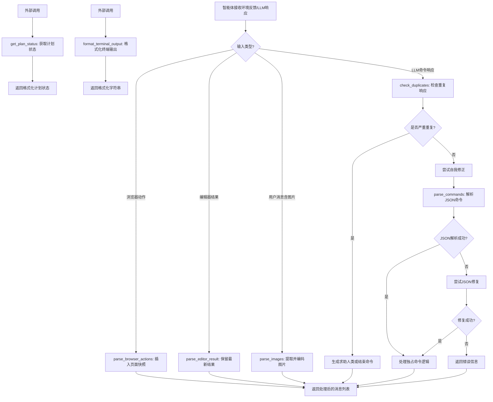
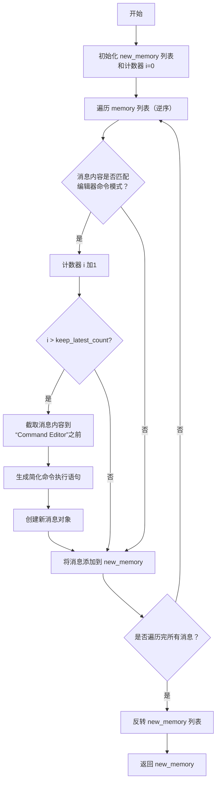
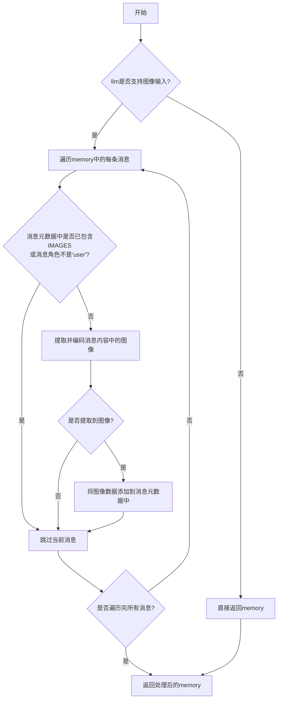
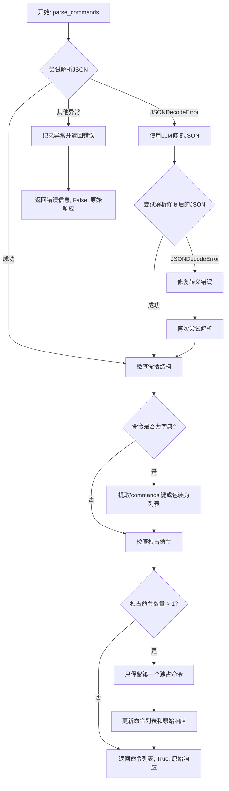
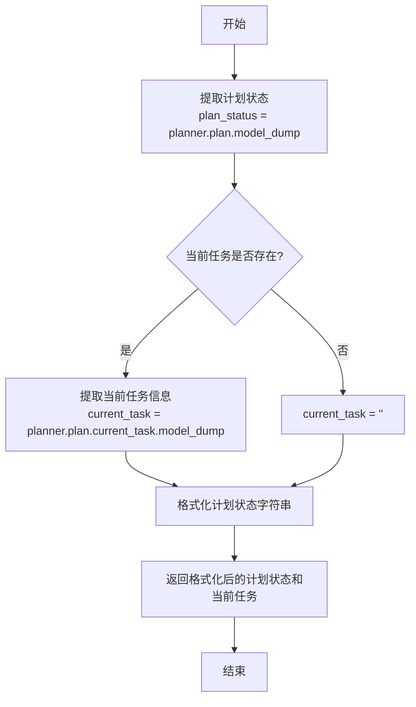
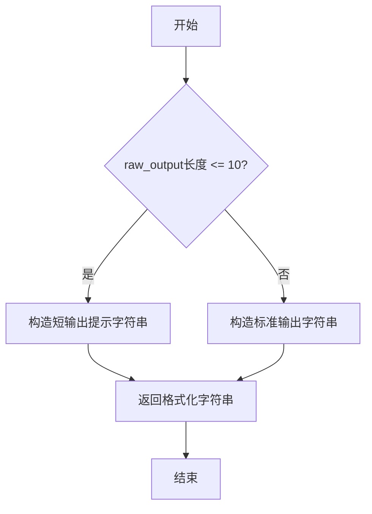

# `.\MetaGPT\metagpt\utils\role_zero_utils.py` 详细设计文档

该文件是MetaGPT框架中用于处理智能体（Agent）与外部环境（如浏览器、编辑器）交互以及解析大语言模型（LLM）响应的工具模块。它包含了一系列异步函数，用于解析和格式化来自浏览器的动作、编辑器的结果、图像信息，检查LLM响应的重复性，解析LLM生成的命令JSON，获取计划状态以及格式化终端输出。其核心功能是作为智能体决策循环中的“响应处理器”，将原始、可能不规范的环境反馈和LLM输出，转化为结构化的、可供智能体执行或决策的内部消息和命令。

## 整体流程



## 类结构

```
di_utils.py (工具函数集合)
├── 异步处理函数
│   ├── parse_browser_actions
│   ├── parse_editor_result
│   ├── parse_images
│   ├── check_duplicates
│   └── parse_commands
└── 同步处理函数
    ├── get_plan_status
    └── format_terminal_output
```

## 全局变量及字段


    

## 全局函数及方法

### `parse_browser_actions`

该函数用于解析浏览器操作历史。它会检查传入的消息内存列表，如果浏览器当前页面非空，它会从最新的消息开始反向查找，寻找包含“Command Browser.{某个操作} executed”模式的消息。一旦找到，就在该消息之后（即原列表中的下一个位置）插入一条新的用户消息，其内容为当前浏览器的视图快照（通过`browser.view()`异步获取），并将消息的起因标记为“browser”。最终返回更新后的消息内存列表。

参数：

- `memory`：`list[Message]`，一个包含历史消息对象的列表。
- `browser`：`browser`（类型推断为具有`is_empty_page`属性和`view()`方法的浏览器对象），代表一个浏览器实例，用于检查页面状态和获取视图。

返回值：`list[Message]`，返回更新后的消息内存列表。

#### 流程图

```mermaid
graph TD
    A[开始: parse_browser_actions] --> B{浏览器页面是否为空?<br/>browser.is_empty_page};
    B -- 是 --> C[直接返回原 memory 列表];
    B -- 否 --> D[定义正则模式 pattern];
    D --> E[使用 zip 反向遍历 memory];
    E --> F{当前消息内容是否匹配 pattern?};
    F -- 否 --> G[继续遍历];
    F -- 是 --> H[在匹配消息的索引位置后<br/>插入新的 UserMessage];
    H --> I[消息内容为 await browser.view()<br/>起因 cause_by 设为 'browser'];
    I --> J[跳出循环];
    J --> K[返回更新后的 memory 列表];
    G --> E;
    C --> K;
```

#### 带注释源码

```python
async def parse_browser_actions(memory: list[Message], browser) -> list[Message]:
    # 检查浏览器当前页面是否为空。如果为空，则无需处理，直接返回原内存列表。
    if not browser.is_empty_page:
        # 编译一个正则表达式模式，用于匹配消息内容中类似 "Command Browser.open executed" 的字符串。
        pattern = re.compile(r"Command Browser\.(\w+) executed")
        # 使用 zip 和 range 从 memory 列表的末尾开始向前遍历（反向遍历）。
        # `range(len(memory), 0, -1)` 生成从列表长度递减到1的索引。
        # `memory[::-1]` 是列表的反向副本。
        # 这样组合可以同时获得反向的索引和对应的消息。
        for index, msg in zip(range(len(memory), 0, -1), memory[::-1]):
            # 检查当前消息的内容是否匹配定义的正则模式。
            if pattern.search(msg.content):
                # 如果找到匹配的消息，在其后（原列表中的 index 位置）插入一条新的用户消息。
                # 新消息的内容通过异步调用 `browser.view()` 获取，这可能是当前页面的截图或DOM快照。
                # 消息的 `cause_by` 属性被设置为 "browser"，用于标识此消息的来源。
                memory.insert(index, UserMessage(cause_by="browser", content=await browser.view()))
                # 找到第一个匹配项后，任务完成，跳出循环。
                break
    # 返回处理后的 memory 列表。如果未找到匹配项或页面为空，则返回原列表。
    return memory
```

### `parse_editor_result`

该函数用于处理消息历史（`memory`），保留最新的编辑器命令执行结果，并移除过时的结果。它通过正则表达式匹配消息内容中的编辑器命令，只保留指定数量（默认为5条）的最新命令记录，并将其他匹配到的命令简化为执行语句，从而优化内存使用和消息历史的结构。

参数：

- `memory`：`list[Message]`，消息历史列表，包含用户和系统的交互消息。
- `keep_latest_count`：`int`，可选参数，默认为5，指定保留的最新编辑器命令结果数量。

返回值：`list[Message]`，处理后的消息历史列表，保留了最新的编辑器命令结果，并移除了过时的结果。

#### 流程图



#### 带注释源码

```python
async def parse_editor_result(memory: list[Message], keep_latest_count=5) -> list[Message]:
    """Retain the latest result and remove outdated editor results."""
    # 定义正则表达式模式，用于匹配消息内容中的编辑器命令执行语句
    pattern = re.compile(r"Command Editor\.(\w+?) executed")
    new_memory = []  # 初始化新的消息列表
    i = 0  # 计数器，用于跟踪匹配到的编辑器命令数量
    # 逆序遍历消息历史，以便从最新消息开始处理
    for msg in reversed(memory):
        matches = pattern.findall(msg.content)  # 查找消息内容中所有匹配的编辑器命令
        if matches:  # 如果找到匹配的编辑器命令
            i += 1  # 计数器加1
            if i > keep_latest_count:  # 如果匹配的命令数量超过保留的最新数量
                # 截取消息内容到“Command Editor”之前的部分
                new_content = msg.content[: msg.content.find("Command Editor")]
                # 为每个匹配的命令生成简化的执行语句
                new_content += "\n".join([f"Command Editor.{match} executed." for match in matches])
                # 创建新的消息对象，替换原始消息
                msg = UserMessage(content=new_content)
        new_memory.append(msg)  # 将消息添加到新的消息列表
    # 反转新的消息列表，恢复原始顺序（最新消息在末尾）
    new_memory.reverse()
    return new_memory  # 返回处理后的消息列表
```

### `parse_images`

该函数用于处理消息列表中的用户消息，提取并编码其中的图像信息，然后将图像数据添加到消息的元数据中，以便后续处理。如果语言模型不支持图像输入，则直接返回原始消息列表。

参数：

- `memory`：`list[Message]`，消息列表，包含用户消息和其他消息。
- `llm`：`LanguageModel`，语言模型实例，用于检查是否支持图像输入。

返回值：`list[Message]`，处理后的消息列表，其中用户消息的元数据中可能包含图像数据。

#### 流程图



#### 带注释源码

```python
async def parse_images(memory: list[Message], llm) -> list[Message]:
    # 检查语言模型是否支持图像输入，如果不支持则直接返回原始消息列表
    if not llm.support_image_input():
        return memory

    # 遍历消息列表中的每条消息
    for msg in memory:
        # 如果消息的元数据中已经包含图像信息，或者消息角色不是'user'，则跳过当前消息
        if IMAGES in msg.metadata or msg.role != "user":
            continue

        # 从消息内容中提取并编码图像数据
        images = extract_and_encode_images(msg.content)

        # 如果成功提取到图像数据，则将其添加到消息的元数据中
        if images:
            msg.add_metadata(IMAGES, images)

    # 返回处理后的消息列表
    return memory
```

### `check_duplicates`

该函数用于检测并处理LLM（大语言模型）生成的重复响应。它通过检查当前响应是否在最近的历史响应窗口中出现过来判断重复。如果检测到重复，根据重复次数和特定命令（如`Plan.finish_current_task`）采取不同策略：重复次数达到3次且非特定命令时，会向LLM请求问题摘要并构造一个向人类求助的命令；否则，尝试让LLM自我纠正并重新生成响应。其核心目标是防止LLM陷入重复输出的循环，确保对话或任务执行的进展。

参数：

- `req`：`list[dict]`，发送给LLM的原始请求消息列表。
- `command_rsp`：`str`，LLM当前生成的原始响应字符串。
- `rsp_hist`：`list[str]`，LLM响应的历史记录列表。
- `llm`：`object`，LLM客户端对象，用于调用`aask`方法请求新的响应。
- `respond_language`：`str`，响应的语言，用于格式化提示词。
- `check_window`：`int`，默认值为10，用于检查重复的历史响应窗口大小。

返回值：`str`，处理后的命令响应字符串。可能是原始响应、一个请求人类帮助的JSON命令字符串，或者是LLM重新生成的新响应。

#### 流程图

```mermaid
flowchart TD
    A[开始: check_duplicates] --> B[获取最近历史响应<br>past_rsp = rsp_hist[-check_window:]]
    B --> C{当前响应 command_rsp<br>是否在 past_rsp 中?}
    C -- 否 --> D[返回原始响应 command_rsp]
    C -- 是 --> E{响应中是否包含<br>“command_name”: “end”?}
    E -- 是 --> D
    E -- 否 --> F{重复次数 >= 3?}
    F -- 否 --> G[记录警告日志<br>请求LLM重新生成响应<br>返回新响应]
    F -- 是 --> H{响应中是否包含<br>“Plan.finish_current_task”?}
    H -- 是 --> I[返回 END_COMMAND]
    H -- 否 --> J[请求LLM总结问题<br>构造ASK_HUMAN_COMMAND<br>返回求助命令]
    G --> K[结束]
    D --> K
    I --> K
    J --> K
```

#### 带注释源码

```python
async def check_duplicates(
    req: list[dict], command_rsp: str, rsp_hist: list[str], llm, respond_language: str, check_window: int = 10
) -> str:
    # 1. 获取最近的历史响应窗口
    past_rsp = rsp_hist[-check_window:]
    # 2. 检查当前响应是否为重复响应，并且不是“end”命令
    if command_rsp in past_rsp and '"command_name": "end"' not in command_rsp:
        # 3. 如果重复次数达到或超过3次
        if past_rsp.count(command_rsp) >= 3:
            # 4. 特殊处理：如果重复的是“Plan.finish_current_task”命令，则直接返回“end”命令来结束任务
            if '"command_name": "Plan.finish_current_task",' in command_rsp:
                logger.warning(f"Duplicate response detected: {command_rsp}")
                return END_COMMAND
            # 5. 否则，请求LLM总结当前遇到的问题
            problem = await llm.aask(
                req + [UserMessage(content=SUMMARY_PROBLEM_WHEN_DUPLICATE.format(language=respond_language))]
            )
            # 6. 将问题格式化到向人类求助的命令中
            ASK_HUMAN_COMMAND[0]["args"]["question"] = ASK_HUMAN_GUIDANCE_FORMAT.format(problem=problem).strip()
            ask_human_command = "```json\n" + json.dumps(ASK_HUMAN_COMMAND, indent=4, ensure_ascii=False) + "\n```"
            return ask_human_command
        # 7. 如果重复次数少于3次，则尝试让LLM自我纠正，重新生成响应
        logger.warning(f"Duplicate response detected: {command_rsp}")
        regenerate_req = req + [UserMessage(content=REGENERATE_PROMPT)]
        regenerate_req = llm.format_msg(regenerate_req)
        command_rsp = await llm.aask(regenerate_req)
    # 8. 返回处理后的响应（可能是原始响应、求助命令或新生成的响应）
    return command_rsp
```

### `parse_commands`

该函数用于从大型语言模型（LLM）的响应字符串中解析出命令列表。它处理JSON解析错误，尝试修复LLM输出格式，并对命令列表进行后处理，例如处理独占工具命令。

参数：

- `command_rsp`：`str`，LLM返回的原始响应字符串，预期包含JSON格式的命令列表。
- `llm`：`LLM`，大型语言模型实例，用于在JSON解析失败时请求修复。
- `exclusive_tool_commands`：`list[str]`，独占工具命令的名称列表。如果命令列表中出现多个此类命令，只保留第一个。

返回值：`Tuple[list[dict], bool, str]`，返回一个三元组：
  1. 解析后的命令字典列表（如果成功）或错误信息字符串（如果失败）。
  2. 布尔值，表示解析是否成功（`True`为成功，`False`为失败）。
  3. 处理后的原始响应字符串（可能因独占命令处理而被修改）。

#### 流程图



#### 带注释源码

```python
async def parse_commands(command_rsp: str, llm, exclusive_tool_commands: list[str]) -> Tuple[list[dict], bool, str]:
    """Retrieves commands from the Large Language Model (LLM).

    This function attempts to retrieve a list of commands from the LLM by
    processing the response (`command_rsp`). It handles potential errors
    during parsing and LLM response formats.

    Returns:
        A tuple containing:
            - A boolean flag indicating success (True) or failure (False).
    """
    try:
        # 1. 尝试使用CodeParser解析JSON块
        commands = CodeParser.parse_code(block=None, lang="json", text=command_rsp)
        # 2. 容错处理：如果以']'结尾但未以'['开头，则添加'['
        if commands.endswith("]") and not commands.startswith("["):
            commands = "[" + commands
        # 3. 使用repair_llm_raw_output修复LLM原始输出中的JSON格式问题，然后加载为Python对象
        commands = json.loads(repair_llm_raw_output(output=commands, req_keys=[None], repair_type=RepairType.JSON))
    except json.JSONDecodeError as e:
        # 4. 如果JSON解析失败，记录警告并尝试使用LLM修复JSON
        logger.warning(f"Failed to parse JSON for: {command_rsp}. Trying to repair...")
        commands = await llm.aask(msg=JSON_REPAIR_PROMPT.format(json_data=command_rsp, json_decode_error=str(e)))
        try:
            # 5. 尝试解析LLM修复后的输出
            commands = json.loads(CodeParser.parse_code(block=None, lang="json", text=commands))
        except json.JSONDecodeError:
            # 6. 如果LLM修复后仍然失败，则尝试修复转义错误（如代码和数学符号）
            commands = CodeParser.parse_code(block=None, lang="json", text=command_rsp)
            new_command = repair_escape_error(commands)
            commands = json.loads(
                repair_llm_raw_output(output=new_command, req_keys=[None], repair_type=RepairType.JSON)
            )
    except Exception as e:
        # 7. 处理其他未知异常，打印堆栈跟踪并返回错误信息
        tb = traceback.format_exc()
        print(tb)
        error_msg = str(e)
        return error_msg, False, command_rsp

    # 8. 容错处理：如果解析结果是单个字典，则尝试提取'commands'键或将其包装为列表
    if isinstance(commands, dict):
        commands = commands["commands"] if "commands" in commands else [commands]

    # 9. 处理独占工具命令：检查命令列表中是否包含多个独占命令
    command_flag = [command["command_name"] not in exclusive_tool_commands for command in commands]
    if command_flag.count(False) > 1:
        # 10. 如果存在多个独占命令，只保留第一个
        index_of_first_exclusive = command_flag.index(False)
        commands = commands[: index_of_first_exclusive + 1]
        # 11. 更新原始响应字符串以反映修改后的命令列表
        command_rsp = "```json\n" + json.dumps(commands, indent=4, ensure_ascii=False) + "\n```"
        logger.info("exclusive command more than one in current command list. change the command list.\n" + command_rsp)
    # 12. 返回解析后的命令列表、成功标志和处理后的原始响应
    return commands, True, command_rsp
```

### `get_plan_status`

该函数用于获取并格式化计划（Plan）的状态信息。它从传入的`planner`对象中提取计划的整体目标、任务列表以及当前任务（如果存在）的详细信息，并将这些信息格式化为一个结构化的字符串表示，以便于日志记录或展示。

参数：

- `planner`：`Planner`类型，包含计划（Plan）信息的规划器对象。

返回值：`Tuple[str, str]`，返回一个包含两个字符串的元组。第一个字符串是格式化后的计划状态（包含目标和所有任务），第二个字符串是当前任务的详细信息（如果存在）。

#### 流程图



#### 带注释源码

```python
def get_plan_status(planner) -> Tuple[str, str]:
    # 从planner对象中提取计划（Plan）的状态信息，包括目标（goal）和任务列表（tasks）
    plan_status = planner.plan.model_dump(include=["goal", "tasks"])
    # 检查当前任务是否存在，如果存在则提取其信息（排除code、result、is_success字段），否则返回空字符串
    current_task = (
        planner.plan.current_task.model_dump(exclude=["code", "result", "is_success"])
        if planner.plan.current_task
        else ""
    )
    # 开始格式化计划状态字符串，首先添加目标（GOAL）
    formatted_plan_status = f"[GOAL] {plan_status['goal']}\n"
    # 检查任务列表是否为空
    if len(plan_status["tasks"]) > 0:
        # 如果任务列表不为空，添加[Plan]标题
        formatted_plan_status += "[Plan]\n"
        # 遍历所有任务，格式化每个任务的信息
        for task in plan_status["tasks"]:
            # 格式化每个任务的信息，包括任务ID、完成状态、指令、依赖任务和负责人
            formatted_plan_status += f"[TASK_ID {task['task_id']}] ({'finished' if task['is_finished'] else '    '}){task['instruction']} This task depends on tasks{task['dependent_task_ids']}. [Assign to {task['assignee']}]\n"
    else:
        # 如果任务列表为空，添加“No Plan”提示
        formatted_plan_status += "No Plan \n"
    # 返回格式化后的计划状态字符串和当前任务信息
    return formatted_plan_status, current_task
```

### `format_terminal_output`

该函数用于格式化终端命令的执行结果，将其包装成结构化的字符串输出。当命令的原始输出较短时，会添加一个提示以引起注意。

参数：

- `cmd`：`dict`，包含命令信息的字典，其中`args`键下应有`cmd`键，表示执行的命令字符串。
- `raw_output`：`str`，命令执行后的原始输出字符串。

返回值：`str`，格式化后的命令输出字符串。

#### 流程图



#### 带注释源码

```python
def format_terminal_output(cmd: dict, raw_output: str) -> str:
    # 检查原始输出字符串的长度是否小于等于10个字符
    if len(raw_output) <= 10:
        # 如果是短输出，构造一个包含警告提示的格式化字符串
        command_output = f"\n[command]: {cmd['args']['cmd']} \n[command output] : {raw_output} (pay attention to this.)"
    else:
        # 如果是正常长度的输出，构造标准的格式化字符串
        command_output = f"\n[command]: {cmd['args']['cmd']} \n[command output] : {raw_output}"
    # 返回格式化后的字符串
    return command_output
```

## 关键组件


### 浏览器动作解析器 (Browser Action Parser)

用于在对话历史中检测浏览器操作命令，并在相应位置插入当前浏览器页面视图的快照，以提供操作后的上下文信息。

### 编辑器结果解析器 (Editor Result Parser)

用于清理对话历史中的编辑器操作结果，保留最新的若干条结果，移除过时的结果，以保持历史记录的简洁性和相关性。

### 图像内容解析器 (Image Content Parser)

用于检查对话历史中的用户消息，提取并编码其中的图像信息，并将其作为元数据附加到消息中，以支持支持图像输入的LLM模型。

### 重复响应检查器 (Duplicate Response Checker)

用于检测LLM生成的命令响应是否与近期历史重复，若重复则可能表明LLM陷入循环，此时会触发自我修正或请求人工干预，以确保任务流程的推进。

### 命令解析器 (Command Parser)

用于从LLM的原始文本响应中解析出结构化的命令列表。它包含多层容错机制，包括JSON解析修复、转义错误修复以及针对独占命令（如`end`）的格式规范化处理。

### 计划状态获取器 (Plan Status Getter)

用于从规划器（Planner）组件中提取当前计划的整体状态（目标、任务列表）和当前正在执行的任务详情，并将其格式化为易读的文本字符串，以供其他组件（如LLM）参考。

### 终端输出格式化器 (Terminal Output Formatter)

用于将终端命令执行的原始输出进行格式化，根据输出内容的长度添加不同的提示信息，以增强其在对话上下文中的可读性和重要性指示。


## 问题及建议


### 已知问题

-   **`parse_editor_result` 函数逻辑复杂且可能出错**：该函数通过正则匹配和手动计数来保留最新的编辑器结果，逻辑较为复杂。当消息内容中“Command Editor”出现的位置不固定或格式有微小变化时，正则表达式可能无法正确匹配，导致消息处理错误或信息丢失。
-   **`check_duplicates` 函数存在硬编码逻辑和潜在性能问题**：函数中硬编码了针对 `"Plan.finish_current_task"` 命令的特殊处理逻辑（`END_COMMAND`），这降低了代码的可维护性和可扩展性。同时，函数通过线性搜索 (`past_rsp.count(command_rsp)`) 来检测重复，在处理长历史记录时可能影响性能。
-   **`parse_commands` 函数错误处理不完整**：函数在捕获 `json.JSONDecodeError` 和其他 `Exception` 时，虽然尝试修复，但最终的 `except Exception` 块返回的元组包含三个元素 (`error_msg, False, command_rsp`)，而函数声明的返回类型 `Tuple[list[dict], bool]` 只包含两个元素，这会导致类型不匹配和潜在的运行时错误。此外，错误处理流程中打印了完整的堆栈跟踪 (`print(tb)`)，在生产环境中可能不合适。
-   **`format_terminal_output` 函数判断逻辑过于简单**：该函数仅根据原始输出字符串的长度（`len(raw_output) <= 10`）来决定是否添加“pay attention to this.”的提示。这种启发式方法非常脆弱，短输出不一定不重要，长输出也可能包含关键错误信息，导致提示不准确。
-   **全局依赖和硬编码字符串**：代码中大量使用了从 `metagpt.prompts.di.role_zero` 导入的硬编码提示字符串（如 `ASK_HUMAN_COMMAND`, `END_COMMAND` 等）。这使得业务逻辑与特定的提示文本紧密耦合，难以复用、测试或适应不同的场景（如国际化）。修改提示需要直接修改源代码。

### 优化建议

-   **重构 `parse_editor_result` 函数**：考虑重构该函数的逻辑，使其更清晰、健壮。可以探索使用更结构化的方式在消息中标记编辑器操作结果，而不是依赖字符串匹配和手动计数。
-   **解耦 `check_duplicates` 中的业务逻辑**：将针对特定命令（如 `"Plan.finish_current_task"`）的特殊处理逻辑抽象为可配置的规则或策略模式，提高代码的灵活性和可维护性。对于重复检测，可以考虑使用更高效的数据结构（如滑动窗口配合集合或计数器）来优化性能。
-   **修正 `parse_commands` 函数的返回类型和错误处理**：修正函数的返回类型声明以匹配实际返回值（例如改为 `Tuple[list[dict], bool, str]` 或重构错误处理流程使其返回一致的类型）。将 `print(tb)` 替换为使用项目标准的日志工具（如 `logger.error`）来记录异常，并考虑是否需要在某些情况下向上抛出异常而非静默处理。
-   **改进 `format_terminal_output` 的判断逻辑**：引入更智能的判断机制。例如，可以基于命令的退出码、输出中是否包含特定的错误关键词（如 `"error"`, `"fail"`）或结合输出长度与内容特征来生成更准确的提示信息。
-   **将硬编码提示外部化**：将 `metagpt.prompts.di.role_zero` 中的提示字符串移至配置文件、数据库或环境变量中管理。这样可以实现提示内容的动态更新、多环境配置以及更方便的A/B测试，降低代码与具体文本的耦合度。


## 其它


### 设计目标与约束

本模块的核心设计目标是作为智能体（Agent）与外部环境（如浏览器、编辑器、终端）及大语言模型（LLM）交互的**中间件和解析器**。其主要职责是：1. **标准化与净化**：对来自不同来源（如LLM响应、用户消息、工具执行结果）的异构数据进行解析、格式化和清洗，确保下游组件（如角色、工具）能够处理结构化的、一致的数据。2. **流程控制与容错**：通过检测重复响应、修复损坏的JSON、处理独占命令等方式，增强系统的鲁棒性，防止因LLM输出不稳定或工具使用冲突导致的流程中断。3. **状态与上下文管理**：维护和更新智能体的工作记忆（Memory），提取关键状态信息（如计划状态），为LLM的下一步决策提供清晰的上下文。核心约束包括：必须兼容异步操作以支持高并发交互；解析逻辑需高度容错以应对LLM输出的不确定性；性能开销需控制在合理范围内，避免对核心决策循环造成显著延迟。

### 错误处理与异常设计

模块采用了多层次的防御性错误处理策略：
1.  **预期异常捕获**：在`parse_commands`函数中，明确捕获`json.JSONDecodeError`，并尝试通过LLM辅助修复或使用专门的修复工具（`repair_llm_raw_output`, `repair_escape_error`）进行恢复。对于其他未知异常，捕获`Exception`并记录详细堆栈信息，返回错误标志。
2.  **业务逻辑容错**：
    *   `check_duplicates`：通过检测重复的LLM响应来识别可能的模型“卡住”或退化问题，并触发重新生成或向人类求助的流程。
    *   `parse_commands`：对LLM返回的命令列表进行后处理，如将单个字典命令包装为列表，以及处理独占命令（`exclusive_tool_commands`）的冲突，确保命令执行的逻辑一致性。
3.  **降级与恢复**：当JSON解析完全失败时，函数会返回一个包含错误信息的字符串和`False`标志，允许调用者根据情况决定是重试、记录日志还是采取其他恢复措施。对于重复响应，提供了从“自我纠正”（重新生成）到“人工介入”的逐步升级处理流程。
4.  **日志与监控**：使用`logger`记录警告（如重复响应、JSON解析失败）和信息（如命令列表调整），便于问题追踪和系统监控。`traceback.format_exc()`用于在未知异常时提供完整的调试信息。

### 数据流与状态机

模块处理的数据流主要围绕`Message`列表（即`memory`）和LLM的原始响应（`command_rsp`）展开：
1.  **记忆（Memory）处理流**：
    *   **输入**：原始的`memory`列表（`list[Message]`）。
    *   **处理节点**：
        *   `parse_browser_actions`：在检测到浏览器操作命令后，向`memory`中插入当前浏览器页面视图的快照，丰富上下文。
        *   `parse_editor_result`：过滤编辑器操作的历史结果，仅保留最新几条，防止记忆被过时的操作细节淹没。
        *   `parse_images`：从用户消息中提取并编码图像，附加到消息元数据中，为支持多模态的LLM准备输入。
    *   **输出**：更新后的`memory`列表，作为LLM查询的上下文。
2.  **命令解析与生成流**：
    *   **输入**：LLM的原始文本响应`command_rsp`、历史响应列表`rsp_hist`、请求列表`req`。
    *   **处理节点**：
        *   `check_duplicates`：检查当前响应是否在近期历史中重复，若重复则触发修正流程，可能返回修正后的响应或求助命令。
        *   `parse_commands`：将（可能已修正的）`command_rsp`解析为结构化的命令字典列表。此过程包含JSON解析、修复、格式规范化及独占命令逻辑处理。
    *   **输出**：结构化的命令列表（`list[dict]`）、解析成功标志、以及最终使用的响应文本。
3.  **状态查询流**：
    *   `get_plan_status`：从`planner`对象中提取计划目标、任务列表及当前任务的详细信息，格式化为易读的字符串，用于报告或作为上下文输入。
    *   `format_terminal_output`：将终端命令及其原始输出格式化为结构化的字符串，便于在记忆或日志中清晰呈现。

模块本身不维护一个复杂的状态机，但它处理的`memory`和`command_rsp`的变迁，以及`check_duplicates`中基于重复计数的决策逻辑，构成了智能体决策循环外围的一个轻量级状态感知与处理层。

### 外部依赖与接口契约

1.  **大语言模型（LLM）接口**：
    *   **依赖**：通过`llm`对象（需支持`aask`, `format_msg`, `support_image_input`方法）进行通信。
    *   **契约**：`llm.aask`接受消息列表并返回文本响应。`llm.support_image_input()`返回布尔值指示是否支持图像输入。在`check_duplicates`和`parse_commands`中，LLM被用作“修复工具”，需要其能理解特定的修复提示词（`JSON_REPAIR_PROMPT`, `REGENERATE_PROMPT`, `SUMMARY_PROBLEM_WHEN_DUPLICATE`）并给出有效响应。

2.  **外部工具/环境抽象**：
    *   **浏览器（`browser`）**：依赖`browser.is_empty_page`属性和`browser.view()`异步方法。契约是`view()`返回当前页面的文本或HTML表示。
    *   **规划器（`planner`）**：依赖`planner.plan`对象，该对象需有`model_dump`方法（或类似接口）来序列化目标、任务和当前任务信息。`get_plan_status`函数强依赖于此数据结构。

3.  **内部工具与工具类**：
    *   `CodeParser`：用于从文本中解析代码块（特别是JSON）。契约是`parse_code(block=None, lang="json", text=...)`返回解析出的JSON字符串。
    *   `repair_llm_raw_output` 和 `repair_escape_error`：来自`metagpt.utils.repair_llm_raw_output`，用于修复LLM输出的常见格式错误。契约是接受损坏的字符串和修复类型，返回修复后的字符串。
    *   `extract_and_encode_images`：来自`metagpt.utils.common`，用于从文本中提取图像引用并进行编码。

4.  **数据模型**：
    *   `Message`, `UserMessage`：来自`metagpt.schema`。契约是`Message`对象具有`content`, `metadata`, `role`, `cause_by`等属性，并支持`add_metadata`方法。`UserMessage`是`Message`的子类。

5.  **配置与常量**：
    *   `IMAGES`, `ASK_HUMAN_COMMAND`, `ASK_HUMAN_GUIDANCE_FORMAT`, `END_COMMAND`, `JSON_REPAIR_PROMPT`, `REGENERATE_PROMPT`, `SUMMARY_PROBLEM_WHEN_DUPLICATE`：来自`metagpt.prompts.di.role_zero`。这些是预定义的字符串常量或数据结构，构成了模块行为的部分配置，更改它们会影响解析、修复和交互逻辑。

6.  **日志系统**：
    *   `logger`：来自`metagpt.logs`。契约是提供标准的日志记录方法（如`warning`, `info`）。

这些依赖关系要求调用方在传入相应对象时必须满足上述接口契约，否则会导致运行时错误。模块通过类型提示（如`list[Message]`, `llm`）部分明确了这些契约。

    