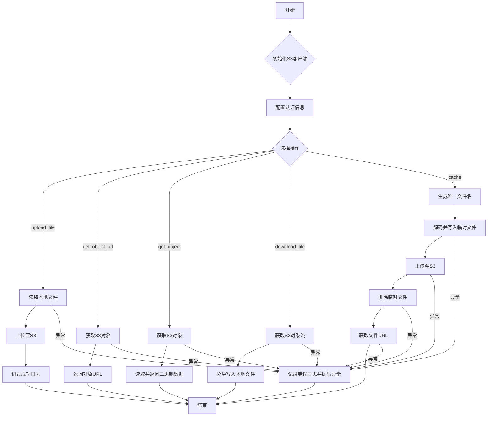
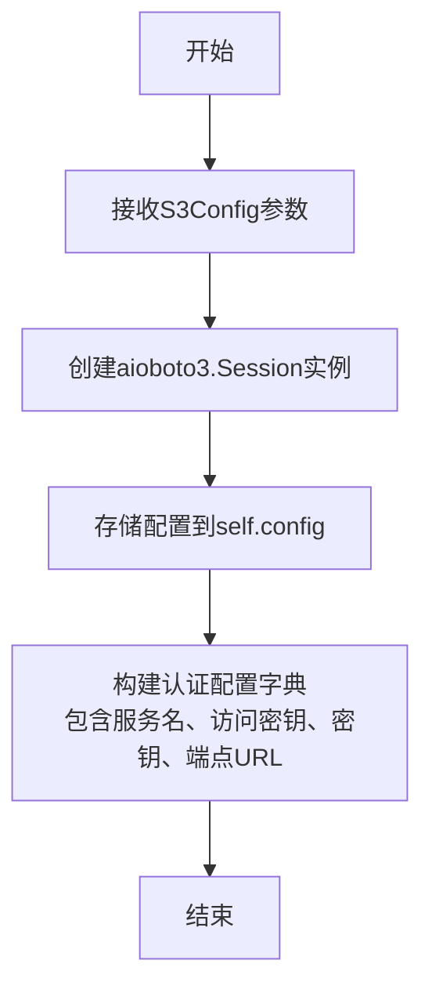
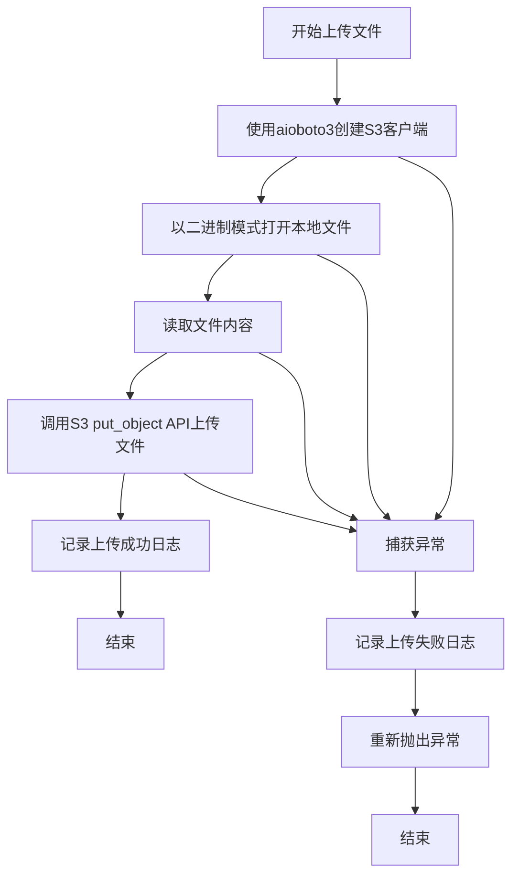
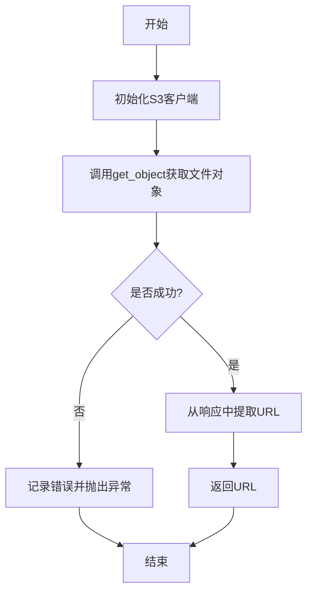
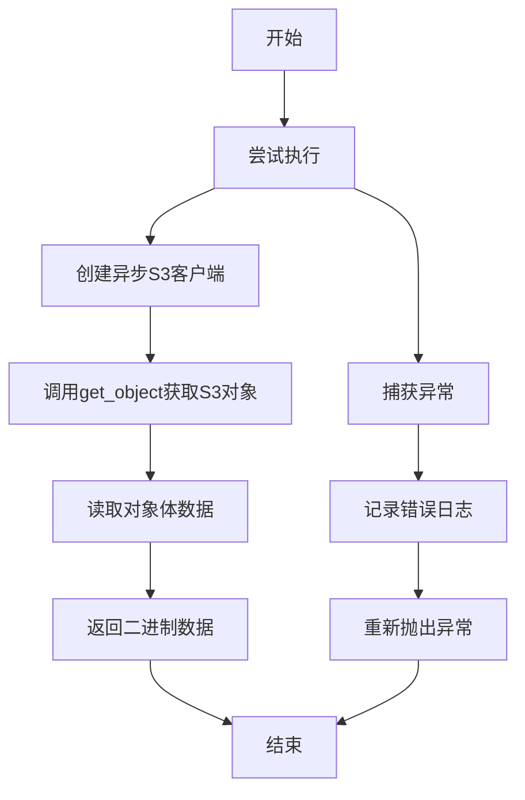
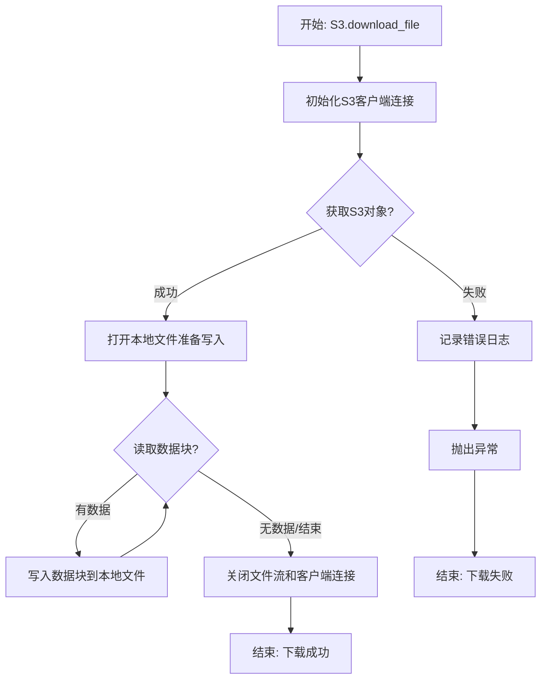

# `.\MetaGPT\metagpt\utils\s3.py` 详细设计文档

该代码实现了一个异步的 Amazon S3 存储交互客户端，封装了文件上传、下载、获取对象数据、获取对象URL以及缓存数据到S3并返回URL等核心操作，旨在为上层应用提供简洁、高效的云存储访问接口。

## 整体流程



## 类结构

```
S3 (S3客户端类)
├── __init__ (初始化方法)
├── upload_file (上传文件)
├── get_object_url (获取对象URL)
├── get_object (获取对象二进制数据)
├── download_file (下载文件到本地)
└── cache (缓存数据并返回URL)
```

## 全局变量及字段


### `S3.session`
    
异步Boto3会话对象，用于创建和管理与AWS S3服务的异步客户端连接。

类型：`aioboto3.Session`
    


### `S3.config`
    
S3配置对象，包含访问密钥、密钥、端点URL和存储桶名称等连接和操作S3所需的所有配置信息。

类型：`S3Config`
    


### `S3.auth_config`
    
身份验证配置字典，基于config对象构建，用于初始化aioboto3客户端，包含服务名、访问密钥和端点等参数。

类型：`dict`
    
    

## 全局函数及方法

### `S3.__init__`

初始化S3客户端，配置与Amazon S3存储服务交互所需的认证和会话信息。

参数：

- `config`：`S3Config`，包含访问S3服务所需的配置信息，如访问密钥、密钥、端点URL等。

返回值：`None`，此方法为构造函数，不返回任何值。

#### 流程图



#### 带注释源码

```python
def __init__(self, config: S3Config):
    # 创建一个异步的boto3会话，用于后续与AWS服务（此处为S3）的交互
    self.session = aioboto3.Session()
    # 存储传入的S3配置对象，其中包含访问S3所需的各种参数
    self.config = config
    # 构建一个认证配置字典，该字典将用于创建S3客户端
    # 字典包含服务名称、访问密钥ID、秘密访问密钥以及可选的端点URL
    # 端点URL允许连接到自定义的S3兼容服务（如MinIO），而不仅仅是AWS S3
    self.auth_config = {
        "service_name": "s3",
        "aws_access_key_id": config.access_key,
        "aws_secret_access_key": config.secret_key,
        "endpoint_url": config.endpoint,
    }
```

### `S3.upload_file`

将本地文件上传到指定的S3存储桶中。

参数：

- `bucket`：`str`，S3存储桶的名称。
- `local_path`：`str`，本地文件的路径，包括文件名。
- `object_name`：`str`，上传到S3后文件的完整存储路径，包括文件名。

返回值：`None`，无返回值。

#### 流程图



#### 带注释源码

```python
async def upload_file(
    self,
    bucket: str,
    local_path: str,
    object_name: str,
) -> None:
    """Upload a file from the local path to the specified path of the storage bucket specified in s3.

    Args:
        bucket: The name of the S3 storage bucket.
        local_path: The local file path, including the file name.
        object_name: The complete path of the uploaded file to be stored in S3, including the file name.

    Raises:
        Exception: If an error occurs during the upload process, an exception is raised.
    """
    try:
        # 1. 使用配置的认证信息创建异步S3客户端
        async with self.session.client(**self.auth_config) as client:
            # 2. 异步打开本地文件进行读取
            async with aiofiles.open(local_path, mode="rb") as reader:
                # 3. 读取文件的全部二进制内容
                body = await reader.read()
                # 4. 调用S3 API，将文件内容上传到指定的桶和对象键
                await client.put_object(Body=body, Bucket=bucket, Key=object_name)
                # 5. 上传成功，记录信息日志
                logger.info(f"Successfully uploaded the file to path {object_name} in bucket {bucket} of s3.")
    except Exception as e:
        # 6. 上传过程中发生任何异常，记录错误日志
        logger.error(f"Failed to upload the file to path {object_name} in bucket {bucket} of s3: {e}")
        # 7. 将异常重新抛出，由调用者处理
        raise e
```


### `S3.get_object_url`

该方法用于获取存储在指定S3存储桶中的文件的可下载或预览URL。它通过异步调用AWS S3服务的`get_object` API来获取对象，并从响应中提取预签名的URL。

参数：

- `bucket`：`str`，S3存储桶的名称。
- `object_name`：`str`，存储在S3中的文件的完整路径，包括文件名。

返回值：`str`，文件的可下载或预览URL。

#### 流程图



#### 带注释源码

```python
async def get_object_url(
    self,
    bucket: str,
    object_name: str,
) -> str:
    """Get the URL for a downloadable or preview file stored in the specified S3 bucket.

    Args:
        bucket: The name of the S3 storage bucket.
        object_name: The complete path of the file stored in S3, including the file name.

    Returns:
        The URL for the downloadable or preview file.

    Raises:
        Exception: If an error occurs while retrieving the URL, an exception is raised.
    """
    try:
        # 使用配置的认证信息创建异步S3客户端会话
        async with self.session.client(**self.auth_config) as client:
            # 异步调用S3的get_object API，获取指定桶和键的对象
            file = await client.get_object(Bucket=bucket, Key=object_name)
            # 从响应对象中提取'Body'部分的URL属性，并转换为字符串返回
            # 这个URL通常是预签名的，用于临时访问对象
            return str(file["Body"].url)
    except Exception as e:
        # 如果发生任何异常，记录错误日志并重新抛出异常
        logger.error(f"Failed to get the url for a downloadable or preview file: {e}")
        raise e
```


### `S3.get_object`

该方法用于从指定的 Amazon S3 存储桶中获取文件的二进制数据。

参数：
- `bucket`：`str`，S3存储桶的名称。
- `object_name`：`str`，存储在S3中的文件的完整路径，包括文件名。

返回值：`bytes`，请求文件的二进制数据。

#### 流程图



#### 带注释源码

```python
async def get_object(
    self,
    bucket: str,
    object_name: str,
) -> bytes:
    """Get the binary data of a file stored in the specified S3 bucket.

    Args:
        bucket: The name of the S3 storage bucket.
        object_name: The complete path of the file stored in S3, including the file name.

    Returns:
        The binary data of the requested file.

    Raises:
        Exception: If an error occurs while retrieving the file data, an exception is raised.
    """
    try:
        # 使用配置的认证信息创建异步S3客户端
        async with self.session.client(**self.auth_config) as client:
            # 从指定的S3桶和对象路径获取对象
            s3_object = await client.get_object(Bucket=bucket, Key=object_name)
            # 读取对象的Body部分，返回二进制数据
            return await s3_object["Body"].read()
    except Exception as e:
        # 记录获取文件二进制数据失败的日志
        logger.error(f"Failed to get the binary data of the file: {e}")
        # 重新抛出异常，由调用者处理
        raise e
```


### `S3.download_file`

该方法用于从指定的 Amazon S3 存储桶中下载一个对象到本地文件系统。它通过异步流式读取的方式，将 S3 对象的数据分块写入本地文件，支持自定义数据块大小以提高大文件下载的效率。

参数：

-  `bucket`：`str`，S3 存储桶的名称。
-  `object_name`：`str`，存储在 S3 中的文件的完整路径，包括文件名。
-  `local_path`：`str`，S3 对象将被下载到的本地文件路径。
-  `chunk_size`：`Optional[int]`，每次读取和写入的数据块大小，默认为 128 KB。

返回值：`None`，该方法不返回任何值，成功执行后文件将被下载到指定的本地路径。

#### 流程图



#### 带注释源码

```python
async def download_file(
    self, bucket: str, object_name: str, local_path: str, chunk_size: Optional[int] = 128 * 1024
) -> None:
    """Download an S3 object to a local file.

    Args:
        bucket: The name of the S3 storage bucket.
        object_name: The complete path of the file stored in S3, including the file name.
        local_path: The local file path where the S3 object will be downloaded.
        chunk_size: The size of data chunks to read and write at a time. Default is 128 KB.

    Raises:
        Exception: If an error occurs during the download process, an exception is raised.
    """
    try:
        # 1. 使用配置的认证信息创建异步S3客户端
        async with self.session.client(**self.auth_config) as client:
            # 2. 从指定的S3桶和路径获取对象
            s3_object = await client.get_object(Bucket=bucket, Key=object_name)
            # 3. 获取对象的数据流
            stream = s3_object["Body"]
            # 4. 以二进制写入模式打开本地文件
            async with aiofiles.open(local_path, mode="wb") as writer:
                # 5. 循环读取数据流，直到没有更多数据
                while True:
                    # 5.1 从S3流中读取指定大小的数据块
                    file_data = await stream.read(chunk_size)
                    # 5.2 如果读取到的数据为空，表示流已结束，退出循环
                    if not file_data:
                        break
                    # 5.3 将读取到的数据块写入本地文件
                    await writer.write(file_data)
            # 6. 成功下载，隐式关闭文件和客户端连接（由async with管理）
    except Exception as e:
        # 7. 如果在上述任何步骤中发生异常
        # 7.1 记录错误日志，包含异常信息
        logger.error(f"Failed to download the file from S3: {e}")
        # 7.2 重新抛出异常，通知调用者操作失败
        raise e
```


### `S3.cache`

该方法用于将数据（支持纯文本或Base64编码字符串）缓存到Amazon S3对象存储服务中，并返回该文件在S3上的可访问URL。其核心流程是：首先在本地临时创建一个文件，将传入的数据写入其中；然后将该文件上传到预先配置的S3存储桶；最后获取该文件在S3上的URL并返回。无论成功与否，方法都会清理本地临时文件。

参数：
- `data`：`str`，需要缓存的数据内容，可以是普通文本或Base64格式的字符串。
- `file_ext`：`str`，希望存储在S3上的文件扩展名（例如 `.txt`, `.png`），用于生成最终的文件名。
- `format`：`str`，可选参数，指定`data`参数的编码格式。如果其值等于常量`BASE64_FORMAT`，则`data`会被视为Base64编码并进行解码；否则，`data`会按UTF-8编码转换为字节。默认为空字符串。

返回值：`Optional[str]`，成功时返回存储在S3上的文件的可访问URL；如果过程中发生任何异常，则返回`None`。

#### 流程图

```mermaid
flowchart TD
    A[开始: S3.cache(data, file_ext, format)] --> B[生成唯一文件名 object_name]
    B --> C[构建本地临时文件路径 pathname]
    C --> D{尝试写入本地文件}
    D --> E[根据format参数<br>解码或编码data为字节]
    E --> F[将字节数据写入 pathname]
    F --> G[构建S3对象路径 object_pathname]
    G --> H[调用 self.upload_file<br>上传至S3]
    H --> I[删除本地临时文件 pathname]
    I --> J[调用 self.get_object_url<br>获取S3文件URL]
    J --> K[返回URL]
    D -- 发生异常 --> L[记录异常日志]
    L --> M[删除本地临时文件 pathname]
    M --> N[返回 None]
```

#### 带注释源码

```python
async def cache(self, data: str, file_ext: str, format: str = "") -> str:
    """Save data to remote S3 and return url"""
    # 1. 生成一个基于UUID的唯一文件名，并拼接上提供的文件扩展名
    object_name = uuid.uuid4().hex + file_ext
    # 2. 获取当前文件所在目录，并构建本地临时文件的完整路径
    path = Path(__file__).parent
    pathname = path / object_name
    try:
        # 3. 以二进制写入模式打开本地临时文件
        async with aiofiles.open(str(pathname), mode="wb") as file:
            # 4. 根据`format`参数判断数据格式并进行相应处理：
            #    - 如果format等于预定义的BASE64_FORMAT，则对data进行Base64解码。
            #    - 否则，将data字符串按UTF-8编码转换为字节。
            data = base64.b64decode(data) if format == BASE64_FORMAT else data.encode(encoding="utf-8")
            # 5. 将处理后的字节数据写入本地临时文件
            await file.write(data)

        # 6. 从配置中获取S3存储桶名称
        bucket = self.config.bucket
        # 7. 构建S3上的对象存储路径。
        #    首先使用桶名或默认的"system"作为根目录，然后拼接上生成的文件名。
        object_pathname = self.config.bucket or "system"
        object_pathname += f"/{object_name}"
        # 8. 规范化路径（处理可能的`./`或`../`等）
        object_pathname = os.path.normpath(object_pathname)
        # 9. 调用`upload_file`方法，将本地临时文件上传到S3的指定路径
        await self.upload_file(bucket=bucket, local_path=str(pathname), object_name=object_pathname)
        # 10. 上传成功后，删除本地临时文件。`missing_ok=True`确保文件不存在时也不报错。
        pathname.unlink(missing_ok=True)

        # 11. 调用`get_object_url`方法，获取刚上传文件在S3上的可访问URL
        return await self.get_object_url(bucket=bucket, object_name=object_pathname)
    except Exception as e:
        # 12. 如果上述任何步骤发生异常，记录详细的异常信息和堆栈跟踪
        logger.exception(f"{e}, stack:{traceback.format_exc()}")
        # 13. 异常情况下也尝试清理本地临时文件
        pathname.unlink(missing_ok=True)
        # 14. 返回None表示操作失败
        return None
```

## 关键组件

### S3客户端封装

一个基于aioboto3的异步Amazon S3客户端封装类，提供了文件上传、下载、获取对象URL和二进制数据等核心操作。

### 异步会话管理

通过aioboto3.Session管理异步的AWS会话，并根据S3Config配置动态创建客户端连接，支持自定义访问密钥和端点。

### 文件上传组件

将本地文件异步上传到指定的S3存储桶，支持完整的错误处理和日志记录，确保上传过程的可靠性。

### 对象URL获取组件

异步获取S3中存储文件的临时访问URL，适用于需要生成文件预览或下载链接的场景。

### 二进制数据获取组件

直接从S3存储桶异步读取文件的二进制数据，适用于需要直接处理文件内容而不保存到本地的场景。

### 文件下载组件

将S3对象异步下载到本地文件系统，支持分块读取以处理大文件，并包含完整的错误处理机制。

### 数据缓存与URL生成组件

将字符串或Base64编码的数据临时保存到本地，然后上传到S3，并返回该文件的访问URL，适用于需要将数据快速持久化并共享的场景。

## 问题及建议


### 已知问题

-   **`cache` 方法逻辑错误**：`object_pathname` 的构建逻辑存在错误。代码中 `object_pathname = self.config.bucket or "system"` 会导致 `object_pathname` 被赋值为 `self.config.bucket` 的值（如果非空）或字符串 `"system"`，而不是预期的 `bucket` 名称加上路径前缀。这会导致上传路径错误，且后续 `get_object_url` 可能无法正确生成 URL。
-   **异常处理过于宽泛**：所有方法都使用 `except Exception as e` 来捕获异常，这会隐藏具体的错误类型（如 `ClientError`, `FileNotFoundError`, `IOError` 等），不利于调用者进行针对性的错误处理和恢复。
-   **`cache` 方法存在资源泄漏风险**：在 `cache` 方法中，如果 `upload_file` 或 `get_object_url` 调用失败，代码会执行 `pathname.unlink(missing_ok=True)`。然而，如果在打开文件 (`aiofiles.open`) 后、写入数据前发生异常，文件可能未被正确关闭，且 `pathname` 变量可能尚未定义，导致 `unlink` 调用失败或无法执行。
-   **硬编码路径分隔符**：`cache` 方法中使用了 `os.path.normpath` 来规范化路径，但 S3 对象键应使用正斜杠 (`/`) 作为分隔符，而 `os.path.normpath` 在 Windows 系统上会使用反斜杠 (`\`)，这可能导致对象键不符合 S3 规范。
-   **`get_object_url` 方法返回值可能不符合预期**：`client.get_object` 返回的 `file["Body"].url` 可能并不是一个可公开访问的 URL（尤其是当对象权限为私有时），而是一个用于从 `Body` 流中读取数据的临时 URL。此方法名容易引起误解，调用者可能期望得到一个预签名 URL 或公开的 HTTP URL。

### 优化建议

-   **修正 `cache` 方法路径逻辑**：明确 `object_pathname` 的构建规则。建议使用 `f"{bucket}/{object_name}"` 或根据配置添加明确的前缀（如 `self.config.path_prefix`）。
-   **细化异常处理**：捕获更具体的异常类型，例如 `botocore.exceptions.ClientError` 用于 S3 操作错误，`OSError`/`IOError` 用于文件操作错误。并在日志中记录更详细的错误信息（如错误代码）。
-   **确保资源安全释放**：在 `cache` 方法中，使用 `try...finally` 块或异步上下文管理器来确保临时文件在任何情况下都能被正确清理。确保文件写入操作在 `try` 块内完成后再进行上传。
-   **使用明确的路径拼接**：对于 S3 对象键的构建，避免使用 `os.path`，直接使用字符串拼接或 `urllib.parse.urljoin` 来确保使用正斜杠 (`/`)。
-   **重命名或重构 `get_object_url` 方法**：根据实际需求，将此方法重命名为 `get_object`（与现有方法冲突）或 `generate_presigned_url`，并实现生成预签名 URL 的逻辑（使用 `client.generate_presigned_url`），或者在文档中明确说明其返回值的性质和限制。
-   **增加配置验证**：在 `__init__` 方法中，可以增加对 `S3Config` 中必要字段（如 `access_key`, `secret_key`, `bucket`）的基础验证，避免在后续操作中因配置不全而失败。
-   **考虑增加连接池或会话复用**：虽然 `aioboto3.Session` 会管理连接，但对于高频调用，可以考虑在类级别复用 `client` 或优化会话管理策略。
-   **为 `download_file` 方法添加目录创建**：在下载文件前，检查 `local_path` 的目录是否存在，若不存在则创建，提高鲁棒性。


## 其它


### 设计目标与约束

本模块旨在提供一个异步、轻量级的Amazon S3对象存储操作封装。其核心设计目标包括：
1.  **异步操作**：所有I/O密集型操作（网络请求、文件读写）均采用异步模式，以提高在高并发场景下的性能和资源利用率。
2.  **配置驱动**：通过`S3Config`对象集中管理认证信息（Access Key, Secret Key, Endpoint）和默认存储桶，实现与业务逻辑的解耦。
3.  **核心功能封装**：提供文件上传、下载、获取对象数据、获取对象URL以及一个便捷的缓存方法，覆盖常见的S3操作场景。
4.  **错误处理与日志**：对S3 API调用和本地文件操作进行统一的异常捕获和日志记录，便于问题追踪。

主要约束包括：
*   **依赖特定库**：强依赖于`aioboto3`和`aiofiles`库来实现异步S3客户端和文件操作。
*   **S3兼容性**：虽然主要面向Amazon S3，但通过可配置的`endpoint_url`，理论上可以兼容任何提供S3协议兼容接口的对象存储服务（如MinIO, Ceph RGW）。
*   **无连接池管理**：`aioboto3.Session`和`client`的生命周期由方法调用控制，未实现显式的连接池或客户端复用策略。

### 错误处理与异常设计

模块采用统一的“捕获-记录-重新抛出”错误处理模式：
1.  **异常捕获**：在每个公开的异步方法中，使用`try...except`块捕获所有`Exception`。
2.  **日志记录**：当异常发生时，使用`logger.error`或`logger.exception`记录详细的错误信息，包括操作描述、相关参数（如桶名、对象名）和异常堆栈（`cache`方法）。
3.  **异常传播**：记录日志后，将原异常重新抛出（`raise e`），由调用者决定如何处理。这保持了异常的原始类型和上下文。
4.  **资源清理**：在`cache`方法中，无论成功与否，都会尝试删除本地创建的临时文件（`pathname.unlink(missing_ok=True)`），避免资源泄漏。

潜在改进：可以定义模块特定的异常类（如`S3UploadError`, `S3DownloadError`），对底层`aioboto3`或`botocore`的异常进行包装，提供更清晰的错误语义给上层调用者。

### 数据流与状态机

模块本身不维护复杂的内部状态。其数据流主要体现在方法的输入、输出以及与外部系统的交互上：
*   **`upload_file`**: `本地文件` --(读取)--> `字节数据` --(HTTP PUT)--> `S3存储桶`。
*   **`download_file`**: `S3存储桶` --(HTTP GET流式读取)--> `字节数据块` --(写入)--> `本地文件`。
*   **`get_object`**: `S3存储桶` --(HTTP GET)--> `字节数据` --> 返回给调用者。
*   **`get_object_url`**: `S3存储桶` + `对象键` --> 生成或获取预签名URL --> 返回给调用者。
*   **`cache`**: `字符串/Base64数据` --(解码/编码)--> `字节数据` --(写入)--> `临时本地文件` --(上传)--> `S3存储桶` --(获取URL)--> `对象URL`。这是一个多步骤的复合操作，包含本地临时文件的创建与清理。

模块无内部状态机，每个方法调用都是独立的。

### 外部依赖与接口契约

1.  **直接依赖库**:
    *   `aioboto3`: 提供异步的AWS SDK (boto3) 接口，用于与S3服务通信。是本模块的核心依赖。
    *   `aiofiles`: 提供异步文件I/O操作，用于本地文件的读写。
    *   `boto3` / `botocore`: `aioboto3`的底层依赖，处理AWS请求签名和协议。
2.  **项目内部依赖**:
    *   `metagpt.config2.S3Config`: 配置类，提供访问密钥、密钥、端点、默认桶等配置信息。这是模块的初始化输入契约。
    *   `metagpt.const.BASE64_FORMAT`: 常量，用于`cache`方法中标识输入数据的格式。
    *   `metagpt.logs.logger`: 日志记录器实例，用于输出操作日志和错误信息。
3.  **环境依赖**:
    *   有效的S3服务访问端点、认证凭据（Access Key, Secret Key）以及相应的网络连通性。
    *   对于`cache`方法，需要当前工作目录或其父目录具有写入权限以创建临时文件。
4.  **接口契约**:
    *   **初始化**: 必须提供一个有效的`S3Config`实例。
    *   **方法参数**: 各方法对参数有基本要求（如`bucket`和`object_name`不能为空），但当前文档未明确前置条件。调用者需确保`local_path`存在且可读（上传），或目标目录可写（下载）。
    *   **异步上下文**: 所有公开方法均为`async`，必须在异步环境中调用（如`asyncio.run`或事件循环内）。

### 安全考虑

1.  **凭证管理**：认证凭据（`aws_access_key_id`, `aws_secret_access_key`）通过`S3Config`传入，并存储在`self.auth_config`字典中。建议`S3Config`从安全的环境变量或加密的配置服务中加载，避免硬编码。
2.  **临时文件**：`cache`方法会在本地文件系统创建临时文件。虽然最后会删除，但在极短的时间窗口内，敏感数据可能以明文形式存在于磁盘。对于高度敏感数据，可考虑使用内存缓冲区（如`BytesIO`）替代临时文件，或确保临时文件创建在安全目录。
3.  **URL安全性**：`get_object_url`返回的URL取决于S3服务的配置。如果是公开可读的桶或对象，则URL可能被任何人访问。如果是私有对象且返回的是预签名URL，则该URL有过期时间。模块未控制这些行为，需要调用者根据S3桶策略和对象ACL来确保安全。
4.  **输入验证**：当前代码未对输入参数（如`bucket`, `object_name`, `local_path`）进行严格的验证或清理，可能存在路径遍历风险（尽管S3服务端通常有自己的防护）。在生产环境中，建议增加输入验证。

### 性能考量

1.  **异步优势**：利用`async/await`，在等待网络I/O（S3请求）或磁盘I/O（文件读写）时不会阻塞事件循环，适合高并发场景。
2.  **流式下载**：`download_file`方法支持分块（`chunk_size`）读取和写入，避免一次性将大文件加载到内存，适合处理大型对象。
3.  **内存使用**：`upload_file`和`get_object`方法会将整个文件内容读入内存（`await reader.read()`和`await s3_object["Body"].read()`）。对于超大文件，这可能成为内存瓶颈。`upload_file`可考虑改为流式上传。
4.  **连接复用**：`aioboto3.Session`和`client`在每次方法调用时创建和销毁。对于频繁调用，可以考虑在类初始化时创建并复用`client`，或在更高层级管理会话生命周期。
5.  **`cache`方法效率**：`cache`方法涉及本地文件系统的写入、读取和删除，对于频繁的小数据缓存操作，可能引入不必要的磁盘I/O开销。可以考虑直接使用`BytesIO`在内存中处理数据，或者评估是否真的需要本地文件作为中转。

    