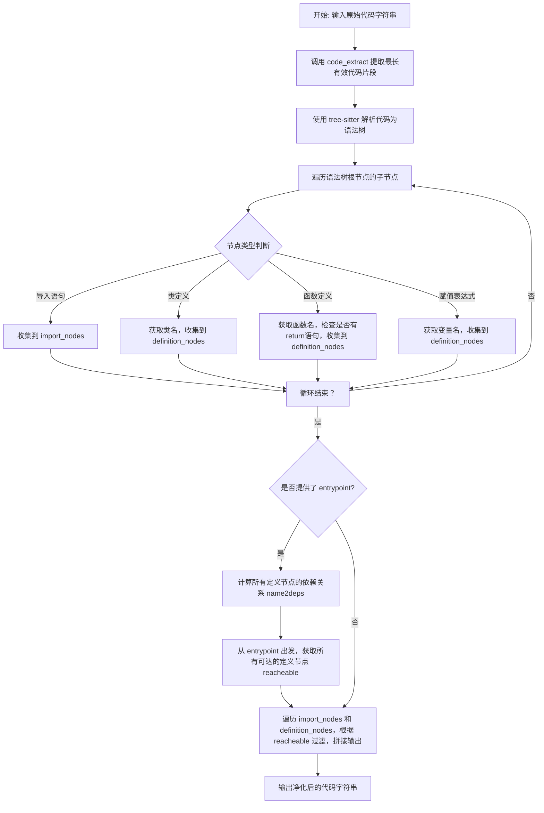
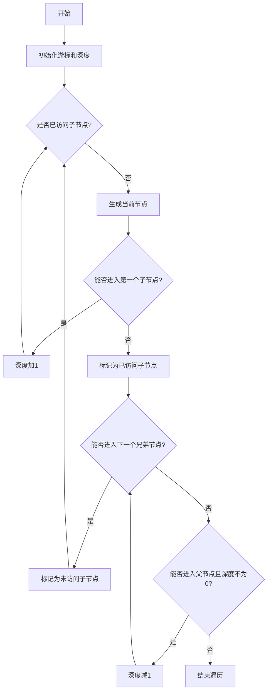
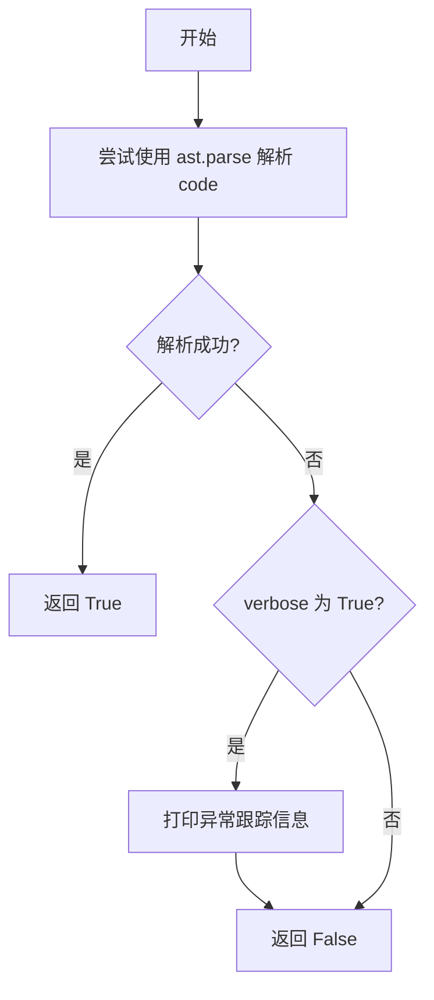
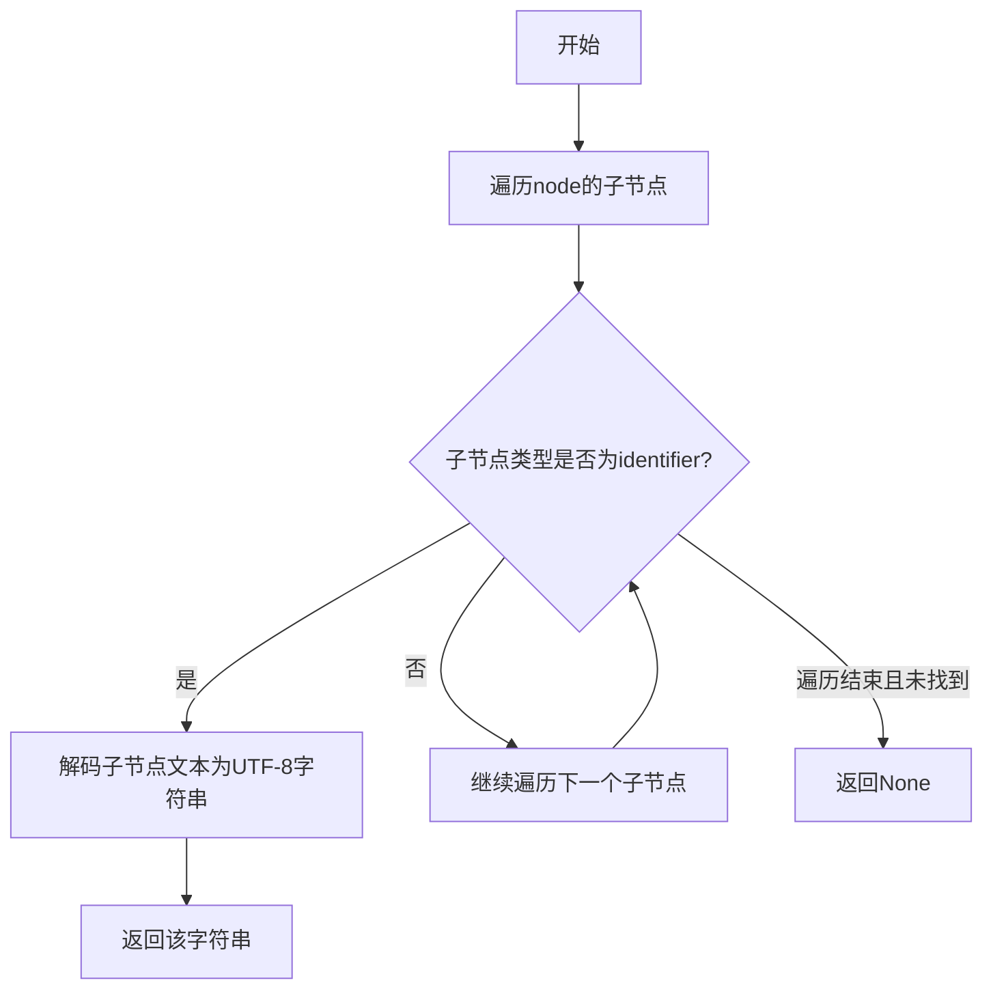
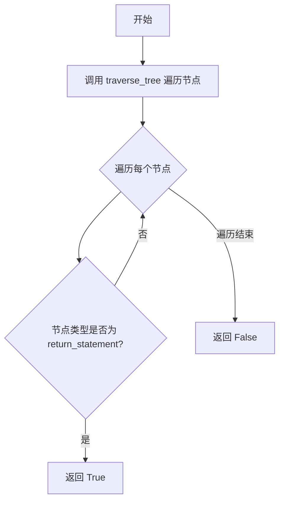

# `.\MetaGPT\metagpt\utils\sanitize.py` 详细设计文档

该代码是一个Python代码清理和提取工具，其核心功能是解析输入的Python代码字符串，通过语法树分析提取出有效的代码片段（去除可能的无效或损坏部分），并可根据指定的入口函数进行依赖分析，最终输出一个仅包含相关导入语句、类定义、函数定义和变量赋值语句的“净化”版本。

## 整体流程



## 类结构

```
NodeType (枚举类)
├── CLASS
├── FUNCTION
├── IMPORT
├── IDENTIFIER
├── ATTRIBUTE
├── RETURN
├── EXPRESSION
└── ASSIGNMENT
全局函数
├── traverse_tree
├── syntax_check
├── code_extract
├── get_definition_name
├── has_return_statement
├── get_deps
├── get_function_dependency
└── sanitize (主函数)
```

## 全局变量及字段


### `NodeType.CLASS`
    
表示Python AST中类定义节点的类型标识符。

类型：`str`
    


### `NodeType.FUNCTION`
    
表示Python AST中函数定义节点的类型标识符。

类型：`str`
    


### `NodeType.IMPORT`
    
表示Python AST中导入语句（import和import from）节点的类型标识符列表。

类型：`List[str]`
    


### `NodeType.IDENTIFIER`
    
表示Python AST中标识符（如变量名、函数名）节点的类型标识符。

类型：`str`
    


### `NodeType.ATTRIBUTE`
    
表示Python AST中属性访问（如obj.attr）节点的类型标识符。

类型：`str`
    


### `NodeType.RETURN`
    
表示Python AST中返回语句节点的类型标识符。

类型：`str`
    


### `NodeType.EXPRESSION`
    
表示Python AST中表达式语句节点的类型标识符。

类型：`str`
    


### `NodeType.ASSIGNMENT`
    
表示Python AST中赋值语句节点的类型标识符。

类型：`str`
    
    

## 全局函数及方法

### `traverse_tree`

该函数是一个生成器，用于以深度优先、先序遍历的方式遍历给定的树结构节点。它使用一个游标（cursor）来遍历节点，并依次生成每个节点。

参数：

- `node`：`Node`，树结构的根节点，从此节点开始遍历。

返回值：`Generator[Node, None, None]`，一个生成器对象，依次生成树中的每个节点。

#### 流程图



#### 带注释源码

```python
def traverse_tree(node: Node) -> Generator[Node, None, None]:
    """
    Traverse the tree structure starting from the given node.

    :param node: The root node to start the traversal from.
    :return: A generator object that yields nodes in the tree.
    """
    # 初始化游标，从给定的根节点开始
    cursor = node.walk()
    # 初始化深度，用于控制何时结束遍历
    depth = 0

    # 标记当前节点是否已经访问过其子节点
    visited_children = False
    while True:
        # 如果尚未访问当前节点的子节点
        if not visited_children:
            # 生成当前节点
            yield cursor.node
            # 尝试进入第一个子节点
            if not cursor.goto_first_child():
                # 如果没有子节点，则标记为已访问子节点，并增加深度
                depth += 1
                visited_children = True
        # 如果已访问子节点，则尝试进入下一个兄弟节点
        elif cursor.goto_next_sibling():
            # 如果成功进入兄弟节点，则重置标记，准备访问其子节点
            visited_children = False
        # 如果既没有子节点也没有兄弟节点，则尝试返回父节点
        elif not cursor.goto_parent() or depth == 0:
            # 如果无法返回父节点或已回到根节点，则结束遍历
            break
        else:
            # 成功返回父节点，深度减1
            depth -= 1
```

### `syntax_check`

`syntax_check` 函数用于检查给定的 Python 代码字符串是否具有有效的语法。它尝试使用 Python 的内置 `ast.parse` 方法解析代码。如果解析成功，则返回 `True`，表示代码语法正确。如果解析过程中遇到 `SyntaxError` 或 `MemoryError`，则返回 `False`，表示语法错误或内存不足。该函数还支持一个可选的 `verbose` 参数，用于在发生错误时打印详细的异常跟踪信息。

参数：

- `code`：`str`，需要检查语法的 Python 代码字符串。
- `verbose`：`bool`，可选参数，默认为 `False`。如果设置为 `True`，则在发生语法错误时打印异常跟踪信息。

返回值：`bool`，如果代码语法正确则返回 `True`，否则返回 `False`。

#### 流程图



#### 带注释源码

```python
def syntax_check(code, verbose=False):
    try:
        # 尝试使用 Python 的抽象语法树模块解析代码
        ast.parse(code)
        # 如果解析成功，返回 True
        return True
    except (SyntaxError, MemoryError):
        # 如果捕获到语法错误或内存错误
        if verbose:
            # 如果 verbose 为 True，打印详细的异常信息
            traceback.print_exc()
        # 返回 False 表示语法检查失败
        return False
```

### `code_extract`

该函数用于从一段可能包含非代码文本（如解释、注释、错误代码片段）的字符串中，提取出最长的、语法有效的Python代码块。它通过遍历所有可能的行区间，检查其语法正确性，并选择非空行数最多的有效区间作为输出。

参数：
- `text`：`str`，输入的原始文本字符串，可能包含代码和非代码内容。

返回值：`str`，从输入文本中提取出的最长有效Python代码块。

#### 流程图

```mermaid
flowchart TD
    A[开始: 输入文本 text] --> B[按换行符分割为 lines 列表]
    B --> C[初始化 longest_line_pair = (0, 0), longest_so_far = 0]
    C --> D{遍历所有行区间 i, j?}
    D -- 是 --> E[提取当前区间代码 current_lines]
    E --> F{语法检查 syntax_check 通过?}
    F -- 是 --> G[计算当前区间非空行数 current_length]
    G --> H{current_length > longest_so_far?}
    H -- 是 --> I[更新 longest_so_far 和 longest_line_pair]
    I --> D
    H -- 否 --> D
    F -- 否 --> D
    D -- 遍历结束 --> J[根据 longest_line_pair 提取最终代码]
    J --> K[返回提取的代码字符串]
```

#### 带注释源码

```python
def code_extract(text: str) -> str:
    # 1. 将输入文本按换行符分割成行列表
    lines = text.split("\n")
    # 2. 初始化记录最长有效区间的变量
    #    longest_line_pair: 存储最长有效区间的起始和结束行索引（包含）
    #    longest_so_far: 存储当前找到的最长有效区间的非空行数
    longest_line_pair = (0, 0)
    longest_so_far = 0

    # 3. 双重循环遍历所有可能的行区间 [i, j]
    for i in range(len(lines)):
        for j in range(i + 1, len(lines)):
            # 3.1 提取当前区间的代码，并重新连接为字符串
            current_lines = "\n".join(lines[i : j + 1])
            # 3.2 使用 syntax_check 函数检查当前区间代码的语法正确性
            if syntax_check(current_lines):
                # 3.3 如果语法正确，计算当前区间的非空行数
                current_length = sum(1 for line in lines[i : j + 1] if line.strip())
                # 3.4 如果当前区间的非空行数大于已知的最大值，则更新记录
                if current_length > longest_so_far:
                    longest_so_far = current_length
                    longest_line_pair = (i, j)

    # 4. 根据找到的最长有效区间索引，从原始行列表中提取代码并返回
    return "\n".join(lines[longest_line_pair[0] : longest_line_pair[1] + 1])
```

### `get_definition_name`

该函数用于从给定的树状语法节点（Node）中提取标识符名称。它遍历节点的子节点，找到第一个类型为“identifier”的子节点，并将其文本内容解码为UTF-8字符串后返回。这通常用于从类定义、函数定义或赋值语句等节点中获取其名称。

参数：

- `node`：`tree_sitter.Node`，表示一个树状语法节点，期望其子节点中包含一个标识符节点。

返回值：`str`，返回从节点中提取出的标识符名称字符串。如果未找到标识符子节点，则返回`None`。

#### 流程图



#### 带注释源码

```python
def get_definition_name(node: Node) -> str:
    # 遍历传入节点的所有直接子节点
    for child in node.children:
        # 检查当前子节点的类型是否为“identifier”（标识符）
        if child.type == NodeType.IDENTIFIER.value:
            # 如果是标识符节点，将其字节文本解码为UTF-8字符串并返回
            return child.text.decode("utf8")
    # 如果遍历完所有子节点都没有找到标识符，则隐式返回None
```

### `has_return_statement`

该函数用于遍历给定的抽象语法树（AST）节点，检查其子树中是否包含任何 `return` 语句。它通过深度优先遍历节点及其所有子节点，一旦发现节点类型为 `return_statement`，即返回 `True`；如果遍历完所有节点均未发现 `return` 语句，则返回 `False`。

参数：
- `node`：`tree_sitter.Node`，表示要检查的 AST 根节点。

返回值：`bool`，如果节点或其子树中包含至少一个 `return` 语句则返回 `True`，否则返回 `False`。

#### 流程图



#### 带注释源码

```python
def has_return_statement(node: Node) -> bool:
    # 使用 traverse_tree 函数生成器遍历以 node 为根的 AST 子树
    traverse_nodes = traverse_tree(node)
    # 遍历每个节点
    for node in traverse_nodes:
        # 检查当前节点的类型是否为 return_statement
        if node.type == NodeType.RETURN.value:
            # 如果找到 return 语句，立即返回 True
            return True
    # 遍历结束仍未找到 return 语句，返回 False
    return False
```

### `get_deps`

该函数接收一个由（名称，AST节点）对组成的列表，通过深度优先搜索（DFS）遍历每个节点的子树，收集其中所有的标识符（identifier），构建一个从名称到其依赖的标识符集合的映射字典。

参数：
- `nodes`：`List[Tuple[str, Node]]`，一个列表，其中每个元素是一个元组，包含一个名称（字符串）和一个对应的树状语法树节点（`Node`对象）。该列表通常包含代码中定义的函数、类或变量的名称及其AST节点。

返回值：`Dict[str, Set[str]]`，一个字典，其键是输入`nodes`中的名称，值是一个字符串集合，表示该名称对应的AST节点子树中出现的所有标识符（即其依赖）。

#### 流程图

```mermaid
flowchart TD
    A[开始: get_deps(nodes)] --> B[初始化空字典 name2deps]
    B --> C{遍历 nodes 列表?}
    C -->|是| D[取出当前 (name, node)]
    D --> E[初始化空集合 deps]
    E --> F[调用 dfs_get_deps(node, deps)]
    F --> G[将 (name, deps) 存入 name2deps]
    G --> C
    C -->|遍历完成| H[返回 name2deps]
```

#### 带注释源码

```python
def get_deps(nodes: List[Tuple[str, Node]]) -> Dict[str, Set[str]]:
    # 内部定义的深度优先搜索（DFS）辅助函数，用于递归遍历节点并收集标识符。
    def dfs_get_deps(node: Node, deps: Set[str]) -> None:
        # 遍历当前节点的所有直接子节点。
        for child in node.children:
            # 如果子节点的类型是标识符（identifier），则将其文本内容（解码为字符串）添加到依赖集合中。
            if child.type == NodeType.IDENTIFIER.value:
                deps.add(child.text.decode("utf8"))
            else:
                # 如果子节点不是标识符，则递归地对该子节点进行相同的DFS操作，继续深入查找标识符。
                dfs_get_deps(child, deps)

    # 初始化一个空字典，用于存储最终的结果：名称 -> 依赖标识符集合。
    name2deps = {}
    # 遍历输入的节点列表，每个元素是一个 (名称, 节点) 对。
    for name, node in nodes:
        # 为当前节点初始化一个空的依赖集合。
        deps = set()
        # 调用DFS函数，从当前节点开始遍历其子树，收集到的所有标识符将存入 deps 集合。
        dfs_get_deps(node, deps)
        # 将当前名称及其对应的依赖集合存入结果字典。
        name2deps[name] = deps
    # 返回构建完成的依赖关系字典。
    return name2deps
```

### `get_function_dependency`

该函数执行一个从给定入口点开始的广度优先搜索（BFS），遍历一个函数调用图，以找出所有从入口点可达的函数。它用于在代码清理过程中，根据函数间的依赖关系，筛选出与特定入口点相关的函数定义。

参数：
- `entrypoint`：`str`，作为搜索起点的函数名称。
- `call_graph`：`Dict[str, str]`，一个字典，表示函数间的调用关系图。键是函数名，值是该函数直接调用的其他函数名的集合。

返回值：`Set[str]`，一个包含从`entrypoint`出发所有可达函数名的集合。

#### 流程图

```mermaid
graph TD
    A[开始: get_function_dependency(entrypoint, call_graph)] --> B[初始化队列 queue = [entrypoint]]
    B --> C[初始化已访问集合 visited = {entrypoint}]
    C --> D{队列 queue 是否为空?}
    D -- 是 --> E[返回 visited 集合]
    D -- 否 --> F[从队列头部取出 current]
    F --> G{current 是否在 call_graph 中?}
    G -- 否 --> D
    G -- 是 --> H[遍历 call_graph[current] 中的每个 neighbour]
    H --> I{neighbour 是否在 visited 中?}
    I -- 是 --> H
    I -- 否 --> J[将 neighbour 加入 visited]
    J --> K[将 neighbour 加入 queue 尾部]
    K --> H
```

#### 带注释源码

```python
def get_function_dependency(entrypoint: str, call_graph: Dict[str, str]) -> Set[str]:
    # 初始化一个队列，用于广度优先搜索（BFS），起始点为给定的入口函数
    queue = [entrypoint]
    # 初始化一个集合，用于记录已经访问过的函数，避免重复访问和循环依赖
    visited = {entrypoint}
    # 当队列不为空时，持续进行搜索
    while queue:
        # 从队列的头部取出一个函数名（FIFO，广度优先）
        current = queue.pop(0)
        # 检查当前函数是否存在于调用图中
        # 如果不存在，说明它没有调用其他函数，或者调用图信息不完整，跳过
        if current not in call_graph:
            continue
        # 遍历当前函数直接调用的所有邻居函数
        for neighbour in call_graph[current]:
            # 如果邻居函数尚未被访问过
            if neighbour not in visited:
                # 将其标记为已访问
                visited.add(neighbour)
                # 并将其加入队列尾部，以便后续探索它的调用关系
                queue.append(neighbour)
    # 搜索结束，返回所有从入口点可达的函数名集合
    return visited
```

### `sanitize`

`sanitize` 函数是代码清理和提取流程的核心。它接收一段可能包含无关内容（如解释性文本、错误代码片段）的原始 Python 代码字符串，通过语法分析和依赖关系分析，提取出其中有效的、结构化的代码部分。如果指定了入口函数（`entrypoint`），则进一步进行依赖分析，仅保留从该入口点可达的类、函数和变量定义，最终返回一个纯净、可执行的代码字符串。

参数：

- `code`：`str`，输入的原始 Python 代码字符串。
- `entrypoint`：`Optional[str]`，可选参数，指定一个函数名作为依赖分析的起点。如果提供，则只保留从该函数可达的定义。

返回值：`str`，清理和提取后的 Python 代码字符串。

#### 流程图

```mermaid
flowchart TD
    A[开始: sanitize(code, entrypoint)] --> B[调用 code_extract<br>提取最长有效代码片段]
    B --> C[使用 tree-sitter 解析代码为 AST]
    C --> D[遍历 AST 根节点的子节点]
    D --> E{节点类型判断}
    E -- 导入语句 --> F[收集到 import_nodes]
    E -- 类定义 --> G[获取类名并检查唯一性]
    G --> H[收集到 definition_nodes]
    E -- 函数定义 --> I[获取函数名并检查唯一性<br>且包含return语句]
    I --> H
    E -- 赋值表达式 --> J[获取变量名并检查唯一性]
    J --> H
    E -- 其他 --> K[忽略]
    H --> D
    F --> D
    K --> D
    D --> L{是否提供了 entrypoint?}
    L -- 是 --> M[计算所有定义的依赖关系 name2deps]
    M --> N[执行 BFS 获取从 entrypoint 可达的定义 reacheable]
    N --> O
    L -- 否 --> O[开始构建输出字符串]
    O --> P[将 import_nodes 对应源码加入输出]
    P --> Q[遍历 definition_nodes]
    Q --> R{如果提供了 entrypoint,<br>检查当前定义名是否在 reacheable 中}
    R -- 是或未提供entrypoint --> S[将定义节点对应源码加入输出]
    R -- 否 --> T[跳过此定义]
    S --> Q
    T --> Q
    Q --> U[返回输出字符串]
```

#### 带注释源码

```python
def sanitize(code: str, entrypoint: Optional[str] = None) -> str:
    """
    Sanitize and extract relevant parts of the given Python code.
    This function parses the input code, extracts import statements, class and function definitions,
    and variable assignments. If an entrypoint is provided, it only includes definitions that are
    reachable from the entrypoint in the call graph.

    :param code: The input Python code as a string.
    :param entrypoint: Optional name of a function to use as the entrypoint for dependency analysis.
    :return: A sanitized version of the input code, containing only relevant parts.
    """
    # 步骤1: 预处理，从原始文本中提取最长的、语法正确的Python代码片段。
    code = code_extract(code)
    # 将代码转换为字节串，供 tree-sitter 解析。
    code_bytes = bytes(code, "utf8")
    # 初始化 Python 语言的 tree-sitter 解析器。
    parser = Parser(Language(tree_sitter_python.language()))
    # 解析代码，生成抽象语法树 (AST)。
    tree = parser.parse(code_bytes)

    # 用于记录已发现的不同类型定义的名称，确保唯一性。
    class_names = set()
    function_names = set()
    variable_names = set()

    root_node = tree.root_node
    # 存储导入语句的节点。
    import_nodes = []
    # 存储定义（类、函数、变量）的节点及其名称。
    definition_nodes = []

    # 步骤2: 遍历AST的顶级节点，分类收集。
    for child in root_node.children:
        # 处理导入语句
        if child.type in NodeType.IMPORT.value:
            import_nodes.append(child)
        # 处理类定义
        elif child.type == NodeType.CLASS.value:
            name = get_definition_name(child)
            # 检查名称是否已被其他类型的定义使用，确保唯一性。
            if not (name in class_names or name in variable_names or name in function_names):
                definition_nodes.append((name, child))
                class_names.add(name)
        # 处理函数定义
        elif child.type == NodeType.FUNCTION.value:
            name = get_definition_name(child)
            # 检查名称唯一性，并且函数必须包含 return 语句。
            if not (name in function_names or name in variable_names or name in class_names) and has_return_statement(
                child
            ):
                definition_nodes.append((name, child))
                function_names.add(get_definition_name(child))
        # 处理顶级变量赋值 (如 `x = 1`)
        elif child.type == NodeType.EXPRESSION.value and child.children[0].type == NodeType.ASSIGNMENT.value:
            subchild = child.children[0]
            name = get_definition_name(subchild)
            # 检查变量名唯一性。
            if not (name in variable_names or name in function_names or name in class_names):
                definition_nodes.append((name, subchild))
                variable_names.add(name)
        # 忽略其他类型的顶级节点（如注释、空行等）

    # 步骤3: 如果指定了入口点，进行依赖分析。
    if entrypoint:
        # 计算每个定义（类/函数/变量）内部直接引用的标识符集合。
        name2deps = get_deps(definition_nodes)
        # 从 entrypoint 开始，广度优先搜索，找出所有可达的定义名。
        reacheable = get_function_dependency(entrypoint, name2deps)

    # 步骤4: 构建最终的清理后代码字符串。
    sanitized_output = b""

    # 首先，添加所有导入语句。
    for node in import_nodes:
        sanitized_output += code_bytes[node.start_byte : node.end_byte] + b"\n"

    # 然后，添加定义。如果指定了 entrypoint，只添加可达的定义。
    for pair in definition_nodes:
        name, node = pair
        if entrypoint and name not in reacheable:
            continue
        sanitized_output += code_bytes[node.start_byte : node.end_byte] + b"\n"
    # 返回时去掉最后一个多余的换行符，并解码为字符串。
    return sanitized_output[:-1].decode("utf8")
```

## 关键组件


### 语法树解析与遍历组件

使用 `tree-sitter` 库构建 Python 代码的抽象语法树（AST），并提供 `traverse_tree` 函数以深度优先的方式遍历语法树节点，这是后续所有代码分析和提取操作的基础。

### 代码片段提取组件

通过 `code_extract` 函数实现，其核心功能是从一段可能包含非代码文本（如自然语言解释）的字符串中，通过滑动窗口和语法检查，提取出最长的、语法有效的 Python 代码片段。

### 代码定义与依赖分析组件

包含 `get_definition_name`、`has_return_statement`、`get_deps` 和 `get_function_dependency` 等一系列函数。该组件负责从语法树节点中识别类、函数、变量的定义名称，分析函数内部是否包含 `return` 语句，构建定义之间的依赖关系图，并根据给定的入口点（entrypoint）计算可达的定义集合。

### 代码净化与重构组件

由 `sanitize` 函数作为主入口，整合了上述所有组件。它接收原始代码字符串和一个可选的入口点函数名，执行以下流程：1) 提取有效代码片段；2) 解析语法树；3) 收集所有导入语句和定义（类、函数、变量）；4) 如果提供了入口点，则进行依赖分析，过滤掉不可达的定义；5) 将筛选后的导入语句和定义重新组合成新的、纯净的代码字符串并返回。


## 问题及建议


### 已知问题

-   **`code_extract` 函数性能低下**：该函数使用 O(n²) 的嵌套循环来查找代码中语法正确的最大连续子串。对于较长的代码文本，这将导致严重的性能瓶颈。
-   **依赖分析不完整**：`get_deps` 函数仅通过深度优先搜索（DFS）收集直接子节点中的标识符，无法捕获通过属性访问（如 `obj.method`）、函数调用参数、嵌套结构（如列表推导式中的变量）等方式引入的依赖。这会导致依赖图不准确，进而影响基于入口点的代码过滤。
-   **`has_return_statement` 函数逻辑有误**：该函数旨在判断函数定义节点是否包含 `return` 语句，但其遍历逻辑 (`traverse_tree`) 存在缺陷，可能导致遍历提前终止或进入无限循环，从而返回错误结果。
-   **`traverse_tree` 函数实现复杂且可能出错**：该手动实现的树遍历逻辑较为晦涩，容易因状态管理错误（如 `visited_children` 和 `depth` 的更新）导致遍历遗漏节点或行为异常。使用标准库或更成熟的遍历方法更为可靠。
-   **类型注解不完整**：部分函数（如 `get_deps`, `get_function_dependency`）的返回值类型注解过于宽泛（如 `Dict[str, Set[str]]`），未能精确反映数据结构中值的具体类型（如依赖集合中存储的是变量名、函数名还是类名），降低了代码的可读性和静态类型检查的有效性。
-   **错误处理不足**：`syntax_check` 函数仅捕获 `SyntaxError` 和 `MemoryError`，但 `ast.parse` 可能抛出其他异常（如 `ValueError` 当代码为空时）。此外，`sanitize` 函数未对 `tree_sitter` 解析失败的情况进行处理。
-   **硬编码的节点类型**：`NodeType` 枚举中的类型字符串（如 `"class_definition"`）是硬编码的，依赖于特定 `tree-sitter-python` 版本的语法规则。如果语法规则发生变化，代码将无法正确识别节点类型。
-   **潜在的编码问题**：`get_definition_name` 和 `dfs_get_deps` 中直接使用 `.decode("utf8")` 处理字节文本，假设输入代码始终是 UTF-8 编码。如果输入包含其他编码或无效字节序列，可能导致解码错误。

### 优化建议

-   **优化 `code_extract` 算法**：将嵌套循环替换为更高效的算法，例如滑动窗口法。维护一个窗口 `[i, j]`，当窗口内代码语法正确时尝试扩展 `j`，否则移动 `i`。这可以将时间复杂度降低到近似 O(n)。同时，考虑在找到第一个足够大的有效块后提前终止，或设置最大搜索长度。
-   **增强依赖分析**：改进 `get_deps` 函数，使其能够识别更复杂的依赖关系。可以扩展 `NodeType` 以包含更多节点类型（如 `call`, `attribute`），并在 DFS 过程中根据节点类型采取不同的收集策略。例如，对于属性访问节点，可以收集整个属性链或仅收集基础对象名。
-   **修复或替换 `has_return_statement` 和 `traverse_tree`**：使用 `tree_sitter` 库提供的标准遍历方法（如 `tree.walk()` 或递归遍历）来替代自定义的 `traverse_tree` 函数。对于 `has_return_statement`，可以使用正确的遍历方法来查找 `return_statement` 节点。
-   **完善类型注解**：为所有函数和变量添加精确的类型注解。例如，`get_deps` 应注解为 `Dict[str, Set[str]]`，并添加注释说明集合内容。使用 `TypedDict` 或 `NewType` 来定义更具体的类型别名，提高代码清晰度。
-   **加强错误处理与鲁棒性**：
    -   在 `syntax_check` 中捕获更广泛的异常（如 `Exception`），或至少记录未知异常。
    -   在 `sanitize` 中，检查 `tree` 是否为 `None` 或根节点是否有效，以处理解析失败的情况。
    -   在解码字节文本时，使用错误处理策略（如 `errors='ignore'` 或 `errors='replace'`）。
-   **解耦节点类型依赖**：考虑从 `tree_sitter_python` 库动态获取或验证节点类型常量，而不是硬编码。或者，将这些字符串定义为模块级常量，便于集中管理和更新。
-   **提升代码可读性与模块化**：
    -   将 `sanitize` 函数中的大型循环块拆分为更小的、功能单一的辅助函数（如 `_collect_imports`, `_collect_definitions`, `_filter_by_entrypoint`）。
    -   为关键函数和复杂逻辑添加更详细的文档字符串和注释。
    -   考虑使用 `dataclass` 或 `namedtuple` 来管理 `definition_nodes` 中的 `(name, node)` 对，使数据结构更清晰。
-   **添加单元测试**：为每个函数（尤其是 `code_extract`, `get_deps`, `has_return_statement`, `sanitize`）编写全面的单元测试，覆盖各种边界情况和异常输入，以确保代码正确性和重构安全性。
-   **性能剖析与缓存**：对于频繁调用的函数（如 `syntax_check` 在 `code_extract` 中），可以考虑对解析结果进行缓存（注意代码可能变化）。使用性能分析工具定位其他热点并进行优化。


## 其它


### 设计目标与约束

本模块的核心设计目标是从可能包含非结构化文本、注释、错误代码或无关代码的输入中，稳健地提取出语法有效的、功能完整的Python代码片段。其主要约束包括：
1.  **输入不确定性**：输入字符串可能包含自然语言描述、不完整的代码片段、多个独立的代码块或语法错误。
2.  **输出确定性**：输出必须是语法上有效的Python代码。
3.  **功能完整性**：当指定入口点（entrypoint）时，输出应包含该入口点函数/类及其所有依赖的定义，确保代码片段可独立运行。
4.  **性能考量**：代码解析和遍历操作需在合理时间内完成，适用于处理中等长度的代码文本。

### 错误处理与异常设计

模块采用防御性编程和静默处理策略：
1.  **语法检查**：`syntax_check` 函数使用 `ast.parse` 进行语法验证，捕获 `SyntaxError` 和 `MemoryError`。在 `verbose=False`（默认）时，异常被静默吞没，仅返回 `False`。这符合模块“从噪声中提取有效代码”的核心目标。
2.  **树遍历容错**：`traverse_tree` 和 `get_definition_name` 等函数假设输入的 `Node` 对象结构符合 tree-sitter 的 Python 语法规范。若结构异常（如预期子节点缺失），函数可能返回 `None` 或空字符串，上层逻辑（如 `sanitize` 中的条件判断）会处理这些情况。
3.  **外部依赖异常**：对 `tree_sitter_python` 的依赖是硬编码的。如果该库未正确安装或加载失败，模块在导入时将抛出 `ModuleNotFoundError` 或相关异常，这属于致命错误，应由调用方处理。

### 数据流与状态机

1.  **主数据流（`sanitize` 函数）**：
    *   **输入**：原始代码字符串 `code`，可选入口点字符串 `entrypoint`。
    *   **处理阶段**：
        a.  **提取**：调用 `code_extract`，通过滑动窗口寻找最长的语法有效子字符串。
        b.  **解析**：使用 tree-sitter 将提取后的代码解析为抽象语法树（AST）。
        c.  **收集**：遍历AST根节点的直接子节点，分类收集导入语句、类定义、函数定义和顶级变量赋值语句的节点。
        d.  **分析**：若提供了 `entrypoint`，则计算定义间的依赖关系图，并执行从入口点开始的广度优先搜索（BFS），确定可达的定义集合。
        e.  **重构**：按顺序拼接收集到的导入语句节点和（若适用）可达的定义节点对应的源代码字节。
    *   **输出**：重构后的、语法有效的Python代码字符串。

2.  **关键状态**：
    *   `class_names`, `function_names`, `variable_names`：在 `sanitize` 中维护的集合，用于记录已识别的顶级定义名称，避免重复或冲突的定义被重复收集。
    *   `visited`：在 `get_function_dependency` 中维护的集合，用于BFS中记录已访问的节点，防止循环依赖导致的无限循环。

### 外部依赖与接口契约

1.  **外部库**：
    *   `tree_sitter` 与 `tree_sitter_python`：用于代码解析和AST遍历。这是核心依赖，提供了比标准库 `ast` 更鲁棒的解析能力（对不完整或错误代码容忍度更高）。
    *   `ast`：用于精确的语法验证（`syntax_check`）。
    *   `traceback`：用于可选的错误信息打印。

2.  **接口契约**：
    *   **主函数 `sanitize(code: str, entrypoint: Optional[str] = None) -> str`**：
        - **前置条件**：`code` 应为字符串。`tree_sitter_python` 库必须可用。
        - **后置条件**：返回的字符串是语法有效的Python代码。如果 `entrypoint` 不为 `None`，则返回的代码包含该入口点及其所有依赖。
        - **副作用**：无。函数是纯函数，不修改输入，不依赖或改变外部状态。
    *   **辅助函数**：如 `code_extract`, `get_deps` 等，均为模块内部使用，其行为由主函数 `sanitize` 的调用上下文保证。

### 算法与复杂度分析

1.  **最长有效子串查找（`code_extract`）**：
    *   **算法**：双重循环遍历所有可能的子串（起始行 `i`，结束行 `j`），对每个子串进行语法检查。保留通过检查且非空行数最多的子串。
    *   **时间复杂度**：O(N³) 最坏情况，其中 N 为行数。因为对每个 O(N²) 的子串进行 `ast.parse` 操作（其复杂度与子串长度线性相关）。对于长文本，这可能成为性能瓶颈。
    *   **空间复杂度**：O(L)，其中 L 是最长子串的长度，用于存储中间字符串。

2.  **依赖分析与可达性计算**：
    *   **依赖收集（`get_deps`）**：对每个定义节点进行深度优先搜索（DFS），收集所有标识符。时间复杂度近似 O(D * N)，其中 D 是定义数量，N 是平均节点数。
    *   **可达性计算（`get_function_dependency`）**：标准的广度优先搜索（BFS）在依赖图（`name2deps`）上进行。时间复杂度 O(V + E)，其中 V 是图中节点数（定义数），E 是边数（依赖关系数）。在典型代码中，这是高效的。

### 测试策略建议

1.  **单元测试**：
    *   `syntax_check`：测试有效代码返回 `True`，语法错误代码返回 `False`。
    *   `code_extract`：测试从混合文本中正确提取最长有效代码块。
    *   `get_definition_name` / `has_return_statement`：测试对不同AST节点的正确解析。
    *   `get_deps` / `get_function_dependency`：测试依赖关系的正确构建和遍历。
    *   `sanitize`：综合测试，包括无入口点的基本清理、带入口点的依赖提取、处理重复定义、处理无返回语句的函数等边界情况。

2.  **集成测试**：
    *   使用包含复杂依赖、嵌套结构、装饰器的真实代码片段作为输入，验证 `sanitize` 的输出是否语法正确、功能完整且无冗余。

3.  **性能测试**：
    *   对超长文本或深度嵌套的代码运行 `sanitize`，监控执行时间，确保 `code_extract` 的立方级复杂度不会导致不可接受的延迟。

    