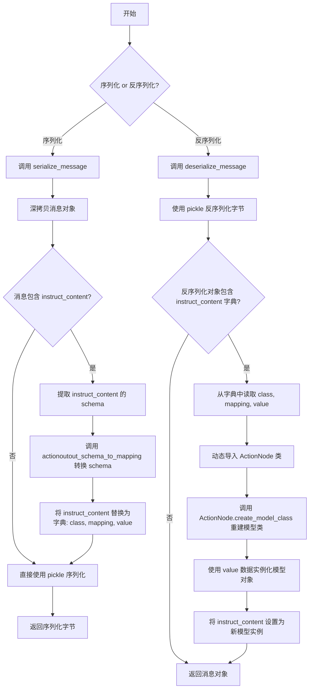
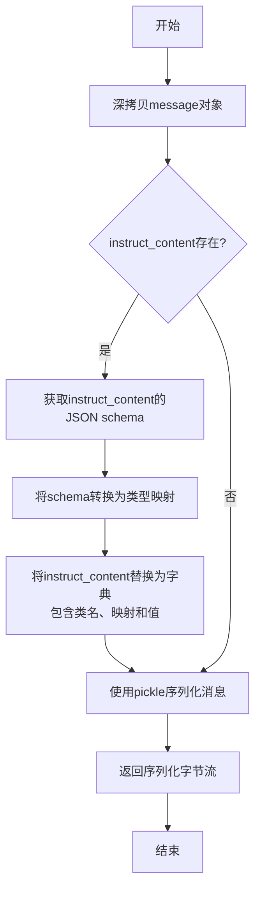

# `.\MetaGPT\metagpt\utils\serialize.py` 详细设计文档

该代码实现了对特定消息对象（包含结构化指令内容）的序列化与反序列化功能。核心是通过pickle进行基础对象序列化，并专门处理消息中基于Pydantic模型的`instruct_content`字段，将其模式（schema）和值转换为可序列化的字典形式，反序列化时再动态重建模型实例。

## 整体流程



## 类结构

```
全局函数
├── actionoutout_schema_to_mapping
├── actionoutput_mapping_to_str
├── actionoutput_str_to_mapping
├── serialize_message
└── deserialize_message
```

## 全局变量及字段


    

## 全局函数及方法

### `actionoutout_schema_to_mapping`

该函数用于将符合特定结构的 JSON Schema 字典（通常描述一个 Pydantic 模型）转换成一个字段映射字典。它遍历 Schema 中 `properties` 的第一层属性，根据属性的 `type` 将其映射为 Python 类型元组 `(type, ...)`。目前主要处理 `string`、`array` of `string` 以及 `array` of `array` of `string` 这三种类型。

参数：

- `schema`：`dict`，一个符合特定结构的 JSON Schema 字典，必须包含 `"properties"` 键。

返回值：`dict`，一个映射字典，键为字段名，值为一个 `(type, ...)` 格式的元组，表示该字段的类型。

#### 流程图

```mermaid
graph TD
    A[开始: actionoutout_schema_to_mapping(schema)] --> B[初始化空字典 mapping]
    B --> C[遍历 schema['properties'] 的每一项 field, property]
    C --> D{判断 property['type']}
    D -- "== 'string'" --> E[mapping[field] = (str, ...)]
    D -- "== 'array' 且 property['items']['type'] == 'string'" --> F[mapping[field] = (list[str], ...)]
    D -- "== 'array' 且 property['items']['type'] == 'array'" --> G[mapping[field] = (list[list[str]], ...)]
    D -- 其他类型 --> H[跳过，不添加到 mapping]
    E --> I[继续循环]
    F --> I
    G --> I
    H --> I
    I --> C
    C -- 遍历结束 --> J[返回 mapping]
```

#### 带注释源码

```python
def actionoutout_schema_to_mapping(schema: dict) -> dict:
    """
    直接遍历第一层的 `properties`。
    schema 结构类似：
    ```
    {
        "title":"prd",
        "type":"object",
        "properties":{
            "Original Requirements":{
                "title":"Original Requirements",
                "type":"string"
            },
        },
        "required":[
            "Original Requirements",
        ]
    }
    ```
    """
    mapping = dict()  # 初始化返回的映射字典
    for field, property in schema["properties"].items():  # 遍历 schema 中 properties 的每个字段
        if property["type"] == "string":  # 处理字符串类型字段
            mapping[field] = (str, ...)  # 映射为 (str, ...) 元组
        elif property["type"] == "array" and property["items"]["type"] == "string":  # 处理字符串数组类型字段
            mapping[field] = (list[str], ...)  # 映射为 (list[str], ...) 元组
        elif property["type"] == "array" and property["items"]["type"] == "array":  # 处理二维字符串数组类型字段
            # 此处仅考虑 `list[list[str]]` 的情况
            mapping[field] = (list[list[str]], ...)  # 映射为 (list[list[str]], ...) 元组
    return mapping  # 返回构建好的映射字典
```


### `actionoutput_mapping_to_str`

该函数用于将动作输出映射字典中的值（类型为元组）转换为它们的字符串表示形式。它遍历输入字典，将每个键对应的值（例如 `(str, ...)`）转换为字符串（例如 `"(<class 'str'>, Ellipsis)"`），并构建一个新的字典返回。这通常用于序列化过程中，将复杂的数据结构转换为可存储或传输的字符串格式。

参数：

-  `mapping`：`dict`，一个字典，其键为字符串，值为元组（例如 `(str, ...)` 或 `(list[str], ...)`），表示动作输出字段的类型映射。

返回值：`dict`，一个新的字典，其键与输入字典相同，但所有值都已转换为对应的字符串表示形式。

#### 流程图

```mermaid
flowchart TD
    A[开始] --> B[初始化空字典 new_mapping]
    B --> C{遍历 mapping 中的每个键值对?}
    C -->|是| D[将当前值 value 转换为字符串 str(value)]
    D --> E[将键 key 和转换后的字符串存入 new_mapping]
    E --> C
    C -->|遍历完成| F[返回 new_mapping]
    F --> G[结束]
```

#### 带注释源码

```python
def actionoutput_mapping_to_str(mapping: dict) -> dict:
    # 初始化一个新的空字典，用于存储转换后的键值对
    new_mapping = {}
    # 遍历输入字典 mapping 中的所有键值对
    for key, value in mapping.items():
        # 将当前值 value（一个元组）转换为它的字符串表示形式
        new_mapping[key] = str(value)
    # 返回包含字符串形式值的新字典
    return new_mapping
```


### `actionoutput_str_to_mapping`

将序列化后的映射字典（其中值为字符串形式）转换回原始的映射字典（其中值为元组形式，如 `(str, ...)` 或 `(list[str], ...)`）。

参数：

- `mapping`：`dict`，包含键值对的字典，其中值为字符串形式，表示原始的类型元组。

返回值：`dict`，转换后的字典，其中值为原始的元组形式（如 `(str, ...)` 或 `(list[str], ...)`）。

#### 流程图

```mermaid
graph TD
    A[开始] --> B[初始化 new_mapping 为空字典]
    B --> C[遍历 mapping 中的每个键值对]
    C --> D{值是否为 str 类型的元组字符串?}
    D -- 是 --> E[将 new_mapping[key] 设为 (str, ...)]
    D -- 否 --> F[使用 eval 将字符串转换为元组]
    F --> G[将 new_mapping[key] 设为转换后的元组]
    E --> H[继续遍历下一个键值对]
    G --> H
    H --> I{是否遍历完所有键值对?}
    I -- 否 --> C
    I -- 是 --> J[返回 new_mapping]
    J --> K[结束]
```

#### 带注释源码

```python
def actionoutput_str_to_mapping(mapping: dict) -> dict:
    new_mapping = {}  # 初始化一个新的字典，用于存储转换后的键值对
    for key, value in mapping.items():  # 遍历输入字典中的每个键值对
        if value == "(<class 'str'>, Ellipsis)":  # 检查值是否为字符串形式的 str 类型元组
            new_mapping[key] = (str, ...)  # 如果是，直接转换为 (str, ...) 元组
        else:
            new_mapping[key] = eval(value)  # 否则，使用 eval 将字符串转换为对应的元组（如 (list[str], ...)）
    return new_mapping  # 返回转换后的字典
```

### `serialize_message`

该函数用于序列化一个 `Message` 对象，以便于存储或网络传输。它首先创建消息的深拷贝以避免修改原始数据，然后检查并处理消息中的 `instruct_content` 字段。如果该字段存在，函数会将其转换为一个包含类名、类型映射和值的字典，以便后续反序列化时能够重建对象。最后，使用 `pickle` 模块将处理后的消息对象序列化为字节流。

参数：

- `message`：`Message`，需要序列化的消息对象

返回值：`bytes`，序列化后的字节流

#### 流程图



#### 带注释源码

```python
def serialize_message(message: "Message"):
    # 创建消息的深拷贝，避免后续操作修改原始对象
    message_cp = copy.deepcopy(message)  # avoid `instruct_content` value update by reference
    
    # 获取消息中的instruct_content字段
    ic = message_cp.instruct_content
    
    # 如果instruct_content存在，则进行特殊处理以便序列化
    if ic:
        # 获取instruct_content的JSON schema，用于后续类型映射
        schema = ic.model_json_schema()
        # 将schema转换为类型映射字典
        mapping = actionoutout_schema_to_mapping(schema)

        # 将instruct_content替换为一个字典，包含类名、类型映射和实际值
        message_cp.instruct_content = {"class": schema["title"], "mapping": mapping, "value": ic.model_dump()}
    
    # 使用pickle模块将处理后的消息对象序列化为字节流
    msg_ser = pickle.dumps(message_cp)

    # 返回序列化后的字节流
    return msg_ser
```

### `deserialize_message`

该函数用于反序列化经过 `pickle` 序列化的 `Message` 对象。如果 `Message` 对象包含 `instruct_content` 字段，该字段在序列化时被转换为包含类名、字段映射和值的字典，反序列化时会根据这些信息重建原始的 `instruct_content` 对象。

参数：

- `message_ser`：`str`，经过 `pickle` 序列化后的 `Message` 对象的字节字符串。

返回值：`Message`，反序列化后重建的 `Message` 对象。

#### 流程图

```mermaid
flowchart TD
    A[开始] --> B[使用pickle.loads反序列化message_ser]
    B --> C{message.instruct_content<br>是否存在？}
    C -- 否 --> D[直接返回message]
    C -- 是 --> E[提取ic字典<br>包含class, mapping, value]
    E --> F[动态导入ActionNode类]
    F --> G[使用ActionNode.create_model_class<br>根据ic['class']和ic['mapping']<br>创建模型类ic_obj]
    G --> H[使用ic_obj**ic['value']<br>实例化新的instruct_content对象ic_new]
    H --> I[将message.instruct_content<br>替换为ic_new]
    I --> D
```

#### 带注释源码

```python
def deserialize_message(message_ser: str) -> "Message":
    # 1. 使用pickle模块将字节字符串反序列化为Message对象
    message = pickle.loads(message_ser)
    
    # 2. 检查反序列化后的Message对象是否包含instruct_content字段
    if message.instruct_content:
        # 3. 获取序列化时存储的instruct_content字典
        ic = message.instruct_content
        
        # 4. 动态导入ActionNode类，避免循环导入问题
        actionnode_class = import_class("ActionNode", "metagpt.actions.action_node")
        
        # 5. 使用字典中的类名（ic["class"]）和字段映射（ic["mapping"]）
        #    通过ActionNode的类方法动态重建原始的Pydantic模型类
        ic_obj = actionnode_class.create_model_class(class_name=ic["class"], mapping=ic["mapping"])
        
        # 6. 使用字典中的值（ic["value"]）实例化上一步创建的模型类，
        #    得到重建的instruct_content对象
        ic_new = ic_obj(**ic["value"])
        
        # 7. 将Message对象的instruct_content字段替换为重建后的对象
        message.instruct_content = ic_new

    # 8. 返回完整的、包含重建后instruct_content的Message对象
    return message
```

## 关键组件


### 序列化与反序列化核心流程

定义了将复杂消息对象（特别是包含动态生成的Pydantic模型`instruct_content`的消息）转换为可存储/传输的字节流（序列化），以及从字节流重建原始对象（反序列化）的完整流程。该流程通过深度拷贝、模式提取、映射转换和pickle结合来实现。

### 模式到映射的转换 (`actionoutout_schema_to_mapping`)

将Pydantic模型的JSON Schema（`properties`部分）转换为一个内部映射字典，该字典将字段名映射到其对应的Python类型和占位符（`...`），用于后续动态重建模型。目前支持`str`、`list[str]`和`list[list[str]]`三种类型。

### 映射的字符串化与反向转换 (`actionoutput_mapping_to_str`, `actionoutput_str_to_mapping`)

提供将内部类型映射字典转换为字符串形式（以便于序列化存储）以及从字符串形式转换回内部映射字典的功能。`actionoutput_str_to_mapping`函数使用`eval()`来执行反向转换。

### 消息序列化 (`serialize_message`)

负责序列化`Message`对象。其核心操作是：深度拷贝消息以避免副作用；检查并处理`instruct_content`属性；若存在，则提取其JSON Schema，转换为类型映射，并将原始值、类名和映射字典打包成一个新的字典结构替换原`instruct_content`；最后使用`pickle.dumps`将整个处理后的消息对象转换为字节串。

### 消息反序列化 (`deserialize_message`)

负责从字节串反序列化重建`Message`对象。其核心操作是：使用`pickle.loads`加载出基础消息对象；检查并处理`instruct_content`属性；若其为一个包含类名、映射和值的字典结构，则动态导入`ActionNode`类，利用其`create_model_class`方法根据类名和映射字典重新创建Pydantic模型类，并用存储的值实例化该模型；最后将新建的模型实例赋回消息的`instruct_content`属性。


## 问题及建议


### 已知问题

-   **`eval` 函数的安全风险**：`actionoutput_str_to_mapping` 函数中使用了 `eval(value)` 来将字符串形式的类型映射转换回 Python 对象。`eval` 会执行传入的任意字符串，如果 `value` 来自不可信的来源（例如，被篡改的序列化数据），可能导致任意代码执行，构成严重的安全漏洞。
-   **类型映射处理不完整**：`actionoutout_schema_to_mapping` 函数目前仅处理了 `string`、`array` of `string` 和 `array` of `array` of `string` 这三种 JSON Schema 类型。如果 `instruct_content` 的模型包含其他数据类型（如 `integer`、`boolean`、`object` 或更复杂的嵌套结构），序列化时将无法正确生成映射，导致信息丢失或反序列化失败。
-   **潜在的循环导入问题**：`deserialize_message` 函数中通过 `import_class` 动态导入 `ActionNode`，注释中提及是为了避免循环导入。这表明模块间的依赖关系可能存在设计上的耦合，动态导入是一种规避手段，但并非根本解决方案，可能影响代码的可读性和静态分析。
-   **深度拷贝的性能开销**：`serialize_message` 函数中对整个 `message` 对象进行了 `copy.deepcopy` 操作。如果 `message` 对象结构复杂或包含大量数据，深度拷贝会带来显著的内存和 CPU 开销，可能成为性能瓶颈。
-   **硬编码的模型类创建逻辑**：反序列化时，硬编码了使用 `ActionNode.create_model_class` 来重建 `instruct_content` 对象。这限制了代码的通用性，使得序列化/反序列化机制与 `ActionNode` 这个特定类紧密耦合。如果未来有其他类型的 `instruct_content` 模型，此逻辑将无法适用。

### 优化建议

-   **替换不安全的 `eval`**：将 `actionoutput_str_to_mapping` 函数中的 `eval(value)` 替换为安全的类型解析方法。可以建立一个从字符串到类型元组的静态映射字典，或者使用 `ast.literal_eval`（如果字符串格式严格可控且仅包含 Python 字面量结构）。最安全的方式是自定义一个解析函数来处理特定的 `"(<class 'str'>, Ellipsis)"` 和 `"(list[str], Ellipsis)"` 等格式。
-   **扩展类型映射支持**：重构 `actionoutout_schema_to_mapping` 函数，使其能够处理更广泛的 JSON Schema 类型。可以定义一个更全面的映射关系，将 JSON Schema 的 `type` 和可能的 `format` 映射到对应的 Python 类型（如 `int`, `float`, `bool`, `dict` 等）。对于复杂或自定义类型，可以考虑引入一个可扩展的注册机制。
-   **解耦模型创建逻辑**：设计一个更通用的机制来处理 `instruct_content` 的反序列化。例如，可以在序列化时保存模型类的完整模块路径（如 `ic["class_module"] = ic_obj.__module__; ic["class_name"] = ic_obj.__class__.__name__`），然后在反序列化时动态导入并获取该类，而不是硬编码调用 `ActionNode.create_model_class`。这提高了组件的复用性和灵活性。
-   **优化序列化性能**：
    1.  **避免不必要的深度拷贝**：考虑是否可以直接修改 `message` 的 `instruct_content` 字段而不影响原对象。如果业务逻辑允许，可以尝试浅拷贝（`copy.copy`）或直接操作，并在文档中明确该函数具有副作用。或者，仅在确实需要修改时（即 `ic` 存在时）才创建副本。
    2.  **评估 Pickle 替代方案**：`pickle` 虽然方便，但在跨版本兼容性、安全性和性能上可能存在局限。对于需要长期存储或跨网络传输的场景，可以考虑使用 `json`（结合自定义编码器/解码器）、`msgpack` 或 `protobuf` 等更安全、高效的序列化协议。这需要权衡开发成本与收益。
-   **增强错误处理与健壮性**：在关键步骤（如 `pickle.loads`、`import_class`、模型创建、字段映射）添加更细致的异常捕获（`try-except`）和错误日志，提供更清晰的错误信息，避免因单一消息反序列化失败导致整个流程中断。
-   **添加单元测试与类型注解**：为序列化和反序列化函数编写全面的单元测试，覆盖各种边界情况（如空值、未知类型、恶意输入）。同时，为函数和变量添加更详细的类型注解（利用 `typing` 模块），可以提高代码的可读性，并借助静态类型检查工具（如 mypy）提前发现潜在问题。


## 其它


### 设计目标与约束

本模块的核心设计目标是实现`Message`对象的序列化与反序列化，特别是处理其内部复杂的`instruct_content`字段（该字段可能包含由Pydantic动态生成的模型实例）。主要约束包括：1) 需要深度复制以避免引用更新问题；2) 必须处理无法直接序列化的Pydantic动态模型；3) 需要避免循环导入；4) 序列化后的数据应支持跨进程或持久化存储。

### 错误处理与异常设计

模块中的函数主要进行数据转换和序列化操作，未显式包含`try-except`块。潜在的异常点包括：1) `pickle.dumps`和`pickle.loads`可能因对象不可pickle化而引发`pickle.PicklingError`或`pickle.UnpicklingError`；2) `eval()`在`actionoutput_str_to_mapping`函数中的使用存在安全风险，若输入不可信可能执行任意代码；3) `import_class`可能因模块路径错误引发`ImportError`；4) `ic_obj(**ic["value"])`在动态模型实例化时，若数据与模型不匹配可能引发`ValidationError`。当前设计将异常抛给调用者处理。

### 数据流与状态机

1.  **序列化流程 (`serialize_message`)**: 输入`Message`对象 -> 深度拷贝 -> 检查并处理`instruct_content` -> 提取其JSON Schema -> 转换为类型映射字典 -> 将原始`instruct_content`替换为包含类名、映射和值的字典 -> 使用`pickle`序列化整个`Message`对象 -> 输出字节串。
2.  **反序列化流程 (`deserialize_message`)**: 输入序列化字节串 -> 使用`pickle`反序列化得到`Message`对象 -> 检查并处理`instruct_content`字典 -> 根据类名和映射动态重建Pydantic模型类 -> 使用存储的值实例化模型 -> 将`instruct_content`恢复为模型实例 -> 返回完整的`Message`对象。
3.  无复杂的状态机，流程为线性。

### 外部依赖与接口契约

1.  **外部依赖**:
    *   `pickle`: Python标准库，用于核心的对象序列化与反序列化。
    *   `copy.deepcopy`: 用于创建`Message`对象的深度副本。
    *   `metagpt.utils.common.import_class`: 项目内部工具函数，用于动态导入类，旨在解决循环导入问题。
    *   `ActionNode` (来自`metagpt.actions.action_node`): 项目内部类，其`create_model_class`方法用于动态创建Pydantic模型。
    *   `Message`类: 项目内部核心数据结构，是本模块处理的主要对象（通过字符串注解形式引用）。
2.  **接口契约**:
    *   `serialize_message(message: "Message") -> bytes`: 接受一个`Message`实例，返回其序列化后的字节串。要求`Message`对象（及其`instruct_content`）的结构符合预期。
    *   `deserialize_message(message_ser: bytes) -> "Message"`: 接受一个由`serialize_message`生成的字节串，返回反序列化后的`Message`对象。输入字节串必须是有效的、由兼容版本生成的pickle数据。
    *   辅助函数（如`actionoutout_schema_to_mapping`）主要内部使用，但其输入输出格式构成了模块内部数据转换的契约。

### 安全考虑

1.  **`eval()`的使用**: `actionoutput_str_to_mapping`函数中使用`eval()`将字符串形式的类型映射转换回元组。这是一个显著的安全漏洞，如果`mapping`字典的来源不可信（例如，从网络或用户输入反序列化），攻击者可能注入恶意代码。
2.  **`pickle`的安全风险**: `pickle`模块本身不安全，反序列化不可信数据可能导致任意代码执行。本模块设计用于内部进程间通信或可信存储，但若序列化数据可能来自外部，则存在风险。
3.  **建议**: 将`eval()`替换为安全的解析方法，例如使用`ast.literal_eval`或构建一个安全的字符串到类型的映射字典。对于`pickle`，在必须处理不可信数据时，应考虑使用更安全的序列化格式（如JSON），但这需要`Message`及其内容完全支持JSON序列化。

### 性能考量

1.  **深度拷贝**: `serialize_message`中对整个`Message`进行`deepcopy`可能成为性能瓶颈，尤其是当`Message`包含大量或复杂数据时。
2.  **动态模型创建**: 反序列化时每次都需要动态创建Pydantic模型类（`actionnode_class.create_model_class`），这可能带来一定的开销。
3.  **优化建议**: 可以考虑缓存已创建过的动态模型类，避免重复创建。或者，评估是否真的需要深度拷贝，或许在某些场景下浅拷贝或直接操作原对象（在明确生命周期和副作用的情况下）是可行的。

### 测试策略建议

1.  **单元测试**: 应为每个函数编写单元测试，覆盖正常流程和边界情况，包括：空`instruct_content`、各种类型的映射（str, list[str], list[list[str]]）、序列化/反序列化循环的完整性。
2.  **安全测试**: 专门测试`actionoutput_str_to_mapping`函数，验证其对恶意输入的处理（应重构以消除`eval`）。
3.  **集成测试**: 测试`serialize_message`和`deserialize_message`与真实的`Message`和`ActionNode`协作是否正常。
4.  **兼容性测试**: 确保序列化后的字节流在不同Python版本或模块版本间具有一定的兼容性（注意`pickle`的版本兼容性问题）。


    