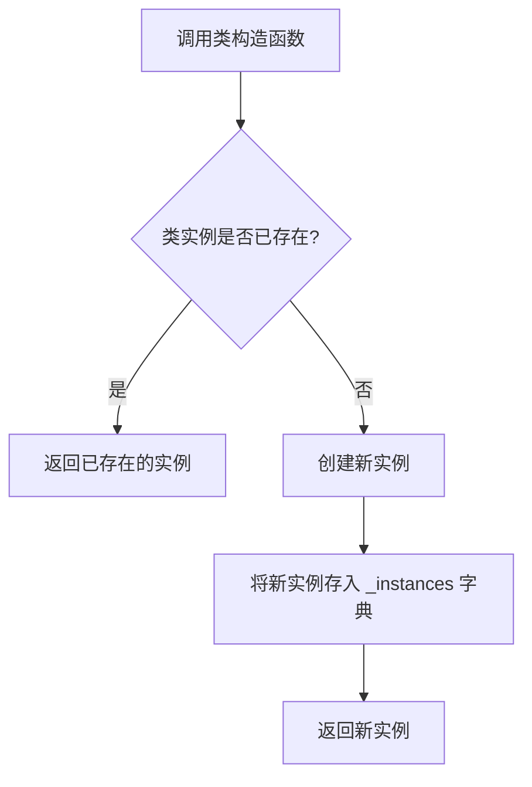

# `.\MetaGPT\metagpt\utils\singleton.py` 详细设计文档

该代码实现了一个单例元类（Singleton metaclass），用于确保一个类在整个应用程序中只有一个实例。它通过重写元类的 `__call__` 方法，在首次创建类实例时将其存储在类级别的字典中，后续调用时直接返回已创建的实例，从而实现了单例模式。

## 整体流程



## 类结构

```
type (Python内置元类)
├── abc.ABCMeta (抽象基类元类)
│   └── Singleton (单例元类)
```

## 全局变量及字段


### `Singleton._instances`
    
一个类级别的字典，用于存储已创建的类的单例实例，键为类本身，值为该类的唯一实例。

类型：`dict`
    
    

## 全局函数及方法


### `Singleton.__call__`

`Singleton.__call__` 是元类 `Singleton` 的 `__call__` 方法。它重写了类的实例化过程，确保一个类在全局范围内只有一个实例。当尝试创建该类的实例时，此方法会检查该类是否已有实例存在；如果存在，则返回现有实例，否则创建新实例并存储起来。

参数：

- `cls`：`type`，表示正在被实例化的类本身。
- `*args`：`tuple`，传递给类构造函数的可变位置参数。
- `**kwargs`：`dict`，传递给类构造函数的可变关键字参数。

返回值：`object`，返回类 `cls` 的唯一实例。

#### 流程图

```mermaid
flowchart TD
    A[调用 Singleton.__call__<br>传入 cls, *args, **kwargs] --> B{cls 是否在<br>_instances 字典中?}
    B -- 否 --> C[调用父类 type.__call__<br>创建新实例]
    C --> D[将新实例存入<br>_instances[cls]]
    D --> E[返回 _instances[cls]]
    B -- 是 --> E
```

#### 带注释源码

```python
def __call__(cls, *args, **kwargs):
    """Call method for the singleton metaclass."""
    # 检查当前类 cls 是否已经在 _instances 字典中注册过
    if cls not in cls._instances:
        # 如果不存在，则调用父类（type）的 __call__ 方法创建该类的一个新实例
        # 并将这个新实例存储在 _instances 字典中，以 cls 为键
        cls._instances[cls] = super(Singleton, cls).__call__(*args, **kwargs)
    # 返回存储在 _instances 字典中的 cls 对应的实例（无论是刚创建的还是已存在的）
    return cls._instances[cls]
```


## 关键组件


### 单例元类 (Singleton Metaclass)

一个元类，用于确保一个类在整个应用程序中只有一个实例。它通过重写 `__call__` 方法，在首次创建类实例时将其存储在类级别的字典中，后续调用直接返回已存储的实例，从而实现单例模式。

### 抽象基类元类 (Abstract Base Class Metaclass)

通过继承 `abc.ABCMeta`，该元类具备了定义抽象基类的能力，可以强制其子类实现特定的抽象方法，从而定义清晰的接口契约。


## 问题及建议


### 已知问题

-   **线程安全问题**：当前的 `Singleton` 元类实现在多线程环境下是不安全的。如果多个线程同时检查 `if cls not in cls._instances` 并发现条件为真，它们可能会同时创建多个实例，从而破坏单例模式。
-   **继承链潜在问题**：该类同时继承自 `abc.ABCMeta` 和 `type`。虽然 `abc.ABCMeta` 本身是 `type` 的子类，但在多重继承中直接并列声明可能在某些复杂的元类继承场景下引发意外的元类冲突（`metaclass conflict`），尽管在当前简单实现中可能不会立即显现。
-   **实例字典的生命周期**：`_instances` 是一个类变量（在元类上），它会在程序运行期间持续累积所有使用过该元类的单例类实例。如果某些单例类及其实例仅在特定模块或生命周期内需要，这可能导致内存无法被及时释放。
-   **缺乏序列化支持**：当使用 `pickle` 等模块对单例实例进行序列化和反序列化时，如果没有定义 `__reduce__` 或 `__getstate__`/`__setstate__` 等特殊方法，可能会创建出新的实例，破坏单例特性。

### 优化建议

-   **引入线程锁**：在 `__call__` 方法中，使用线程锁（如 `threading.Lock`）来确保实例化过程的原子性。可以采用“双重检查锁定”模式来减少锁的开销。
-   **简化元类继承**：由于 `abc.ABCMeta` 已经是 `type` 的子类，继承 `type` 是多余的。建议将父类声明改为 `class Singleton(abc.ABCMeta):`，使继承关系更清晰。
-   **考虑弱引用字典**：对于 `_instances` 字典，可以考虑使用 `weakref.WeakKeyDictionary` 来存储实例。这样，当单例类本身没有其他引用时，该条目可以被自动垃圾回收，有助于管理内存。但需注意，这改变了单例的“全局唯一生命周期”语义，通常单例期望与程序同生命周期，因此此建议需根据具体需求权衡。
-   **添加序列化支持**：在单例类中实现 `__reduce__` 方法，使其在反序列化时返回已有的实例，而不是创建新对象。例如：`def __reduce__(self): return (self.__class__.get_instance, ())`，并配套一个类方法 `get_instance` 来获取实例。
-   **提高代码清晰度**：可以考虑将实例创建逻辑封装到一个类方法（如 `get_instance`）中，而让 `__init__` 方法只负责初始化（可能被多次调用，但实例只创建一次）。这符合更常见的单例模式实现，并使意图更明确。当前的元类方式虽然简洁，但可能对不熟悉元类的开发者不够直观。


## 其它


### 设计目标与约束

设计目标：提供一个元类（metaclass）`Singleton`，用于实现单例模式，确保任何使用此元类的类在整个应用程序生命周期中只有一个实例。该设计旨在简化单例模式的实现，避免重复代码，并确保线程安全（在单线程环境下）。

约束：
1. 该实现基于Python的元类机制，要求目标类显式指定`metaclass=Singleton`。
2. 该实现是基础的单例模式，在多线程环境下可能存在竞态条件（race condition），需要额外同步机制来保证线程安全。
3. 该实现不处理子类继承单例父类时的实例化行为（通常子类也会是单例，且与父类实例独立）。

### 错误处理与异常设计

当前代码没有显式的错误处理或异常抛出机制。其行为依赖于Python语言本身的元类调用机制和字典操作。潜在的错误场景包括：
1. 如果`super(Singleton, cls).__call__(*args, **kwargs)`调用失败（例如，类`__init__`方法抛出异常），异常会直接传播给调用者，并且`cls._instances`字典中不会记录该类。这可能导致后续尝试实例化时成功创建一个新实例（如果原始错误是暂时的），或者继续失败。
2. 没有针对无效参数或非法状态（例如，恶意修改`_instances`字典）的防护。

### 数据流与状态机

**数据流：**
1.  **输入**：对使用`Singleton`元类的类进行实例化调用（例如 `MyClass()`）。
2.  **处理**：
    a. `Singleton.__call__`方法被触发。
    b. 检查全局字典`_instances`中是否存在以该类为键的条目。
    c. 如果不存在，则通过`super().__call__`创建该类的一个新实例，并将其存储在`_instances`字典中。
    d. 返回存储在字典中的实例（无论是新创建的还是已存在的）。
3.  **输出**：该类的唯一实例。

**状态机：**
状态主要围绕`Singleton._instances`字典展开：
- **初始状态**：`_instances`为空字典`{}`。
- **状态转移**：当首次实例化一个使用`Singleton`元类的类`Cls`时，状态转移发生。`_instances[Cls]`从`不存在`变为`存在`（值为`Cls`的实例）。
- **终止状态**：对于每个类`Cls`，一旦其实例被创建并存入`_instances`，后续所有对`Cls()`的调用都直接返回该实例，状态不再改变。

### 外部依赖与接口契约

**外部依赖：**
1.  **Python语言特性**：依赖Python的元类（`type`）和抽象基类（`abc.ABCMeta`）机制。`Singleton`继承自这两者以融合它们的功能。
2.  **标准库**：`abc`模块，用于继承`ABCMeta`。

**接口契约：**
1.  **作为元类**：`Singleton`类本身被设计为用作其他类的元类。其接口即Python元类的标准接口，核心是`__call__`方法。使用此元类的类必须遵守Python类的定义规则。
2.  **`__call__`方法契约**：
    *   **前置条件**：调用者传入的`cls`参数必须是一个类对象（使用`Singleton`作为元类）。
    *   **后置条件**：保证对于相同的`cls`，始终返回同一个实例对象。
    *   **副作用**：可能会修改类变量`_instances`（向其中添加键值对）。
3.  **对使用者的契约**：任何将`metaclass=Singleton`的类承诺将表现为单例。使用者不应直接实例化`Singleton`类本身，也不应依赖`_instances`字典的内部结构。

    