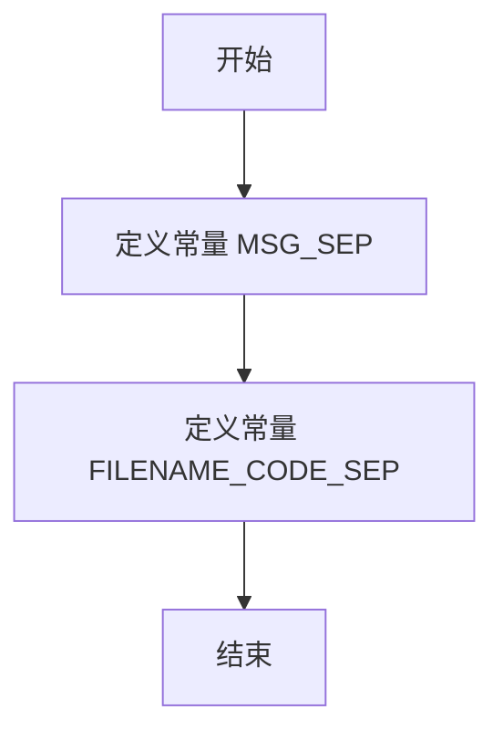

# `.\MetaGPT\metagpt\utils\special_tokens.py` 详细设计文档

该文件定义了两个用于消息和代码解析的字符串分隔符常量，为代码生成或代码片段管理功能提供结构化的数据分隔支持。

## 整体流程



## 类结构

```
无类结构，仅包含全局常量定义
```

## 全局变量及字段


### `MSG_SEP`
    
用于在 WriteCode 消息内容中分隔不同代码消息的标记字符串。

类型：`str`
    


### `FILENAME_CODE_SEP`
    
用于在单个代码消息中分隔文件名和实际代码文本的标记字符串。

类型：`str`
    


    

## 全局函数及方法


## 关键组件


### 常量定义

定义了用于消息和文件内容分隔的字符串常量，以支持代码消息的序列化和解析。

### 消息分隔符

用于在WriteCode消息内容中分隔不同的代码消息。

### 文件名与代码分隔符

用于在单个代码消息中分隔文件名和实际的代码文本。


## 问题及建议


### 已知问题

-   **硬编码的魔法字符串**：`MSG_SEP` 和 `FILENAME_CODE_SEP` 被定义为全局常量，但其值（`“#*000*#”` 和 `“#*001*#”`）是硬编码的字符串。这些字符串在代码中作为分隔符使用，如果未来需要修改这些分隔符（例如，因为与传输的数据内容冲突），必须在代码中多处查找和替换，容易出错且维护性差。
-   **缺乏文档和约束说明**：常量定义缺少注释说明其具体用途、使用场景以及选择当前特定字符串（`#*000*#` 和 `#*001*#`）的原因。此外，没有对分隔符的不可出现性（即，确保它们不会出现在被分隔的正常内容中）做出任何说明或验证，这可能导致数据解析错误。
-   **潜在的命名空间污染**：虽然目前只有两个常量，但将它们定义为全局变量（尤其是在模块顶层）存在污染全局命名空间的风险。如果此模块被广泛导入，可能会与其他模块的变量名冲突。

### 优化建议

-   **将常量封装在类或配置模块中**：建议创建一个专门的配置类（如 `CodeMessageConfig`）或使用一个配置模块/字典来管理这些分隔符。这样可以将相关的配置集中管理，提高代码的组织性和可维护性。例如：
    ```python
    class CodeMessageConfig:
        MSG_SEP = "#*000*#"
        FILENAME_CODE_SEP = "#*001*#"
    ```
    使用时为 `CodeMessageConfig.MSG_SEP`。
-   **添加详细的文档字符串**：为每个常量添加注释，明确说明其作用、格式以及为什么选择当前值。如果存在约束（如“该字符串不应出现在文件名或代码正文中”），也应明确写出，以提醒开发者和维护者。
-   **考虑使用更独特的分隔符或转义机制**：评估当前分隔符在真实数据中出现的可能性。如果风险较高，可以考虑使用更长的、更随机的分隔符，或者实现一种转义机制（如当内容中出现分隔符时进行转义处理），以确保数据解析的可靠性。这属于设计上的增强。
-   **使用 `typing.Final` 进行标注（Python 3.8+）**：如果使用较新版本的Python，可以使用 `from typing import Final` 来声明这些常量，以明确其不应被修改的意图，并有助于静态类型检查工具进行分析。
    ```python
    from typing import Final

    MSG_SEP: Final[str] = "#*000*#"
    FILENAME_CODE_SEP: Final[str] = "#*001*#"
    ```


## 其它


### 设计目标与约束

该代码片段定义了两个全局常量，用于在消息内容中分隔不同的代码块以及分隔文件名和代码文本。其核心设计目标是提供一种简单、明确且不易与常规代码内容冲突的文本分隔机制，以支持在单一字符串消息中序列化多个代码文件信息。主要约束包括：分隔符必须是纯文本字符串，且需要在常规编程语言源代码中出现概率极低，以避免误解析。

### 错误处理与异常设计

当前代码片段仅包含常量定义，不涉及运行时逻辑，因此没有显式的错误处理或异常设计。潜在的错误场景在于使用这些分隔符的解析逻辑。如果上游生成消息或下游解析消息的代码未能正确处理这些分隔符（例如，消息内容本身包含了分隔符字符串），将导致解析失败或数据错乱。建议在使用这些常量的解析函数中，加入对格式错误的检查（例如，分割后数组长度不符合预期）并抛出清晰的异常或返回错误标识。

### 数据流与状态机

数据流始于一个包含多个代码文件信息的聚合字符串。该字符串使用 `MSG_SEP` 被分割成多个子串，每个子串代表一个代码块。接着，每个代码块子串使用 `FILENAME_CODE_SEP` 被进一步分割为两部分：文件名和对应的代码文本。这个过程是线性的、无状态的转换，不涉及复杂的状态机。核心数据转换路径为：`聚合字符串` -(按`MSG_SEP`分割)-> `[代码块1, 代码块2...]` -(每个块按`FILENAME_CODE_SEP`分割)-> `[(文件名1, 代码文本1), (文件名2, 代码文本2)...]`。

### 外部依赖与接口契约

这两个常量是内部实现的细节，不直接定义对外部系统或模块的接口。然而，它们构成了一个隐式的、轻量级的“序列化协议”或“数据格式契约”。任何生成包含多代码文件消息的组件（发送方）和任何解析此类消息的组件（接收方）都必须共同遵守并使用这两个常量。更改这些常量的值将破坏发送方和接收方之间的兼容性，因此它们应被视为稳定的、不轻易变更的接口定义。

### 安全性与鲁棒性考虑

当前实现的安全性风险较低。主要鲁棒性问题在于分隔符的选择：虽然 `#*000*#` 和 `#*001*#` 在常规代码中不常见，但并非绝对不可能出现（例如，在包含特定注释或字符串字面量的代码中）。这可能导致解析歧义。为增强鲁棒性，可考虑以下措施：1) 在使用分隔符进行分割时，采用限制分割次数（如 `str.split(sep, maxsplit=1)`）的策略来减少误匹配的影响；2) 在生成消息时，可考虑对代码文本进行简单的转义处理，但会增加复杂性。目前的设计在简单性和功能性之间取得了平衡，适用于受控的、非对抗性的环境。

### 测试策略建议

针对使用这些常量的功能模块，应设计以下测试用例：1) **正常用例**：测试包含单个和多个代码文件的消息的正确解析。2) **边界用例**：测试代码内容为空字符串、文件名为空字符串（如果允许）的情况。3) **负面用例**：测试消息内容中意外包含分隔符字符串时解析器的行为（是否报错、是否部分解析）。4) **兼容性测试**：如果常量值发生变更，需要测试新旧版本消息的解析兼容性。这些常量本身作为纯数据，无需单元测试，但使用它们的解析函数是测试的重点。

    