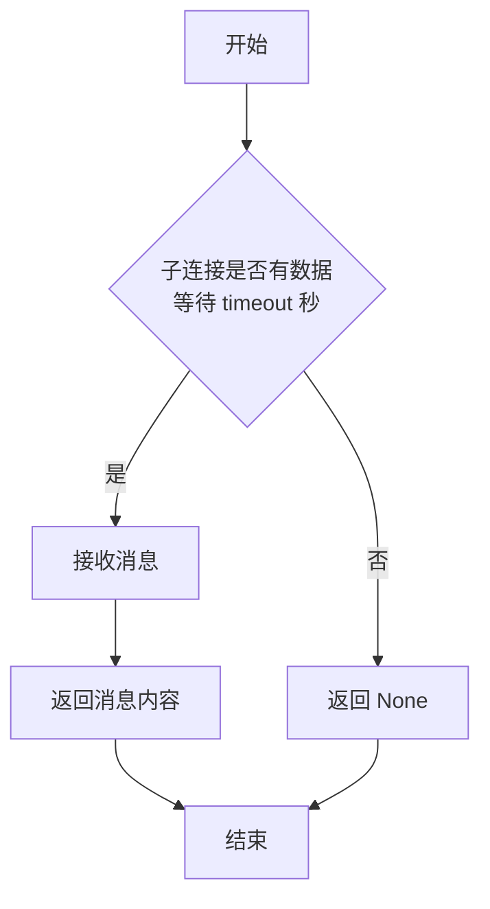
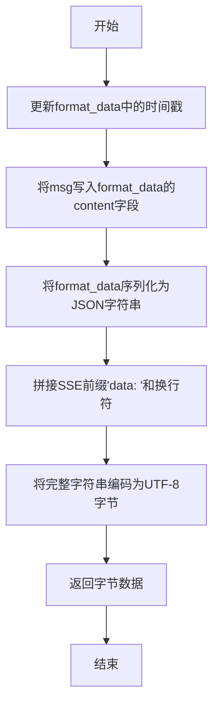

# `.\MetaGPT\metagpt\utils\stream_pipe.py` 详细设计文档

该代码实现了一个基于进程间通信管道（Pipe）的流式数据传输包装器，主要用于模拟或转发类似OpenAI API的服务器发送事件（Server-Sent Events, SSE）格式的流式响应。它允许父进程向子进程发送消息，并将这些消息格式化为标准的SSE数据块。

## 整体流程

```mermaid
graph TD
    A[StreamPipe 初始化] --> B[创建双向管道 parent_conn/child_conn]
    B --> C[设置 finish 标志为 False]
    C --> D{等待操作}
    D --> E[父进程调用 set_message]
    E --> F[parent_conn.send(msg) 发送消息]
    D --> G[子进程调用 get_message]
    G --> H{child_conn.poll(timeout)?}
    H -- 是 --> I[child_conn.recv() 接收消息]
    H -- 否 --> J[返回 None]
    I --> K[（可选）调用 msg2stream 格式化消息]
    K --> L[返回 'data: {...}\n' 格式的字节流]
```

## 类结构

```
StreamPipe
├── 字段: name, parent_conn, child_conn, finish, format_data
├── 方法: __init__, set_message, get_message, msg2stream
```

## 全局变量及字段


### `StreamPipe.name`
    
管道实例的可选名称，用于标识。

类型：`str | None`
    


### `StreamPipe.parent_conn`
    
用于发送消息的父端连接对象。

类型：`multiprocessing.connection.Connection`
    


### `StreamPipe.child_conn`
    
用于接收消息的子端连接对象。

类型：`multiprocessing.connection.Connection`
    


### `StreamPipe.finish`
    
指示流式传输是否已完成的标志。

类型：`bool`
    


### `StreamPipe.format_data`
    
用于格式化流式响应消息的预定义JSON模板。

类型：`dict`
    
    

## 全局函数及方法

### `StreamPipe.__init__`

初始化一个 `StreamPipe` 实例，用于创建进程间通信管道并设置初始状态。

参数：

- `name`：`str`，可选参数，用于标识该 `StreamPipe` 实例的名称。

返回值：`None`，构造函数不返回任何值。

#### 流程图

```mermaid
graph TD
    A[开始] --> B[接收参数 name]
    B --> C{name 是否为 None?}
    C -- 是 --> D[将 self.name 设为 None]
    C -- 否 --> E[将 self.name 设为传入的 name 值]
    D --> F
    E --> F[创建双向管道<br>self.parent_conn, self.child_conn = Pipe()]
    F --> G[初始化完成标志<br>self.finish = False]
    G --> H[结束]
```

#### 带注释源码

```python
def __init__(self, name=None):
    # 设置实例的名称，用于标识
    self.name = name
    # 创建一个双向管道，用于进程间通信
    # parent_conn 通常用于发送消息，child_conn 用于接收消息
    self.parent_conn, self.child_conn = Pipe()
    # 初始化一个标志位，表示流式传输是否完成
    self.finish: bool = False
```

### `StreamPipe.set_message`

该方法用于向父连接发送一条消息，是进程间通信的一部分。

参数：

- `msg`：`Any`，要发送的消息内容，可以是任意可序列化的Python对象。

返回值：`None`，该方法不返回任何值。

#### 流程图

```mermaid
flowchart TD
    A[开始] --> B[接收参数 msg]
    B --> C[调用 self.parent_conn.send(msg)]
    C --> D[消息发送完成]
    D --> E[结束]
```

#### 带注释源码

```python
def set_message(self, msg):
    # 使用父连接（parent_conn）发送消息
    # 参数msg可以是任意可序列化的Python对象
    self.parent_conn.send(msg)
```

### `StreamPipe.get_message`

该方法用于从子连接中获取消息，支持超时机制。如果指定时间内有消息到达，则返回消息内容；否则返回 `None`。

参数：

- `timeout`：`int`，超时时间（秒），默认为 3 秒。指定等待消息的最长时间。

返回值：`Any` 或 `None`，如果超时前接收到消息，则返回消息内容；否则返回 `None`。

#### 流程图



#### 带注释源码

```python
def get_message(self, timeout: int = 3):
    # 检查子连接在指定的超时时间内是否有数据可读
    if self.child_conn.poll(timeout):
        # 如果有数据，则从子连接接收并返回消息
        return self.child_conn.recv()
    else:
        # 如果超时，则返回 None
        return None
```

### `StreamPipe.msg2stream`

该方法将给定的消息字符串格式化为符合OpenAI流式响应格式的字节流数据，用于服务器推送事件（Server-Sent Events, SSE）。

参数：

- `msg`：`str`，需要被格式化为流式响应的文本内容。

返回值：`bytes`，一个符合SSE格式的字节字符串，格式为 `data: {json_data}\n`。

#### 流程图



#### 带注释源码

```python
def msg2stream(self, msg):
    # 更新format_data字典中的'created'字段为当前时间戳
    self.format_data["created"] = int(time.time())
    # 将传入的msg参数赋值给format_data中嵌套的content字段
    self.format_data["choices"][0]["delta"]["content"] = msg
    # 将更新后的format_data字典序列化为JSON字符串（确保非ASCII字符正确显示）
    # 在JSON字符串前拼接SSE协议要求的前缀"data: "和换行符"\n"
    # 最后将整个字符串编码为UTF-8格式的字节串并返回
    return f"data: {json.dumps(self.format_data, ensure_ascii=False)}\n".encode("utf-8")
```

## 关键组件


### 进程间通信管道 (Pipe)

使用 Python 的 `multiprocessing.Pipe` 实现了一个双向的进程间通信通道，用于在父进程和子进程之间传递消息，支持非阻塞的轮询接收。

### 流式数据格式化器

定义了一个符合 OpenAI 流式响应格式的 JSON 模板，并提供 `msg2stream` 方法将普通文本消息动态填充到该模板中，生成符合 Server-Sent Events (SSE) 协议格式的字节流数据。

### 消息发送与接收机制

通过 `set_message` 和 `get_message` 方法封装了管道的发送和接收操作，其中 `get_message` 支持超时设置，避免了接收端的无限期阻塞。


## 问题及建议


### 已知问题

-   **硬编码的响应格式**：`format_data` 字典被定义为类变量，其内容（如 `id`、`object`、`model`、`system_fingerprint`）是硬编码的。这意味着所有通过 `msg2stream` 方法生成的数据流都共享相同的元数据，这在多用户、多会话或需要区分不同请求来源的场景下会导致数据混淆和不准确。
-   **缺乏线程/进程安全性**：`StreamPipe` 类设计用于多进程通信（使用 `multiprocessing.Pipe`），但 `finish` 标志和 `format_data` 作为实例/类变量，在多个进程同时操作同一个 `StreamPipe` 实例时（虽然不常见，但若共享实例则可能发生），可能引发竞态条件，导致状态不一致或数据污染。
-   **僵硬的超时处理**：`get_message` 方法在超时后固定返回 `None`。对于调用方而言，无法区分“无新消息”和“连接异常”等情况，错误处理能力较弱。
-   **潜在的数据序列化瓶颈**：`msg2stream` 方法每次调用都会执行一次完整的 JSON 序列化（`json.dumps`）。如果 `msg` 是极长的字符串或该方法被高频调用，JSON 序列化可能成为性能瓶颈。
-   **资源泄漏风险**：该类没有提供显式的关闭或清理管道连接的方法（如 `close`）。如果使用不当，可能导致管道文件描述符泄漏。

### 优化建议

-   **将 `format_data` 参数化**：建议将 `format_data` 中的静态字段（如 `id`, `model` 等）作为 `__init__` 方法的参数，或在 `msg2stream` 方法中作为参数传入。这样可以为不同的数据流生成不同的、正确的元数据。也可以考虑使用一个可配置的模板或工厂方法来构建这个字典。
-   **增强状态管理与安全性**：
    -   将 `finish` 标志的访问通过属性（property）或方法进行封装，并考虑使用线程/进程安全的锁（如 `multiprocessing.Lock`）来保护其修改，尤其是在多生产者/消费者场景下。
    -   考虑将 `format_data` 设为实例变量而非类变量，以避免不同实例间的意外共享。如果确实需要共享模板，应使用不可变结构（如 `tuple`）或进行深拷贝。
-   **改进 `get_message` 方法**：
    -   可以修改 `get_message` 使其在超时、连接错误等不同情况下抛出不同的异常，而不是统一返回 `None`，让调用方能够进行更精细的错误处理。
    -   考虑增加一个 `non_blocking` 参数或提供 `try_get_message` 方法，以支持非阻塞检查。
-   **优化 `msg2stream` 性能**：
    -   如果 `format_data` 中大部分字段不变，可以预先序列化不变的部分，只对变化的 `content` 和 `created` 字段进行拼接，避免每次全量序列化。例如，可以构建一个模板字符串，然后使用 `str.format` 或 f-string 进行填充。
    -   对于超高频场景，可以评估使用更快的 JSON 库（如 `orjson`、`ujson`）。
-   **增加资源管理接口**：
    -   实现 `close()` 方法，用于显式关闭 `parent_conn` 和 `child_conn`。
    -   实现 `__enter__` 和 `__exit__` 方法以支持上下文管理器协议（`with` 语句），确保资源在使用后自动关闭。
-   **提高代码可测试性与灵活性**：
    -   考虑将管道连接对象（`parent_conn`, `child_conn`）的创建逻辑抽象出来，通过依赖注入的方式传入构造函数。这样便于在单元测试中模拟（mock）管道行为。
    -   为类和方法添加更详细的文档字符串（docstring），说明其用途、参数、返回值及可能的异常。


## 其它


### 设计目标与约束

本模块旨在提供一个轻量级的、基于进程间通信（Pipe）的流式数据传输管道，用于模拟或转发类 OpenAI 流式 API 响应的数据格式。其核心设计目标包括：
1.  **解耦与异步通信**：通过 `multiprocessing.Pipe` 实现生产者-消费者模式，允许数据发送方（父进程/线程）和数据接收/格式化方（子进程/线程）独立运行。
2.  **格式兼容性**：能够将普通文本消息封装成符合特定流式 API（如 OpenAI Chat Completions API）响应格式的数据块。
3.  **非阻塞操作**：接收消息的方法 (`get_message`) 支持超时机制，避免无限期阻塞。
4.  **简单性与专注性**：代码结构简单，职责明确，仅专注于消息的传递与基础格式转换，不涉及复杂的业务逻辑、网络通信或错误恢复。

主要约束：
*   **进程内适用性**：`multiprocessing.Pipe` 通常用于进程间通信。虽然在线程间也可使用，但并非最佳实践（线程间推荐使用 `queue.Queue`）。设计隐含了跨进程使用的场景。
*   **单向流模拟**：当前设计主要模拟从“服务端”（父连接）到“客户端”（子连接）的单向数据流。反向通信或全双工通信需要扩展。
*   **固定数据格式**：输出的流格式是硬编码的，灵活性较差，仅适用于特定 API 的模拟。

### 错误处理与异常设计

当前代码中的错误处理较为简单：
1.  **超时处理**：在 `get_message` 方法中，如果管道在指定超时时间内没有数据可读，则返回 `None`。这是一种静默处理，调用者需要检查返回值。
2.  **潜在异常**：
    *   `json.dumps` 可能因消息包含无法序列化的对象而抛出 `TypeError`。
    *   `parent_conn.send` 或 `child_conn.recv` 可能在管道另一端已关闭时抛出异常（如 `EOFError`, `BrokenPipeError`）。
    *   `self.child_conn.poll(timeout)` 中的 `timeout` 参数如果为负数可能引发 `ValueError`。
3.  **当前缺陷**：代码没有显式捕获或处理上述任何潜在异常。例如，`msg2stream` 方法中的 `json.dumps` 调用和编码操作没有错误处理，一旦失败会导致程序崩溃。`set_message` 和 `get_message` 中的管道操作也未受保护。

### 数据流与状态机

1.  **数据流**：
    *   **写入端**：外部调用者通过 `set_message(msg)` 方法，将消息 `msg` 通过 `self.parent_conn` 发送到管道中。
    *   **传输**：消息通过 `multiprocessing.Pipe` 在内存中从父连接传输到子连接。
    *   **读取与转换端**：外部调用者通过 `get_message()` 从 `self.child_conn` 轮询并获取原始消息。获取到的消息随后可传递给 `msg2stream(msg)` 方法。
    *   **格式化输出**：`msg2stream` 方法将原始消息 (`msg`) 填充到预定义的 `format_data` 模板中，更新时间戳，然后将其序列化为 JSON 字符串，并包装成 "data: {json}\n" 的 Server-Sent Events (SSE) 格式，最后编码为 UTF-8 字节串返回。

2.  **状态机**（隐式）：
    类的状态主要由 `self.finish` 布尔标志和底层管道的连接状态控制。
    *   **活跃状态**：`self.finish` 为 `False`，管道两端均未关闭。可以正常进行 `send` 和 `recv` 操作。
    *   **结束状态**：理论上，当流式传输完成时，应设置 `self.finish = True`，并可能关闭管道连接（当前代码未实现关闭逻辑）。在此状态下，后续的 `send` 或 `recv` 操作可能失败。
    *   **管道断开状态**：如果一端关闭了连接，另一端再进行操作会引发异常。当前代码没有管理此状态。

### 外部依赖与接口契约

1.  **外部依赖库**：
    *   `json`：用于将格式化后的字典序列化为字符串。
    *   `time`：用于生成消息块的时间戳 (`created`)。
    *   `multiprocessing.Pipe`：核心依赖，用于创建进程间通信管道。这决定了代码通常运行在多进程环境中。

2.  **接口契约**：
    *   **`StreamPipe` 类**：
        *   **初始化契约**：接受一个可选的 `name` 参数，用于标识管道实例。
        *   **`set_message` 契约**：调用者传入一个可被管道发送的 Python 对象 `msg`。方法无返回值。调用者应确保 `msg` 是可序列化的（如果用于跨进程通信）。
        *   **`get_message` 契约**：调用者可选地指定一个 `timeout`（秒）。方法返回从管道接收到的对象，如果超时则返回 `None`。
        *   **`msg2stream` 契约**：调用者传入一个字符串 `msg`。方法返回一个 UTF-8 编码的字节字符串，格式为 `"data: {...}\n"`。调用者需确保 `msg` 是字符串类型，否则 JSON 序列化可能失败。
    *   **全局 `format_data` 字典**：这是一个类属性，定义了输出数据块的固定结构。任何对 `msg2stream` 的调用都基于此模板。修改此模板会直接影响所有实例的输出格式。

    