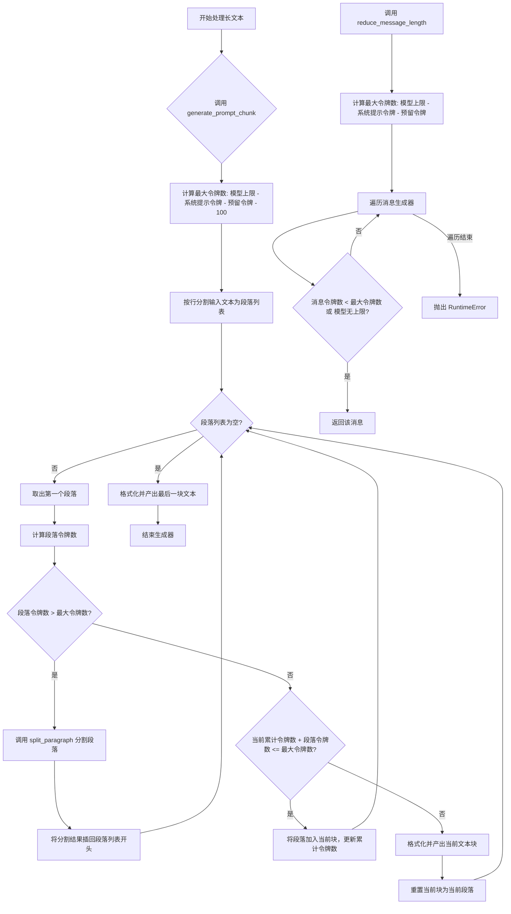
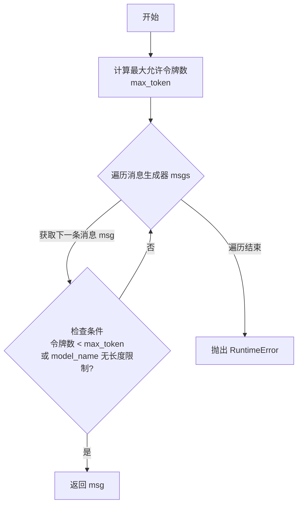
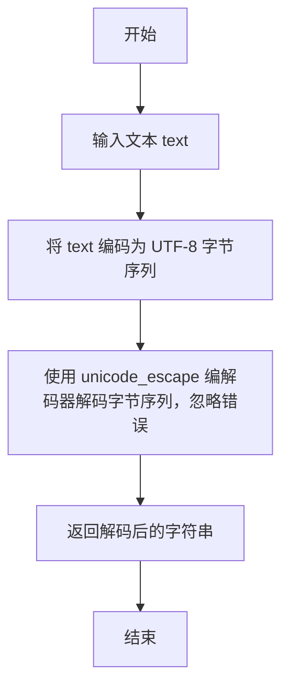
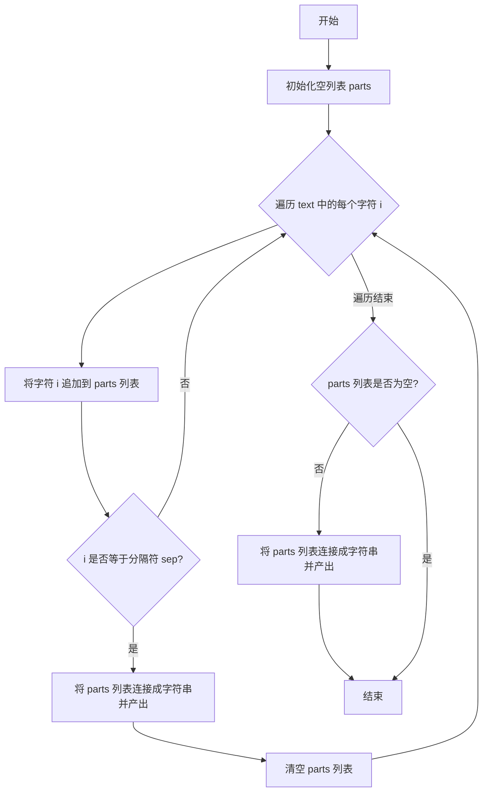

# `.\MetaGPT\metagpt\utils\text.py` 详细设计文档

该代码文件提供了一套用于处理长文本以适应大语言模型（LLM）上下文窗口限制的工具。核心功能包括：通过迭代生成器逐步缩短消息长度以符合最大令牌限制；将长文本按段落和句子智能分割成符合令牌限制的文本块；以及辅助的文本分割和Unicode解码功能。这些功能旨在解决LLM应用中的上下文长度约束问题。

## 整体流程



## 类结构

```
text_processing.py
├── 全局函数
│   ├── reduce_message_length
│   ├── generate_prompt_chunk
│   ├── split_paragraph
│   └── decode_unicode_escape
└── 私有函数
    ├── _split_by_count
    └── _split_text_with_ends
```

## 全局变量及字段


    

## 全局函数及方法


### `reduce_message_length`

该函数用于从消息生成器中选取第一个满足最大令牌长度限制的消息字符串。它通过迭代生成器，计算每条消息的令牌数，并与动态计算出的最大允许令牌数进行比较，直到找到符合条件的消息或遍历完所有消息。

参数：

-  `msgs`：`Generator[str, None, None]`，一个字符串生成器，按顺序产生逐步缩短的有效提示消息。
-  `model_name`：`str`，使用的编码模型名称（例如 "gpt-3.5-turbo"），用于确定令牌计数方式和最大上下文长度。
-  `system_text`：`str`，系统提示文本，其令牌数将从总限制中扣除。
-  `reserved`：`int`，默认值为0，需要预留的额外令牌数。

返回值：`str`，返回第一个令牌数小于或等于最大允许令牌数的消息字符串。如果遍历完所有消息仍未找到，则抛出异常。

#### 流程图



#### 带注释源码

```python
def reduce_message_length(
    msgs: Generator[str, None, None],
    model_name: str,
    system_text: str,
    reserved: int = 0,
) -> str:
    """Reduce the length of concatenated message segments to fit within the maximum token size.

    Args:
        msgs: A generator of strings representing progressively shorter valid prompts.
        model_name: The name of the encoding to use. (e.g., "gpt-3.5-turbo")
        system_text: The system prompts.
        reserved: The number of reserved tokens.

    Returns:
        The concatenated message segments reduced to fit within the maximum token size.

    Raises:
        RuntimeError: If it fails to reduce the concatenated message length.
    """
    # 计算当前模型的最大允许令牌数：从预设最大值中减去系统提示和预留的令牌数
    max_token = TOKEN_MAX.get(model_name, 2048) - count_output_tokens(system_text, model_name) - reserved
    # 遍历消息生成器
    for msg in msgs:
        # 如果当前消息的令牌数小于最大允许值，或者当前模型没有预设的最大令牌限制，则返回该消息
        if count_output_tokens(msg, model_name) < max_token or model_name not in TOKEN_MAX:
            return msg

    # 如果遍历完所有消息仍未找到符合条件的，抛出运行时错误
    raise RuntimeError("fail to reduce message length")
```


### `generate_prompt_chunk`

该函数用于将长文本分割成符合指定模型最大令牌限制的文本块。它通过按行分割文本，并动态计算当前块的总令牌数，确保每个生成的文本块在添加了提示模板和系统文本后，其总令牌数不超过模型的最大限制减去预留令牌数。当单个段落过长时，会进一步拆分该段落。

参数：

- `text`：`str`，需要被分割的原始长文本。
- `prompt_template`：`str`，提示模板字符串，其中包含一个 `{}` 占位符，用于插入文本块。例如：`"### Reference\n{}"`。
- `model_name`：`str`，使用的模型名称（例如 `"gpt-3.5-turbo"`），用于确定令牌计数方式和最大上下文长度。
- `system_text`：`str`，系统提示文本，将和提示模板一起计入预留令牌。
- `reserved`：`int`，默认值为 `0`，额外预留的令牌数，用于除提示模板和系统文本外的其他开销。

返回值：`Generator[str, None, None]`，一个生成器，每次迭代产生一个符合令牌限制的、已应用提示模板格式化的文本块。

#### 流程图

```mermaid
graph TD
    A[开始: generate_prompt_chunk] --> B[按行分割文本为段落列表]
    B --> C[计算预留令牌数: reserved + token_count(prompt_template + system_text)]
    C --> D[计算最大块令牌数: TOKEN_MAX - reserved - 100]
    D --> E{段落列表为空?}
    E -- 是 --> F{当前行列表有内容?}
    F -- 是 --> G[用提示模板格式化并产出当前块]
    F -- 否 --> H[结束]
    G --> H
    E -- 否 --> I[取出第一个段落]
    I --> J[计算该段落的令牌数]
    J --> K{当前令牌数 + 段落令牌数 <= 最大块令牌数?}
    K -- 是 --> L[将段落加入当前行列表， 更新当前令牌数]
    L --> E
    K -- 否 --> M{段落令牌数 > 最大块令牌数?}
    M -- 是 --> N[调用 split_paragraph 拆分段落]
    N --> O[将拆分结果放回段落列表开头]
    O --> E
    M -- 否 --> P[用提示模板格式化并产出当前块]
    P --> Q[重置当前行列表为当前段落， 重置当前令牌数为段落令牌数]
    Q --> E
```

#### 带注释源码

```python
def generate_prompt_chunk(
    text: str,
    prompt_template: str,
    model_name: str,
    system_text: str,
    reserved: int = 0,
) -> Generator[str, None, None]:
    """Split the text into chunks of a maximum token size.

    Args:
        text: The text to split.
        prompt_template: The template for the prompt, containing a single `{}` placeholder. For example, "### Reference\n{}".
        model_name: The name of the encoding to use. (e.g., "gpt-3.5-turbo")
        system_text: The system prompts.
        reserved: The number of reserved tokens.

    Yields:
        The chunk of text.
    """
    # 1. 将输入文本按行分割，保留行结束符，得到一个段落列表。
    paragraphs = text.splitlines(keepends=True)
    # 2. 初始化当前块的令牌计数和行内容列表。
    current_token = 0
    current_lines = []

    # 3. 计算总预留令牌数：用户指定的预留数 + 提示模板和系统文本的令牌数。
    reserved = reserved + count_output_tokens(prompt_template + system_text, model_name)
    # 4. 计算每个文本块允许的最大令牌数。
    #    TOKEN_MAX.get(model_name, 2048): 获取模型的最大上下文令牌数，默认2048。
    #    - reserved: 减去总预留令牌。
    #    - 100: 一个“魔法数字”，作为安全缓冲，确保不超出限制。
    max_token = TOKEN_MAX.get(model_name, 2048) - reserved - 100

    # 5. 主循环：处理段落列表中的每一个段落。
    while paragraphs:
        # 5.1 从列表头部取出一个段落。
        paragraph = paragraphs.pop(0)
        # 5.2 计算该段落的令牌数。
        token = count_output_tokens(paragraph, model_name)

        # 5.3 情况A：如果当前块加入该段落后不超过最大令牌限制。
        if current_token + token <= max_token:
            current_lines.append(paragraph)  # 将段落加入当前块。
            current_token += token           # 更新当前块令牌计数。
        # 5.4 情况B：如果该段落本身的令牌数就超过了单个块的最大限制。
        elif token > max_token:
            # 调用 split_paragraph 函数将长段落拆分成更小的部分。
            paragraphs = split_paragraph(paragraph) + paragraphs
            # 将拆分结果放回段落列表的开头，以便下一次循环处理。
            continue
        # 5.5 情况C：当前块已满（加入该段落会超限），且该段落本身不超限。
        else:
            # 5.5.1 将当前已收集的行用提示模板格式化，并通过 yield 产出。
            yield prompt_template.format("".join(current_lines))
            # 5.5.2 开始一个新的文本块，以当前段落作为起始内容。
            current_lines = [paragraph]
            current_token = token

    # 6. 循环结束后，检查是否还有未产出的内容。
    if current_lines:
        # 将最后剩余的文本块格式化并产出。
        yield prompt_template.format("".join(current_lines))
```


### `split_paragraph`

该函数用于将一个段落（字符串）分割成多个部分。它首先尝试使用指定的分隔符（如句号、逗号）将段落分割成句子，然后根据指定的数量将这些句子重新分组。如果无法用分隔符有效分割，则直接按字符将段落均匀分割成指定数量的部分。

参数：

-  `paragraph`：`str`，需要被分割的段落文本。
-  `sep`：`str`，用于尝试分割段落的分隔符序列，默认为`“.,”`。
-  `count`：`int`，期望将段落分割成的部分数量，默认为`2`。

返回值：`list[str]`，一个包含分割后各部分字符串的列表。

#### 流程图

```mermaid
flowchart TD
    A[开始: split_paragraph(paragraph, sep, count)] --> B{遍历分隔符 sep 中的每个字符 i};
    B --> C[使用字符 i 调用 _split_text_with_ends<br>将 paragraph 分割成句子列表 sentences];
    C --> D{判断 sentences 长度 <= 1?};
    D -- 是 --> B;
    D -- 否 --> E[调用 _split_by_count(sentences, count)<br>将句子列表按数量 count 分组];
    E --> F[将每个分组内的句子连接成字符串，<br>形成结果列表 ret];
    F --> G[返回结果列表 ret];
    B -- 所有分隔符尝试完毕 --> H[调用 _split_by_count(paragraph, count)<br>直接按字符将段落均匀分割];
    H --> I[将结果转换为列表并返回];
```

#### 带注释源码

```python
def split_paragraph(paragraph: str, sep: str = ".,", count: int = 2) -> list[str]:
    """Split a paragraph into multiple parts.

    Args:
        paragraph: The paragraph to split.
        sep: The separator character.
        count: The number of parts to split the paragraph into.

    Returns:
        A list of split parts of the paragraph.
    """
    # 遍历提供的分隔符序列（如“.,”）
    for i in sep:
        # 尝试用当前分隔符 i 将段落分割成句子列表
        sentences = list(_split_text_with_ends(paragraph, i))
        # 如果分割后的句子数不超过1，说明此分隔符无效，尝试下一个
        if len(sentences) <= 1:
            continue
        # 使用 _split_by_count 将句子列表按指定数量 count 分组
        # 然后将每个分组内的句子连接成一个字符串，形成最终的结果列表
        ret = ["".join(j) for j in _split_by_count(sentences, count)]
        return ret
    # 如果所有分隔符都尝试失败，则直接按字符将段落均匀分割成 count 份
    return list(_split_by_count(paragraph, count))
```


### `decode_unicode_escape`

该函数用于解码包含Unicode转义序列的文本。它将输入的字符串先编码为UTF-8字节序列，然后使用`unicode_escape`编解码器进行解码，忽略解码过程中可能出现的错误。

参数：

- `text`：`str`，需要解码的文本字符串。

返回值：`str`，解码后的文本字符串。

#### 流程图



#### 带注释源码

```python
def decode_unicode_escape(text: str) -> str:
    """Decode a text with unicode escape sequences.

    Args:
        text: The text to decode.

    Returns:
        The decoded text.
    """
    # 将输入的字符串 text 编码为 UTF-8 格式的字节序列。
    # 然后使用 'unicode_escape' 编解码器对该字节序列进行解码。
    # 'ignore' 参数表示在解码过程中忽略任何无法识别的转义序列或错误。
    return text.encode("utf-8").decode("unicode_escape", "ignore")
```

### `_split_by_count`

将给定的序列按指定份数尽可能均匀地分割成多个子序列。

参数：

- `lst`：`Sequence`，需要分割的序列
- `count`：`int`，需要分割成的份数

返回值：`Generator`，一个生成器，按顺序生成分割后的子序列

#### 流程图

```mermaid
flowchart TD
    A[开始] --> B[计算平均长度avg和余数remainder]
    B --> C[初始化起始索引start=0]
    C --> D[循环i从0到count-1]
    D --> E[计算结束索引end<br/>end = start + avg + (1 if i < remainder else 0)]
    E --> F[生成子序列lst[start:end]]
    F --> G[更新起始索引start = end]
    G --> H{i < count-1?}
    H -- 是 --> D
    H -- 否 --> I[结束]
```

#### 带注释源码

```python
def _split_by_count(lst: Sequence, count: int):
    # 计算每份的平均长度和余数
    avg = len(lst) // count
    remainder = len(lst) % count
    start = 0  # 当前子序列的起始索引
    for i in range(count):
        # 计算当前子序列的结束索引
        # 前remainder个子序列会多分配一个元素
        end = start + avg + (1 if i < remainder else 0)
        # 生成当前子序列
        yield lst[start:end]
        # 更新起始索引为下一个子序列的开始
        start = end
```

### `_split_text_with_ends`

该函数是一个生成器，用于将给定的文本按指定的分隔符进行分割，并保留分隔符在分割后的每个部分中。它逐个字符遍历文本，当遇到分隔符时，将当前累积的字符（包括该分隔符）作为一个完整的部分产出，然后清空累积列表以开始下一个部分。遍历结束后，如果还有剩余的字符，也将它们作为最后一个部分产出。

参数：

- `text`：`str`，需要被分割的原始文本。
- `sep`：`str`，用于分割文本的分隔符，默认为 `"."`。

返回值：`Generator[str, None, None]`，一个生成器，每次迭代返回一个包含分隔符的文本片段。

#### 流程图



#### 带注释源码

```python
def _split_text_with_ends(text: str, sep: str = "."):
    # 初始化一个空列表，用于临时存储当前正在累积的字符
    parts = []
    # 遍历输入文本中的每一个字符
    for i in text:
        # 将当前字符添加到累积列表中
        parts.append(i)
        # 检查当前字符是否等于指定的分隔符
        if i == sep:
            # 如果是分隔符，则将当前累积的所有字符连接成一个字符串
            # 并通过 yield 语句作为生成器的一个值返回
            yield "".join(parts)
            # 清空累积列表，为下一个文本片段的累积做准备
            parts = []
    # 循环结束后，检查累积列表中是否还有剩余的字符
    # （例如，文本末尾没有分隔符的情况）
    if parts:
        # 如果有剩余字符，将它们连接成一个字符串并作为最后一个片段产出
        yield "".join(parts)
```

## 关键组件


### 消息长度缩减器

根据模型的最大令牌限制，从一系列逐步缩短的消息生成器中，选择第一个满足令牌长度限制的消息，用于确保最终提示不会超出模型上下文窗口。

### 提示分块生成器

将长文本按段落拆分为多个令牌块，每个块都嵌入到指定的提示模板中，以确保每个块在考虑系统提示和预留令牌后，都能适配模型的最大上下文长度。

### 段落分割器

当单个段落过长，超过单个块的最大令牌限制时，使用指定的分隔符（如句号、逗号）将段落分割成更小的部分，以便重新进行分块处理。

### Unicode转义解码器

将包含Unicode转义序列（如`\uXXXX`）的文本字符串解码为对应的Unicode字符，用于处理可能包含此类转义序列的输入文本。

### 通用列表分割器

将一个序列（如列表或字符串）尽可能均匀地分割成指定数量的子序列，用于在无法按语义分隔符分割时，对过长段落进行强制分割。


## 问题及建议


### 已知问题

-   **硬编码的“魔法数字”**: `generate_prompt_chunk` 函数中使用了硬编码的 `100` 作为安全余量，以确保不超过最大上下文长度。这个数字缺乏明确的解释，其合理性依赖于特定的模型和上下文，使得代码难以维护和理解，且在不同模型或场景下可能不适用。
-   **潜在的无限递归风险**: `generate_prompt_chunk` 函数中，当遇到一个段落（`paragraph`）的令牌数超过 `max_token` 时，会调用 `split_paragraph` 将其分割，并将分割后的部分重新放回 `paragraphs` 列表的开头。如果 `split_paragraph` 未能有效分割（例如，对于没有分隔符的超长单词或字符串），或者分割后的部分仍然超过 `max_token`，此逻辑可能导致无限循环或递归。
-   **`split_paragraph` 函数的分隔符逻辑可能不直观**: 该函数按顺序尝试 `sep` 参数中的分隔符（默认为 `“.,”`），并使用第一个能成功分割的分隔符。这意味着分割结果可能依赖于分隔符的顺序，而非最合适的语义边界（如句子结束符 `.` 应优先于逗号 `,`）。当前实现在某些情况下可能产生不符合预期的分割。
-   **`decode_unicode_escape` 函数存在潜在数据丢失**: 该函数使用 `decode(“unicode_escape”, “ignore”)`。`“ignore”` 错误处理策略会静默忽略解码错误，可能导致原始文本中的部分信息丢失，而调用者可能无法察觉。
-   **`reduce_message_length` 的异常条件可能不精确**: 当 `model_name not in TOKEN_MAX` 时，函数会直接返回当前消息 `msg`，而不检查其令牌长度。虽然这避免了因未知模型名而失败，但也意味着对未知模型完全失去了长度控制，可能引发下游问题。

### 优化建议

-   **将“魔法数字”参数化或提供明确注释**: 将 `generate_prompt_chunk` 中的 `100` 这个安全余量定义为一个有名称的常量（如 `SAFETY_TOKEN_MARGIN`）或使其成为可配置参数。同时，在常量定义或函数文档字符串中明确说明其用途和设定依据。
-   **增强 `split_paragraph` 的鲁棒性并改进分割策略**:
    1.  在 `split_paragraph` 中增加一个递归深度或循环次数的保护机制，防止因无法有效分割超长内容导致的无限循环。
    2.  重新评估分隔符的优先级，优先使用更符合语义边界的符号（如句子结束符），或允许调用者指定一个分隔符优先级列表。
    3.  考虑引入更智能的回退分割机制，例如当所有分隔符都无效时，按字符或固定长度进行分割，并记录警告日志。
-   **改进 `decode_unicode_escape` 的错误处理**: 将错误处理策略从 `“ignore”` 改为 `“replace”`（用替换字符标记错误位置）或 `“strict”`（抛出异常），以便调用者能意识到解码问题并做出相应处理。或者，提供一个参数让调用者选择错误处理方式。
-   **为未知模型名定义默认行为**: 在 `reduce_message_length` 和 `generate_prompt_chunk` 中，当 `model_name not in TOKEN_MAX` 时，除了使用默认值 `2048`，可以记录一个警告日志，提示用户该模型名未在配置中定义，正在使用保守的默认值。同时，考虑是否应该对未知模型的令牌长度施加一个更保守的限制。
-   **增加日志记录**: 在关键决策点（如开始分割、遇到超长段落、使用回退分割、为未知模型使用默认值等）添加适当的日志记录（使用 `logging` 模块），有助于调试和监控函数的行为。
-   **考虑性能优化**: `count_output_tokens` 函数可能被频繁调用（在循环中）。如果此函数开销较大，可以考虑对已计算过的文本进行缓存，或者优化 `generate_prompt_chunk` 的算法以减少其调用次数。


## 其它


### 设计目标与约束

本模块的核心设计目标是在大语言模型（LLM）的上下文窗口（Token 限制）约束下，智能地处理长文本。主要约束包括：1) 必须严格遵守不同模型（如 `gpt-3.5-turbo`）的 Token 上限（`TOKEN_MAX`）。2) 在分割文本时，需保留提示模板（`prompt_template`）和系统提示（`system_text`）的结构完整性。3) 分割过程应尽可能保持语义连贯性，优先在段落、句子等自然边界处进行分割。4) 需要处理极端情况，如单个段落或句子长度超过最大限制，此时需进行强制分割。

### 错误处理与异常设计

模块的异常处理主要集中于 `reduce_message_length` 函数。当传入的消息生成器（`msgs`）无法产生一个满足 Token 限制的消息时，该函数会抛出 `RuntimeError("fail to reduce message length")`。这是一种“快速失败”的设计，旨在让调用方明确知晓处理失败，而非返回一个可能无效的、超长的消息。其他函数（如 `generate_prompt_chunk`, `split_paragraph`）主要进行流程控制，通过循环和条件判断处理边界情况，不主动抛出业务异常，但依赖输入参数的合法性。

### 数据流与状态机

1.  **`generate_prompt_chunk` 数据流**：输入原始文本、模板等参数 -> 按行分割为段落列表 -> 循环处理每个段落，累加 Token 数 -> 根据当前累计 Token 数与 `max_token` 的比较决定是追加到当前块、对过长段落递归分割、还是产出当前块并开始新块 -> 最终产出符合 Token 限制的、套用了模板的文本块生成器。
2.  **`reduce_message_length` 状态机**：函数接收一个生成器 `msgs`，该生成器应产生一系列从长到短的有效提示。函数状态简单：遍历生成器，找到第一个满足 Token 限制（`< max_token`）的消息则立即返回并终止；若遍历完所有消息仍未找到，则进入错误状态并抛出异常。
3.  **`split_paragraph` 分割策略**：状态为尝试按不同分隔符（如句号、逗号）分割句子；若成功分割为多个句子，则将这些句子均匀分组；若所有分隔符尝试失败，则回退到将段落字符均匀分割。

### 外部依赖与接口契约

1.  **外部依赖**：
    *   `metagpt.utils.token_counter` 模块：核心依赖 `TOKEN_MAX` 字典和 `count_output_tokens` 函数。前者提供不同模型的 Token 上限，后者是计算文本 Token 数的唯一方法。任何对这两个依赖项的修改都会直接影响本模块的功能。
    *   `typing` 模块：用于类型注解（`Generator`, `Sequence`），提高代码可读性和可维护性。
2.  **接口契约**：
    *   `reduce_message_length` 的 `msgs` 参数：调用方必须提供一个生成器，该生成器产生的字符串序列应是语义上等效但长度递减的（例如，通过逐步摘要或截断产生）。这是函数能正确工作的隐含前提。
    *   `generate_prompt_chunk` 的 `prompt_template` 参数：模板字符串必须且仅包含一个 `{}` 占位符，用于插入文本块。模块不验证此契约，违反会导致格式化错误或输出不符合预期。
    *   `TOKEN_MAX` 字典：被视为一个全局配置契约。如果传入的 `model_name` 不在字典中，模块将使用默认值 2048。这要求调用方知晓所使用的模型是否已被支持。

### 关键算法与逻辑

1.  **自适应分块算法** (`generate_prompt_chunk`)：算法采用贪心策略，按行（段落）累加 Token 数。其核心逻辑在于处理“当前段落过长”的两种情况：a) 段落 Token 数超过 `max_token`，则调用 `split_paragraph` 将其拆分成更小的部分，并放回队列头部重新处理。b) 加入当前段落会导致当前块超限，则先产出已积累的当前块，再以该段落开始一个新块。这确保了每个产出块都尽可能大但不超限，并在语义边界（段落、句子）处进行分割。
2.  **递归分割与回退机制** (`split_paragraph`)：该函数体现了从语义分割到机械分割的降级策略。首先尝试按标点（`.`， `,`）将段落拆分成句子列表。如果成功（句子数>1），则调用 `_split_by_count` 将句子列表尽可能均匀地分成 `count` 份。如果所有分隔符都无法拆分（如段落无标点），则回退到直接使用 `_split_by_count` 将字符串均匀分割。`_split_by_count` 保证了分割的均匀性，避免产生大小悬殊的片段。
3.  **Token 预算管理**：在 `reduce_message_length` 和 `generate_prompt_chunk` 中，`max_token` 的计算都扣除了系统提示、预留空间（`reserved`）以及 `generate_prompt_chunk` 中额外的“魔法数字”100。这体现了保守的预算管理策略，为模型输出和其他未计入的 Token 留出余量，防止因计算误差导致实际调用时超限。

### 配置与魔法数字

1.  **魔法数字**：
    *   `100` (位于 `generate_prompt_chunk`): 这是一个安全余量（Safety Margin），用于补偿 `count_output_tokens` 函数可能存在的计算误差、模板格式化后可能增加的 Token 数、或为模型输出预留的额外空间。这是一个经验值，缺乏明确解释，构成了潜在的技术债务。
    *   `2` (作为 `split_paragraph` 的 `count` 参数默认值): 当段落过长时，默认将其拆分为 2 部分。这个选择是任意的，可能不是所有情况下的最优解。
2.  **配置项**：
    *   `TOKEN_MAX` 字典：这是一个关键的外部配置，其完整性直接决定了模块对不同模型的支持程度。当前代码逻辑中，未在字典中找到的模型会使用硬编码的默认值 `2048`。
    *   分隔符 `sep` (`".，"`): 在 `split_paragraph` 中定义了默认的句子分割符序列。这个序列针对中英文混合文本设计，但可能不适用于其他语言或特殊领域文本。

### 扩展性与维护性

1.  **扩展性**：
    *   支持新模型：只需在外部 `TOKEN_MAX` 字典中添加新的 `model_name: token_limit` 键值对，模块即可自动支持。
    *   自定义分割策略：`split_paragraph` 函数的 `sep` 和 `count` 参数允许调用方根据文本特性调整分割逻辑，提供了一定的灵活性。
    *   生成器接口：`generate_prompt_chunk` 和 `reduce_message_length` 使用生成器，支持流式处理和惰性计算，适合处理非常大的文本。
2.  **维护性**：
    *   清晰的函数分工：每个函数职责单一（如分块、减短、分割段落），降低了耦合度。
    *   存在改进空间：如“魔法数字” 100 和默认分割份数 2 可以参数化或提供更科学的计算方式。`decode_unicode_escape` 函数在本代码片段中未被调用，如果是死代码应考虑移除。

    