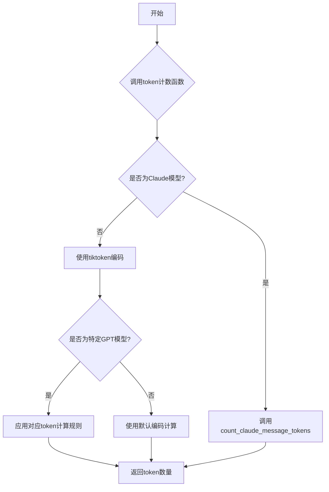
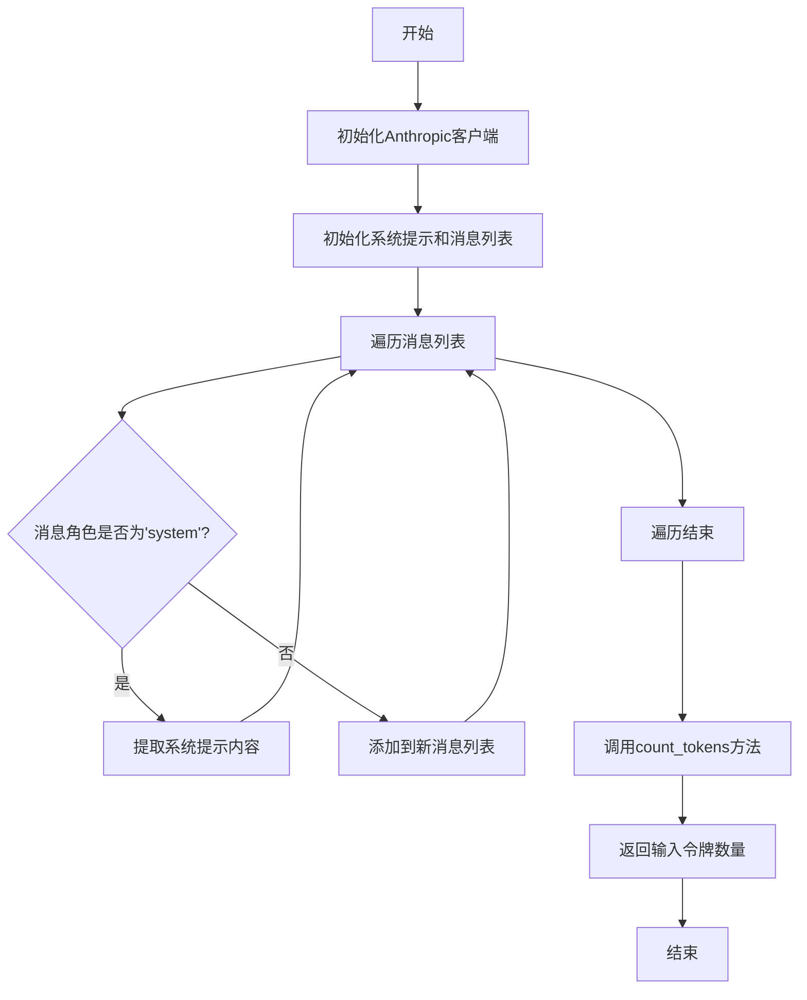
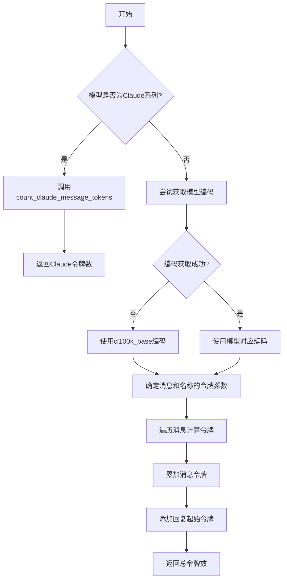
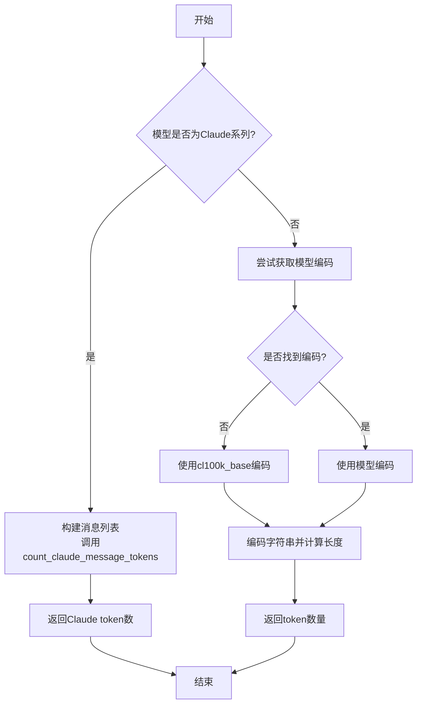

# `.\MetaGPT\metagpt\utils\token_counter.py` 详细设计文档

该代码文件是一个用于计算和管理不同大语言模型（LLM）token使用量和成本的工具库。它主要提供以下功能：1）统计给定消息列表在不同模型下的token数量；2）计算模型输出的token数量；3）根据模型和token数量估算成本；4）提供各种主流LLM模型的token价格和最大上下文长度配置。该库支持OpenAI、Anthropic、Google、百度、阿里、火山引擎等数十种模型，是LLM应用开发中成本控制和资源管理的重要组件。

## 整体流程



## 类结构

```
token_counter.py
├── 全局配置字典
│   ├── TOKEN_COSTS (通用模型价格)
│   ├── QIANFAN_MODEL_TOKEN_COSTS (百度千帆模型价格)
│   ├── QIANFAN_ENDPOINT_TOKEN_COSTS (百度千帆端点价格)
│   ├── DASHSCOPE_TOKEN_COSTS (阿里通义千问价格)
│   ├── FIREWORKS_GRADE_TOKEN_COSTS (Fireworks模型价格)
│   ├── DOUBAO_TOKEN_COSTS (火山引擎豆包价格)
│   ├── TOKEN_MAX (模型最大token数)
│   ├── BEDROCK_TOKEN_COSTS (AWS Bedrock价格)
│   └── SPARK_TOKENS (讯飞星火价格)
├── 全局函数
│   ├── count_claude_message_tokens
│   ├── count_message_tokens
│   ├── count_output_tokens
│   └── get_max_completion_tokens
```

## 全局变量及字段


### `TOKEN_COSTS`
    
存储主流大语言模型（如OpenAI、Anthropic、Google等）的每千token定价，包含prompt和completion两部分费用。

类型：`Dict[str, Dict[str, float]]`
    


### `QIANFAN_MODEL_TOKEN_COSTS`
    
存储百度千帆平台各模型（如ERNIE系列）的每千token定价，基于‘Tokens后付费’策略统一统计。

类型：`Dict[str, Dict[str, float]]`
    


### `QIANFAN_ENDPOINT_TOKEN_COSTS`
    
存储百度千帆平台各API端点（Endpoint）对应的每千token定价，映射到具体的模型定价。

类型：`Dict[str, Dict[str, float]]`
    


### `DASHSCOPE_TOKEN_COSTS`
    
存储阿里云灵积平台（DashScope）各模型（如Qwen系列）的每千token定价。

类型：`Dict[str, Dict[str, float]]`
    


### `FIREWORKS_GRADE_TOKEN_COSTS`
    
存储Fireworks AI平台基于模型规模分级的每百万token定价（单位为美元）。

类型：`Dict[str, Dict[str, float]]`
    


### `DOUBAO_TOKEN_COSTS`
    
存储火山引擎方舟平台（Ark）豆包系列模型的每千token定价。

类型：`Dict[str, Dict[str, float]]`
    


### `TOKEN_MAX`
    
存储各模型支持的最大上下文长度（以token数计），用于计算剩余可用的completion token数量。

类型：`Dict[str, int]`
    


### `BEDROCK_TOKEN_COSTS`
    
存储亚马逊Bedrock平台（美国区域）各模型（如Claude、Llama等）的每千token定价。

类型：`Dict[str, Dict[str, float]]`
    


### `SPARK_TOKENS`
    
存储讯飞星火认知大模型（Spark API）各版本（如generalv3）的每千token定价。

类型：`Dict[str, Dict[str, float]]`
    


    

## 全局函数及方法

### `count_claude_message_tokens`

该函数用于估算Claude模型消息列表的输入令牌数量。它通过调用Anthropic官方客户端的`count_tokens`方法，将消息列表（区分系统提示和普通消息）转换为模型可处理的令牌数，并返回输入令牌的数量。

参数：

- `messages`：`list[dict]`，包含消息的列表，每个消息是一个字典，通常包含`role`和`content`字段。
- `model`：`str`，指定使用的Claude模型名称。

返回值：`int`，返回输入令牌的数量。

#### 流程图



#### 带注释源码

```python
def count_claude_message_tokens(messages: list[dict], model: str) -> int:
    # rough estimation for models newer than claude-2.1, needs api_key or auth_token
    ac = anthropic.Client()  # 初始化Anthropic客户端
    system_prompt = ""  # 初始化系统提示为空字符串
    new_messages = []  # 初始化新消息列表
    for msg in messages:  # 遍历输入的消息列表
        if msg.get("role") == "system":  # 如果消息角色是'system'
            system_prompt = msg.get("content")  # 提取系统提示内容
        else:
            new_messages.append(msg)  # 否则将消息添加到新消息列表
    # 调用Anthropic客户端的count_tokens方法，计算令牌数量
    num_tokens = ac.beta.messages.count_tokens(messages=new_messages, model=model, system=system_prompt)
    return num_tokens.input_tokens  # 返回输入令牌的数量
```

### `count_message_tokens`

该函数用于计算给定消息列表在指定语言模型下的令牌（Token）数量。它首先检查模型是否为Claude系列，如果是，则调用专用的Claude令牌计数函数；否则，使用`tiktoken`库根据模型类型和消息格式计算令牌数。函数支持多种GPT模型变体，并针对不同模型的消息格式（如角色、内容、名称）应用不同的令牌计算规则。

参数：

- `messages`：`list[dict]`，包含消息的列表，每个消息是一个字典，通常包含`role`（角色）和`content`（内容）等键。
- `model`：`str`，模型名称，用于确定令牌计算规则和编码方式。

返回值：`int`，消息列表的总令牌数。

#### 流程图



#### 带注释源码

```python
def count_message_tokens(messages, model="gpt-3.5-turbo-0125"):
    """Return the number of tokens used by a list of messages."""
    # 1. 检查是否为Claude模型，是则调用专用函数
    if "claude" in model:
        num_tokens = count_claude_message_tokens(messages, model)
        return num_tokens
    # 2. 尝试获取模型的编码器
    try:
        encoding = tiktoken.encoding_for_model(model)
    except KeyError:
        # 如果模型未找到，使用cl100k_base编码并记录警告
        logger.info(f"Warning: model {model} not found in tiktoken. Using cl100k_base encoding.")
        encoding = tiktoken.get_encoding("cl100k_base")
    # 3. 根据模型类型设置消息和名称的令牌系数
    if model in {
        "gpt-3.5-turbo-0613",
        "gpt-3.5-turbo-16k-0613",
        "gpt-35-turbo",
        "gpt-35-turbo-16k",
        "gpt-3.5-turbo-16k",
        "gpt-3.5-turbo-1106",
        "gpt-3.5-turbo-0125",
        "gpt-4-0314",
        "gpt-4-32k-0314",
        "gpt-4-0613",
        "gpt-4-32k-0613",
        "gpt-4-turbo",
        "gpt-4-turbo-preview",
        "gpt-4-0125-preview",
        "gpt-4-1106-preview",
        "gpt-4-turbo",
        "gpt-4-vision-preview",
        "gpt-4-1106-vision-preview",
        "gpt-4o",
        "gpt-4o-2024-05-13",
        "gpt-4o-2024-08-06",
        "gpt-4o-mini",
        "gpt-4o-mini-2024-07-18",
        "o1-preview",
        "o1-preview-2024-09-12",
        "o1-mini",
        "o1-mini-2024-09-12",
    }:
        tokens_per_message = 3  # 每条消息的固定令牌开销
        tokens_per_name = 1     # 名称字段的令牌开销
    elif model == "gpt-3.5-turbo-0301":
        tokens_per_message = 4
        tokens_per_name = -1    # 如果有名称，则角色令牌被省略
    elif "gpt-3.5-turbo" == model:
        # 对于通用模型名，递归调用指定具体版本
        logger.info("Warning: gpt-3.5-turbo may update over time. Returning num tokens assuming gpt-3.5-turbo-0125.")
        return count_message_tokens(messages, model="gpt-3.5-turbo-0125")
    elif "gpt-4" == model:
        logger.info("Warning: gpt-4 may update over time. Returning num tokens assuming gpt-4-0613.")
        return count_message_tokens(messages, model="gpt-4-0613")
    elif "open-llm-model" == model:
        # 对于自托管模型，简化计算（仅供参考）
        tokens_per_message = 0
        tokens_per_name = 0
    else:
        # 不支持的模型抛出异常
        raise NotImplementedError(
            f"num_tokens_from_messages() is not implemented for model {model}. "
            f"See https://cookbook.openai.com/examples/how_to_count_tokens_with_tiktoken "
            f"for information on how messages are converted to tokens."
        )
    # 4. 遍历消息列表计算总令牌数
    num_tokens = 0
    for message in messages:
        num_tokens += tokens_per_message  # 添加每条消息的固定开销
        for key, value in message.items():
            content = value
            # 处理GPT-4V等多模态内容（列表形式）
            if isinstance(value, list):
                for item in value:
                    if isinstance(item, dict) and item.get("type") in ["text"]:
                        content = item.get("text", "")
            # 编码内容并累加令牌数
            num_tokens += len(encoding.encode(content))
            if key == "name":
                num_tokens += tokens_per_name  # 添加名称令牌开销
    num_tokens += 3  # 添加回复起始的固定令牌开销
    return num_tokens
```

### `count_output_tokens`

该函数用于计算给定文本字符串在指定模型下的token数量。它首先检查模型是否为Claude系列，如果是则通过Claude API计算token数；否则使用tiktoken库进行编码并统计token数量。

参数：

- `string`：`str`，需要计算token数量的文本字符串
- `model`：`str`，模型名称，用于确定使用哪种编码方式

返回值：`int`，文本字符串的token数量

#### 流程图



#### 带注释源码

```python
def count_output_tokens(string: str, model: str) -> int:
    """
    Returns the number of tokens in a text string.

    Args:
        string (str): The text string.
        model (str): The name of the encoding to use. (e.g., "gpt-3.5-turbo")

    Returns:
        int: The number of tokens in the text string.
    """
    # 检查是否为Claude系列模型
    if "claude" in model:
        # 构建消息列表，调用Claude专用的token计数函数
        messages = [{"role": "assistant", "content": string}]
        num_tokens = count_claude_message_tokens(messages, model)
        return num_tokens
    
    try:
        # 尝试获取指定模型的编码器
        encoding = tiktoken.encoding_for_model(model)
    except KeyError:
        # 如果模型不在tiktoken支持列表中，使用cl100k_base编码并记录警告
        logger.info(f"Warning: model {model} not found in tiktoken. Using cl100k_base encoding.")
        encoding = tiktoken.get_encoding("cl100k_base")
    
    # 使用编码器对字符串进行编码并返回token数量
    return len(encoding.encode(string))
```

### `get_max_completion_tokens`

该函数用于计算给定模型和消息列表下，可用的最大补全（Completion）令牌数量。它通过查询模型的令牌上限（`TOKEN_MAX`），减去已使用的消息令牌数，并预留一个令牌的余量，来得出结果。如果模型不在预定义的令牌上限字典中，则返回一个默认值。

参数：
- `messages`：`list[dict]`，一个包含消息的列表，每个消息是一个字典，通常包含`role`和`content`等键。
- `model`：`str`，模型名称，用于查找对应的令牌上限。
- `default`：`int`，当模型不在`TOKEN_MAX`字典中时返回的默认值。

返回值：`int`，计算出的最大补全令牌数。

#### 流程图

```mermaid
flowchart TD
    A[开始] --> B{模型在<br>TOKEN_MAX中?}
    B -- 是 --> C[计算消息令牌数]
    C --> D[计算最大补全令牌数<br>TOKEN_MAX[model] - 消息令牌数 - 1]
    D --> E[返回计算结果]
    B -- 否 --> F[返回默认值 default]
    E --> G[结束]
    F --> G
```

#### 带注释源码

```python
def get_max_completion_tokens(messages: list[dict], model: str, default: int) -> int:
    """Calculate the maximum number of completion tokens for a given model and list of messages.

    Args:
        messages: A list of messages.
        model: The model name.

    Returns:
        The maximum number of completion tokens.
    """
    # 检查模型是否在预定义的令牌上限字典中
    if model not in TOKEN_MAX:
        # 如果不在，返回调用者提供的默认值
        return default
    # 如果在，则计算：
    # 1. 模型的总令牌上限（TOKEN_MAX[model]）
    # 2. 减去当前消息列表占用的令牌数（count_message_tokens）
    # 3. 再减去1作为安全余量，返回结果
    return TOKEN_MAX[model] - count_message_tokens(messages, model) - 1
```

## 关键组件

### 模型成本与令牌限制字典

定义了多个全局字典，用于存储不同模型提供商（如OpenAI、Anthropic、Google等）的每千令牌成本和最大上下文长度，为计算API调用费用和验证输入长度提供核心数据支持。

### 令牌计数函数

提供了一系列函数，用于精确计算给定消息列表或文本字符串在不同大语言模型下的令牌消耗数量，支持包括GPT、Claude在内的多种模型，是成本估算和长度验证的基础。

### 最大补全令牌计算函数

根据指定的模型和输入消息，动态计算剩余可用的最大补全令牌数量，确保API请求不会超过模型的最大上下文长度限制，是进行有效对话管理的关键组件。

## 问题及建议

### 已知问题

1.  **硬编码的模型价格和上下文长度字典**：`TOKEN_COSTS`、`TOKEN_MAX` 等字典在代码中静态定义。当模型提供商更新价格、发布新模型或调整上下文长度时，代码需要手动更新，容易导致信息过时和错误计费。
2.  **Claude 模型令牌计数依赖外部 API 调用**：`count_claude_message_tokens` 函数需要实例化 `anthropic.Client()` 并调用其 `count_tokens` 方法。这引入了网络延迟和外部依赖，如果 Anthropic API 不可用或认证失败，令牌计数功能将失效。
3.  **模型匹配逻辑不精确且扩展性差**：
    *   `count_message_tokens` 函数使用 `if model in {...}` 的硬编码列表来判断令牌计算规则，新增模型需要修改此列表。
    *   对于未在 `tiktoken` 中注册的模型，统一回退到 `cl100k_base` 编码，这可能不准确（例如，对于非 OpenAI 系列模型）。
    *   `if "claude" in model:` 的字符串匹配方式过于简单，可能误判或漏判模型。
4.  **缺乏统一的模型信息管理**：模型的价格、上下文长度、令牌计算规则等信息分散在多个全局字典和函数逻辑中，没有统一的数据结构或配置源，维护困难。
5.  **潜在的性能问题**：每次调用 `count_message_tokens` 或 `count_output_tokens` 时，对于非缓存模型，都可能需要调用 `tiktoken.encoding_for_model` 或实例化 Anthropic Client，这可能带来不必要的开销。
6.  **错误处理和日志记录不足**：当遇到未知模型或计算失败时，部分逻辑仅记录 `Warning` 或抛出 `NotImplementedError`，调用方可能难以进行优雅的降级处理。
7.  **代码重复**：`count_output_tokens` 函数中对于 Claude 模型的判断和处理逻辑与 `count_message_tokens` 中的部分逻辑重复。
8.  **多模态内容处理不完整**：`count_message_tokens` 函数中对于 `value` 是 `list` 的情况（如图像内容），仅处理了 `type` 为 `"text"` 的项，忽略了图像令牌的计算（代码中的 TODO 注释已说明）。

### 优化建议

1.  **将模型元数据外部化**：将 `TOKEN_COSTS`、`TOKEN_MAX` 等字典移至配置文件（如 JSON、YAML）或从远程配置服务/API 动态获取。这样可以实现不修改代码即可更新模型信息和定价。
2.  **抽象令牌计数接口**：定义一个 `TokenCounter` 基类或协议，并为不同模型系列（OpenAI、Anthropic、Google 等）创建具体的实现类。通过工厂模式根据模型名称提供对应的计数器实例。这提高了代码的可扩展性和可测试性。
3.  **实现模型信息注册表**：创建一个中心化的注册表来管理模型的所有元数据，包括定价、上下文长度、所属系列、对应的令牌计数器等。避免信息散落在各处。
4.  **缓存编码器和客户端**：对于 `tiktoken` 的编码器 (`tiktoken.Encoding`) 和 `anthropic.Client` 实例，可以进行缓存以避免重复创建，提高性能。
5.  **增强错误处理**：定义更清晰的异常层次结构（如 `ModelNotSupportedError`, `TokenCountError`），并提供更详细的错误信息。对于未知模型，可以提供配置默认回退行为或估算方法的选项。
6.  **消除代码重复**：将 Claude 模型的令牌计数逻辑抽取到一个独立的辅助函数中，供 `count_message_tokens` 和 `count_output_tokens` 调用。
7.  **实现多模态令牌计算**：根据 OpenAI 等提供商的文档，实现图像、音频等非文本内容的令牌估算逻辑。可以设计为可插拔的处理器。
8.  **添加单元测试和集成测试**：为不同的模型和消息格式编写全面的测试用例，确保令牌计数和费用计算的准确性，尤其是在模型信息更新后。
9.  **考虑异步支持**：如果外部 API 调用（如 Claude 的计数）成为瓶颈，可以考虑提供异步版本的计数函数。
10. **文档化模型支持范围**：在代码或项目文档中明确列出支持计算的模型系列、已知限制以及添加新模型的步骤。

## 其它


### 设计目标与约束

本模块的核心设计目标是提供一个统一、可扩展的接口，用于计算不同大语言模型（LLM）API调用时的Token数量和预估成本。主要约束包括：1) 必须支持多种模型提供商（如OpenAI、Anthropic、Google、国内厂商等）的Token计数规则和定价策略；2) 需要处理不同模型在消息格式、编码方式上的差异；3) 代码需要易于维护，以应对各厂商API和定价模型的频繁更新；4) 性能要求不高，但准确性至关重要，因为直接关系到成本计算。

### 错误处理与异常设计

模块采用了防御性编程和渐进式错误处理策略。主要错误处理点包括：
1.  **未知模型处理**：在`count_message_tokens`和`count_output_tokens`函数中，当`tiktoken`无法识别模型时，回退到使用`cl100k_base`编码，并记录警告日志。这是一种优雅降级。
2.  **未实现模型处理**：对于`count_message_tokens`函数中未明确支持消息格式的模型，会抛出`NotImplementedError`异常，明确告知调用者该模型尚未适配，并引导至相关文档。
3.  **Claude模型依赖**：`count_claude_message_tokens`函数依赖于`anthropic`客户端库进行精确计数，这要求调用环境必须能成功初始化该客户端（可能需要有效的API Key）。函数本身未处理客户端初始化失败的情况，错误会向上传播。
4.  **数据缺失处理**：`get_max_completion_tokens`函数在`TOKEN_MAX`字典中找不到对应模型时，返回调用者提供的`default`值，将决策权交还给上游，避免了因数据不全导致程序中断。

整体上，模块将可预见的错误（如未知模型）转化为日志或默认行为，将无法处理的配置缺失（如未适配的模型格式）明确抛出异常，符合工具类库的错误处理设计。

### 数据流与状态机

本模块是无状态的工具函数集合，不涉及复杂的状态机。其核心数据流如下：
1.  **输入**：主要输入是`model`（模型标识符）和`messages`（消息列表）或`string`（文本字符串）。
2.  **处理路径选择**：
    *   首先检查模型名称是否包含`"claude"`，若是，则路由至`count_claude_message_tokens`处理路径。
    *   否则，进入基于`tiktoken`的通用处理路径。在此路径中，根据模型名称进一步选择特定的Token计算参数（`tokens_per_message`, `tokens_per_name`）。
3.  **计算**：使用选定的编码器（`tiktoken`或`anthropic`客户端）对输入内容进行编码并计数。
4.  **输出**：返回整数类型的Token数量。
5.  **成本与上限查询**：`TOKEN_COSTS`等成本字典和`TOKEN_MAX`上限字典作为静态配置数据，被查询函数（如`get_max_completion_tokens`）直接读取，不修改。

数据流是单向且幂等的，相同输入总是产生相同输出。

### 外部依赖与接口契约

**外部依赖：**
1.  **`tiktoken` (OpenAI)**：核心依赖，用于对非Claude系列模型的文本进行Token化。模块处理了其`KeyError`异常。
2.  **`anthropic`**：用于精确计算Anthropic Claude系列模型的Token数量。这是一个强依赖，调用`count_claude_message_tokens`时必须能成功导入并初始化该库。
3.  **`metagpt.logs.logger`**：用于记录警告和信息日志，是项目内部的日志接口。

**接口契约（函数签名与行为约定）：**
1.  `count_message_tokens(messages, model) -> int`：契约是接受一个符合OpenAI API格式的消息字典列表和一个模型字符串，返回估算的Token数。对于Claude模型，消息格式也需兼容Anthropic API。
2.  `count_output_tokens(string, model) -> int`：契约是接受任意文本字符串和模型名，返回该文本作为模型输出时的Token数。
3.  `count_claude_message_tokens(messages, model) -> int`：内部函数，契约是使用Anthropic官方库进行精确计数。`messages`应过滤掉`system`角色消息（需单独传递）。
4.  `get_max_completion_tokens(messages, model, default) -> int`：契约是根据模型最大上下文长度和已用消息Token数，计算剩余可用的完成Token数。未找到模型配置时返回`default`值。
5.  **配置数据契约**：`TOKEN_COSTS`、`TOKEN_MAX`等全局字典是模块的静态配置。其契约是键为模型标识符（字符串），值为对应的价格或长度配置字典。调用者应知晓这些数据可能滞后于厂商更新。

模块通过函数签名和异常明确了前置条件（如模型支持范围）和后置条件（返回Token数），并通过日志对某些降级处理进行了旁路通知。

    