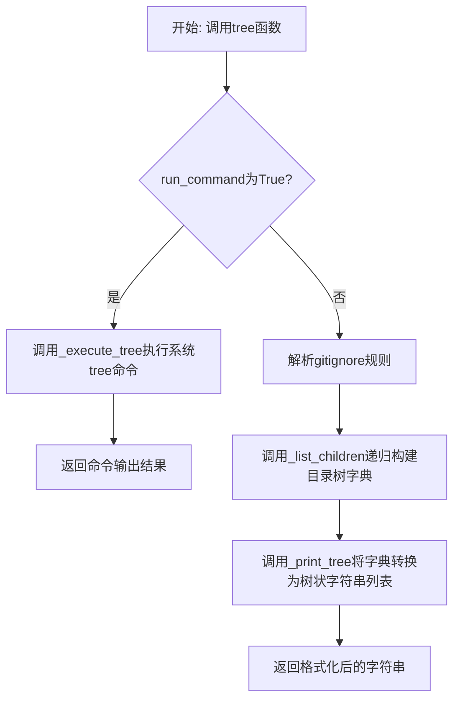
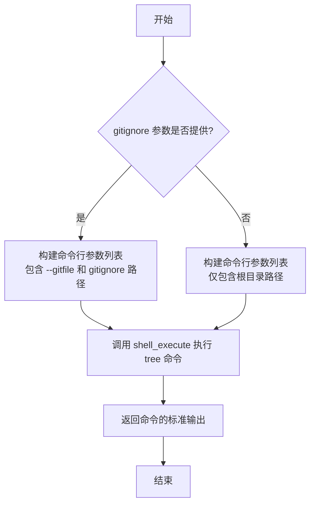

# `.\MetaGPT\metagpt\utils\tree.py` 详细设计文档

该代码实现了一个类似Unix/Linux `tree`命令的功能，用于递归遍历目录结构并以树状格式输出。它支持通过gitignore文件过滤文件和目录，并可以选择使用系统原生的`tree`命令或纯Python实现来生成结果。

## 整体流程



## 类结构

```
tree.py (主模块)
├── 全局函数: tree, _list_children, _print_tree, _add_line, _execute_tree
└── 外部依赖: gitignore_parser, metagpt.tools.libs.shell
```

## 全局变量及字段


    

## 全局函数及方法

### `tree`

递归遍历目录结构并以树状格式打印输出。

参数：

- `root`：`str | Path`，开始遍历的根目录路径。
- `gitignore`：`str | Path`，gitignore 文件的路径，用于过滤文件和目录。
- `run_command`：`bool`，是否执行系统 `tree` 命令。如果为 `True`，则执行 `tree` 命令并返回结果；否则使用 Python 代码实现。

返回值：`str`，目录树的字符串表示。

#### 流程图

```mermaid
flowchart TD
    A[开始: tree(root, gitignore, run_command)] --> B{run_command 是否为 True?}
    B -->|是| C[调用 _execute_tree 执行系统命令]
    B -->|否| D[解析 gitignore 规则]
    D --> E[调用 _list_children 递归构建目录字典]
    E --> F[调用 _print_tree 格式化输出]
    F --> G[返回格式化后的字符串]
    C --> H[返回命令执行结果]
    G --> I[结束]
    H --> I
```

#### 带注释源码

```python
async def tree(root: str | Path, gitignore: str | Path = None, run_command: bool = False) -> str:
    """
    递归遍历目录结构并以树状格式打印输出。

    参数:
        root (str 或 Path): 开始遍历的根目录路径。
        gitignore (str 或 Path): gitignore 文件的路径，用于过滤文件和目录。
        run_command (bool): 是否执行系统 `tree` 命令。如果为 True，则执行 `tree` 命令并返回结果；否则使用 Python 代码实现。

    返回值:
        str: 目录树的字符串表示。

    示例:
        >>> tree(".")
        utils
        +-- serialize.py
        +-- project_repo.py
        +-- tree.py
        +-- mmdc_playwright.py
        +-- __pycache__
        |   +-- __init__.cpython-39.pyc
        |   +-- redis.cpython-39.pyc
        |   +-- singleton.cpython-39.pyc
        +-- parse_docstring.py

        >>> tree(".", gitignore="../../.gitignore")
        utils
        +-- serialize.py
        +-- project_repo.py
        +-- tree.py
        +-- mmdc_playwright.py
        +-- parse_docstring.py

        >>> tree(".", gitignore="../../.gitignore", run_command=True)
        utils
        ├── serialize.py
        ├── project_repo.py
        ├── tree.py
        ├── mmdc_playwright.py
        └── parse_docstring.py
    """
    # 将 root 转换为 Path 对象并解析为绝对路径
    root = Path(root).resolve()
    # 如果 run_command 为 True，则调用 _execute_tree 执行系统命令
    if run_command:
        return await _execute_tree(root, gitignore)

    # 如果提供了 gitignore 文件，则解析其规则
    git_ignore_rules = parse_gitignore(gitignore) if gitignore else None
    # 递归构建目录字典结构
    dir_ = {root.name: _list_children(root=root, git_ignore_rules=git_ignore_rules)}
    # 格式化目录字典为树状字符串列表
    v = _print_tree(dir_)
    # 将列表连接为字符串并返回
    return "\n".join(v)
```

### `_list_children`

该函数是 `tree` 模块的核心递归函数，用于遍历指定目录，并根据可选的 `.gitignore` 规则过滤文件和子目录，最终构建一个嵌套的字典结构来表示目录树。

参数：

- `root`：`Path`，需要遍历的根目录路径。
- `git_ignore_rules`：`Callable`，一个可调用对象（通常由 `parse_gitignore` 生成），用于判断文件或目录是否应被 `.gitignore` 规则排除。如果为 `None`，则不进行过滤。

返回值：`Dict[str, Dict]`，返回一个嵌套字典。字典的键是文件或目录的名称，值是一个空字典（对于文件）或另一个表示其子内容的字典（对于目录）。

#### 流程图

```mermaid
flowchart TD
    A[开始: _list_children(root, git_ignore_rules)] --> B[初始化空字典 dir_]
    B --> C[遍历 root 下的每个条目 i]
    C --> D{git_ignore_rules 存在且匹配 i?}
    D -- 是 --> C
    D -- 否 --> E{尝试判断 i 类型}
    E -- 是文件 --> F[dir_[i.name] = {}]
    E -- 是目录 --> G[递归调用 _list_children(i, git_ignore_rules)<br>结果赋给 dir_[i.name]]
    E -- 发生异常<br>（如权限错误） --> H[dir_[i.name] = {}]
    F --> I[继续遍历]
    G --> I
    H --> I
    I --> J{遍历完成?}
    J -- 否 --> C
    J -- 是 --> K[返回字典 dir_]
```

#### 带注释源码

```python
def _list_children(root: Path, git_ignore_rules: Callable) -> Dict[str, Dict]:
    # 初始化一个空字典，用于存储当前目录下的内容
    dir_ = {}
    # 遍历当前目录（root）下的所有文件和子目录
    for i in root.iterdir():
        # 如果提供了 git_ignore_rules 并且当前条目符合忽略规则，则跳过
        if git_ignore_rules and git_ignore_rules(str(i)):
            continue
        try:
            # 判断当前条目是否为文件
            if i.is_file():
                # 如果是文件，在字典中以其名为键，值为空字典
                dir_[i.name] = {}
            else:
                # 如果是目录，递归调用 _list_children 获取其子内容，
                # 并将结果字典作为当前目录名的值
                dir_[i.name] = _list_children(root=i, git_ignore_rules=git_ignore_rules)
        except (FileNotFoundError, PermissionError, OSError):
            # 如果在访问条目时发生异常（如文件被删除、权限不足等），
            # 仍将其加入字典，但值为空字典，表示无法进一步探索
            dir_[i.name] = {}
    # 返回表示当前目录结构的字典
    return dir_
```

### `_print_tree`

`_print_tree` 是一个递归函数，用于将给定的嵌套字典表示的目录结构转换为树形格式的字符串列表。它遍历字典中的每个条目，如果是文件则直接添加名称，如果是目录则递归处理其子项，并在子项前添加适当的前缀（如 `+--`、`|` 等）以形成树状结构。

参数：

- `dir_`：`Dict[str, Dict]`，表示目录结构的嵌套字典，其中键为文件或目录名，值为其子项的字典（如果是目录）或空字典（如果是文件）。

返回值：`List[str]`，返回一个字符串列表，每个字符串代表树形结构中的一行。

#### 流程图

```mermaid
graph TD
    A[开始] --> B{遍历 dir_ 中的每个 name, children}
    B --> C[将 name 添加到 ret 列表]
    C --> D{children 是否为空?}
    D -->|是| E[继续下一个条目]
    D -->|否| F[递归调用 _print_tree children]
    F --> G[遍历递归返回的 lines]
    G --> H{判断 v 的第一个字符}
    H -->|不是 '+', ' ', '|'| I[调用 _add_line 调整前缀]
    I --> J[添加 '+-- ' 前缀]
    H -->|是 '+', ' ', '|'| K[添加 '    ' 前缀]
    J --> L[将行添加到 ret]
    K --> L
    L --> M{是否遍历完 lines?}
    M -->|否| G
    M -->|是| N{是否遍历完 dir_?}
    N -->|否| B
    N -->|是| O[返回 ret]
    E --> N
```

#### 带注释源码

```python
def _print_tree(dir_: Dict[str:Dict]) -> List[str]:
    # 初始化返回列表，用于存储树形结构的每一行
    ret = []
    # 遍历目录字典中的每个条目，name 为文件或目录名，children 为其子项字典
    for name, children in dir_.items():
        # 将当前文件或目录名添加到结果列表中
        ret.append(name)
        # 如果 children 为空（表示是文件），则跳过后续处理，继续下一个条目
        if not children:
            continue
        # 递归调用 _print_tree 处理子目录，返回子目录的树形结构列表
        lines = _print_tree(children)
        # 遍历子目录的每一行
        for j, v in enumerate(lines):
            # 判断当前行的第一个字符，如果不是树形结构的前缀字符，则说明是子目录的根条目
            if v[0] not in ["+", " ", "|"]:
                # 调用 _add_line 函数调整 ret 中最后几行的前缀，添加 '|' 符号
                ret = _add_line(ret)
                # 为当前行添加 '+-- ' 前缀，表示树形结构的分支
                row = f"+-- {v}"
            else:
                # 如果已经是树形结构的一部分，则添加四个空格作为缩进
                row = f"    {v}"
            # 将处理后的行添加到结果列表中
            ret.append(row)
    # 返回最终的树形结构字符串列表
    return ret
```

### `_add_line`

`_add_line` 函数用于在生成目录树文本表示时，为特定行添加垂直连接线（`|`），以正确格式化树状结构的缩进和分支线。它通过回溯列表，将之前为缩进而添加的空格（` `）替换为垂直线（`|`），从而在视觉上连接父目录和子目录项。

参数：

- `rows`：`List[str]`，表示当前已生成的目录树文本行列表。

返回值：`List[str]`，返回更新后的目录树文本行列表，其中部分行的前导空格已被替换为垂直线。

#### 流程图

```mermaid
flowchart TD
    A[开始: 输入rows列表] --> B[初始化循环变量 i = len(rows) - 1]
    B --> C{i >= 0?}
    C -->|是| D[获取当前行 v = rows[i]]
    D --> E{v[0] != ' '?}
    E -->|是| F[返回更新后的rows列表]
    E -->|否| G[将 rows[i] 替换为 '|' + v[1:]]
    G --> H[i = i - 1]
    H --> C
    C -->|否| I[返回更新后的rows列表]
```

#### 带注释源码

```python
def _add_line(rows: List[str]) -> List[str]:
    # 从列表末尾向前遍历，以找到需要添加垂直连接线的位置
    for i in range(len(rows) - 1, -1, -1):
        v = rows[i]  # 获取当前行的字符串
        if v[0] != " ":  # 如果当前行的第一个字符不是空格，说明遇到了非缩进行（如目录名或文件项）
            return rows  # 停止遍历并返回当前已更新的列表
        rows[i] = "|" + v[1:]  # 将当前行的第一个字符（空格）替换为垂直线，保持其余部分不变
    return rows  # 如果遍历完所有行（理论上不会发生，因为至少有一行非空格行），返回更新后的列表
```

### `_execute_tree`

该函数是 `tree` 函数的辅助方法，用于在 `run_command=True` 时，通过调用系统原生的 `tree` 命令来生成目录树结构。它封装了命令行执行逻辑，并处理了可选的 `.gitignore` 文件参数。

参数：

- `root`：`Path`，需要生成目录树的根目录路径。
- `gitignore`：`str | Path`，可选的 `.gitignore` 文件路径，用于在生成目录树时排除匹配的文件或目录。

返回值：`str`，返回系统 `tree` 命令执行后的标准输出，即格式化后的目录树字符串。

#### 流程图



#### 带注释源码

```python
async def _execute_tree(root: Path, gitignore: str | Path) -> str:
    # 如果提供了 gitignore 参数，则构建包含 --gitfile 选项的命令行参数列表
    args = ["--gitfile", str(gitignore)] if gitignore else []
    # 调用 shell_execute 异步执行系统命令 `tree`，并传入构建好的参数和根目录路径
    # shell_execute 返回一个元组 (stdout, stderr, return_code)
    stdout, _, _ = await shell_execute(["tree"] + args + [str(root)])
    # 返回命令执行的标准输出，即目录树字符串
    return stdout
```

## 关键组件


### 目录树生成核心逻辑

实现了递归遍历文件系统目录结构，并以树状文本格式输出的核心算法。

### Gitignore 规则解析与过滤

通过 `gitignore_parser` 库解析 `.gitignore` 文件，并在遍历目录时根据规则过滤掉被忽略的文件和目录。

### 系统命令执行桥接

提供了一个选项，允许通过调用系统原生的 `tree` 命令来生成目录树，作为纯 Python 实现的备选方案。

### 树状结构格式化器

负责将内存中的嵌套字典结构转换为具有特定前缀（如 `+--`, `|`, `    `）的、可读的树状文本行列表。


## 问题及建议


### 已知问题

-   **`_print_tree` 函数逻辑复杂且脆弱**：该函数通过检查行首字符（如 `+`、` `、`|`）来判断和修改缩进格式，逻辑较为晦涩且容易出错。例如，当文件名以这些特殊字符开头时，会导致格式错误。
-   **`_add_line` 函数副作用不直观**：该函数直接修改传入的 `rows` 列表，这种原地修改的方式降低了代码的可读性和可测试性，调用者可能无法预期列表会被修改。
-   **`_list_children` 函数异常处理过于宽泛**：函数捕获了 `FileNotFoundError`、`PermissionError`、`OSError` 等异常，并将出错项视为空字典 `{}` 加入结果。这虽然保证了程序不崩溃，但会静默地忽略错误，可能导致生成的树结构不完整或误导用户，且丢失了具体的错误信息。
-   **`tree` 函数参数 `run_command` 导致行为不一致**：当 `run_command=True` 时，函数调用外部 `tree` 命令并直接返回其输出；当 `False` 时，使用内部Python逻辑。这两种路径的输出格式（如 `+--` 与 `├──`）和过滤逻辑（内部逻辑使用 `gitignore_parser`，外部命令使用 `--gitfile`）存在差异，给使用者带来困惑，且破坏了函数接口的一致性。
-   **外部命令依赖未做检查**：`_execute_tree` 函数直接调用系统命令 `tree`，但未检查该命令是否存在于目标环境中。如果不存在，`shell_execute` 可能会抛出异常，导致功能失败。
-   **类型注解不完整**：例如 `_print_tree` 函数的参数 `dir_` 类型注解为 `Dict[str:Dict]`，语法不正确且未指定内部字典的具体类型，应为 `Dict[str, Dict]`。`_add_line` 函数缺少返回类型注解。

### 优化建议

-   **重构 `_print_tree` 和 `_add_line` 函数**：建议采用更清晰的递归算法来构建树形字符串。可以传递一个表示当前层级前缀的字符串参数，在递归过程中动态构建每一行的前缀（如 `""`， `"|   "`， `"    "`， `"+-- "` 等），从而避免对结果列表进行复杂的事后修补。这将使逻辑更直观、健壮。
-   **改进 `_list_children` 的异常处理**：建议将异常处理粒度细化，或者至少将捕获的异常记录到日志中，以便于调试。也可以考虑提供一个参数让调用者决定是否忽略错误，或返回一个包含错误信息的特殊标记。
-   **统一 `tree` 函数的行为**：考虑移除 `run_command` 参数，或者将其拆分为两个独立的函数（如 `tree_python` 和 `tree_system`）。如果必须保留，应在文档中明确说明两种模式在输出格式和过滤行为上的差异。更好的做法是让Python实现模仿系统 `tree` 命令的输出格式，以保持一致性。
-   **增加外部命令存在性检查**：在 `_execute_tree` 函数中，调用 `shell_execute` 之前，可以尝试使用 `shutil.which('tree')` 来检查命令是否存在，如果不存在则抛出一个更友好的异常或回退到Python实现。
-   **补充和完善类型注解**：修正 `_print_tree` 参数的类型注解为 `Dict[str, Dict]`，并为 `_add_line` 等函数添加完整的参数和返回类型注解。考虑使用 `TypedDict` 或自定义类型别名来更精确地描述嵌套的目录树结构。
-   **考虑性能优化**：对于非常大的目录树，当前的递归实现可能会消耗较多内存。虽然对于大多数用例足够，但可以注明这一点。如果遇到性能问题，可以考虑使用迭代算法或 `os.scandir` 来提高遍历效率。
-   **增强代码可测试性**：将核心逻辑（如目录遍历、格式生成）与IO操作（如读取文件系统、执行外部命令）解耦，以便于编写单元测试。例如，可以注入一个文件系统访问的抽象层。


## 其它


### 设计目标与约束

本模块的核心设计目标是实现一个跨平台的、功能与 Unix/Linux 系统 `tree` 命令类似的目录树生成工具。主要约束包括：1) 支持通过 Python 代码递归遍历生成树状结构，以提供最大的可移植性；2) 提供通过调用系统原生 `tree` 命令的选项，以利用其更快的速度和更丰富的原生符号（如 `├──`, `└──`）；3) 必须支持 `.gitignore` 规则，以在生成目录树时自动过滤被忽略的文件和目录；4) 代码需具备良好的错误处理能力，能够优雅地处理无权限访问或文件不存在等异常情况，避免程序崩溃。

### 错误处理与异常设计

模块在遍历目录时，通过 `try-except` 块捕获 `FileNotFoundError`、`PermissionError` 和 `OSError` 异常。当遇到这些异常时，当前条目（文件或目录）会被视为一个空字典 `{}` 添加到树结构中，这确保了遍历过程不会因单个节点的访问问题而中断，但可能导致输出的树结构不完整。对于 `gitignore_parser.parse_gitignore` 函数可能抛出的异常（如文件不存在或格式错误），当前代码未做显式处理，这可能导致上层调用失败。调用系统 `tree` 命令时，依赖 `shell_execute` 函数进行错误处理。

### 数据流与状态机

1.  **主流程 (`tree` 函数)**:
    *   **输入**: 根目录路径 (`root`)、`.gitignore` 文件路径 (`gitignore`)、执行模式标志 (`run_command`)。
    *   **处理**:
        *   若 `run_command` 为 `True`，则调用 `_execute_tree`，将参数传递给系统 `tree` 命令执行，并直接返回其标准输出。
        *   若为 `False`，则进入 Python 实现流程：
            a. 解析 `.gitignore` 文件，生成规则匹配函数 (`git_ignore_rules`)。
            b. 调用 `_list_children` 从根目录开始递归遍历，构建一个嵌套的字典结构 (`dir_`)，其中键为名称，值为子字典（目录）或空字典（文件）。
            c. 调用 `_print_tree` 将嵌套字典转换为字符串列表表示的树形图。
    *   **输出**: 格式化后的目录树字符串。

2.  **递归构建 (`_list_children` 函数)**:
    *   遍历当前目录 (`root`) 下的所有条目。
    *   对每个条目，首先应用 `git_ignore_rules` 进行过滤。
    *   对于文件，在字典中记录为 `{文件名: {}}`。
    *   对于目录，递归调用自身，并将返回的子字典作为值。

3.  **递归格式化 (`_print_tree` 与 `_add_line` 函数)**:
    *   `_print_tree` 递归遍历字典，为每个节点生成带前缀的行。它调用 `_add_line` 来为子树添加正确的竖线 (`|`) 连接符，以形成树状视觉效果。

### 外部依赖与接口契约

1.  **外部库**:
    *   `pathlib.Path`: 用于跨平台的路径操作。
    *   `gitignore_parser`: 用于解析 `.gitignore` 文件并生成匹配函数。这是关键的外部依赖，其接口 (`parse_gitignore`) 返回一个可调用对象，输入路径字符串，返回布尔值（是否忽略）。

2.  **内部依赖**:
    *   `metagpt.tools.libs.shell.shell_execute`: 用于执行系统命令。本模块期望该函数接收命令参数列表，并返回一个包含 `(stdout, stderr, returncode)` 的元组。

3.  **系统命令**:
    *   `tree`: 当 `run_command=True` 时，模块依赖于操作系统上已安装的 `tree` 命令。其可用性、版本及支持的参数（如 `--gitfile`）会影响功能。

4.  **接口契约**:
    *   主函数 `tree` 是模块对外的唯一接口。它接受 `str` 或 `Path` 类型的路径，以及可选的 `gitignore` 路径和布尔标志。它返回一个 `str` 类型的目录树表示。调用者需处理可能因依赖缺失（如 `tree` 命令未安装）或权限问题导致的异常。

    