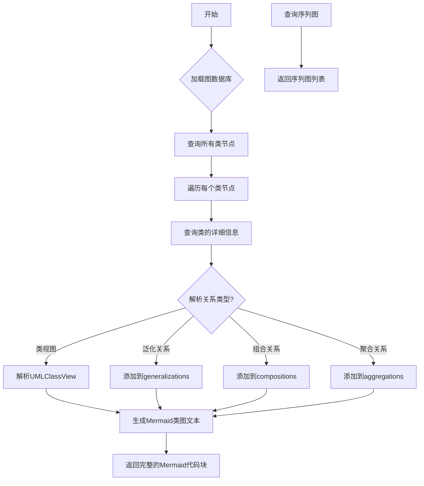
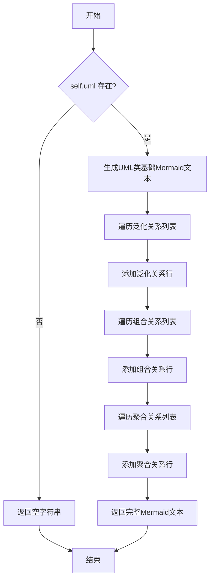
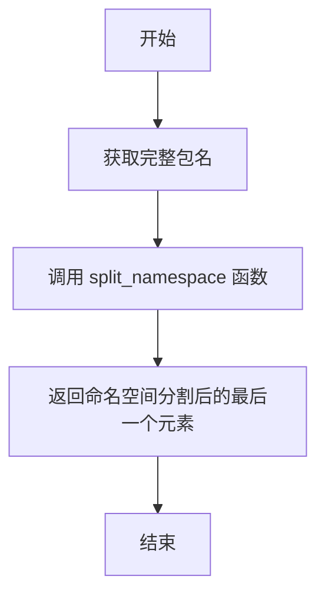
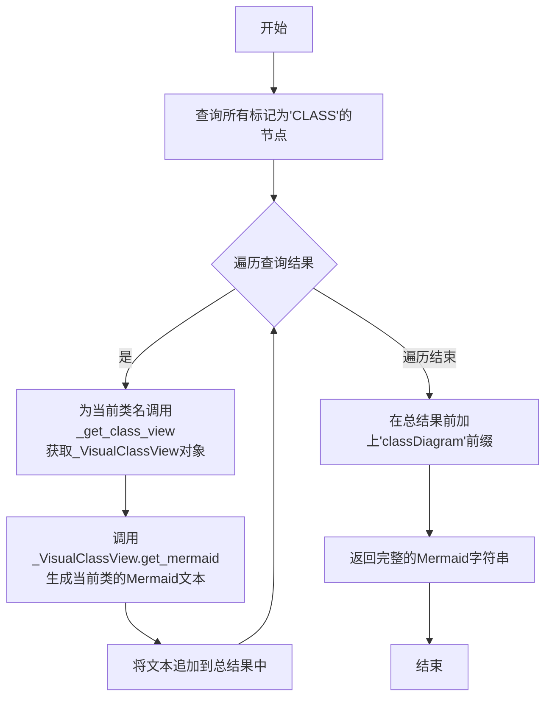
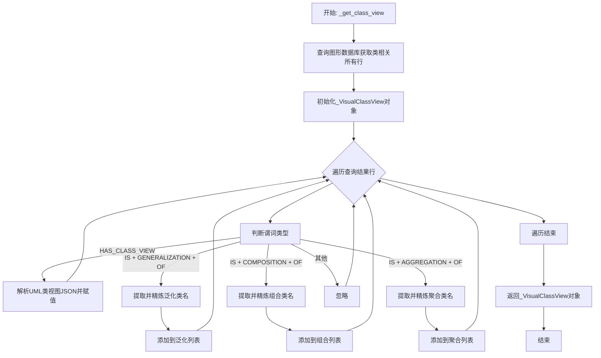
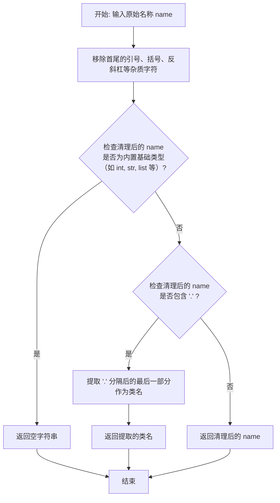

# `.\MetaGPT\metagpt\utils\visual_graph_repo.py` 详细设计文档

该代码是一个可视化工具，用于从图数据库中提取类图和序列图信息，并将其转换为Mermaid格式的Markdown文本，以便于文档化和展示软件系统的UML设计。

## 整体流程



## 类结构

```
VisualGraphRepo (抽象基类)
├── VisualDiGraphRepo (具体实现类)
└── _VisualClassView (内部数据模型)
```

## 全局变量及字段


### `_VisualClassView.package`
    
The package associated with the class, typically representing the fully qualified class name including namespace.

类型：`str`
    


### `_VisualClassView.uml`
    
Optional UMLClassView object containing the detailed UML class definition and structure.

类型：`Optional[UMLClassView]`
    


### `_VisualClassView.generalizations`
    
List of class names that this class inherits from (generalization relationships).

类型：`List[str]`
    


### `_VisualClassView.compositions`
    
List of class names that have strong ownership relationships with this class (composition relationships).

类型：`List[str]`
    


### `_VisualClassView.aggregations`
    
List of class names that have weak ownership relationships with this class (aggregation relationships).

类型：`List[str]`
    


### `VisualGraphRepo.graph_db`
    
The graph database repository instance used for storing and querying graph data.

类型：`GraphRepository`
    
    

## 全局函数及方法

### `_VisualClassView.get_mermaid`

该方法用于生成表示当前类视图的Mermaid类图文本。它首先基于内部的UML类视图生成基础类定义，然后根据类之间的关系（泛化、组合、聚合）添加相应的Mermaid语法关系行，最终返回完整的类图Markdown文本。

参数：

- `align`：`int`，缩进层级，用于控制生成文本的缩进，默认为1。

返回值：`str`，表示Mermaid类图的Markdown文本。

#### 流程图



#### 带注释源码

```python
def get_mermaid(self, align: int = 1) -> str:
    """Creates a Markdown Mermaid class diagram text.

    Args:
        align (int): Indent count used for alignment.

    Returns:
        str: The Markdown text representing the Mermaid class diagram.
    """
    # 检查是否存在UML类视图，若不存在则直接返回空字符串
    if not self.uml:
        return ""
    # 根据缩进层级生成前缀字符串
    prefix = "\t" * align

    # 调用UML类视图的get_mermaid方法生成基础类定义文本
    mermaid_txt = self.uml.get_mermaid(align=align)
    # 遍历泛化关系列表，为每个泛化关系添加Mermaid语法行
    for i in self.generalizations:
        mermaid_txt += f"{prefix}{i} <|-- {self.name}\n"
    # 遍历组合关系列表，为每个组合关系添加Mermaid语法行
    for i in self.compositions:
        mermaid_txt += f"{prefix}{i} *-- {self.name}\n"
    # 遍历聚合关系列表，为每个聚合关系添加Mermaid语法行
    for i in self.aggregations:
        mermaid_txt += f"{prefix}{i} o-- {self.name}\n"
    # 返回构建完成的Mermaid类图文本
    return mermaid_txt
```

### `_VisualClassView.name`

返回类名（不含命名空间前缀）。

参数：无

返回值：`str`，类名（不含命名空间前缀）。

#### 流程图



#### 带注释源码

```python
@property
def name(self) -> str:
    """Returns the class name without the namespace prefix."""
    # 调用 split_namespace 函数，将完整的包名按命名空间分割，并返回最后一个元素（即类名）
    return split_namespace(self.package)[-1]
```

### `VisualDiGraphRepo.load_from`

这是一个类方法，用于从指定的文件加载一个图数据库（`DiGraphRepository`）实例，并用它来创建并返回一个 `VisualDiGraphRepo` 对象。该方法简化了 `VisualDiGraphRepo` 的初始化过程，使其能够从一个持久化的数据源快速恢复状态。

参数：

- `filename`：`str | Path`，包含图数据库持久化数据的文件路径。可以是字符串或 `Path` 对象。

返回值：`VisualDiGraphRepo`，返回一个初始化好的 `VisualDiGraphRepo` 实例，其内部的 `graph_db` 属性已加载了指定文件中的数据。

#### 流程图

```mermaid
flowchart TD
    A[开始: load_from(filename)] --> B{filename 是否为 Path 对象?};
    B -- 是 --> C[将 Path 转换为字符串];
    B -- 否 --> D[保持 filename 为字符串];
    C --> D;
    D --> E[异步调用 DiGraphRepository.load_from<br>加载图数据库];
    E --> F[使用加载的 graph_db<br>创建 VisualDiGraphRepo 实例];
    F --> G[返回 VisualDiGraphRepo 实例];
    G --> H[结束];
```

#### 带注释源码

```python
    @classmethod
    async def load_from(cls, filename: str | Path):
        """Load a VisualDiGraphRepo instance from a file."""
        # 1. 确保 filename 参数为字符串类型，以兼容 DiGraphRepository.load_from 的接口。
        #    如果传入的是 Path 对象，则转换为字符串。
        graph_db = await DiGraphRepository.load_from(str(filename))
        # 2. 使用从文件加载的 DiGraphRepository 实例 (graph_db) 作为参数，
        #    调用当前类 (cls，即 VisualDiGraphRepo) 的构造函数，创建一个新的实例。
        return cls(graph_db=graph_db)
```

### `VisualDiGraphRepo.get_mermaid_class_view`

该方法用于从图数据库中查询所有标记为“类”的节点，并为每个类生成对应的Mermaid类图代码块，最终将所有代码块组合成一个完整的Mermaid类图定义。

参数：
- 无显式参数。该方法是一个实例方法，通过`self`访问类实例的`graph_db`属性。

返回值：`str`，返回一个完整的Markdown Mermaid类图代码块字符串，以`classDiagram`开头，包含所有查询到的类及其关系定义。

#### 流程图



#### 带注释源码

```python
async def get_mermaid_class_view(self) -> str:
    """
    返回一个Markdown Mermaid类图代码块对象。
    核心流程：
    1. 从图数据库中查询所有谓词为`IS`，对象为`CLASS`的三元组，以获取所有类节点。
    2. 遍历查询结果，对每个类节点，调用内部方法`_get_class_view`获取其详细视图。
    3. 将每个类的Mermaid文本（包含类定义及其关系）拼接起来。
    4. 在所有类定义前加上`classDiagram`声明，形成完整的Mermaid图表代码。
    """
    # 1. 查询所有被标记为“类”的节点
    rows = await self.graph_db.select(predicate=GraphKeyword.IS, object_=GraphKeyword.CLASS)
    # 初始化Mermaid文本，以`classDiagram`声明开始
    mermaid_txt = "classDiagram\n"
    # 2. 遍历查询到的每一个类节点
    for r in rows:
        # 为每个类名（r.subject）获取其详细的类视图对象
        v = await self._get_class_view(ns_class_name=r.subject)
        # 3. 调用类视图对象的`get_mermaid`方法生成该类的Mermaid定义文本，并追加到总字符串中
        mermaid_txt += v.get_mermaid()
    # 4. 返回完整的Mermaid类图定义字符串
    return mermaid_txt
```

### `VisualDiGraphRepo._get_class_view`

该方法用于获取指定类的可视化视图，包括其UML类图信息以及与其他类的关系（泛化、组合、聚合）。

参数：

- `ns_class_name`：`str`，包含命名空间的类名，用于在图形数据库中唯一标识一个类。

返回值：`_VisualClassView`，一个包含类视图信息的对象，包括包名、UML类视图、泛化关系、组合关系和聚合关系。

#### 流程图



#### 带注释源码

```python
async def _get_class_view(self, ns_class_name: str) -> _VisualClassView:
    """Returns the Markdown Mermaid class diagram code block object for the specified class."""
    # 从图形数据库中查询与指定类名相关的所有三元组
    rows = await self.graph_db.select(subject=ns_class_name)
    # 初始化一个_VisualClassView对象，包名设置为传入的类名
    class_view = _VisualClassView(package=ns_class_name)
    # 遍历查询到的每一行数据
    for r in rows:
        # 如果谓词表示该类有UML类视图
        if r.predicate == GraphKeyword.HAS_CLASS_VIEW:
            # 将对象字段的JSON字符串解析为UMLClassView对象并赋值
            class_view.uml = UMLClassView.model_validate_json(r.object_)
        # 如果谓词表示该类是另一个类的泛化（继承）
        elif r.predicate == GraphKeyword.IS + GENERALIZATION + GraphKeyword.OF:
            # 从对象字段中提取类名（去掉命名空间）
            name = split_namespace(r.object_)[-1]
            # 精炼类名（去除杂质，如引号、基本类型等）
            name = self._refine_name(name)
            # 如果精炼后的类名有效（非空且不是基本类型）
            if name:
                # 添加到泛化关系列表中
                class_view.generalizations.append(name)
        # 如果谓词表示该类是另一个类的组合
        elif r.predicate == GraphKeyword.IS + COMPOSITION + GraphKeyword.OF:
            name = split_namespace(r.object_)[-1]
            name = self._refine_name(name)
            if name:
                # 添加到组合关系列表中
                class_view.compositions.append(name)
        # 如果谓词表示该类是另一个类的聚合
        elif r.predicate == GraphKeyword.IS + AGGREGATION + GraphKeyword.OF:
            name = split_namespace(r.object_)[-1]
            name = self._refine_name(name)
            if name:
                # 添加到聚合关系列表中
                class_view.aggregations.append(name)
    # 返回构建好的类视图对象
    return class_view
```

### `VisualDiGraphRepo.get_mermaid_sequence_views`

该方法用于从图数据库中检索所有序列图数据，返回一个包含序列图标识符及其对应Mermaid序列图代码的列表。

参数：
-  `self`：`VisualDiGraphRepo`，当前`VisualDiGraphRepo`实例的引用。

返回值：`List[(str, str)]`，一个元组列表，其中每个元组包含两个字符串：第一个是序列图在图数据库中的唯一标识符（subject），第二个是对应的Mermaid序列图代码（object）。

#### 流程图

```mermaid
graph TD
    A[开始] --> B[调用 graph_db.select<br/>查询 HAS_SEQUENCE_VIEW 谓词]
    B --> C{查询结果是否为空?}
    C -->|是| D[返回空列表]
    C -->|否| E[遍历查询结果 rows]
    E --> F[对于每一行 r]
    F --> G[将 (r.subject, r.object_) 添加到 sequence_views 列表]
    G --> H{是否还有更多行?}
    H -->|是| F
    H -->|否| I[返回 sequence_views 列表]
    I --> J[结束]
```

#### 带注释源码

```python
async def get_mermaid_sequence_views(self) -> List[(str, str)]:
    """Returns all Markdown sequence diagrams with their corresponding graph repository keys."""
    # 初始化一个空列表，用于存储序列图数据
    sequence_views = []
    # 从图数据库中查询所有谓词为 HAS_SEQUENCE_VIEW 的三元组
    # 这些三元组代表了存储的序列图信息
    rows = await self.graph_db.select(predicate=GraphKeyword.HAS_SEQUENCE_VIEW)
    # 遍历查询到的每一行结果
    for r in rows:
        # 将每一行的 subject（序列图标识符）和 object（Mermaid代码）作为一个元组添加到列表中
        sequence_views.append((r.subject, r.object_))
    # 返回包含所有序列图数据的列表
    return sequence_views
```

### `VisualDiGraphRepo._refine_name`

该方法用于清理和规范化类名或类型名。它会移除字符串首尾的特定杂质字符（如引号、括号、反斜杠），检查是否为内置基础类型（如 `int`, `str` 等），如果是则返回空字符串，最后提取出完全限定名中的最后一部分（即类名本身）。

参数：
- `name`：`str`，需要清理和规范化的原始名称字符串。

返回值：`str`，清理和规范化后的名称。如果输入是内置基础类型，则返回空字符串。

#### 流程图



#### 带注释源码

```python
@staticmethod
def _refine_name(name: str) -> str:
    """Removes impurity content from the given name.

    Example:
        >>> _refine_name("int")
        ""

        >>> _refine_name('"Class1"')
        'Class1'

        >>> _refine_name("pkg.Class1")
        "Class1"
    """
    # 1. 使用正则表达式移除字符串首尾的引号、括号、反斜杠等杂质字符。
    name = re.sub(r'^[\'"\\\(\)]+|[\'"\\\(\)]+$', "", name)
    # 2. 检查清理后的名称是否为常见的内置基础类型。
    #    如果是，则返回空字符串，表示在类图中忽略此类型。
    if name in ["int", "float", "bool", "str", "list", "tuple", "set", "dict", "None"]:
        return ""
    # 3. 如果名称中包含点号 '.'，则提取点号后的最后一部分（通常是类名）。
    #    这用于处理带有命名空间的完全限定名。
    if "." in name:
        name = name.split(".")[-1]
    # 4. 返回最终处理后的名称。
    return name
```

### `VisualDiGraphRepo.get_mermaid_sequence_view_versions`

该方法用于从图数据库中检索所有带有版本标记的序列图数据，返回一个包含序列图键和对应序列图数据的列表。

参数：

-  `self`：`VisualDiGraphRepo`，当前VisualDiGraphRepo实例的引用。

返回值：`List[(str, str)]`，一个元组列表，每个元组包含两个字符串：第一个是序列图在图数据库中的键（subject），第二个是序列图的数据（object）。

#### 流程图

```mermaid
flowchart TD
    A[开始] --> B[调用graph_db.select<br>查询谓词为HAS_SEQUENCE_VIEW_VER的记录]
    B --> C{是否有查询结果?}
    C -- 否 --> D[返回空列表]
    C -- 是 --> E[遍历查询结果rows]
    E --> F[对于每一行r<br>提取r.subject和r.object]
    F --> G[将(subject, object)对<br>添加到sequence_views列表]
    G --> H{是否遍历完所有行?}
    H -- 否 --> E
    H -- 是 --> I[返回sequence_views列表]
    I --> J[结束]
```

#### 带注释源码

```python
async def get_mermaid_sequence_view_versions(self) -> List[(str, str)]:
    """返回所有带有版本标记的Markdown序列图及其对应的图数据库键。"""
    # 初始化一个空列表，用于存储结果
    sequence_views = []
    # 从图数据库中查询所有谓词（predicate）为 HAS_SEQUENCE_VIEW_VER 的记录
    # HAS_SEQUENCE_VIEW_VER 是一个常量，表示“拥有序列图版本”的关系
    rows = await self.graph_db.select(predicate=GraphKeyword.HAS_SEQUENCE_VIEW_VER)
    # 遍历查询到的每一行记录
    for r in rows:
        # 将当前记录的 subject（通常是序列图的标识符或键）和 object（序列图的数据，如Mermaid代码）
        # 作为一个元组添加到结果列表中
        sequence_views.append((r.subject, r.object))
    # 返回包含所有版本化序列图信息的列表
    return sequence_views
```

## 关键组件


### 张量索引与惰性加载

通过 `DiGraphRepository` 加载图数据，并在 `VisualDiGraphRepo` 中通过 `_get_class_view` 等方法按需查询和构建类视图，实现了对图数据库中类、关系及视图数据的惰性加载与索引。

### 反量化支持

`UMLClassView.model_validate_json` 方法用于将存储在数据库中的 JSON 字符串反序列化为 `UMLClassView` 对象，支持从持久化存储中恢复复杂的类视图数据结构。

### 量化策略

通过 `GraphKeyword` 常量（如 `IS`、`HAS_CLASS_VIEW`、`HAS_SEQUENCE_VIEW`）定义图数据库中的关系谓词，将复杂的类关系（泛化、组合、聚合）和视图关联抽象为标准的查询条件，实现了对图数据结构的标准化访问和查询。


## 问题及建议


### 已知问题

-   **循环依赖风险**：`_VisualClassView` 类的方法 `get_mermaid` 中，通过 `self.uml.get_mermaid(align=align)` 调用了 `UMLClassView` 的方法。如果 `UMLClassView` 的实现反向依赖 `_VisualClassView` 或 `VisualGraphRepo`，可能会形成循环导入或循环依赖，增加代码的耦合度和维护难度。
-   **静态方法命名与作用域不符**：`_refine_name` 方法被定义为静态方法 (`@staticmethod`)，但其逻辑（如清理名称、过滤基础类型）是 `VisualDiGraphRepo` 类处理类视图时的特定业务逻辑。将其定义为静态方法虽然技术上可行，但削弱了其与类上下文的关联性，可能误导开发者认为这是一个通用的、无状态的工具函数。
-   **异步方法中的同步调用**：`get_mermaid_class_view` 方法中，在异步循环内调用了同步方法 `v.get_mermaid()`。虽然当前 `get_mermaid` 方法逻辑简单，但若未来变得复杂或涉及 I/O 操作，将阻塞事件循环，影响整体异步性能。
-   **类型注解不完整**：`get_mermaid_sequence_views` 和 `get_mermaid_sequence_view_versions` 方法的返回值类型注解为 `List[(str, str)]`，这不是标准的 Python 类型提示语法。正确的写法应为 `List[Tuple[str, str]]`，需要从 `typing` 模块导入 `Tuple`。这可能导致类型检查工具（如 mypy）报错或无法提供准确的类型推断。
-   **潜在的重复数据查询**：`get_mermaid_class_view` 方法首先查询所有类别，然后对每个类调用 `_get_class_view`，后者又会针对每个类执行一次独立的数据库查询 (`self.graph_db.select(subject=ns_class_name)`)。如果类别数量众多，会导致 N+1 查询问题，显著降低性能。
-   **错误处理缺失**：代码中缺乏对可能异常情况的处理，例如：`graph_db.select` 查询失败、`UMLClassView.model_validate_json` 反序列化失败、文件加载失败等。当前实现假设所有操作都会成功，这在实际生产环境中是不稳健的。
-   **硬编码的字符串逻辑**：`_refine_name` 方法中硬编码了基础类型列表（如 `"int"`, `"float"` 等）。如果未来需要支持更多语言或扩展类型系统，需要修改此方法，违反了开闭原则。

### 优化建议

-   **解耦与接口抽象**：考虑在 `_VisualClassView` 和 `UMLClassView` 之间引入一个明确的接口或抽象基类，用于定义 `get_mermaid` 等渲染方法。这可以打破潜在的循环依赖，并使依赖关系更加清晰。
-   **将静态方法改为实例方法或类方法**：将 `_refine_name` 改为 `VisualDiGraphRepo` 的实例方法（去掉 `@staticmethod` 装饰器），以明确其属于该类实例的业务逻辑上下文。如果该方法确实无需访问实例状态，但逻辑上紧密关联于该类，也可以考虑改为类方法 (`@classmethod`)。
-   **评估并可能异步化 `get_mermaid` 方法**：检查 `_VisualClassView.get_mermaid` 和 `UMLClassView.get_mermaid` 的实现。如果它们可能执行耗时操作或未来可能扩展为 I/O 操作，应考虑将其改为异步方法（使用 `async def`），并在 `get_mermaid_class_view` 中使用 `await` 调用。
-   **修正类型注解**：将 `get_mermaid_sequence_views` 和 `get_mermaid_sequence_view_versions` 的返回值类型修正为 `List[Tuple[str, str]]`，并确保在文件顶部有 `from typing import Tuple` 导入。
-   **优化数据查询模式**：重构 `get_mermaid_class_view` 方法。可以尝试通过一次更复杂的查询（如果底层 `GraphRepository` 支持）获取所有类及其关联的视图和关系数据，然后在内存中进行聚合，避免 N+1 查询。或者，在 `_get_class_view` 中实现缓存机制，避免对同一类名的重复查询。
-   **增加健壮的错误处理**：
    -   在 `load_from`、`get_mermaid_class_view`、`_get_class_view` 等关键方法中添加 `try...except` 块，捕获可能的数据访问异常、解析异常等。
    -   定义项目特定的异常类，以便更精确地传递错误信息。
    -   对于非致命错误（如某个类的视图数据损坏），可以考虑记录警告并跳过该类的渲染，而不是让整个流程失败。
-   **提取配置或常量**：将 `_refine_name` 中的基础类型列表提取到模块级常量（如 `PRIMITIVE_TYPES`）或配置文件中。这样便于集中管理和扩展，也提高了代码的可读性。
-   **考虑添加缓存层**：由于类视图和序列视图的生成可能涉及复杂的查询和计算，且数据不频繁变化，可以考虑引入缓存机制（例如使用 `functools.lru_cache` 装饰异步方法，或使用外部缓存如 Redis）。这能显著提升重复请求的性能。
-   **补充单元测试**：为 `_refine_name`、`_get_class_view` 等核心方法编写全面的单元测试，覆盖各种边界情况（如空输入、包含特殊字符的名称、基础类型等），确保重构和优化不会引入回归错误。


## 其它


### 设计目标与约束

本模块的核心设计目标是为图数据库中的类图和序列图提供可视化生成能力，将存储在特定格式图数据库中的结构化设计信息转换为Mermaid图表代码。主要约束包括：1) 输入数据必须遵循预定义的图数据库模式（使用特定的谓词如`GraphKeyword.IS`、`GraphKeyword.HAS_CLASS_VIEW`等）；2) 输出严格限定为Mermaid语法格式的文本，以便集成到Markdown文档中；3) 类图生成需支持继承（Generalization）、组合（Composition）、聚合（Aggregation）三种关系的可视化；4) 序列图生成需支持多版本视图的检索。

### 错误处理与异常设计

当前代码中显式的错误处理机制较为有限。主要依赖于外部调用（如`DiGraphRepository.load_from`）和内部操作（如`UMLClassView.model_validate_json`）可能抛出的异常。`_refine_name`方法通过静态检查处理了基本数据类型和字符串引号的清理，但未对更复杂的无效输入（如空字符串、特殊字符组合）进行防御。整体上，错误处理策略是“快速失败”，依赖调用方进行捕获和处理。建议增加对关键操作（如文件加载、JSON解析、图查询）的try-catch包装，并定义模块特定的异常类型（如`GraphVisualizationError`）以提升可调试性。

### 数据流与状态机

模块的数据流清晰：1) **初始化**：通过`load_from`从文件加载图数据库，构建`VisualDiGraphRepo`实例。2) **类图生成**：`get_mermaid_class_view`触发对全库`CLASS`节点的查询，对每个类节点调用`_get_class_view`。`_get_class_view`方法根据类名查询其关联的UML视图JSON、泛化、组合、聚合关系，组装成`_VisualClassView`对象，最终由该对象的`get_mermaid`方法生成Mermaid代码片段并汇总。3) **序列图检索**：`get_mermaid_sequence_views`和`get_mermaid_sequence_views_versions`直接查询图数据库，返回（键，Mermaid代码）对列表。整个过程是无状态的，每个方法调用都是独立的查询-转换操作。

### 外部依赖与接口契约

1.  **图数据库接口**：强依赖`GraphRepository`及其子类`DiGraphRepository`。契约要求后者实现`select`方法（用于查询三元组）和`load_from`类方法（用于反序列化）。`GraphKeyword`提供了查询所需的谓词常量。
2.  **数据模型**：依赖`UMLClassView`（来自`metagpt.schema`）作为类视图的标准化数据格式，并依赖其`get_mermaid`方法生成类定义部分的Mermaid代码。
3.  **工具函数**：依赖`split_namespace`（来自`metagpt.utils.common`）来从完整类名中提取短名称。
4.  **基础库**：依赖`pydantic.BaseModel`进行数据验证和序列化，依赖`re`和`pathlib`进行字符串处理与路径操作。
5.  **抽象基类**：`VisualGraphRepo`作为抽象基类，定义了`graph_db`属性，为未来支持其他图数据库实现（如`Neo4jGraphRepo`）提供了扩展点，当前仅有一个具体实现`VisualDiGraphRepo`。

### 安全与合规考虑

当前代码未涉及明显的网络、数据库或用户输入操作，安全风险较低。主要考虑点在于：1) **数据验证**：从图数据库加载的JSON数据（`r.object_`）在通过`UMLClassView.model_validate_json`解析时，依赖Pydantic的验证机制，若JSON格式恶意构造或不符合模型，可能导致解析异常或资源消耗。2) **代码注入**：生成的Mermaid代码最终可能被渲染。虽然Mermaid是相对安全的图表语言，但若图数据库中存储的`UMLClassView`或序列图代码本身被植入了恶意脚本，在支持Mermaid执行的环境（如某些Wiki、文档平台）中可能构成风险。建议对从数据库取出的原始字符串进行必要的清洗或转义，尽管当前上下文中它们被视为可信数据。

### 测试策略建议

1.  **单元测试**：
    *   `_refine_name`方法：测试各种输入（带引号、基本类型、带命名空间、空、特殊字符）的清理结果。
    *   `_VisualClassView.get_mermaid`：测试在不同`align`参数下，以及当`uml`为`None`或包含不同关系列表时的输出。
    *   `_get_class_view`：通过Mock `graph_db.select`返回不同的三元组列表，验证其能正确构建包含UML视图和各类关系的`_VisualClassView`对象。
2.  **集成测试**：
    *   `get_mermaid_class_view`：使用一个预置的小型测试图数据库文件，验证其生成的完整Mermaid代码是否符合预期。
    *   `get_mermaid_sequence_views`：验证能否正确检索出所有序列图及其键。
3.  **契约测试**：确保对`GraphRepository`和`DiGraphRepository`的调用符合其接口预期。
4.  **快照测试**：对生成的复杂Mermaid图表输出进行快照对比，防止回归。

### 部署与运维考量

1.  **资源**：作为纯计算和转换模块，无长期运行的服务状态，资源消耗低，主要取决于输入的图数据库大小。
2.  **依赖管理**：需确保运行环境安装`pydantic`和`metagpt`等相关依赖包的正确版本。
3.  **监控与日志**：建议在关键步骤（如开始加载文件、完成图表生成）添加INFO级别日志。对于`_get_class_view`中关系解析失败或JSON解析错误，可添加WARNING或ERROR日志，便于排查数据问题。
4.  **配置化**：当前关系类型（泛化、组合、聚合）的谓词是硬编码的。未来若关系类型扩展，可考虑将其变为可配置项。

    