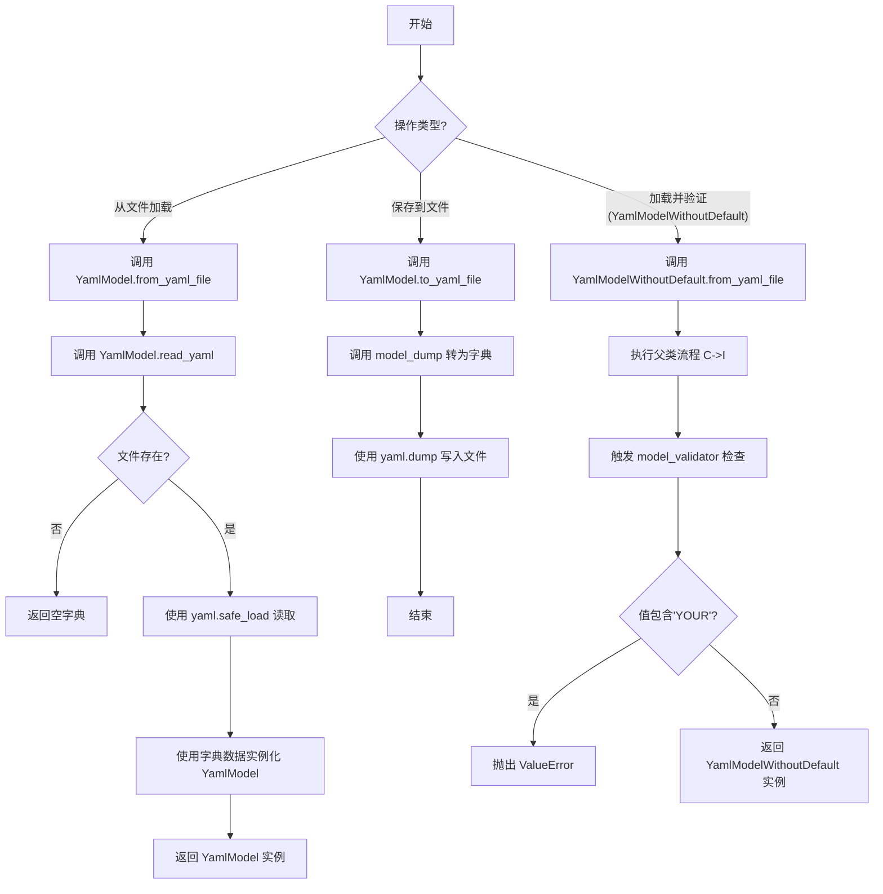
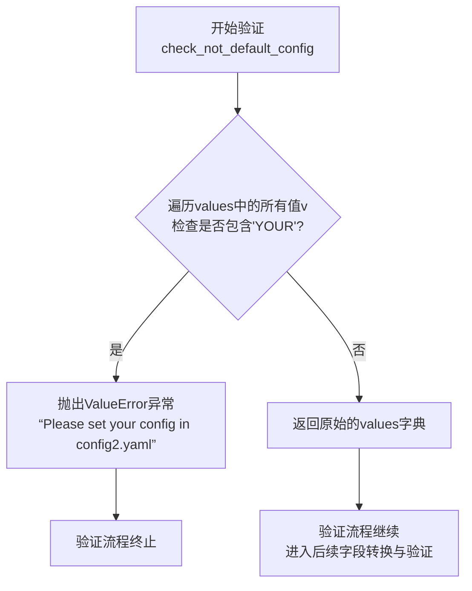

# `.\MetaGPT\metagpt\utils\yaml_model.py` 详细设计文档

该代码定义了一个基于 Pydantic 的 YAML 配置文件处理框架。核心功能是提供从 YAML 文件读取配置到数据模型对象，以及将数据模型对象序列化回 YAML 文件的便捷方法。它包含一个基础模型类 `YamlModel` 和一个用于严格验证配置是否已自定义的派生类 `YamlModelWithoutDefault`。

## 整体流程



## 类结构

```
BaseModel (Pydantic基类)
└── YamlModel (YAML模型基类)
    └── YamlModelWithoutDefault (严格验证的YAML模型)
```

## 全局变量及字段


### `YamlModel.extra_fields`
    
一个可选的字典，用于存储YAML文件中未在模型类中明确定义的额外字段。

类型：`Optional[Dict[str, str]]`
    
    

## 全局函数及方法


### `YamlModel.read_yaml`

这是一个类方法，用于读取指定路径的 YAML 文件，并将其内容解析为 Python 字典。如果文件不存在，则返回一个空字典。

参数：

-  `file_path`：`Path`，要读取的 YAML 文件的路径。
-  `encoding`：`str`，可选参数，指定文件的编码格式，默认为 "utf-8"。

返回值：`Dict`，解析 YAML 文件后得到的字典。如果文件不存在，则返回空字典 `{}`。

#### 流程图

```mermaid
flowchart TD
    A[开始: read_yaml(file_path, encoding)] --> B{文件是否存在?};
    B -- 否 --> C[返回空字典 {}];
    B -- 是 --> D[以指定编码打开文件];
    D --> E[使用 yaml.safe_load 解析文件内容];
    E --> F[返回解析后的字典];
    C --> G[结束];
    F --> G;
```

#### 带注释源码

```python
    @classmethod
    def read_yaml(cls, file_path: Path, encoding: str = "utf-8") -> Dict:
        """Read yaml file and return a dict"""
        # 检查文件是否存在，如果不存在则直接返回空字典，避免抛出异常。
        if not file_path.exists():
            return {}
        # 使用 `with` 语句安全地打开文件，确保文件在使用后被正确关闭。
        # 使用 `yaml.safe_load` 安全地加载 YAML 内容，避免执行任意代码。
        with open(file_path, "r", encoding=encoding) as file:
            return yaml.safe_load(file)
```


### `YamlModel.from_yaml_file`

这是一个类方法，用于从指定的YAML文件路径读取配置数据，并将其解析、实例化为一个`YamlModel`对象（或其子类对象）。它封装了文件读取和对象构造的逻辑，是创建配置模型实例的主要入口点。

参数：

-  `file_path`：`pathlib.Path`，指向要读取的YAML配置文件的路径对象。

返回值：`YamlModel`，返回一个根据YAML文件内容初始化好的`YamlModel`类（或其子类）的实例。

#### 流程图

```mermaid
flowchart TD
    A[开始: from_yaml_file(file_path)] --> B[调用 cls.read_yaml(file_path)]
    B --> C{文件是否存在?}
    C -- 否 --> D[返回空字典 {}]
    C -- 是 --> E[使用 yaml.safe_load 读取并解析文件]
    D --> F[使用字典内容 ** 解包作为参数]
    E --> F
    F --> G[调用 cls(**data) 实例化对象]
    G --> H[返回实例化的 YamlModel 对象]
    H --> I[结束]
```

#### 带注释源码

```python
    @classmethod
    def from_yaml_file(cls, file_path: Path) -> "YamlModel":
        """Read yaml file and return a YamlModel instance"""
        # 1. 调用类方法 `read_yaml`，传入文件路径，读取并解析YAML文件内容，返回一个字典。
        # 2. 使用字典解包操作符 `**`，将字典的键值对作为关键字参数传递给类的构造函数 `cls(...)`。
        # 3. 构造函数利用Pydantic的能力，根据模型字段定义对输入数据进行验证和转换，并创建类的一个新实例。
        # 4. 返回新创建的 `YamlModel` 实例（或其子类实例）。
        return cls(**cls.read_yaml(file_path))
```


### `YamlModel.to_yaml_file`

该方法将 `YamlModel` 实例的数据序列化为 YAML 格式，并写入到指定的文件中。

参数：

-  `self`：`YamlModel`，当前 `YamlModel` 类的实例。
-  `file_path`：`Path`，目标 YAML 文件的路径。
-  `encoding`：`str`，写入文件时使用的字符编码，默认为 `"utf-8"`。

返回值：`None`，此方法不返回任何值，其作用是将数据写入文件。

#### 流程图

```mermaid
flowchart TD
    A[开始: to_yaml_file(self, file_path, encoding)] --> B[调用 self.model_dump()<br>将Pydantic模型转为字典]
    B --> C[以写入模式打开文件<br>open(file_path, 'w', encoding=encoding)]
    C --> D[使用 yaml.dump<br>将字典序列化为YAML并写入文件]
    D --> E[关闭文件]
    E --> F[结束]
```

#### 带注释源码

```python
def to_yaml_file(self, file_path: Path, encoding: str = "utf-8") -> None:
    """Dump YamlModel instance to yaml file"""
    # 1. 使用Pydantic BaseModel的model_dump方法将当前实例转换为字典。
    #    这确保了只有模型定义的字段（以及extra_fields）被序列化。
    # 2. 以写入模式（'w'）和指定编码打开目标文件。
    #    使用`with`语句确保文件在操作完成后被正确关闭。
    # 3. 使用yaml.dump函数将上一步得到的字典序列化为YAML格式的字符串，并写入打开的文件句柄。
    with open(file_path, "w", encoding=encoding) as file:
        yaml.dump(self.model_dump(), file)
```


### `YamlModelWithoutDefault.check_not_default_config`

该方法是一个 Pydantic 模型验证器，用于在模型实例化前检查传入的配置字典中是否包含占位符字符串 "YOUR"。如果发现任何值包含 "YOUR"，则抛出 `ValueError` 异常，提示用户需要在配置文件中设置实际的值。此验证器运行在 "before" 模式，即在数据被转换为模型字段之前执行。

参数：

-  `cls`：`class`，当前正在被验证的类（`YamlModelWithoutDefault`）。
-  `values`：`dict`，包含从 YAML 文件或其他来源解析出的原始键值对，这些值将被用于初始化模型实例。

返回值：`dict`，返回经过检查（或修改）后的原始值字典，供后续的模型字段转换和验证使用。

#### 流程图



#### 带注释源码

```python
    @model_validator(mode="before")  # 装饰器：将此方法标记为Pydantic模型验证器，并指定在数据转换到模型字段之前运行。
    @classmethod                     # 装饰器：将此方法定义为类方法，第一个参数为类本身（cls）。
    def check_not_default_config(cls, values):
        """Check if there is any default config in config2.yaml"""
        # 使用列表推导式和any()函数检查传入的values字典中，是否有任何一个值（v）包含子字符串"YOUR"。
        # 这通常用于检测用户是否忘记替换配置文件中的示例或占位符值。
        if any(["YOUR" in v for v in values]):
            # 如果发现包含"YOUR"的值，则抛出ValueError异常，提示用户进行配置。
            raise ValueError("Please set your config in config2.yaml")
        # 如果检查通过（即没有发现包含"YOUR"的值），则原样返回values字典，
        # 以便Pydantic继续后续的模型实例化流程。
        return values
```


## 关键组件


### YamlModel 基类

一个基于 Pydantic 的基类，提供了从 YAML 文件读取配置数据并实例化模型对象，以及将模型对象序列化并保存回 YAML 文件的核心功能。

### YamlModelWithoutDefault 派生类

YamlModel 的派生类，通过 Pydantic 的模型验证器，在数据加载阶段强制检查配置值中是否包含占位符（如 "YOUR"），以确保配置已被正确设置，增强了配置验证的严格性。

### Pydantic 集成

利用 Pydantic 库的 BaseModel 作为基类，自动处理数据验证、序列化（model_dump）与反序列化，简化了 YAML 数据与 Python 对象之间的映射和类型安全。

### YAML 文件操作

封装了使用 `yaml.safe_load` 安全读取和 `yaml.dump` 写入 YAML 文件的操作，提供了 `read_yaml`、`from_yaml_file` 和 `to_yaml_file` 等方法，实现了配置的持久化与加载。


## 问题及建议


### 已知问题

-   **`extra_fields` 字段类型限制过强**：`extra_fields` 字段被定义为 `Optional[Dict[str, str]]`，这意味着它只能存储键和值都为字符串的字典。在实际使用中，YAML 文件可能包含嵌套字典、列表、数字、布尔值等复杂结构，当前类型定义无法容纳这些数据，会导致解析失败或数据丢失。
-   **`read_yaml` 方法的异常处理不完整**：`read_yaml` 方法在文件不存在时返回空字典 `{}`，这虽然避免了 `FileNotFoundError`，但掩盖了其他可能的读取错误（例如，文件权限问题、磁盘错误、YAML 格式错误等）。调用方无法区分“文件不存在”和“文件内容为空”这两种本质不同的情况。
-   **`YamlModelWithoutDefault` 的校验逻辑存在缺陷**：`check_not_default_config` 校验器通过检查字典 `values` 中是否包含子字符串 `"YOUR"` 来判断是否存在默认配置。这种方法过于简单和脆弱：1) 它可能误判（例如，某个合法的配置值恰好包含 `"YOUR"`）；2) 它只检查了值，没有检查键；3) 它没有考虑嵌套结构中的值。
-   **缺乏对 YAML 输出格式的控制**：`to_yaml_file` 方法直接使用 `yaml.dump` 的默认参数，无法控制输出的 YAML 格式（如缩进、是否使用块样式等），这可能导致生成的 YAML 文件可读性不一致或不符合特定标准。
-   **类方法返回类型注解不精确**：`from_yaml_file` 方法的返回类型注解为 `"YamlModel"`，这意味着它返回的是基类 `YamlModel` 的实例，而不是调用该方法的子类的实例。这限制了类型检查器的能力，并可能在使用子类特有字段或方法时导致类型错误。

### 优化建议

-   **放宽 `extra_fields` 的类型定义**：将 `extra_fields` 的类型改为 `Optional[Dict[str, Any]]` 或使用 Pydantic 的 `Extra` 行为（如 `extra = 'allow'`）来动态接收所有未在模型中定义的字段，以更好地匹配 YAML 数据的灵活性。
-   **增强 `read_yaml` 方法的错误处理**：明确区分文件不存在和其他读取错误。可以抛出更具信息量的异常，或者返回一个包含状态和数据的 `Result` 类。至少应该让 `yaml.safe_load` 的解析错误（如 `YAMLError`）向上传播，以便调用方能够处理格式错误的文件。
-   **改进 `YamlModelWithoutDefault` 的校验策略**：建议采用更可靠的校验方式。例如，可以定义一个“默认值标记”字典，在模型初始化时传入，然后校验器将传入的 `values` 与该标记字典进行对比。或者，在业务层面，通过单元测试或部署前检查来确保配置文件已正确配置，而不是在运行时进行简单的字符串匹配。
-   **为 `to_yaml_file` 方法增加格式化参数**：为 `to_yaml_file` 方法添加可选参数（如 `indent`, `default_flow_style` 等），并传递给 `yaml.dump` 函数，以允许调用方控制输出格式，提高生成文件的可读性和一致性。
-   **使用泛型或 `Self` 类型改进返回注解**：如果使用 Python 3.11+，可以使用 `typing.Self` 来精确注解 `from_yaml_file` 的返回类型。对于更早的版本，可以考虑使用 `typing.TypeVar` 定义泛型，使方法返回调用类自身的实例，从而提高代码的类型安全性和开发体验。


## 其它


### 设计目标与约束

1.  **设计目标**：
    *   提供一个通用的、基于 Pydantic 的基类，用于将 YAML 配置文件映射为强类型的 Python 对象模型。
    *   支持从 YAML 文件加载配置到模型实例，以及将模型实例序列化回 YAML 文件。
    *   通过继承机制，支持对配置数据进行自定义验证（如检查是否包含占位符或默认值）。
    *   保持代码简洁，与标准库 `pathlib` 和流行的 `PyYAML`、`pydantic` 库良好集成。

2.  **设计约束**：
    *   依赖于外部库：`pydantic`（用于数据验证和模型定义）、`PyYAML`（用于 YAML 解析与序列化）。项目需管理这些依赖。
    *   使用 `yaml.safe_load` 和 `yaml.dump`，约束了 YAML 处理的特性（如安全加载，避免执行任意代码），但可能不支持某些 YAML 高级特性。
    *   基类 `YamlModel` 继承自 `pydantic.BaseModel`，因此其序列化/反序列化行为、验证逻辑受 Pydantic 版本和配置影响。
    *   文件操作默认使用 UTF-8 编码，这是一个明确的约束。对于非 UTF-8 编码的 YAML 文件需要调用方指定。

### 错误处理与异常设计

1.  **显式引发的异常**：
    *   `YamlModelWithoutDefault.check_not_default_config` 方法：当输入的配置字典 `values` 中任何字符串值包含子串 `"YOUR"` 时，会抛出 `ValueError("Please set your config in config2.yaml")`。这是用于强制检查配置是否已正确自定义，避免使用默认占位符。

2.  **可能抛出的异常（来自底层库或操作）**：
    *   `FileNotFoundError` / `PermissionError`：在 `read_yaml`、`from_yaml_file`、`to_yaml_file` 方法中，当文件路径不存在、无读取权限或无写入权限时，由 `open()` 函数或 `Path.exists()` 间接引发。
    *   `yaml.YAMLError`：在 `read_yaml` 方法中，如果 YAML 文件格式错误，`yaml.safe_load` 可能抛出此类异常。
    *   `pydantic.ValidationError`：在 `from_yaml_file` 方法（`cls(**cls.read_yaml(file_path))`）或直接实例化模型时，如果从 YAML 加载的数据不符合 Pydantic 模型字段的类型或约束，会抛出此异常。

3.  **错误处理策略**：
    *   **静默处理**：`read_yaml` 方法在文件不存在时返回空字典 `{}`，这是一种防御性编程，将“文件不存在”视为一种可接受的、返回空配置的状态。调用方需知晓此行为。
    *   **向上传播**：大多数其他潜在异常（如文件权限、YAML 解析错误、Pydantic 验证错误）未在类内部捕获，而是传递给调用方处理。这要求调用代码具备适当的错误处理逻辑（如 try-catch 块、日志记录、用户提示等）。
    *   **验证中断**：`YamlModelWithoutDefault` 中的验证器在发现非法值时立即抛出异常，阻止模型实例的创建，确保数据质量。

### 数据流与状态机

1.  **主要数据流**：
    *   **加载流程（YAML -> 对象）**：
        *   起点：调用 `YamlModel.from_yaml_file(file_path)` 或先调用 `YamlModel.read_yaml(file_path)` 获取字典，再手动构造模型。
        *   过程：`read_yaml` 读取文件并解析为 Python 字典 -> Pydantic 将字典数据转换为 `YamlModel` 或其子类的实例（在此过程中进行类型转换和验证，对于 `YamlModelWithoutDefault` 还会执行自定义验证器 `check_not_default_config`）。
        *   终点：获得一个已填充数据、通过验证的模型实例。
    *   **保存流程（对象 -> YAML）**：
        *   起点：一个已初始化的 `YamlModel` 实例。
        *   过程：调用实例的 `to_yaml_file(file_path)` 方法 -> 使用 `self.model_dump()` 将模型实例转换回字典 -> 通过 `yaml.dump` 将字典写入指定文件。
        *   终点：在磁盘上生成或更新一个 YAML 文件。

2.  **状态说明**：
    *   本模块不维护复杂的内部状态。`YamlModel` 实例的状态即其字段的值，这些值在对象生命周期内可以改变（除非字段被定义为冻结的）。
    *   `YamlModelWithoutDefault` 通过验证器在对象构造时施加了一个一次性检查，但之后不持续监控状态变化。

### 外部依赖与接口契约

1.  **外部依赖库**：
    *   `pydantic`：核心依赖，用于定义数据模型、字段验证、序列化 (`model_dump`)。版本兼容性会影响模型行为。
    *   `PyYAML` (`yaml`)：用于 YAML 格式的解析 (`safe_load`) 和生成 (`dump`)。需确保安装此库。
    *   `pathlib` (Python 标准库)：用于面向对象的路径操作，`Path` 类型作为文件路径参数。
    *   `typing` (Python 标准库)：用于类型注解。

2.  **接口契约（对调用方）**：
    *   **输入**：
        *   `file_path` 参数：应为 `pathlib.Path` 对象或可被 `Path` 构造的字符串，指向目标 YAML 文件。
        *   `encoding` 参数：字符串，指定文件编码，默认为 `"utf-8"`。
        *   对于 `YamlModelWithoutDefault`，传入的 YAML 数据不得包含值为 `"YOUR"` 子串的字段。
    *   **输出**：
        *   `read_yaml`: 返回 `Dict`。文件不存在时返回空字典。
        *   `from_yaml_file`: 返回 `YamlModel` 或其子类的实例。
        *   `to_yaml_file`: 无返回值 (`None`)，副作用是将数据写入文件。
    *   **行为**：
        *   所有文件操作方法均可能因 I/O 问题或数据问题抛出异常。
        *   模型序列化/反序列化遵循 Pydantic 的配置（可通过类 Config 修改）。
        *   `extra_fields` 字段允许模型容纳未在类定义中声明的额外字段。

3.  **被依赖的接口（模块提供的扩展点）**：
    *   `YamlModel` 类本身是一个可继承的基类。子类可以：
        *   添加新的强类型字段。
        *   通过 Pydantic 装饰器（如 `@field_validator`）添加字段级或模型级验证逻辑。
        *   覆盖 `read_yaml`、`to_yaml_file` 等方法以改变默认的 YAML 处理行为（如使用不同的 YAML 库或格式）。
    *   `YamlModelWithoutDefault` 展示了如何通过继承和添加 `@model_validator` 来实现特定的业务逻辑验证。

    